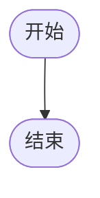

# 智能体执行报告

**Agent**: Fullstack Project Generator
**意图**: 生成 task_api 项目
**执行时间**: 2025-12-18T23:30:42.248853
**耗时**: 1572.0615694522858 秒
**追踪ID**: `tr_d1a4cf67f66b`

**用户输入**:
> 
一个任务管理系统 API，包含以下功能：

1. 项目管理
   - 创建、编辑、删除项目
   - 项目成员管理
   - 项目状态（进行中、已完成、已归档）

2. 任务管理
   - 创建、编辑、删除任务
   - 任务属性（标题、描述、优先级、截止日期）
   - 任务状态（待办、进行中、已完成）
   - 任务分配给成员
   - 子任务支持

3. 标签系统
   - 创建、编辑、删除标签
   - 任务可以有多个标签

4. 评论和附件
   - 任务评论
   - 任务附件上传

5. 业务规则
   - 只有项目成员可以查看/编辑项目内的任务
   - 完成所有子任务后父任务自动完成
   - 删除项目时删除所有相关任务

---

## 执行统计

| 指标 | 值 |
|------|-----|
| 总步骤数 | 6 |
| 已执行 | 6 |
| 成功 | 6 |
| 失败 | 0 |
| 成功率 | 100.0% |

## LLM 调用统计

| 指标 | 值 |
|------|-----|
| 总调用次数 | 55 |
| 总 Token 数 | 194,689 |
| Prompt Tokens | 124,417 |
| Response Tokens | 70,272 |

**按调用目的分类**:

| 目的 | 调用次数 | Token 数 |
|------|----------|----------|
| 其他 | 42 | 89,675 |
| 参数构造 | 13 | 105,014 |

## 执行流程

## 步骤详情

## 项目信息

- **项目名称**: task_api
- **输出目录**: `C:\Users\xiaoshuyui\github_repo\auto_agent\examples\fullstack_generator\output\task_api`

## 生成文件

- `models.py`
- `service.py`
- `router.py`
- `test_api.py`
