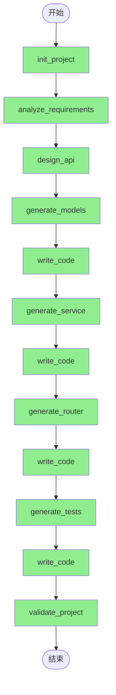

# 智能体执行报告

**Agent**: Fullstack Project Generator
**意图**: 一个能够自主规划和生成完整 REST API 项目的智能体
**执行时间**: 2025-12-21T20:59:09.587870
**耗时**: None 秒
**追踪ID**: `tr_5b0c10dfcbbf`

**用户输入**:
> 
一个任务管理系统 API，包含以下功能：

1. 项目管理
   - 创建、编辑、删除项目
   - 项目成员管理
   - 项目状态（进行中、已完成、已归档）

2. 任务管理
   - 创建、编辑、删除任务
   - 任务属性（标题、描述、优先级、截止日期）
   - 任务状态（待办、进行中、已完成）
   - 任务分配给成员
   - 子任务支持

3. 标签系统
   - 创建、编辑、删除标签
   - 任务可以有多个标签

4. 评论和附件
   - 任务评论
   - 任务附件上传

5. 业务规则
   - 只有项目成员可以查看/编辑项目内的任务
   - 完成所有子任务后父任务自动完成
   - 删除项目时删除所有相关任务

---

## 执行统计

| 指标 | 值 |
|------|-----|
| 总步骤数 | 12 |
| 已执行 | 12 |
| 成功 | 12 |
| 失败 | 0 |
| 成功率 | 100.0% |

## LLM 调用统计

| 指标 | 值 |
|------|-----|
| 总调用次数 | 42 |
| 总 Token 数 | 87,993 |
| Prompt Tokens | 53,614 |
| Response Tokens | 34,379 |

**按调用目的分类**:

| 目的 | 调用次数 | Token 数 |
|------|----------|----------|
| 其他 | 42 | 87,993 |

## 参数绑定统计

| 指标 | 值 |
|------|-----|
| 绑定规划次数 | 0 |
| 绑定解析次数 | 23 |
| LLM Fallback 次数 | 0 |
| 总绑定数 | 78 |
| 成功解析 | 78 |
| 需要 Fallback | 0 |
| 绑定成功率 | 100.0% |

## 一致性检查点

执行过程中注册的关键检查点，用于后续一致性验证和问题修正。

### 📍 1 [code]

- **步骤**: Step 1
- **关键元素**:
  - names: task_api
  - signatures: {}
  - structure: {'project_root': 'task_api', 'essential_files': ['__init__.py', 'README.md']}
- **约束条件**:
  - 后续步骤必须在 task_api 项目目录下进行开发
  - 必须保留 __init__.py 文件以确保 Python 包结构有效
  - 项目名称 'task_api' 应在后续配置、导入路径和文档中保持一致

### 📍 2 [schema]

- **步骤**: Step 2
- **关键元素**:
  - names: Project, User, ProjectMember, Task
  - signatures: {}
  - structure: {'Project': {'id': 'string/uuid', 'name': 'string', 'description': 'string', 'status': 'enum', 'created_at': 'datetime', 'updated_at': 'datetime'}, 'User': {'id': 'string/uuid', 'username': 'string', 'email': 'string'}, 'ProjectMember': {'project_id': 'string/uuid', 'user_id': 'string/uuid', 'role': 'string'}, 'Task': {'id': 'string/uuid', 'project_id': 'string/uuid', 'parent_task_id': 'string/uuid', 'title': 'string', 'description': 'string', 'priority': 'enum', 'due_date': 'date'}}
- **约束条件**:
  - 所有后续数据模型（如数据库表、DTO、ORM类）必须包含上述实体及其字段定义
  - 字段类型（如 uuid、enum、datetime、date）和是否必填（required）必须与提取结果一致
  - 实体间关系（如 Task.project_id 关联 Project.id）需在后续设计中保持一致
  - 枚举值（如 Project.status、Task.priority）的具体取值范围需在后续步骤中明确定义并保持兼容

### 📍 3 [interface]

- **步骤**: Step 3
- **关键元素**:
  - names: /projects, /projects/{id}, /projects/{id}/members, /projects/{project_id}/members/{user_id}, /users, /users/{id}
  - signatures: {'GET /projects': 'request_params: {page: int, size: int, status: string}, response: ProjectListResponse', 'POST /projects': 'request_body: CreateProjectRequest, response: ProjectResponse', 'GET /projects/{id}': 'path_params: {id: int}, response: ProjectResponse', 'PUT /projects/{id}': 'path_params: {id: int}, request_body: UpdateProjectRequest, response: ProjectResponse', 'DELETE /projects/{id}': 'path_params: {id: int}, response: EmptyResponse', 'GET /projects/{id}/members': 'path_params: {id: int}, response: ProjectMemberListResponse', 'POST /projects/{id}/members': 'path_params: {id: int}, request_body: AddProjectMemberRequest, response: ProjectMemberResponse', 'DELETE /projects/{project_id}/members/{user_id}': 'path_params: {project_id: int, user_id: int}, response: EmptyResponse', 'GET /users': 'request_params: {page: int, size: int}, response: UserListResponse', 'POST /users': 'request_body: CreateUserRequest, response: UserResponse', 'GET /users/{id}': 'path_params: {id: int}, response: UserResponse'}
  - structure: {'base_path': '/api/v1', 'auth_required': True, 'response_schemas': ['ProjectListResponse', 'ProjectResponse', 'CreateProjectRequest', 'UpdateProjectRequest', 'EmptyResponse', 'ProjectMemberListResponse', 'ProjectMemberResponse', 'AddProjectMemberRequest', 'UserListResponse', 'CreateUserRequest', 'UserResponse']}
- **约束条件**:
  - 所有 API 端点必须以 /api/v1 为基路径
  - 所有接口必须要求身份认证（auth_required: true）
  - 路径参数（如 {id}、{project_id}、{user_id}）必须为整数类型
  - 请求参数和请求体结构必须与指定的 Schema 名称一致
  - 响应格式必须严格遵循对应的 response_schema 定义
  - ... 还有 1 条

### 📍 4 [code]

- **步骤**: Step 4
- **关键元素**:
  - names: BaseSchema, ProjectStatusEnum, ProjectBase, CreateProjectRequest, UpdateProjectRequest, ProjectResponse, ProjectListResponse, UserBase, CreateUserRequest, UpdateUserRequest
    ... 还有 1 个
  - signatures: {}
  - structure: {'BaseSchema': {'model_config': {'from_attributes': True}}, 'ProjectStatusEnum': ['IN_PROGRESS', 'COMPLETED', 'ARCHIVED'], 'ProjectBase': {'fields': {'name': 'str (required)', 'description': 'Optional[str]', 'status': 'ProjectStatusEnum (required)'}}, 'CreateProjectRequest': 'inherits ProjectBase, no additional fields', 'UpdateProjectRequest': {'fields': {'name': 'Optional[str]', 'description': 'Optional[str]', 'status': 'Optional[ProjectStatusEnum]'}}, 'ProjectResponse': {'inherits': 'ProjectBase', 'additional_fields': {'id': 'int (required)', 'created_at': 'datetime (required)', 'updated_at': 'datetime (required)'}}, 'ProjectListResponse': {'fields': {'items': 'List[ProjectResponse]', 'total': 'int', 'page': 'int', 'size': 'int'}}, 'UserBase': {'fields': {'username': 'str (required)', 'email': 'EmailStr (required)'}}, 'CreateUserRequest': 'inherits UserBase, no additional fields', 'UpdateUserRequest': {'fields': {'username': 'Optional[str]', 'email': 'Optional[EmailStr]'}}, 'UserResponse': {'inherits': 'UserBase', 'additional_fields': {'id': 'int (required)'}}}
- **约束条件**:
  - 所有后续使用这些模型的代码必须保持字段名称、类型和可选性一致
  - ProjectStatusEnum 的枚举值（'进行中', '已完成', '已归档'）不得更改，以免破坏 API 兼容性
  - BaseSchema 必须保留 model_config = {'from_attributes': True} 以支持 ORM 模式
  - 任何新增或修改模型都应遵循现有命名规范（如 *Request、*Response、*Base）
  - UserResponse 中的 id 字段必须为 int 类型且必填，ProjectResponse 同理

### 📍 5 [schema]

- **步骤**: Step 5
- **关键元素**:
  - names: 
  - signatures: {}
  - structure: {'file_path': 'C:\\Users\\xiaoshuyui\\github_repo\\auto_agent\\examples\\fullstack_generator\\output\\task_api\\models.py', 'filename': 'models.py', 'code_type': 'model'}
- **约束条件**:
  - 后续步骤中所有使用这些模型的地方必须与 models.py 中定义的字段名、类型和验证规则保持一致
  - 任何依赖该模型的接口或服务必须遵循其数据结构定义，不得擅自修改字段语义或类型

### 📍 6 [code]

- **步骤**: Step 6
- **关键元素**:
  - names: ProjectService, BaseService, NotFoundException, BadRequestException, ConflictException
  - signatures: {'ProjectService.get_projects': 'async def get_projects(self, page: int = 1, size: int = 10, status: Optional[str] = None) -> ProjectListResponse', 'ProjectService.create_project': 'async def create_project(self, request: CreateProjectRequest) -> ProjectResponse'}
  - structure: {'imports': ['BaseSchema', 'ProjectStatusEnum', 'CreateProjectRequest', 'UpdateProjectRequest', 'ProjectResponse', 'ProjectListResponse', 'UserBase', 'CreateUserRequest', 'UserResponse', 'TaskBase', 'CreateTaskRequest', 'TaskResponse', 'TagBase', 'CommentBase', 'AttachmentBase', 'EmptyResponse'], 'exception_classes': ['NotFoundException', 'BadRequestException', 'ConflictException'], 'base_class': 'BaseService'}
- **约束条件**:
  - 后续实现必须保留已定义的函数签名（包括参数名、类型注解和返回类型）
  - 所有服务类必须继承自 BaseService
  - 异常类型必须与已定义的自定义异常一致（如使用 NotFoundException 表示资源未找到）
  - 导入的模型类名称和结构不得更改，以确保类型兼容性

### 📍 7 [code]

- **步骤**: Step 7
- **关键元素**:
  - names: 
  - signatures: {}
  - structure: {}
- **约束条件**:
  - 后续步骤中若涉及调用或扩展该服务层，需遵循其内部定义的函数命名和参数约定
  - 任何对 service.py 的修改或引用必须保持与当前 253 行、7868 字节的代码结构兼容

### 📍 8 [code]

- **步骤**: Step 8
- **关键元素**:
  - names: router, get_projects, create_project, get_project, update_project, delete_project, get_users, create_user, get_user, update_user
    ... 还有 29 个
  - signatures: {}
  - structure: {'imports': {'models': ['ProjectListResponse', 'CreateProjectRequest', 'ProjectResponse', 'UpdateProjectRequest', 'EmptyResponse', 'ProjectMemberListResponse', 'AddProjectMemberRequest', 'ProjectMemberResponse', 'UserListResponse', 'CreateUserRequest', 'UserResponse', 'UpdateUserRequest', 'TaskListResponse', 'CreateTaskRequest', 'TaskResponse', 'UpdateTaskRequest', 'CreateSubtaskRequest', 'TagListResponse', 'CreateTagRequest', 'TagResponse', 'UpdateTagRequest', 'TaskTagResponse', 'AddTaskTagRequest', 'CommentListResponse', 'CreateCommentRequest', 'CommentResponse', 'UpdateCommentRequest', 'AttachmentListResponse', 'CreateAttachmentRequest', 'AttachmentResponse'], 'services': ['get_projects', 'create_project', 'get_project', 'update_project', 'delete_project', 'get_users', 'create_user', 'get_user', 'update_user', 'delete_user', 'get_project_members', 'add_project_member', 'remove_project_member', 'get_tasks', 'create_task', 'get_task', 'update_task', 'delete_task', 'get_project_tasks', 'get_subtasks', 'create_subtask', 'get_tags', 'create_tag', 'get_tag', 'update_tag', 'delete_tag', 'get_task_tags', 'add_task_tag', 'remove_task_tag', 'get_task_comments', 'create_comment', 'get_comment', 'update_comment', 'delete_comment', 'get_task_attachments', 'create_attachment', 'get_attachment', 'delete_attachment'], 'dependencies': ['get_current_user']}, 'router_config': {'type': 'APIRouter', 'dependencies': ['Depends(get_current_user)']}, 'routes': {'/projects': {'method': 'GET', 'response_model': 'ProjectListResponse'}}}
- **约束条件**:
  - 所有后续路由必须使用相同的 router 实例（已配置全局依赖 get_current_user）
  - 模型名称和结构必须与已导入的 models 保持一致
  - 服务函数名称必须与已导入的 services 列表匹配
  - 所有新添加的端点应遵循已展示的路由装饰器格式（如 @router.get(..., response_model=...)）
  - 认证依赖 get_current_user 必须在所有路由中生效（通过 router 级别依赖）

### 📍 9 [code]

- **步骤**: Step 9
- **关键元素**:
  - names: 
  - signatures: {}
  - structure: {'file_path': 'C:\\Users\\xiaoshuyui\\github_repo\\auto_agent\\examples\\fullstack_generator\\output\\task_api\\router.py', 'filename': 'router.py', 'code_type': 'router'}
- **约束条件**:
  - 后续步骤必须保持 router.py 文件路径和文件名不变
  - 后续步骤如需修改路由逻辑，必须兼容已生成的605行代码结构和15733字节的内容规模
  - 任何新增或修改的路由功能必须与现有 router 模块的代码风格和组织方式保持一致

### 📍 10 [code]

- **步骤**: Step 10
- **关键元素**:
  - names: ProjectStatusEnum, TaskStatusEnum, TaskPriorityEnum, EmptyResponse, test_user_data, test_project_data, test_task_data, test_tag_data, test_comment_data, test_attachment_data
    ... 还有 1 个
  - signatures: {'test_user_data': '() -> Dict[str, Any]', 'test_project_data': '() -> Dict[str, Any]', 'test_task_data': '() -> Dict[str, Any]', 'test_tag_data': '() -> Dict[str, Any]', 'test_comment_data': '() -> Dict[str, Any]', 'test_attachment_data': '() -> Dict[str, Any]', 'client': '() -> AsyncClient'}
  - structure: {'enums': ['ProjectStatusEnum', 'TaskStatusEnum', 'TaskPriorityEnum'], 'fixtures': ['test_user_data', 'test_project_data', 'test_task_data', 'test_tag_data', 'test_comment_data', 'test_attachment_data', 'client']}
- **约束条件**:
  - 后续步骤中若使用这些 fixture，必须保持其返回字段结构一致（如 test_task_data 必须包含 title、description、status、priority）
  - 枚举类的值（如 ACTIVE="active"）必须与实际 API 所期望的值保持一致
  - client fixture 使用 AsyncClient 且 base_url 为 "http://test"，后续集成需兼容此配置或明确覆盖
  - 所有 fixture 均为 pytest fixture，后续测试文件应基于相同命名和作用域使用

### 📍 11 [code]

- **步骤**: Step 11
- **关键元素**:
  - names: 
  - signatures: {}
  - structure: {'file_path': 'C:\\Users\\xiaoshuyui\\github_repo\\auto_agent\\examples\\fullstack_generator\\output\\task_api\\test_api.py', 'filename': 'test_api.py', 'code_type': 'test', 'line_count': 532}
- **约束条件**:
  - 后续步骤若修改或引用该测试文件，必须保持文件路径和文件名一致
  - 任何对被测 API 的变更必须同步更新此测试文件以确保测试有效性
  - 新增或删除 API 端点时，需在 test_api.py 中相应增删测试用例

### 📍 12 [code]

- **步骤**: Step 12
- **关键元素**:
  - names: ProjectMemberBase, AddProjectMemberRequest, TaskPriorityEnum, TaskStatusEnum, TaskBase, CreateTaskRequest, ProjectService, update_pr, list_projects, get_projects
    ... 还有 1 个
  - signatures: {'list_projects': 'def list_projects(..., size: int = ..., ...)', 'update_pr': 'async def update_pr(self, ...)', 'ProjectService.create_project': 'async def create_project(self, project_data: CreateProjectRequest) -> Project', 'ProjectService.update_pr': 'async def update_pr(self, pr_id: int, updates: UpdatePRRequest) -> PullRequest'}
  - structure: {'models': ['ProjectMember', 'Task', 'Tag', 'Comment', 'Attachment'], 'service_layer_pattern': 'class-based with instance methods (e.g., ProjectService)', 'routing_integration': 'should use dependency injection (e.g., FastAPI Depends) to access service instances'}
- **约束条件**:
  - 所有在服务和路由中引用的模型类（如 ProjectMemberBase、TaskBase 等）必须在模型代码中完整定义。
  - 服务层必须统一采用类方法形式（如 ProjectService 的实例方法），路由层应通过依赖注入获取服务实例，不得直接导入顶层函数。
  - 所有被截断的函数（如 update_pr、list_projects）必须补全语法，确保参数注解和函数体完整。
  - 项目和用户 ID 必须统一使用 int 类型，贯穿模型、服务、路由及数据库设计。

## ⚠️ 一致性违规

执行过程中检测到的一致性问题，可用于后续修正。

| 严重程度 | 检查点 | 问题描述 | 建议 |
|----------|--------|----------|------|
| 🔴 critical | 3 | 检查点 [3] 明确规定路径参数（如 {id}、{project_id}、{user_id}）必须为 | 统一路径参数与模型主键类型：要么将 API 路径参数 {id |
| 🔴 critical | 4 | ProjectStatusEnum 的枚举值使用了中文（'进行中', '已完成', '已归档'），但 | 将 ProjectStatusEnum 的值修改为对应的英文 |
| 🔴 critical | 4 | 代码在 UpdateProjectRequest 中截断（'Fie' 而非 'Field'），导致语 | 补全 UpdateProjectRequest 的定义，确保 |
| 🟡 warning | 2 | 数据模型中缺少对 created_at 和 updated_at 字段的定义，而检查点 [2] 要求 | 在 ProjectBase 或 ProjectRespons |
| 🔴 critical | 3 | 当前步骤中 /projects GET 接口的 request_params 中 status 字段 | 将 request_params 中的 status 类型修 |
| 🔴 critical | 3 | 历史检查点 [3] 明确规定所有 API 路径参数（如 {id}、{project_id}、{use | 确认服务层实现中所有路径参数（如 project_id、us |
| 🟡 warning | 2 | 数据模型 [2] 中定义 Project.id、User.id 等为 'string/uuid'，但 | 在服务层或 API 路由层进行类型转换：API 接收整数 I |
| 🟡 warning | 4 | 当前步骤引入了多个新模型（如 UserListResponse、ProjectMemberBase、 | 确认新增枚举（如 TaskStatusEnum、TaskPr |
| 🔴 critical | 3 | 历史检查点 [3] 明确规定路径参数（如 {id}、{project_id}、{user_id}）必 | 统一 ID 类型：要么将 API 路径参数改为 UUID 字 |
| 🟡 warning | 5 | 当前代码从 models 模块导入了多个未在历史检查点 [4] 或 [5] 中明确定义的模型，例如  | 确保所有新引入的 Pydantic 模型（如 *ListRe |
| 🔴 critical | 3 | 当前步骤中路径参数 {id} 被定义为整数类型（'id': 'int'），但历史检查点 [2] 和  | 将路径参数 {id} 的类型从 int 改为 str（或 U |
| 🟡 warning | 3 | 当前步骤未体现 '/api/v1' 基路径。根据检查点 [3] 的约束，所有 API 端点必须以 / | 在 FastAPI 路由器中设置 prefix='/api/ |
| 🟡 warning | 4 | 响应结构中使用了未在历史检查点 [4] 中定义的 'EmptyResponse'。该模型未在 Pyd | 要么在 models.py 中明确定义 EmptyRespo |
| 🔴 critical | 3 | 历史检查点 [3] 明确规定所有 API 路径参数（如 {id}、{project_id}、{use | 统一主键类型：要么将接口规范中的路径参数类型从 int 改为 |
| 🟡 warning | 8 | 当前代码片段中 from service 导入不完整（截断为 'from service'），未明确 | 补全 service 模块的导入语句，例如：from ser |
| 🔴 critical | 3 | 当前步骤中路径参数 {id} 被描述为整数类型（'id': 'int'），但历史检查点 [2] 和  | 统一 ID 类型：若 API 路径参数需保持为整数，则数据模 |
| 🔴 critical | 3 | 当前步骤未体现所有 API 端点以 /api/v1 为基路径。生成的测试用例直接使用 /projec | 在生成测试用例时，应将完整路径构造为 /api/v1/pro |
| 🟡 warning | 4 | DELETE /projects/{id} 的响应结构被指定为 'EmptyResponse'，但历 | 明确定义 EmptyResponse（例如一个空 Pydan |
| 🔴 critical | 2 | Project 实体在历史检查点 [2] 中定义的 status 字段应为枚举类型，其值包括 'IN | 将 ProjectStatusEnum 的枚举值修改为与检查 |
| 🔴 critical | 4 | 检查点 [4] 明确规定 ProjectStatusenum 的枚举值必须为 ['IN_PROGRE | 更新 test_api.py 中的 ProjectStatu |
| 🟡 warning | 10 | 虽然检查点 [10] 提到测试代码中包含 ProjectStatusEnum，但其预期值应与实际 A | 同步测试中的枚举定义与主代码库中的 ProjectStatu |
| 🔴 critical | 3 | 历史检查点 [3] 明确规定路径参数（如 {id}、{project_id}、{user_id}）必 | 统一 ID 类型：要么将 API 路径参数改为字符串类型（如 |
| 🟡 warning | 4 | 当前提供的 models_code 片段中 UpdateProjectRequest 继承自 Bas | 确认 UpdateProjectRequest 中 name |

## 🧠 工作记忆

执行过程中提取的设计决策、约束和待办事项。

### 设计决策

- **[Step 1]** 项目名称确定为 task_api
  - 理由: 执行结果中明确指定了 project_name 为 task_api，表明项目命名已固定
- **[Step 1]** 项目根目录路径已确定
  - 理由: project_dir 已生成，后续所有文件操作应基于该路径进行
- **[Step 2]** 将系统建模为包含 Project、User、ProjectMember、Task 等核心实体的结构
  - 理由: 需求描述明确要求支持项目、任务、用户、标签、评论和附件管理，此实体划分能覆盖基本业务范围
- **[Step 2]** 使用 UUID 作为实体主键（如 Project.id、User.id、Task.id）
  - 理由: 提高分布式系统兼容性和安全性，避免自增 ID 泄露信息
- **[Step 2]** Project 和 User 通过中间实体 ProjectMember 建立多对多关系
  - 理由: 支持灵活的成员管理，并可附加角色等元数据
- **[Step 2]** Task 支持层级结构（通过 parent_task_id 实现子任务）
  - 理由: 满足复杂任务分解的业务需求
- **[Step 3]** 采用 RESTful 风格设计 API，以 /api/v1 为统一基础路径
  - 理由: 确保接口风格一致、可预测，并符合行业标准
- **[Step 3]** 所有 API 端点均要求身份认证（auth_required: true）
  - 理由: 保障系统安全性，防止未授权访问
- **[Step 3]** 使用资源嵌套路径（如 /projects/{id}/members）表示子资源关系
  - 理由: 清晰表达项目与成员之间的从属关系，符合 RESTful 资源建模规范
- **[Step 4]** 使用 Pydantic BaseModel 作为所有模型的基类，并启用 from_attributes 配置
  - 理由: 支持从 ORM 对象自动转换为 Pydantic 模型，提升与数据库层的兼容性
- ... 还有 10 条决策

### 约束条件

- 所有后续生成的文件必须位于 C:\Users\xiaoshuyui\github_repo\auto_agent\examples\fullstack_generator\output\task_api 目录下
  - 来源: 1
- 项目结构需保持 Python 包兼容性（已创建 __init__.py）
  - 来源: 1
- 所有实体必须包含 id 字段，类型为 string/uuid，且为必填
  - 来源: 2
- Project.status 必须是枚举值：进行中、已完成、已归档
  - 来源: 2
- Task.priority 必须是枚举值（如：低、中、高）
  - 来源: 2
- Task 必须关联到一个 Project（project_id 为必填）
  - 来源: 2
- 所有实体需包含 created_at 和 updated_at 时间戳字段（至少 Project 已明确）
  - 来源: 2
- 所有端点必须位于 /api/v1 基础路径下
  - 来源: 3
- 每个端点必须实现指定的请求参数、路径参数或请求体结构
  - 来源: 3
- 所有响应必须遵循指定的响应 Schema（如 ProjectResponse、UserListResponse 等）
  - 来源: 3
- ... 还有 21 条约束

### 接口定义

- **GET /api/v1/projects** (api)
- **POST /api/v1/projects** (api)
- **GET /api/v1/projects/{id}** (api)
- **PUT /api/v1/projects/{id}** (api)
- **DELETE /api/v1/projects/{id}** (api)
- **GET /api/v1/projects/{id}/members** (api)
- **POST /api/v1/projects/{id}/members** (api)
- **DELETE /api/v1/projects/{project_id}/members/{user_id}** (api)
- **GET /api/v1/users** (api)
- **POST /api/v1/users** (api)
- ... 还有 18 个接口

### 待办事项

- ⏳ [normal] 完善 README.md 内容
- ⏳ [high] 在 task_api 项目中继续添加模块、配置文件、依赖声明等基础组件
- ⏳ [high] 补充 Tag、Comment、Attachment 实体的完整定义（当前执行结果被截断，未包含这些实体）
- ⏳ [normal] 明确 Task.due_date 的格式和时区处理规则
- ⏳ [normal] 定义 ProjectMember.role 的允许值或是否应为枚举
- ⏳ [high] 提取并形式化业务规则（例如任务状态流转、权限控制等）
- ⏳ [high] 定义 CreateProjectRequest、UpdateProjectRequest、AddProjectMemberRequest、CreateUserRequest 等请求体 Schema
- ⏳ [high] 定义 ProjectListResponse、ProjectResponse、ProjectMemberListResponse、UserListResponse、UserResponse、EmptyResponse 等响应 Schema
- ⏳ [high] 补充缺失的 UserResponse 定义（执行结果被截断）
- ⏳ [high] 补全 UserResponse 模型中被截断的字段定义（如 id、created_at 等）
- ... 还有 15 条待办

## 执行流程

## 步骤详情

### ✅ 步骤 1: init_project

- **描述**: 初始化项目目录结构，创建 task_api 项目的基础文件夹和 __init__.py 文件
- **期望**: 成功创建 task_api 项目目录，包含 models/、services/、routers/、tests/ 等子目录和必要的 __init__.py 文件
- **状态**: success

### ✅ 步骤 2: analyze_requirements

- **描述**: 分析用户提供的需求描述，提取实体（Project、Task、Tag、Comment、Attachment、User）、关系和业务规则
- **期望**: 准确识别出所有核心实体及其属性，明确实体间的关系（如 Project-Task 一对多，Task-Tag 多对多等），并完整捕获业务规则
- **状态**: success

### ✅ 步骤 3: design_api

- **描述**: 基于提取的实体和关系，设计符合 RESTful 规范的 API 端点和对应的请求/响应 Schema
- **期望**: 生成完整的 CRUD 端点（如 POST /projects, GET /tasks/{task_id} 等），每个端点有清晰的路径、方法、参数和 Schema 定义
- **状态**: success

### ✅ 步骤 4: generate_models

- **描述**: 根据实体定义和 API Schema 生成类型安全的 Pydantic 模型代码
- **期望**: 生成包含 Project、Task、Tag、Comment、Attachment、User 等模型的代码，使用 int 类型 ID，正确处理嵌套关系和枚举（如状态、优先级）
- **状态**: success

### ✅ 步骤 5: write_code

- **描述**: 将生成的 Pydantic 模型代码写入 models.py 文件
- **期望**: 成功将模型代码写入 task_api/models.py，包含适当的注释和类型注解
- **状态**: success

### ✅ 步骤 6: generate_service

- **描述**: 基于模型类名和 API 端点生成服务层业务逻辑代码
- **期望**: 生成包含 create_project、update_task、add_tag_to_task 等方法的服务类，实现业务规则（如子任务完成自动完成父任务）
- **状态**: success

### ✅ 步骤 7: write_code

- **描述**: 将生成的服务层代码写入 service.py 文件
- **期望**: 成功将服务代码写入 task_api/services/service.py，方法签名与 API 端点对应
- **状态**: success

### ✅ 步骤 8: generate_router

- **描述**: 基于 API 端点和服务方法生成 FastAPI 路由代码
- **期望**: 生成正确的 FastAPI 路由装饰器（@app.post, @app.get 等），正确调用服务层方法，使用正确的请求/响应模型
- **状态**: success

### ✅ 步骤 9: write_code

- **描述**: 将生成的路由代码写入 router.py 文件
- **期望**: 成功将路由代码写入 task_api/routers/router.py，包含必要的导入语句
- **状态**: success

### ✅ 步骤 10: generate_tests

- **描述**: 基于 API 端点生成 pytest 测试用例
- **期望**: 生成覆盖主要 CRUD 操作的测试用例，使用正确的测试数据和断言
- **状态**: success

### ✅ 步骤 11: write_code

- **描述**: 将生成的测试代码写入 test_api.py 文件
- **期望**: 成功将测试代码写入 task_api/tests/test_api.py，包含必要的 fixture 和 mock
- **状态**: success

### ✅ 步骤 12: validate_project

- **描述**: 验证生成的模型、服务、路由代码之间的一致性和完整性
- **期望**: 确认所有层使用相同的类名和方法名，ID 类型为 int，无缺失的依赖或不一致的接口
- **状态**: success

## 项目信息

- **项目名称**: task_api
- **输出目录**: `C:\Users\xiaoshuyui\github_repo\auto_agent\examples\fullstack_generator\output\task_api`

## 生成文件

- `models.py`
- `service.py`
- `router.py`
- `test_api.py`
