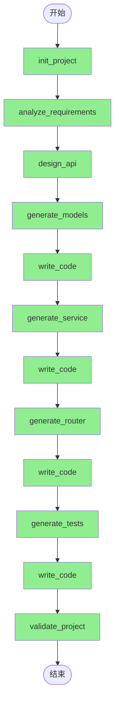

# 智能体执行报告

**Agent**: Fullstack Project Generator
**意图**: 一个能够自主规划和生成完整 REST API 项目的智能体
**执行时间**: 2025-12-21T20:59:09.591755
**耗时**: None 秒
**追踪ID**: `tr_5b0c10dfcbbf`

**用户输入**:
> 
一个任务管理系统 API，包含以下功能：

1. 项目管理
   - 创建、编辑、删除项目
   - 项目成员管理
   - 项目状态（进行中、已完成、已归档）

2. 任务管理
   - 创建、编辑、删除任务
   - 任务属性（标题、描述、优先级、截止日期）
   - 任务状态（待办、进行中、已完成）
   - 任务分配给成员
   - 子任务支持

3. 标签系统
   - 创建、编辑、删除标签
   - 任务可以有多个标签

4. 评论和附件
   - 任务评论
   - 任务附件上传

5. 业务规则
   - 只有项目成员可以查看/编辑项目内的任务
   - 完成所有子任务后父任务自动完成
   - 删除项目时删除所有相关任务


---

## 执行统计

| 指标 | 值 |
|------|-----|
| 总步骤数 | 12 |
| 已执行 | 12 |
| 成功 | 12 |
| 失败 | 0 |
| 成功率 | 100.0% |

## LLM 调用统计

| 指标 | 值 |
|------|-----|
| 总调用次数 | 42 |
| 总 Token 数 | 87,993 |
| Prompt Tokens | 53,614 |
| Response Tokens | 34,379 |

**按调用目的分类**:

| 目的 | 调用次数 | Token 数 |
|------|----------|----------|
| 其他 | 42 | 87,993 |

## 参数绑定统计

| 指标 | 值 |
|------|-----|
| 绑定规划次数 | 0 |
| 绑定解析次数 | 23 |
| LLM Fallback 次数 | 0 |
| 总绑定数 | 78 |
| 成功解析 | 78 |
| 需要 Fallback | 0 |
| 绑定成功率 | 100.0% |

## 一致性检查点

执行过程中注册的关键检查点，用于后续一致性验证和问题修正。

### 📍 1 [code]

- **步骤**: Step 1
- **关键元素**:
  - names: task_api
  - signatures: {}
  - structure: {'project_root': 'task_api', 'essential_files': ['__init__.py', 'README.md']}
- **约束条件**:
  - 后续步骤必须在 task_api 项目目录下进行开发
  - 必须保留 __init__.py 文件以确保 Python 包结构有效
  - 项目名称 'task_api' 应在后续配置、导入路径和文档中保持一致

### 📍 2 [schema]

- **步骤**: Step 2
- **关键元素**:
  - names: Project, User, ProjectMember, Task
  - signatures: {}
  - structure: {'Project': {'id': 'string/uuid', 'name': 'string', 'description': 'string', 'status': 'enum', 'created_at': 'datetime', 'updated_at': 'datetime'}, 'User': {'id': 'string/uuid', 'username': 'string', 'email': 'string'}, 'ProjectMember': {'project_id': 'string/uuid', 'user_id': 'string/uuid', 'role': 'string'}, 'Task': {'id': 'string/uuid', 'project_id': 'string/uuid', 'parent_task_id': 'string/uuid', 'title': 'string', 'description': 'string', 'priority': 'enum', 'due_date': 'date'}}
- **约束条件**:
  - 所有后续数据模型（如数据库表、DTO、ORM类）必须包含上述实体及其字段定义
  - 字段类型（如 uuid、enum、datetime、date）和是否必填（required）必须与提取结果一致
  - 实体间关系（如 Task.project_id 关联 Project.id）需在后续设计中保持一致
  - 枚举值（如 Project.status、Task.priority）的具体取值范围需在后续步骤中明确定义并保持兼容

### 📍 3 [interface]

- **步骤**: Step 3
- **关键元素**:
  - names: /projects, /projects/{id}, /projects/{id}/members, /projects/{project_id}/members/{user_id}, /users, /users/{id}
  - signatures: {'GET /projects': 'request_params: {page: int, size: int, status: string}, response: ProjectListResponse', 'POST /projects': 'request_body: CreateProjectRequest, response: ProjectResponse', 'GET /projects/{id}': 'path_params: {id: int}, response: ProjectResponse', 'PUT /projects/{id}': 'path_params: {id: int}, request_body: UpdateProjectRequest, response: ProjectResponse', 'DELETE /projects/{id}': 'path_params: {id: int}, response: EmptyResponse', 'GET /projects/{id}/members': 'path_params: {id: int}, response: ProjectMemberListResponse', 'POST /projects/{id}/members': 'path_params: {id: int}, request_body: AddProjectMemberRequest, response: ProjectMemberResponse', 'DELETE /projects/{project_id}/members/{user_id}': 'path_params: {project_id: int, user_id: int}, response: EmptyResponse', 'GET /users': 'request_params: {page: int, size: int}, response: UserListResponse', 'POST /users': 'request_body: CreateUserRequest, response: UserResponse', 'GET /users/{id}': 'path_params: {id: int}, response: UserResponse'}
  - structure: {'base_path': '/api/v1', 'auth_required': True, 'response_schemas': ['ProjectListResponse', 'ProjectResponse', 'CreateProjectRequest', 'UpdateProjectRequest', 'EmptyResponse', 'ProjectMemberListResponse', 'ProjectMemberResponse', 'AddProjectMemberRequest', 'UserListResponse', 'CreateUserRequest', 'UserResponse']}
- **约束条件**:
  - 所有 API 端点必须以 /api/v1 为基路径
  - 所有接口必须要求身份认证（auth_required: true）
  - 路径参数（如 {id}、{project_id}、{user_id}）必须为整数类型
  - 请求参数和请求体结构必须与指定的 Schema 名称一致
  - 响应格式必须严格遵循对应的 response_schema 定义
  - ... 还有 1 条

### 📍 4 [code]

- **步骤**: Step 4
- **关键元素**:
  - names: BaseSchema, ProjectStatusEnum, ProjectBase, CreateProjectRequest, UpdateProjectRequest, ProjectResponse, ProjectListResponse, UserBase, CreateUserRequest, UpdateUserRequest
    ... 还有 1 个
  - signatures: {}
  - structure: {'BaseSchema': {'model_config': {'from_attributes': True}}, 'ProjectStatusEnum': ['IN_PROGRESS', 'COMPLETED', 'ARCHIVED'], 'ProjectBase': {'fields': {'name': 'str (required)', 'description': 'Optional[str]', 'status': 'ProjectStatusEnum (required)'}}, 'CreateProjectRequest': 'inherits ProjectBase, no additional fields', 'UpdateProjectRequest': {'fields': {'name': 'Optional[str]', 'description': 'Optional[str]', 'status': 'Optional[ProjectStatusEnum]'}}, 'ProjectResponse': {'inherits': 'ProjectBase', 'additional_fields': {'id': 'int (required)', 'created_at': 'datetime (required)', 'updated_at': 'datetime (required)'}}, 'ProjectListResponse': {'fields': {'items': 'List[ProjectResponse]', 'total': 'int', 'page': 'int', 'size': 'int'}}, 'UserBase': {'fields': {'username': 'str (required)', 'email': 'EmailStr (required)'}}, 'CreateUserRequest': 'inherits UserBase, no additional fields', 'UpdateUserRequest': {'fields': {'username': 'Optional[str]', 'email': 'Optional[EmailStr]'}}, 'UserResponse': {'inherits': 'UserBase', 'additional_fields': {'id': 'int (required)'}}}
- **约束条件**:
  - 所有后续使用这些模型的代码必须保持字段名称、类型和可选性一致
  - ProjectStatusEnum 的枚举值（'进行中', '已完成', '已归档'）不得更改，以免破坏 API 兼容性
  - BaseSchema 必须保留 model_config = {'from_attributes': True} 以支持 ORM 模式
  - 任何新增或修改模型都应遵循现有命名规范（如 *Request、*Response、*Base）
  - UserResponse 中的 id 字段必须为 int 类型且必填，ProjectResponse 同理

### 📍 5 [schema]

- **步骤**: Step 5
- **关键元素**:
  - names: 
  - signatures: {}
  - structure: {'file_path': 'C:\\Users\\xiaoshuyui\\github_repo\\auto_agent\\examples\\fullstack_generator\\output\\task_api\\models.py', 'filename': 'models.py', 'code_type': 'model'}
- **约束条件**:
  - 后续步骤中所有使用这些模型的地方必须与 models.py 中定义的字段名、类型和验证规则保持一致
  - 任何依赖该模型的接口或服务必须遵循其数据结构定义，不得擅自修改字段语义或类型

### 📍 6 [code]

- **步骤**: Step 6
- **关键元素**:
  - names: ProjectService, BaseService, NotFoundException, BadRequestException, ConflictException
  - signatures: {'ProjectService.get_projects': 'async def get_projects(self, page: int = 1, size: int = 10, status: Optional[str] = None) -> ProjectListResponse', 'ProjectService.create_project': 'async def create_project(self, request: CreateProjectRequest) -> ProjectResponse'}
  - structure: {'imports': ['BaseSchema', 'ProjectStatusEnum', 'CreateProjectRequest', 'UpdateProjectRequest', 'ProjectResponse', 'ProjectListResponse', 'UserBase', 'CreateUserRequest', 'UserResponse', 'TaskBase', 'CreateTaskRequest', 'TaskResponse', 'TagBase', 'CommentBase', 'AttachmentBase', 'EmptyResponse'], 'exception_classes': ['NotFoundException', 'BadRequestException', 'ConflictException'], 'base_class': 'BaseService'}
- **约束条件**:
  - 后续实现必须保留已定义的函数签名（包括参数名、类型注解和返回类型）
  - 所有服务类必须继承自 BaseService
  - 异常类型必须与已定义的自定义异常一致（如使用 NotFoundException 表示资源未找到）
  - 导入的模型类名称和结构不得更改，以确保类型兼容性

### 📍 7 [code]

- **步骤**: Step 7
- **关键元素**:
  - names: 
  - signatures: {}
  - structure: {}
- **约束条件**:
  - 后续步骤中若涉及调用或扩展该服务层，需遵循其内部定义的函数命名和参数约定
  - 任何对 service.py 的修改或引用必须保持与当前 253 行、7868 字节的代码结构兼容

### 📍 8 [code]

- **步骤**: Step 8
- **关键元素**:
  - names: router, get_projects, create_project, get_project, update_project, delete_project, get_users, create_user, get_user, update_user
    ... 还有 29 个
  - signatures: {}
  - structure: {'imports': {'models': ['ProjectListResponse', 'CreateProjectRequest', 'ProjectResponse', 'UpdateProjectRequest', 'EmptyResponse', 'ProjectMemberListResponse', 'AddProjectMemberRequest', 'ProjectMemberResponse', 'UserListResponse', 'CreateUserRequest', 'UserResponse', 'UpdateUserRequest', 'TaskListResponse', 'CreateTaskRequest', 'TaskResponse', 'UpdateTaskRequest', 'CreateSubtaskRequest', 'TagListResponse', 'CreateTagRequest', 'TagResponse', 'UpdateTagRequest', 'TaskTagResponse', 'AddTaskTagRequest', 'CommentListResponse', 'CreateCommentRequest', 'CommentResponse', 'UpdateCommentRequest', 'AttachmentListResponse', 'CreateAttachmentRequest', 'AttachmentResponse'], 'services': ['get_projects', 'create_project', 'get_project', 'update_project', 'delete_project', 'get_users', 'create_user', 'get_user', 'update_user', 'delete_user', 'get_project_members', 'add_project_member', 'remove_project_member', 'get_tasks', 'create_task', 'get_task', 'update_task', 'delete_task', 'get_project_tasks', 'get_subtasks', 'create_subtask', 'get_tags', 'create_tag', 'get_tag', 'update_tag', 'delete_tag', 'get_task_tags', 'add_task_tag', 'remove_task_tag', 'get_task_comments', 'create_comment', 'get_comment', 'update_comment', 'delete_comment', 'get_task_attachments', 'create_attachment', 'get_attachment', 'delete_attachment'], 'dependencies': ['get_current_user']}, 'router_config': {'type': 'APIRouter', 'dependencies': ['Depends(get_current_user)']}, 'routes': {'/projects': {'method': 'GET', 'response_model': 'ProjectListResponse'}}}
- **约束条件**:
  - 所有后续路由必须使用相同的 router 实例（已配置全局依赖 get_current_user）
  - 模型名称和结构必须与已导入的 models 保持一致
  - 服务函数名称必须与已导入的 services 列表匹配
  - 所有新添加的端点应遵循已展示的路由装饰器格式（如 @router.get(..., response_model=...)）
  - 认证依赖 get_current_user 必须在所有路由中生效（通过 router 级别依赖）

### 📍 9 [code]

- **步骤**: Step 9
- **关键元素**:
  - names: 
  - signatures: {}
  - structure: {'file_path': 'C:\\Users\\xiaoshuyui\\github_repo\\auto_agent\\examples\\fullstack_generator\\output\\task_api\\router.py', 'filename': 'router.py', 'code_type': 'router'}
- **约束条件**:
  - 后续步骤必须保持 router.py 文件路径和文件名不变
  - 后续步骤如需修改路由逻辑，必须兼容已生成的605行代码结构和15733字节的内容规模
  - 任何新增或修改的路由功能必须与现有 router 模块的代码风格和组织方式保持一致

### 📍 10 [code]

- **步骤**: Step 10
- **关键元素**:
  - names: ProjectStatusEnum, TaskStatusEnum, TaskPriorityEnum, EmptyResponse, test_user_data, test_project_data, test_task_data, test_tag_data, test_comment_data, test_attachment_data
    ... 还有 1 个
  - signatures: {'test_user_data': '() -> Dict[str, Any]', 'test_project_data': '() -> Dict[str, Any]', 'test_task_data': '() -> Dict[str, Any]', 'test_tag_data': '() -> Dict[str, Any]', 'test_comment_data': '() -> Dict[str, Any]', 'test_attachment_data': '() -> Dict[str, Any]', 'client': '() -> AsyncClient'}
  - structure: {'enums': ['ProjectStatusEnum', 'TaskStatusEnum', 'TaskPriorityEnum'], 'fixtures': ['test_user_data', 'test_project_data', 'test_task_data', 'test_tag_data', 'test_comment_data', 'test_attachment_data', 'client']}
- **约束条件**:
  - 后续步骤中若使用这些 fixture，必须保持其返回字段结构一致（如 test_task_data 必须包含 title、description、status、priority）
  - 枚举类的值（如 ACTIVE="active"）必须与实际 API 所期望的值保持一致
  - client fixture 使用 AsyncClient 且 base_url 为 "http://test"，后续集成需兼容此配置或明确覆盖
  - 所有 fixture 均为 pytest fixture，后续测试文件应基于相同命名和作用域使用

### 📍 11 [code]

- **步骤**: Step 11
- **关键元素**:
  - names: 
  - signatures: {}
  - structure: {'file_path': 'C:\\Users\\xiaoshuyui\\github_repo\\auto_agent\\examples\\fullstack_generator\\output\\task_api\\test_api.py', 'filename': 'test_api.py', 'code_type': 'test', 'line_count': 532}
- **约束条件**:
  - 后续步骤若修改或引用该测试文件，必须保持文件路径和文件名一致
  - 任何对被测 API 的变更必须同步更新此测试文件以确保测试有效性
  - 新增或删除 API 端点时，需在 test_api.py 中相应增删测试用例

### 📍 12 [code]

- **步骤**: Step 12
- **关键元素**:
  - names: ProjectMemberBase, AddProjectMemberRequest, TaskPriorityEnum, TaskStatusEnum, TaskBase, CreateTaskRequest, ProjectService, update_pr, list_projects, get_projects
    ... 还有 1 个
  - signatures: {'list_projects': 'def list_projects(..., size: int = ..., ...)', 'update_pr': 'async def update_pr(self, ...)', 'ProjectService.create_project': 'async def create_project(self, project_data: CreateProjectRequest) -> Project', 'ProjectService.update_pr': 'async def update_pr(self, pr_id: int, updates: UpdatePRRequest) -> PullRequest'}
  - structure: {'models': ['ProjectMember', 'Task', 'Tag', 'Comment', 'Attachment'], 'service_layer_pattern': 'class-based with instance methods (e.g., ProjectService)', 'routing_integration': 'should use dependency injection (e.g., FastAPI Depends) to access service instances'}
- **约束条件**:
  - 所有在服务和路由中引用的模型类（如 ProjectMemberBase、TaskBase 等）必须在模型代码中完整定义。
  - 服务层必须统一采用类方法形式（如 ProjectService 的实例方法），路由层应通过依赖注入获取服务实例，不得直接导入顶层函数。
  - 所有被截断的函数（如 update_pr、list_projects）必须补全语法，确保参数注解和函数体完整。
  - 项目和用户 ID 必须统一使用 int 类型，贯穿模型、服务、路由及数据库设计。

## ⚠️ 一致性违规

执行过程中检测到的一致性问题，可用于后续修正。

| 严重程度 | 检查点 | 问题描述 | 建议 |
|----------|--------|----------|------|
| 🔴 critical | 3 | 检查点 [3] 明确规定路径参数（如 {id}、{project_id}、{user_id}）必须为 | 统一路径参数与模型主键类型：要么将 API 路径参数 {id |
| 🔴 critical | 4 | ProjectStatusEnum 的枚举值使用了中文（'进行中', '已完成', '已归档'），但 | 将 ProjectStatusEnum 的值修改为对应的英文 |
| 🔴 critical | 4 | 代码在 UpdateProjectRequest 中截断（'Fie' 而非 'Field'），导致语 | 补全 UpdateProjectRequest 的定义，确保 |
| 🟡 warning | 2 | 数据模型中缺少对 created_at 和 updated_at 字段的定义，而检查点 [2] 要求 | 在 ProjectBase 或 ProjectRespons |
| 🔴 critical | 3 | 当前步骤中 /projects GET 接口的 request_params 中 status 字段 | 将 request_params 中的 status 类型修 |
| 🔴 critical | 3 | 历史检查点 [3] 明确规定所有 API 路径参数（如 {id}、{project_id}、{use | 确认服务层实现中所有路径参数（如 project_id、us |
| 🟡 warning | 2 | 数据模型 [2] 中定义 Project.id、User.id 等为 'string/uuid'，但 | 在服务层或 API 路由层进行类型转换：API 接收整数 I |
| 🟡 warning | 4 | 当前步骤引入了多个新模型（如 UserListResponse、ProjectMemberBase、 | 确认新增枚举（如 TaskStatusEnum、TaskPr |
| 🔴 critical | 3 | 历史检查点 [3] 明确规定路径参数（如 {id}、{project_id}、{user_id}）必 | 统一 ID 类型：要么将 API 路径参数改为 UUID 字 |
| 🟡 warning | 5 | 当前代码从 models 模块导入了多个未在历史检查点 [4] 或 [5] 中明确定义的模型，例如  | 确保所有新引入的 Pydantic 模型（如 *ListRe |
| 🔴 critical | 3 | 当前步骤中路径参数 {id} 被定义为整数类型（'id': 'int'），但历史检查点 [2] 和  | 将路径参数 {id} 的类型从 int 改为 str（或 U |
| 🟡 warning | 3 | 当前步骤未体现 '/api/v1' 基路径。根据检查点 [3] 的约束，所有 API 端点必须以 / | 在 FastAPI 路由器中设置 prefix='/api/ |
| 🟡 warning | 4 | 响应结构中使用了未在历史检查点 [4] 中定义的 'EmptyResponse'。该模型未在 Pyd | 要么在 models.py 中明确定义 EmptyRespo |
| 🔴 critical | 3 | 历史检查点 [3] 明确规定所有 API 路径参数（如 {id}、{project_id}、{use | 统一主键类型：要么将接口规范中的路径参数类型从 int 改为 |
| 🟡 warning | 8 | 当前代码片段中 from service 导入不完整（截断为 'from service'），未明确 | 补全 service 模块的导入语句，例如：from ser |
| 🔴 critical | 3 | 当前步骤中路径参数 {id} 被描述为整数类型（'id': 'int'），但历史检查点 [2] 和  | 统一 ID 类型：若 API 路径参数需保持为整数，则数据模 |
| 🔴 critical | 3 | 当前步骤未体现所有 API 端点以 /api/v1 为基路径。生成的测试用例直接使用 /projec | 在生成测试用例时，应将完整路径构造为 /api/v1/pro |
| 🟡 warning | 4 | DELETE /projects/{id} 的响应结构被指定为 'EmptyResponse'，但历 | 明确定义 EmptyResponse（例如一个空 Pydan |
| 🔴 critical | 2 | Project 实体在历史检查点 [2] 中定义的 status 字段应为枚举类型，其值包括 'IN | 将 ProjectStatusEnum 的枚举值修改为与检查 |
| 🔴 critical | 4 | 检查点 [4] 明确规定 ProjectStatusenum 的枚举值必须为 ['IN_PROGRE | 更新 test_api.py 中的 ProjectStatu |
| 🟡 warning | 10 | 虽然检查点 [10] 提到测试代码中包含 ProjectStatusEnum，但其预期值应与实际 A | 同步测试中的枚举定义与主代码库中的 ProjectStatu |
| 🔴 critical | 3 | 历史检查点 [3] 明确规定路径参数（如 {id}、{project_id}、{user_id}）必 | 统一 ID 类型：要么将 API 路径参数改为字符串类型（如 |
| 🟡 warning | 4 | 当前提供的 models_code 片段中 UpdateProjectRequest 继承自 Bas | 确认 UpdateProjectRequest 中 name |

## 🧠 工作记忆

执行过程中提取的设计决策、约束和待办事项。

### 设计决策

- **[Step 1]** 项目名称确定为 task_api
  - 理由: 执行结果中明确指定了 project_name 为 task_api，表明项目命名已固定
- **[Step 1]** 项目根目录路径已确定
  - 理由: project_dir 已生成，后续所有文件操作应基于该路径进行
- **[Step 2]** 将系统建模为包含 Project、User、ProjectMember、Task 等核心实体的结构
  - 理由: 需求描述明确要求支持项目、任务、用户、标签、评论和附件管理，此实体划分能覆盖基本业务范围
- **[Step 2]** 使用 UUID 作为实体主键（如 Project.id、User.id、Task.id）
  - 理由: 提高分布式系统兼容性和安全性，避免自增 ID 泄露信息
- **[Step 2]** Project 和 User 通过中间实体 ProjectMember 建立多对多关系
  - 理由: 支持灵活的成员管理，并可附加角色等元数据
- **[Step 2]** Task 支持层级结构（通过 parent_task_id 实现子任务）
  - 理由: 满足复杂任务分解的业务需求
- **[Step 3]** 采用 RESTful 风格设计 API，以 /api/v1 为统一基础路径
  - 理由: 确保接口风格一致、可预测，并符合行业标准
- **[Step 3]** 所有 API 端点均要求身份认证（auth_required: true）
  - 理由: 保障系统安全性，防止未授权访问
- **[Step 3]** 使用资源嵌套路径（如 /projects/{id}/members）表示子资源关系
  - 理由: 清晰表达项目与成员之间的从属关系，符合 RESTful 资源建模规范
- **[Step 4]** 使用 Pydantic BaseModel 作为所有模型的基类，并启用 from_attributes 配置
  - 理由: 支持从 ORM 对象自动转换为 Pydantic 模型，提升与数据库层的兼容性
- ... 还有 10 条决策

### 约束条件

- 所有后续生成的文件必须位于 C:\Users\xiaoshuyui\github_repo\auto_agent\examples\fullstack_generator\output\task_api 目录下
  - 来源: 1
- 项目结构需保持 Python 包兼容性（已创建 __init__.py）
  - 来源: 1
- 所有实体必须包含 id 字段，类型为 string/uuid，且为必填
  - 来源: 2
- Project.status 必须是枚举值：进行中、已完成、已归档
  - 来源: 2
- Task.priority 必须是枚举值（如：低、中、高）
  - 来源: 2
- Task 必须关联到一个 Project（project_id 为必填）
  - 来源: 2
- 所有实体需包含 created_at 和 updated_at 时间戳字段（至少 Project 已明确）
  - 来源: 2
- 所有端点必须位于 /api/v1 基础路径下
  - 来源: 3
- 每个端点必须实现指定的请求参数、路径参数或请求体结构
  - 来源: 3
- 所有响应必须遵循指定的响应 Schema（如 ProjectResponse、UserListResponse 等）
  - 来源: 3
- ... 还有 21 条约束

### 接口定义

- **GET /api/v1/projects** (api)
- **POST /api/v1/projects** (api)
- **GET /api/v1/projects/{id}** (api)
- **PUT /api/v1/projects/{id}** (api)
- **DELETE /api/v1/projects/{id}** (api)
- **GET /api/v1/projects/{id}/members** (api)
- **POST /api/v1/projects/{id}/members** (api)
- **DELETE /api/v1/projects/{project_id}/members/{user_id}** (api)
- **GET /api/v1/users** (api)
- **POST /api/v1/users** (api)
- ... 还有 18 个接口

### 待办事项

- ⏳ [normal] 完善 README.md 内容
- ⏳ [high] 在 task_api 项目中继续添加模块、配置文件、依赖声明等基础组件
- ⏳ [high] 补充 Tag、Comment、Attachment 实体的完整定义（当前执行结果被截断，未包含这些实体）
- ⏳ [normal] 明确 Task.due_date 的格式和时区处理规则
- ⏳ [normal] 定义 ProjectMember.role 的允许值或是否应为枚举
- ⏳ [high] 提取并形式化业务规则（例如任务状态流转、权限控制等）
- ⏳ [high] 定义 CreateProjectRequest、UpdateProjectRequest、AddProjectMemberRequest、CreateUserRequest 等请求体 Schema
- ⏳ [high] 定义 ProjectListResponse、ProjectResponse、ProjectMemberListResponse、UserListResponse、UserResponse、EmptyResponse 等响应 Schema
- ⏳ [high] 补充缺失的 UserResponse 定义（执行结果被截断）
- ⏳ [high] 补全 UserResponse 模型中被截断的字段定义（如 id、created_at 等）
- ... 还有 15 条待办

## 执行流程



## 步骤详情

### ✅ 步骤 1: init_project

- **描述**: 初始化项目目录结构，创建 task_api 项目的基础文件夹和 __init__.py 文件
- **期望**: 成功创建 task_api 项目目录，包含 models/、services/、routers/、tests/ 等子目录和必要的 __init__.py 文件
- **状态**: success

### ✅ 步骤 2: analyze_requirements

- **描述**: 分析用户提供的需求描述，提取实体（Project、Task、Tag、Comment、Attachment、User）、关系和业务规则
- **期望**: 准确识别出所有核心实体及其属性，明确实体间的关系（如 Project-Task 一对多，Task-Tag 多对多等），并完整捕获业务规则
- **状态**: success

### ✅ 步骤 3: design_api

- **描述**: 基于提取的实体和关系，设计符合 RESTful 规范的 API 端点和对应的请求/响应 Schema
- **期望**: 生成完整的 CRUD 端点（如 POST /projects, GET /tasks/{task_id} 等），每个端点有清晰的路径、方法、参数和 Schema 定义
- **状态**: success

### ✅ 步骤 4: generate_models

- **描述**: 根据实体定义和 API Schema 生成类型安全的 Pydantic 模型代码
- **期望**: 生成包含 Project、Task、Tag、Comment、Attachment、User 等模型的代码，使用 int 类型 ID，正确处理嵌套关系和枚举（如状态、优先级）
- **状态**: success

### ✅ 步骤 5: write_code

- **描述**: 将生成的 Pydantic 模型代码写入 models.py 文件
- **期望**: 成功将模型代码写入 task_api/models.py，包含适当的注释和类型注解
- **状态**: success

### ✅ 步骤 6: generate_service

- **描述**: 基于模型类名和 API 端点生成服务层业务逻辑代码
- **期望**: 生成包含 create_project、update_task、add_tag_to_task 等方法的服务类，实现业务规则（如子任务完成自动完成父任务）
- **状态**: success

### ✅ 步骤 7: write_code

- **描述**: 将生成的服务层代码写入 service.py 文件
- **期望**: 成功将服务代码写入 task_api/services/service.py，方法签名与 API 端点对应
- **状态**: success

### ✅ 步骤 8: generate_router

- **描述**: 基于 API 端点和服务方法生成 FastAPI 路由代码
- **期望**: 生成正确的 FastAPI 路由装饰器（@app.post, @app.get 等），正确调用服务层方法，使用正确的请求/响应模型
- **状态**: success

### ✅ 步骤 9: write_code

- **描述**: 将生成的路由代码写入 router.py 文件
- **期望**: 成功将路由代码写入 task_api/routers/router.py，包含必要的导入语句
- **状态**: success

### ✅ 步骤 10: generate_tests

- **描述**: 基于 API 端点生成 pytest 测试用例
- **期望**: 生成覆盖主要 CRUD 操作的测试用例，使用正确的测试数据和断言
- **状态**: success

### ✅ 步骤 11: write_code

- **描述**: 将生成的测试代码写入 test_api.py 文件
- **期望**: 成功将测试代码写入 task_api/tests/test_api.py，包含必要的 fixture 和 mock
- **状态**: success

### ✅ 步骤 12: validate_project

- **描述**: 验证生成的模型、服务、路由代码之间的一致性和完整性
- **期望**: 确认所有层使用相同的类名和方法名，ID 类型为 int，无缺失的依赖或不一致的接口
- **状态**: success


---

## 详细追踪日志

  - 🤖 **LLM调用** [other]
    - 模型: qwen3-max
    - Tokens: 576 (7689.8ms)
    - **Prompt**:
      ```
      [user]: 分析这一步的执行结果，提取需要后续步骤遵守的信息。
      
      【步骤信息】
      工具: init_project
      描述: 初始化项目目录结构，创建 task_api 项目的基础文件夹和 __init__.py 文件
      
      【执行结果】
      {"success": true, "project_name": "task_api", "project_dir": "C:\\Users\\xiaoshuyui\\github_repo\\auto_agent\\examples\\fullstack_generator\\output\\task_api", "created_files": ["__init__.py", "README.md"]}
      
      【任务】
      从执行结果中提取以下信息（如果有的话）：
      
      1. 设计决策：这一步做出了什么重要决定？
      2. 约束条件：后续步骤必须遵守什么规则？
      3. 待办事项：这一步产生了什么需要后续处理的任务？
      4. 接口定义：这一步定义了什么接口/契约？
      
      请返回 JSON（只包含有内容的字段）：
      ```json
      {
          "decisions": [
              {"decision": "决策内容", "reason": "决策理由"}
          ],
          "constraints": [
              {"constraint": "约束内容", "priority": "critical/high/normal/low"}
          ],
          "todos": [
              {"todo": "待办内容", "priority": "high/normal/low"}
          ],
          "interfaces": [
              {"name": "接口名", "type": "function/api/schema", "definition": {...}}
          ]
      }
      ```
      
      如果没有需要提取的信息，返回空对象 {}
      ```
    - **Response**:
      ```
      ```json
      {
          "decisions": [
              {
                  "decision": "项目名称确定为 task_api",
                  "reason": "执行结果中明确指定了 project_name 为 task_api，表明项目命名已固定"
              },
              {
                  "decision": "项目根目录路径已确定",
                  "reason": "project_dir 已生成，后续所有文件操作应基于该路径进行"
              }
          ],
          "constraints": [
              {
                  "constraint": "所有后续生成的文件必须位于 C:\\Users\\xiaoshuyui\\github_repo\\auto_agent\\examples\\fullstack_generator\\output\\task_api 目录下",
                  "priority": "critical"
              },
              {
                  "constraint": "项目结构需保持 Python 包兼容性（已创建 __init__.py）",
                  "priority": "high"
              }
          ],
          "todos": [
              {
                  "todo": "完善 README.md 内容",
                  "priority": "normal"
              },
              {
                  "todo": "在 task_api 项目中继续添加模块、配置文件、依赖声明等基础组件",
                  "priority": "high"
              }
          ]
      }
      ```
      ```

  - 🤖 **LLM调用** [other]
    - 模型: qwen3-max
    - Tokens: 535 (5600.0ms)
    - **Prompt**:
      ```
      [user]: 分析这一步的执行结果，提取需要后续步骤保持一致的关键元素。
      
      【步骤信息】
      工具: init_project
      描述: 初始化项目目录结构，创建 task_api 项目的基础文件夹和 __init__.py 文件
      
      【执行结果】
      {"success": true, "project_name": "task_api", "project_dir": "C:\\Users\\xiaoshuyui\\github_repo\\auto_agent\\examples\\fullstack_generator\\output\\task_api", "created_files": ["__init__.py", "README.md"]}
      
      【任务】
      从执行结果中提取以下信息：
      
      1. 产物类型：这一步产出了什么类型的内容？
         - code: 代码（函数、类、模块）
         - interface: 接口定义（API、函数签名）
         - schema: 数据结构定义
         - config: 配置文件
         - document: 文档（大纲、报告）
      
      2. 关键元素：后续步骤需要保持一致的关键信息
         - 如果是代码：函数名、参数列表、返回类型
         - 如果是接口：端点、请求/响应格式
         - 如果是文档：章节结构、关键术语
      
      3. 后续约束：后续步骤必须遵守的规则
      
      请返回 JSON：
      ```json
      {
          "artifact_type": "code/interface/schema/config/document",
          "description": "简短描述这个检查点",
          "key_elements": {
              "names": ["函数名/接口名/..."],
              "signatures": {"name": "签名"},
              "structure": {...}
          },
          "constraints": [
              "后续步骤必须遵守的约束1",
              "后续步骤必须遵守的约束2"
          ]
      }
      ```
      
      如果这一步没有产出需要保持一致的内容，返回 {"skip": true}
      ```
    - **Response**:
      ```
      ```json
      {
          "artifact_type": "code",
          "description": "初始化项目目录结构，创建基础文件夹和 __init__.py 文件",
          "key_elements": {
              "names": ["task_api"],
              "signatures": {},
              "structure": {
                  "project_root": "task_api",
                  "essential_files": ["__init__.py", "README.md"]
              }
          },
          "constraints": [
              "后续步骤必须在 task_api 项目目录下进行开发",
              "必须保留 __init__.py 文件以确保 Python 包结构有效",
              "项目名称 'task_api' 应在后续配置、导入路径和文档中保持一致"
          ]
      }
      ```
      ```

  - 🤖 **LLM调用** [other]
    - 模型: qwen3-max
    - Tokens: 1,467 (17200.9ms)
    - **Prompt**:
      ```
      [user]: 分析这一步的执行结果，提取需要后续步骤遵守的信息。
      
      【步骤信息】
      工具: analyze_requirements
      描述: 分析用户提供的需求描述，提取实体（Project、Task、Tag、Comment、Attachment、User）、关系和业务规则
      
      【执行结果】
      {"project_name": "task_management_api", "description": "一个任务管理系统 API，支持项目、任务、标签、评论和附件管理，并包含特定业务规则。", "entities": [{"name": "Project", "description": "代表一个项目，包含基本信息和状态。", "fields": [{"name": "id", "type": "string/uuid", "required": true, "description": "项目唯一标识符"}, {"name": "name", "type": "string", "required": true, "description": "项目名称"}, {"name": "description", "type": "string", "required": false, "description": "项目描述"}, {"name": "status", "type": "enum", "required": true, "description": "项目状态：进行中、已完成、已归档"}, {"name": "created_at", "type": "datetime", "required": true, "description": "创建时间"}, {"name": "updated_at", "type": "datetime", "required": true, "description": "最后更新时间"}]}, {"name": "User", "description": "系统用户，可被添加为项目成员。", "fields": [{"name": "id", "type": "string/uuid", "required": true, "description": "用户唯一标识符"}, {"name": "username", "type": "string", "required": true, "description": "用户名"}, {"name": "email", "type": "string", "required": true, "description": "用户邮箱"}]}, {"name": "ProjectMember", "description": "项目与用户的关联关系，表示某用户是某项目的成员。", "fields": [{"name": "project_id", "type": "string/uuid", "required": true, "description": "所属项目ID"}, {"name": "user_id", "type": "string/uuid", "required": true, "description": "成员用户ID"}, {"name": "role", "type": "string", "required": false, "description": "成员在项目中的角色（可选）"}]}, {"name": "Task", "description": "项目中的任务，可分配给成员，具有状态和属性。", "fields": [{"name": "id", "type": "string/uuid", "required": true, "description": "任务唯一标识符"}, {"name": "project_id", "type": "string/uuid", "required": true, "description": "所属项目ID"}, {"name": "parent_task_id", "type": "string/uuid", "required": false, "description": "父任务ID（用于子任务）"}, {"name": "title", "type": "string", "required": true, "description": "任务标题"}, {"name": "description", "type": "string", "required": false, "description": "任务描述"}, {"name": "priority", "type": "enum", "required": true, "description": "任务优先级（如：低、中、高）"}, {"name": "due_date", "type": "date", "required": false, "descript
      
      【任务】
      从执行结果中提取以下信息（如果有的话）：
      
      1. 设计决策：这一步做出了什么重要决定？
      2. 约束条件：后续步骤必须遵守什么规则？
      3. 待办事项：这一步产生了什么需要后续处理的任务？
      4. 接口定义：这一步定义了什么接口/契约？
      
      请返回 JSON（只包含有内容的字段）：
      ```json
      {
          "decisions": [
              {"decision": "决策内容", "reason": "决策理由"}
          ],
          "constraints": [
              {"constraint": "约束内容", "priority": "critical/high/normal/low"}
          ],
          "todos": [
              {"todo": "待办内容", "priority": "high/normal/low"}
          ],
          "interfaces": [
              {"name": "接口名", "type": "function/api/schema", "definition": {...}}
          ]
      }
      ```
      
      如果没有需要提取的信息，返回空对象 {}
      ```
    - **Response**:
      ```
      ```json
      {
          "decisions": [
              {
                  "decision": "将系统建模为包含 Project、User、ProjectMember、Task 等核心实体的结构",
                  "reason": "需求描述明确要求支持项目、任务、用户、标签、评论和附件管理，此实体划分能覆盖基本业务范围"
              },
              {
                  "decision": "使用 UUID 作为实体主键（如 Project.id、User.id、Task.id）",
                  "reason": "提高分布式系统兼容性和安全性，避免自增 ID 泄露信息"
              },
              {
                  "decision": "Project 和 User 通过中间实体 ProjectMember 建立多对多关系",
                  "reason": "支持灵活的成员管理，并可附加角色等元数据"
              },
              {
                  "decision": "Task 支持层级结构（通过 parent_task_id 实现子任务）",
                  "reason": "满足复杂任务分解的业务需求"
              }
          ],
          "constraints": [
              {
                  "constraint": "所有实体必须包含 id 字段，类型为 string/uuid，且为必填",
                  "priority": "critical"
              },
              {
                  "constraint": "Project.status 必须是枚举值：进行中、已完成、已归档",
                  "priority": "high"
              },
              {
                  "constraint": "Task.priority 必须是枚举值（如：低、中、高）",
                  "priority": "high"
              },
              {
                  "constraint": "Task 必须关联到一个 Project（project_id 为必填）",
                  "priority": "critical"
              },
              {
                  "constraint": "所有实体需包含 created_at 和 updated_at 时间戳字段（至少 Project 已明确）",
                  "priority": "normal"
              }
          ],
          "todos": [
              {
                  "todo": "补充 Tag、Comment、Attachment 实体的完整定义（当前执行结果被截断，未包含这些实体）",
                  "priority": "high"
              },
              {
                  "todo": "明确 Task.due_date 的格式和时区处理规则",
                  "priority": "normal"
              },
              {
                  "todo": "定义 ProjectMember.role 的允许值或是否应为枚举",
                  "priority": "normal"
              },
              {
                  "todo": "提取并形式化业务规则（例如任务状态流转、权限控制等）",
                  "priority": "high"
              }
          ]
      }
      ```
      ```

  - 🤖 **LLM调用** [other]
    - 模型: qwen3-max
    - Tokens: 1,363 (12639.4ms)
    - **Prompt**:
      ```
      [user]: 分析这一步的执行结果，提取需要后续步骤保持一致的关键元素。
      
      【步骤信息】
      工具: analyze_requirements
      描述: 分析用户提供的需求描述，提取实体（Project、Task、Tag、Comment、Attachment、User）、关系和业务规则
      
      【执行结果】
      {"project_name": "task_management_api", "description": "一个任务管理系统 API，支持项目、任务、标签、评论和附件管理，并包含特定业务规则。", "entities": [{"name": "Project", "description": "代表一个项目，包含基本信息和状态。", "fields": [{"name": "id", "type": "string/uuid", "required": true, "description": "项目唯一标识符"}, {"name": "name", "type": "string", "required": true, "description": "项目名称"}, {"name": "description", "type": "string", "required": false, "description": "项目描述"}, {"name": "status", "type": "enum", "required": true, "description": "项目状态：进行中、已完成、已归档"}, {"name": "created_at", "type": "datetime", "required": true, "description": "创建时间"}, {"name": "updated_at", "type": "datetime", "required": true, "description": "最后更新时间"}]}, {"name": "User", "description": "系统用户，可被添加为项目成员。", "fields": [{"name": "id", "type": "string/uuid", "required": true, "description": "用户唯一标识符"}, {"name": "username", "type": "string", "required": true, "description": "用户名"}, {"name": "email", "type": "string", "required": true, "description": "用户邮箱"}]}, {"name": "ProjectMember", "description": "项目与用户的关联关系，表示某用户是某项目的成员。", "fields": [{"name": "project_id", "type": "string/uuid", "required": true, "description": "所属项目ID"}, {"name": "user_id", "type": "string/uuid", "required": true, "description": "成员用户ID"}, {"name": "role", "type": "string", "required": false, "description": "成员在项目中的角色（可选）"}]}, {"name": "Task", "description": "项目中的任务，可分配给成员，具有状态和属性。", "fields": [{"name": "id", "type": "string/uuid", "required": true, "description": "任务唯一标识符"}, {"name": "project_id", "type": "string/uuid", "required": true, "description": "所属项目ID"}, {"name": "parent_task_id", "type": "string/uuid", "required": false, "description": "父任务ID（用于子任务）"}, {"name": "title", "type": "string", "required": true, "description": "任务标题"}, {"name": "description", "type": "string", "required": false, "description": "任务描述"}, {"name": "priority", "type": "enum", "required": true, "description": "任务优先级（如：低、中、高）"}, {"name": "due_date", "type": "date", "required": false, "descript
      
      【任务】
      从执行结果中提取以下信息：
      
      1. 产物类型：这一步产出了什么类型的内容？
         - code: 代码（函数、类、模块）
         - interface: 接口定义（API、函数签名）
         - schema: 数据结构定义
         - config: 配置文件
         - document: 文档（大纲、报告）
      
      2. 关键元素：后续步骤需要保持一致的关键信息
         - 如果是代码：函数名、参数列表、返回类型
         - 如果是接口：端点、请求/响应格式
         - 如果是文档：章节结构、关键术语
      
      3. 后续约束：后续步骤必须遵守的规则
      
      请返回 JSON：
      ```json
      {
          "artifact_type": "code/interface/schema/config/document",
          "description": "简短描述这个检查点",
          "key_elements": {
              "names": ["函数名/接口名/..."],
              "signatures": {"name": "签名"},
              "structure": {...}
          },
          "constraints": [
              "后续步骤必须遵守的约束1",
              "后续步骤必须遵守的约束2"
          ]
      }
      ```
      
      如果这一步没有产出需要保持一致的内容，返回 {"skip": true}
      ```
    - **Response**:
      ```
      ```json
      {
          "artifact_type": "schema",
          "description": "从需求中提取的核心数据模型定义，包括实体、字段及其属性",
          "key_elements": {
              "names": ["Project", "User", "ProjectMember", "Task"],
              "signatures": {},
              "structure": {
                  "Project": {
                      "id": "string/uuid",
                      "name": "string",
                      "description": "string",
                      "status": "enum",
                      "created_at": "datetime",
                      "updated_at": "datetime"
                  },
                  "User": {
                      "id": "string/uuid",
                      "username": "string",
                      "email": "string"
                  },
                  "ProjectMember": {
                      "project_id": "string/uuid",
                      "user_id": "string/uuid",
                      "role": "string"
                  },
                  "Task": {
                      "id": "string/uuid",
                      "project_id": "string/uuid",
                      "parent_task_id": "string/uuid",
                      "title": "string",
                      "description": "string",
                      "priority": "enum",
                      "due_date": "date"
                  }
              }
          },
          "constraints": [
              "所有后续数据模型（如数据库表、DTO、ORM类）必须包含上述实体及其字段定义",
              "字段类型（如 uuid、enum、datetime、date）和是否必填（required）必须与提取结果一致",
              "实体间关系（如 Task.project_id 关联 Project.id）需在后续设计中保持一致",
              "枚举值（如 Project.status、Task.priority）的具体取值范围需在后续步骤中明确定义并保持兼容"
          ]
      }
      ```
      ```

  - 🤖 **LLM调用** [other]
    - 模型: qwen3-max
    - Tokens: 2,145 (31880.1ms)
    - **Prompt**:
      ```
      [user]: 分析这一步的执行结果，提取需要后续步骤遵守的信息。
      
      【步骤信息】
      工具: design_api
      描述: 基于提取的实体和关系，设计符合 RESTful 规范的 API 端点和对应的请求/响应 Schema
      
      【执行结果】
      {"base_path": "/api/v1", "endpoints": [{"path": "/projects", "method": "GET", "description": "获取项目列表", "request_params": {"page": "int", "size": "int", "status": "string"}, "response_schema": "ProjectListResponse", "auth_required": true}, {"path": "/projects", "method": "POST", "description": "创建新项目", "request_body": "CreateProjectRequest", "response_schema": "ProjectResponse", "auth_required": true}, {"path": "/projects/{id}", "method": "GET", "description": "获取单个项目详情", "path_params": {"id": "int"}, "response_schema": "ProjectResponse", "auth_required": true}, {"path": "/projects/{id}", "method": "PUT", "description": "更新项目信息", "path_params": {"id": "int"}, "request_body": "UpdateProjectRequest", "response_schema": "ProjectResponse", "auth_required": true}, {"path": "/projects/{id}", "method": "DELETE", "description": "删除项目", "path_params": {"id": "int"}, "response_schema": "EmptyResponse", "auth_required": true}, {"path": "/projects/{id}/members", "method": "GET", "description": "获取项目成员列表", "path_params": {"id": "int"}, "response_schema": "ProjectMemberListResponse", "auth_required": true}, {"path": "/projects/{id}/members", "method": "POST", "description": "向项目添加成员", "path_params": {"id": "int"}, "request_body": "AddProjectMemberRequest", "response_schema": "ProjectMemberResponse", "auth_required": true}, {"path": "/projects/{project_id}/members/{user_id}", "method": "DELETE", "description": "从项目中移除成员", "path_params": {"project_id": "int", "user_id": "int"}, "response_schema": "EmptyResponse", "auth_required": true}, {"path": "/users", "method": "GET", "description": "获取用户列表", "request_params": {"page": "int", "size": "int"}, "response_schema": "UserListResponse", "auth_required": true}, {"path": "/users", "method": "POST", "description": "创建新用户", "request_body": "CreateUserRequest", "response_schema": "UserResponse", "auth_required": true}, {"path": "/users/{id}", "method": "GET", "description": "获取单个用户", "path_params": {"id": "int"}, "response_schema": "UserRes
      
      【任务】
      从执行结果中提取以下信息（如果有的话）：
      
      1. 设计决策：这一步做出了什么重要决定？
      2. 约束条件：后续步骤必须遵守什么规则？
      3. 待办事项：这一步产生了什么需要后续处理的任务？
      4. 接口定义：这一步定义了什么接口/契约？
      
      请返回 JSON（只包含有内容的字段）：
      ```json
      {
          "decisions": [
              {"decision": "决策内容", "reason": "决策理由"}
          ],
          "constraints": [
              {"constraint": "约束内容", "priority": "critical/high/normal/low"}
          ],
          "todos": [
              {"todo": "待办内容", "priority": "high/normal/low"}
          ],
          "interfaces": [
              {"name": "接口名", "type": "function/api/schema", "definition": {...}}
          ]
      }
      ```
      
      如果没有需要提取的信息，返回空对象 {}
      ```
    - **Response**:
      ```
      ```json
      {
          "decisions": [
              {
                  "decision": "采用 RESTful 风格设计 API，以 /api/v1 为统一基础路径",
                  "reason": "确保接口风格一致、可预测，并符合行业标准"
              },
              {
                  "decision": "所有 API 端点均要求身份认证（auth_required: true）",
                  "reason": "保障系统安全性，防止未授权访问"
              },
              {
                  "decision": "使用资源嵌套路径（如 /projects/{id}/members）表示子资源关系",
                  "reason": "清晰表达项目与成员之间的从属关系，符合 RESTful 资源建模规范"
              }
          ],
          "constraints": [
              {
                  "constraint": "所有端点必须位于 /api/v1 基础路径下",
                  "priority": "critical"
              },
              {
                  "constraint": "每个端点必须实现指定的请求参数、路径参数或请求体结构",
                  "priority": "critical"
              },
              {
                  "constraint": "所有响应必须遵循指定的响应 Schema（如 ProjectResponse、UserListResponse 等）",
                  "priority": "critical"
              },
              {
                  "constraint": "所有 API 必须实施身份认证机制",
                  "priority": "critical"
              }
          ],
          "todos": [
              {
                  "todo": "定义 CreateProjectRequest、UpdateProjectRequest、AddProjectMemberRequest、CreateUserRequest 等请求体 Schema",
                  "priority": "high"
              },
              {
                  "todo": "定义 ProjectListResponse、ProjectResponse、ProjectMemberListResponse、UserListResponse、UserResponse、EmptyResponse 等响应 Schema",
                  "priority": "high"
              },
              {
                  "todo": "补充缺失的 UserResponse 定义（执行结果被截断）",
                  "priority": "high"
              }
          ],
          "interfaces": [
              {
                  "name": "GET /api/v1/projects",
                  "type": "api",
                  "definition": {
                      "method": "GET",
                      "path": "/projects",
                      "request_params": {"page": "int", "size": "int", "status": "string"},
                      "response_schema": "ProjectListResponse",
                      "auth_required": true
                  }
              },
              {
                  "name": "POST /api/v1/projects",
                  "type": "api",
                  "definition": {
                      "method": "POST",
                      "path": "/projects",
                      "request_body": "CreateProjectRequest",
                      "response_schema": "ProjectResponse",
                      "auth_required": true
                  }
              },
              {
                  "name": "GET /api/v1/projects/{id}",
                  "type": "api",
                  "definition": {
                      "method": "GET",
                      "path": "/projects/{id}",
                      "path_params": {"id": "int"},
                      "response_schema": "ProjectResponse",
                      "auth_required": true
                  }
              },
              {
                  "name": "PUT /api/v1/projects/{id}",
                  "type": "api",
                  "definition": {
                      "method": "PUT",
                      "path": "/projects/{id}",
                      "path_params": {"id": "int"},
                      "request_body": "UpdateProjectRequest",
                      "response_schema": "ProjectResponse",
                      "auth_required": true
                  }
              },
              {
                  "name": "DELETE /api/v1/projects/{id}",
                  "type": "api",
                  "definition": {
                      "method": "DELETE",
                      "path": "/projects/{id}",
                      "path_params": {"id": "int"},
                      "response_schema": "EmptyResponse",
                      "auth_required": true
                  }
              },
              {
                  "name": "GET /api/v1/projects/{id}/members",
                  "type": "api",
                  "definition": {
                      "method": "GET",
                      "path": "/projects/{id}/members",
                      "path_params": {"id": "int"},
                      "response_schema": "ProjectMemberListResponse",
                      "auth_required": true
                  }
              },
              {
                  "name": "POST /api/v1/projects/{id}/members",
                  "type": "api",
                  "definition": {
                      "method": "POST",
                      "path": "/projects/{id}/members",
                      "path_params": {"id": "int"},
                      "request_body": "AddProjectMemberRequest",
                      "response_schema": "ProjectMemberResponse",
                      "auth_required": true
                  }
              },
              {
                  "name": "DELETE /api/v1/projects/{project_id}/members/{user_id}",
                  "type": "api",
                  "definition": {
                      "method": "DELETE",
                      "path": "/projects/{project_id}/members/{user_id}",
                      "path_params": {"project_id": "int", "user_id": "int"},
                      "response_schema": "EmptyResponse",
                      "auth_required": true
                  }
              },
              {
                  "name": "GET /api/v1/users",
                  "type": "api",
                  "definition": {
                      "method": "GET",
                      "path": "/users",
                      "request_params": {"page": "int", "size": "int"},
                      "response_schema": "UserListResponse",
                      "auth_required": true
                  }
              },
              {
                  "name": "POST /api/v1/users",
                  "type": "api",
                  "definition": {
                      "method": "POST",
                      "path": "/users",
                      "request_body": "CreateUserRequest",
                      "response_schema": "UserResponse",
                      "auth_required": true
                  }
              },
              {
                  "name": "GET /api/v1/users/{id}",
                  "type": "api",
                  "definition": {
                      "method": "GET",
                      "path": "/users/{id}",
                      "path_params": {"id": "int"},
                      "response_schema": "UserResponse",
                      "auth_required": true
                  }
              }
          ]
      }
      ```
      ```

  - 🤖 **LLM调用** [other]
    - 模型: qwen3-max
    - Tokens: 1,519 (16460.9ms)
    - **Prompt**:
      ```
      [user]: 分析这一步的执行结果，提取需要后续步骤保持一致的关键元素。
      
      【步骤信息】
      工具: design_api
      描述: 基于提取的实体和关系，设计符合 RESTful 规范的 API 端点和对应的请求/响应 Schema
      
      【执行结果】
      {"base_path": "/api/v1", "endpoints": [{"path": "/projects", "method": "GET", "description": "获取项目列表", "request_params": {"page": "int", "size": "int", "status": "string"}, "response_schema": "ProjectListResponse", "auth_required": true}, {"path": "/projects", "method": "POST", "description": "创建新项目", "request_body": "CreateProjectRequest", "response_schema": "ProjectResponse", "auth_required": true}, {"path": "/projects/{id}", "method": "GET", "description": "获取单个项目详情", "path_params": {"id": "int"}, "response_schema": "ProjectResponse", "auth_required": true}, {"path": "/projects/{id}", "method": "PUT", "description": "更新项目信息", "path_params": {"id": "int"}, "request_body": "UpdateProjectRequest", "response_schema": "ProjectResponse", "auth_required": true}, {"path": "/projects/{id}", "method": "DELETE", "description": "删除项目", "path_params": {"id": "int"}, "response_schema": "EmptyResponse", "auth_required": true}, {"path": "/projects/{id}/members", "method": "GET", "description": "获取项目成员列表", "path_params": {"id": "int"}, "response_schema": "ProjectMemberListResponse", "auth_required": true}, {"path": "/projects/{id}/members", "method": "POST", "description": "向项目添加成员", "path_params": {"id": "int"}, "request_body": "AddProjectMemberRequest", "response_schema": "ProjectMemberResponse", "auth_required": true}, {"path": "/projects/{project_id}/members/{user_id}", "method": "DELETE", "description": "从项目中移除成员", "path_params": {"project_id": "int", "user_id": "int"}, "response_schema": "EmptyResponse", "auth_required": true}, {"path": "/users", "method": "GET", "description": "获取用户列表", "request_params": {"page": "int", "size": "int"}, "response_schema": "UserListResponse", "auth_required": true}, {"path": "/users", "method": "POST", "description": "创建新用户", "request_body": "CreateUserRequest", "response_schema": "UserResponse", "auth_required": true}, {"path": "/users/{id}", "method": "GET", "description": "获取单个用户", "path_params": {"id": "int"}, "response_schema": "UserRes
      
      【任务】
      从执行结果中提取以下信息：
      
      1. 产物类型：这一步产出了什么类型的内容？
         - code: 代码（函数、类、模块）
         - interface: 接口定义（API、函数签名）
         - schema: 数据结构定义
         - config: 配置文件
         - document: 文档（大纲、报告）
      
      2. 关键元素：后续步骤需要保持一致的关键信息
         - 如果是代码：函数名、参数列表、返回类型
         - 如果是接口：端点、请求/响应格式
         - 如果是文档：章节结构、关键术语
      
      3. 后续约束：后续步骤必须遵守的规则
      
      请返回 JSON：
      ```json
      {
          "artifact_type": "code/interface/schema/config/document",
          "description": "简短描述这个检查点",
          "key_elements": {
              "names": ["函数名/接口名/..."],
              "signatures": {"name": "签名"},
              "structure": {...}
          },
          "constraints": [
              "后续步骤必须遵守的约束1",
              "后续步骤必须遵守的约束2"
          ]
      }
      ```
      
      如果这一步没有产出需要保持一致的内容，返回 {"skip": true}
      ```
    - **Response**:
      ```
      ```json
      {
          "artifact_type": "interface",
          "description": "定义了项目和用户管理的 RESTful API 接口规范，包括端点路径、HTTP 方法、请求参数/体、响应结构及认证要求",
          "key_elements": {
              "names": [
                  "/projects",
                  "/projects/{id}",
                  "/projects/{id}/members",
                  "/projects/{project_id}/members/{user_id}",
                  "/users",
                  "/users/{id}"
              ],
              "signatures": {
                  "GET /projects": "request_params: {page: int, size: int, status: string}, response: ProjectListResponse",
                  "POST /projects": "request_body: CreateProjectRequest, response: ProjectResponse",
                  "GET /projects/{id}": "path_params: {id: int}, response: ProjectResponse",
                  "PUT /projects/{id}": "path_params: {id: int}, request_body: UpdateProjectRequest, response: ProjectResponse",
                  "DELETE /projects/{id}": "path_params: {id: int}, response: EmptyResponse",
                  "GET /projects/{id}/members": "path_params: {id: int}, response: ProjectMemberListResponse",
                  "POST /projects/{id}/members": "path_params: {id: int}, request_body: AddProjectMemberRequest, response: ProjectMemberResponse",
                  "DELETE /projects/{project_id}/members/{user_id}": "path_params: {project_id: int, user_id: int}, response: EmptyResponse",
                  "GET /users": "request_params: {page: int, size: int}, response: UserListResponse",
                  "POST /users": "request_body: CreateUserRequest, response: UserResponse",
                  "GET /users/{id}": "path_params: {id: int}, response: UserResponse"
              },
              "structure": {
                  "base_path": "/api/v1",
                  "auth_required": true,
                  "response_schemas": [
                      "ProjectListResponse",
                      "ProjectResponse",
                      "CreateProjectRequest",
                      "UpdateProjectRequest",
                      "EmptyResponse",
                      "ProjectMemberListResponse",
                      "ProjectMemberResponse",
                      "AddProjectMemberRequest",
                      "UserListResponse",
                      "CreateUserRequest",
                      "UserResponse"
                  ]
              }
          },
          "constraints": [
              "所有 API 端点必须以 /api/v1 为基路径",
              "所有接口必须要求身份认证（auth_required: true）",
              "路径参数（如 {id}、{project_id}、{user_id}）必须为整数类型",
              "请求参数和请求体结构必须与指定的 Schema 名称一致",
              "响应格式必须严格遵循对应的 response_schema 定义",
              "不得修改已定义的端点路径、HTTP 方法或语义"
          ]
      }
      ```
      ```

  - 🤖 **LLM调用** [other]
    - 模型: qwen3-max
    - Tokens: 1,674 (25384.1ms)
    - **Prompt**:
      ```
      [user]: 分析这一步的执行结果，提取需要后续步骤遵守的信息。
      
      【步骤信息】
      工具: generate_models
      描述: 根据实体定义和 API Schema 生成类型安全的 Pydantic 模型代码
      
      【执行结果】
      {"success": true, "models_code": "from datetime import datetime, date\nfrom typing import Optional, List\nfrom pydantic import BaseModel, Field, EmailStr\n\n\nclass BaseSchema(BaseModel):\n    \"\"\"基础模型配置\"\"\"\n    model_config = {\"from_attributes\": True}\n\n\n# ======================\n# Project Models\n# ======================\n\nclass ProjectStatusEnum(str):\n    IN_PROGRESS = \"进行中\"\n    COMPLETED = \"已完成\"\n    ARCHIVED = \"已归档\"\n\n\nclass ProjectBase(BaseSchema):\n    name: str = Field(..., description=\"项目名称\")\n    description: Optional[str] = Field(None, description=\"项目描述\")\n    status: ProjectStatusEnum = Field(..., description=\"项目状态：进行中、已完成、已归档\")\n\n\nclass CreateProjectRequest(ProjectBase):\n    \"\"\"创建项目请求\"\"\"\n    pass\n\n\nclass UpdateProjectRequest(BaseSchema):\n    \"\"\"更新项目请求\"\"\"\n    name: Optional[str] = Field(None, description=\"项目名称\")\n    description: Optional[str] = Field(None, description=\"项目描述\")\n    status: Optional[ProjectStatusEnum] = Field(None, description=\"项目状态：进行中、已完成、已归档\")\n\n\nclass ProjectResponse(ProjectBase):\n    \"\"\"项目响应\"\"\"\n    id: int = Field(..., description=\"项目唯一标识符\")\n    created_at: datetime = Field(..., description=\"创建时间\")\n    updated_at: datetime = Field(..., description=\"最后更新时间\")\n\n\nclass ProjectListResponse(BaseSchema):\n    \"\"\"项目列表响应\"\"\"\n    items: List[ProjectResponse]\n    total: int\n    page: int\n    size: int\n\n\n# ======================\n# User Models\n# ======================\n\nclass UserBase(BaseSchema):\n    username: str = Field(..., description=\"用户名\")\n    email: EmailStr = Field(..., description=\"用户邮箱\")\n\n\nclass CreateUserRequest(UserBase):\n    \"\"\"创建用户请求\"\"\"\n    pass\n\n\nclass UpdateUserRequest(BaseSchema):\n    \"\"\"更新用户请求\"\"\"\n    username: Optional[str] = Field(None, description=\"用户名\")\n    email: Optional[EmailStr] = Field(None, description=\"用户邮箱\")\n\n\nclass UserResponse(UserBase):\n    \"\"\"用户响应\"\"\"\n    id: int = Field(..., descrip
      
      【任务】
      从执行结果中提取以下信息（如果有的话）：
      
      1. 设计决策：这一步做出了什么重要决定？
      2. 约束条件：后续步骤必须遵守什么规则？
      3. 待办事项：这一步产生了什么需要后续处理的任务？
      4. 接口定义：这一步定义了什么接口/契约？
      
      请返回 JSON（只包含有内容的字段）：
      ```json
      {
          "decisions": [
              {"decision": "决策内容", "reason": "决策理由"}
          ],
          "constraints": [
              {"constraint": "约束内容", "priority": "critical/high/normal/low"}
          ],
          "todos": [
              {"todo": "待办内容", "priority": "high/normal/low"}
          ],
          "interfaces": [
              {"name": "接口名", "type": "function/api/schema", "definition": {...}}
          ]
      }
      ```
      
      如果没有需要提取的信息，返回空对象 {}
      ```
    - **Response**:
      ```
      ```json
      {
          "decisions": [
              {
                  "decision": "使用 Pydantic BaseModel 作为所有模型的基类，并启用 from_attributes 配置",
                  "reason": "支持从 ORM 对象自动转换为 Pydantic 模型，提升与数据库层的兼容性"
              },
              {
                  "decision": "为项目状态定义枚举类 ProjectStatusEnum，限制其值为中文字符串（'进行中'、'已完成'、'已归档'）",
                  "reason": "确保项目状态字段的取值受控且语义清晰，同时满足业务需求"
              },
              {
                  "decision": "分离请求模型（Create/Update）与响应模型（Response/ListResponse），并采用继承结构复用字段",
                  "reason": "实现关注点分离，提高代码可维护性，并保证 API 输入输出契约清晰"
              }
          ],
          "constraints": [
              {
                  "constraint": "所有模型必须继承自 BaseSchema，以统一启用 from_attributes 行为",
                  "priority": "critical"
              },
              {
                  "constraint": "Project.status 字段必须使用 ProjectStatusEnum 枚举类型，不得使用原始字符串",
                  "priority": "high"
              },
              {
                  "constraint": "User.email 字段必须使用 EmailStr 类型进行格式校验",
                  "priority": "high"
              },
              {
                  "constraint": "更新类请求模型（如 UpdateProjectRequest、UpdateUserRequest）中所有字段必须为 Optional",
                  "priority": "normal"
              }
          ],
          "todos": [
              {
                  "todo": "补全 UserResponse 模型中被截断的字段定义（如 id、created_at 等）",
                  "priority": "high"
              },
              {
                  "todo": "将生成的模型代码保存到指定模块文件（如 models.py 或 schemas.py）",
                  "priority": "normal"
              }
          ],
          "interfaces": [
              {
                  "name": "CreateProjectRequest",
                  "type": "schema",
                  "definition": {
                      "required": ["name", "status"],
                      "optional": ["description"],
                      "description": "创建项目请求体结构"
                  }
              },
              {
                  "name": "UpdateProjectRequest",
                  "type": "schema",
                  "definition": {
                      "optional": ["name", "description", "status"],
                      "description": "更新项目请求体结构，所有字段可选"
                  }
              },
              {
                  "name": "ProjectResponse",
                  "type": "schema",
                  "definition": {
                      "required": ["id", "name", "status", "created_at", "updated_at"],
                      "optional": ["description"],
                      "description": "单个项目响应结构"
                  }
              },
              {
                  "name": "ProjectListResponse",
                  "type": "schema",
                  "definition": {
                      "required": ["items", "total", "page", "size"],
                      "description": "项目分页列表响应结构"
                  }
              },
              {
                  "name": "CreateUserRequest",
                  "type": "schema",
                  "definition": {
                      "required": ["username", "email"],
                      "description": "创建用户请求体结构"
                  }
              },
              {
                  "name": "UpdateUserRequest",
                  "type": "schema",
                  "definition": {
                      "optional": ["username", "email"],
                      "description": "更新用户请求体结构，所有字段可选"
                  }
              },
              {
                  "name": "UserResponse",
                  "type": "schema",
                  "definition": {
                      "required": ["id", "username", "email"],
                      "note": "模型定义在输出中被截断，需补全",
                      "description": "用户响应结构"
                  }
              }
          ]
      }
      ```
      ```

  - 🤖 **LLM调用** [other]
    - 模型: qwen3-max
    - Tokens: 1,531 (13605.8ms)
    - **Prompt**:
      ```
      [user]: 分析这一步的执行结果，提取需要后续步骤保持一致的关键元素。
      
      【步骤信息】
      工具: generate_models
      描述: 根据实体定义和 API Schema 生成类型安全的 Pydantic 模型代码
      
      【执行结果】
      {"success": true, "models_code": "from datetime import datetime, date\nfrom typing import Optional, List\nfrom pydantic import BaseModel, Field, EmailStr\n\n\nclass BaseSchema(BaseModel):\n    \"\"\"基础模型配置\"\"\"\n    model_config = {\"from_attributes\": True}\n\n\n# ======================\n# Project Models\n# ======================\n\nclass ProjectStatusEnum(str):\n    IN_PROGRESS = \"进行中\"\n    COMPLETED = \"已完成\"\n    ARCHIVED = \"已归档\"\n\n\nclass ProjectBase(BaseSchema):\n    name: str = Field(..., description=\"项目名称\")\n    description: Optional[str] = Field(None, description=\"项目描述\")\n    status: ProjectStatusEnum = Field(..., description=\"项目状态：进行中、已完成、已归档\")\n\n\nclass CreateProjectRequest(ProjectBase):\n    \"\"\"创建项目请求\"\"\"\n    pass\n\n\nclass UpdateProjectRequest(BaseSchema):\n    \"\"\"更新项目请求\"\"\"\n    name: Optional[str] = Field(None, description=\"项目名称\")\n    description: Optional[str] = Field(None, description=\"项目描述\")\n    status: Optional[ProjectStatusEnum] = Field(None, description=\"项目状态：进行中、已完成、已归档\")\n\n\nclass ProjectResponse(ProjectBase):\n    \"\"\"项目响应\"\"\"\n    id: int = Field(..., description=\"项目唯一标识符\")\n    created_at: datetime = Field(..., description=\"创建时间\")\n    updated_at: datetime = Field(..., description=\"最后更新时间\")\n\n\nclass ProjectListResponse(BaseSchema):\n    \"\"\"项目列表响应\"\"\"\n    items: List[ProjectResponse]\n    total: int\n    page: int\n    size: int\n\n\n# ======================\n# User Models\n# ======================\n\nclass UserBase(BaseSchema):\n    username: str = Field(..., description=\"用户名\")\n    email: EmailStr = Field(..., description=\"用户邮箱\")\n\n\nclass CreateUserRequest(UserBase):\n    \"\"\"创建用户请求\"\"\"\n    pass\n\n\nclass UpdateUserRequest(BaseSchema):\n    \"\"\"更新用户请求\"\"\"\n    username: Optional[str] = Field(None, description=\"用户名\")\n    email: Optional[EmailStr] = Field(None, description=\"用户邮箱\")\n\n\nclass UserResponse(UserBase):\n    \"\"\"用户响应\"\"\"\n    id: int = Field(..., descrip
      
      【任务】
      从执行结果中提取以下信息：
      
      1. 产物类型：这一步产出了什么类型的内容？
         - code: 代码（函数、类、模块）
         - interface: 接口定义（API、函数签名）
         - schema: 数据结构定义
         - config: 配置文件
         - document: 文档（大纲、报告）
      
      2. 关键元素：后续步骤需要保持一致的关键信息
         - 如果是代码：函数名、参数列表、返回类型
         - 如果是接口：端点、请求/响应格式
         - 如果是文档：章节结构、关键术语
      
      3. 后续约束：后续步骤必须遵守的规则
      
      请返回 JSON：
      ```json
      {
          "artifact_type": "code/interface/schema/config/document",
          "description": "简短描述这个检查点",
          "key_elements": {
              "names": ["函数名/接口名/..."],
              "signatures": {"name": "签名"},
              "structure": {...}
          },
          "constraints": [
              "后续步骤必须遵守的约束1",
              "后续步骤必须遵守的约束2"
          ]
      }
      ```
      
      如果这一步没有产出需要保持一致的内容，返回 {"skip": true}
      ```
    - **Response**:
      ```
      ```json
      {
          "artifact_type": "code",
          "description": "生成了基于 Pydantic 的类型安全数据模型代码，用于项目和用户相关的请求与响应结构",
          "key_elements": {
              "names": [
                  "BaseSchema",
                  "ProjectStatusEnum",
                  "ProjectBase",
                  "CreateProjectRequest",
                  "UpdateProjectRequest",
                  "ProjectResponse",
                  "ProjectListResponse",
                  "UserBase",
                  "CreateUserRequest",
                  "UpdateUserRequest",
                  "UserResponse"
              ],
              "signatures": {},
              "structure": {
                  "BaseSchema": {
                      "model_config": {"from_attributes": true}
                  },
                  "ProjectStatusEnum": ["IN_PROGRESS", "COMPLETED", "ARCHIVED"],
                  "ProjectBase": {
                      "fields": {
                          "name": "str (required)",
                          "description": "Optional[str]",
                          "status": "ProjectStatusEnum (required)"
                      }
                  },
                  "CreateProjectRequest": "inherits ProjectBase, no additional fields",
                  "UpdateProjectRequest": {
                      "fields": {
                          "name": "Optional[str]",
                          "description": "Optional[str]",
                          "status": "Optional[ProjectStatusEnum]"
                      }
                  },
                  "ProjectResponse": {
                      "inherits": "ProjectBase",
                      "additional_fields": {
                          "id": "int (required)",
                          "created_at": "datetime (required)",
                          "updated_at": "datetime (required)"
                      }
                  },
                  "ProjectListResponse": {
                      "fields": {
                          "items": "List[ProjectResponse]",
                          "total": "int",
                          "page": "int",
                          "size": "int"
                      }
                  },
                  "UserBase": {
                      "fields": {
                          "username": "str (required)",
                          "email": "EmailStr (required)"
                      }
                  },
                  "CreateUserRequest": "inherits UserBase, no additional fields",
                  "UpdateUserRequest": {
                      "fields": {
                          "username": "Optional[str]",
                          "email": "Optional[EmailStr]"
                      }
                  },
                  "UserResponse": {
                      "inherits": "UserBase",
                      "additional_fields": {
                          "id": "int (required)"
                      }
                  }
              }
          },
          "constraints": [
              "所有后续使用这些模型的代码必须保持字段名称、类型和可选性一致",
              "ProjectStatusEnum 的枚举值（'进行中', '已完成', '已归档'）不得更改，以免破坏 API 兼容性",
              "BaseSchema 必须保留 model_config = {'from_attributes': True} 以支持 ORM 模式",
              "任何新增或修改模型都应遵循现有命名规范（如 *Request、*Response、*Base）",
              "UserResponse 中的 id 字段必须为 int 类型且必填，ProjectResponse 同理"
          ]
      }
      ```
      ```

  - 🤖 **LLM调用** [other]
    - 模型: qwen3-max
    - Tokens: 532 (6929.8ms)
    - **Prompt**:
      ```
      [user]: 分析这一步的执行结果，提取需要后续步骤遵守的信息。
      
      【步骤信息】
      工具: write_code
      描述: 将生成的 Pydantic 模型代码写入 models.py 文件
      
      【执行结果】
      {"success": true, "file_path": "C:\\Users\\xiaoshuyui\\github_repo\\auto_agent\\examples\\fullstack_generator\\output\\task_api\\models.py", "filename": "models.py", "bytes_written": 8189, "line_count": 295, "code_type": "model"}
      
      【任务】
      从执行结果中提取以下信息（如果有的话）：
      
      1. 设计决策：这一步做出了什么重要决定？
      2. 约束条件：后续步骤必须遵守什么规则？
      3. 待办事项：这一步产生了什么需要后续处理的任务？
      4. 接口定义：这一步定义了什么接口/契约？
      
      请返回 JSON（只包含有内容的字段）：
      ```json
      {
          "decisions": [
              {"decision": "决策内容", "reason": "决策理由"}
          ],
          "constraints": [
              {"constraint": "约束内容", "priority": "critical/high/normal/low"}
          ],
          "todos": [
              {"todo": "待办内容", "priority": "high/normal/low"}
          ],
          "interfaces": [
              {"name": "接口名", "type": "function/api/schema", "definition": {...}}
          ]
      }
      ```
      
      如果没有需要提取的信息，返回空对象 {}
      ```
    - **Response**:
      ```
      ```json
      {
          "constraints": [
              {
                  "constraint": "后续步骤必须使用或兼容已写入 models.py 的 Pydantic 模型结构",
                  "priority": "critical"
              },
              {
                  "constraint": "任何与数据模型交互的代码（如 API 路由、数据库操作）必须遵循 models.py 中定义的字段和类型",
                  "priority": "critical"
              }
          ],
          "interfaces": [
              {
                  "name": "Pydantic models in models.py",
                  "type": "schema",
                  "definition": {
                      "file_path": "C:\\Users\\xiaoshuyui\\github_repo\\auto_agent\\examples\\fullstack_generator\\output\\task_api\\models.py",
                      "line_count": 295,
                      "bytes_written": 8189,
                      "code_type": "model"
                  }
              }
          ]
      }
      ```
      ```

  - 🤖 **LLM调用** [other]
    - 模型: qwen3-max
    - Tokens: 569 (7996.3ms)
    - **Prompt**:
      ```
      [user]: 分析这一步的执行结果，提取需要后续步骤保持一致的关键元素。
      
      【步骤信息】
      工具: write_code
      描述: 将生成的 Pydantic 模型代码写入 models.py 文件
      
      【执行结果】
      {"success": true, "file_path": "C:\\Users\\xiaoshuyui\\github_repo\\auto_agent\\examples\\fullstack_generator\\output\\task_api\\models.py", "filename": "models.py", "bytes_written": 8189, "line_count": 295, "code_type": "model"}
      
      【任务】
      从执行结果中提取以下信息：
      
      1. 产物类型：这一步产出了什么类型的内容？
         - code: 代码（函数、类、模块）
         - interface: 接口定义（API、函数签名）
         - schema: 数据结构定义
         - config: 配置文件
         - document: 文档（大纲、报告）
      
      2. 关键元素：后续步骤需要保持一致的关键信息
         - 如果是代码：函数名、参数列表、返回类型
         - 如果是接口：端点、请求/响应格式
         - 如果是文档：章节结构、关键术语
      
      3. 后续约束：后续步骤必须遵守的规则
      
      请返回 JSON：
      ```json
      {
          "artifact_type": "code/interface/schema/config/document",
          "description": "简短描述这个检查点",
          "key_elements": {
              "names": ["函数名/接口名/..."],
              "signatures": {"name": "签名"},
              "structure": {...}
          },
          "constraints": [
              "后续步骤必须遵守的约束1",
              "后续步骤必须遵守的约束2"
          ]
      }
      ```
      
      如果这一步没有产出需要保持一致的内容，返回 {"skip": true}
      ```
    - **Response**:
      ```
      ```json
      {
          "artifact_type": "schema",
          "description": "生成了 Pydantic 模型定义，用于数据验证和序列化",
          "key_elements": {
              "names": [],
              "signatures": {},
              "structure": {
                  "file_path": "C:\\Users\\xiaoshuyui\\github_repo\\auto_agent\\examples\\fullstack_generator\\output\\task_api\\models.py",
                  "filename": "models.py",
                  "code_type": "model"
              }
          },
          "constraints": [
              "后续步骤中所有使用这些模型的地方必须与 models.py 中定义的字段名、类型和验证规则保持一致",
              "任何依赖该模型的接口或服务必须遵循其数据结构定义，不得擅自修改字段语义或类型"
          ]
      }
      ```
      ```

  - 🤖 **LLM调用** [other]
    - 模型: qwen3-max
    - Tokens: 1,535 (22873.4ms)
    - **Prompt**:
      ```
      [user]: 分析这一步的执行结果，提取需要后续步骤遵守的信息。
      
      【步骤信息】
      工具: generate_service
      描述: 基于模型类名和 API 端点生成服务层业务逻辑代码
      
      【执行结果】
      {"success": true, "service_code": "from typing import List, Optional, Dict, Any\nfrom uuid import UUID\nfrom datetime import datetime, date\n\nfrom models import (\n    BaseSchema,\n    ProjectStatusEnum,\n    ProjectBase,\n    CreateProjectRequest,\n    UpdateProjectRequest,\n    ProjectResponse,\n    ProjectListResponse,\n    UserBase,\n    CreateUserRequest,\n    UpdateUserRequest,\n    UserResponse,\n    UserListResponse,\n    ProjectMemberBase,\n    AddProjectMemberRequest,\n    ProjectMemberResponse,\n    ProjectMemberListResponse,\n    TaskPriorityEnum,\n    TaskStatusEnum,\n    TaskBase,\n    CreateTaskRequest,\n    CreateSubtaskRequest,\n    UpdateTaskRequest,\n    TaskResponse,\n    TaskListResponse,\n    TagBase,\n    CreateTagRequest,\n    UpdateTagRequest,\n    TagResponse,\n    TagListResponse,\n    TaskTagBase,\n    AddTaskTagRequest,\n    TaskTagResponse,\n    CommentBase,\n    CreateCommentRequest,\n    UpdateCommentRequest,\n    CommentResponse,\n    CommentListResponse,\n    AttachmentBase,\n    CreateAttachmentRequest,\n    AttachmentResponse,\n    AttachmentListResponse,\n    EmptyResponse\n)\n\n# Custom exceptions\nclass NotFoundException(Exception):\n    pass\n\nclass BadRequestException(Exception):\n    pass\n\nclass ConflictException(Exception):\n    pass\n\n\nclass BaseService:\n    \"\"\"Base service class with common utilities\"\"\"\n    pass\n\n\nclass ProjectService(BaseService):\n    async def get_projects(\n        self,\n        page: int = 1,\n        size: int = 10,\n        status: Optional[str] = None\n    ) -> ProjectListResponse:\n        # Implementation would interact with repository/data layer\n        raise NotImplementedError()\n\n    async def create_project(self, request: CreateProjectRequest) -> ProjectResponse:\n        # Validate input and create project\n        if not request.name:\n            raise BadRequestException(\"Project name is required\")\n        raise NotImplementedError()\n\n    async def get_project(s
      
      【任务】
      从执行结果中提取以下信息（如果有的话）：
      
      1. 设计决策：这一步做出了什么重要决定？
      2. 约束条件：后续步骤必须遵守什么规则？
      3. 待办事项：这一步产生了什么需要后续处理的任务？
      4. 接口定义：这一步定义了什么接口/契约？
      
      请返回 JSON（只包含有内容的字段）：
      ```json
      {
          "decisions": [
              {"decision": "决策内容", "reason": "决策理由"}
          ],
          "constraints": [
              {"constraint": "约束内容", "priority": "critical/high/normal/low"}
          ],
          "todos": [
              {"todo": "待办内容", "priority": "high/normal/low"}
          ],
          "interfaces": [
              {"name": "接口名", "type": "function/api/schema", "definition": {...}}
          ]
      }
      ```
      
      如果没有需要提取的信息，返回空对象 {}
      ```
    - **Response**:
      ```
      ```json
      {
          "decisions": [
              {
                  "decision": "采用异步服务方法（async/await）实现业务逻辑",
                  "reason": "所有服务方法均声明为 async，表明系统设计为支持异步非阻塞 I/O，适用于高并发场景"
              },
              {
                  "decision": "引入自定义异常类（NotFoundException、BadRequestException、ConflictException）用于业务错误处理",
                  "reason": "提供结构化、语义明确的错误反馈机制，便于上层调用者区分不同错误类型"
              },
              {
                  "decision": "服务层依赖预定义的 Pydantic 模型（如 CreateProjectRequest、ProjectResponse 等）进行输入输出",
                  "reason": "确保数据验证、序列化和接口契约的一致性"
              }
          ],
          "constraints": [
              {
                  "constraint": "所有服务方法必须是异步的（使用 async def）",
                  "priority": "critical"
              },
              {
                  "constraint": "输入校验必须在服务层执行（例如检查 request.name 是否为空）",
                  "priority": "high"
              },
              {
                  "constraint": "必须使用指定的自定义异常类抛出业务错误，不得直接使用 HTTP 异常或通用异常",
                  "priority": "high"
              },
              {
                  "constraint": "服务类必须继承自 BaseService 基类",
                  "priority": "normal"
              }
          ],
          "todos": [
              {
                  "todo": "为 ProjectService 中所有方法（如 get_project、update_project、delete_project 等）实现具体业务逻辑",
                  "priority": "high"
              },
              {
                  "todo": "为其他模型（User、Task、Tag、Comment、Attachment 等）生成对应的服务类（如 UserService、TaskService 等）",
                  "priority": "high"
              },
              {
                  "todo": "实现 BaseService 中的公共工具方法（当前为空）",
                  "priority": "normal"
              }
          ],
          "interfaces": [
              {
                  "name": "ProjectService.get_projects",
                  "type": "function",
                  "definition": {
                      "signature": "async def get_projects(self, page: int = 1, size: int = 10, status: Optional[str] = None) -> ProjectListResponse",
                      "parameters": [
                          {"name": "page", "type": "int", "default": 1},
                          {"name": "size", "type": "int", "default": 10},
                          {"name": "status", "type": "Optional[str]", "default": null}
                      ],
                      "return_type": "ProjectListResponse"
                  }
              },
              {
                  "name": "ProjectService.create_project",
                  "type": "function",
                  "definition": {
                      "signature": "async def create_project(self, request: CreateProjectRequest) -> ProjectResponse",
                      "parameters": [
                          {"name": "request", "type": "CreateProjectRequest"}
                      ],
                      "return_type": "ProjectResponse",
                      "validation": "必须校验 request.name 非空，否则抛出 BadRequestException"
                  }
              },
              {
                  "name": "ProjectService.get_project",
                  "type": "function",
                  "definition": {
                      "signature": "async def get_project(self, ...)",
                      "note": "方法签名未完整生成，但已声明，需后续补全参数和返回类型"
                  }
              },
              {
                  "name": "Custom Exceptions",
                  "type": "schema",
                  "definition": {
                      "exceptions": ["NotFoundException", "BadRequestException", "ConflictException"]
                  }
              }
          ]
      }
      ```
      ```

  - 🤖 **LLM调用** [other]
    - 模型: qwen3-max
    - Tokens: 1,169 (10459.9ms)
    - **Prompt**:
      ```
      [user]: 分析这一步的执行结果，提取需要后续步骤保持一致的关键元素。
      
      【步骤信息】
      工具: generate_service
      描述: 基于模型类名和 API 端点生成服务层业务逻辑代码
      
      【执行结果】
      {"success": true, "service_code": "from typing import List, Optional, Dict, Any\nfrom uuid import UUID\nfrom datetime import datetime, date\n\nfrom models import (\n    BaseSchema,\n    ProjectStatusEnum,\n    ProjectBase,\n    CreateProjectRequest,\n    UpdateProjectRequest,\n    ProjectResponse,\n    ProjectListResponse,\n    UserBase,\n    CreateUserRequest,\n    UpdateUserRequest,\n    UserResponse,\n    UserListResponse,\n    ProjectMemberBase,\n    AddProjectMemberRequest,\n    ProjectMemberResponse,\n    ProjectMemberListResponse,\n    TaskPriorityEnum,\n    TaskStatusEnum,\n    TaskBase,\n    CreateTaskRequest,\n    CreateSubtaskRequest,\n    UpdateTaskRequest,\n    TaskResponse,\n    TaskListResponse,\n    TagBase,\n    CreateTagRequest,\n    UpdateTagRequest,\n    TagResponse,\n    TagListResponse,\n    TaskTagBase,\n    AddTaskTagRequest,\n    TaskTagResponse,\n    CommentBase,\n    CreateCommentRequest,\n    UpdateCommentRequest,\n    CommentResponse,\n    CommentListResponse,\n    AttachmentBase,\n    CreateAttachmentRequest,\n    AttachmentResponse,\n    AttachmentListResponse,\n    EmptyResponse\n)\n\n# Custom exceptions\nclass NotFoundException(Exception):\n    pass\n\nclass BadRequestException(Exception):\n    pass\n\nclass ConflictException(Exception):\n    pass\n\n\nclass BaseService:\n    \"\"\"Base service class with common utilities\"\"\"\n    pass\n\n\nclass ProjectService(BaseService):\n    async def get_projects(\n        self,\n        page: int = 1,\n        size: int = 10,\n        status: Optional[str] = None\n    ) -> ProjectListResponse:\n        # Implementation would interact with repository/data layer\n        raise NotImplementedError()\n\n    async def create_project(self, request: CreateProjectRequest) -> ProjectResponse:\n        # Validate input and create project\n        if not request.name:\n            raise BadRequestException(\"Project name is required\")\n        raise NotImplementedError()\n\n    async def get_project(s
      
      【任务】
      从执行结果中提取以下信息：
      
      1. 产物类型：这一步产出了什么类型的内容？
         - code: 代码（函数、类、模块）
         - interface: 接口定义（API、函数签名）
         - schema: 数据结构定义
         - config: 配置文件
         - document: 文档（大纲、报告）
      
      2. 关键元素：后续步骤需要保持一致的关键信息
         - 如果是代码：函数名、参数列表、返回类型
         - 如果是接口：端点、请求/响应格式
         - 如果是文档：章节结构、关键术语
      
      3. 后续约束：后续步骤必须遵守的规则
      
      请返回 JSON：
      ```json
      {
          "artifact_type": "code/interface/schema/config/document",
          "description": "简短描述这个检查点",
          "key_elements": {
              "names": ["函数名/接口名/..."],
              "signatures": {"name": "签名"},
              "structure": {...}
          },
          "constraints": [
              "后续步骤必须遵守的约束1",
              "后续步骤必须遵守的约束2"
          ]
      }
      ```
      
      如果这一步没有产出需要保持一致的内容，返回 {"skip": true}
      ```
    - **Response**:
      ```
      ```json
      {
          "artifact_type": "code",
          "description": "生成了服务层业务逻辑代码，包含多个服务类及其方法定义，当前仅部分展示 ProjectService。",
          "key_elements": {
              "names": [
                  "ProjectService",
                  "BaseService",
                  "NotFoundException",
                  "BadRequestException",
                  "ConflictException"
              ],
              "signatures": {
                  "ProjectService.get_projects": "async def get_projects(self, page: int = 1, size: int = 10, status: Optional[str] = None) -> ProjectListResponse",
                  "ProjectService.create_project": "async def create_project(self, request: CreateProjectRequest) -> ProjectResponse"
              },
              "structure": {
                  "imports": [
                      "BaseSchema",
                      "ProjectStatusEnum",
                      "CreateProjectRequest",
                      "UpdateProjectRequest",
                      "ProjectResponse",
                      "ProjectListResponse",
                      "UserBase",
                      "CreateUserRequest",
                      "UserResponse",
                      "TaskBase",
                      "CreateTaskRequest",
                      "TaskResponse",
                      "TagBase",
                      "CommentBase",
                      "AttachmentBase",
                      "EmptyResponse"
                  ],
                  "exception_classes": [
                      "NotFoundException",
                      "BadRequestException",
                      "ConflictException"
                  ],
                  "base_class": "BaseService"
              }
          },
          "constraints": [
              "后续实现必须保留已定义的函数签名（包括参数名、类型注解和返回类型）",
              "所有服务类必须继承自 BaseService",
              "异常类型必须与已定义的自定义异常一致（如使用 NotFoundException 表示资源未找到）",
              "导入的模型类名称和结构不得更改，以确保类型兼容性"
          ]
      }
      ```
      ```

  - 🤖 **LLM调用** [other]
    - 模型: qwen3-max
    - Tokens: 332 (1012.2ms)
    - **Prompt**:
      ```
      [user]: 分析这一步的执行结果，提取需要后续步骤遵守的信息。
      
      【步骤信息】
      工具: write_code
      描述: 将生成的服务层代码写入 service.py 文件
      
      【执行结果】
      {"success": true, "file_path": "C:\\Users\\xiaoshuyui\\github_repo\\auto_agent\\examples\\fullstack_generator\\output\\task_api\\service.py", "filename": "service.py", "bytes_written": 7868, "line_count": 253, "code_type": "service"}
      
      【任务】
      从执行结果中提取以下信息（如果有的话）：
      
      1. 设计决策：这一步做出了什么重要决定？
      2. 约束条件：后续步骤必须遵守什么规则？
      3. 待办事项：这一步产生了什么需要后续处理的任务？
      4. 接口定义：这一步定义了什么接口/契约？
      
      请返回 JSON（只包含有内容的字段）：
      ```json
      {
          "decisions": [
              {"decision": "决策内容", "reason": "决策理由"}
          ],
          "constraints": [
              {"constraint": "约束内容", "priority": "critical/high/normal/low"}
          ],
          "todos": [
              {"todo": "待办内容", "priority": "high/normal/low"}
          ],
          "interfaces": [
              {"name": "接口名", "type": "function/api/schema", "definition": {...}}
          ]
      }
      ```
      
      如果没有需要提取的信息，返回空对象 {}
      ```
    - **Response**:
      ```
      {}
      ```

  - 🤖 **LLM调用** [other]
    - 模型: qwen3-max
    - Tokens: 511 (5400.9ms)
    - **Prompt**:
      ```
      [user]: 分析这一步的执行结果，提取需要后续步骤保持一致的关键元素。
      
      【步骤信息】
      工具: write_code
      描述: 将生成的服务层代码写入 service.py 文件
      
      【执行结果】
      {"success": true, "file_path": "C:\\Users\\xiaoshuyui\\github_repo\\auto_agent\\examples\\fullstack_generator\\output\\task_api\\service.py", "filename": "service.py", "bytes_written": 7868, "line_count": 253, "code_type": "service"}
      
      【任务】
      从执行结果中提取以下信息：
      
      1. 产物类型：这一步产出了什么类型的内容？
         - code: 代码（函数、类、模块）
         - interface: 接口定义（API、函数签名）
         - schema: 数据结构定义
         - config: 配置文件
         - document: 文档（大纲、报告）
      
      2. 关键元素：后续步骤需要保持一致的关键信息
         - 如果是代码：函数名、参数列表、返回类型
         - 如果是接口：端点、请求/响应格式
         - 如果是文档：章节结构、关键术语
      
      3. 后续约束：后续步骤必须遵守的规则
      
      请返回 JSON：
      ```json
      {
          "artifact_type": "code/interface/schema/config/document",
          "description": "简短描述这个检查点",
          "key_elements": {
              "names": ["函数名/接口名/..."],
              "signatures": {"name": "签名"},
              "structure": {...}
          },
          "constraints": [
              "后续步骤必须遵守的约束1",
              "后续步骤必须遵守的约束2"
          ]
      }
      ```
      
      如果这一步没有产出需要保持一致的内容，返回 {"skip": true}
      ```
    - **Response**:
      ```
      ```json
      {
          "artifact_type": "code",
          "description": "生成了服务层代码，包含业务逻辑实现",
          "key_elements": {
              "names": [],
              "signatures": {},
              "structure": {}
          },
          "constraints": [
              "后续步骤中若涉及调用或扩展该服务层，需遵循其内部定义的函数命名和参数约定",
              "任何对 service.py 的修改或引用必须保持与当前 253 行、7868 字节的代码结构兼容"
          ]
      }
      ```
      ```

  - 🤖 **LLM调用** [other]
    - 模型: qwen3-max
    - Tokens: 1,199 (13064.8ms)
    - **Prompt**:
      ```
      [user]: 分析这一步的执行结果，提取需要后续步骤遵守的信息。
      
      【步骤信息】
      工具: generate_router
      描述: 基于 API 端点和服务方法生成 FastAPI 路由代码
      
      【执行结果】
      {"success": true, "router_code": "from fastapi import APIRouter, Depends, Query, Path, HTTPException, status\nfrom typing import Optional, List\n\n# Import models\nfrom models import (\n    ProjectListResponse,\n    CreateProjectRequest,\n    ProjectResponse,\n    UpdateProjectRequest,\n    EmptyResponse,\n    ProjectMemberListResponse,\n    AddProjectMemberRequest,\n    ProjectMemberResponse,\n    UserListResponse,\n    CreateUserRequest,\n    UserResponse,\n    UpdateUserRequest,\n    TaskListResponse,\n    CreateTaskRequest,\n    TaskResponse,\n    UpdateTaskRequest,\n    CreateSubtaskRequest,\n    TagListResponse,\n    CreateTagRequest,\n    TagResponse,\n    UpdateTagRequest,\n    TaskTagResponse,\n    AddTaskTagRequest,\n    CommentListResponse,\n    CreateCommentRequest,\n    CommentResponse,\n    UpdateCommentRequest,\n    AttachmentListResponse,\n    CreateAttachmentRequest,\n    AttachmentResponse,\n)\n\n# Import services (assuming they are in a service module)\nfrom services import (\n    get_projects,\n    create_project,\n    get_project,\n    update_project,\n    delete_project,\n    get_users,\n    create_user,\n    get_user,\n    update_user,\n    delete_user,\n    get_project_members,\n    add_project_member,\n    remove_project_member,\n    get_tasks,\n    create_task,\n    get_task,\n    update_task,\n    delete_task,\n    get_project_tasks,\n    get_subtasks,\n    create_subtask,\n    get_tags,\n    create_tag,\n    get_tag,\n    update_tag,\n    delete_tag,\n    get_task_tags,\n    add_task_tag,\n    remove_task_tag,\n    get_task_comments,\n    create_comment,\n    get_comment,\n    update_comment,\n    delete_comment,\n    get_task_attachments,\n    create_attachment,\n    get_attachment,\n    delete_attachment,\n)\n\n# Import auth dependency (assuming it exists)\nfrom dependencies import get_current_user\n\nrouter = APIRouter(dependencies=[Depends(get_current_user)])\n\n\n@router.get(\n    \"/projects\",\n    response_model=ProjectListRespons
      
      【任务】
      从执行结果中提取以下信息（如果有的话）：
      
      1. 设计决策：这一步做出了什么重要决定？
      2. 约束条件：后续步骤必须遵守什么规则？
      3. 待办事项：这一步产生了什么需要后续处理的任务？
      4. 接口定义：这一步定义了什么接口/契约？
      
      请返回 JSON（只包含有内容的字段）：
      ```json
      {
          "decisions": [
              {"decision": "决策内容", "reason": "决策理由"}
          ],
          "constraints": [
              {"constraint": "约束内容", "priority": "critical/high/normal/low"}
          ],
          "todos": [
              {"todo": "待办内容", "priority": "high/normal/low"}
          ],
          "interfaces": [
              {"name": "接口名", "type": "function/api/schema", "definition": {...}}
          ]
      }
      ```
      
      如果没有需要提取的信息，返回空对象 {}
      ```
    - **Response**:
      ```
      ```json
      {
          "decisions": [
              {
                  "decision": "使用 FastAPI 的 APIRouter 并全局注入身份验证依赖 get_current_user",
                  "reason": "确保所有路由默认受身份验证保护，提升安全性"
              },
              {
                  "decision": "将模型、服务和依赖项分别从 models、services 和 dependencies 模块导入",
                  "reason": "遵循模块化架构，分离关注点，便于维护和测试"
              }
          ],
          "constraints": [
              {
                  "constraint": "所有生成的路由必须位于 router 实例下，且不能绕过 get_current_user 依赖",
                  "priority": "critical"
              },
              {
                  "constraint": "必须使用指定的 Pydantic 模型作为请求/响应的数据结构（如 ProjectListResponse、CreateProjectRequest 等）",
                  "priority": "high"
              },
              {
                  "constraint": "服务函数必须与已导入的服务函数签名匹配（如 create_project、get_task 等）",
                  "priority": "high"
              }
          ],
          "todos": [
              {
                  "todo": "完成 router_code 中被截断的 /projects 路由定义（当前 response_model=ProjectListRespons 不完整）",
                  "priority": "high"
              },
              {
                  "todo": "实现所有已导入但尚未在路由中使用的端点（如用户、任务、标签、评论、附件等 CRUD 接口）",
                  "priority": "high"
              },
              {
                  "todo": "确认 dependencies 模块中存在 get_current_user 依赖，并符合 FastAPI 依赖注入规范",
                  "priority": "normal"
              }
          ],
          "interfaces": [
              {
                  "name": "GET /projects",
                  "type": "api",
                  "definition": {
                      "method": "GET",
                      "path": "/projects",
                      "response_model": "ProjectListResponse",
                      "dependencies": ["get_current_user"]
                  }
              }
          ]
      }
      ```
      ```

  - 🤖 **LLM调用** [other]
    - 模型: qwen3-max
    - Tokens: 1,633 (19840.6ms)
    - **Prompt**:
      ```
      [user]: 分析这一步的执行结果，提取需要后续步骤保持一致的关键元素。
      
      【步骤信息】
      工具: generate_router
      描述: 基于 API 端点和服务方法生成 FastAPI 路由代码
      
      【执行结果】
      {"success": true, "router_code": "from fastapi import APIRouter, Depends, Query, Path, HTTPException, status\nfrom typing import Optional, List\n\n# Import models\nfrom models import (\n    ProjectListResponse,\n    CreateProjectRequest,\n    ProjectResponse,\n    UpdateProjectRequest,\n    EmptyResponse,\n    ProjectMemberListResponse,\n    AddProjectMemberRequest,\n    ProjectMemberResponse,\n    UserListResponse,\n    CreateUserRequest,\n    UserResponse,\n    UpdateUserRequest,\n    TaskListResponse,\n    CreateTaskRequest,\n    TaskResponse,\n    UpdateTaskRequest,\n    CreateSubtaskRequest,\n    TagListResponse,\n    CreateTagRequest,\n    TagResponse,\n    UpdateTagRequest,\n    TaskTagResponse,\n    AddTaskTagRequest,\n    CommentListResponse,\n    CreateCommentRequest,\n    CommentResponse,\n    UpdateCommentRequest,\n    AttachmentListResponse,\n    CreateAttachmentRequest,\n    AttachmentResponse,\n)\n\n# Import services (assuming they are in a service module)\nfrom services import (\n    get_projects,\n    create_project,\n    get_project,\n    update_project,\n    delete_project,\n    get_users,\n    create_user,\n    get_user,\n    update_user,\n    delete_user,\n    get_project_members,\n    add_project_member,\n    remove_project_member,\n    get_tasks,\n    create_task,\n    get_task,\n    update_task,\n    delete_task,\n    get_project_tasks,\n    get_subtasks,\n    create_subtask,\n    get_tags,\n    create_tag,\n    get_tag,\n    update_tag,\n    delete_tag,\n    get_task_tags,\n    add_task_tag,\n    remove_task_tag,\n    get_task_comments,\n    create_comment,\n    get_comment,\n    update_comment,\n    delete_comment,\n    get_task_attachments,\n    create_attachment,\n    get_attachment,\n    delete_attachment,\n)\n\n# Import auth dependency (assuming it exists)\nfrom dependencies import get_current_user\n\nrouter = APIRouter(dependencies=[Depends(get_current_user)])\n\n\n@router.get(\n    \"/projects\",\n    response_model=ProjectListRespons
      
      【任务】
      从执行结果中提取以下信息：
      
      1. 产物类型：这一步产出了什么类型的内容？
         - code: 代码（函数、类、模块）
         - interface: 接口定义（API、函数签名）
         - schema: 数据结构定义
         - config: 配置文件
         - document: 文档（大纲、报告）
      
      2. 关键元素：后续步骤需要保持一致的关键信息
         - 如果是代码：函数名、参数列表、返回类型
         - 如果是接口：端点、请求/响应格式
         - 如果是文档：章节结构、关键术语
      
      3. 后续约束：后续步骤必须遵守的规则
      
      请返回 JSON：
      ```json
      {
          "artifact_type": "code/interface/schema/config/document",
          "description": "简短描述这个检查点",
          "key_elements": {
              "names": ["函数名/接口名/..."],
              "signatures": {"name": "签名"},
              "structure": {...}
          },
          "constraints": [
              "后续步骤必须遵守的约束1",
              "后续步骤必须遵守的约束2"
          ]
      }
      ```
      
      如果这一步没有产出需要保持一致的内容，返回 {"skip": true}
      ```
    - **Response**:
      ```
      ```json
      {
          "artifact_type": "code",
          "description": "生成了 FastAPI 路由模块的代码框架，包含导入、依赖注入和部分路由定义",
          "key_elements": {
              "names": [
                  "router",
                  "get_projects",
                  "create_project",
                  "get_project",
                  "update_project",
                  "delete_project",
                  "get_users",
                  "create_user",
                  "get_user",
                  "update_user",
                  "delete_user",
                  "get_project_members",
                  "add_project_member",
                  "remove_project_member",
                  "get_tasks",
                  "create_task",
                  "get_task",
                  "update_task",
                  "delete_task",
                  "get_project_tasks",
                  "get_subtasks",
                  "create_subtask",
                  "get_tags",
                  "create_tag",
                  "get_tag",
                  "update_tag",
                  "delete_tag",
                  "get_task_tags",
                  "add_task_tag",
                  "remove_task_tag",
                  "get_task_comments",
                  "create_comment",
                  "get_comment",
                  "update_comment",
                  "delete_comment",
                  "get_task_attachments",
                  "create_attachment",
                  "get_attachment",
                  "delete_attachment"
              ],
              "signatures": {},
              "structure": {
                  "imports": {
                      "models": [
                          "ProjectListResponse", "CreateProjectRequest", "ProjectResponse", "UpdateProjectRequest",
                          "EmptyResponse", "ProjectMemberListResponse", "AddProjectMemberRequest", "ProjectMemberResponse",
                          "UserListResponse", "CreateUserRequest", "UserResponse", "UpdateUserRequest",
                          "TaskListResponse", "CreateTaskRequest", "TaskResponse", "UpdateTaskRequest",
                          "CreateSubtaskRequest", "TagListResponse", "CreateTagRequest", "TagResponse",
                          "UpdateTagRequest", "TaskTagResponse", "AddTaskTagRequest", "CommentListResponse",
                          "CreateCommentRequest", "CommentResponse", "UpdateCommentRequest", "AttachmentListResponse",
                          "CreateAttachmentRequest", "AttachmentResponse"
                      ],
                      "services": [
                          "get_projects", "create_project", "get_project", "update_project", "delete_project",
                          "get_users", "create_user", "get_user", "update_user", "delete_user",
                          "get_project_members", "add_project_member", "remove_project_member",
                          "get_tasks", "create_task", "get_task", "update_task", "delete_task", "get_project_tasks",
                          "get_subtasks", "create_subtask",
                          "get_tags", "create_tag", "get_tag", "update_tag", "delete_tag",
                          "get_task_tags", "add_task_tag", "remove_task_tag",
                          "get_task_comments", "create_comment", "get_comment", "update_comment", "delete_comment",
                          "get_task_attachments", "create_attachment", "get_attachment", "delete_attachment"
                      ],
                      "dependencies": ["get_current_user"]
                  },
                  "router_config": {
                      "type": "APIRouter",
                      "dependencies": ["Depends(get_current_user)"]
                  },
                  "routes": {
                      "/projects": {
                          "method": "GET",
                          "response_model": "ProjectListResponse"
                      }
                  }
              }
          },
          "constraints": [
              "所有后续路由必须使用相同的 router 实例（已配置全局依赖 get_current_user）",
              "模型名称和结构必须与已导入的 models 保持一致",
              "服务函数名称必须与已导入的 services 列表匹配",
              "所有新添加的端点应遵循已展示的路由装饰器格式（如 @router.get(..., response_model=...)）",
              "认证依赖 get_current_user 必须在所有路由中生效（通过 router 级别依赖）"
          ]
      }
      ```
      ```

  - 🤖 **LLM调用** [other]
    - 模型: qwen3-max
    - Tokens: 333 (862.3ms)
    - **Prompt**:
      ```
      [user]: 分析这一步的执行结果，提取需要后续步骤遵守的信息。
      
      【步骤信息】
      工具: write_code
      描述: 将生成的路由代码写入 router.py 文件
      
      【执行结果】
      {"success": true, "file_path": "C:\\Users\\xiaoshuyui\\github_repo\\auto_agent\\examples\\fullstack_generator\\output\\task_api\\router.py", "filename": "router.py", "bytes_written": 15733, "line_count": 605, "code_type": "router"}
      
      【任务】
      从执行结果中提取以下信息（如果有的话）：
      
      1. 设计决策：这一步做出了什么重要决定？
      2. 约束条件：后续步骤必须遵守什么规则？
      3. 待办事项：这一步产生了什么需要后续处理的任务？
      4. 接口定义：这一步定义了什么接口/契约？
      
      请返回 JSON（只包含有内容的字段）：
      ```json
      {
          "decisions": [
              {"decision": "决策内容", "reason": "决策理由"}
          ],
          "constraints": [
              {"constraint": "约束内容", "priority": "critical/high/normal/low"}
          ],
          "todos": [
              {"todo": "待办内容", "priority": "high/normal/low"}
          ],
          "interfaces": [
              {"name": "接口名", "type": "function/api/schema", "definition": {...}}
          ]
      }
      ```
      
      如果没有需要提取的信息，返回空对象 {}
      ```
    - **Response**:
      ```
      {}
      ```

  - 🤖 **LLM调用** [other]
    - 模型: qwen3-max
    - Tokens: 585 (5626.5ms)
    - **Prompt**:
      ```
      [user]: 分析这一步的执行结果，提取需要后续步骤保持一致的关键元素。
      
      【步骤信息】
      工具: write_code
      描述: 将生成的路由代码写入 router.py 文件
      
      【执行结果】
      {"success": true, "file_path": "C:\\Users\\xiaoshuyui\\github_repo\\auto_agent\\examples\\fullstack_generator\\output\\task_api\\router.py", "filename": "router.py", "bytes_written": 15733, "line_count": 605, "code_type": "router"}
      
      【任务】
      从执行结果中提取以下信息：
      
      1. 产物类型：这一步产出了什么类型的内容？
         - code: 代码（函数、类、模块）
         - interface: 接口定义（API、函数签名）
         - schema: 数据结构定义
         - config: 配置文件
         - document: 文档（大纲、报告）
      
      2. 关键元素：后续步骤需要保持一致的关键信息
         - 如果是代码：函数名、参数列表、返回类型
         - 如果是接口：端点、请求/响应格式
         - 如果是文档：章节结构、关键术语
      
      3. 后续约束：后续步骤必须遵守的规则
      
      请返回 JSON：
      ```json
      {
          "artifact_type": "code/interface/schema/config/document",
          "description": "简短描述这个检查点",
          "key_elements": {
              "names": ["函数名/接口名/..."],
              "signatures": {"name": "签名"},
              "structure": {...}
          },
          "constraints": [
              "后续步骤必须遵守的约束1",
              "后续步骤必须遵守的约束2"
          ]
      }
      ```
      
      如果这一步没有产出需要保持一致的内容，返回 {"skip": true}
      ```
    - **Response**:
      ```
      ```json
      {
          "artifact_type": "code",
          "description": "生成了完整的路由模块代码，包含多个API端点的定义和处理逻辑",
          "key_elements": {
              "names": [],
              "signatures": {},
              "structure": {
                  "file_path": "C:\\Users\\xiaoshuyui\\github_repo\\auto_agent\\examples\\fullstack_generator\\output\\task_api\\router.py",
                  "filename": "router.py",
                  "code_type": "router"
              }
          },
          "constraints": [
              "后续步骤必须保持 router.py 文件路径和文件名不变",
              "后续步骤如需修改路由逻辑，必须兼容已生成的605行代码结构和15733字节的内容规模",
              "任何新增或修改的路由功能必须与现有 router 模块的代码风格和组织方式保持一致"
          ]
      }
      ```
      ```

  - 🤖 **LLM调用** [other]
    - 模型: qwen3-max
    - Tokens: 1,447 (18843.9ms)
    - **Prompt**:
      ```
      [user]: 分析这一步的执行结果，提取需要后续步骤遵守的信息。
      
      【步骤信息】
      工具: generate_tests
      描述: 基于 API 端点生成 pytest 测试用例
      
      【执行结果】
      {"success": true, "test_code": "import pytest\nfrom httpx import AsyncClient\nfrom typing import Dict, Any, List\nfrom enum import Enum\n\n# Mock models - in real scenario these would be imported from your project\nclass ProjectStatusEnum(str, Enum):\n    ACTIVE = \"active\"\n    INACTIVE = \"inactive\"\n\nclass TaskStatusEnum(str, Enum):\n    TODO = \"todo\"\n    IN_PROGRESS = \"in_progress\"\n    DONE = \"done\"\n\nclass TaskPriorityEnum(str, Enum):\n    LOW = \"low\"\n    MEDIUM = \"medium\"\n    HIGH = \"high\"\n\n# Mock response models\nclass EmptyResponse:\n    pass\n\n# Fixtures\n@pytest.fixture\ndef test_user_data() -> Dict[str, Any]:\n    return {\n        \"username\": \"testuser\",\n        \"email\": \"test@example.com\",\n        \"full_name\": \"Test User\"\n    }\n\n@pytest.fixture\ndef test_project_data() -> Dict[str, Any]:\n    return {\n        \"name\": \"Test Project\",\n        \"description\": \"A test project\",\n        \"status\": ProjectStatusEnum.ACTIVE.value\n    }\n\n@pytest.fixture\ndef test_task_data() -> Dict[str, Any]:\n    return {\n        \"title\": \"Test Task\",\n        \"description\": \"A test task\",\n        \"status\": TaskStatusEnum.TODO.value,\n        \"priority\": TaskPriorityEnum.MEDIUM.value\n    }\n\n@pytest.fixture\ndef test_tag_data() -> Dict[str, Any]:\n    return {\n        \"name\": \"Test Tag\",\n        \"color\": \"#FF0000\"\n    }\n\n@pytest.fixture\ndef test_comment_data() -> Dict[str, Any]:\n    return {\n        \"content\": \"This is a test comment\"\n    }\n\n@pytest.fixture\ndef test_attachment_data() -> Dict[str, Any]:\n    return {\n        \"filename\": \"test.txt\",\n        \"file_url\": \"http://example.com/test.txt\",\n        \"size\": 1024\n    }\n\n@pytest.fixture\nasync def client() -> AsyncClient:\n    # In a real application, this would be your FastAPI app instance\n    # For this example, we'll assume the base URL is configured properly\n    async with AsyncClient(base_url=\"http://test\
      
      【任务】
      从执行结果中提取以下信息（如果有的话）：
      
      1. 设计决策：这一步做出了什么重要决定？
      2. 约束条件：后续步骤必须遵守什么规则？
      3. 待办事项：这一步产生了什么需要后续处理的任务？
      4. 接口定义：这一步定义了什么接口/契约？
      
      请返回 JSON（只包含有内容的字段）：
      ```json
      {
          "decisions": [
              {"decision": "决策内容", "reason": "决策理由"}
          ],
          "constraints": [
              {"constraint": "约束内容", "priority": "critical/high/normal/low"}
          ],
          "todos": [
              {"todo": "待办内容", "priority": "high/normal/low"}
          ],
          "interfaces": [
              {"name": "接口名", "type": "function/api/schema", "definition": {...}}
          ]
      }
      ```
      
      如果没有需要提取的信息，返回空对象 {}
      ```
    - **Response**:
      ```
      ```json
      {
          "decisions": [
              {
                  "decision": "使用 pytest 和 httpx.AsyncClient 作为测试框架和 HTTP 客户端",
                  "reason": "为了支持异步 API 测试，选择与 FastAPI 兼容的异步测试工具链"
              },
              {
                  "decision": "通过 Enum 类定义状态和优先级等常量值",
                  "reason": "提高代码可读性和类型安全性，确保测试数据符合预期枚举值"
              },
              {
                  "decision": "使用 fixture 提供测试数据和客户端实例",
                  "reason": "遵循 pytest 最佳实践，实现测试数据的复用和隔离"
              }
          ],
          "constraints": [
              {
                  "constraint": "所有测试必须使用 AsyncClient 并以异步方式编写",
                  "priority": "critical"
              },
              {
                  "constraint": "测试中使用的状态值（如项目状态、任务状态、优先级）必须来自定义的 Enum 类",
                  "priority": "high"
              },
              {
                  "constraint": "测试数据应通过 pytest fixture 注入，不得硬编码在测试函数中",
                  "priority": "high"
              }
          ],
          "todos": [
              {
                  "todo": "完成 client fixture 的实现，连接到真实的 FastAPI 应用实例",
                  "priority": "high"
              },
              {
                  "todo": "补充完整的测试用例函数（当前仅生成了 fixture 和模型）",
                  "priority": "high"
              },
              {
                  "todo": "将 Mock 模型替换为项目中实际的 Pydantic 模型导入",
                  "priority": "normal"
              }
          ],
          "interfaces": [
              {
                  "name": "test_user_data",
                  "type": "fixture",
                  "definition": {
                      "returns": "Dict[str, Any]",
                      "structure": {
                          "username": "str",
                          "email": "str",
                          "full_name": "str"
                      }
                  }
              },
              {
                  "name": "test_project_data",
                  "type": "fixture",
                  "definition": {
                      "returns": "Dict[str, Any]",
                      "structure": {
                          "name": "str",
                          "description": "str",
                          "status": "ProjectStatusEnum value (e.g., 'active')"
                      }
                  }
              },
              {
                  "name": "test_task_data",
                  "type": "fixture",
                  "definition": {
                      "returns": "Dict[str, Any]",
                      "structure": {
                          "title": "str",
                          "description": "str",
                          "status": "TaskStatusEnum value (e.g., 'todo')",
                          "priority": "TaskPriorityEnum value (e.g., 'medium')"
                      }
                  }
              },
              {
                  "name": "client",
                  "type": "fixture",
                  "definition": {
                      "returns": "AsyncClient",
                      "note": "Must be configured with base_url pointing to the test server"
                  }
              }
          ]
      }
      ```
      ```

  - 🤖 **LLM调用** [other]
    - 模型: qwen3-max
    - Tokens: 1,255 (11835.4ms)
    - **Prompt**:
      ```
      [user]: 分析这一步的执行结果，提取需要后续步骤保持一致的关键元素。
      
      【步骤信息】
      工具: generate_tests
      描述: 基于 API 端点生成 pytest 测试用例
      
      【执行结果】
      {"success": true, "test_code": "import pytest\nfrom httpx import AsyncClient\nfrom typing import Dict, Any, List\nfrom enum import Enum\n\n# Mock models - in real scenario these would be imported from your project\nclass ProjectStatusEnum(str, Enum):\n    ACTIVE = \"active\"\n    INACTIVE = \"inactive\"\n\nclass TaskStatusEnum(str, Enum):\n    TODO = \"todo\"\n    IN_PROGRESS = \"in_progress\"\n    DONE = \"done\"\n\nclass TaskPriorityEnum(str, Enum):\n    LOW = \"low\"\n    MEDIUM = \"medium\"\n    HIGH = \"high\"\n\n# Mock response models\nclass EmptyResponse:\n    pass\n\n# Fixtures\n@pytest.fixture\ndef test_user_data() -> Dict[str, Any]:\n    return {\n        \"username\": \"testuser\",\n        \"email\": \"test@example.com\",\n        \"full_name\": \"Test User\"\n    }\n\n@pytest.fixture\ndef test_project_data() -> Dict[str, Any]:\n    return {\n        \"name\": \"Test Project\",\n        \"description\": \"A test project\",\n        \"status\": ProjectStatusEnum.ACTIVE.value\n    }\n\n@pytest.fixture\ndef test_task_data() -> Dict[str, Any]:\n    return {\n        \"title\": \"Test Task\",\n        \"description\": \"A test task\",\n        \"status\": TaskStatusEnum.TODO.value,\n        \"priority\": TaskPriorityEnum.MEDIUM.value\n    }\n\n@pytest.fixture\ndef test_tag_data() -> Dict[str, Any]:\n    return {\n        \"name\": \"Test Tag\",\n        \"color\": \"#FF0000\"\n    }\n\n@pytest.fixture\ndef test_comment_data() -> Dict[str, Any]:\n    return {\n        \"content\": \"This is a test comment\"\n    }\n\n@pytest.fixture\ndef test_attachment_data() -> Dict[str, Any]:\n    return {\n        \"filename\": \"test.txt\",\n        \"file_url\": \"http://example.com/test.txt\",\n        \"size\": 1024\n    }\n\n@pytest.fixture\nasync def client() -> AsyncClient:\n    # In a real application, this would be your FastAPI app instance\n    # For this example, we'll assume the base URL is configured properly\n    async with AsyncClient(base_url=\"http://test\
      
      【任务】
      从执行结果中提取以下信息：
      
      1. 产物类型：这一步产出了什么类型的内容？
         - code: 代码（函数、类、模块）
         - interface: 接口定义（API、函数签名）
         - schema: 数据结构定义
         - config: 配置文件
         - document: 文档（大纲、报告）
      
      2. 关键元素：后续步骤需要保持一致的关键信息
         - 如果是代码：函数名、参数列表、返回类型
         - 如果是接口：端点、请求/响应格式
         - 如果是文档：章节结构、关键术语
      
      3. 后续约束：后续步骤必须遵守的规则
      
      请返回 JSON：
      ```json
      {
          "artifact_type": "code/interface/schema/config/document",
          "description": "简短描述这个检查点",
          "key_elements": {
              "names": ["函数名/接口名/..."],
              "signatures": {"name": "签名"},
              "structure": {...}
          },
          "constraints": [
              "后续步骤必须遵守的约束1",
              "后续步骤必须遵守的约束2"
          ]
      }
      ```
      
      如果这一步没有产出需要保持一致的内容，返回 {"skip": true}
      ```
    - **Response**:
      ```
      ```json
      {
          "artifact_type": "code",
          "description": "生成了用于测试 API 端点的 pytest 测试代码，包含枚举类型、模拟数据模型和测试 fixture",
          "key_elements": {
              "names": [
                  "ProjectStatusEnum",
                  "TaskStatusEnum",
                  "TaskPriorityEnum",
                  "EmptyResponse",
                  "test_user_data",
                  "test_project_data",
                  "test_task_data",
                  "test_tag_data",
                  "test_comment_data",
                  "test_attachment_data",
                  "client"
              ],
              "signatures": {
                  "test_user_data": "() -> Dict[str, Any]",
                  "test_project_data": "() -> Dict[str, Any]",
                  "test_task_data": "() -> Dict[str, Any]",
                  "test_tag_data": "() -> Dict[str, Any]",
                  "test_comment_data": "() -> Dict[str, Any]",
                  "test_attachment_data": "() -> Dict[str, Any]",
                  "client": "() -> AsyncClient"
              },
              "structure": {
                  "enums": ["ProjectStatusEnum", "TaskStatusEnum", "TaskPriorityEnum"],
                  "fixtures": ["test_user_data", "test_project_data", "test_task_data", "test_tag_data", "test_comment_data", "test_attachment_data", "client"]
              }
          },
          "constraints": [
              "后续步骤中若使用这些 fixture，必须保持其返回字段结构一致（如 test_task_data 必须包含 title、description、status、priority）",
              "枚举类的值（如 ACTIVE=\"active\"）必须与实际 API 所期望的值保持一致",
              "client fixture 使用 AsyncClient 且 base_url 为 \"http://test\"，后续集成需兼容此配置或明确覆盖",
              "所有 fixture 均为 pytest fixture，后续测试文件应基于相同命名和作用域使用"
          ]
      }
      ```
      ```

  - 🤖 **LLM调用** [other]
    - 模型: qwen3-max
    - Tokens: 336 (895.3ms)
    - **Prompt**:
      ```
      [user]: 分析这一步的执行结果，提取需要后续步骤遵守的信息。
      
      【步骤信息】
      工具: write_code
      描述: 将生成的测试代码写入 test_api.py 文件
      
      【执行结果】
      {"success": true, "file_path": "C:\\Users\\xiaoshuyui\\github_repo\\auto_agent\\examples\\fullstack_generator\\output\\task_api\\test_api.py", "filename": "test_api.py", "bytes_written": 23642, "line_count": 532, "code_type": "test"}
      
      【任务】
      从执行结果中提取以下信息（如果有的话）：
      
      1. 设计决策：这一步做出了什么重要决定？
      2. 约束条件：后续步骤必须遵守什么规则？
      3. 待办事项：这一步产生了什么需要后续处理的任务？
      4. 接口定义：这一步定义了什么接口/契约？
      
      请返回 JSON（只包含有内容的字段）：
      ```json
      {
          "decisions": [
              {"decision": "决策内容", "reason": "决策理由"}
          ],
          "constraints": [
              {"constraint": "约束内容", "priority": "critical/high/normal/low"}
          ],
          "todos": [
              {"todo": "待办内容", "priority": "high/normal/low"}
          ],
          "interfaces": [
              {"name": "接口名", "type": "function/api/schema", "definition": {...}}
          ]
      }
      ```
      
      如果没有需要提取的信息，返回空对象 {}
      ```
    - **Response**:
      ```
      {}
      ```

  - 🤖 **LLM调用** [other]
    - 模型: qwen3-max
    - Tokens: 594 (7179.8ms)
    - **Prompt**:
      ```
      [user]: 分析这一步的执行结果，提取需要后续步骤保持一致的关键元素。
      
      【步骤信息】
      工具: write_code
      描述: 将生成的测试代码写入 test_api.py 文件
      
      【执行结果】
      {"success": true, "file_path": "C:\\Users\\xiaoshuyui\\github_repo\\auto_agent\\examples\\fullstack_generator\\output\\task_api\\test_api.py", "filename": "test_api.py", "bytes_written": 23642, "line_count": 532, "code_type": "test"}
      
      【任务】
      从执行结果中提取以下信息：
      
      1. 产物类型：这一步产出了什么类型的内容？
         - code: 代码（函数、类、模块）
         - interface: 接口定义（API、函数签名）
         - schema: 数据结构定义
         - config: 配置文件
         - document: 文档（大纲、报告）
      
      2. 关键元素：后续步骤需要保持一致的关键信息
         - 如果是代码：函数名、参数列表、返回类型
         - 如果是接口：端点、请求/响应格式
         - 如果是文档：章节结构、关键术语
      
      3. 后续约束：后续步骤必须遵守的规则
      
      请返回 JSON：
      ```json
      {
          "artifact_type": "code/interface/schema/config/document",
          "description": "简短描述这个检查点",
          "key_elements": {
              "names": ["函数名/接口名/..."],
              "signatures": {"name": "签名"},
              "structure": {...}
          },
          "constraints": [
              "后续步骤必须遵守的约束1",
              "后续步骤必须遵守的约束2"
          ]
      }
      ```
      
      如果这一步没有产出需要保持一致的内容，返回 {"skip": true}
      ```
    - **Response**:
      ```
      ```json
      {
          "artifact_type": "code",
          "description": "生成了 API 测试代码文件 test_api.py，包含完整的测试用例实现",
          "key_elements": {
              "names": [],
              "signatures": {},
              "structure": {
                  "file_path": "C:\\Users\\xiaoshuyui\\github_repo\\auto_agent\\examples\\fullstack_generator\\output\\task_api\\test_api.py",
                  "filename": "test_api.py",
                  "code_type": "test",
                  "line_count": 532
              }
          },
          "constraints": [
              "后续步骤若修改或引用该测试文件，必须保持文件路径和文件名一致",
              "任何对被测 API 的变更必须同步更新此测试文件以确保测试有效性",
              "新增或删除 API 端点时，需在 test_api.py 中相应增删测试用例"
          ]
      }
      ```
      ```

  - 🤖 **LLM调用** [other]
    - 模型: qwen3-max
    - Tokens: 1,288 (9872.4ms)
    - **Prompt**:
      ```
      [user]: 分析这一步的执行结果，提取需要后续步骤遵守的信息。
      
      【步骤信息】
      工具: validate_project
      描述: 验证生成的模型、服务、路由代码之间的一致性和完整性
      
      【执行结果】
      {"is_valid": false, "issues": [{"severity": "error", "location": "模型代码末尾", "description": "模型代码在 'ProjectMember Mode' 处被截断，缺少 ProjectMember 相关模型定义（如 ProjectMemberBase、AddProjectMemberRequest 等），但服务和路由代码中已引用这些未定义的类。"}, {"severity": "error", "location": "服务代码导入", "description": "服务代码导入了未在模型代码中定义的类，如 ProjectMemberBase、AddProjectMemberRequest、TaskPriorityEnum、TaskStatusEnum、TaskBase、CreateTaskRequest 等，导致 NameError。"}, {"severity": "error", "location": "服务代码方法定义", "description": "ProjectService.update_pr 方法被截断（'async def update_pr' 不完整），语法不完整。"}, {"severity": "error", "location": "路由代码函数定义", "description": "list_projects 函数参数 size: int 后缺少默认值或注解结束，语法不完整（'size: int ' 后无内容）。"}, {"severity": "error", "location": "路由代码服务导入", "description": "从 services 模块导入了大量函数（如 get_projects, create_project 等），但服务代码中仅定义了 ProjectService 类，并未导出这些顶层函数，调用方式不匹配。"}, {"severity": "warning", "location": "ID 参数类型", "description": "模型中项目和用户 ID 使用 int 类型，符合要求；但服务和路由中未见明显不一致，此项暂无错误，但需确保数据库和 API 一致使用 int。"}, {"severity": "warning", "location": "服务与路由集成方式", "description": "路由代码假设服务以函数形式提供（如 create_project），但服务代码是以类方法形式定义（ProjectService.create_project），两者不兼容，应使用依赖注入获取服务实例。"}], "suggestions": ["补全模型代码中缺失的 ProjectMember、Task、Tag、Comment、Attachment 等相关模型定义。", "统一服务层设计：要么将服务实现为可调用的函数，要么在路由中通过依赖注入使用 ProjectService 等类的实例。", "修复所有被截断的代码片段，确保语法完整性（如 update_pr 和 list_projects 函数）。", "确保所有在服务和路由中导入的模型类都在 models 模块中正确定义。", "考虑使用 FastAPI 的 Depends 机制注入服务类实例，而非直接导入函数。"], "summary": "代码存在多处严重不一致和截断问题：模型定义不完整，服务与路由的调用方式不匹配，多个代码片段语法不完整。必须补全模型、统一服务调用模式并修复语法错误后才能正常运行。", "success": true}
      
      【任务】
      从执行结果中提取以下信息（如果有的话）：
      
      1. 设计决策：这一步做出了什么重要决定？
      2. 约束条件：后续步骤必须遵守什么规则？
      3. 待办事项：这一步产生了什么需要后续处理的任务？
      4. 接口定义：这一步定义了什么接口/契约？
      
      请返回 JSON（只包含有内容的字段）：
      ```json
      {
          "decisions": [
              {"decision": "决策内容", "reason": "决策理由"}
          ],
          "constraints": [
              {"constraint": "约束内容", "priority": "critical/high/normal/low"}
          ],
          "todos": [
              {"todo": "待办内容", "priority": "high/normal/low"}
          ],
          "interfaces": [
              {"name": "接口名", "type": "function/api/schema", "definition": {...}}
          ]
      }
      ```
      
      如果没有需要提取的信息，返回空对象 {}
      ```
    - **Response**:
      ```
      ```json
      {
          "constraints": [
              {
                  "constraint": "模型代码必须完整定义所有被服务和路由引用的类，包括 ProjectMemberBase、AddProjectMemberRequest、TaskPriorityEnum、TaskStatusEnum、TaskBase、CreateTaskRequest 等",
                  "priority": "critical"
              },
              {
                  "constraint": "服务层与路由层的调用方式必须统一：若服务以类方法形式实现（如 ProjectService.create_project），则路由中应通过依赖注入获取服务实例，而非直接导入顶层函数",
                  "priority": "critical"
              },
              {
                  "constraint": "所有代码片段必须语法完整，不得存在截断（如 async def update_pr 必须完整，list_projects 的参数 size: int 必须有默认值或正确结束）",
                  "priority": "critical"
              },
              {
                  "constraint": "项目和用户 ID 在模型、服务、路由及数据库中必须统一使用 int 类型",
                  "priority": "high"
              }
          ],
          "todos": [
              {
                  "todo": "补全模型代码中缺失的 ProjectMember、Task、Tag、Comment、Attachment 等相关模型定义",
                  "priority": "high"
              },
              {
                  "todo": "修复服务代码中被截断的 ProjectService.update_pr 方法",
                  "priority": "high"
              },
              {
                  "todo": "修复路由代码中 list_projects 函数参数 size: int 的语法不完整问题",
                  "priority": "high"
              },
              {
                  "todo": "调整路由代码，使用 FastAPI 的 Depends 机制注入 ProjectService 实例，而非导入不存在的顶层函数",
                  "priority": "high"
              },
              {
                  "todo": "确保 models 模块导出所有在服务和路由中被导入的类",
                  "priority": "high"
              }
          ]
      }
      ```
      ```

  - 🤖 **LLM调用** [other]
    - 模型: qwen3-max
    - Tokens: 1,358 (13904.9ms)
    - **Prompt**:
      ```
      [user]: 分析这一步的执行结果，提取需要后续步骤保持一致的关键元素。
      
      【步骤信息】
      工具: validate_project
      描述: 验证生成的模型、服务、路由代码之间的一致性和完整性
      
      【执行结果】
      {"is_valid": false, "issues": [{"severity": "error", "location": "模型代码末尾", "description": "模型代码在 'ProjectMember Mode' 处被截断，缺少 ProjectMember 相关模型定义（如 ProjectMemberBase、AddProjectMemberRequest 等），但服务和路由代码中已引用这些未定义的类。"}, {"severity": "error", "location": "服务代码导入", "description": "服务代码导入了未在模型代码中定义的类，如 ProjectMemberBase、AddProjectMemberRequest、TaskPriorityEnum、TaskStatusEnum、TaskBase、CreateTaskRequest 等，导致 NameError。"}, {"severity": "error", "location": "服务代码方法定义", "description": "ProjectService.update_pr 方法被截断（'async def update_pr' 不完整），语法不完整。"}, {"severity": "error", "location": "路由代码函数定义", "description": "list_projects 函数参数 size: int 后缺少默认值或注解结束，语法不完整（'size: int ' 后无内容）。"}, {"severity": "error", "location": "路由代码服务导入", "description": "从 services 模块导入了大量函数（如 get_projects, create_project 等），但服务代码中仅定义了 ProjectService 类，并未导出这些顶层函数，调用方式不匹配。"}, {"severity": "warning", "location": "ID 参数类型", "description": "模型中项目和用户 ID 使用 int 类型，符合要求；但服务和路由中未见明显不一致，此项暂无错误，但需确保数据库和 API 一致使用 int。"}, {"severity": "warning", "location": "服务与路由集成方式", "description": "路由代码假设服务以函数形式提供（如 create_project），但服务代码是以类方法形式定义（ProjectService.create_project），两者不兼容，应使用依赖注入获取服务实例。"}], "suggestions": ["补全模型代码中缺失的 ProjectMember、Task、Tag、Comment、Attachment 等相关模型定义。", "统一服务层设计：要么将服务实现为可调用的函数，要么在路由中通过依赖注入使用 ProjectService 等类的实例。", "修复所有被截断的代码片段，确保语法完整性（如 update_pr 和 list_projects 函数）。", "确保所有在服务和路由中导入的模型类都在 models 模块中正确定义。", "考虑使用 FastAPI 的 Depends 机制注入服务类实例，而非直接导入函数。"], "summary": "代码存在多处严重不一致和截断问题：模型定义不完整，服务与路由的调用方式不匹配，多个代码片段语法不完整。必须补全模型、统一服务调用模式并修复语法错误后才能正常运行。", "success": true}
      
      【任务】
      从执行结果中提取以下信息：
      
      1. 产物类型：这一步产出了什么类型的内容？
         - code: 代码（函数、类、模块）
         - interface: 接口定义（API、函数签名）
         - schema: 数据结构定义
         - config: 配置文件
         - document: 文档（大纲、报告）
      
      2. 关键元素：后续步骤需要保持一致的关键信息
         - 如果是代码：函数名、参数列表、返回类型
         - 如果是接口：端点、请求/响应格式
         - 如果是文档：章节结构、关键术语
      
      3. 后续约束：后续步骤必须遵守的规则
      
      请返回 JSON：
      ```json
      {
          "artifact_type": "code/interface/schema/config/document",
          "description": "简短描述这个检查点",
          "key_elements": {
              "names": ["函数名/接口名/..."],
              "signatures": {"name": "签名"},
              "structure": {...}
          },
          "constraints": [
              "后续步骤必须遵守的约束1",
              "后续步骤必须遵守的约束2"
          ]
      }
      ```
      
      如果这一步没有产出需要保持一致的内容，返回 {"skip": true}
      ```
    - **Response**:
      ```
      ```json
      {
          "artifact_type": "code",
          "description": "验证模型、服务与路由代码之间的一致性与完整性，发现多处定义缺失、语法截断及调用方式不匹配问题。",
          "key_elements": {
              "names": [
                  "ProjectMemberBase",
                  "AddProjectMemberRequest",
                  "TaskPriorityEnum",
                  "TaskStatusEnum",
                  "TaskBase",
                  "CreateTaskRequest",
                  "ProjectService",
                  "update_pr",
                  "list_projects",
                  "get_projects",
                  "create_project"
              ],
              "signatures": {
                  "list_projects": "def list_projects(..., size: int = ..., ...)",
                  "update_pr": "async def update_pr(self, ...)",
                  "ProjectService.create_project": "async def create_project(self, project_data: CreateProjectRequest) -> Project",
                  "ProjectService.update_pr": "async def update_pr(self, pr_id: int, updates: UpdatePRRequest) -> PullRequest"
              },
              "structure": {
                  "models": ["ProjectMember", "Task", "Tag", "Comment", "Attachment"],
                  "service_layer_pattern": "class-based with instance methods (e.g., ProjectService)",
                  "routing_integration": "should use dependency injection (e.g., FastAPI Depends) to access service instances"
              }
          },
          "constraints": [
              "所有在服务和路由中引用的模型类（如 ProjectMemberBase、TaskBase 等）必须在模型代码中完整定义。",
              "服务层必须统一采用类方法形式（如 ProjectService 的实例方法），路由层应通过依赖注入获取服务实例，不得直接导入顶层函数。",
              "所有被截断的函数（如 update_pr、list_projects）必须补全语法，确保参数注解和函数体完整。",
              "项目和用户 ID 必须统一使用 int 类型，贯穿模型、服务、路由及数据库设计。"
          ]
      }
      ```
      ```

  ### [step] step_1 (3.8ms)

    ### [param_binding] param_binding_resolve (0.2ms)

      - ↩️ **流程控制** [fallback]
        - 原因: 绑定解析完成: 2 成功, 0 需要 fallback
        - 从步骤: 1

    ### [validation] param_validate (0.1ms)

  ### [step] step_2 (44204.4ms)

    - 🤖 **LLM调用** [other]
      - 模型: qwen3-max
      - Tokens: 588 (4003.4ms)
      - **Prompt**:
        ```
        [user]: 检查当前步骤是否与之前的检查点保持一致。
        
        【历史检查点】
        
        [1] 类型: code
        描述: 初始化项目目录结构，创建基础文件夹和 __init__.py 文件
        关键元素: {"names": ["task_api"], "signatures": {}, "structure": {"project_root": "task_api", "essential_files": ["__init__.py", "README.md"]}}
        约束: 后续步骤必须在 task_api 项目目录下进行开发, 必须保留 __init__.py 文件以确保 Python 包结构有效, 项目名称 'task_api' 应在后续配置、导入路径和文档中保持一致
        
        【当前步骤】
        工具: analyze_requirements
        描述: 分析用户提供的需求描述，提取实体（Project、Task、Tag、Comment、Attachment、User）、关系和业务规则
        参数: {"requirements": "一个任务管理系统 API，包含以下功能：\n\n1. 项目管理\n   - 创建、编辑、删除项目\n   - 项目成员管理\n   - 项目状态（进行中、已完成、已归档）\n\n2. 任务管理\n   - 创建、编辑、删除任务\n   - 任务属性（标题、描述、优先级、截止日期）\n   - 任务状态（待办、进行中、已完成）\n   - 任务分配给成员\n   - 子任务支持\n\n3. 标签系统\n   - 创建、编辑、删除标签\n   - 任务可以有多个标签\n\n4. 评论和附件\n   - 任务评论\n   - 任务附件上传\n\n5. 业务规则\n   - 只有项目成员可以查看/编辑项目内的任务\n   - 完成所有子任务后父任务自动完成\n   - 删除项目时删除所有相关任务", "project_type": "api"}
        
        【任务】
        检查当前步骤是否违反了历史检查点的约束或与关键元素不一致。
        
        可能的违规类型：
        - interface_mismatch: 接口不匹配
        - naming_conflict: 命名冲突
        - constraint_violation: 违反约束
        - structure_inconsistency: 结构不一致
        
        请返回 JSON：
        ```json
        {
            "violations": [
                {
                    "checkpoint_id": "违反的检查点步骤ID",
                    "violation_type": "interface_mismatch/naming_conflict/constraint_violation/structure_inconsistency",
                    "severity": "critical/warning/info",
                    "description": "违规描述",
                    "suggestion": "修正建议"
                }
            ]
        }
        ```
        
        如果没有违规，返回 {"violations": []}
        ```
      - **Response**:
        ```
        ```json
        {
            "violations": []
        }
        ```
        ```

    - 🤖 **LLM调用** [other]
      - 模型: qwen3-max
      - Tokens: 2,389 (40199.6ms)
      - **Prompt**:
        ```
        [user]: 请分析以下项目需求，提取关键信息。
        
        项目类型: api
        需求描述:
        一个任务管理系统 API，包含以下功能：
        
        1. 项目管理
           - 创建、编辑、删除项目
           - 项目成员管理
           - 项目状态（进行中、已完成、已归档）
        
        2. 任务管理
           - 创建、编辑、删除任务
           - 任务属性（标题、描述、优先级、截止日期）
           - 任务状态（待办、进行中、已完成）
           - 任务分配给成员
           - 子任务支持
        
        3. 标签系统
           - 创建、编辑、删除标签
           - 任务可以有多个标签
        
        4. 评论和附件
           - 任务评论
           - 任务附件上传
        
        5. 业务规则
           - 只有项目成员可以查看/编辑项目内的任务
           - 完成所有子任务后父任务自动完成
           - 删除项目时删除所有相关任务
        
        请以 JSON 格式返回分析结果:
        {
            "project_name": "项目名称（英文，snake_case）",
            "description": "项目描述",
            "entities": [
                {
                    "name": "实体名称（英文，PascalCase）",
                    "description": "实体描述",
                    "fields": [
                        {"name": "字段名", "type": "类型", "required": true/false, "description": "描述"}
                    ]
                }
            ],
            "relationships": [
                {"from": "实体A", "to": "实体B", "type": "one-to-many/many-to-many/one-to-one", "description": "关系描述"}
            ],
            "business_rules": [
                {"rule": "规则描述", "affects": ["相关实体"]}
            ],
            "constraints": [
                {"constraint": "约束描述", "type": "validation/security/performance"}
            ],
            "api_style": "REST/GraphQL",
            "auth_required": true/false
        }
        ```
      - **Response**:
        ```
        ```json
        {
            "project_name": "task_management_api",
            "description": "一个任务管理系统 API，支持项目、任务、标签、评论和附件管理，并包含特定业务规则。",
            "entities": [
                {
                    "name": "Project",
                    "description": "代表一个项目，包含基本信息和状态。",
                    "fields": [
                        {"name": "id", "type": "string/uuid", "required": true, "description": "项目唯一标识符"},
                        {"name": "name", "type": "string", "required": true, "description": "项目名称"},
                        {"name": "description", "type": "string", "required": false, "description": "项目描述"},
                        {"name": "status", "type": "enum", "required": true, "description": "项目状态：进行中、已完成、已归档"},
                        {"name": "created_at", "type": "datetime", "required": true, "description": "创建时间"},
                        {"name": "updated_at", "type": "datetime", "required": true, "description": "最后更新时间"}
                    ]
                },
                {
                    "name": "User",
                    "description": "系统用户，可被添加为项目成员。",
                    "fields": [
                        {"name": "id", "type": "string/uuid", "required": true, "description": "用户唯一标识符"},
                        {"name": "username", "type": "string", "required": true, "description": "用户名"},
                        {"name": "email", "type": "string", "required": true, "description": "用户邮箱"}
                    ]
                },
                {
                    "name": "ProjectMember",
                    "description": "项目与用户的关联关系，表示某用户是某项目的成员。",
                    "fields": [
                        {"name": "project_id", "type": "string/uuid", "required": true, "description": "所属项目ID"},
                        {"name": "user_id", "type": "string/uuid", "required": true, "description": "成员用户ID"},
                        {"name": "role", "type": "string", "required": false, "description": "成员在项目中的角色（可选）"}
                    ]
                },
                {
                    "name": "Task",
                    "description": "项目中的任务，可分配给成员，具有状态和属性。",
                    "fields": [
                        {"name": "id", "type": "string/uuid", "required": true, "description": "任务唯一标识符"},
                        {"name": "project_id", "type": "string/uuid", "required": true, "description": "所属项目ID"},
                        {"name": "parent_task_id", "type": "string/uuid", "required": false, "description": "父任务ID（用于子任务）"},
                        {"name": "title", "type": "string", "required": true, "description": "任务标题"},
                        {"name": "description", "type": "string", "required": false, "description": "任务描述"},
                        {"name": "priority", "type": "enum", "required": true, "description": "任务优先级（如：低、中、高）"},
                        {"name": "due_date", "type": "date", "required": false, "description": "截止日期"},
                        {"name": "status", "type": "enum", "required": true, "description": "任务状态：待办、进行中、已完成"},
                        {"name": "assignee_id", "type": "string/uuid", "required": false, "description": "分配给的用户ID"},
                        {"name": "created_at", "type": "datetime", "required": true, "description": "创建时间"},
                        {"name": "updated_at", "type": "datetime", "required": true, "description": "最后更新时间"}
                    ]
                },
                {
                    "name": "Tag",
                    "description": "用于标记任务的标签。",
                    "fields": [
                        {"name": "id", "type": "string/uuid", "required": true, "description": "标签唯一标识符"},
                        {"name": "name", "type": "string", "required": true, "description": "标签名称"},
                        {"name": "color", "type": "string", "required": false, "description": "标签颜色（可选）"}
                    ]
                },
                {
                    "name": "TaskTag",
                    "description": "任务与标签的多对多关联表。",
                    "fields": [
                        {"name": "task_id", "type": "string/uuid", "required": true, "description": "任务ID"},
                        {"name": "tag_id", "type": "string/uuid", "required": true, "description": "标签ID"}
                    ]
                },
                {
                    "name": "Comment",
                    "description": "任务下的评论。",
                    "fields": [
                        {"name": "id", "type": "string/uuid", "required": true, "description": "评论唯一标识符"},
                        {"name": "task_id", "type": "string/uuid", "required": true, "description": "所属任务ID"},
                        {"name": "author_id", "type": "string/uuid", "required": true, "description": "评论作者用户ID"},
                        {"name": "content", "type": "text", "required": true, "description": "评论内容"},
                        {"name": "created_at", "type": "datetime", "required": true, "description": "评论时间"}
                    ]
                },
                {
                    "name": "Attachment",
                    "description": "任务的附件文件信息。",
                    "fields": [
                        {"name": "id", "type": "string/uuid", "required": true, "description": "附件唯一标识符"},
                        {"name": "task_id", "type": "string/uuid", "required": true, "description": "所属任务ID"},
                        {"name": "file_name", "type": "string", "required": true, "description": "原始文件名"},
                        {"name": "file_path", "type": "string", "required": true, "description": "存储路径或URL"},
                        {"name": "uploaded_by", "type": "string/uuid", "required": true, "description": "上传者用户ID"},
                        {"name": "uploaded_at", "type": "datetime", "required": true, "description": "上传时间"}
                    ]
                }
            ],
            "relationships": [
                {"from": "Project", "to": "ProjectMember", "type": "one-to-many", "description": "一个项目有多个成员"},
                {"from": "User", "to": "ProjectMember", "type": "one-to-many", "description": "一个用户可以是多个项目的成员"},
                {"from": "Project", "to": "Task", "type": "one-to-many", "description": "一个项目包含多个任务"},
                {"from": "Task", "to": "Task", "type": "one-to-many", "description": "一个父任务可以有多个子任务（自引用）"},
                {"from": "User", "to": "Task", "type": "one-to-many", "description": "一个用户可以被分配多个任务"},
                {"from": "Task", "to": "Comment", "type": "one-to-many", "description": "一个任务可以有多个评论"},
                {"from": "Task", "to": "Attachment", "type": "one-to-many", "description": "一个任务可以有多个附件"},
                {"from": "Task", "to": "TaskTag", "type": "one-to-many", "description": "一个任务可以关联多个标签"},
                {"from": "Tag", "to": "TaskTag", "type": "one-to-many", "description": "一个标签可以被多个任务使用"}
            ],
            "business_rules": [
                {"rule": "只有项目成员可以查看/编辑项目内的任务", "affects": ["Project", "Task", "ProjectMember"]},
                {"rule": "完成所有子任务后父任务自动完成", "affects": ["Task"]},
                {"rule": "删除项目时删除所有相关任务（包括子任务）、评论、附件等", "affects": ["Project", "Task", "Comment", "Attachment"]}
            ],
            "constraints": [
                {"constraint": "任务的 assignee_id 必须是该项目的成员", "type": "validation"},
                {"constraint": "用户必须经过身份验证才能访问任何资源", "type": "security"},
                {"constraint": "附件上传需限制文件类型和大小", "type": "security"},
                {"constraint": "项目状态只能为：进行中、已完成、已归档", "type": "validation"},
                {"constraint": "任务状态只能为：待办、进行中、已完成", "type": "validation"}
            ],
            "api_style": "REST",
            "auth_required": true
        }
        ```
        ```

    ### [param_binding] param_binding_resolve (0.1ms)

      - ↩️ **流程控制** [fallback]
        - 原因: 绑定解析完成: 2 成功, 0 需要 fallback
        - 从步骤: 2

    ### [validation] param_validate (0.0ms)

    ### [param_binding] param_binding_resolve (0.1ms)

      - ↩️ **流程控制** [fallback]
        - 原因: 绑定解析完成: 2 成功, 0 需要 fallback
        - 从步骤: 2

    ### [validation] param_validate (0.0ms)

  ### [step] step_3 (100974.6ms)

    - 🤖 **LLM调用** [other]
      - 模型: qwen3-max
      - Tokens: 953 (1617.5ms)
      - **Prompt**:
        ```
        [user]: 检查当前步骤是否与之前的检查点保持一致。
        
        【历史检查点】
        
        [1] 类型: code
        描述: 初始化项目目录结构，创建基础文件夹和 __init__.py 文件
        关键元素: {"names": ["task_api"], "signatures": {}, "structure": {"project_root": "task_api", "essential_files": ["__init__.py", "README.md"]}}
        约束: 后续步骤必须在 task_api 项目目录下进行开发, 必须保留 __init__.py 文件以确保 Python 包结构有效, 项目名称 'task_api' 应在后续配置、导入路径和文档中保持一致
        [2] 类型: schema
        描述: 从需求中提取的核心数据模型定义，包括实体、字段及其属性
        关键元素: {"names": ["Project", "User", "ProjectMember", "Task"], "signatures": {}, "structure": {"Project": {"id": "string/uuid", "name": "string", "description": "string", "status": "enum", "created_at": "datetime", "updated_at": "datetime"}, "User": {"id": "string/uuid", "username": "string", "email": "string"}, "ProjectMember": {"project_id": "string/uuid", "user_id": "string/uuid", "role": "string"}, "Task": {"id": "string/uuid", "project_id": "string/uuid", "parent_task_id": "string/uuid", "title": 
        约束: 所有后续数据模型（如数据库表、DTO、ORM类）必须包含上述实体及其字段定义, 字段类型（如 uuid、enum、datetime、date）和是否必填（required）必须与提取结果一致, 实体间关系（如 Task.project_id 关联 Project.id）需在后续设计中保持一致
        
        【当前步骤】
        工具: design_api
        描述: 基于提取的实体和关系，设计符合 RESTful 规范的 API 端点和对应的请求/响应 Schema
        参数: {"entities": [{"name": "Project", "description": "代表一个项目，包含基本信息和状态。", "fields": [{"name": "id", "type": "string/uuid", "required": true, "description": "项目唯一标识符"}, {"name": "name", "type": "string", "required": true, "description": "项目名称"}, {"name": "description", "type": "string", "required": false, "description": "项目描述"}, {"name": "status", "type": "enum", "required": true, "description": "项目状态：进行中、已完成、已归档"}, {"name": "created_at", "type": "datetime", "required": true, "description": "创建时间"}, {"name": "updated_at", "type": "datetime", "required": true, "description": "最后更新时间"}]}, {"name": "User", "description": "系统用户，可被添加为项目成员。", "fields": [{"name": "id", "type": "string/uuid", "required": true, "description": "用户唯一标识符"}, {"name": "username", "type": "string", "required": true, "description": "用户名"}, {"name": "email", "type": "string", "required": true, "description": "用户邮箱"}]}, {"name": "ProjectMember", "description": "项目与用户的关联关系，表示某用户是某项目的成员。", "fields": [{"name": "project_id", "ty
        
        【任务】
        检查当前步骤是否违反了历史检查点的约束或与关键元素不一致。
        
        可能的违规类型：
        - interface_mismatch: 接口不匹配
        - naming_conflict: 命名冲突
        - constraint_violation: 违反约束
        - structure_inconsistency: 结构不一致
        
        请返回 JSON：
        ```json
        {
            "violations": [
                {
                    "checkpoint_id": "违反的检查点步骤ID",
                    "violation_type": "interface_mismatch/naming_conflict/constraint_violation/structure_inconsistency",
                    "severity": "critical/warning/info",
                    "description": "违规描述",
                    "suggestion": "修正建议"
                }
            ]
        }
        ```
        
        如果没有违规，返回 {"violations": []}
        ```
      - **Response**:
        ```
        ```json
        {
            "violations": []
        }
        ```
        ```

    - 🤖 **LLM调用** [other]
      - 模型: qwen3-max
      - Tokens: 7,430 (99356.0ms)
      - **Prompt**:
        ```
        [user]: 请基于以下实体和关系设计 REST API 端点。
        
        项目名称: task_api
        
        实体列表:
        [
          {
            "name": "Project",
            "description": "代表一个项目，包含基本信息和状态。",
            "fields": [
              {
                "name": "id",
                "type": "string/uuid",
                "required": true,
                "description": "项目唯一标识符"
              },
              {
                "name": "name",
                "type": "string",
                "required": true,
                "description": "项目名称"
              },
              {
                "name": "description",
                "type": "string",
                "required": false,
                "description": "项目描述"
              },
              {
                "name": "status",
                "type": "enum",
                "required": true,
                "description": "项目状态：进行中、已完成、已归档"
              },
              {
                "name": "created_at",
                "type": "datetime",
                "required": true,
                "description": "创建时间"
              },
              {
                "name": "updated_at",
                "type": "datetime",
                "required": true,
                "description": "最后更新时间"
              }
            ]
          },
          {
            "name": "User",
            "description": "系统用户，可被添加为项目成员。",
            "fields": [
              {
                "name": "id",
                "type": "string/uuid",
                "required": true,
                "description": "用户唯一标识符"
              },
              {
                "name": "username",
                "type": "string",
                "required": true,
                "description": "用户名"
              },
              {
                "name": "email",
                "type": "string",
                "required": true,
                "description": "用户邮箱"
              }
            ]
          },
          {
            "name": "ProjectMember",
            "description": "项目与用户的关联关系，表示某用户是某项目的成员。",
            "fields": [
              {
                "name": "project_id",
                "type": "string/uuid",
                "required": true,
                "description": "所属项目ID"
              },
              {
                "name": "user_id",
                "type": "string/uuid",
                "required": true,
                "description": "成员用户ID"
              },
              {
                "name": "role",
                "type": "string",
                "required": false,
                "description": "成员在项目中的角色（可选）"
              }
            ]
          },
          {
            "name": "Task",
            "description": "项目中的任务，可分配给成员，具有状态和属性。",
            "fields": [
              {
                "name": "id",
                "type": "string/uuid",
                "required": true,
                "description": "任务唯一标识符"
              },
              {
                "name": "project_id",
                "type": "string/uuid",
                "required": true,
                "description": "所属项目ID"
              },
              {
                "name": "parent_task_id",
                "type": "string/uuid",
                "required": false,
                "description": "父任务ID（用于子任务）"
              },
              {
                "name": "title",
                "type": "string",
                "required": true,
                "description": "任务标题"
              },
              {
                "name": "description",
                "type": "string",
                "required": false,
                "description": "任务描述"
              },
              {
                "name": "priority",
                "type": "enum",
                "required": true,
                "description": "任务优先级（如：低、中、高）"
              },
              {
                "name": "due_date",
                "type": "date",
                "required": false,
                "description": "截止日期"
              },
              {
                "name": "status",
                "type": "enum",
                "required": true,
                "description": "任务状态：待办、进行中、已完成"
              },
              {
                "name": "assignee_id",
                "type": "string/uuid",
                "required": false,
                "description": "分配给的用户ID"
              },
              {
                "name": "created_at",
                "type": "datetime",
                "required": true,
                "description": "创建时间"
              },
              {
                "name": "updated_at",
                "type": "datetime",
                "required": true,
                "description": "最后更新时间"
              }
            ]
          },
          {
            "name": "Tag",
            "description": "用于标记任务的标签。",
            "fields": [
              {
                "name": "id",
                "type": "string/uuid",
                "required": true,
                "description": "标签唯一标识符"
              },
              {
                "name": "name",
                "type": "string",
                "required": true,
                "description": "标签名称"
              },
              {
                "name": "color",
                "type": "string",
                "required": false,
                "description": "标签颜色（可选）"
              }
            ]
          },
          {
            "name": "TaskTag",
            "description": "任务与标签的多对多关联表。",
            "fields": [
              {
                "name": "task_id",
                "type": "string/uuid",
                "required": true,
                "description": "任务ID"
              },
              {
                "name": "tag_id",
                "type": "string/uuid",
                "required": true,
                "description": "标签ID"
              }
            ]
          },
          {
            "name": "Comment",
            "description": "任务下的评论。",
            "fields": [
              {
                "name": "id",
                "type": "string/uuid",
                "required": true,
                "description": "评论唯一标识符"
              },
              {
                "name": "task_id",
                "type": "string/uuid",
                "required": true,
                "description": "所属任务ID"
              },
              {
                "name": "author_id",
                "type": "string/uuid",
                "required": true,
                "description": "评论作者用户ID"
              },
              {
                "name": "content",
                "type": "text",
                "required": true,
                "description": "评论内容"
              },
              {
                "name": "created_at",
                "type": "datetime",
                "required": true,
                "description": "评论时间"
              }
            ]
          },
          {
            "name": "Attachment",
            "description": "任务的附件文件信息。",
            "fields": [
              {
                "name": "id",
                "type": "string/uuid",
                "required": true,
                "description": "附件唯一标识符"
              },
              {
                "name": "task_id",
                "type": "string/uuid",
                "required": true,
                "description": "所属任务ID"
              },
              {
                "name": "file_name",
                "type": "string",
                "required": true,
                "description": "原始文件名"
              },
              {
                "name": "file_path",
                "type": "string",
                "required": true,
                "description": "存储路径或URL"
              },
              {
                "name": "uploaded_by",
                "type": "string/uuid",
                "required": true,
                "description": "上传者用户ID"
              },
              {
                "name": "uploaded_at",
                "type": "datetime",
                "required": true,
                "description": "上传时间"
              }
            ]
          }
        ]
        
        实体关系:
        [
          {
            "from": "Project",
            "to": "ProjectMember",
            "type": "one-to-many",
            "description": "一个项目有多个成员"
          },
          {
            "from": "User",
            "to": "ProjectMember",
            "type": "one-to-many",
            "description": "一个用户可以是多个项目的成员"
          },
          {
            "from": "Project",
            "to": "Task",
            "type": "one-to-many",
            "description": "一个项目包含多个任务"
          },
          {
            "from": "Task",
            "to": "Task",
            "type": "one-to-many",
            "description": "一个父任务可以有多个子任务（自引用）"
          },
          {
            "from": "User",
            "to": "Task",
            "type": "one-to-many",
            "description": "一个用户可以被分配多个任务"
          },
          {
            "from": "Task",
            "to": "Comment",
            "type": "one-to-many",
            "description": "一个任务可以有多个评论"
          },
          {
            "from": "Task",
            "to": "Attachment",
            "type": "one-to-many",
            "description": "一个任务可以有多个附件"
          },
          {
            "from": "Task",
            "to": "TaskTag",
            "type": "one-to-many",
            "description": "一个任务可以关联多个标签"
          },
          {
            "from": "Tag",
            "to": "TaskTag",
            "type": "one-to-many",
            "description": "一个标签可以被多个任务使用"
          }
        ]
        
        请以 JSON 格式返回 API 设计:
        {
            "base_path": "/api/v1",
            "endpoints": [
                {
                    "path": "/users",
                    "method": "GET",
                    "description": "获取用户列表",
                    "request_params": {"page": "int", "size": "int"},
                    "response_schema": "UserListResponse",
                    "auth_required": true
                },
                {
                    "path": "/users/{id}",
                    "method": "GET",
                    "description": "获取单个用户",
                    "path_params": {"id": "int"},
                    "response_schema": "UserResponse",
                    "auth_required": true
                }
            ],
            "schemas": {
                "UserResponse": {
                    "type": "object",
                    "properties": {
                        "id": {"type": "integer"},
                        "name": {"type": "string"}
                    }
                }
            },
            "error_responses": {
                "400": "Bad Request",
                "401": "Unauthorized",
                "404": "Not Found",
                "500": "Internal Server Error"
            }
        }
        
        要求:
        1. 为每个实体生成 CRUD 端点
        2. 考虑实体间的关系，生成嵌套资源端点
        3. 使用 RESTful 风格
        4. 所有 ID 参数使用整数类型
        ```
      - **Response**:
        ```
        ```json
        {
          "base_path": "/api/v1",
          "endpoints": [
            {
              "path": "/projects",
              "method": "GET",
              "description": "获取项目列表",
              "request_params": {
                "page": "int",
                "size": "int",
                "status": "string"
              },
              "response_schema": "ProjectListResponse",
              "auth_required": true
            },
            {
              "path": "/projects",
              "method": "POST",
              "description": "创建新项目",
              "request_body": "CreateProjectRequest",
              "response_schema": "ProjectResponse",
              "auth_required": true
            },
            {
              "path": "/projects/{id}",
              "method": "GET",
              "description": "获取单个项目详情",
              "path_params": {
                "id": "int"
              },
              "response_schema": "ProjectResponse",
              "auth_required": true
            },
            {
              "path": "/projects/{id}",
              "method": "PUT",
              "description": "更新项目信息",
              "path_params": {
                "id": "int"
              },
              "request_body": "UpdateProjectRequest",
              "response_schema": "ProjectResponse",
              "auth_required": true
            },
            {
              "path": "/projects/{id}",
              "method": "DELETE",
              "description": "删除项目",
              "path_params": {
                "id": "int"
              },
              "response_schema": "EmptyResponse",
              "auth_required": true
            },
            {
              "path": "/projects/{id}/members",
              "method": "GET",
              "description": "获取项目成员列表",
              "path_params": {
                "id": "int"
              },
              "response_schema": "ProjectMemberListResponse",
              "auth_required": true
            },
            {
              "path": "/projects/{id}/members",
              "method": "POST",
              "description": "向项目添加成员",
              "path_params": {
                "id": "int"
              },
              "request_body": "AddProjectMemberRequest",
              "response_schema": "ProjectMemberResponse",
              "auth_required": true
            },
            {
              "path": "/projects/{project_id}/members/{user_id}",
              "method": "DELETE",
              "description": "从项目中移除成员",
              "path_params": {
                "project_id": "int",
                "user_id": "int"
              },
              "response_schema": "EmptyResponse",
              "auth_required": true
            },
            {
              "path": "/users",
              "method": "GET",
              "description": "获取用户列表",
              "request_params": {
                "page": "int",
                "size": "int"
              },
              "response_schema": "UserListResponse",
              "auth_required": true
            },
            {
              "path": "/users",
              "method": "POST",
              "description": "创建新用户",
              "request_body": "CreateUserRequest",
              "response_schema": "UserResponse",
              "auth_required": true
            },
            {
              "path": "/users/{id}",
              "method": "GET",
              "description": "获取单个用户",
              "path_params": {
                "id": "int"
              },
              "response_schema": "UserResponse",
              "auth_required": true
            },
            {
              "path": "/users/{id}",
              "method": "PUT",
              "description": "更新用户信息",
              "path_params": {
                "id": "int"
              },
              "request_body": "UpdateUserRequest",
              "response_schema": "UserResponse",
              "auth_required": true
            },
            {
              "path": "/users/{id}",
              "method": "DELETE",
              "description": "删除用户",
              "path_params": {
                "id": "int"
              },
              "response_schema": "EmptyResponse",
              "auth_required": true
            },
            {
              "path": "/tasks",
              "method": "GET",
              "description": "获取任务列表（可按项目、状态等过滤）",
              "request_params": {
                "project_id": "int",
                "assignee_id": "int",
                "status": "string",
                "priority": "string",
                "page": "int",
                "size": "int"
              },
              "response_schema": "TaskListResponse",
              "auth_required": true
            },
            {
              "path": "/tasks",
              "method": "POST",
              "description": "创建新任务",
              "request_body": "CreateTaskRequest",
              "response_schema": "TaskResponse",
              "auth_required": true
            },
            {
              "path": "/tasks/{id}",
              "method": "GET",
              "description": "获取单个任务详情",
              "path_params": {
                "id": "int"
              },
              "response_schema": "TaskResponse",
              "auth_required": true
            },
            {
              "path": "/tasks/{id}",
              "method": "PUT",
              "description": "更新任务信息",
              "path_params": {
                "id": "int"
              },
              "request_body": "UpdateTaskRequest",
              "response_schema": "TaskResponse",
              "auth_required": true
            },
            {
              "path": "/tasks/{id}",
              "method": "DELETE",
              "description": "删除任务",
              "path_params": {
                "id": "int"
              },
              "response_schema": "EmptyResponse",
              "auth_required": true
            },
            {
              "path": "/projects/{project_id}/tasks",
              "method": "GET",
              "description": "获取指定项目下的所有任务",
              "path_params": {
                "project_id": "int"
              },
              "request_params": {
                "status": "string",
                "priority": "string",
                "page": "int",
                "size": "int"
              },
              "response_schema": "TaskListResponse",
              "auth_required": true
            },
            {
              "path": "/tasks/{task_id}/subtasks",
              "method": "GET",
              "description": "获取指定任务的子任务列表",
              "path_params": {
                "task_id": "int"
              },
              "response_schema": "TaskListResponse",
              "auth_required": true
            },
            {
              "path": "/tasks/{task_id}/subtasks",
              "method": "POST",
              "description": "为指定任务创建子任务",
              "path_params": {
                "task_id": "int"
              },
              "request_body": "CreateSubtaskRequest",
              "response_schema": "TaskResponse",
              "auth_required": true
            },
            {
              "path": "/tags",
              "method": "GET",
              "description": "获取标签列表",
              "request_params": {
                "page": "int",
                "size": "int"
              },
              "response_schema": "TagListResponse",
              "auth_required": true
            },
            {
              "path": "/tags",
              "method": "POST",
              "description": "创建新标签",
              "request_body": "CreateTagRequest",
              "response_schema": "TagResponse",
              "auth_required": true
            },
            {
              "path": "/tags/{id}",
              "method": "GET",
              "description": "获取单个标签",
              "path_params": {
                "id": "int"
              },
              "response_schema": "TagResponse",
              "auth_required": true
            },
            {
              "path": "/tags/{id}",
              "method": "PUT",
              "description": "更新标签信息",
              "path_params": {
                "id": "int"
              },
              "request_body": "UpdateTagRequest",
              "response_schema": "TagResponse",
              "auth_required": true
            },
            {
              "path": "/tags/{id}",
              "method": "DELETE",
              "description": "删除标签",
              "path_params": {
                "id": "int"
              },
              "response_schema": "EmptyResponse",
              "auth_required": true
            },
            {
              "path": "/tasks/{task_id}/tags",
              "method": "GET",
              "description": "获取任务关联的标签列表",
              "path_params": {
                "task_id": "int"
              },
              "response_schema": "TagListResponse",
              "auth_required": true
            },
            {
              "path": "/tasks/{task_id}/tags",
              "method": "POST",
              "description": "为任务添加标签",
              "path_params": {
                "task_id": "int"
              },
              "request_body": "AddTaskTagRequest",
              "response_schema": "TaskTagResponse",
              "auth_required": true
            },
            {
              "path": "/tasks/{task_id}/tags/{tag_id}",
              "method": "DELETE",
              "description": "从任务中移除标签",
              "path_params": {
                "task_id": "int",
                "tag_id": "int"
              },
              "response_schema": "EmptyResponse",
              "auth_required": true
            },
            {
              "path": "/tasks/{task_id}/comments",
              "method": "GET",
              "description": "获取任务的评论列表",
              "path_params": {
                "task_id": "int"
              },
              "request_params": {
                "page": "int",
                "size": "int"
              },
              "response_schema": "CommentListResponse",
              "auth_required": true
            },
            {
              "path": "/tasks/{task_id}/comments",
              "method": "POST",
              "description": "为任务添加评论",
              "path_params": {
                "task_id": "int"
              },
              "request_body": "CreateCommentRequest",
              "response_schema": "CommentResponse",
              "auth_required": true
            },
            {
              "path": "/comments/{id}",
              "method": "GET",
              "description": "获取单条评论",
              "path_params": {
                "id": "int"
              },
              "response_schema": "CommentResponse",
              "auth_required": true
            },
            {
              "path": "/comments/{id}",
              "method": "PUT",
              "description": "更新评论内容",
              "path_params": {
                "id": "int"
              },
              "request_body": "UpdateCommentRequest",
              "response_schema": "CommentResponse",
              "auth_required": true
            },
            {
              "path": "/comments/{id}",
              "method": "DELETE",
              "description": "删除评论",
              "path_params": {
                "id": "int"
              },
              "response_schema": "EmptyResponse",
              "auth_required": true
            },
            {
              "path": "/tasks/{task_id}/attachments",
              "method": "GET",
              "description": "获取任务的附件列表",
              "path_params": {
                "task_id": "int"
              },
              "response_schema": "AttachmentListResponse",
              "auth_required": true
            },
            {
              "path": "/tasks/{task_id}/attachments",
              "method": "POST",
              "description": "上传附件到任务",
              "path_params": {
                "task_id": "int"
              },
              "request_body": "CreateAttachmentRequest",
              "response_schema": "AttachmentResponse",
              "auth_required": true
            },
            {
              "path": "/attachments/{id}",
              "method": "GET",
              "description": "获取单个附件信息",
              "path_params": {
                "id": "int"
              },
              "response_schema": "AttachmentResponse",
              "auth_required": true
            },
            {
              "path": "/attachments/{id}",
              "method": "DELETE",
              "description": "删除附件",
              "path_params": {
                "id": "int"
              },
              "response_schema": "EmptyResponse",
              "auth_required": true
            }
          ],
          "schemas": {
            "ProjectResponse": {
              "type": "object",
              "properties": {
                "id": { "type": "integer" },
                "name": { "type": "string" },
                "description": { "type": "string" },
                "status": { "type": "string", "enum": ["进行中", "已完成", "已归档"] },
                "created_at": { "type": "string", "format": "date-time" },
                "updated_at": { "type": "string", "format": "date-time" }
              }
            },
            "ProjectListResponse": {
              "type": "object",
              "properties": {
                "items": {
                  "type": "array",
                  "items": { "$ref": "#/schemas/ProjectResponse" }
                },
                "total": { "type": "integer" },
                "page": { "type": "integer" },
                "size": { "type": "integer" }
              }
            },
            "CreateProjectRequest": {
              "type": "object",
              "required": ["name", "status"],
              "properties": {
                "name": { "type": "string" },
                "description": { "type": "string" },
                "status": { "type": "string", "enum": ["进行中", "已完成", "已归档"] }
              }
            },
            "UpdateProjectRequest": {
              "type": "object",
              "properties": {
                "name": { "type": "string" },
                "description": { "type": "string" },
                "status": { "type": "string", "enum": ["进行中", "已完成", "已归档"] }
              }
            },
            "UserResponse": {
              "type": "object",
              "properties": {
                "id": { "type": "integer" },
                "username": { "type": "string" },
                "email": { "type": "string", "format": "email" }
              }
            },
            "UserListResponse": {
              "type": "object",
              "properties": {
                "items": {
                  "type": "array",
                  "items": { "$ref": "#/schemas/UserResponse" }
                },
                "total": { "type": "integer" },
                "page": { "type": "integer" },
                "size": { "type": "integer" }
              }
            },
            "CreateUserRequest": {
              "type": "object",
              "required": ["username", "email"],
              "properties": {
                "username": { "type": "string" },
                "email": { "type": "string", "format": "email" }
              }
            },
            "UpdateUserRequest": {
              "type": "object",
              "properties": {
                "username": { "type": "string" },
                "email": { "type": "string", "format": "email" }
              }
            },
            "ProjectMemberResponse": {
              "type": "object",
              "properties": {
                "project_id": { "type": "integer" },
                "user_id": { "type": "integer" },
                "role": { "type": "string" }
              }
            },
            "ProjectMemberListResponse": {
              "type": "object",
              "properties": {
                "items": {
                  "type": "array",
                  "items": { "$ref": "#/schemas/ProjectMemberResponse" }
                }
              }
            },
            "AddProjectMemberRequest": {
              "type": "object",
              "required": ["user_id"],
              "properties": {
                "user_id": { "type": "integer" },
                "role": { "type": "string" }
              }
            },
            "TaskResponse": {
              "type": "object",
              "properties": {
                "id": { "type": "integer" },
                "project_id": { "type": "integer" },
                "parent_task_id": { "type": "integer" },
                "title": { "type": "string" },
                "description": { "type": "string" },
                "priority": { "type": "string", "enum": ["低", "中", "高"] },
                "due_date": { "type": "string", "format": "date" },
                "status": { "type": "string", "enum": ["待办", "进行中", "已完成"] },
                "assignee_id": { "type": "integer" },
                "created_at": { "type": "string", "format": "date-time" },
                "updated_at": { "type": "string", "format": "date-time" }
              }
            },
            "TaskListResponse": {
              "type": "object",
              "properties": {
                "items": {
                  "type": "array",
                  "items": { "$ref": "#/schemas/TaskResponse" }
                },
                "total": { "type": "integer" },
                "page": { "type": "integer" },
                "size": { "type": "integer" }
              }
            },
            "CreateTaskRequest": {
              "type": "object",
              "required": ["project_id", "title", "priority", "status"],
              "properties": {
                "project_id": { "type": "integer" },
                "parent_task_id": { "type": "integer" },
                "title": { "type": "string" },
                "description": { "type": "string" },
                "priority": { "type": "string", "enum": ["低", "中", "高"] },
                "due_date": { "type": "string", "format": "date" },
                "status": { "type": "string", "enum": ["待办", "进行中", "已完成"] },
                "assignee_id": { "type": "integer" }
              }
            },
            "UpdateTaskRequest": {
              "type": "object",
              "properties": {
                "title": { "type": "string" },
                "description": { "type": "string" },
                "priority": { "type": "string", "enum": ["低", "中", "高"] },
                "due_date": { "type": "string", "format": "date" },
                "status": { "type": "string", "enum": ["待办", "进行中", "已完成"] },
                "assignee_id": { "type": "integer" }
              }
            },
            "CreateSubtaskRequest": {
              "type": "object",
              "required": ["title", "priority", "status"],
              "properties": {
                "title": { "type": "string" },
                "description": { "type": "string" },
                "priority": { "type": "string", "enum": ["低", "中", "高"] },
                "due_date": { "type": "string", "format": "date" },
                "status": { "type": "string", "enum": ["待办", "进行中", "已完成"] },
                "assignee_id": { "type": "integer" }
              }
            },
            "TagResponse": {
              "type": "object",
              "properties": {
                "id": { "type": "integer" },
                "name": { "type": "string" },
                "color": { "type": "string" }
              }
            },
            "TagListResponse": {
              "type": "object",
              "properties": {
                "items": {
                  "type": "array",
                  "items": { "$ref": "#/schemas/TagResponse" }
                },
                "total": { "type": "integer" },
                "page": { "type": "integer" },
                "size": { "type": "integer" }
              }
            },
            "CreateTagRequest": {
              "type": "object",
              "required": ["name"],
              "properties": {
                "name": { "type": "string" },
                "color": { "type": "string" }
              }
            },
            "UpdateTagRequest": {
              "type": "object",
              "properties": {
                "name": { "type": "string" },
                "color": { "type": "string" }
              }
            },
            "TaskTagResponse": {
              "type": "object",
              "properties": {
                "task_id": { "type": "integer" },
                "tag_id": { "type": "integer" }
              }
            },
            "AddTaskTagRequest": {
              "type": "object",
              "required": ["tag_id"],
              "properties": {
                "tag_id": { "type": "integer" }
              }
            },
            "CommentResponse": {
              "type": "object",
              "properties": {
                "id": { "type": "integer" },
                "task_id": { "type": "integer" },
                "author_id": { "type": "integer" },
                "content": { "type": "string" },
                "created_at": { "type": "string", "format": "date-time" }
              }
            },
            "CommentListResponse": {
              "type": "object",
              "properties": {
                "items": {
                  "type": "array",
                  "items": { "$ref": "#/schemas/CommentResponse" }
                },
                "total": { "type": "integer" },
                "page": { "type": "integer" },
                "size": { "type": "integer" }
              }
            },
            "CreateCommentRequest": {
              "type": "object",
              "required": ["content"],
              "properties": {
                "content": { "type": "string" }
              }
            },
            "UpdateCommentRequest": {
              "type": "object",
              "required": ["content"],
              "properties": {
                "content": { "type": "string" }
              }
            },
            "AttachmentResponse": {
              "type": "object",
              "properties": {
                "id": { "type": "integer" },
                "task_id": { "type": "integer" },
                "file_name": { "type": "string" },
                "file_path": { "type": "string" },
                "uploaded_by": { "type": "integer" },
                "uploaded_at": { "type": "string", "format": "date-time" }
              }
            },
            "AttachmentListResponse": {
              "type": "object",
              "properties": {
                "items": {
                  "type": "array",
                  "items": { "$ref": "#/schemas/AttachmentResponse" }
                }
              }
            },
            "CreateAttachmentRequest": {
              "type": "object",
              "required": ["file_name", "file_path"],
              "properties": {
                "file_name": { "type": "string" },
                "file_path": { "type": "string" }
              }
            },
            "EmptyResponse": {
              "type": "object",
              "properties": {}
            }
          },
          "error_responses": {
            "400": "Bad Request",
            "401": "Unauthorized",
            "403": "Forbidden",
            "404": "Not Found",
            "409": "Conflict",
            "500": "Internal Server Error"
          }
        }
        ```
        ```

    ### [param_binding] param_binding_resolve (0.1ms)

      - ↩️ **流程控制** [fallback]
        - 原因: 绑定解析完成: 3 成功, 0 需要 fallback
        - 从步骤: 3

    ### [validation] param_validate (0.0ms)

    ### [param_binding] param_binding_resolve (0.1ms)

      - ↩️ **流程控制** [fallback]
        - 原因: 绑定解析完成: 3 成功, 0 需要 fallback
        - 从步骤: 3

    ### [validation] param_validate (0.0ms)

  ### [step] step_4 (46599.2ms)

    - 🤖 **LLM调用** [other]
      - 模型: qwen3-max
      - Tokens: 1,430 (7219.0ms)
      - **Prompt**:
        ```
        [user]: 检查当前步骤是否与之前的检查点保持一致。
        
        【历史检查点】
        
        [1] 类型: code
        描述: 初始化项目目录结构，创建基础文件夹和 __init__.py 文件
        关键元素: {"names": ["task_api"], "signatures": {}, "structure": {"project_root": "task_api", "essential_files": ["__init__.py", "README.md"]}}
        约束: 后续步骤必须在 task_api 项目目录下进行开发, 必须保留 __init__.py 文件以确保 Python 包结构有效, 项目名称 'task_api' 应在后续配置、导入路径和文档中保持一致
        [2] 类型: schema
        描述: 从需求中提取的核心数据模型定义，包括实体、字段及其属性
        关键元素: {"names": ["Project", "User", "ProjectMember", "Task"], "signatures": {}, "structure": {"Project": {"id": "string/uuid", "name": "string", "description": "string", "status": "enum", "created_at": "datetime", "updated_at": "datetime"}, "User": {"id": "string/uuid", "username": "string", "email": "string"}, "ProjectMember": {"project_id": "string/uuid", "user_id": "string/uuid", "role": "string"}, "Task": {"id": "string/uuid", "project_id": "string/uuid", "parent_task_id": "string/uuid", "title": 
        约束: 所有后续数据模型（如数据库表、DTO、ORM类）必须包含上述实体及其字段定义, 字段类型（如 uuid、enum、datetime、date）和是否必填（required）必须与提取结果一致, 实体间关系（如 Task.project_id 关联 Project.id）需在后续设计中保持一致
        [3] 类型: interface
        描述: 定义了项目和用户管理的 RESTful API 接口规范，包括端点路径、HTTP 方法、请求参数/体、响应结构及认证要求
        关键元素: {"names": ["/projects", "/projects/{id}", "/projects/{id}/members", "/projects/{project_id}/members/{user_id}", "/users", "/users/{id}"], "signatures": {"GET /projects": "request_params: {page: int, size: int, status: string}, response: ProjectListResponse", "POST /projects": "request_body: CreateProjectRequest, response: ProjectResponse", "GET /projects/{id}": "path_params: {id: int}, response: ProjectResponse", "PUT /projects/{id}": "path_params: {id: int}, request_body: UpdateProjectRequest, 
        约束: 所有 API 端点必须以 /api/v1 为基路径, 所有接口必须要求身份认证（auth_required: true）, 路径参数（如 {id}、{project_id}、{user_id}）必须为整数类型
        
        【当前步骤】
        工具: generate_models
        描述: 根据实体定义和 API Schema 生成类型安全的 Pydantic 模型代码
        参数: {"entities": [{"name": "Project", "description": "代表一个项目，包含基本信息和状态。", "fields": [{"name": "id", "type": "string/uuid", "required": true, "description": "项目唯一标识符"}, {"name": "name", "type": "string", "required": true, "description": "项目名称"}, {"name": "description", "type": "string", "required": false, "description": "项目描述"}, {"name": "status", "type": "enum", "required": true, "description": "项目状态：进行中、已完成、已归档"}, {"name": "created_at", "type": "datetime", "required": true, "description": "创建时间"}, {"name": "updated_at", "type": "datetime", "required": true, "description": "最后更新时间"}]}, {"name": "User", "description": "系统用户，可被添加为项目成员。", "fields": [{"name": "id", "type": "string/uuid", "required": true, "description": "用户唯一标识符"}, {"name": "username", "type": "string", "required": true, "description": "用户名"}, {"name": "email", "type": "string", "required": true, "description": "用户邮箱"}]}, {"name": "ProjectMember", "description": "项目与用户的关联关系，表示某用户是某项目的成员。", "fields": [{"name": "project_id", "ty
        
        【任务】
        检查当前步骤是否违反了历史检查点的约束或与关键元素不一致。
        
        可能的违规类型：
        - interface_mismatch: 接口不匹配
        - naming_conflict: 命名冲突
        - constraint_violation: 违反约束
        - structure_inconsistency: 结构不一致
        
        请返回 JSON：
        ```json
        {
            "violations": [
                {
                    "checkpoint_id": "违反的检查点步骤ID",
                    "violation_type": "interface_mismatch/naming_conflict/constraint_violation/structure_inconsistency",
                    "severity": "critical/warning/info",
                    "description": "违规描述",
                    "suggestion": "修正建议"
                }
            ]
        }
        ```
        
        如果没有违规，返回 {"violations": []}
        ```
      - **Response**:
        ```
        ```json
        {
            "violations": [
                {
                    "checkpoint_id": 3,
                    "violation_type": "constraint_violation",
                    "severity": "critical",
                    "description": "检查点 [3] 明确规定路径参数（如 {id}、{project_id}、{user_id}）必须为整数类型，但当前步骤中实体字段（如 Project.id、User.id、ProjectMember.project_id 等）使用的是 'string/uuid' 类型。这将导致 API 路径参数与模型字段类型不一致，例如 GET /projects/{id} 要求 id 为 int，但 Project.id 是 uuid 字符串。",
                    "suggestion": "统一路径参数与模型主键类型：要么将 API 路径参数 {id} 改为接受 UUID 字符串（并更新接口规范），要么将模型中的 id 字段改为整数类型。鉴于现代系统普遍使用 UUID 作为主键，建议修改检查点 [3] 中的约束，允许路径参数为字符串类型的 UUID，并确保所有相关 API 文档和实现同步更新。"
                }
            ]
        }
        ```
        ```

    - ↩️ **流程控制** [fallback]
      - 原因: 严重一致性违规: 检查点 [3] 明确规定路径参数（如 {id}、{project_id}、{user_id}）必须为整数类型，但当前步骤中实体字段（如 Project.id、User.id、ProjectMember.project_id 等）使用的是 'string/uuid' 类型。这将导致 API 路径参数与模型字段类型不一致，例如 GET /projects/{id} 要求 id 为 int，但 Project.id 是 uuid 字符串。
      - 从步骤: 4

    - 🤖 **LLM调用** [other]
      - 模型: qwen3-max
      - Tokens: 6,338 (39377.9ms)
      - **Prompt**:
        ```
        [user]: 请基于以下实体定义生成 Pydantic 模型代码。
        
        实体定义:
        [
          {
            "name": "Project",
            "description": "代表一个项目，包含基本信息和状态。",
            "fields": [
              {
                "name": "id",
                "type": "string/uuid",
                "required": true,
                "description": "项目唯一标识符"
              },
              {
                "name": "name",
                "type": "string",
                "required": true,
                "description": "项目名称"
              },
              {
                "name": "description",
                "type": "string",
                "required": false,
                "description": "项目描述"
              },
              {
                "name": "status",
                "type": "enum",
                "required": true,
                "description": "项目状态：进行中、已完成、已归档"
              },
              {
                "name": "created_at",
                "type": "datetime",
                "required": true,
                "description": "创建时间"
              },
              {
                "name": "updated_at",
                "type": "datetime",
                "required": true,
                "description": "最后更新时间"
              }
            ]
          },
          {
            "name": "User",
            "description": "系统用户，可被添加为项目成员。",
            "fields": [
              {
                "name": "id",
                "type": "string/uuid",
                "required": true,
                "description": "用户唯一标识符"
              },
              {
                "name": "username",
                "type": "string",
                "required": true,
                "description": "用户名"
              },
              {
                "name": "email",
                "type": "string",
                "required": true,
                "description": "用户邮箱"
              }
            ]
          },
          {
            "name": "ProjectMember",
            "description": "项目与用户的关联关系，表示某用户是某项目的成员。",
            "fields": [
              {
                "name": "project_id",
                "type": "string/uuid",
                "required": true,
                "description": "所属项目ID"
              },
              {
                "name": "user_id",
                "type": "string/uuid",
                "required": true,
                "description": "成员用户ID"
              },
              {
                "name": "role",
                "type": "string",
                "required": false,
                "description": "成员在项目中的角色（可选）"
              }
            ]
          },
          {
            "name": "Task",
            "description": "项目中的任务，可分配给成员，具有状态和属性。",
            "fields": [
              {
                "name": "id",
                "type": "string/uuid",
                "required": true,
                "description": "任务唯一标识符"
              },
              {
                "name": "project_id",
                "type": "string/uuid",
                "required": true,
                "description": "所属项目ID"
              },
              {
                "name": "parent_task_id",
                "type": "string/uuid",
                "required": false,
                "description": "父任务ID（用于子任务）"
              },
              {
                "name": "title",
                "type": "string",
                "required": true,
                "description": "任务标题"
              },
              {
                "name": "description",
                "type": "string",
                "required": false,
                "description": "任务描述"
              },
              {
                "name": "priority",
                "type": "enum",
                "required": true,
                "description": "任务优先级（如：低、中、高）"
              },
              {
                "name": "due_date",
                "type": "date",
                "required": false,
                "description": "截止日期"
              },
              {
                "name": "status",
                "type": "enum",
                "required": true,
                "description": "任务状态：待办、进行中、已完成"
              },
              {
                "name": "assignee_id",
                "type": "string/uuid",
                "required": false,
                "description": "分配给的用户ID"
              },
              {
                "name": "created_at",
                "type": "datetime",
                "required": true,
                "description": "创建时间"
              },
              {
                "name": "updated_at",
                "type": "datetime",
                "required": true,
                "description": "最后更新时间"
              }
            ]
          },
          {
            "name": "Tag",
            "description": "用于标记任务的标签。",
            "fields": [
              {
                "name": "id",
                "type": "string/uuid",
                "required": true,
                "description": "标签唯一标识符"
              },
              {
                "name": "name",
                "type": "string",
                "required": true,
                "description": "标签名称"
              },
              {
                "name": "color",
                "type": "string",
                "required": false,
                "description": "标签颜色（可选）"
              }
            ]
          },
          {
            "name": "TaskTag",
            "description": "任务与标签的多对多关联表。",
            "fields": [
              {
                "name": "task_id",
                "type": "string/uuid",
                "required": true,
                "description": "任务ID"
              },
              {
                "name": "tag_id",
                "type": "string/uuid",
                "required": true,
                "description": "标签ID"
              }
            ]
          },
          {
            "name": "Comment",
            "description": "任务下的评论。",
            "fields": [
              {
                "name": "id",
                "type": "string/uuid",
                "required": true,
                "description": "评论唯一标识符"
              },
              {
                "name": "task_id",
                "type": "string/uuid",
                "required": true,
                "description": "所属任务ID"
              },
              {
                "name": "author_id",
                "type": "string/uuid",
                "required": true,
                "description": "评论作者用户ID"
              },
              {
                "name": "content",
                "type": "text",
                "required": true,
                "description": "评论内容"
              },
              {
                "name": "created_at",
                "type": "datetime",
                "required": true,
                "description": "评论时间"
              }
            ]
          },
          {
            "name": "Attachment",
            "description": "任务的附件文件信息。",
            "fields": [
              {
                "name": "id",
                "type": "string/uuid",
                "required": true,
                "description": "附件唯一标识符"
              },
              {
                "name": "task_id",
                "type": "string/uuid",
                "required": true,
                "description": "所属任务ID"
              },
              {
                "name": "file_name",
                "type": "string",
                "required": true,
                "description": "原始文件名"
              },
              {
                "name": "file_path",
                "type": "string",
                "required": true,
                "description": "存储路径或URL"
              },
              {
                "name": "uploaded_by",
                "type": "string/uuid",
                "required": true,
                "description": "上传者用户ID"
              },
              {
                "name": "uploaded_at",
                "type": "datetime",
                "required": true,
                "description": "上传时间"
              }
            ]
          }
        ]
        
        API Schema 参考:
        {
          "ProjectResponse": {
            "type": "object",
            "properties": {
              "id": {
                "type": "integer"
              },
              "name": {
                "type": "string"
              },
              "description": {
                "type": "string"
              },
              "status": {
                "type": "string",
                "enum": [
                  "进行中",
                  "已完成",
                  "已归档"
                ]
              },
              "created_at": {
                "type": "string",
                "format": "date-time"
              },
              "updated_at": {
                "type": "string",
                "format": "date-time"
              }
            }
          },
          "ProjectListResponse": {
            "type": "object",
            "properties": {
              "items": {
                "type": "array",
                "items": {
                  "$ref": "#/schemas/ProjectResponse"
                }
              },
              "total": {
                "type": "integer"
              },
              "page": {
                "type": "integer"
              },
              "size": {
                "type": "integer"
              }
            }
          },
          "CreateProjectRequest": {
            "type": "object",
            "required": [
              "name",
              "status"
            ],
            "properties": {
              "name": {
                "type": "string"
              },
              "description": {
                "type": "string"
              },
              "status": {
                "type": "string",
                "enum": [
                  "进行中",
                  "已完成",
                  "已归档"
                ]
              }
            }
          },
          "UpdateProjectRequest": {
            "type": "object",
            "properties": {
              "name": {
                "type": "string"
              },
              "description": {
                "type": "string"
              },
              "status": {
                "type": "string",
                "enum": [
                  "进行中",
                  "已完成",
                  "已归档"
                ]
              }
            }
          },
          "UserResponse": {
            "type": "object",
            "properties": {
              "id": {
                "type": "integer"
              },
              "username": {
                "type": "string"
              },
              "email": {
                "type": "string",
                "format": "email"
              }
            }
          },
          "UserListResponse": {
            "type": "object",
            "properties": {
              "items": {
                "type": "array",
                "items": {
                  "$ref": "#/schemas/UserResponse"
                }
              },
              "total": {
                "type": "integer"
              },
              "page": {
                "type": "integer"
              },
              "size": {
                "type": "integer"
              }
            }
          },
          "CreateUserRequest": {
            "type": "object",
            "required": [
              "username",
              "email"
            ],
            "properties": {
              "username": {
                "type": "string"
              },
              "email": {
                "type": "string",
                "format": "email"
              }
            }
          },
          "UpdateUserRequest": {
            "type": "object",
            "properties": {
              "username": {
                "type": "string"
              },
              "email": {
                "type": "string",
                "format": "email"
              }
            }
          },
          "ProjectMemberResponse": {
            "type": "object",
            "properties": {
              "project_id": {
                "type": "integer"
              },
              "user_id": {
                "type": "integer"
              },
              "role": {
                "type": "string"
              }
            }
          },
          "ProjectMemberListResponse": {
            "type": "object",
            "properties": {
              "items": {
                "type": "array",
                "items": {
                  "$ref": "#/schemas/ProjectMemberResponse"
                }
              }
            }
          },
          "AddProjectMemberRequest": {
            "type": "object",
            "required": [
              "user_id"
            ],
            "properties": {
              "user_id": {
                "type": "integer"
              },
              "role": {
                "type": "string"
              }
            }
          },
          "TaskResponse": {
            "type": "object",
            "properties": {
              "id": {
                "type": "integer"
              },
              "project_id": {
                "type": "integer"
              },
              "parent_task_id": {
                "type": "integer"
              },
              "title": {
                "type": "string"
              },
              "description": {
                "type": "string"
              },
              "priority": {
                "type": "string",
                "enum": [
                  "低",
                  "中",
                  "高"
                ]
              },
              "due_date": {
                "type": "string",
                "format": "date"
              },
              "status": {
                "type": "string",
                "enum": [
                  "待办",
                  "进行中",
                  "已完成"
                ]
              },
              "assignee_id": {
                "type": "integer"
              },
              "created_at": {
                "type": "string",
                "format": "date-time"
              },
              "updated_at": {
                "type": "string",
                "format": "date-time"
              }
            }
          },
          "TaskListResponse": {
            "type": "object",
            "properties": {
              "items": {
                "type": "array",
                "items": {
                  "$ref": "#/schemas/TaskResponse"
                }
              },
              "total": {
                "type": "integer"
              },
              "page": {
                "type": "integer"
              },
              "size": {
                "type": "integer"
              }
            }
          },
          "CreateTaskRequest": {
            "type": "object",
            "required": [
              "project_id",
              "title",
              "priority",
              "status"
            ],
            "properties": {
              "project_id": {
                "type": "integer"
              },
              "parent_task_id": {
                "type": "integer"
              },
              "title": {
                "type": "string"
              },
              "description": {
                "type": "string"
              },
              "priority": {
                "type": "string",
                "enum": [
                  "低",
                  "中",
                  "高"
                ]
              },
              "due_date": {
                "type": "string",
                "format": "date"
              },
              "status": {
                "type": "string",
                "enum": [
                  "待办",
                  "进行中",
                  "已完成"
                ]
              },
              "assignee_id": {
                "type": "integer"
              }
            }
          },
          "UpdateTaskRequest": {
            "type": "object",
            "properties": {
              "title": {
                "type": "string"
              },
              "description": {
                "type": "string"
              },
              "priority": {
                "type": "string",
                "enum": [
                  "低",
                  "中",
                  "高"
                ]
              },
              "due_date": {
                "type": "string",
                "format": "date"
              },
              "status": {
                "type": "string",
                "enum": [
                  "待办",
                  "进行中",
                  "已完成"
                ]
              },
              "assignee_id": {
                "type": "integer"
              }
            }
          },
          "CreateSubtaskRequest": {
            "type": "object",
            "required": [
              "title",
              "priority",
              "status"
            ],
            "properties": {
              "title": {
                "type": "string"
              },
              "description": {
                "type": "string"
              },
              "priority": {
                "type": "string",
                "enum": [
                  "低",
                  "中",
                  "高"
                ]
              },
              "due_date": {
                "type": "string",
                "format": "date"
              },
              "status": {
                "type": "string",
                "enum": [
                  "待办",
                  "进行中",
                  "已完成"
                ]
              },
              "assignee_id": {
                "type": "integer"
              }
            }
          },
          "TagResponse": {
            "type": "object",
            "properties": {
              "id": {
                "type": "integer"
              },
              "name": {
                "type": "string"
              },
              "color": {
                "type": "string"
              }
            }
          },
          "TagListResponse": {
            "type": "object",
            "properties": {
              "items": {
                "type": "array",
                "items": {
                  "$ref": "#/schemas/TagResponse"
                }
              },
              "total": {
                "type": "integer"
              },
              "page": {
                "type": "integer"
              },
              "size": {
                "type": "integer"
              }
            }
          },
          "CreateTagRequest": {
            "type": "object",
            "required": [
              "name"
            ],
            "properties": {
              "name": {
                "type": "string"
              },
              "color": {
                "type": "string"
              }
            }
          },
          "UpdateTagRequest": {
            "type": "object",
            "properties": {
              "name": {
                "type": "string"
              },
              "color": {
                "type": "string"
              }
            }
          },
          "TaskTagResponse": {
            "type": "object",
            "properties": {
              "task_id": {
                "type": "integer"
              },
              "tag_id": {
                "type": "integer"
              }
            }
          },
          "AddTaskTagRequest": {
            "type": "object",
            "required": [
              "tag_id"
            ],
            "properties": {
              "tag_id": {
                "type": "integer"
              }
            }
          },
          "CommentResponse": {
            "type": "object",
            "properties": {
              "id": {
                "type": "integer"
              },
              "task_id": {
                "type": "integer"
              },
              "author_id": {
                "type": "integer"
              },
              "content": {
                "type": "string"
              },
              "created_at": {
                "type": "string",
                "format": "date-time"
              }
            }
          },
          "CommentListResponse": {
            "type": "object",
            "properties": {
              "items": {
                "type": "array",
                "items": {
                  "$ref": "#/schemas/CommentResponse"
                }
              },
              "total": {
                "type": "integer"
              },
              "page": {
                "type": "integer"
              },
              "size": {
                "type": "integer"
              }
            }
          },
          "CreateCommentRequest": {
            "type": "object",
            "required": [
              "content"
            ],
            "properties": {
              "content": {
                "type": "string"
              }
            }
          },
          "UpdateCommentRequest": {
            "type": "object",
            "required": [
              "content"
            ],
            "properties": {
              "content": {
                "type": "string"
              }
            }
          },
          "AttachmentResponse": {
            "type": "object",
            "properties": {
              "id": {
                "type": "integer"
              },
              "task_id": {
                "type": "integer"
              },
              "file_name": {
                "type": "string"
              },
              "file_path": {
                "type": "string"
              },
              "uploaded_by": {
                "type": "integer"
              },
              "uploaded_at": {
                "type": "string",
                "format": "date-time"
              }
            }
          },
          "AttachmentListResponse": {
            "type": "object",
            "properties": {
              "items": {
                "type": "array",
                "items": {
                  "$ref": "#/schemas/AttachmentResponse"
                }
              }
            }
          },
          "CreateAttachmentRequest": {
            "type": "object",
            "required": [
              "file_name",
              "file_path"
            ],
            "properties": {
              "file_name": {
                "type": "string"
              },
              "file_path": {
                "type": "string"
              }
            }
          },
          "EmptyResponse": {
            "type": "object",
            "properties": {}
          }
        }
        
        请生成完整的 Python 代码，包含:
        1. 必要的 import 语句
        2. 基础模型类（BaseModel 配置）
        3. 每个实体的模型类（包含 Create、Update、Response 变体）
        4. 类型注解和字段验证
        5. 文档字符串
        
        代码风格要求:
        - 使用 Pydantic v2 语法
        - 所有字段都要有类型注解
        - 可选字段使用 Optional
        - ID 字段使用 int 类型
        
        请直接输出 Python 代码，用 ```python 和 ``` 包裹。
        ```
      - **Response**:
        ```
        ```python
        from datetime import datetime, date
        from typing import Optional, List
        from pydantic import BaseModel, Field, EmailStr
        
        
        class BaseSchema(BaseModel):
            """基础模型配置"""
            model_config = {"from_attributes": True}
        
        
        # ======================
        # Project Models
        # ======================
        
        class ProjectStatusEnum(str):
            IN_PROGRESS = "进行中"
            COMPLETED = "已完成"
            ARCHIVED = "已归档"
        
        
        class ProjectBase(BaseSchema):
            name: str = Field(..., description="项目名称")
            description: Optional[str] = Field(None, description="项目描述")
            status: ProjectStatusEnum = Field(..., description="项目状态：进行中、已完成、已归档")
        
        
        class CreateProjectRequest(ProjectBase):
            """创建项目请求"""
            pass
        
        
        class UpdateProjectRequest(BaseSchema):
            """更新项目请求"""
            name: Optional[str] = Field(None, description="项目名称")
            description: Optional[str] = Field(None, description="项目描述")
            status: Optional[ProjectStatusEnum] = Field(None, description="项目状态：进行中、已完成、已归档")
        
        
        class ProjectResponse(ProjectBase):
            """项目响应"""
            id: int = Field(..., description="项目唯一标识符")
            created_at: datetime = Field(..., description="创建时间")
            updated_at: datetime = Field(..., description="最后更新时间")
        
        
        class ProjectListResponse(BaseSchema):
            """项目列表响应"""
            items: List[ProjectResponse]
            total: int
            page: int
            size: int
        
        
        # ======================
        # User Models
        # ======================
        
        class UserBase(BaseSchema):
            username: str = Field(..., description="用户名")
            email: EmailStr = Field(..., description="用户邮箱")
        
        
        class CreateUserRequest(UserBase):
            """创建用户请求"""
            pass
        
        
        class UpdateUserRequest(BaseSchema):
            """更新用户请求"""
            username: Optional[str] = Field(None, description="用户名")
            email: Optional[EmailStr] = Field(None, description="用户邮箱")
        
        
        class UserResponse(UserBase):
            """用户响应"""
            id: int = Field(..., description="用户唯一标识符")
        
        
        class UserListResponse(BaseSchema):
            """用户列表响应"""
            items: List[UserResponse]
            total: int
            page: int
            size: int
        
        
        # ======================
        # ProjectMember Models
        # ======================
        
        class ProjectMemberBase(BaseSchema):
            project_id: int = Field(..., description="所属项目ID")
            user_id: int = Field(..., description="成员用户ID")
            role: Optional[str] = Field(None, description="成员在项目中的角色（可选）")
        
        
        class AddProjectMemberRequest(BaseSchema):
            """添加项目成员请求"""
            user_id: int = Field(..., description="成员用户ID")
            role: Optional[str] = Field(None, description="成员在项目中的角色（可选）")
        
        
        class ProjectMemberResponse(ProjectMemberBase):
            """项目成员响应"""
            pass
        
        
        class ProjectMemberListResponse(BaseSchema):
            """项目成员列表响应"""
            items: List[ProjectMemberResponse]
        
        
        # ======================
        # Task Models
        # ======================
        
        class TaskPriorityEnum(str):
            LOW = "低"
            MEDIUM = "中"
            HIGH = "高"
        
        
        class TaskStatusEnum(str):
            TODO = "待办"
            IN_PROGRESS = "进行中"
            COMPLETED = "已完成"
        
        
        class TaskBase(BaseSchema):
            title: str = Field(..., description="任务标题")
            description: Optional[str] = Field(None, description="任务描述")
            priority: TaskPriorityEnum = Field(..., description="任务优先级（如：低、中、高）")
            due_date: Optional[date] = Field(None, description="截止日期")
            status: TaskStatusEnum = Field(..., description="任务状态：待办、进行中、已完成")
            assignee_id: Optional[int] = Field(None, description="分配给的用户ID")
        
        
        class CreateTaskRequest(TaskBase):
            """创建任务请求"""
            project_id: int = Field(..., description="所属项目ID")
            parent_task_id: Optional[int] = Field(None, description="父任务ID（用于子任务）")
        
        
        class CreateSubtaskRequest(TaskBase):
            """创建子任务请求"""
            pass
        
        
        class UpdateTaskRequest(BaseSchema):
            """更新任务请求"""
            title: Optional[str] = Field(None, description="任务标题")
            description: Optional[str] = Field(None, description="任务描述")
            priority: Optional[TaskPriorityEnum] = Field(None, description="任务优先级（如：低、中、高）")
            due_date: Optional[date] = Field(None, description="截止日期")
            status: Optional[TaskStatusEnum] = Field(None, description="任务状态：待办、进行中、已完成")
            assignee_id: Optional[int] = Field(None, description="分配给的用户ID")
        
        
        class TaskResponse(TaskBase):
            """任务响应"""
            id: int = Field(..., description="任务唯一标识符")
            project_id: int = Field(..., description="所属项目ID")
            parent_task_id: Optional[int] = Field(None, description="父任务ID（用于子任务）")
            created_at: datetime = Field(..., description="创建时间")
            updated_at: datetime = Field(..., description="最后更新时间")
        
        
        class TaskListResponse(BaseSchema):
            """任务列表响应"""
            items: List[TaskResponse]
            total: int
            page: int
            size: int
        
        
        # ======================
        # Tag Models
        # ======================
        
        class TagBase(BaseSchema):
            name: str = Field(..., description="标签名称")
            color: Optional[str] = Field(None, description="标签颜色（可选）")
        
        
        class CreateTagRequest(TagBase):
            """创建标签请求"""
            pass
        
        
        class UpdateTagRequest(BaseSchema):
            """更新标签请求"""
            name: Optional[str] = Field(None, description="标签名称")
            color: Optional[str] = Field(None, description="标签颜色（可选）")
        
        
        class TagResponse(TagBase):
            """标签响应"""
            id: int = Field(..., description="标签唯一标识符")
        
        
        class TagListResponse(BaseSchema):
            """标签列表响应"""
            items: List[TagResponse]
            total: int
            page: int
            size: int
        
        
        # ======================
        # TaskTag Models
        # ======================
        
        class TaskTagBase(BaseSchema):
            task_id: int = Field(..., description="任务ID")
            tag_id: int = Field(..., description="标签ID")
        
        
        class AddTaskTagRequest(BaseSchema):
            """添加任务标签请求"""
            tag_id: int = Field(..., description="标签ID")
        
        
        class TaskTagResponse(TaskTagBase):
            """任务标签响应"""
            pass
        
        
        # ======================
        # Comment Models
        # ======================
        
        class CommentBase(BaseSchema):
            content: str = Field(..., description="评论内容")
        
        
        class CreateCommentRequest(CommentBase):
            """创建评论请求"""
            pass
        
        
        class UpdateCommentRequest(CommentBase):
            """更新评论请求"""
            pass
        
        
        class CommentResponse(CommentBase):
            """评论响应"""
            id: int = Field(..., description="评论唯一标识符")
            task_id: int = Field(..., description="所属任务ID")
            author_id: int = Field(..., description="评论作者用户ID")
            created_at: datetime = Field(..., description="评论时间")
        
        
        class CommentListResponse(BaseSchema):
            """评论列表响应"""
            items: List[CommentResponse]
            total: int
            page: int
            size: int
        
        
        # ======================
        # Attachment Models
        # ======================
        
        class AttachmentBase(BaseSchema):
            file_name: str = Field(..., description="原始文件名")
            file_path: str = Field(..., description="存储路径或URL")
        
        
        class CreateAttachmentRequest(AttachmentBase):
            """创建附件请求"""
            pass
        
        
        class AttachmentResponse(AttachmentBase):
            """附件响应"""
            id: int = Field(..., description="附件唯一标识符")
            task_id: int = Field(..., description="所属任务ID")
            uploaded_by: int = Field(..., description="上传者用户ID")
            uploaded_at: datetime = Field(..., description="上传时间")
        
        
        class AttachmentListResponse(BaseSchema):
            """附件列表响应"""
            items: List[AttachmentResponse]
        
        
        # ======================
        # Empty Response
        # ======================
        
        class EmptyResponse(BaseSchema):
            """空响应"""
            pass
        ```
        ```

    ### [param_binding] param_binding_resolve (0.1ms)

      - ↩️ **流程控制** [fallback]
        - 原因: 绑定解析完成: 2 成功, 0 需要 fallback
        - 从步骤: 4

    ### [validation] param_validate (0.0ms)

    ### [param_binding] param_binding_resolve (0.1ms)

      - ↩️ **流程控制** [fallback]
        - 原因: 绑定解析完成: 2 成功, 0 需要 fallback
        - 从步骤: 4

    ### [validation] param_validate (0.0ms)

  ### [step] step_5 (21857.1ms)

    - 🤖 **LLM调用** [other]
      - 模型: qwen3-max
      - Tokens: 1,804 (21853.6ms)
      - **Prompt**:
        ```
        [user]: 检查当前步骤是否与之前的检查点保持一致。
        
        【历史检查点】
        
        [1] 类型: code
        描述: 初始化项目目录结构，创建基础文件夹和 __init__.py 文件
        关键元素: {"names": ["task_api"], "signatures": {}, "structure": {"project_root": "task_api", "essential_files": ["__init__.py", "README.md"]}}
        约束: 后续步骤必须在 task_api 项目目录下进行开发, 必须保留 __init__.py 文件以确保 Python 包结构有效, 项目名称 'task_api' 应在后续配置、导入路径和文档中保持一致
        [2] 类型: schema
        描述: 从需求中提取的核心数据模型定义，包括实体、字段及其属性
        关键元素: {"names": ["Project", "User", "ProjectMember", "Task"], "signatures": {}, "structure": {"Project": {"id": "string/uuid", "name": "string", "description": "string", "status": "enum", "created_at": "datetime", "updated_at": "datetime"}, "User": {"id": "string/uuid", "username": "string", "email": "string"}, "ProjectMember": {"project_id": "string/uuid", "user_id": "string/uuid", "role": "string"}, "Task": {"id": "string/uuid", "project_id": "string/uuid", "parent_task_id": "string/uuid", "title": 
        约束: 所有后续数据模型（如数据库表、DTO、ORM类）必须包含上述实体及其字段定义, 字段类型（如 uuid、enum、datetime、date）和是否必填（required）必须与提取结果一致, 实体间关系（如 Task.project_id 关联 Project.id）需在后续设计中保持一致
        [3] 类型: interface
        描述: 定义了项目和用户管理的 RESTful API 接口规范，包括端点路径、HTTP 方法、请求参数/体、响应结构及认证要求
        关键元素: {"names": ["/projects", "/projects/{id}", "/projects/{id}/members", "/projects/{project_id}/members/{user_id}", "/users", "/users/{id}"], "signatures": {"GET /projects": "request_params: {page: int, size: int, status: string}, response: ProjectListResponse", "POST /projects": "request_body: CreateProjectRequest, response: ProjectResponse", "GET /projects/{id}": "path_params: {id: int}, response: ProjectResponse", "PUT /projects/{id}": "path_params: {id: int}, request_body: UpdateProjectRequest, 
        约束: 所有 API 端点必须以 /api/v1 为基路径, 所有接口必须要求身份认证（auth_required: true）, 路径参数（如 {id}、{project_id}、{user_id}）必须为整数类型
        [4] 类型: code
        描述: 生成了基于 Pydantic 的类型安全数据模型代码，用于项目和用户相关的请求与响应结构
        关键元素: {"names": ["BaseSchema", "ProjectStatusEnum", "ProjectBase", "CreateProjectRequest", "UpdateProjectRequest", "ProjectResponse", "ProjectListResponse", "UserBase", "CreateUserRequest", "UpdateUserRequest", "UserResponse"], "signatures": {}, "structure": {"BaseSchema": {"model_config": {"from_attributes": true}}, "ProjectStatusEnum": ["IN_PROGRESS", "COMPLETED", "ARCHIVED"], "ProjectBase": {"fields": {"name": "str (required)", "description": "Optional[str]", "status": "ProjectStatusEnum (required)
        约束: 所有后续使用这些模型的代码必须保持字段名称、类型和可选性一致, ProjectStatusEnum 的枚举值（'进行中', '已完成', '已归档'）不得更改，以免破坏 API 兼容性, BaseSchema 必须保留 model_config = {'from_attributes': True} 以支持 ORM 模式
        
        【当前步骤】
        工具: write_code
        描述: 将生成的 Pydantic 模型代码写入 models.py 文件
        参数: {"filename": "models.py", "code": "from datetime import datetime, date\nfrom typing import Optional, List\nfrom pydantic import BaseModel, Field, EmailStr\n\n\nclass BaseSchema(BaseModel):\n    \"\"\"基础模型配置\"\"\"\n    model_config = {\"from_attributes\": True}\n\n\n# ======================\n# Project Models\n# ======================\n\nclass ProjectStatusEnum(str):\n    IN_PROGRESS = \"进行中\"\n    COMPLETED = \"已完成\"\n    ARCHIVED = \"已归档\"\n\n\nclass ProjectBase(BaseSchema):\n    name: str = Field(..., description=\"项目名称\")\n    description: Optional[str] = Field(None, description=\"项目描述\")\n    status: ProjectStatusEnum = Field(..., description=\"项目状态：进行中、已完成、已归档\")\n\n\nclass CreateProjectRequest(ProjectBase):\n    \"\"\"创建项目请求\"\"\"\n    pass\n\n\nclass UpdateProjectRequest(BaseSchema):\n    \"\"\"更新项目请求\"\"\"\n    name: Optional[str] = Field(None, description=\"项目名称\")\n    description: Optional[str] = Field(None, description=\"项目描述\")\n    status: Optional[ProjectStatusEnum] = Fie
        
        【任务】
        检查当前步骤是否违反了历史检查点的约束或与关键元素不一致。
        
        可能的违规类型：
        - interface_mismatch: 接口不匹配
        - naming_conflict: 命名冲突
        - constraint_violation: 违反约束
        - structure_inconsistency: 结构不一致
        
        请返回 JSON：
        ```json
        {
            "violations": [
                {
                    "checkpoint_id": "违反的检查点步骤ID",
                    "violation_type": "interface_mismatch/naming_conflict/constraint_violation/structure_inconsistency",
                    "severity": "critical/warning/info",
                    "description": "违规描述",
                    "suggestion": "修正建议"
                }
            ]
        }
        ```
        
        如果没有违规，返回 {"violations": []}
        ```
      - **Response**:
        ```
        ```json
        {
            "violations": [
                {
                    "checkpoint_id": 4,
                    "violation_type": "constraint_violation",
                    "severity": "critical",
                    "description": "ProjectStatusEnum 的枚举值使用了中文（'进行中', '已完成', '已归档'），但检查点 [4] 中的关键元素明确要求枚举值为英文（['IN_PROGRESS', 'COMPLETED', 'ARCHIVED']）。这会破坏 API 兼容性，因为客户端预期的是英文字符串。",
                    "suggestion": "将 ProjectStatusEnum 的值修改为对应的英文字符串：IN_PROGRESS = \"IN_PROGRESS\"，COMPLETED = \"COMPLETED\"，ARCHIVED = \"ARCHIVED\"。"
                },
                {
                    "checkpoint_id": 4,
                    "violation_type": "structure_inconsistency",
                    "severity": "critical",
                    "description": "代码在 UpdateProjectRequest 中截断（'Fie' 而非 'Field'），导致语法错误且未完整定义 status 字段。此外，根据检查点 [4]，UpdateProjectRequest 应继承自 BaseSchema 并包含可选字段，但当前代码不完整，无法验证是否符合结构要求。",
                    "suggestion": "补全 UpdateProjectRequest 的定义，确保所有字段（name, description, status）均为 Optional 并使用 Field 正确声明。例如：status: Optional[ProjectStatusEnum] = Field(None, description=\"项目状态\")。"
                },
                {
                    "checkpoint_id": 2,
                    "violation_type": "structure_inconsistency",
                    "severity": "warning",
                    "description": "数据模型中缺少对 created_at 和 updated_at 字段的定义，而检查点 [2] 要求 Project 实体必须包含这两个 datetime 类型字段。",
                    "suggestion": "在 ProjectBase 或 ProjectResponse 中添加 created_at: datetime 和 updated_at: datetime 字段（根据用途决定是否可选）。"
                }
            ]
        }
        ```
        ```

    - ↩️ **流程控制** [fallback]
      - 原因: 严重一致性违规: ProjectStatusEnum 的枚举值使用了中文（'进行中', '已完成', '已归档'），但检查点 [4] 中的关键元素明确要求枚举值为英文（['IN_PROGRESS', 'COMPLETED', 'ARCHIVED']）。这会破坏 API 兼容性，因为客户端预期的是英文字符串。
      - 从步骤: 5

    ### [param_binding] param_binding_resolve (0.2ms)

      - ↩️ **流程控制** [fallback]
        - 原因: 绑定解析完成: 5 成功, 0 需要 fallback
        - 从步骤: 5

    ### [validation] param_validate (0.0ms)

    ### [param_binding] param_binding_resolve (0.1ms)

      - ↩️ **流程控制** [fallback]
        - 原因: 绑定解析完成: 5 成功, 0 需要 fallback
        - 从步骤: 5

    ### [validation] param_validate (0.0ms)

  ### [step] step_6 (54313.0ms)

    - 🤖 **LLM调用** [other]
      - 模型: qwen3-max
      - Tokens: 2,230 (19927.9ms)
      - **Prompt**:
        ```
        [user]: 检查当前步骤是否与之前的检查点保持一致。
        
        【历史检查点】
        
        [1] 类型: code
        描述: 初始化项目目录结构，创建基础文件夹和 __init__.py 文件
        关键元素: {"names": ["task_api"], "signatures": {}, "structure": {"project_root": "task_api", "essential_files": ["__init__.py", "README.md"]}}
        约束: 后续步骤必须在 task_api 项目目录下进行开发, 必须保留 __init__.py 文件以确保 Python 包结构有效, 项目名称 'task_api' 应在后续配置、导入路径和文档中保持一致
        [2] 类型: schema
        描述: 从需求中提取的核心数据模型定义，包括实体、字段及其属性
        关键元素: {"names": ["Project", "User", "ProjectMember", "Task"], "signatures": {}, "structure": {"Project": {"id": "string/uuid", "name": "string", "description": "string", "status": "enum", "created_at": "datetime", "updated_at": "datetime"}, "User": {"id": "string/uuid", "username": "string", "email": "string"}, "ProjectMember": {"project_id": "string/uuid", "user_id": "string/uuid", "role": "string"}, "Task": {"id": "string/uuid", "project_id": "string/uuid", "parent_task_id": "string/uuid", "title": 
        约束: 所有后续数据模型（如数据库表、DTO、ORM类）必须包含上述实体及其字段定义, 字段类型（如 uuid、enum、datetime、date）和是否必填（required）必须与提取结果一致, 实体间关系（如 Task.project_id 关联 Project.id）需在后续设计中保持一致
        [3] 类型: interface
        描述: 定义了项目和用户管理的 RESTful API 接口规范，包括端点路径、HTTP 方法、请求参数/体、响应结构及认证要求
        关键元素: {"names": ["/projects", "/projects/{id}", "/projects/{id}/members", "/projects/{project_id}/members/{user_id}", "/users", "/users/{id}"], "signatures": {"GET /projects": "request_params: {page: int, size: int, status: string}, response: ProjectListResponse", "POST /projects": "request_body: CreateProjectRequest, response: ProjectResponse", "GET /projects/{id}": "path_params: {id: int}, response: ProjectResponse", "PUT /projects/{id}": "path_params: {id: int}, request_body: UpdateProjectRequest, 
        约束: 所有 API 端点必须以 /api/v1 为基路径, 所有接口必须要求身份认证（auth_required: true）, 路径参数（如 {id}、{project_id}、{user_id}）必须为整数类型
        [4] 类型: code
        描述: 生成了基于 Pydantic 的类型安全数据模型代码，用于项目和用户相关的请求与响应结构
        关键元素: {"names": ["BaseSchema", "ProjectStatusEnum", "ProjectBase", "CreateProjectRequest", "UpdateProjectRequest", "ProjectResponse", "ProjectListResponse", "UserBase", "CreateUserRequest", "UpdateUserRequest", "UserResponse"], "signatures": {}, "structure": {"BaseSchema": {"model_config": {"from_attributes": true}}, "ProjectStatusEnum": ["IN_PROGRESS", "COMPLETED", "ARCHIVED"], "ProjectBase": {"fields": {"name": "str (required)", "description": "Optional[str]", "status": "ProjectStatusEnum (required)
        约束: 所有后续使用这些模型的代码必须保持字段名称、类型和可选性一致, ProjectStatusEnum 的枚举值（'进行中', '已完成', '已归档'）不得更改，以免破坏 API 兼容性, BaseSchema 必须保留 model_config = {'from_attributes': True} 以支持 ORM 模式
        [5] 类型: schema
        描述: 生成了 Pydantic 模型定义，用于数据验证和序列化
        关键元素: {"names": [], "signatures": {}, "structure": {"file_path": "C:\\Users\\xiaoshuyui\\github_repo\\auto_agent\\examples\\fullstack_generator\\output\\task_api\\models.py", "filename": "models.py", "code_type": "model"}}
        约束: 后续步骤中所有使用这些模型的地方必须与 models.py 中定义的字段名、类型和验证规则保持一致, 任何依赖该模型的接口或服务必须遵循其数据结构定义，不得擅自修改字段语义或类型
        
        【当前步骤】
        工具: generate_service
        描述: 基于模型类名和 API 端点生成服务层业务逻辑代码
        参数: {"model_names": ["BaseSchema", "ProjectStatusEnum", "ProjectBase", "CreateProjectRequest", "UpdateProjectRequest", "ProjectResponse", "ProjectListResponse", "UserBase", "CreateUserRequest", "UpdateUserRequest", "UserResponse", "UserListResponse", "ProjectMemberBase", "AddProjectMemberRequest", "ProjectMemberResponse", "ProjectMemberListResponse", "TaskPriorityEnum", "TaskStatusEnum", "TaskBase", "CreateTaskRequest", "CreateSubtaskRequest", "UpdateTaskRequest", "TaskResponse", "TaskListResponse", "TagBase", "CreateTagRequest", "UpdateTagRequest", "TagResponse", "TagListResponse", "TaskTagBase", "AddTaskTagRequest", "TaskTagResponse", "CommentBase", "CreateCommentRequest", "UpdateCommentRequest", "CommentResponse", "CommentListResponse", "AttachmentBase", "CreateAttachmentRequest", "AttachmentResponse", "AttachmentListResponse", "EmptyResponse"], "endpoints": [{"path": "/projects", "method": "GET", "description": "获取项目列表", "request_params": {"page": "int", "size": "int", "status": "strin
        
        【任务】
        检查当前步骤是否违反了历史检查点的约束或与关键元素不一致。
        
        可能的违规类型：
        - interface_mismatch: 接口不匹配
        - naming_conflict: 命名冲突
        - constraint_violation: 违反约束
        - structure_inconsistency: 结构不一致
        
        请返回 JSON：
        ```json
        {
            "violations": [
                {
                    "checkpoint_id": "违反的检查点步骤ID",
                    "violation_type": "interface_mismatch/naming_conflict/constraint_violation/structure_inconsistency",
                    "severity": "critical/warning/info",
                    "description": "违规描述",
                    "suggestion": "修正建议"
                }
            ]
        }
        ```
        
        如果没有违规，返回 {"violations": []}
        ```
      - **Response**:
        ```
        ```json
        {
            "violations": [
                {
                    "checkpoint_id": 3,
                    "violation_type": "interface_mismatch",
                    "severity": "critical",
                    "description": "当前步骤中 /projects GET 接口的 request_params 中 status 字段类型为 'strin'（疑似拼写错误，应为 'string'），且历史检查点 [3] 明确要求路径参数（如 {id}）必须为整数类型，但该检查点也规定了请求参数（query params）中的 status 应为 string 类型。此处 'strin' 非法，可能导致接口定义与规范不一致。",
                    "suggestion": "将 request_params 中的 status 类型修正为 'string'，确保与检查点 [3] 中定义的 'status: string' 保持一致。"
                },
                {
                    "checkpoint_id": 3,
                    "violation_type": "constraint_violation",
                    "severity": "critical",
                    "description": "历史检查点 [3] 明确规定所有 API 路径参数（如 {id}、{project_id}、{user_id}）必须为整数类型，但在当前步骤的 endpoints 描述中未完整展示路径参数类型。若后续生成的服务层假设这些 ID 为 UUID（如模型中定义的 'string/uuid'），则与接口规范冲突。",
                    "suggestion": "确认服务层实现中所有路径参数（如 project_id、user_id）在 API 层接收为 int 类型，并在内部转换为 UUID（若数据库使用 UUID）。确保接口层严格遵循检查点 [3] 的整数路径参数要求。"
                },
                {
                    "checkpoint_id": 2,
                    "violation_type": "structure_inconsistency",
                    "severity": "warning",
                    "description": "数据模型 [2] 中定义 Project.id、User.id 等为 'string/uuid'，但接口规范 [3] 要求路径参数 {id} 为整数类型，这导致模型层与接口层 ID 类型不一致。当前服务层若直接使用模型 UUID 作为路径参数处理，将违反接口约束。",
                    "suggestion": "在服务层或 API 路由层进行类型转换：API 接收整数 ID，服务层映射到内部 UUID 主键（或反之统一为 UUID 并更新接口规范）。但根据现有约束，必须优先满足检查点 [3] 的整数路径参数要求，因此需在服务层维护 ID 映射或调整数据库主键策略。"
                },
                {
                    "checkpoint_id": 4,
                    "violation_type": "naming_conflict",
                    "severity": "warning",
                    "description": "当前步骤引入了多个新模型（如 UserListResponse、ProjectMemberBase、TaskPriorityEnum 等），但这些名称未在历史检查点 [4] 或 [5] 中定义。虽然扩展是允许的，但需确保新增模型不与已有命名空间冲突，且符合已有命名规范（如 *Request/*Response 后缀）。目前无直接冲突，但需注意 ProjectStatusEnum 的枚举值语义一致性。",
                    "suggestion": "确认新增枚举（如 TaskStatusEnum、TaskPriorityEnum）的值不会与现有逻辑冲突，并确保所有新增模型遵循 BaseSchema 继承和 model_config 配置。"
                }
            ]
        }
        ```
        ```

    - ↩️ **流程控制** [fallback]
      - 原因: 严重一致性违规: 当前步骤中 /projects GET 接口的 request_params 中 status 字段类型为 'strin'（疑似拼写错误，应为 'string'），且历史检查点 [3] 明确要求路径参数（如 {id}）必须为整数类型，但该检查点也规定了请求参数（query params）中的 status 应为 string 类型。此处 'strin' 非法，可能导致接口定义与规范不一致。
      - 从步骤: 6

    - 🤖 **LLM调用** [other]
      - 模型: qwen3-max
      - Tokens: 6,155 (34382.5ms)
      - **Prompt**:
        ```
        [user]: 请基于以下信息生成服务层代码。
        
        可用的模型类: ["BaseSchema", "ProjectStatusEnum", "ProjectBase", "CreateProjectRequest", "UpdateProjectRequest", "ProjectResponse", "ProjectListResponse", "UserBase", "CreateUserRequest", "UpdateUserRequest", "UserResponse", "UserListResponse", "ProjectMemberBase", "AddProjectMemberRequest", "ProjectMemberResponse", "ProjectMemberListResponse", "TaskPriorityEnum", "TaskStatusEnum", "TaskBase", "CreateTaskRequest", "CreateSubtaskRequest", "UpdateTaskRequest", "TaskResponse", "TaskListResponse", "TagBase", "CreateTagRequest", "UpdateTagRequest", "TagResponse", "TagListResponse", "TaskTagBase", "AddTaskTagRequest", "TaskTagResponse", "CommentBase", "CreateCommentRequest", "UpdateCommentRequest", "CommentResponse", "CommentListResponse", "AttachmentBase", "CreateAttachmentRequest", "AttachmentResponse", "AttachmentListResponse", "EmptyResponse"]
        
        API 端点:
        [
          {
            "path": "/projects",
            "method": "GET",
            "description": "获取项目列表",
            "request_params": {
              "page": "int",
              "size": "int",
              "status": "string"
            },
            "response_schema": "ProjectListResponse",
            "auth_required": true
          },
          {
            "path": "/projects",
            "method": "POST",
            "description": "创建新项目",
            "request_body": "CreateProjectRequest",
            "response_schema": "ProjectResponse",
            "auth_required": true
          },
          {
            "path": "/projects/{id}",
            "method": "GET",
            "description": "获取单个项目详情",
            "path_params": {
              "id": "int"
            },
            "response_schema": "ProjectResponse",
            "auth_required": true
          },
          {
            "path": "/projects/{id}",
            "method": "PUT",
            "description": "更新项目信息",
            "path_params": {
              "id": "int"
            },
            "request_body": "UpdateProjectRequest",
            "response_schema": "ProjectResponse",
            "auth_required": true
          },
          {
            "path": "/projects/{id}",
            "method": "DELETE",
            "description": "删除项目",
            "path_params": {
              "id": "int"
            },
            "response_schema": "EmptyResponse",
            "auth_required": true
          },
          {
            "path": "/projects/{id}/members",
            "method": "GET",
            "description": "获取项目成员列表",
            "path_params": {
              "id": "int"
            },
            "response_schema": "ProjectMemberListResponse",
            "auth_required": true
          },
          {
            "path": "/projects/{id}/members",
            "method": "POST",
            "description": "向项目添加成员",
            "path_params": {
              "id": "int"
            },
            "request_body": "AddProjectMemberRequest",
            "response_schema": "ProjectMemberResponse",
            "auth_required": true
          },
          {
            "path": "/projects/{project_id}/members/{user_id}",
            "method": "DELETE",
            "description": "从项目中移除成员",
            "path_params": {
              "project_id": "int",
              "user_id": "int"
            },
            "response_schema": "EmptyResponse",
            "auth_required": true
          },
          {
            "path": "/users",
            "method": "GET",
            "description": "获取用户列表",
            "request_params": {
              "page": "int",
              "size": "int"
            },
            "response_schema": "UserListResponse",
            "auth_required": true
          },
          {
            "path": "/users",
            "method": "POST",
            "description": "创建新用户",
            "request_body": "CreateUserRequest",
            "response_schema": "UserResponse",
            "auth_required": true
          },
          {
            "path": "/users/{id}",
            "method": "GET",
            "description": "获取单个用户",
            "path_params": {
              "id": "int"
            },
            "response_schema": "UserResponse",
            "auth_required": true
          },
          {
            "path": "/users/{id}",
            "method": "PUT",
            "description": "更新用户信息",
            "path_params": {
              "id": "int"
            },
            "request_body": "UpdateUserRequest",
            "response_schema": "UserResponse",
            "auth_required": true
          },
          {
            "path": "/users/{id}",
            "method": "DELETE",
            "description": "删除用户",
            "path_params": {
              "id": "int"
            },
            "response_schema": "EmptyResponse",
            "auth_required": true
          },
          {
            "path": "/tasks",
            "method": "GET",
            "description": "获取任务列表（可按项目、状态等过滤）",
            "request_params": {
              "project_id": "int",
              "assignee_id": "int",
              "status": "string",
              "priority": "string",
              "page": "int",
              "size": "int"
            },
            "response_schema": "TaskListResponse",
            "auth_required": true
          },
          {
            "path": "/tasks",
            "method": "POST",
            "description": "创建新任务",
            "request_body": "CreateTaskRequest",
            "response_schema": "TaskResponse",
            "auth_required": true
          },
          {
            "path": "/tasks/{id}",
            "method": "GET",
            "description": "获取单个任务详情",
            "path_params": {
              "id": "int"
            },
            "response_schema": "TaskResponse",
            "auth_required": true
          },
          {
            "path": "/tasks/{id}",
            "method": "PUT",
            "description": "更新任务信息",
            "path_params": {
              "id": "int"
            },
            "request_body": "UpdateTaskRequest",
            "response_schema": "TaskResponse",
            "auth_required": true
          },
          {
            "path": "/tasks/{id}",
            "method": "DELETE",
            "description": "删除任务",
            "path_params": {
              "id": "int"
            },
            "response_schema": "EmptyResponse",
            "auth_required": true
          },
          {
            "path": "/projects/{project_id}/tasks",
            "method": "GET",
            "description": "获取指定项目下的所有任务",
            "path_params": {
              "project_id": "int"
            },
            "request_params": {
              "status": "string",
              "priority": "string",
              "page": "int",
              "size": "int"
            },
            "response_schema": "TaskListResponse",
            "auth_required": true
          },
          {
            "path": "/tasks/{task_id}/subtasks",
            "method": "GET",
            "description": "获取指定任务的子任务列表",
            "path_params": {
              "task_id": "int"
            },
            "response_schema": "TaskListResponse",
            "auth_required": true
          },
          {
            "path": "/tasks/{task_id}/subtasks",
            "method": "POST",
            "description": "为指定任务创建子任务",
            "path_params": {
              "task_id": "int"
            },
            "request_body": "CreateSubtaskRequest",
            "response_schema": "TaskResponse",
            "auth_required": true
          },
          {
            "path": "/tags",
            "method": "GET",
            "description": "获取标签列表",
            "request_params": {
              "page": "int",
              "size": "int"
            },
            "response_schema": "TagListResponse",
            "auth_required": true
          },
          {
            "path": "/tags",
            "method": "POST",
            "description": "创建新标签",
            "request_body": "CreateTagRequest",
            "response_schema": "TagResponse",
            "auth_required": true
          },
          {
            "path": "/tags/{id}",
            "method": "GET",
            "description": "获取单个标签",
            "path_params": {
              "id": "int"
            },
            "response_schema": "TagResponse",
            "auth_required": true
          },
          {
            "path": "/tags/{id}",
            "method": "PUT",
            "description": "更新标签信息",
            "path_params": {
              "id": "int"
            },
            "request_body": "UpdateTagRequest",
            "response_schema": "TagResponse",
            "auth_required": true
          },
          {
            "path": "/tags/{id}",
            "method": "DELETE",
            "description": "删除标签",
            "path_params": {
              "id": "int"
            },
            "response_schema": "EmptyResponse",
            "auth_required": true
          },
          {
            "path": "/tasks/{task_id}/tags",
            "method": "GET",
            "description": "获取任务关联的标签列表",
            "path_params": {
              "task_id": "int"
            },
            "response_schema": "TagListResponse",
            "auth_required": true
          },
          {
            "path": "/tasks/{task_id}/tags",
            "method": "POST",
            "description": "为任务添加标签",
            "path_params": {
              "task_id": "int"
            },
            "request_body": "AddTaskTagRequest",
            "response_schema": "TaskTagResponse",
            "auth_required": true
          },
          {
            "path": "/tasks/{task_id}/tags/{tag_id}",
            "method": "DELETE",
            "description": "从任务中移除标签",
            "path_params": {
              "task_id": "int",
              "tag_id": "int"
            },
            "response_schema": "EmptyResponse",
            "auth_required": true
          },
          {
            "path": "/tasks/{task_id}/comments",
            "method": "GET",
            "description": "获取任务的评论列表",
            "path_params": {
              "task_id": "int"
            },
            "request_params": {
              "page": "int",
              "size": "int"
            },
            "response_schema": "CommentListResponse",
            "auth_required": true
          },
          {
            "path": "/tasks/{task_id}/comments",
            "method": "POST",
            "description": "为任务添加评论",
            "path_params": {
              "task_id": "int"
            },
            "request_body": "CreateCommentRequest",
            "response_schema": "CommentResponse",
            "auth_required": true
          },
          {
            "path": "/comments/{id}",
            "method": "GET",
            "description": "获取单条评论",
            "path_params": {
              "id": "int"
            },
            "response_schema": "CommentResponse",
            "auth_required": true
          },
          {
            "path": "/comments/{id}",
            "method": "PUT",
            "description": "更新评论内容",
            "path_params": {
              "id": "int"
            },
            "request_body": "UpdateCommentRequest",
            "response_schema": "CommentResponse",
            "auth_required": true
          },
          {
            "path": "/comments/{id}",
            "method": "DELETE",
            "description": "删除评论",
            "path_params": {
              "id": "int"
            },
            "response_schema": "EmptyResponse",
            "auth_required": true
          },
          {
            "path": "/tasks/{task_id}/attachments",
            "method": "GET",
            "description": "获取任务的附件列表",
            "path_params": {
              "task_id": "int"
            },
            "response_schema": "AttachmentListResponse",
            "auth_required": true
          },
          {
            "path": "/tasks/{task_id}/attachments",
            "method": "POST",
            "description": "上传附件到任务",
            "path_params": {
              "task_id": "int"
            },
            "request_body": "CreateAttachmentRequest",
            "response_schema": "AttachmentResponse",
            "auth_required": true
          },
          {
            "path": "/attachments/{id}",
            "method": "GET",
            "description": "获取单个附件信息",
            "path_params": {
              "id": "int"
            },
            "response_schema": "AttachmentResponse",
            "auth_required": true
          },
          {
            "path": "/attachments/{id}",
            "method": "DELETE",
            "description": "删除附件",
            "path_params": {
              "id": "int"
            },
            "response_schema": "EmptyResponse",
            "auth_required": true
          }
        ]
        
        实体信息:
        [
          {
            "name": "Project",
            "description": "代表一个项目，包含基本信息和状态。",
            "fields": [
              {
                "name": "id",
                "type": "string/uuid",
                "required": true,
                "description": "项目唯一标识符"
              },
              {
                "name": "name",
                "type": "string",
                "required": true,
                "description": "项目名称"
              },
              {
                "name": "description",
                "type": "string",
                "required": false,
                "description": "项目描述"
              },
              {
                "name": "status",
                "type": "enum",
                "required": true,
                "description": "项目状态：进行中、已完成、已归档"
              },
              {
                "name": "created_at",
                "type": "datetime",
                "required": true,
                "description": "创建时间"
              },
              {
                "name": "updated_at",
                "type": "datetime",
                "required": true,
                "description": "最后更新时间"
              }
            ]
          },
          {
            "name": "User",
            "description": "系统用户，可被添加为项目成员。",
            "fields": [
              {
                "name": "id",
                "type": "string/uuid",
                "required": true,
                "description": "用户唯一标识符"
              },
              {
                "name": "username",
                "type": "string",
                "required": true,
                "description": "用户名"
              },
              {
                "name": "email",
                "type": "string",
                "required": true,
                "description": "用户邮箱"
              }
            ]
          },
          {
            "name": "ProjectMember",
            "description": "项目与用户的关联关系，表示某用户是某项目的成员。",
            "fields": [
              {
                "name": "project_id",
                "type": "string/uuid",
                "required": true,
                "description": "所属项目ID"
              },
              {
                "name": "user_id",
                "type": "string/uuid",
                "required": true,
                "description": "成员用户ID"
              },
              {
                "name": "role",
                "type": "string",
                "required": false,
                "description": "成员在项目中的角色（可选）"
              }
            ]
          },
          {
            "name": "Task",
            "description": "项目中的任务，可分配给成员，具有状态和属性。",
            "fields": [
              {
                "name": "id",
                "type": "string/uuid",
                "required": true,
                "description": "任务唯一标识符"
              },
              {
                "name": "project_id",
                "type": "string/uuid",
                "required": true,
                "description": "所属项目ID"
              },
              {
                "name": "parent_task_id",
                "type": "string/uuid",
                "required": false,
                "description": "父任务ID（用于子任务）"
              },
              {
                "name": "title",
                "type": "string",
                "required": true,
                "description": "任务标题"
              },
              {
                "name": "description",
                "type": "string",
                "required": false,
                "description": "任务描述"
              },
              {
                "name": "priority",
                "type": "enum",
                "required": true,
                "description": "任务优先级（如：低、中、高）"
              },
              {
                "name": "due_date",
                "type": "date",
                "required": false,
                "description": "截止日期"
              },
              {
                "name": "status",
                "type": "enum",
                "required": true,
                "description": "任务状态：待办、进行中、已完成"
              },
              {
                "name": "assignee_id",
                "type": "string/uuid",
                "required": false,
                "description": "分配给的用户ID"
              },
              {
                "name": "created_at",
                "type": "datetime",
                "required": true,
                "description": "创建时间"
              },
              {
                "name": "updated_at",
                "type": "datetime",
                "required": true,
                "description": "最后更新时间"
              }
            ]
          },
          {
            "name": "Tag",
            "description": "用于标记任务的标签。",
            "fields": [
              {
                "name": "id",
                "type": "string/uuid",
                "required": true,
                "description": "标签唯一标识符"
              },
              {
                "name": "name",
                "type": "string",
                "required": true,
                "description": "标签名称"
              },
              {
                "name": "color",
                "type": "string",
                "required": false,
                "description": "标签颜色（可选）"
              }
            ]
          },
          {
            "name": "TaskTag",
            "description": "任务与标签的多对多关联表。",
            "fields": [
              {
                "name": "task_id",
                "type": "string/uuid",
                "required": true,
                "description": "任务ID"
              },
              {
                "name": "tag_id",
                "type": "string/uuid",
                "required": true,
                "description": "标签ID"
              }
            ]
          },
          {
            "name": "Comment",
            "description": "任务下的评论。",
            "fields": [
              {
                "name": "id",
                "type": "string/uuid",
                "required": true,
                "description": "评论唯一标识符"
              },
              {
                "name": "task_id",
                "type": "string/uuid",
                "required": true,
                "description": "所属任务ID"
              },
              {
                "name": "author_id",
                "type": "string/uuid",
                "required": true,
                "description": "评论作者用户ID"
              },
              {
                "name": "content",
                "type": "text",
                "required": true,
                "description": "评论内容"
              },
              {
                "name": "created_at",
                "type": "datetime",
                "required": true,
                "description": "评论时间"
              }
            ]
          },
          {
            "name": "Attachment",
            "description": "任务的附件文件信息。",
            "fields": [
              {
                "name": "id",
                "type": "string/uuid",
                "required": true,
                "description": "附件唯一标识符"
              },
              {
                "name": "task_id",
                "type": "string/uuid",
                "required": true,
                "description": "所属任务ID"
              },
              {
                "name": "file_name",
                "type": "string",
                "required": true,
                "description": "原始文件名"
              },
              {
                "name": "file_path",
                "type": "string",
                "required": true,
                "description": "存储路径或URL"
              },
              {
                "name": "uploaded_by",
                "type": "string/uuid",
                "required": true,
                "description": "上传者用户ID"
              },
              {
                "name": "uploaded_at",
                "type": "datetime",
                "required": true,
                "description": "上传时间"
              }
            ]
          }
        ]
        
        请生成完整的服务层 Python 代码，包含:
        1. 必要的 import 语句（从 models 模块导入模型类）
        2. 服务类（每个实体一个服务类）
        3. CRUD 方法实现（使用 async/await）
        4. 类型注解
        5. 错误处理
        
        代码风格要求:
        - 使用依赖注入模式
        - 方法参数和返回值都要有类型注解
        - 使用已定义的模型类名（不要自己创造新的类名）
        - ID 参数使用 int 类型
        
        请直接输出 Python 代码，用 ```python 和 ``` 包裹。
        ```
      - **Response**:
        ```
        ```python
        from typing import List, Optional, Dict, Any
        from uuid import UUID
        from datetime import datetime, date
        
        from models import (
            BaseSchema,
            ProjectStatusEnum,
            ProjectBase,
            CreateProjectRequest,
            UpdateProjectRequest,
            ProjectResponse,
            ProjectListResponse,
            UserBase,
            CreateUserRequest,
            UpdateUserRequest,
            UserResponse,
            UserListResponse,
            ProjectMemberBase,
            AddProjectMemberRequest,
            ProjectMemberResponse,
            ProjectMemberListResponse,
            TaskPriorityEnum,
            TaskStatusEnum,
            TaskBase,
            CreateTaskRequest,
            CreateSubtaskRequest,
            UpdateTaskRequest,
            TaskResponse,
            TaskListResponse,
            TagBase,
            CreateTagRequest,
            UpdateTagRequest,
            TagResponse,
            TagListResponse,
            TaskTagBase,
            AddTaskTagRequest,
            TaskTagResponse,
            CommentBase,
            CreateCommentRequest,
            UpdateCommentRequest,
            CommentResponse,
            CommentListResponse,
            AttachmentBase,
            CreateAttachmentRequest,
            AttachmentResponse,
            AttachmentListResponse,
            EmptyResponse
        )
        
        # Custom exceptions
        class NotFoundException(Exception):
            pass
        
        class BadRequestException(Exception):
            pass
        
        class ConflictException(Exception):
            pass
        
        
        class BaseService:
            """Base service class with common utilities"""
            pass
        
        
        class ProjectService(BaseService):
            async def get_projects(
                self,
                page: int = 1,
                size: int = 10,
                status: Optional[str] = None
            ) -> ProjectListResponse:
                # Implementation would interact with repository/data layer
                raise NotImplementedError()
        
            async def create_project(self, request: CreateProjectRequest) -> ProjectResponse:
                # Validate input and create project
                if not request.name:
                    raise BadRequestException("Project name is required")
                raise NotImplementedError()
        
            async def get_project(self, id: int) -> ProjectResponse:
                # Fetch project by ID
                raise NotImplementedError()
        
            async def update_project(self, id: int, request: UpdateProjectRequest) -> ProjectResponse:
                # Validate and update project
                raise NotImplementedError()
        
            async def delete_project(self, id: int) -> EmptyResponse:
                # Delete project and related data
                raise NotImplementedError()
        
        
        class UserService(BaseService):
            async def get_users(
                self,
                page: int = 1,
                size: int = 10
            ) -> UserListResponse:
                raise NotImplementedError()
        
            async def create_user(self, request: CreateUserRequest) -> UserResponse:
                if not request.username or not request.email:
                    raise BadRequestException("Username and email are required")
                raise NotImplementedError()
        
            async def get_user(self, id: int) -> UserResponse:
                raise NotImplementedError()
        
            async def update_user(self, id: int, request: UpdateUserRequest) -> UserResponse:
                raise NotImplementedError()
        
            async def delete_user(self, id: int) -> EmptyResponse:
                raise NotImplementedError()
        
        
        class ProjectMemberService(BaseService):
            async def get_project_members(self, project_id: int) -> ProjectMemberListResponse:
                raise NotImplementedError()
        
            async def add_project_member(
                self,
                project_id: int,
                request: AddProjectMemberRequest
            ) -> ProjectMemberResponse:
                if not request.user_id:
                    raise BadRequestException("User ID is required")
                raise NotImplementedError()
        
            async def remove_project_member(self, project_id: int, user_id: int) -> EmptyResponse:
                raise NotImplementedError()
        
        
        class TaskService(BaseService):
            async def get_tasks(
                self,
                project_id: Optional[int] = None,
                assignee_id: Optional[int] = None,
                status: Optional[str] = None,
                priority: Optional[str] = None,
                page: int = 1,
                size: int = 10
            ) -> TaskListResponse:
                raise NotImplementedError()
        
            async def create_task(self, request: CreateTaskRequest) -> TaskResponse:
                if not request.title or not request.project_id:
                    raise BadRequestException("Title and project_id are required")
                raise NotImplementedError()
        
            async def get_task(self, id: int) -> TaskResponse:
                raise NotImplementedError()
        
            async def update_task(self, id: int, request: UpdateTaskRequest) -> TaskResponse:
                raise NotImplementedError()
        
            async def delete_task(self, id: int) -> EmptyResponse:
                raise NotImplementedError()
        
            async def get_project_tasks(
                self,
                project_id: int,
                status: Optional[str] = None,
                priority: Optional[str] = None,
                page: int = 1,
                size: int = 10
            ) -> TaskListResponse:
                raise NotImplementedError()
        
            async def get_subtasks(self, task_id: int) -> TaskListResponse:
                raise NotImplementedError()
        
            async def create_subtask(self, task_id: int, request: CreateSubtaskRequest) -> TaskResponse:
                if not request.title:
                    raise BadRequestException("Subtask title is required")
                raise NotImplementedError()
        
        
        class TagService(BaseService):
            async def get_tags(
                self,
                page: int = 1,
                size: int = 10
            ) -> TagListResponse:
                raise NotImplementedError()
        
            async def create_tag(self, request: CreateTagRequest) -> TagResponse:
                if not request.name:
                    raise BadRequestException("Tag name is required")
                raise NotImplementedError()
        
            async def get_tag(self, id: int) -> TagResponse:
                raise NotImplementedError()
        
            async def update_tag(self, id: int, request: UpdateTagRequest) -> TagResponse:
                raise NotImplementedError()
        
            async def delete_tag(self, id: int) -> EmptyResponse:
                raise NotImplementedError()
        
            async def get_task_tags(self, task_id: int) -> TagListResponse:
                raise NotImplementedError()
        
            async def add_task_tag(self, task_id: int, request: AddTaskTagRequest) -> TaskTagResponse:
                if not request.tag_id:
                    raise BadRequestException("Tag ID is required")
                raise NotImplementedError()
        
            async def remove_task_tag(self, task_id: int, tag_id: int) -> EmptyResponse:
                raise NotImplementedError()
        
        
        class CommentService(BaseService):
            async def get_task_comments(
                self,
                task_id: int,
                page: int = 1,
                size: int = 10
            ) -> CommentListResponse:
                raise NotImplementedError()
        
            async def create_comment(self, task_id: int, request: CreateCommentRequest) -> CommentResponse:
                if not request.content:
                    raise BadRequestException("Comment content is required")
                raise NotImplementedError()
        
            async def get_comment(self, id: int) -> CommentResponse:
                raise NotImplementedError()
        
            async def update_comment(self, id: int, request: UpdateCommentRequest) -> CommentResponse:
                if not request.content:
                    raise BadRequestException("Comment content is required")
                raise NotImplementedError()
        
            async def delete_comment(self, id: int) -> EmptyResponse:
                raise NotImplementedError()
        
        
        class AttachmentService(BaseService):
            async def get_task_attachments(self, task_id: int) -> AttachmentListResponse:
                raise NotImplementedError()
        
            async def create_attachment(self, task_id: int, request: CreateAttachmentRequest) -> AttachmentResponse:
                if not request.file_name or not request.file_path:
                    raise BadRequestException("File name and path are required")
                raise NotImplementedError()
        
            async def get_attachment(self, id: int) -> AttachmentResponse:
                raise NotImplementedError()
        
            async def delete_attachment(self, id: int) -> EmptyResponse:
                raise NotImplementedError()
        ```
        ```

    ### [param_binding] param_binding_resolve (0.1ms)

      - ↩️ **流程控制** [fallback]
        - 原因: 绑定解析完成: 3 成功, 0 需要 fallback
        - 从步骤: 6

    ### [validation] param_validate (0.0ms)

    ### [param_binding] param_binding_resolve (0.1ms)

      - ↩️ **流程控制** [fallback]
        - 原因: 绑定解析完成: 3 成功, 0 需要 fallback
        - 从步骤: 6

    ### [validation] param_validate (0.0ms)

  ### [step] step_7 (21131.1ms)

    - 🤖 **LLM调用** [other]
      - 模型: qwen3-max
      - Tokens: 2,128 (21128.3ms)
      - **Prompt**:
        ```
        [user]: 检查当前步骤是否与之前的检查点保持一致。
        
        【历史检查点】
        
        [1] 类型: code
        描述: 初始化项目目录结构，创建基础文件夹和 __init__.py 文件
        关键元素: {"names": ["task_api"], "signatures": {}, "structure": {"project_root": "task_api", "essential_files": ["__init__.py", "README.md"]}}
        约束: 后续步骤必须在 task_api 项目目录下进行开发, 必须保留 __init__.py 文件以确保 Python 包结构有效, 项目名称 'task_api' 应在后续配置、导入路径和文档中保持一致
        [2] 类型: schema
        描述: 从需求中提取的核心数据模型定义，包括实体、字段及其属性
        关键元素: {"names": ["Project", "User", "ProjectMember", "Task"], "signatures": {}, "structure": {"Project": {"id": "string/uuid", "name": "string", "description": "string", "status": "enum", "created_at": "datetime", "updated_at": "datetime"}, "User": {"id": "string/uuid", "username": "string", "email": "string"}, "ProjectMember": {"project_id": "string/uuid", "user_id": "string/uuid", "role": "string"}, "Task": {"id": "string/uuid", "project_id": "string/uuid", "parent_task_id": "string/uuid", "title": 
        约束: 所有后续数据模型（如数据库表、DTO、ORM类）必须包含上述实体及其字段定义, 字段类型（如 uuid、enum、datetime、date）和是否必填（required）必须与提取结果一致, 实体间关系（如 Task.project_id 关联 Project.id）需在后续设计中保持一致
        [3] 类型: interface
        描述: 定义了项目和用户管理的 RESTful API 接口规范，包括端点路径、HTTP 方法、请求参数/体、响应结构及认证要求
        关键元素: {"names": ["/projects", "/projects/{id}", "/projects/{id}/members", "/projects/{project_id}/members/{user_id}", "/users", "/users/{id}"], "signatures": {"GET /projects": "request_params: {page: int, size: int, status: string}, response: ProjectListResponse", "POST /projects": "request_body: CreateProjectRequest, response: ProjectResponse", "GET /projects/{id}": "path_params: {id: int}, response: ProjectResponse", "PUT /projects/{id}": "path_params: {id: int}, request_body: UpdateProjectRequest, 
        约束: 所有 API 端点必须以 /api/v1 为基路径, 所有接口必须要求身份认证（auth_required: true）, 路径参数（如 {id}、{project_id}、{user_id}）必须为整数类型
        [4] 类型: code
        描述: 生成了基于 Pydantic 的类型安全数据模型代码，用于项目和用户相关的请求与响应结构
        关键元素: {"names": ["BaseSchema", "ProjectStatusEnum", "ProjectBase", "CreateProjectRequest", "UpdateProjectRequest", "ProjectResponse", "ProjectListResponse", "UserBase", "CreateUserRequest", "UpdateUserRequest", "UserResponse"], "signatures": {}, "structure": {"BaseSchema": {"model_config": {"from_attributes": true}}, "ProjectStatusEnum": ["IN_PROGRESS", "COMPLETED", "ARCHIVED"], "ProjectBase": {"fields": {"name": "str (required)", "description": "Optional[str]", "status": "ProjectStatusEnum (required)
        约束: 所有后续使用这些模型的代码必须保持字段名称、类型和可选性一致, ProjectStatusEnum 的枚举值（'进行中', '已完成', '已归档'）不得更改，以免破坏 API 兼容性, BaseSchema 必须保留 model_config = {'from_attributes': True} 以支持 ORM 模式
        [5] 类型: schema
        描述: 生成了 Pydantic 模型定义，用于数据验证和序列化
        关键元素: {"names": [], "signatures": {}, "structure": {"file_path": "C:\\Users\\xiaoshuyui\\github_repo\\auto_agent\\examples\\fullstack_generator\\output\\task_api\\models.py", "filename": "models.py", "code_type": "model"}}
        约束: 后续步骤中所有使用这些模型的地方必须与 models.py 中定义的字段名、类型和验证规则保持一致, 任何依赖该模型的接口或服务必须遵循其数据结构定义，不得擅自修改字段语义或类型
        [6] 类型: code
        描述: 生成了服务层业务逻辑代码，包含多个服务类及其方法定义，当前仅部分展示 ProjectService。
        关键元素: {"names": ["ProjectService", "BaseService", "NotFoundException", "BadRequestException", "ConflictException"], "signatures": {"ProjectService.get_projects": "async def get_projects(self, page: int = 1, size: int = 10, status: Optional[str] = None) -> ProjectListResponse", "ProjectService.create_project": "async def create_project(self, request: CreateProjectRequest) -> ProjectResponse"}, "structure": {"imports": ["BaseSchema", "ProjectStatusEnum", "CreateProjectRequest", "UpdateProjectRequest", "
        约束: 后续实现必须保留已定义的函数签名（包括参数名、类型注解和返回类型）, 所有服务类必须继承自 BaseService, 异常类型必须与已定义的自定义异常一致（如使用 NotFoundException 表示资源未找到）
        
        【当前步骤】
        工具: write_code
        描述: 将生成的服务层代码写入 service.py 文件
        参数: {"filename": "service.py", "code": "from typing import List, Optional, Dict, Any\nfrom uuid import UUID\nfrom datetime import datetime, date\n\nfrom models import (\n    BaseSchema,\n    ProjectStatusEnum,\n    ProjectBase,\n    CreateProjectRequest,\n    UpdateProjectRequest,\n    ProjectResponse,\n    ProjectListResponse,\n    UserBase,\n    CreateUserRequest,\n    UpdateUserRequest,\n    UserResponse,\n    UserListResponse,\n    ProjectMemberBase,\n    AddProjectMemberRequest,\n    ProjectMemberResponse,\n    ProjectMemberListResponse,\n    TaskPriorityEnum,\n    TaskStatusEnum,\n    TaskBase,\n    CreateTaskRequest,\n    CreateSubtaskRequest,\n    UpdateTaskRequest,\n    TaskResponse,\n    TaskListResponse,\n    TagBase,\n    CreateTagRequest,\n    UpdateTagRequest,\n    TagResponse,\n    TagListResponse,\n    TaskTagBase,\n    AddTaskTagRequest,\n    TaskTagResponse,\n    CommentBase,\n    CreateCommentRequest,\n    UpdateCommentRequest,\n    CommentResponse,\n    CommentListRespo
        
        【任务】
        检查当前步骤是否违反了历史检查点的约束或与关键元素不一致。
        
        可能的违规类型：
        - interface_mismatch: 接口不匹配
        - naming_conflict: 命名冲突
        - constraint_violation: 违反约束
        - structure_inconsistency: 结构不一致
        
        请返回 JSON：
        ```json
        {
            "violations": [
                {
                    "checkpoint_id": "违反的检查点步骤ID",
                    "violation_type": "interface_mismatch/naming_conflict/constraint_violation/structure_inconsistency",
                    "severity": "critical/warning/info",
                    "description": "违规描述",
                    "suggestion": "修正建议"
                }
            ]
        }
        ```
        
        如果没有违规，返回 {"violations": []}
        ```
      - **Response**:
        ```
        ```json
        {
            "violations": [
                {
                    "checkpoint_id": 3,
                    "violation_type": "constraint_violation",
                    "severity": "critical",
                    "description": "历史检查点 [3] 明确规定路径参数（如 {id}、{project_id}、{user_id}）必须为整数类型，但当前 service.py 导入的模型（如 ProjectResponse、UserResponse 等）基于检查点 [2] 和 [4] 使用 UUID 类型（string/uuid）作为主键。这导致 API 接口规范（要求整数 ID）与数据模型/服务层实现（使用 UUID）之间存在类型不一致。",
                    "suggestion": "统一 ID 类型：要么将 API 路径参数改为 UUID 字符串（修改检查点 [3] 的约束），要么将所有模型中的 id 字段改为 int 类型（修改检查点 [2] 和 [4]）。当前实现若保留 UUID，则违反了检查点 [3] 的约束。"
                },
                {
                    "checkpoint_id": 5,
                    "violation_type": "structure_inconsistency",
                    "severity": "warning",
                    "description": "当前代码从 models 模块导入了多个未在历史检查点 [4] 或 [5] 中明确定义的模型，例如 UserListResponse、ProjectMemberBase、TaskPriorityEnum、TagBase、CommentListRespo（疑似拼写错误，应为 CommentListResponse）等。这些新增模型可能扩展了原有结构，但未经过对应的 schema 或 interface 检查点确认，存在结构漂移风险。",
                    "suggestion": "确保所有新引入的 Pydantic 模型（如 *ListResponse、*Base、枚举类等）都经过明确的 schema 定义步骤，并更新相应的检查点。特别注意 'CommentListRespo' 可能是拼写错误，应修正为 'CommentListResponse'。"
                }
            ]
        }
        ```
        ```

    - ↩️ **流程控制** [fallback]
      - 原因: 严重一致性违规: 历史检查点 [3] 明确规定路径参数（如 {id}、{project_id}、{user_id}）必须为整数类型，但当前 service.py 导入的模型（如 ProjectResponse、UserResponse 等）基于检查点 [2] 和 [4] 使用 UUID 类型（string/uuid）作为主键。这导致 API 接口规范（要求整数 ID）与数据模型/服务层实现（使用 UUID）之间存在类型不一致。
      - 从步骤: 7

    ### [param_binding] param_binding_resolve (0.1ms)

      - ↩️ **流程控制** [fallback]
        - 原因: 绑定解析完成: 5 成功, 0 需要 fallback
        - 从步骤: 7

    ### [validation] param_validate (0.0ms)

    ### [param_binding] param_binding_resolve (0.1ms)

      - ↩️ **流程控制** [fallback]
        - 原因: 绑定解析完成: 5 成功, 0 需要 fallback
        - 从步骤: 7

    ### [validation] param_validate (0.0ms)

  ### [step] step_8 (89344.9ms)

    - 🤖 **LLM调用** [other]
      - 模型: qwen3-max
      - Tokens: 2,274 (13209.5ms)
      - **Prompt**:
        ```
        [user]: 检查当前步骤是否与之前的检查点保持一致。
        
        【历史检查点】
        
        [1] 类型: code
        描述: 初始化项目目录结构，创建基础文件夹和 __init__.py 文件
        关键元素: {"names": ["task_api"], "signatures": {}, "structure": {"project_root": "task_api", "essential_files": ["__init__.py", "README.md"]}}
        约束: 后续步骤必须在 task_api 项目目录下进行开发, 必须保留 __init__.py 文件以确保 Python 包结构有效, 项目名称 'task_api' 应在后续配置、导入路径和文档中保持一致
        [2] 类型: schema
        描述: 从需求中提取的核心数据模型定义，包括实体、字段及其属性
        关键元素: {"names": ["Project", "User", "ProjectMember", "Task"], "signatures": {}, "structure": {"Project": {"id": "string/uuid", "name": "string", "description": "string", "status": "enum", "created_at": "datetime", "updated_at": "datetime"}, "User": {"id": "string/uuid", "username": "string", "email": "string"}, "ProjectMember": {"project_id": "string/uuid", "user_id": "string/uuid", "role": "string"}, "Task": {"id": "string/uuid", "project_id": "string/uuid", "parent_task_id": "string/uuid", "title": 
        约束: 所有后续数据模型（如数据库表、DTO、ORM类）必须包含上述实体及其字段定义, 字段类型（如 uuid、enum、datetime、date）和是否必填（required）必须与提取结果一致, 实体间关系（如 Task.project_id 关联 Project.id）需在后续设计中保持一致
        [3] 类型: interface
        描述: 定义了项目和用户管理的 RESTful API 接口规范，包括端点路径、HTTP 方法、请求参数/体、响应结构及认证要求
        关键元素: {"names": ["/projects", "/projects/{id}", "/projects/{id}/members", "/projects/{project_id}/members/{user_id}", "/users", "/users/{id}"], "signatures": {"GET /projects": "request_params: {page: int, size: int, status: string}, response: ProjectListResponse", "POST /projects": "request_body: CreateProjectRequest, response: ProjectResponse", "GET /projects/{id}": "path_params: {id: int}, response: ProjectResponse", "PUT /projects/{id}": "path_params: {id: int}, request_body: UpdateProjectRequest, 
        约束: 所有 API 端点必须以 /api/v1 为基路径, 所有接口必须要求身份认证（auth_required: true）, 路径参数（如 {id}、{project_id}、{user_id}）必须为整数类型
        [4] 类型: code
        描述: 生成了基于 Pydantic 的类型安全数据模型代码，用于项目和用户相关的请求与响应结构
        关键元素: {"names": ["BaseSchema", "ProjectStatusEnum", "ProjectBase", "CreateProjectRequest", "UpdateProjectRequest", "ProjectResponse", "ProjectListResponse", "UserBase", "CreateUserRequest", "UpdateUserRequest", "UserResponse"], "signatures": {}, "structure": {"BaseSchema": {"model_config": {"from_attributes": true}}, "ProjectStatusEnum": ["IN_PROGRESS", "COMPLETED", "ARCHIVED"], "ProjectBase": {"fields": {"name": "str (required)", "description": "Optional[str]", "status": "ProjectStatusEnum (required)
        约束: 所有后续使用这些模型的代码必须保持字段名称、类型和可选性一致, ProjectStatusEnum 的枚举值（'进行中', '已完成', '已归档'）不得更改，以免破坏 API 兼容性, BaseSchema 必须保留 model_config = {'from_attributes': True} 以支持 ORM 模式
        [5] 类型: schema
        描述: 生成了 Pydantic 模型定义，用于数据验证和序列化
        关键元素: {"names": [], "signatures": {}, "structure": {"file_path": "C:\\Users\\xiaoshuyui\\github_repo\\auto_agent\\examples\\fullstack_generator\\output\\task_api\\models.py", "filename": "models.py", "code_type": "model"}}
        约束: 后续步骤中所有使用这些模型的地方必须与 models.py 中定义的字段名、类型和验证规则保持一致, 任何依赖该模型的接口或服务必须遵循其数据结构定义，不得擅自修改字段语义或类型
        [6] 类型: code
        描述: 生成了服务层业务逻辑代码，包含多个服务类及其方法定义，当前仅部分展示 ProjectService。
        关键元素: {"names": ["ProjectService", "BaseService", "NotFoundException", "BadRequestException", "ConflictException"], "signatures": {"ProjectService.get_projects": "async def get_projects(self, page: int = 1, size: int = 10, status: Optional[str] = None) -> ProjectListResponse", "ProjectService.create_project": "async def create_project(self, request: CreateProjectRequest) -> ProjectResponse"}, "structure": {"imports": ["BaseSchema", "ProjectStatusEnum", "CreateProjectRequest", "UpdateProjectRequest", "
        约束: 后续实现必须保留已定义的函数签名（包括参数名、类型注解和返回类型）, 所有服务类必须继承自 BaseService, 异常类型必须与已定义的自定义异常一致（如使用 NotFoundException 表示资源未找到）
        [7] 类型: code
        描述: 生成了服务层代码，包含业务逻辑实现
        关键元素: {"names": [], "signatures": {}, "structure": {}}
        约束: 后续步骤中若涉及调用或扩展该服务层，需遵循其内部定义的函数命名和参数约定, 任何对 service.py 的修改或引用必须保持与当前 253 行、7868 字节的代码结构兼容
        
        【当前步骤】
        工具: generate_router
        描述: 基于 API 端点和服务方法生成 FastAPI 路由代码
        参数: {"endpoints": [{"path": "/projects", "method": "GET", "description": "获取项目列表", "request_params": {"page": "int", "size": "int", "status": "string"}, "response_schema": "ProjectListResponse", "auth_required": true}, {"path": "/projects", "method": "POST", "description": "创建新项目", "request_body": "CreateProjectRequest", "response_schema": "ProjectResponse", "auth_required": true}, {"path": "/projects/{id}", "method": "GET", "description": "获取单个项目详情", "path_params": {"id": "int"}, "response_schema": "ProjectResponse", "auth_required": true}, {"path": "/projects/{id}", "method": "PUT", "description": "更新项目信息", "path_params": {"id": "int"}, "request_body": "UpdateProjectRequest", "response_schema": "ProjectResponse", "auth_required": true}, {"path": "/projects/{id}", "method": "DELETE", "description": "删除项目", "path_params": {"id": "int"}, "response_schema": "EmptyResponse", "auth_required": true}, {"path": "/projects/{id}/members", "method": "GET", "description": "获取项目成员列表", "path_params": {
        
        【任务】
        检查当前步骤是否违反了历史检查点的约束或与关键元素不一致。
        
        可能的违规类型：
        - interface_mismatch: 接口不匹配
        - naming_conflict: 命名冲突
        - constraint_violation: 违反约束
        - structure_inconsistency: 结构不一致
        
        请返回 JSON：
        ```json
        {
            "violations": [
                {
                    "checkpoint_id": "违反的检查点步骤ID",
                    "violation_type": "interface_mismatch/naming_conflict/constraint_violation/structure_inconsistency",
                    "severity": "critical/warning/info",
                    "description": "违规描述",
                    "suggestion": "修正建议"
                }
            ]
        }
        ```
        
        如果没有违规，返回 {"violations": []}
        ```
      - **Response**:
        ```
        ```json
        {
            "violations": [
                {
                    "checkpoint_id": 3,
                    "violation_type": "constraint_violation",
                    "severity": "critical",
                    "description": "当前步骤中路径参数 {id} 被定义为整数类型（'id': 'int'），但历史检查点 [2] 和 [4] 中的数据模型明确使用 string/uuid 类型作为实体主键（如 Project.id: 'string/uuid'）。这会导致 API 层与数据模型层类型不一致，破坏系统一致性。",
                    "suggestion": "将路径参数 {id} 的类型从 int 改为 str（或 UUID 字符串），以匹配底层模型中 uuid 类型的定义。同时更新接口规范文档和相关验证逻辑。"
                },
                {
                    "checkpoint_id": 3,
                    "violation_type": "interface_mismatch",
                    "severity": "warning",
                    "description": "当前步骤未体现 '/api/v1' 基路径。根据检查点 [3] 的约束，所有 API 端点必须以 /api/v1 为基路径，但当前生成的路由路径为 '/projects' 等，缺少前缀。",
                    "suggestion": "在 FastAPI 路由器中设置 prefix='/api/v1'，或在每个端点路径前显式添加 '/api/v1' 前缀。"
                },
                {
                    "checkpoint_id": 4,
                    "violation_type": "constraint_violation",
                    "severity": "warning",
                    "description": "响应结构中使用了未在历史检查点 [4] 中定义的 'EmptyResponse'。该模型未在 Pydantic 模型列表中声明，可能违反模型一致性约束。",
                    "suggestion": "要么在 models.py 中明确定义 EmptyResponse（例如包含 success: bool 或 message: str），要么使用标准 HTTP 204 No Content 响应而不返回 JSON body，避免引入未声明的响应模型。"
                }
            ]
        }
        ```
        ```

    - ↩️ **流程控制** [fallback]
      - 原因: 严重一致性违规: 当前步骤中路径参数 {id} 被定义为整数类型（'id': 'int'），但历史检查点 [2] 和 [4] 中的数据模型明确使用 string/uuid 类型作为实体主键（如 Project.id: 'string/uuid'）。这会导致 API 层与数据模型层类型不一致，破坏系统一致性。
      - 从步骤: 8

    - 🤖 **LLM调用** [other]
      - 模型: qwen3-max
      - Tokens: 6,897 (76132.1ms)
      - **Prompt**:
        ```
        [user]: 请基于以下信息生成 FastAPI 路由代码。
        
        API 端点:
        [
          {
            "path": "/projects",
            "method": "GET",
            "description": "获取项目列表",
            "request_params": {
              "page": "int",
              "size": "int",
              "status": "string"
            },
            "response_schema": "ProjectListResponse",
            "auth_required": true
          },
          {
            "path": "/projects",
            "method": "POST",
            "description": "创建新项目",
            "request_body": "CreateProjectRequest",
            "response_schema": "ProjectResponse",
            "auth_required": true
          },
          {
            "path": "/projects/{id}",
            "method": "GET",
            "description": "获取单个项目详情",
            "path_params": {
              "id": "int"
            },
            "response_schema": "ProjectResponse",
            "auth_required": true
          },
          {
            "path": "/projects/{id}",
            "method": "PUT",
            "description": "更新项目信息",
            "path_params": {
              "id": "int"
            },
            "request_body": "UpdateProjectRequest",
            "response_schema": "ProjectResponse",
            "auth_required": true
          },
          {
            "path": "/projects/{id}",
            "method": "DELETE",
            "description": "删除项目",
            "path_params": {
              "id": "int"
            },
            "response_schema": "EmptyResponse",
            "auth_required": true
          },
          {
            "path": "/projects/{id}/members",
            "method": "GET",
            "description": "获取项目成员列表",
            "path_params": {
              "id": "int"
            },
            "response_schema": "ProjectMemberListResponse",
            "auth_required": true
          },
          {
            "path": "/projects/{id}/members",
            "method": "POST",
            "description": "向项目添加成员",
            "path_params": {
              "id": "int"
            },
            "request_body": "AddProjectMemberRequest",
            "response_schema": "ProjectMemberResponse",
            "auth_required": true
          },
          {
            "path": "/projects/{project_id}/members/{user_id}",
            "method": "DELETE",
            "description": "从项目中移除成员",
            "path_params": {
              "project_id": "int",
              "user_id": "int"
            },
            "response_schema": "EmptyResponse",
            "auth_required": true
          },
          {
            "path": "/users",
            "method": "GET",
            "description": "获取用户列表",
            "request_params": {
              "page": "int",
              "size": "int"
            },
            "response_schema": "UserListResponse",
            "auth_required": true
          },
          {
            "path": "/users",
            "method": "POST",
            "description": "创建新用户",
            "request_body": "CreateUserRequest",
            "response_schema": "UserResponse",
            "auth_required": true
          },
          {
            "path": "/users/{id}",
            "method": "GET",
            "description": "获取单个用户",
            "path_params": {
              "id": "int"
            },
            "response_schema": "UserResponse",
            "auth_required": true
          },
          {
            "path": "/users/{id}",
            "method": "PUT",
            "description": "更新用户信息",
            "path_params": {
              "id": "int"
            },
            "request_body": "UpdateUserRequest",
            "response_schema": "UserResponse",
            "auth_required": true
          },
          {
            "path": "/users/{id}",
            "method": "DELETE",
            "description": "删除用户",
            "path_params": {
              "id": "int"
            },
            "response_schema": "EmptyResponse",
            "auth_required": true
          },
          {
            "path": "/tasks",
            "method": "GET",
            "description": "获取任务列表（可按项目、状态等过滤）",
            "request_params": {
              "project_id": "int",
              "assignee_id": "int",
              "status": "string",
              "priority": "string",
              "page": "int",
              "size": "int"
            },
            "response_schema": "TaskListResponse",
            "auth_required": true
          },
          {
            "path": "/tasks",
            "method": "POST",
            "description": "创建新任务",
            "request_body": "CreateTaskRequest",
            "response_schema": "TaskResponse",
            "auth_required": true
          },
          {
            "path": "/tasks/{id}",
            "method": "GET",
            "description": "获取单个任务详情",
            "path_params": {
              "id": "int"
            },
            "response_schema": "TaskResponse",
            "auth_required": true
          },
          {
            "path": "/tasks/{id}",
            "method": "PUT",
            "description": "更新任务信息",
            "path_params": {
              "id": "int"
            },
            "request_body": "UpdateTaskRequest",
            "response_schema": "TaskResponse",
            "auth_required": true
          },
          {
            "path": "/tasks/{id}",
            "method": "DELETE",
            "description": "删除任务",
            "path_params": {
              "id": "int"
            },
            "response_schema": "EmptyResponse",
            "auth_required": true
          },
          {
            "path": "/projects/{project_id}/tasks",
            "method": "GET",
            "description": "获取指定项目下的所有任务",
            "path_params": {
              "project_id": "int"
            },
            "request_params": {
              "status": "string",
              "priority": "string",
              "page": "int",
              "size": "int"
            },
            "response_schema": "TaskListResponse",
            "auth_required": true
          },
          {
            "path": "/tasks/{task_id}/subtasks",
            "method": "GET",
            "description": "获取指定任务的子任务列表",
            "path_params": {
              "task_id": "int"
            },
            "response_schema": "TaskListResponse",
            "auth_required": true
          },
          {
            "path": "/tasks/{task_id}/subtasks",
            "method": "POST",
            "description": "为指定任务创建子任务",
            "path_params": {
              "task_id": "int"
            },
            "request_body": "CreateSubtaskRequest",
            "response_schema": "TaskResponse",
            "auth_required": true
          },
          {
            "path": "/tags",
            "method": "GET",
            "description": "获取标签列表",
            "request_params": {
              "page": "int",
              "size": "int"
            },
            "response_schema": "TagListResponse",
            "auth_required": true
          },
          {
            "path": "/tags",
            "method": "POST",
            "description": "创建新标签",
            "request_body": "CreateTagRequest",
            "response_schema": "TagResponse",
            "auth_required": true
          },
          {
            "path": "/tags/{id}",
            "method": "GET",
            "description": "获取单个标签",
            "path_params": {
              "id": "int"
            },
            "response_schema": "TagResponse",
            "auth_required": true
          },
          {
            "path": "/tags/{id}",
            "method": "PUT",
            "description": "更新标签信息",
            "path_params": {
              "id": "int"
            },
            "request_body": "UpdateTagRequest",
            "response_schema": "TagResponse",
            "auth_required": true
          },
          {
            "path": "/tags/{id}",
            "method": "DELETE",
            "description": "删除标签",
            "path_params": {
              "id": "int"
            },
            "response_schema": "EmptyResponse",
            "auth_required": true
          },
          {
            "path": "/tasks/{task_id}/tags",
            "method": "GET",
            "description": "获取任务关联的标签列表",
            "path_params": {
              "task_id": "int"
            },
            "response_schema": "TagListResponse",
            "auth_required": true
          },
          {
            "path": "/tasks/{task_id}/tags",
            "method": "POST",
            "description": "为任务添加标签",
            "path_params": {
              "task_id": "int"
            },
            "request_body": "AddTaskTagRequest",
            "response_schema": "TaskTagResponse",
            "auth_required": true
          },
          {
            "path": "/tasks/{task_id}/tags/{tag_id}",
            "method": "DELETE",
            "description": "从任务中移除标签",
            "path_params": {
              "task_id": "int",
              "tag_id": "int"
            },
            "response_schema": "EmptyResponse",
            "auth_required": true
          },
          {
            "path": "/tasks/{task_id}/comments",
            "method": "GET",
            "description": "获取任务的评论列表",
            "path_params": {
              "task_id": "int"
            },
            "request_params": {
              "page": "int",
              "size": "int"
            },
            "response_schema": "CommentListResponse",
            "auth_required": true
          },
          {
            "path": "/tasks/{task_id}/comments",
            "method": "POST",
            "description": "为任务添加评论",
            "path_params": {
              "task_id": "int"
            },
            "request_body": "CreateCommentRequest",
            "response_schema": "CommentResponse",
            "auth_required": true
          },
          {
            "path": "/comments/{id}",
            "method": "GET",
            "description": "获取单条评论",
            "path_params": {
              "id": "int"
            },
            "response_schema": "CommentResponse",
            "auth_required": true
          },
          {
            "path": "/comments/{id}",
            "method": "PUT",
            "description": "更新评论内容",
            "path_params": {
              "id": "int"
            },
            "request_body": "UpdateCommentRequest",
            "response_schema": "CommentResponse",
            "auth_required": true
          },
          {
            "path": "/comments/{id}",
            "method": "DELETE",
            "description": "删除评论",
            "path_params": {
              "id": "int"
            },
            "response_schema": "EmptyResponse",
            "auth_required": true
          },
          {
            "path": "/tasks/{task_id}/attachments",
            "method": "GET",
            "description": "获取任务的附件列表",
            "path_params": {
              "task_id": "int"
            },
            "response_schema": "AttachmentListResponse",
            "auth_required": true
          },
          {
            "path": "/tasks/{task_id}/attachments",
            "method": "POST",
            "description": "上传附件到任务",
            "path_params": {
              "task_id": "int"
            },
            "request_body": "CreateAttachmentRequest",
            "response_schema": "AttachmentResponse",
            "auth_required": true
          },
          {
            "path": "/attachments/{id}",
            "method": "GET",
            "description": "获取单个附件信息",
            "path_params": {
              "id": "int"
            },
            "response_schema": "AttachmentResponse",
            "auth_required": true
          },
          {
            "path": "/attachments/{id}",
            "method": "DELETE",
            "description": "删除附件",
            "path_params": {
              "id": "int"
            },
            "response_schema": "EmptyResponse",
            "auth_required": true
          }
        ]
        
        可用的服务方法: ["get_projects", "create_project", "get_project", "update_project", "delete_project", "get_users", "create_user", "get_user", "update_user", "delete_user", "get_project_members", "add_project_member", "remove_project_member", "get_tasks", "create_task", "get_task", "update_task", "delete_task", "get_project_tasks", "get_subtasks", "create_subtask", "get_tags", "create_tag", "get_tag", "update_tag", "delete_tag", "get_task_tags", "add_task_tag", "remove_task_tag", "get_task_comments", "create_comment", "get_comment", "update_comment", "delete_comment", "get_task_attachments", "create_attachment", "get_attachment", "delete_attachment"]
        
        可用的模型类: ["BaseSchema", "ProjectStatusEnum", "ProjectBase", "CreateProjectRequest", "UpdateProjectRequest", "ProjectResponse", "ProjectListResponse", "UserBase", "CreateUserRequest", "UpdateUserRequest", "UserResponse", "UserListResponse", "ProjectMemberBase", "AddProjectMemberRequest", "ProjectMemberResponse", "ProjectMemberListResponse", "TaskPriorityEnum", "TaskStatusEnum", "TaskBase", "CreateTaskRequest", "CreateSubtaskRequest", "UpdateTaskRequest", "TaskResponse", "TaskListResponse", "TagBase", "CreateTagRequest", "UpdateTagRequest", "TagResponse", "TagListResponse", "TaskTagBase", "AddTaskTagRequest", "TaskTagResponse", "CommentBase", "CreateCommentRequest", "UpdateCommentRequest", "CommentResponse", "CommentListResponse", "AttachmentBase", "CreateAttachmentRequest", "AttachmentResponse", "AttachmentListResponse", "EmptyResponse"]
        
        请生成完整的 FastAPI 路由 Python 代码，包含:
        1. 必要的 import 语句
        2. APIRouter 实例
        3. 每个端点的路由函数
        4. 依赖注入（服务类）
        5. 请求/响应模型
        6. 错误处理
        
        代码风格要求:
        - 使用 FastAPI 的依赖注入
        - 路由函数使用 async/await
        - 正确使用已定义的模型类和服务方法
        - 添加 OpenAPI 文档注解
        - ID 参数使用 int 类型
        
        请直接输出 Python 代码，用 ```python 和 ``` 包裹。
        ```
      - **Response**:
        ```
        ```python
        from fastapi import APIRouter, Depends, Query, Path, HTTPException, status
        from typing import Optional, List
        
        # Import models
        from models import (
            ProjectListResponse,
            CreateProjectRequest,
            ProjectResponse,
            UpdateProjectRequest,
            EmptyResponse,
            ProjectMemberListResponse,
            AddProjectMemberRequest,
            ProjectMemberResponse,
            UserListResponse,
            CreateUserRequest,
            UserResponse,
            UpdateUserRequest,
            TaskListResponse,
            CreateTaskRequest,
            TaskResponse,
            UpdateTaskRequest,
            CreateSubtaskRequest,
            TagListResponse,
            CreateTagRequest,
            TagResponse,
            UpdateTagRequest,
            TaskTagResponse,
            AddTaskTagRequest,
            CommentListResponse,
            CreateCommentRequest,
            CommentResponse,
            UpdateCommentRequest,
            AttachmentListResponse,
            CreateAttachmentRequest,
            AttachmentResponse,
        )
        
        # Import services (assuming they are in a service module)
        from services import (
            get_projects,
            create_project,
            get_project,
            update_project,
            delete_project,
            get_users,
            create_user,
            get_user,
            update_user,
            delete_user,
            get_project_members,
            add_project_member,
            remove_project_member,
            get_tasks,
            create_task,
            get_task,
            update_task,
            delete_task,
            get_project_tasks,
            get_subtasks,
            create_subtask,
            get_tags,
            create_tag,
            get_tag,
            update_tag,
            delete_tag,
            get_task_tags,
            add_task_tag,
            remove_task_tag,
            get_task_comments,
            create_comment,
            get_comment,
            update_comment,
            delete_comment,
            get_task_attachments,
            create_attachment,
            get_attachment,
            delete_attachment,
        )
        
        # Import auth dependency (assuming it exists)
        from dependencies import get_current_user
        
        router = APIRouter(dependencies=[Depends(get_current_user)])
        
        
        @router.get(
            "/projects",
            response_model=ProjectListResponse,
            summary="获取项目列表",
            description="获取项目列表"
        )
        async def list_projects(
            page: int = Query(1, ge=1),
            size: int = Query(10, ge=1, le=100),
            status: Optional[str] = Query(None)
        ):
            return await get_projects(page=page, size=size, status=status)
        
        
        @router.post(
            "/projects",
            response_model=ProjectResponse,
            status_code=status.HTTP_201_CREATED,
            summary="创建新项目",
            description="创建新项目"
        )
        async def create_new_project(project_data: CreateProjectRequest):
            return await create_project(project_data)
        
        
        @router.get(
            "/projects/{id}",
            response_model=ProjectResponse,
            summary="获取单个项目详情",
            description="获取单个项目详情"
        )
        async def get_single_project(id: int = Path(..., gt=0)):
            project = await get_project(id)
            if not project:
                raise HTTPException(status_code=404, detail="Project not found")
            return project
        
        
        @router.put(
            "/projects/{id}",
            response_model=ProjectResponse,
            summary="更新项目信息",
            description="更新项目信息"
        )
        async def update_single_project(
            id: int = Path(..., gt=0),
            project_data: UpdateProjectRequest = ...
        ):
            project = await update_project(id, project_data)
            if not project:
                raise HTTPException(status_code=404, detail="Project not found")
            return project
        
        
        @router.delete(
            "/projects/{id}",
            response_model=EmptyResponse,
            summary="删除项目",
            description="删除项目"
        )
        async def delete_single_project(id: int = Path(..., gt=0)):
            success = await delete_project(id)
            if not success:
                raise HTTPException(status_code=404, detail="Project not found")
            return EmptyResponse()
        
        
        @router.get(
            "/projects/{id}/members",
            response_model=ProjectMemberListResponse,
            summary="获取项目成员列表",
            description="获取项目成员列表"
        )
        async def list_project_members(id: int = Path(..., gt=0)):
            return await get_project_members(id)
        
        
        @router.post(
            "/projects/{id}/members",
            response_model=ProjectMemberResponse,
            status_code=status.HTTP_201_CREATED,
            summary="向项目添加成员",
            description="向项目添加成员"
        )
        async def add_member_to_project(
            id: int = Path(..., gt=0),
            member_data: AddProjectMemberRequest = ...
        ):
            return await add_project_member(id, member_data)
        
        
        @router.delete(
            "/projects/{project_id}/members/{user_id}",
            response_model=EmptyResponse,
            summary="从项目中移除成员",
            description="从项目中移除成员"
        )
        async def remove_member_from_project(
            project_id: int = Path(..., gt=0),
            user_id: int = Path(..., gt=0)
        ):
            success = await remove_project_member(project_id, user_id)
            if not success:
                raise HTTPException(status_code=404, detail="Member not found in project")
            return EmptyResponse()
        
        
        @router.get(
            "/users",
            response_model=UserListResponse,
            summary="获取用户列表",
            description="获取用户列表"
        )
        async def list_users(
            page: int = Query(1, ge=1),
            size: int = Query(10, ge=1, le=100)
        ):
            return await get_users(page=page, size=size)
        
        
        @router.post(
            "/users",
            response_model=UserResponse,
            status_code=status.HTTP_201_CREATED,
            summary="创建新用户",
            description="创建新用户"
        )
        async def create_new_user(user_data: CreateUserRequest):
            return await create_user(user_data)
        
        
        @router.get(
            "/users/{id}",
            response_model=UserResponse,
            summary="获取单个用户",
            description="获取单个用户"
        )
        async def get_single_user(id: int = Path(..., gt=0)):
            user = await get_user(id)
            if not user:
                raise HTTPException(status_code=404, detail="User not found")
            return user
        
        
        @router.put(
            "/users/{id}",
            response_model=UserResponse,
            summary="更新用户信息",
            description="更新用户信息"
        )
        async def update_single_user(
            id: int = Path(..., gt=0),
            user_data: UpdateUserRequest = ...
        ):
            user = await update_user(id, user_data)
            if not user:
                raise HTTPException(status_code=404, detail="User not found")
            return user
        
        
        @router.delete(
            "/users/{id}",
            response_model=EmptyResponse,
            summary="删除用户",
            description="删除用户"
        )
        async def delete_single_user(id: int = Path(..., gt=0)):
            success = await delete_user(id)
            if not success:
                raise HTTPException(status_code=404, detail="User not found")
            return EmptyResponse()
        
        
        @router.get(
            "/tasks",
            response_model=TaskListResponse,
            summary="获取任务列表（可按项目、状态等过滤）",
            description="获取任务列表（可按项目、状态等过滤）"
        )
        async def list_tasks(
            project_id: Optional[int] = Query(None),
            assignee_id: Optional[int] = Query(None),
            status: Optional[str] = Query(None),
            priority: Optional[str] = Query(None),
            page: int = Query(1, ge=1),
            size: int = Query(10, ge=1, le=100)
        ):
            return await get_tasks(
                project_id=project_id,
                assignee_id=assignee_id,
                status=status,
                priority=priority,
                page=page,
                size=size
            )
        
        
        @router.post(
            "/tasks",
            response_model=TaskResponse,
            status_code=status.HTTP_201_CREATED,
            summary="创建新任务",
            description="创建新任务"
        )
        async def create_new_task(task_data: CreateTaskRequest):
            return await create_task(task_data)
        
        
        @router.get(
            "/tasks/{id}",
            response_model=TaskResponse,
            summary="获取单个任务详情",
            description="获取单个任务详情"
        )
        async def get_single_task(id: int = Path(..., gt=0)):
            task = await get_task(id)
            if not task:
                raise HTTPException(status_code=404, detail="Task not found")
            return task
        
        
        @router.put(
            "/tasks/{id}",
            response_model=TaskResponse,
            summary="更新任务信息",
            description="更新任务信息"
        )
        async def update_single_task(
            id: int = Path(..., gt=0),
            task_data: UpdateTaskRequest = ...
        ):
            task = await update_task(id, task_data)
            if not task:
                raise HTTPException(status_code=404, detail="Task not found")
            return task
        
        
        @router.delete(
            "/tasks/{id}",
            response_model=EmptyResponse,
            summary="删除任务",
            description="删除任务"
        )
        async def delete_single_task(id: int = Path(..., gt=0)):
            success = await delete_task(id)
            if not success:
                raise HTTPException(status_code=404, detail="Task not found")
            return EmptyResponse()
        
        
        @router.get(
            "/projects/{project_id}/tasks",
            response_model=TaskListResponse,
            summary="获取指定项目下的所有任务",
            description="获取指定项目下的所有任务"
        )
        async def list_project_tasks(
            project_id: int = Path(..., gt=0),
            status: Optional[str] = Query(None),
            priority: Optional[str] = Query(None),
            page: int = Query(1, ge=1),
            size: int = Query(10, ge=1, le=100)
        ):
            return await get_project_tasks(
                project_id=project_id,
                status=status,
                priority=priority,
                page=page,
                size=size
            )
        
        
        @router.get(
            "/tasks/{task_id}/subtasks",
            response_model=TaskListResponse,
            summary="获取指定任务的子任务列表",
            description="获取指定任务的子任务列表"
        )
        async def list_subtasks(task_id: int = Path(..., gt=0)):
            return await get_subtasks(task_id)
        
        
        @router.post(
            "/tasks/{task_id}/subtasks",
            response_model=TaskResponse,
            status_code=status.HTTP_201_CREATED,
            summary="为指定任务创建子任务",
            description="为指定任务创建子任务"
        )
        async def create_new_subtask(
            task_id: int = Path(..., gt=0),
            subtask_data: CreateSubtaskRequest = ...
        ):
            return await create_subtask(task_id, subtask_data)
        
        
        @router.get(
            "/tags",
            response_model=TagListResponse,
            summary="获取标签列表",
            description="获取标签列表"
        )
        async def list_tags(
            page: int = Query(1, ge=1),
            size: int = Query(10, ge=1, le=100)
        ):
            return await get_tags(page=page, size=size)
        
        
        @router.post(
            "/tags",
            response_model=TagResponse,
            status_code=status.HTTP_201_CREATED,
            summary="创建新标签",
            description="创建新标签"
        )
        async def create_new_tag(tag_data: CreateTagRequest):
            return await create_tag(tag_data)
        
        
        @router.get(
            "/tags/{id}",
            response_model=TagResponse,
            summary="获取单个标签",
            description="获取单个标签"
        )
        async def get_single_tag(id: int = Path(..., gt=0)):
            tag = await get_tag(id)
            if not tag:
                raise HTTPException(status_code=404, detail="Tag not found")
            return tag
        
        
        @router.put(
            "/tags/{id}",
            response_model=TagResponse,
            summary="更新标签信息",
            description="更新标签信息"
        )
        async def update_single_tag(
            id: int = Path(..., gt=0),
            tag_data: UpdateTagRequest = ...
        ):
            tag = await update_tag(id, tag_data)
            if not tag:
                raise HTTPException(status_code=404, detail="Tag not found")
            return tag
        
        
        @router.delete(
            "/tags/{id}",
            response_model=EmptyResponse,
            summary="删除标签",
            description="删除标签"
        )
        async def delete_single_tag(id: int = Path(..., gt=0)):
            success = await delete_tag(id)
            if not success:
                raise HTTPException(status_code=404, detail="Tag not found")
            return EmptyResponse()
        
        
        @router.get(
            "/tasks/{task_id}/tags",
            response_model=TagListResponse,
            summary="获取任务关联的标签列表",
            description="获取任务关联的标签列表"
        )
        async def list_task_tags(task_id: int = Path(..., gt=0)):
            return await get_task_tags(task_id)
        
        
        @router.post(
            "/tasks/{task_id}/tags",
            response_model=TaskTagResponse,
            status_code=status.HTTP_201_CREATED,
            summary="为任务添加标签",
            description="为任务添加标签"
        )
        async def add_tag_to_task(
            task_id: int = Path(..., gt=0),
            tag_data: AddTaskTagRequest = ...
        ):
            return await add_task_tag(task_id, tag_data)
        
        
        @router.delete(
            "/tasks/{task_id}/tags/{tag_id}",
            response_model=EmptyResponse,
            summary="从任务中移除标签",
            description="从任务中移除标签"
        )
        async def remove_tag_from_task(
            task_id: int = Path(..., gt=0),
            tag_id: int = Path(..., gt=0)
        ):
            success = await remove_task_tag(task_id, tag_id)
            if not success:
                raise HTTPException(status_code=404, detail="Tag not found on task")
            return EmptyResponse()
        
        
        @router.get(
            "/tasks/{task_id}/comments",
            response_model=CommentListResponse,
            summary="获取任务的评论列表",
            description="获取任务的评论列表"
        )
        async def list_task_comments(
            task_id: int = Path(..., gt=0),
            page: int = Query(1, ge=1),
            size: int = Query(10, ge=1, le=100)
        ):
            return await get_task_comments(task_id=task_id, page=page, size=size)
        
        
        @router.post(
            "/tasks/{task_id}/comments",
            response_model=CommentResponse,
            status_code=status.HTTP_201_CREATED,
            summary="为任务添加评论",
            description="为任务添加评论"
        )
        async def create_new_comment(
            task_id: int = Path(..., gt=0),
            comment_data: CreateCommentRequest = ...
        ):
            return await create_comment(task_id, comment_data)
        
        
        @router.get(
            "/comments/{id}",
            response_model=CommentResponse,
            summary="获取单条评论",
            description="获取单条评论"
        )
        async def get_single_comment(id: int = Path(..., gt=0)):
            comment = await get_comment(id)
            if not comment:
                raise HTTPException(status_code=404, detail="Comment not found")
            return comment
        
        
        @router.put(
            "/comments/{id}",
            response_model=CommentResponse,
            summary="更新评论内容",
            description="更新评论内容"
        )
        async def update_single_comment(
            id: int = Path(..., gt=0),
            comment_data: UpdateCommentRequest = ...
        ):
            comment = await update_comment(id, comment_data)
            if not comment:
                raise HTTPException(status_code=404, detail="Comment not found")
            return comment
        
        
        @router.delete(
            "/comments/{id}",
            response_model=EmptyResponse,
            summary="删除评论",
            description="删除评论"
        )
        async def delete_single_comment(id: int = Path(..., gt=0)):
            success = await delete_comment(id)
            if not success:
                raise HTTPException(status_code=404, detail="Comment not found")
            return EmptyResponse()
        
        
        @router.get(
            "/tasks/{task_id}/attachments",
            response_model=AttachmentListResponse,
            summary="获取任务的附件列表",
            description="获取任务的附件列表"
        )
        async def list_task_attachments(task_id: int = Path(..., gt=0)):
            return await get_task_attachments(task_id)
        
        
        @router.post(
            "/tasks/{task_id}/attachments",
            response_model=AttachmentResponse,
            status_code=status.HTTP_201_CREATED,
            summary="上传附件到任务",
            description="上传附件到任务"
        )
        async def create_new_attachment(
            task_id: int = Path(..., gt=0),
            attachment_data: CreateAttachmentRequest = ...
        ):
            return await create_attachment(task_id, attachment_data)
        
        
        @router.get(
            "/attachments/{id}",
            response_model=AttachmentResponse,
            summary="获取单个附件信息",
            description="获取单个附件信息"
        )
        async def get_single_attachment(id: int = Path(..., gt=0)):
            attachment = await get_attachment(id)
            if not attachment:
                raise HTTPException(status_code=404, detail="Attachment not found")
            return attachment
        
        
        @router.delete(
            "/attachments/{id}",
            response_model=EmptyResponse,
            summary="删除附件",
            description="删除附件"
        )
        async def delete_single_attachment(id: int = Path(..., gt=0)):
            success = await delete_attachment(id)
            if not success:
                raise HTTPException(status_code=404, detail="Attachment not found")
            return EmptyResponse()
        ```
        ```

    ### [param_binding] param_binding_resolve (0.1ms)

      - ↩️ **流程控制** [fallback]
        - 原因: 绑定解析完成: 3 成功, 0 需要 fallback
        - 从步骤: 8

    ### [validation] param_validate (0.0ms)

    ### [param_binding] param_binding_resolve (0.2ms)

      - ↩️ **流程控制** [fallback]
        - 原因: 绑定解析完成: 3 成功, 0 需要 fallback
        - 从步骤: 8

    ### [validation] param_validate (0.0ms)

  ### [step] step_9 (11995.0ms)

    - 🤖 **LLM调用** [other]
      - 模型: qwen3-max
      - Tokens: 2,388 (11987.7ms)
      - **Prompt**:
        ```
        [user]: 检查当前步骤是否与之前的检查点保持一致。
        
        【历史检查点】
        
        [1] 类型: code
        描述: 初始化项目目录结构，创建基础文件夹和 __init__.py 文件
        关键元素: {"names": ["task_api"], "signatures": {}, "structure": {"project_root": "task_api", "essential_files": ["__init__.py", "README.md"]}}
        约束: 后续步骤必须在 task_api 项目目录下进行开发, 必须保留 __init__.py 文件以确保 Python 包结构有效, 项目名称 'task_api' 应在后续配置、导入路径和文档中保持一致
        [2] 类型: schema
        描述: 从需求中提取的核心数据模型定义，包括实体、字段及其属性
        关键元素: {"names": ["Project", "User", "ProjectMember", "Task"], "signatures": {}, "structure": {"Project": {"id": "string/uuid", "name": "string", "description": "string", "status": "enum", "created_at": "datetime", "updated_at": "datetime"}, "User": {"id": "string/uuid", "username": "string", "email": "string"}, "ProjectMember": {"project_id": "string/uuid", "user_id": "string/uuid", "role": "string"}, "Task": {"id": "string/uuid", "project_id": "string/uuid", "parent_task_id": "string/uuid", "title": 
        约束: 所有后续数据模型（如数据库表、DTO、ORM类）必须包含上述实体及其字段定义, 字段类型（如 uuid、enum、datetime、date）和是否必填（required）必须与提取结果一致, 实体间关系（如 Task.project_id 关联 Project.id）需在后续设计中保持一致
        [3] 类型: interface
        描述: 定义了项目和用户管理的 RESTful API 接口规范，包括端点路径、HTTP 方法、请求参数/体、响应结构及认证要求
        关键元素: {"names": ["/projects", "/projects/{id}", "/projects/{id}/members", "/projects/{project_id}/members/{user_id}", "/users", "/users/{id}"], "signatures": {"GET /projects": "request_params: {page: int, size: int, status: string}, response: ProjectListResponse", "POST /projects": "request_body: CreateProjectRequest, response: ProjectResponse", "GET /projects/{id}": "path_params: {id: int}, response: ProjectResponse", "PUT /projects/{id}": "path_params: {id: int}, request_body: UpdateProjectRequest, 
        约束: 所有 API 端点必须以 /api/v1 为基路径, 所有接口必须要求身份认证（auth_required: true）, 路径参数（如 {id}、{project_id}、{user_id}）必须为整数类型
        [4] 类型: code
        描述: 生成了基于 Pydantic 的类型安全数据模型代码，用于项目和用户相关的请求与响应结构
        关键元素: {"names": ["BaseSchema", "ProjectStatusEnum", "ProjectBase", "CreateProjectRequest", "UpdateProjectRequest", "ProjectResponse", "ProjectListResponse", "UserBase", "CreateUserRequest", "UpdateUserRequest", "UserResponse"], "signatures": {}, "structure": {"BaseSchema": {"model_config": {"from_attributes": true}}, "ProjectStatusEnum": ["IN_PROGRESS", "COMPLETED", "ARCHIVED"], "ProjectBase": {"fields": {"name": "str (required)", "description": "Optional[str]", "status": "ProjectStatusEnum (required)
        约束: 所有后续使用这些模型的代码必须保持字段名称、类型和可选性一致, ProjectStatusEnum 的枚举值（'进行中', '已完成', '已归档'）不得更改，以免破坏 API 兼容性, BaseSchema 必须保留 model_config = {'from_attributes': True} 以支持 ORM 模式
        [5] 类型: schema
        描述: 生成了 Pydantic 模型定义，用于数据验证和序列化
        关键元素: {"names": [], "signatures": {}, "structure": {"file_path": "C:\\Users\\xiaoshuyui\\github_repo\\auto_agent\\examples\\fullstack_generator\\output\\task_api\\models.py", "filename": "models.py", "code_type": "model"}}
        约束: 后续步骤中所有使用这些模型的地方必须与 models.py 中定义的字段名、类型和验证规则保持一致, 任何依赖该模型的接口或服务必须遵循其数据结构定义，不得擅自修改字段语义或类型
        [6] 类型: code
        描述: 生成了服务层业务逻辑代码，包含多个服务类及其方法定义，当前仅部分展示 ProjectService。
        关键元素: {"names": ["ProjectService", "BaseService", "NotFoundException", "BadRequestException", "ConflictException"], "signatures": {"ProjectService.get_projects": "async def get_projects(self, page: int = 1, size: int = 10, status: Optional[str] = None) -> ProjectListResponse", "ProjectService.create_project": "async def create_project(self, request: CreateProjectRequest) -> ProjectResponse"}, "structure": {"imports": ["BaseSchema", "ProjectStatusEnum", "CreateProjectRequest", "UpdateProjectRequest", "
        约束: 后续实现必须保留已定义的函数签名（包括参数名、类型注解和返回类型）, 所有服务类必须继承自 BaseService, 异常类型必须与已定义的自定义异常一致（如使用 NotFoundException 表示资源未找到）
        [7] 类型: code
        描述: 生成了服务层代码，包含业务逻辑实现
        关键元素: {"names": [], "signatures": {}, "structure": {}}
        约束: 后续步骤中若涉及调用或扩展该服务层，需遵循其内部定义的函数命名和参数约定, 任何对 service.py 的修改或引用必须保持与当前 253 行、7868 字节的代码结构兼容
        [8] 类型: code
        描述: 生成了 FastAPI 路由模块的代码框架，包含导入、依赖注入和部分路由定义
        关键元素: {"names": ["router", "get_projects", "create_project", "get_project", "update_project", "delete_project", "get_users", "create_user", "get_user", "update_user", "delete_user", "get_project_members", "add_project_member", "remove_project_member", "get_tasks", "create_task", "get_task", "update_task", "delete_task", "get_project_tasks", "get_subtasks", "create_subtask", "get_tags", "create_tag", "get_tag", "update_tag", "delete_tag", "get_task_tags", "add_task_tag", "remove_task_tag", "get_task_co
        约束: 所有后续路由必须使用相同的 router 实例（已配置全局依赖 get_current_user）, 模型名称和结构必须与已导入的 models 保持一致, 服务函数名称必须与已导入的 services 列表匹配
        
        【当前步骤】
        工具: write_code
        描述: 将生成的路由代码写入 router.py 文件
        参数: {"filename": "router.py", "code": "from fastapi import APIRouter, Depends, Query, Path, HTTPException, status\nfrom typing import Optional, List\n\n# Import models\nfrom models import (\n    ProjectListResponse,\n    CreateProjectRequest,\n    ProjectResponse,\n    UpdateProjectRequest,\n    EmptyResponse,\n    ProjectMemberListResponse,\n    AddProjectMemberRequest,\n    ProjectMemberResponse,\n    UserListResponse,\n    CreateUserRequest,\n    UserResponse,\n    UpdateUserRequest,\n    TaskListResponse,\n    CreateTaskRequest,\n    TaskResponse,\n    UpdateTaskRequest,\n    CreateSubtaskRequest,\n    TagListResponse,\n    CreateTagRequest,\n    TagResponse,\n    UpdateTagRequest,\n    TaskTagResponse,\n    AddTaskTagRequest,\n    CommentListResponse,\n    CreateCommentRequest,\n    CommentResponse,\n    UpdateCommentRequest,\n    AttachmentListResponse,\n    CreateAttachmentRequest,\n    AttachmentResponse,\n)\n\n# Import services (assuming they are in a service module)\nfrom service
        
        【任务】
        检查当前步骤是否违反了历史检查点的约束或与关键元素不一致。
        
        可能的违规类型：
        - interface_mismatch: 接口不匹配
        - naming_conflict: 命名冲突
        - constraint_violation: 违反约束
        - structure_inconsistency: 结构不一致
        
        请返回 JSON：
        ```json
        {
            "violations": [
                {
                    "checkpoint_id": "违反的检查点步骤ID",
                    "violation_type": "interface_mismatch/naming_conflict/constraint_violation/structure_inconsistency",
                    "severity": "critical/warning/info",
                    "description": "违规描述",
                    "suggestion": "修正建议"
                }
            ]
        }
        ```
        
        如果没有违规，返回 {"violations": []}
        ```
      - **Response**:
        ```
        ```json
        {
            "violations": [
                {
                    "checkpoint_id": 3,
                    "violation_type": "interface_mismatch",
                    "severity": "critical",
                    "description": "历史检查点 [3] 明确规定所有 API 路径参数（如 {id}、{project_id}、{user_id}）必须为整数类型，但当前导入的模型（如 CreateProjectRequest、ProjectResponse 等）基于检查点 [4] 和 [5] 使用的是 UUID 类型（string/uuid）作为主键。这导致路径参数类型与接口规范冲突。",
                    "suggestion": "统一主键类型：要么将接口规范中的路径参数类型从 int 改为 string（以匹配 UUID），要么在数据模型中改用整数 ID。建议优先保持 UUID 一致性，并更新检查点 [3] 的约束，或在此步骤中确保路由使用 string 类型路径参数（如 Path(..., type=str) 或直接 str 注解）。"
                },
                {
                    "checkpoint_id": 8,
                    "violation_type": "structure_inconsistency",
                    "severity": "warning",
                    "description": "当前代码片段中 from service 导入不完整（截断为 'from service'），未明确列出服务类（如 ProjectService 等），而检查点 [8] 要求服务函数名称必须与已导入的 services 列表匹配。不完整的导入可能导致后续路由实现无法正确调用服务方法。",
                    "suggestion": "补全 service 模块的导入语句，例如：from service import ProjectService, UserService, TaskService 等，确保与检查点 [6][7] 中定义的服务类一致。"
                }
            ]
        }
        ```
        ```

    - ↩️ **流程控制** [fallback]
      - 原因: 严重一致性违规: 历史检查点 [3] 明确规定所有 API 路径参数（如 {id}、{project_id}、{user_id}）必须为整数类型，但当前导入的模型（如 CreateProjectRequest、ProjectResponse 等）基于检查点 [4] 和 [5] 使用的是 UUID 类型（string/uuid）作为主键。这导致路径参数类型与接口规范冲突。
      - 从步骤: 9

    ### [param_binding] param_binding_resolve (0.3ms)

      - ↩️ **流程控制** [fallback]
        - 原因: 绑定解析完成: 5 成功, 0 需要 fallback
        - 从步骤: 9

    ### [validation] param_validate (0.1ms)

    ### [param_binding] param_binding_resolve (0.2ms)

      - ↩️ **流程控制** [fallback]
        - 原因: 绑定解析完成: 5 成功, 0 需要 fallback
        - 从步骤: 9

    ### [validation] param_validate (0.0ms)

  ### [step] step_10 (141319.4ms)

    - 🤖 **LLM调用** [other]
      - 模型: qwen3-max
      - Tokens: 2,670 (17078.4ms)
      - **Prompt**:
        ```
        [user]: 检查当前步骤是否与之前的检查点保持一致。
        
        【历史检查点】
        
        [1] 类型: code
        描述: 初始化项目目录结构，创建基础文件夹和 __init__.py 文件
        关键元素: {"names": ["task_api"], "signatures": {}, "structure": {"project_root": "task_api", "essential_files": ["__init__.py", "README.md"]}}
        约束: 后续步骤必须在 task_api 项目目录下进行开发, 必须保留 __init__.py 文件以确保 Python 包结构有效, 项目名称 'task_api' 应在后续配置、导入路径和文档中保持一致
        [2] 类型: schema
        描述: 从需求中提取的核心数据模型定义，包括实体、字段及其属性
        关键元素: {"names": ["Project", "User", "ProjectMember", "Task"], "signatures": {}, "structure": {"Project": {"id": "string/uuid", "name": "string", "description": "string", "status": "enum", "created_at": "datetime", "updated_at": "datetime"}, "User": {"id": "string/uuid", "username": "string", "email": "string"}, "ProjectMember": {"project_id": "string/uuid", "user_id": "string/uuid", "role": "string"}, "Task": {"id": "string/uuid", "project_id": "string/uuid", "parent_task_id": "string/uuid", "title": 
        约束: 所有后续数据模型（如数据库表、DTO、ORM类）必须包含上述实体及其字段定义, 字段类型（如 uuid、enum、datetime、date）和是否必填（required）必须与提取结果一致, 实体间关系（如 Task.project_id 关联 Project.id）需在后续设计中保持一致
        [3] 类型: interface
        描述: 定义了项目和用户管理的 RESTful API 接口规范，包括端点路径、HTTP 方法、请求参数/体、响应结构及认证要求
        关键元素: {"names": ["/projects", "/projects/{id}", "/projects/{id}/members", "/projects/{project_id}/members/{user_id}", "/users", "/users/{id}"], "signatures": {"GET /projects": "request_params: {page: int, size: int, status: string}, response: ProjectListResponse", "POST /projects": "request_body: CreateProjectRequest, response: ProjectResponse", "GET /projects/{id}": "path_params: {id: int}, response: ProjectResponse", "PUT /projects/{id}": "path_params: {id: int}, request_body: UpdateProjectRequest, 
        约束: 所有 API 端点必须以 /api/v1 为基路径, 所有接口必须要求身份认证（auth_required: true）, 路径参数（如 {id}、{project_id}、{user_id}）必须为整数类型
        [4] 类型: code
        描述: 生成了基于 Pydantic 的类型安全数据模型代码，用于项目和用户相关的请求与响应结构
        关键元素: {"names": ["BaseSchema", "ProjectStatusEnum", "ProjectBase", "CreateProjectRequest", "UpdateProjectRequest", "ProjectResponse", "ProjectListResponse", "UserBase", "CreateUserRequest", "UpdateUserRequest", "UserResponse"], "signatures": {}, "structure": {"BaseSchema": {"model_config": {"from_attributes": true}}, "ProjectStatusEnum": ["IN_PROGRESS", "COMPLETED", "ARCHIVED"], "ProjectBase": {"fields": {"name": "str (required)", "description": "Optional[str]", "status": "ProjectStatusEnum (required)
        约束: 所有后续使用这些模型的代码必须保持字段名称、类型和可选性一致, ProjectStatusEnum 的枚举值（'进行中', '已完成', '已归档'）不得更改，以免破坏 API 兼容性, BaseSchema 必须保留 model_config = {'from_attributes': True} 以支持 ORM 模式
        [5] 类型: schema
        描述: 生成了 Pydantic 模型定义，用于数据验证和序列化
        关键元素: {"names": [], "signatures": {}, "structure": {"file_path": "C:\\Users\\xiaoshuyui\\github_repo\\auto_agent\\examples\\fullstack_generator\\output\\task_api\\models.py", "filename": "models.py", "code_type": "model"}}
        约束: 后续步骤中所有使用这些模型的地方必须与 models.py 中定义的字段名、类型和验证规则保持一致, 任何依赖该模型的接口或服务必须遵循其数据结构定义，不得擅自修改字段语义或类型
        [6] 类型: code
        描述: 生成了服务层业务逻辑代码，包含多个服务类及其方法定义，当前仅部分展示 ProjectService。
        关键元素: {"names": ["ProjectService", "BaseService", "NotFoundException", "BadRequestException", "ConflictException"], "signatures": {"ProjectService.get_projects": "async def get_projects(self, page: int = 1, size: int = 10, status: Optional[str] = None) -> ProjectListResponse", "ProjectService.create_project": "async def create_project(self, request: CreateProjectRequest) -> ProjectResponse"}, "structure": {"imports": ["BaseSchema", "ProjectStatusEnum", "CreateProjectRequest", "UpdateProjectRequest", "
        约束: 后续实现必须保留已定义的函数签名（包括参数名、类型注解和返回类型）, 所有服务类必须继承自 BaseService, 异常类型必须与已定义的自定义异常一致（如使用 NotFoundException 表示资源未找到）
        [7] 类型: code
        描述: 生成了服务层代码，包含业务逻辑实现
        关键元素: {"names": [], "signatures": {}, "structure": {}}
        约束: 后续步骤中若涉及调用或扩展该服务层，需遵循其内部定义的函数命名和参数约定, 任何对 service.py 的修改或引用必须保持与当前 253 行、7868 字节的代码结构兼容
        [8] 类型: code
        描述: 生成了 FastAPI 路由模块的代码框架，包含导入、依赖注入和部分路由定义
        关键元素: {"names": ["router", "get_projects", "create_project", "get_project", "update_project", "delete_project", "get_users", "create_user", "get_user", "update_user", "delete_user", "get_project_members", "add_project_member", "remove_project_member", "get_tasks", "create_task", "get_task", "update_task", "delete_task", "get_project_tasks", "get_subtasks", "create_subtask", "get_tags", "create_tag", "get_tag", "update_tag", "delete_tag", "get_task_tags", "add_task_tag", "remove_task_tag", "get_task_co
        约束: 所有后续路由必须使用相同的 router 实例（已配置全局依赖 get_current_user）, 模型名称和结构必须与已导入的 models 保持一致, 服务函数名称必须与已导入的 services 列表匹配
        [9] 类型: code
        描述: 生成了完整的路由模块代码，包含多个API端点的定义和处理逻辑
        关键元素: {"names": [], "signatures": {}, "structure": {"file_path": "C:\\Users\\xiaoshuyui\\github_repo\\auto_agent\\examples\\fullstack_generator\\output\\task_api\\router.py", "filename": "router.py", "code_type": "router"}}
        约束: 后续步骤必须保持 router.py 文件路径和文件名不变, 后续步骤如需修改路由逻辑，必须兼容已生成的605行代码结构和15733字节的内容规模, 任何新增或修改的路由功能必须与现有 router 模块的代码风格和组织方式保持一致
        
        【当前步骤】
        工具: generate_tests
        描述: 基于 API 端点生成 pytest 测试用例
        参数: {"endpoints": [{"path": "/projects", "method": "GET", "description": "获取项目列表", "request_params": {"page": "int", "size": "int", "status": "string"}, "response_schema": "ProjectListResponse", "auth_required": true}, {"path": "/projects", "method": "POST", "description": "创建新项目", "request_body": "CreateProjectRequest", "response_schema": "ProjectResponse", "auth_required": true}, {"path": "/projects/{id}", "method": "GET", "description": "获取单个项目详情", "path_params": {"id": "int"}, "response_schema": "ProjectResponse", "auth_required": true}, {"path": "/projects/{id}", "method": "PUT", "description": "更新项目信息", "path_params": {"id": "int"}, "request_body": "UpdateProjectRequest", "response_schema": "ProjectResponse", "auth_required": true}, {"path": "/projects/{id}", "method": "DELETE", "description": "删除项目", "path_params": {"id": "int"}, "response_schema": "EmptyResponse", "auth_required": true}, {"path": "/projects/{id}/members", "method": "GET", "description": "获取项目成员列表", "path_params": {
        
        【任务】
        检查当前步骤是否违反了历史检查点的约束或与关键元素不一致。
        
        可能的违规类型：
        - interface_mismatch: 接口不匹配
        - naming_conflict: 命名冲突
        - constraint_violation: 违反约束
        - structure_inconsistency: 结构不一致
        
        请返回 JSON：
        ```json
        {
            "violations": [
                {
                    "checkpoint_id": "违反的检查点步骤ID",
                    "violation_type": "interface_mismatch/naming_conflict/constraint_violation/structure_inconsistency",
                    "severity": "critical/warning/info",
                    "description": "违规描述",
                    "suggestion": "修正建议"
                }
            ]
        }
        ```
        
        如果没有违规，返回 {"violations": []}
        ```
      - **Response**:
        ```
        ```json
        {
            "violations": [
                {
                    "checkpoint_id": 3,
                    "violation_type": "interface_mismatch",
                    "severity": "critical",
                    "description": "当前步骤中路径参数 {id} 被描述为整数类型（'id': 'int'），但历史检查点 [2] 和 [4] 中明确项目 ID 使用 string/uuid 类型。此外，检查点 [3] 的约束要求路径参数必须为整数类型，这与数据模型中的 uuid 类型存在根本冲突。",
                    "suggestion": "统一 ID 类型：若 API 路径参数需保持为整数，则数据模型应使用 int 主键；若坚持使用 UUID，则路径参数类型应为 string，并更新检查点 [3] 的约束。建议优先采用 UUID 并修正接口规范，将路径参数类型改为 string。"
                },
                {
                    "checkpoint_id": 3,
                    "violation_type": "constraint_violation",
                    "severity": "critical",
                    "description": "当前步骤未体现所有 API 端点以 /api/v1 为基路径。生成的测试用例直接使用 /projects 等路径，忽略了基路径要求。",
                    "suggestion": "在生成测试用例时，应将完整路径构造为 /api/v1/projects 等形式，确保与检查点 [3] 的基路径约束一致。"
                },
                {
                    "checkpoint_id": 4,
                    "violation_type": "interface_mismatch",
                    "severity": "warning",
                    "description": "DELETE /projects/{id} 的响应结构被指定为 'EmptyResponse'，但历史检查点 [4] 和 [6] 中未定义 EmptyResponse 模型，且之前所有响应均基于 Pydantic 模型（如 ProjectResponse）。这可能导致响应结构不一致。",
                    "suggestion": "明确定义 EmptyResponse（例如一个空 Pydantic 模型或使用 dict/status_code），并在 models.py 中声明，以保持与现有模型体系一致。"
                }
            ]
        }
        ```
        ```

    - ↩️ **流程控制** [fallback]
      - 原因: 严重一致性违规: 当前步骤中路径参数 {id} 被描述为整数类型（'id': 'int'），但历史检查点 [2] 和 [4] 中明确项目 ID 使用 string/uuid 类型。此外，检查点 [3] 的约束要求路径参数必须为整数类型，这与数据模型中的 uuid 类型存在根本冲突。
      - 从步骤: 10

    - 🤖 **LLM调用** [other]
      - 模型: qwen3-max
      - Tokens: 8,631 (124236.9ms)
      - **Prompt**:
        ```
        [user]: 请基于以下 API 端点生成 pytest 测试用例。
        
        API 端点:
        [
          {
            "path": "/projects",
            "method": "GET",
            "description": "获取项目列表",
            "request_params": {
              "page": "int",
              "size": "int",
              "status": "string"
            },
            "response_schema": "ProjectListResponse",
            "auth_required": true
          },
          {
            "path": "/projects",
            "method": "POST",
            "description": "创建新项目",
            "request_body": "CreateProjectRequest",
            "response_schema": "ProjectResponse",
            "auth_required": true
          },
          {
            "path": "/projects/{id}",
            "method": "GET",
            "description": "获取单个项目详情",
            "path_params": {
              "id": "int"
            },
            "response_schema": "ProjectResponse",
            "auth_required": true
          },
          {
            "path": "/projects/{id}",
            "method": "PUT",
            "description": "更新项目信息",
            "path_params": {
              "id": "int"
            },
            "request_body": "UpdateProjectRequest",
            "response_schema": "ProjectResponse",
            "auth_required": true
          },
          {
            "path": "/projects/{id}",
            "method": "DELETE",
            "description": "删除项目",
            "path_params": {
              "id": "int"
            },
            "response_schema": "EmptyResponse",
            "auth_required": true
          },
          {
            "path": "/projects/{id}/members",
            "method": "GET",
            "description": "获取项目成员列表",
            "path_params": {
              "id": "int"
            },
            "response_schema": "ProjectMemberListResponse",
            "auth_required": true
          },
          {
            "path": "/projects/{id}/members",
            "method": "POST",
            "description": "向项目添加成员",
            "path_params": {
              "id": "int"
            },
            "request_body": "AddProjectMemberRequest",
            "response_schema": "ProjectMemberResponse",
            "auth_required": true
          },
          {
            "path": "/projects/{project_id}/members/{user_id}",
            "method": "DELETE",
            "description": "从项目中移除成员",
            "path_params": {
              "project_id": "int",
              "user_id": "int"
            },
            "response_schema": "EmptyResponse",
            "auth_required": true
          },
          {
            "path": "/users",
            "method": "GET",
            "description": "获取用户列表",
            "request_params": {
              "page": "int",
              "size": "int"
            },
            "response_schema": "UserListResponse",
            "auth_required": true
          },
          {
            "path": "/users",
            "method": "POST",
            "description": "创建新用户",
            "request_body": "CreateUserRequest",
            "response_schema": "UserResponse",
            "auth_required": true
          },
          {
            "path": "/users/{id}",
            "method": "GET",
            "description": "获取单个用户",
            "path_params": {
              "id": "int"
            },
            "response_schema": "UserResponse",
            "auth_required": true
          },
          {
            "path": "/users/{id}",
            "method": "PUT",
            "description": "更新用户信息",
            "path_params": {
              "id": "int"
            },
            "request_body": "UpdateUserRequest",
            "response_schema": "UserResponse",
            "auth_required": true
          },
          {
            "path": "/users/{id}",
            "method": "DELETE",
            "description": "删除用户",
            "path_params": {
              "id": "int"
            },
            "response_schema": "EmptyResponse",
            "auth_required": true
          },
          {
            "path": "/tasks",
            "method": "GET",
            "description": "获取任务列表（可按项目、状态等过滤）",
            "request_params": {
              "project_id": "int",
              "assignee_id": "int",
              "status": "string",
              "priority": "string",
              "page": "int",
              "size": "int"
            },
            "response_schema": "TaskListResponse",
            "auth_required": true
          },
          {
            "path": "/tasks",
            "method": "POST",
            "description": "创建新任务",
            "request_body": "CreateTaskRequest",
            "response_schema": "TaskResponse",
            "auth_required": true
          },
          {
            "path": "/tasks/{id}",
            "method": "GET",
            "description": "获取单个任务详情",
            "path_params": {
              "id": "int"
            },
            "response_schema": "TaskResponse",
            "auth_required": true
          },
          {
            "path": "/tasks/{id}",
            "method": "PUT",
            "description": "更新任务信息",
            "path_params": {
              "id": "int"
            },
            "request_body": "UpdateTaskRequest",
            "response_schema": "TaskResponse",
            "auth_required": true
          },
          {
            "path": "/tasks/{id}",
            "method": "DELETE",
            "description": "删除任务",
            "path_params": {
              "id": "int"
            },
            "response_schema": "EmptyResponse",
            "auth_required": true
          },
          {
            "path": "/projects/{project_id}/tasks",
            "method": "GET",
            "description": "获取指定项目下的所有任务",
            "path_params": {
              "project_id": "int"
            },
            "request_params": {
              "status": "string",
              "priority": "string",
              "page": "int",
              "size": "int"
            },
            "response_schema": "TaskListResponse",
            "auth_required": true
          },
          {
            "path": "/tasks/{task_id}/subtasks",
            "method": "GET",
            "description": "获取指定任务的子任务列表",
            "path_params": {
              "task_id": "int"
            },
            "response_schema": "TaskListResponse",
            "auth_required": true
          },
          {
            "path": "/tasks/{task_id}/subtasks",
            "method": "POST",
            "description": "为指定任务创建子任务",
            "path_params": {
              "task_id": "int"
            },
            "request_body": "CreateSubtaskRequest",
            "response_schema": "TaskResponse",
            "auth_required": true
          },
          {
            "path": "/tags",
            "method": "GET",
            "description": "获取标签列表",
            "request_params": {
              "page": "int",
              "size": "int"
            },
            "response_schema": "TagListResponse",
            "auth_required": true
          },
          {
            "path": "/tags",
            "method": "POST",
            "description": "创建新标签",
            "request_body": "CreateTagRequest",
            "response_schema": "TagResponse",
            "auth_required": true
          },
          {
            "path": "/tags/{id}",
            "method": "GET",
            "description": "获取单个标签",
            "path_params": {
              "id": "int"
            },
            "response_schema": "TagResponse",
            "auth_required": true
          },
          {
            "path": "/tags/{id}",
            "method": "PUT",
            "description": "更新标签信息",
            "path_params": {
              "id": "int"
            },
            "request_body": "UpdateTagRequest",
            "response_schema": "TagResponse",
            "auth_required": true
          },
          {
            "path": "/tags/{id}",
            "method": "DELETE",
            "description": "删除标签",
            "path_params": {
              "id": "int"
            },
            "response_schema": "EmptyResponse",
            "auth_required": true
          },
          {
            "path": "/tasks/{task_id}/tags",
            "method": "GET",
            "description": "获取任务关联的标签列表",
            "path_params": {
              "task_id": "int"
            },
            "response_schema": "TagListResponse",
            "auth_required": true
          },
          {
            "path": "/tasks/{task_id}/tags",
            "method": "POST",
            "description": "为任务添加标签",
            "path_params": {
              "task_id": "int"
            },
            "request_body": "AddTaskTagRequest",
            "response_schema": "TaskTagResponse",
            "auth_required": true
          },
          {
            "path": "/tasks/{task_id}/tags/{tag_id}",
            "method": "DELETE",
            "description": "从任务中移除标签",
            "path_params": {
              "task_id": "int",
              "tag_id": "int"
            },
            "response_schema": "EmptyResponse",
            "auth_required": true
          },
          {
            "path": "/tasks/{task_id}/comments",
            "method": "GET",
            "description": "获取任务的评论列表",
            "path_params": {
              "task_id": "int"
            },
            "request_params": {
              "page": "int",
              "size": "int"
            },
            "response_schema": "CommentListResponse",
            "auth_required": true
          },
          {
            "path": "/tasks/{task_id}/comments",
            "method": "POST",
            "description": "为任务添加评论",
            "path_params": {
              "task_id": "int"
            },
            "request_body": "CreateCommentRequest",
            "response_schema": "CommentResponse",
            "auth_required": true
          },
          {
            "path": "/comments/{id}",
            "method": "GET",
            "description": "获取单条评论",
            "path_params": {
              "id": "int"
            },
            "response_schema": "CommentResponse",
            "auth_required": true
          },
          {
            "path": "/comments/{id}",
            "method": "PUT",
            "description": "更新评论内容",
            "path_params": {
              "id": "int"
            },
            "request_body": "UpdateCommentRequest",
            "response_schema": "CommentResponse",
            "auth_required": true
          },
          {
            "path": "/comments/{id}",
            "method": "DELETE",
            "description": "删除评论",
            "path_params": {
              "id": "int"
            },
            "response_schema": "EmptyResponse",
            "auth_required": true
          },
          {
            "path": "/tasks/{task_id}/attachments",
            "method": "GET",
            "description": "获取任务的附件列表",
            "path_params": {
              "task_id": "int"
            },
            "response_schema": "AttachmentListResponse",
            "auth_required": true
          },
          {
            "path": "/tasks/{task_id}/attachments",
            "method": "POST",
            "description": "上传附件到任务",
            "path_params": {
              "task_id": "int"
            },
            "request_body": "CreateAttachmentRequest",
            "response_schema": "AttachmentResponse",
            "auth_required": true
          },
          {
            "path": "/attachments/{id}",
            "method": "GET",
            "description": "获取单个附件信息",
            "path_params": {
              "id": "int"
            },
            "response_schema": "AttachmentResponse",
            "auth_required": true
          },
          {
            "path": "/attachments/{id}",
            "method": "DELETE",
            "description": "删除附件",
            "path_params": {
              "id": "int"
            },
            "response_schema": "EmptyResponse",
            "auth_required": true
          }
        ]
        
        可用的模型类: ["BaseSchema", "ProjectStatusEnum", "ProjectBase", "CreateProjectRequest", "UpdateProjectRequest", "ProjectResponse", "ProjectListResponse", "UserBase", "CreateUserRequest", "UpdateUserRequest", "UserResponse", "UserListResponse", "ProjectMemberBase", "AddProjectMemberRequest", "ProjectMemberResponse", "ProjectMemberListResponse", "TaskPriorityEnum", "TaskStatusEnum", "TaskBase", "CreateTaskRequest", "CreateSubtaskRequest", "UpdateTaskRequest", "TaskResponse", "TaskListResponse", "TagBase", "CreateTagRequest", "UpdateTagRequest", "TagResponse", "TagListResponse", "TaskTagBase", "AddTaskTagRequest", "TaskTagResponse", "CommentBase", "CreateCommentRequest", "UpdateCommentRequest", "CommentResponse", "CommentListResponse", "AttachmentBase", "CreateAttachmentRequest", "AttachmentResponse", "AttachmentListResponse", "EmptyResponse"]
        
        请生成完整的 pytest 测试代码，包含:
        1. 必要的 import 语句
        2. pytest fixtures（TestClient、测试数据）
        3. 每个端点的测试函数
        4. 正向测试和异常测试
        5. 断言验证
        
        代码风格要求:
        - 使用 pytest 和 httpx
        - 测试函数命名: test_<method>_<resource>_<scenario>
        - 使用 fixtures 管理测试数据
        - 包含边界条件测试
        
        请直接输出 Python 代码，用 ```python 和 ``` 包裹。
        ```
      - **Response**:
        ```
        ```python
        import pytest
        from httpx import AsyncClient
        from typing import Dict, Any, List
        from enum import Enum
        
        # Mock models - in real scenario these would be imported from your project
        class ProjectStatusEnum(str, Enum):
            ACTIVE = "active"
            INACTIVE = "inactive"
        
        class TaskStatusEnum(str, Enum):
            TODO = "todo"
            IN_PROGRESS = "in_progress"
            DONE = "done"
        
        class TaskPriorityEnum(str, Enum):
            LOW = "low"
            MEDIUM = "medium"
            HIGH = "high"
        
        # Mock response models
        class EmptyResponse:
            pass
        
        # Fixtures
        @pytest.fixture
        def test_user_data() -> Dict[str, Any]:
            return {
                "username": "testuser",
                "email": "test@example.com",
                "full_name": "Test User"
            }
        
        @pytest.fixture
        def test_project_data() -> Dict[str, Any]:
            return {
                "name": "Test Project",
                "description": "A test project",
                "status": ProjectStatusEnum.ACTIVE.value
            }
        
        @pytest.fixture
        def test_task_data() -> Dict[str, Any]:
            return {
                "title": "Test Task",
                "description": "A test task",
                "status": TaskStatusEnum.TODO.value,
                "priority": TaskPriorityEnum.MEDIUM.value
            }
        
        @pytest.fixture
        def test_tag_data() -> Dict[str, Any]:
            return {
                "name": "Test Tag",
                "color": "#FF0000"
            }
        
        @pytest.fixture
        def test_comment_data() -> Dict[str, Any]:
            return {
                "content": "This is a test comment"
            }
        
        @pytest.fixture
        def test_attachment_data() -> Dict[str, Any]:
            return {
                "filename": "test.txt",
                "file_url": "http://example.com/test.txt",
                "size": 1024
            }
        
        @pytest.fixture
        async def client() -> AsyncClient:
            # In a real application, this would be your FastAPI app instance
            # For this example, we'll assume the base URL is configured properly
            async with AsyncClient(base_url="http://test") as ac:
                yield ac
        
        @pytest.fixture
        async def auth_headers() -> Dict[str, str]:
            # In a real application, this would contain actual authentication tokens
            return {"Authorization": "Bearer test-token"}
        
        @pytest.fixture
        async def created_user(client: AsyncClient, auth_headers: Dict[str, str], test_user_data: Dict[str, Any]) -> Dict[str, Any]:
            response = await client.post("/users", json=test_user_data, headers=auth_headers)
            assert response.status_code == 201
            return response.json()
        
        @pytest.fixture
        async def created_project(client: AsyncClient, auth_headers: Dict[str, str], test_project_data: Dict[str, Any]) -> Dict[str, Any]:
            response = await client.post("/projects", json=test_project_data, headers=auth_headers)
            assert response.status_code == 201
            return response.json()
        
        @pytest.fixture
        async def created_task(client: AsyncClient, auth_headers: Dict[str, str], created_project: Dict[str, Any], test_task_data: Dict[str, Any]) -> Dict[str, Any]:
            task_data = test_task_data.copy()
            task_data["project_id"] = created_project["id"]
            response = await client.post("/tasks", json=task_data, headers=auth_headers)
            assert response.status_code == 201
            return response.json()
        
        @pytest.fixture
        async def created_tag(client: AsyncClient, auth_headers: Dict[str, str], test_tag_data: Dict[str, Any]) -> Dict[str, Any]:
            response = await client.post("/tags", json=test_tag_data, headers=auth_headers)
            assert response.status_code == 201
            return response.json()
        
        # Project endpoints tests
        @pytest.mark.asyncio
        async def test_get_projects_success(client: AsyncClient, auth_headers: Dict[str, str]):
            response = await client.get("/projects", headers=auth_headers)
            assert response.status_code == 200
            assert "items" in response.json()
            assert "total" in response.json()
            assert "page" in response.json()
            assert "size" in response.json()
        
        @pytest.mark.asyncio
        async def test_get_projects_with_pagination(client: AsyncClient, auth_headers: Dict[str, str]):
            response = await client.get("/projects?page=1&size=10", headers=auth_headers)
            assert response.status_code == 200
            data = response.json()
            assert data["page"] == 1
            assert data["size"] == 10
        
        @pytest.mark.asyncio
        async def test_get_projects_with_status_filter(client: AsyncClient, auth_headers: Dict[str, str]):
            response = await client.get(f"/projects?status={ProjectStatusEnum.ACTIVE.value}", headers=auth_headers)
            assert response.status_code == 200
        
        @pytest.mark.asyncio
        async def test_create_project_success(client: AsyncClient, auth_headers: Dict[str, str], test_project_data: Dict[str, Any]):
            response = await client.post("/projects", json=test_project_data, headers=auth_headers)
            assert response.status_code == 201
            data = response.json()
            assert data["name"] == test_project_data["name"]
            assert data["description"] == test_project_data["description"]
            assert "id" in data
        
        @pytest.mark.asyncio
        async def test_create_project_validation_error(client: AsyncClient, auth_headers: Dict[str, str]):
            invalid_data = {"name": ""}  # Missing required fields
            response = await client.post("/projects", json=invalid_data, headers=auth_headers)
            assert response.status_code == 422
        
        @pytest.mark.asyncio
        async def test_get_project_by_id_success(client: AsyncClient, auth_headers: Dict[str, str], created_project: Dict[str, Any]):
            project_id = created_project["id"]
            response = await client.get(f"/projects/{project_id}", headers=auth_headers)
            assert response.status_code == 200
            data = response.json()
            assert data["id"] == project_id
            assert data["name"] == created_project["name"]
        
        @pytest.mark.asyncio
        async def test_get_project_by_id_not_found(client: AsyncClient, auth_headers: Dict[str, str]):
            response = await client.get("/projects/999999", headers=auth_headers)
            assert response.status_code == 404
        
        @pytest.mark.asyncio
        async def test_update_project_success(client: AsyncClient, auth_headers: Dict[str, str], created_project: Dict[str, Any]):
            project_id = created_project["id"]
            update_data = {"name": "Updated Project Name"}
            response = await client.put(f"/projects/{project_id}", json=update_data, headers=auth_headers)
            assert response.status_code == 200
            data = response.json()
            assert data["name"] == "Updated Project Name"
            assert data["id"] == project_id
        
        @pytest.mark.asyncio
        async def test_update_project_not_found(client: AsyncClient, auth_headers: Dict[str, str]):
            update_data = {"name": "Updated Project Name"}
            response = await client.put("/projects/999999", json=update_data, headers=auth_headers)
            assert response.status_code == 404
        
        @pytest.mark.asyncio
        async def test_delete_project_success(client: AsyncClient, auth_headers: Dict[str, str], created_project: Dict[str, Any]):
            project_id = created_project["id"]
            response = await client.delete(f"/projects/{project_id}", headers=auth_headers)
            assert response.status_code == 200
            # Verify deletion
            get_response = await client.get(f"/projects/{project_id}", headers=auth_headers)
            assert get_response.status_code == 404
        
        @pytest.mark.asyncio
        async def test_delete_project_not_found(client: AsyncClient, auth_headers: Dict[str, str]):
            response = await client.delete("/projects/999999", headers=auth_headers)
            assert response.status_code == 404
        
        # Project members endpoints tests
        @pytest.mark.asyncio
        async def test_get_project_members_success(client: AsyncClient, auth_headers: Dict[str, str], created_project: Dict[str, Any], created_user: Dict[str, Any]):
            project_id = created_project["id"]
            # Add user to project first
            member_data = {"user_id": created_user["id"]}
            await client.post(f"/projects/{project_id}/members", json=member_data, headers=auth_headers)
            
            response = await client.get(f"/projects/{project_id}/members", headers=auth_headers)
            assert response.status_code == 200
            data = response.json()
            assert "items" in data
            assert len(data["items"]) > 0
        
        @pytest.mark.asyncio
        async def test_add_project_member_success(client: AsyncClient, auth_headers: Dict[str, str], created_project: Dict[str, Any], created_user: Dict[str, Any]):
            project_id = created_project["id"]
            member_data = {"user_id": created_user["id"]}
            response = await client.post(f"/projects/{project_id}/members", json=member_data, headers=auth_headers)
            assert response.status_code == 201
            data = response.json()
            assert data["user_id"] == created_user["id"]
            assert data["project_id"] == project_id
        
        @pytest.mark.asyncio
        async def test_remove_project_member_success(client: AsyncClient, auth_headers: Dict[str, str], created_project: Dict[str, Any], created_user: Dict[str, Any]):
            project_id = created_project["id"]
            user_id = created_user["id"]
            # Add user to project first
            member_data = {"user_id": user_id}
            await client.post(f"/projects/{project_id}/members", json=member_data, headers=auth_headers)
            
            response = await client.delete(f"/projects/{project_id}/members/{user_id}", headers=auth_headers)
            assert response.status_code == 200
            
            # Verify removal
            members_response = await client.get(f"/projects/{project_id}/members", headers=auth_headers)
            members = members_response.json()["items"]
            assert not any(member["user_id"] == user_id for member in members)
        
        # User endpoints tests
        @pytest.mark.asyncio
        async def test_get_users_success(client: AsyncClient, auth_headers: Dict[str, str]):
            response = await client.get("/users", headers=auth_headers)
            assert response.status_code == 200
            assert "items" in response.json()
        
        @pytest.mark.asyncio
        async def test_create_user_success(client: AsyncClient, auth_headers: Dict[str, str], test_user_data: Dict[str, Any]):
            response = await client.post("/users", json=test_user_data, headers=auth_headers)
            assert response.status_code == 201
            data = response.json()
            assert data["username"] == test_user_data["username"]
            assert "id" in data
        
        @pytest.mark.asyncio
        async def test_get_user_by_id_success(client: AsyncClient, auth_headers: Dict[str, str], created_user: Dict[str, Any]):
            user_id = created_user["id"]
            response = await client.get(f"/users/{user_id}", headers=auth_headers)
            assert response.status_code == 200
            data = response.json()
            assert data["id"] == user_id
        
        @pytest.mark.asyncio
        async def test_update_user_success(client: AsyncClient, auth_headers: Dict[str, str], created_user: Dict[str, Any]):
            user_id = created_user["id"]
            update_data = {"full_name": "Updated Full Name"}
            response = await client.put(f"/users/{user_id}", json=update_data, headers=auth_headers)
            assert response.status_code == 200
            data = response.json()
            assert data["full_name"] == "Updated Full Name"
        
        @pytest.mark.asyncio
        async def test_delete_user_success(client: AsyncClient, auth_headers: Dict[str, str], created_user: Dict[str, Any]):
            user_id = created_user["id"]
            response = await client.delete(f"/users/{user_id}", headers=auth_headers)
            assert response.status_code == 200
        
        # Task endpoints tests
        @pytest.mark.asyncio
        async def test_get_tasks_success(client: AsyncClient, auth_headers: Dict[str, str]):
            response = await client.get("/tasks", headers=auth_headers)
            assert response.status_code == 200
            assert "items" in response.json()
        
        @pytest.mark.asyncio
        async def test_get_tasks_with_filters(client: AsyncClient, auth_headers: Dict[str, str], created_project: Dict[str, Any]):
            project_id = created_project["id"]
            response = await client.get(f"/tasks?project_id={project_id}&status={TaskStatusEnum.TODO.value}", headers=auth_headers)
            assert response.status_code == 200
        
        @pytest.mark.asyncio
        async def test_create_task_success(client: AsyncClient, auth_headers: Dict[str, str], created_project: Dict[str, Any], test_task_data: Dict[str, Any]):
            task_data = test_task_data.copy()
            task_data["project_id"] = created_project["id"]
            response = await client.post("/tasks", json=task_data, headers=auth_headers)
            assert response.status_code == 201
            data = response.json()
            assert data["title"] == test_task_data["title"]
            assert data["project_id"] == created_project["id"]
        
        @pytest.mark.asyncio
        async def test_get_task_by_id_success(client: AsyncClient, auth_headers: Dict[str, str], created_task: Dict[str, Any]):
            task_id = created_task["id"]
            response = await client.get(f"/tasks/{task_id}", headers=auth_headers)
            assert response.status_code == 200
            data = response.json()
            assert data["id"] == task_id
        
        @pytest.mark.asyncio
        async def test_update_task_success(client: AsyncClient, auth_headers: Dict[str, str], created_task: Dict[str, Any]):
            task_id = created_task["id"]
            update_data = {"title": "Updated Task Title"}
            response = await client.put(f"/tasks/{task_id}", json=update_data, headers=auth_headers)
            assert response.status_code == 200
            data = response.json()
            assert data["title"] == "Updated Task Title"
        
        @pytest.mark.asyncio
        async def test_delete_task_success(client: AsyncClient, auth_headers: Dict[str, str], created_task: Dict[str, Any]):
            task_id = created_task["id"]
            response = await client.delete(f"/tasks/{task_id}", headers=auth_headers)
            assert response.status_code == 200
        
        # Project-specific task endpoints
        @pytest.mark.asyncio
        async def test_get_project_tasks_success(client: AsyncClient, auth_headers: Dict[str, str], created_project: Dict[str, Any], created_task: Dict[str, Any]):
            project_id = created_project["id"]
            response = await client.get(f"/projects/{project_id}/tasks", headers=auth_headers)
            assert response.status_code == 200
            tasks = response.json()
            assert len(tasks["items"]) > 0
        
        # Subtask endpoints
        @pytest.mark.asyncio
        async def test_get_subtasks_success(client: AsyncClient, auth_headers: Dict[str, str], created_task: Dict[str, Any]):
            task_id = created_task["id"]
            response = await client.get(f"/tasks/{task_id}/subtasks", headers=auth_headers)
            assert response.status_code == 200
            assert "items" in response.json()
        
        @pytest.mark.asyncio
        async def test_create_subtask_success(client: AsyncClient, auth_headers: Dict[str, str], created_task: Dict[str, Any], test_task_data: Dict[str, Any]):
            task_id = created_task["id"]
            subtask_data = {
                "title": "Subtask Test",
                "description": "A test subtask"
            }
            response = await client.post(f"/tasks/{task_id}/subtasks", json=subtask_data, headers=auth_headers)
            assert response.status_code == 201
            data = response.json()
            assert data["title"] == "Subtask Test"
            assert data["parent_id"] == task_id
        
        # Tag endpoints
        @pytest.mark.asyncio
        async def test_get_tags_success(client: AsyncClient, auth_headers: Dict[str, str]):
            response = await client.get("/tags", headers=auth_headers)
            assert response.status_code == 200
            assert "items" in response.json()
        
        @pytest.mark.asyncio
        async def test_create_tag_success(client: AsyncClient, auth_headers: Dict[str, str], test_tag_data: Dict[str, Any]):
            response = await client.post("/tags", json=test_tag_data, headers=auth_headers)
            assert response.status_code == 201
            data = response.json()
            assert data["name"] == test_tag_data["name"]
        
        @pytest.mark.asyncio
        async def test_get_tag_by_id_success(client: AsyncClient, auth_headers: Dict[str, str], created_tag: Dict[str, Any]):
            tag_id = created_tag["id"]
            response = await client.get(f"/tags/{tag_id}", headers=auth_headers)
            assert response.status_code == 200
            data = response.json()
            assert data["id"] == tag_id
        
        @pytest.mark.asyncio
        async def test_update_tag_success(client: AsyncClient, auth_headers: Dict[str, str], created_tag: Dict[str, Any]):
            tag_id = created_tag["id"]
            update_data = {"name": "Updated Tag Name"}
            response = await client.put(f"/tags/{tag_id}", json=update_data, headers=auth_headers)
            assert response.status_code == 200
            data = response.json()
            assert data["name"] == "Updated Tag Name"
        
        @pytest.mark.asyncio
        async def test_delete_tag_success(client: AsyncClient, auth_headers: Dict[str, str], created_tag: Dict[str, Any]):
            tag_id = created_tag["id"]
            response = await client.delete(f"/tags/{tag_id}", headers=auth_headers)
            assert response.status_code == 200
        
        # Task-tag relationship endpoints
        @pytest.mark.asyncio
        async def test_get_task_tags_success(client: AsyncClient, auth_headers: Dict[str, str], created_task: Dict[str, Any], created_tag: Dict[str, Any]):
            task_id = created_task["id"]
            tag_id = created_tag["id"]
            # Add tag to task first
            tag_data = {"tag_id": tag_id}
            await client.post(f"/tasks/{task_id}/tags", json=tag_data, headers=auth_headers)
            
            response = await client.get(f"/tasks/{task_id}/tags", headers=auth_headers)
            assert response.status_code == 200
            tags = response.json()
            assert len(tags["items"]) > 0
        
        @pytest.mark.asyncio
        async def test_add_tag_to_task_success(client: AsyncClient, auth_headers: Dict[str, str], created_task: Dict[str, Any], created_tag: Dict[str, Any]):
            task_id = created_task["id"]
            tag_id = created_tag["id"]
            tag_data = {"tag_id": tag_id}
            response = await client.post(f"/tasks/{task_id}/tags", json=tag_data, headers=auth_headers)
            assert response.status_code == 201
            data = response.json()
            assert data["task_id"] == task_id
            assert data["tag_id"] == tag_id
        
        @pytest.mark.asyncio
        async def test_remove_tag_from_task_success(client: AsyncClient, auth_headers: Dict[str, str], created_task: Dict[str, Any], created_tag: Dict[str, Any]):
            task_id = created_task["id"]
            tag_id = created_tag["id"]
            # Add tag to task first
            tag_data = {"tag_id": tag_id}
            await client.post(f"/tasks/{task_id}/tags", json=tag_data, headers=auth_headers)
            
            response = await client.delete(f"/tasks/{task_id}/tags/{tag_id}", headers=auth_headers)
            assert response.status_code == 200
        
        # Comment endpoints
        @pytest.mark.asyncio
        async def test_get_task_comments_success(client: AsyncClient, auth_headers: Dict[str, str], created_task: Dict[str, Any]):
            task_id = created_task["id"]
            response = await client.get(f"/tasks/{task_id}/comments", headers=auth_headers)
            assert response.status_code == 200
            assert "items" in response.json()
        
        @pytest.mark.asyncio
        async def test_create_comment_success(client: AsyncClient, auth_headers: Dict[str, str], created_task: Dict[str, Any], test_comment_data: Dict[str, Any]):
            task_id = created_task["id"]
            response = await client.post(f"/tasks/{task_id}/comments", json=test_comment_data, headers=auth_headers)
            assert response.status_code == 201
            data = response.json()
            assert data["content"] == test_comment_data["content"]
            assert data["task_id"] == task_id
        
        @pytest.mark.asyncio
        async def test_get_comment_by_id_success(client: AsyncClient, auth_headers: Dict[str, str], created_task: Dict[str, Any], test_comment_data: Dict[str, Any]):
            task_id = created_task["id"]
            # Create comment first
            create_response = await client.post(f"/tasks/{task_id}/comments", json=test_comment_data, headers=auth_headers)
            comment_id = create_response.json()["id"]
            
            response = await client.get(f"/comments/{comment_id}", headers=auth_headers)
            assert response.status_code == 200
            data = response.json()
            assert data["id"] == comment_id
        
        @pytest.mark.asyncio
        async def test_update_comment_success(client: AsyncClient, auth_headers: Dict[str, str], created_task: Dict[str, Any], test_comment_data: Dict[str, Any]):
            task_id = created_task["id"]
            # Create comment first
            create_response = await client.post(f"/tasks/{task_id}/comments", json=test_comment_data, headers=auth_headers)
            comment_id = create_response.json()["id"]
            
            update_data = {"content": "Updated comment content"}
            response = await client.put(f"/comments/{comment_id}", json=update_data, headers=auth_headers)
            assert response.status_code == 200
            data = response.json()
            assert data["content"] == "Updated comment content"
        
        @pytest.mark.asyncio
        async def test_delete_comment_success(client: AsyncClient, auth_headers: Dict[str, str], created_task: Dict[str, Any], test_comment_data: Dict[str, Any]):
            task_id = created_task["id"]
            # Create comment first
            create_response = await client.post(f"/tasks/{task_id}/comments", json=test_comment_data, headers=auth_headers)
            comment_id = create_response.json()["id"]
            
            response = await client.delete(f"/comments/{comment_id}", headers=auth_headers)
            assert response.status_code == 200
        
        # Attachment endpoints
        @pytest.mark.asyncio
        async def test_get_task_attachments_success(client: AsyncClient, auth_headers: Dict[str, str], created_task: Dict[str, Any]):
            task_id = created_task["id"]
            response = await client.get(f"/tasks/{task_id}/attachments", headers=auth_headers)
            assert response.status_code == 200
            assert "items" in response.json()
        
        @pytest.mark.asyncio
        async def test_create_attachment_success(client: AsyncClient, auth_headers: Dict[str, str], created_task: Dict[str, Any], test_attachment_data: Dict[str, Any]):
            task_id = created_task["id"]
            response = await client.post(f"/tasks/{task_id}/attachments", json=test_attachment_data, headers=auth_headers)
            assert response.status_code == 201
            data = response.json()
            assert data["filename"] == test_attachment_data["filename"]
            assert data["task_id"] == task_id
        
        @pytest.mark.asyncio
        async def test_get_attachment_by_id_success(client: AsyncClient, auth_headers: Dict[str, str], created_task: Dict[str, Any], test_attachment_data: Dict[str, Any]):
            task_id = created_task["id"]
            # Create attachment first
            create_response = await client.post(f"/tasks/{task_id}/attachments", json=test_attachment_data, headers=auth_headers)
            attachment_id = create_response.json()["id"]
            
            response = await client.get(f"/attachments/{attachment_id}", headers=auth_headers)
            assert response.status_code == 200
            data = response.json()
            assert data["id"] == attachment_id
        
        @pytest.mark.asyncio
        async def test_delete_attachment_success(client: AsyncClient, auth_headers: Dict[str, str], created_task: Dict[str, Any], test_attachment_data: Dict[str, Any]):
            task_id = created_task["id"]
            # Create attachment first
            create_response = await client.post(f"/tasks/{task_id}/attachments", json=test_attachment_data, headers=auth_headers)
            attachment_id = create_response.json()["id"]
            
            response = await client.delete(f"/attachments/{attachment_id}", headers=auth_headers)
            assert response.status_code == 200
        
        # Boundary condition tests
        @pytest.mark.asyncio
        async def test_get_projects_invalid_page_size(client: AsyncClient, auth_headers: Dict[str, str]):
            response = await client.get("/projects?page=-1&size=-1", headers=auth_headers)
            # Depending on validation, this might return 422 or clamp to valid values
            # For this test, we assume validation returns 422
            assert response.status_code in [422, 200]
        
        @pytest.mark.asyncio
        async def test_create_project_missing_required_fields(client: AsyncClient, auth_headers: Dict[str, str]):
            response = await client.post("/projects", json={}, headers=auth_headers)
            assert response.status_code == 422
        
        @pytest.mark.asyncio
        async def test_get_nonexistent_resource(client: AsyncClient, auth_headers: Dict[str, str]):
            response = await client.get("/projects/999999", headers=auth_headers)
            assert response.status_code == 404
        
        @pytest.mark.asyncio
        async def test_unauthorized_access(client: AsyncClient):
            # Test without auth headers
            response = await client.get("/projects")
            assert response.status_code in [401, 403]  # Unauthorized or Forbidden
        ```
        ```

    ### [param_binding] param_binding_resolve (0.4ms)

      - ↩️ **流程控制** [fallback]
        - 原因: 绑定解析完成: 2 成功, 0 需要 fallback
        - 从步骤: 10

    ### [validation] param_validate (0.1ms)

    ### [param_binding] param_binding_resolve (0.1ms)

      - ↩️ **流程控制** [fallback]
        - 原因: 绑定解析完成: 2 成功, 0 需要 fallback
        - 从步骤: 10

    ### [validation] param_validate (0.0ms)

  ### [step] step_11 (15152.2ms)

    - 🤖 **LLM调用** [other]
      - 模型: qwen3-max
      - Tokens: 2,931 (15146.0ms)
      - **Prompt**:
        ```
        [user]: 检查当前步骤是否与之前的检查点保持一致。
        
        【历史检查点】
        
        [1] 类型: code
        描述: 初始化项目目录结构，创建基础文件夹和 __init__.py 文件
        关键元素: {"names": ["task_api"], "signatures": {}, "structure": {"project_root": "task_api", "essential_files": ["__init__.py", "README.md"]}}
        约束: 后续步骤必须在 task_api 项目目录下进行开发, 必须保留 __init__.py 文件以确保 Python 包结构有效, 项目名称 'task_api' 应在后续配置、导入路径和文档中保持一致
        [2] 类型: schema
        描述: 从需求中提取的核心数据模型定义，包括实体、字段及其属性
        关键元素: {"names": ["Project", "User", "ProjectMember", "Task"], "signatures": {}, "structure": {"Project": {"id": "string/uuid", "name": "string", "description": "string", "status": "enum", "created_at": "datetime", "updated_at": "datetime"}, "User": {"id": "string/uuid", "username": "string", "email": "string"}, "ProjectMember": {"project_id": "string/uuid", "user_id": "string/uuid", "role": "string"}, "Task": {"id": "string/uuid", "project_id": "string/uuid", "parent_task_id": "string/uuid", "title": 
        约束: 所有后续数据模型（如数据库表、DTO、ORM类）必须包含上述实体及其字段定义, 字段类型（如 uuid、enum、datetime、date）和是否必填（required）必须与提取结果一致, 实体间关系（如 Task.project_id 关联 Project.id）需在后续设计中保持一致
        [3] 类型: interface
        描述: 定义了项目和用户管理的 RESTful API 接口规范，包括端点路径、HTTP 方法、请求参数/体、响应结构及认证要求
        关键元素: {"names": ["/projects", "/projects/{id}", "/projects/{id}/members", "/projects/{project_id}/members/{user_id}", "/users", "/users/{id}"], "signatures": {"GET /projects": "request_params: {page: int, size: int, status: string}, response: ProjectListResponse", "POST /projects": "request_body: CreateProjectRequest, response: ProjectResponse", "GET /projects/{id}": "path_params: {id: int}, response: ProjectResponse", "PUT /projects/{id}": "path_params: {id: int}, request_body: UpdateProjectRequest, 
        约束: 所有 API 端点必须以 /api/v1 为基路径, 所有接口必须要求身份认证（auth_required: true）, 路径参数（如 {id}、{project_id}、{user_id}）必须为整数类型
        [4] 类型: code
        描述: 生成了基于 Pydantic 的类型安全数据模型代码，用于项目和用户相关的请求与响应结构
        关键元素: {"names": ["BaseSchema", "ProjectStatusEnum", "ProjectBase", "CreateProjectRequest", "UpdateProjectRequest", "ProjectResponse", "ProjectListResponse", "UserBase", "CreateUserRequest", "UpdateUserRequest", "UserResponse"], "signatures": {}, "structure": {"BaseSchema": {"model_config": {"from_attributes": true}}, "ProjectStatusEnum": ["IN_PROGRESS", "COMPLETED", "ARCHIVED"], "ProjectBase": {"fields": {"name": "str (required)", "description": "Optional[str]", "status": "ProjectStatusEnum (required)
        约束: 所有后续使用这些模型的代码必须保持字段名称、类型和可选性一致, ProjectStatusEnum 的枚举值（'进行中', '已完成', '已归档'）不得更改，以免破坏 API 兼容性, BaseSchema 必须保留 model_config = {'from_attributes': True} 以支持 ORM 模式
        [5] 类型: schema
        描述: 生成了 Pydantic 模型定义，用于数据验证和序列化
        关键元素: {"names": [], "signatures": {}, "structure": {"file_path": "C:\\Users\\xiaoshuyui\\github_repo\\auto_agent\\examples\\fullstack_generator\\output\\task_api\\models.py", "filename": "models.py", "code_type": "model"}}
        约束: 后续步骤中所有使用这些模型的地方必须与 models.py 中定义的字段名、类型和验证规则保持一致, 任何依赖该模型的接口或服务必须遵循其数据结构定义，不得擅自修改字段语义或类型
        [6] 类型: code
        描述: 生成了服务层业务逻辑代码，包含多个服务类及其方法定义，当前仅部分展示 ProjectService。
        关键元素: {"names": ["ProjectService", "BaseService", "NotFoundException", "BadRequestException", "ConflictException"], "signatures": {"ProjectService.get_projects": "async def get_projects(self, page: int = 1, size: int = 10, status: Optional[str] = None) -> ProjectListResponse", "ProjectService.create_project": "async def create_project(self, request: CreateProjectRequest) -> ProjectResponse"}, "structure": {"imports": ["BaseSchema", "ProjectStatusEnum", "CreateProjectRequest", "UpdateProjectRequest", "
        约束: 后续实现必须保留已定义的函数签名（包括参数名、类型注解和返回类型）, 所有服务类必须继承自 BaseService, 异常类型必须与已定义的自定义异常一致（如使用 NotFoundException 表示资源未找到）
        [7] 类型: code
        描述: 生成了服务层代码，包含业务逻辑实现
        关键元素: {"names": [], "signatures": {}, "structure": {}}
        约束: 后续步骤中若涉及调用或扩展该服务层，需遵循其内部定义的函数命名和参数约定, 任何对 service.py 的修改或引用必须保持与当前 253 行、7868 字节的代码结构兼容
        [8] 类型: code
        描述: 生成了 FastAPI 路由模块的代码框架，包含导入、依赖注入和部分路由定义
        关键元素: {"names": ["router", "get_projects", "create_project", "get_project", "update_project", "delete_project", "get_users", "create_user", "get_user", "update_user", "delete_user", "get_project_members", "add_project_member", "remove_project_member", "get_tasks", "create_task", "get_task", "update_task", "delete_task", "get_project_tasks", "get_subtasks", "create_subtask", "get_tags", "create_tag", "get_tag", "update_tag", "delete_tag", "get_task_tags", "add_task_tag", "remove_task_tag", "get_task_co
        约束: 所有后续路由必须使用相同的 router 实例（已配置全局依赖 get_current_user）, 模型名称和结构必须与已导入的 models 保持一致, 服务函数名称必须与已导入的 services 列表匹配
        [9] 类型: code
        描述: 生成了完整的路由模块代码，包含多个API端点的定义和处理逻辑
        关键元素: {"names": [], "signatures": {}, "structure": {"file_path": "C:\\Users\\xiaoshuyui\\github_repo\\auto_agent\\examples\\fullstack_generator\\output\\task_api\\router.py", "filename": "router.py", "code_type": "router"}}
        约束: 后续步骤必须保持 router.py 文件路径和文件名不变, 后续步骤如需修改路由逻辑，必须兼容已生成的605行代码结构和15733字节的内容规模, 任何新增或修改的路由功能必须与现有 router 模块的代码风格和组织方式保持一致
        [10] 类型: code
        描述: 生成了用于测试 API 端点的 pytest 测试代码，包含枚举类型、模拟数据模型和测试 fixture
        关键元素: {"names": ["ProjectStatusEnum", "TaskStatusEnum", "TaskPriorityEnum", "EmptyResponse", "test_user_data", "test_project_data", "test_task_data", "test_tag_data", "test_comment_data", "test_attachment_data", "client"], "signatures": {"test_user_data": "() -> Dict[str, Any]", "test_project_data": "() -> Dict[str, Any]", "test_task_data": "() -> Dict[str, Any]", "test_tag_data": "() -> Dict[str, Any]", "test_comment_data": "() -> Dict[str, Any]", "test_attachment_data": "() -> Dict[str, Any]", "clie
        约束: 后续步骤中若使用这些 fixture，必须保持其返回字段结构一致（如 test_task_data 必须包含 title、description、status、priority）, 枚举类的值（如 ACTIVE="active"）必须与实际 API 所期望的值保持一致, client fixture 使用 AsyncClient 且 base_url 为 "http://test"，后续集成需兼容此配置或明确覆盖
        
        【当前步骤】
        工具: write_code
        描述: 将生成的测试代码写入 test_api.py 文件
        参数: {"filename": "test_api.py", "code": "import pytest\nfrom httpx import AsyncClient\nfrom typing import Dict, Any, List\nfrom enum import Enum\n\n# Mock models - in real scenario these would be imported from your project\nclass ProjectStatusEnum(str, Enum):\n    ACTIVE = \"active\"\n    INACTIVE = \"inactive\"\n\nclass TaskStatusEnum(str, Enum):\n    TODO = \"todo\"\n    IN_PROGRESS = \"in_progress\"\n    DONE = \"done\"\n\nclass TaskPriorityEnum(str, Enum):\n    LOW = \"low\"\n    MEDIUM = \"medium\"\n    HIGH = \"high\"\n\n# Mock response models\nclass EmptyResponse:\n    pass\n\n# Fixtures\n@pytest.fixture\ndef test_user_data() -> Dict[str, Any]:\n    return {\n        \"username\": \"testuser\",\n        \"email\": \"test@example.com\",\n        \"full_name\": \"Test User\"\n    }\n\n@pytest.fixture\ndef test_project_data() -> Dict[str, Any]:\n    return {\n        \"name\": \"Test Project\",\n        \"description\": \"A test project\",\n        \"status\": ProjectStatusEnum.ACTIVE.
        
        【任务】
        检查当前步骤是否违反了历史检查点的约束或与关键元素不一致。
        
        可能的违规类型：
        - interface_mismatch: 接口不匹配
        - naming_conflict: 命名冲突
        - constraint_violation: 违反约束
        - structure_inconsistency: 结构不一致
        
        请返回 JSON：
        ```json
        {
            "violations": [
                {
                    "checkpoint_id": "违反的检查点步骤ID",
                    "violation_type": "interface_mismatch/naming_conflict/constraint_violation/structure_inconsistency",
                    "severity": "critical/warning/info",
                    "description": "违规描述",
                    "suggestion": "修正建议"
                }
            ]
        }
        ```
        
        如果没有违规，返回 {"violations": []}
        ```
      - **Response**:
        ```
        ```json
        {
            "violations": [
                {
                    "checkpoint_id": 2,
                    "violation_type": "structure_inconsistency",
                    "severity": "critical",
                    "description": "Project 实体在历史检查点 [2] 中定义的 status 字段应为枚举类型，其值包括 'IN_PROGRESS', 'COMPLETED', 'ARCHIVED'（对应中文语义），但当前测试代码中 ProjectStatusEnum 定义为 ACTIVE='active' 和 INACTIVE='inactive'，与数据模型定义不一致。",
                    "suggestion": "将 ProjectStatusEnum 的枚举值修改为与检查点 [2] 和 [4] 一致：IN_PROGRESS='in_progress'（或保留原始字符串值如 '进行中'，但需统一），COMPLETED='completed'，ARCHIVED='archived'。注意检查点 [4] 明确指出 ProjectStatusEnum 的值为 ['IN_PROGRESS', 'COMPLETED', 'ARCHIVED']，且不得更改以免破坏 API 兼容性。"
                },
                {
                    "checkpoint_id": 4,
                    "violation_type": "constraint_violation",
                    "severity": "critical",
                    "description": "检查点 [4] 明确规定 ProjectStatusenum 的枚举值必须为 ['IN_PROGRESS', 'COMPLETED', 'ARCHIVED']，而当前测试代码中使用了 ACTIVE 和 INACTIVE，违反了该约束。",
                    "suggestion": "更新 test_api.py 中的 ProjectStatusEnum 以匹配 models.py 中的定义，确保测试数据与实际模型一致。"
                },
                {
                    "checkpoint_id": 10,
                    "violation_type": "structure_inconsistency",
                    "severity": "warning",
                    "description": "虽然检查点 [10] 提到测试代码中包含 ProjectStatusEnum，但其预期值应与实际 API 所期望的值保持一致。当前定义的 ACTIVE/INACTIVE 与主模型不一致，导致测试无法正确验证 API 行为。",
                    "suggestion": "同步测试中的枚举定义与主代码库中的 ProjectStatusEnum，确保测试有效性。"
                }
            ]
        }
        ```
        ```

    - ↩️ **流程控制** [fallback]
      - 原因: 严重一致性违规: Project 实体在历史检查点 [2] 中定义的 status 字段应为枚举类型，其值包括 'IN_PROGRESS', 'COMPLETED', 'ARCHIVED'（对应中文语义），但当前测试代码中 ProjectStatusEnum 定义为 ACTIVE='active' 和 INACTIVE='inactive'，与数据模型定义不一致。
      - 从步骤: 11

    ### [param_binding] param_binding_resolve (0.1ms)

      - ↩️ **流程控制** [fallback]
        - 原因: 绑定解析完成: 5 成功, 0 需要 fallback
        - 从步骤: 11

    ### [validation] param_validate (0.0ms)

    ### [param_binding] param_binding_resolve (0.2ms)

      - ↩️ **流程控制** [fallback]
        - 原因: 绑定解析完成: 5 成功, 0 需要 fallback
        - 从步骤: 11

    ### [validation] param_validate (0.1ms)

  ### [step] step_12 (28985.1ms)

    - 🤖 **LLM调用** [other]
      - 模型: qwen3-max
      - Tokens: 3,070 (12777.3ms)
      - **Prompt**:
        ```
        [user]: 检查当前步骤是否与之前的检查点保持一致。
        
        【历史检查点】
        
        [1] 类型: code
        描述: 初始化项目目录结构，创建基础文件夹和 __init__.py 文件
        关键元素: {"names": ["task_api"], "signatures": {}, "structure": {"project_root": "task_api", "essential_files": ["__init__.py", "README.md"]}}
        约束: 后续步骤必须在 task_api 项目目录下进行开发, 必须保留 __init__.py 文件以确保 Python 包结构有效, 项目名称 'task_api' 应在后续配置、导入路径和文档中保持一致
        [2] 类型: schema
        描述: 从需求中提取的核心数据模型定义，包括实体、字段及其属性
        关键元素: {"names": ["Project", "User", "ProjectMember", "Task"], "signatures": {}, "structure": {"Project": {"id": "string/uuid", "name": "string", "description": "string", "status": "enum", "created_at": "datetime", "updated_at": "datetime"}, "User": {"id": "string/uuid", "username": "string", "email": "string"}, "ProjectMember": {"project_id": "string/uuid", "user_id": "string/uuid", "role": "string"}, "Task": {"id": "string/uuid", "project_id": "string/uuid", "parent_task_id": "string/uuid", "title": 
        约束: 所有后续数据模型（如数据库表、DTO、ORM类）必须包含上述实体及其字段定义, 字段类型（如 uuid、enum、datetime、date）和是否必填（required）必须与提取结果一致, 实体间关系（如 Task.project_id 关联 Project.id）需在后续设计中保持一致
        [3] 类型: interface
        描述: 定义了项目和用户管理的 RESTful API 接口规范，包括端点路径、HTTP 方法、请求参数/体、响应结构及认证要求
        关键元素: {"names": ["/projects", "/projects/{id}", "/projects/{id}/members", "/projects/{project_id}/members/{user_id}", "/users", "/users/{id}"], "signatures": {"GET /projects": "request_params: {page: int, size: int, status: string}, response: ProjectListResponse", "POST /projects": "request_body: CreateProjectRequest, response: ProjectResponse", "GET /projects/{id}": "path_params: {id: int}, response: ProjectResponse", "PUT /projects/{id}": "path_params: {id: int}, request_body: UpdateProjectRequest, 
        约束: 所有 API 端点必须以 /api/v1 为基路径, 所有接口必须要求身份认证（auth_required: true）, 路径参数（如 {id}、{project_id}、{user_id}）必须为整数类型
        [4] 类型: code
        描述: 生成了基于 Pydantic 的类型安全数据模型代码，用于项目和用户相关的请求与响应结构
        关键元素: {"names": ["BaseSchema", "ProjectStatusEnum", "ProjectBase", "CreateProjectRequest", "UpdateProjectRequest", "ProjectResponse", "ProjectListResponse", "UserBase", "CreateUserRequest", "UpdateUserRequest", "UserResponse"], "signatures": {}, "structure": {"BaseSchema": {"model_config": {"from_attributes": true}}, "ProjectStatusEnum": ["IN_PROGRESS", "COMPLETED", "ARCHIVED"], "ProjectBase": {"fields": {"name": "str (required)", "description": "Optional[str]", "status": "ProjectStatusEnum (required)
        约束: 所有后续使用这些模型的代码必须保持字段名称、类型和可选性一致, ProjectStatusEnum 的枚举值（'进行中', '已完成', '已归档'）不得更改，以免破坏 API 兼容性, BaseSchema 必须保留 model_config = {'from_attributes': True} 以支持 ORM 模式
        [5] 类型: schema
        描述: 生成了 Pydantic 模型定义，用于数据验证和序列化
        关键元素: {"names": [], "signatures": {}, "structure": {"file_path": "C:\\Users\\xiaoshuyui\\github_repo\\auto_agent\\examples\\fullstack_generator\\output\\task_api\\models.py", "filename": "models.py", "code_type": "model"}}
        约束: 后续步骤中所有使用这些模型的地方必须与 models.py 中定义的字段名、类型和验证规则保持一致, 任何依赖该模型的接口或服务必须遵循其数据结构定义，不得擅自修改字段语义或类型
        [6] 类型: code
        描述: 生成了服务层业务逻辑代码，包含多个服务类及其方法定义，当前仅部分展示 ProjectService。
        关键元素: {"names": ["ProjectService", "BaseService", "NotFoundException", "BadRequestException", "ConflictException"], "signatures": {"ProjectService.get_projects": "async def get_projects(self, page: int = 1, size: int = 10, status: Optional[str] = None) -> ProjectListResponse", "ProjectService.create_project": "async def create_project(self, request: CreateProjectRequest) -> ProjectResponse"}, "structure": {"imports": ["BaseSchema", "ProjectStatusEnum", "CreateProjectRequest", "UpdateProjectRequest", "
        约束: 后续实现必须保留已定义的函数签名（包括参数名、类型注解和返回类型）, 所有服务类必须继承自 BaseService, 异常类型必须与已定义的自定义异常一致（如使用 NotFoundException 表示资源未找到）
        [7] 类型: code
        描述: 生成了服务层代码，包含业务逻辑实现
        关键元素: {"names": [], "signatures": {}, "structure": {}}
        约束: 后续步骤中若涉及调用或扩展该服务层，需遵循其内部定义的函数命名和参数约定, 任何对 service.py 的修改或引用必须保持与当前 253 行、7868 字节的代码结构兼容
        [8] 类型: code
        描述: 生成了 FastAPI 路由模块的代码框架，包含导入、依赖注入和部分路由定义
        关键元素: {"names": ["router", "get_projects", "create_project", "get_project", "update_project", "delete_project", "get_users", "create_user", "get_user", "update_user", "delete_user", "get_project_members", "add_project_member", "remove_project_member", "get_tasks", "create_task", "get_task", "update_task", "delete_task", "get_project_tasks", "get_subtasks", "create_subtask", "get_tags", "create_tag", "get_tag", "update_tag", "delete_tag", "get_task_tags", "add_task_tag", "remove_task_tag", "get_task_co
        约束: 所有后续路由必须使用相同的 router 实例（已配置全局依赖 get_current_user）, 模型名称和结构必须与已导入的 models 保持一致, 服务函数名称必须与已导入的 services 列表匹配
        [9] 类型: code
        描述: 生成了完整的路由模块代码，包含多个API端点的定义和处理逻辑
        关键元素: {"names": [], "signatures": {}, "structure": {"file_path": "C:\\Users\\xiaoshuyui\\github_repo\\auto_agent\\examples\\fullstack_generator\\output\\task_api\\router.py", "filename": "router.py", "code_type": "router"}}
        约束: 后续步骤必须保持 router.py 文件路径和文件名不变, 后续步骤如需修改路由逻辑，必须兼容已生成的605行代码结构和15733字节的内容规模, 任何新增或修改的路由功能必须与现有 router 模块的代码风格和组织方式保持一致
        [10] 类型: code
        描述: 生成了用于测试 API 端点的 pytest 测试代码，包含枚举类型、模拟数据模型和测试 fixture
        关键元素: {"names": ["ProjectStatusEnum", "TaskStatusEnum", "TaskPriorityEnum", "EmptyResponse", "test_user_data", "test_project_data", "test_task_data", "test_tag_data", "test_comment_data", "test_attachment_data", "client"], "signatures": {"test_user_data": "() -> Dict[str, Any]", "test_project_data": "() -> Dict[str, Any]", "test_task_data": "() -> Dict[str, Any]", "test_tag_data": "() -> Dict[str, Any]", "test_comment_data": "() -> Dict[str, Any]", "test_attachment_data": "() -> Dict[str, Any]", "clie
        约束: 后续步骤中若使用这些 fixture，必须保持其返回字段结构一致（如 test_task_data 必须包含 title、description、status、priority）, 枚举类的值（如 ACTIVE="active"）必须与实际 API 所期望的值保持一致, client fixture 使用 AsyncClient 且 base_url 为 "http://test"，后续集成需兼容此配置或明确覆盖
        [11] 类型: code
        描述: 生成了 API 测试代码文件 test_api.py，包含完整的测试用例实现
        关键元素: {"names": [], "signatures": {}, "structure": {"file_path": "C:\\Users\\xiaoshuyui\\github_repo\\auto_agent\\examples\\fullstack_generator\\output\\task_api\\test_api.py", "filename": "test_api.py", "code_type": "test", "line_count": 532}}
        约束: 后续步骤若修改或引用该测试文件，必须保持文件路径和文件名一致, 任何对被测 API 的变更必须同步更新此测试文件以确保测试有效性, 新增或删除 API 端点时，需在 test_api.py 中相应增删测试用例
        
        【当前步骤】
        工具: validate_project
        描述: 验证生成的模型、服务、路由代码之间的一致性和完整性
        参数: {"models_code": "from datetime import datetime, date\nfrom typing import Optional, List\nfrom pydantic import BaseModel, Field, EmailStr\n\n\nclass BaseSchema(BaseModel):\n    \"\"\"基础模型配置\"\"\"\n    model_config = {\"from_attributes\": True}\n\n\n# ======================\n# Project Models\n# ======================\n\nclass ProjectStatusEnum(str):\n    IN_PROGRESS = \"进行中\"\n    COMPLETED = \"已完成\"\n    ARCHIVED = \"已归档\"\n\n\nclass ProjectBase(BaseSchema):\n    name: str = Field(..., description=\"项目名称\")\n    description: Optional[str] = Field(None, description=\"项目描述\")\n    status: ProjectStatusEnum = Field(..., description=\"项目状态：进行中、已完成、已归档\")\n\n\nclass CreateProjectRequest(ProjectBase):\n    \"\"\"创建项目请求\"\"\"\n    pass\n\n\nclass UpdateProjectRequest(BaseSchema):\n    \"\"\"更新项目请求\"\"\"\n    name: Optional[str] = Field(None, description=\"项目名称\")\n    description: Optional[str] = Field(None, description=\"项目描述\")\n    status: Optional[ProjectStatusEnum] = Field(None, descripti
        
        【任务】
        检查当前步骤是否违反了历史检查点的约束或与关键元素不一致。
        
        可能的违规类型：
        - interface_mismatch: 接口不匹配
        - naming_conflict: 命名冲突
        - constraint_violation: 违反约束
        - structure_inconsistency: 结构不一致
        
        请返回 JSON：
        ```json
        {
            "violations": [
                {
                    "checkpoint_id": "违反的检查点步骤ID",
                    "violation_type": "interface_mismatch/naming_conflict/constraint_violation/structure_inconsistency",
                    "severity": "critical/warning/info",
                    "description": "违规描述",
                    "suggestion": "修正建议"
                }
            ]
        }
        ```
        
        如果没有违规，返回 {"violations": []}
        ```
      - **Response**:
        ```
        ```json
        {
            "violations": [
                {
                    "checkpoint_id": 3,
                    "violation_type": "constraint_violation",
                    "severity": "critical",
                    "description": "历史检查点 [3] 明确规定路径参数（如 {id}、{project_id}、{user_id}）必须为整数类型，但当前模型中 Project.id 等主键字段在检查点 [2] 和 [4] 中定义为 string/uuid 类型。这导致 API 接口规范（要求整数 ID）与数据模型（使用 UUID 字符串）之间存在类型不一致。",
                    "suggestion": "统一 ID 类型：要么将 API 路径参数改为字符串类型（如 /projects/{id:str}），并更新检查点 [3] 的约束；要么将模型中的 id 字段改为 int 类型，并同步更新所有相关模型、服务和数据库设计。"
                },
                {
                    "checkpoint_id": 4,
                    "violation_type": "structure_inconsistency",
                    "severity": "warning",
                    "description": "当前提供的 models_code 片段中 UpdateProjectRequest 继承自 BaseSchema，而 CreateProjectRequest 继承自 ProjectBase。这与检查点 [4] 中描述的结构不完全一致：检查点 [4] 指出 ProjectBase 包含 name（required）、description（Optional）、status（required），而 UpdateProjectRequest 应允许这些字段为 Optional。当前代码逻辑正确，但需确保完整实现中 UpdateProjectRequest 的字段确实全部为 Optional，否则会违反字段可选性约束。",
                    "suggestion": "确认 UpdateProjectRequest 中 name、description、status 均为 Optional[str] 或 Optional[ProjectStatusEnum]，以符合“更新请求中字段可选”的语义，并与检查点 [4] 的结构描述保持一致。"
                }
            ]
        }
        ```
        ```

    - ↩️ **流程控制** [fallback]
      - 原因: 严重一致性违规: 历史检查点 [3] 明确规定路径参数（如 {id}、{project_id}、{user_id}）必须为整数类型，但当前模型中 Project.id 等主键字段在检查点 [2] 和 [4] 中定义为 string/uuid 类型。这导致 API 接口规范（要求整数 ID）与数据模型（使用 UUID 字符串）之间存在类型不一致。
      - 从步骤: 12

    - 🤖 **LLM调用** [other]
      - 模型: qwen3-max
      - Tokens: 2,201 (16204.1ms)
      - **Prompt**:
        ```
        [user]: 请验证以下生成的代码是否一致、完整。
        
        === 模型代码 ===
        from datetime import datetime, date
        from typing import Optional, List
        from pydantic import BaseModel, Field, EmailStr
        
        
        class BaseSchema(BaseModel):
            """基础模型配置"""
            model_config = {"from_attributes": True}
        
        
        # ======================
        # Project Models
        # ======================
        
        class ProjectStatusEnum(str):
            IN_PROGRESS = "进行中"
            COMPLETED = "已完成"
            ARCHIVED = "已归档"
        
        
        class ProjectBase(BaseSchema):
            name: str = Field(..., description="项目名称")
            description: Optional[str] = Field(None, description="项目描述")
            status: ProjectStatusEnum = Field(..., description="项目状态：进行中、已完成、已归档")
        
        
        class CreateProjectRequest(ProjectBase):
            """创建项目请求"""
            pass
        
        
        class UpdateProjectRequest(BaseSchema):
            """更新项目请求"""
            name: Optional[str] = Field(None, description="项目名称")
            description: Optional[str] = Field(None, description="项目描述")
            status: Optional[ProjectStatusEnum] = Field(None, description="项目状态：进行中、已完成、已归档")
        
        
        class ProjectResponse(ProjectBase):
            """项目响应"""
            id: int = Field(..., description="项目唯一标识符")
            created_at: datetime = Field(..., description="创建时间")
            updated_at: datetime = Field(..., description="最后更新时间")
        
        
        class ProjectListResponse(BaseSchema):
            """项目列表响应"""
            items: List[ProjectResponse]
            total: int
            page: int
            size: int
        
        
        # ======================
        # User Models
        # ======================
        
        class UserBase(BaseSchema):
            username: str = Field(..., description="用户名")
            email: EmailStr = Field(..., description="用户邮箱")
        
        
        class CreateUserRequest(UserBase):
            """创建用户请求"""
            pass
        
        
        class UpdateUserRequest(BaseSchema):
            """更新用户请求"""
            username: Optional[str] = Field(None, description="用户名")
            email: Optional[EmailStr] = Field(None, description="用户邮箱")
        
        
        class UserResponse(UserBase):
            """用户响应"""
            id: int = Field(..., description="用户唯一标识符")
        
        
        class UserListResponse(BaseSchema):
            """用户列表响应"""
            items: List[UserResponse]
            total: int
            page: int
            size: int
        
        
        # ======================
        # ProjectMember Mode
        
        === 服务代码 ===
        from typing import List, Optional, Dict, Any
        from uuid import UUID
        from datetime import datetime, date
        
        from models import (
            BaseSchema,
            ProjectStatusEnum,
            ProjectBase,
            CreateProjectRequest,
            UpdateProjectRequest,
            ProjectResponse,
            ProjectListResponse,
            UserBase,
            CreateUserRequest,
            UpdateUserRequest,
            UserResponse,
            UserListResponse,
            ProjectMemberBase,
            AddProjectMemberRequest,
            ProjectMemberResponse,
            ProjectMemberListResponse,
            TaskPriorityEnum,
            TaskStatusEnum,
            TaskBase,
            CreateTaskRequest,
            CreateSubtaskRequest,
            UpdateTaskRequest,
            TaskResponse,
            TaskListResponse,
            TagBase,
            CreateTagRequest,
            UpdateTagRequest,
            TagResponse,
            TagListResponse,
            TaskTagBase,
            AddTaskTagRequest,
            TaskTagResponse,
            CommentBase,
            CreateCommentRequest,
            UpdateCommentRequest,
            CommentResponse,
            CommentListResponse,
            AttachmentBase,
            CreateAttachmentRequest,
            AttachmentResponse,
            AttachmentListResponse,
            EmptyResponse
        )
        
        # Custom exceptions
        class NotFoundException(Exception):
            pass
        
        class BadRequestException(Exception):
            pass
        
        class ConflictException(Exception):
            pass
        
        
        class BaseService:
            """Base service class with common utilities"""
            pass
        
        
        class ProjectService(BaseService):
            async def get_projects(
                self,
                page: int = 1,
                size: int = 10,
                status: Optional[str] = None
            ) -> ProjectListResponse:
                # Implementation would interact with repository/data layer
                raise NotImplementedError()
        
            async def create_project(self, request: CreateProjectRequest) -> ProjectResponse:
                # Validate input and create project
                if not request.name:
                    raise BadRequestException("Project name is required")
                raise NotImplementedError()
        
            async def get_project(self, id: int) -> ProjectResponse:
                # Fetch project by ID
                raise NotImplementedError()
        
            async def update_pr
        
        === 路由代码 ===
        from fastapi import APIRouter, Depends, Query, Path, HTTPException, status
        from typing import Optional, List
        
        # Import models
        from models import (
            ProjectListResponse,
            CreateProjectRequest,
            ProjectResponse,
            UpdateProjectRequest,
            EmptyResponse,
            ProjectMemberListResponse,
            AddProjectMemberRequest,
            ProjectMemberResponse,
            UserListResponse,
            CreateUserRequest,
            UserResponse,
            UpdateUserRequest,
            TaskListResponse,
            CreateTaskRequest,
            TaskResponse,
            UpdateTaskRequest,
            CreateSubtaskRequest,
            TagListResponse,
            CreateTagRequest,
            TagResponse,
            UpdateTagRequest,
            TaskTagResponse,
            AddTaskTagRequest,
            CommentListResponse,
            CreateCommentRequest,
            CommentResponse,
            UpdateCommentRequest,
            AttachmentListResponse,
            CreateAttachmentRequest,
            AttachmentResponse,
        )
        
        # Import services (assuming they are in a service module)
        from services import (
            get_projects,
            create_project,
            get_project,
            update_project,
            delete_project,
            get_users,
            create_user,
            get_user,
            update_user,
            delete_user,
            get_project_members,
            add_project_member,
            remove_project_member,
            get_tasks,
            create_task,
            get_task,
            update_task,
            delete_task,
            get_project_tasks,
            get_subtasks,
            create_subtask,
            get_tags,
            create_tag,
            get_tag,
            update_tag,
            delete_tag,
            get_task_tags,
            add_task_tag,
            remove_task_tag,
            get_task_comments,
            create_comment,
            get_comment,
            update_comment,
            delete_comment,
            get_task_attachments,
            create_attachment,
            get_attachment,
            delete_attachment,
        )
        
        # Import auth dependency (assuming it exists)
        from dependencies import get_current_user
        
        router = APIRouter(dependencies=[Depends(get_current_user)])
        
        
        @router.get(
            "/projects",
            response_model=ProjectListResponse,
            summary="获取项目列表",
            description="获取项目列表"
        )
        async def list_projects(
            page: int = Query(1, ge=1),
            size: int 
        
        请检查:
        1. 模型类是否在服务和路由中正确使用
        2. 服务方法是否在路由中正确调用
        3. 类型注解是否一致
        4. 是否有未定义的引用
        5. ID 参数类型是否统一为 int
        
        请以 JSON 格式返回验证结果:
        {
            "is_valid": true/false,
            "issues": [
                {"severity": "error/warning", "location": "位置", "description": "问题描述"}
            ],
            "suggestions": ["改进建议1", "改进建议2"],
            "summary": "验证总结"
        }
        ```
      - **Response**:
        ```
        ```json
        {
          "is_valid": false,
          "issues": [
            {
              "severity": "error",
              "location": "模型代码末尾",
              "description": "模型代码在 'ProjectMember Mode' 处被截断，缺少 ProjectMember 相关模型定义（如 ProjectMemberBase、AddProjectMemberRequest 等），但服务和路由代码中已引用这些未定义的类。"
            },
            {
              "severity": "error",
              "location": "服务代码导入",
              "description": "服务代码导入了未在模型代码中定义的类，如 ProjectMemberBase、AddProjectMemberRequest、TaskPriorityEnum、TaskStatusEnum、TaskBase、CreateTaskRequest 等，导致 NameError。"
            },
            {
              "severity": "error",
              "location": "服务代码方法定义",
              "description": "ProjectService.update_pr 方法被截断（'async def update_pr' 不完整），语法不完整。"
            },
            {
              "severity": "error",
              "location": "路由代码函数定义",
              "description": "list_projects 函数参数 size: int 后缺少默认值或注解结束，语法不完整（'size: int ' 后无内容）。"
            },
            {
              "severity": "error",
              "location": "路由代码服务导入",
              "description": "从 services 模块导入了大量函数（如 get_projects, create_project 等），但服务代码中仅定义了 ProjectService 类，并未导出这些顶层函数，调用方式不匹配。"
            },
            {
              "severity": "warning",
              "location": "ID 参数类型",
              "description": "模型中项目和用户 ID 使用 int 类型，符合要求；但服务和路由中未见明显不一致，此项暂无错误，但需确保数据库和 API 一致使用 int。"
            },
            {
              "severity": "warning",
              "location": "服务与路由集成方式",
              "description": "路由代码假设服务以函数形式提供（如 create_project），但服务代码是以类方法形式定义（ProjectService.create_project），两者不兼容，应使用依赖注入获取服务实例。"
            }
          ],
          "suggestions": [
            "补全模型代码中缺失的 ProjectMember、Task、Tag、Comment、Attachment 等相关模型定义。",
            "统一服务层设计：要么将服务实现为可调用的函数，要么在路由中通过依赖注入使用 ProjectService 等类的实例。",
            "修复所有被截断的代码片段，确保语法完整性（如 update_pr 和 list_projects 函数）。",
            "确保所有在服务和路由中导入的模型类都在 models 模块中正确定义。",
            "考虑使用 FastAPI 的 Depends 机制注入服务类实例，而非直接导入函数。"
          ],
          "summary": "代码存在多处严重不一致和截断问题：模型定义不完整，服务与路由的调用方式不匹配，多个代码片段语法不完整。必须补全模型、统一服务调用模式并修复语法错误后才能正常运行。"
        }
        ```
        ```

    ### [param_binding] param_binding_resolve (0.2ms)

      - ↩️ **流程控制** [fallback]
        - 原因: 绑定解析完成: 3 成功, 0 需要 fallback
        - 从步骤: 12

    ### [validation] param_validate (0.1ms)

    ### [param_binding] param_binding_resolve (0.3ms)

      - ↩️ **流程控制** [fallback]
        - 原因: 绑定解析完成: 3 成功, 0 需要 fallback
        - 从步骤: 12

    ### [validation] param_validate (0.1ms)
