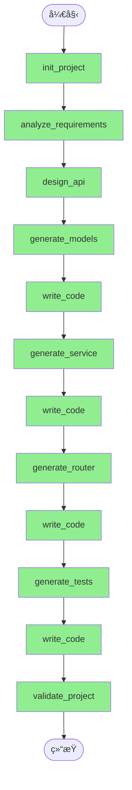

# 智能体执行报告

**Agent**: Fullstack Project Generator
**æ„图**: 一个能够自主规划和生æˆå®Œæ•´ REST API 项目的智能体
**执行时间**: 2025-12-21T20:59:09.591755
**耗时**: None 秒
**追踪ID**: `tr_5b0c10dfcbbf`

**用户输入**:
> 
一个任务管ç†ç³»ç»Ÿ API，包å«ä»¥ä¸‹åŠŸèƒ½ï¼š

1. 项目管ç†
   - 创建ã€ç¼–辑ã€åˆ é™¤é¡¹ç›®
   - 项目æˆå‘˜ç®¡ç†
   - 项目状æ€ï¼ˆè¿›è¡Œä¸­ã€å·²å®Œæˆã€å·²å½’档）

2. 任务管ç†
   - 创建ã€ç¼–辑ã€åˆ é™¤ä»»åŠ¡
   - 任务å±æ€§ï¼ˆæ ‡é¢˜ã€æè¿°ã€ä¼˜å…ˆçº§ã€æˆªæ­¢æ—¥æœŸï¼‰
   - 任务状æ€ï¼ˆå¾…åŠã€è¿›è¡Œä¸­ã€å·²å®Œæˆï¼‰
   - 任务分é…ç»™æˆå‘˜
   - å­ä»»åŠ¡æ”¯æŒ

3. 标签系统
   - 创建ã€ç¼–辑ã€åˆ é™¤æ ‡ç­¾
   - 任务å¯ä»¥æœ‰å¤šä¸ªæ ‡ç­¾

4. 评论和附件
   - 任务评论
   - 任务附件上传

5. 业务规则
   - åªæœ‰é¡¹ç›®æˆå‘˜å¯ä»¥æŸ¥çœ‹/编辑项目内的任务
   - 完æˆæ‰€æœ‰å­ä»»åŠ¡å父任务自动完æˆ
   - 删除项目时删除所有相关任务


---

## 执行统计

| 指标 | 值 |
|------|-----|
| 总步骤数 | 12 |
| 已执行 | 12 |
| æˆåŠŸ | 12 |
| 失败 | 0 |
| æˆåŠŸç‡ | 100.0% |

## LLM 调用统计

| 指标 | 值 |
|------|-----|
| 总调用次数 | 42 |
| 总 Token 数 | 87,993 |
| Prompt Tokens | 53,614 |
| Response Tokens | 34,379 |

**按调用目的分类**:

| 目的 | 调用次数 | Token 数 |
|------|----------|----------|
| 其他 | 42 | 87,993 |

## å‚数绑定统计

| 指标 | 值 |
|------|-----|
| 绑定规划次数 | 0 |
| 绑定解æ次数 | 23 |
| LLM Fallback 次数 | 0 |
| 总绑定数 | 78 |
| æˆåŠŸè§£æ | 78 |
| éœ€è¦ Fallback | 0 |
| 绑定æˆåŠŸç‡ | 100.0% |

## 一致性检查点

执行过程中注册的关键检查点，用äºå续一致性验è¯å’Œé—®é¢˜ä¿®æ­£ã€‚

### 📠1 [code]

- **步骤**: Step 1
- **关键元素**:
  - names: task_api
  - signatures: {}
  - structure: {'project_root': 'task_api', 'essential_files': ['__init__.py', 'README.md']}
- **约æŸæ¡ä»¶**:
  - å续步骤必须在 task_api 项目目录下进行开å‘
  - å¿…é¡»ä¿ç•™ __init__.py æ–‡ä»¶ä»¥ç¡®ä¿ Python 包结æ„有效
  - 项目å称 'task_api' 应在åç»­é…ç½®ã€å¯¼å…¥è·¯å¾„和文档中ä¿æŒä¸€è‡´

### 📠2 [schema]

- **步骤**: Step 2
- **关键元素**:
  - names: Project, User, ProjectMember, Task
  - signatures: {}
  - structure: {'Project': {'id': 'string/uuid', 'name': 'string', 'description': 'string', 'status': 'enum', 'created_at': 'datetime', 'updated_at': 'datetime'}, 'User': {'id': 'string/uuid', 'username': 'string', 'email': 'string'}, 'ProjectMember': {'project_id': 'string/uuid', 'user_id': 'string/uuid', 'role': 'string'}, 'Task': {'id': 'string/uuid', 'project_id': 'string/uuid', 'parent_task_id': 'string/uuid', 'title': 'string', 'description': 'string', 'priority': 'enum', 'due_date': 'date'}}
- **约æŸæ¡ä»¶**:
  - 所有åç»­æ•°æ®æ¨¡å‹ï¼ˆå¦‚æ•°æ®åº“表ã€DTOã€ORM类）必须包å«ä¸Šè¿°å®ä½“åŠå…¶å­—段定义
  - 字段类å‹ï¼ˆå¦‚ uuidã€enumã€datetimeã€date）和是å¦å¿…填（required）必须ä¸æå–结æœä¸€è‡´
  - å®ä½“间关系（如 Task.project_id å…³è” Project.id）需在å续设计中ä¿æŒä¸€è‡´
  - æšä¸¾å€¼ï¼ˆå¦‚ Project.statusã€Task.priority）的具体å–值范围需在å续步骤中æ˜ç¡®å®šä¹‰å¹¶ä¿æŒå…¼å®¹

### 📠3 [interface]

- **步骤**: Step 3
- **关键元素**:
  - names: /projects, /projects/{id}, /projects/{id}/members, /projects/{project_id}/members/{user_id}, /users, /users/{id}
  - signatures: {'GET /projects': 'request_params: {page: int, size: int, status: string}, response: ProjectListResponse', 'POST /projects': 'request_body: CreateProjectRequest, response: ProjectResponse', 'GET /projects/{id}': 'path_params: {id: int}, response: ProjectResponse', 'PUT /projects/{id}': 'path_params: {id: int}, request_body: UpdateProjectRequest, response: ProjectResponse', 'DELETE /projects/{id}': 'path_params: {id: int}, response: EmptyResponse', 'GET /projects/{id}/members': 'path_params: {id: int}, response: ProjectMemberListResponse', 'POST /projects/{id}/members': 'path_params: {id: int}, request_body: AddProjectMemberRequest, response: ProjectMemberResponse', 'DELETE /projects/{project_id}/members/{user_id}': 'path_params: {project_id: int, user_id: int}, response: EmptyResponse', 'GET /users': 'request_params: {page: int, size: int}, response: UserListResponse', 'POST /users': 'request_body: CreateUserRequest, response: UserResponse', 'GET /users/{id}': 'path_params: {id: int}, response: UserResponse'}
  - structure: {'base_path': '/api/v1', 'auth_required': True, 'response_schemas': ['ProjectListResponse', 'ProjectResponse', 'CreateProjectRequest', 'UpdateProjectRequest', 'EmptyResponse', 'ProjectMemberListResponse', 'ProjectMemberResponse', 'AddProjectMemberRequest', 'UserListResponse', 'CreateUserRequest', 'UserResponse']}
- **约æŸæ¡ä»¶**:
  - 所有 API 端点必须以 /api/v1 为基路径
  - 所有æ¥å£å¿…é¡»è¦æ±‚身份认è¯ï¼ˆauth_required: true）
  - 路径å‚数（如 {id}ã€{project_id}ã€{user_id}）必须为整数类å‹
  - 请求å‚数和请求体结æ„å¿…é¡»ä¸æŒ‡å®šçš„ Schema å称一致
  - å“应格å¼å¿…须严格éµå¾ªå¯¹åº”çš„ response_schema 定义
  - ... 还有 1 æ¡

### 📠4 [code]

- **步骤**: Step 4
- **关键元素**:
  - names: BaseSchema, ProjectStatusEnum, ProjectBase, CreateProjectRequest, UpdateProjectRequest, ProjectResponse, ProjectListResponse, UserBase, CreateUserRequest, UpdateUserRequest
    ... 还有 1 个
  - signatures: {}
  - structure: {'BaseSchema': {'model_config': {'from_attributes': True}}, 'ProjectStatusEnum': ['IN_PROGRESS', 'COMPLETED', 'ARCHIVED'], 'ProjectBase': {'fields': {'name': 'str (required)', 'description': 'Optional[str]', 'status': 'ProjectStatusEnum (required)'}}, 'CreateProjectRequest': 'inherits ProjectBase, no additional fields', 'UpdateProjectRequest': {'fields': {'name': 'Optional[str]', 'description': 'Optional[str]', 'status': 'Optional[ProjectStatusEnum]'}}, 'ProjectResponse': {'inherits': 'ProjectBase', 'additional_fields': {'id': 'int (required)', 'created_at': 'datetime (required)', 'updated_at': 'datetime (required)'}}, 'ProjectListResponse': {'fields': {'items': 'List[ProjectResponse]', 'total': 'int', 'page': 'int', 'size': 'int'}}, 'UserBase': {'fields': {'username': 'str (required)', 'email': 'EmailStr (required)'}}, 'CreateUserRequest': 'inherits UserBase, no additional fields', 'UpdateUserRequest': {'fields': {'username': 'Optional[str]', 'email': 'Optional[EmailStr]'}}, 'UserResponse': {'inherits': 'UserBase', 'additional_fields': {'id': 'int (required)'}}}
- **约æŸæ¡ä»¶**:
  - 所有å续使用这些模å‹çš„代ç å¿…é¡»ä¿æŒå­—段å称ã€ç±»å‹å’Œå¯é€‰æ€§ä¸€è‡´
  - ProjectStatusEnum çš„æšä¸¾å€¼ï¼ˆ'进行中', '已完æˆ', '已归档'）ä¸å¾—更改，以å…ç ´å API 兼容性
  - BaseSchema å¿…é¡»ä¿ç•™ model_config = {'from_attributes': True} ä»¥æ”¯æŒ ORM 模å¼
  - 任何新å¢æˆ–修改模å‹éƒ½åº”éµå¾ªç°æœ‰å‘½å规范（如 *Requestã€*Responseã€*Base）
  - UserResponse 中的 id 字段必须为 int ç±»å‹ä¸”必填，ProjectResponse åŒç†

### 📠5 [schema]

- **步骤**: Step 5
- **关键元素**:
  - names: 
  - signatures: {}
  - structure: {'file_path': 'C:\\Users\\xiaoshuyui\\github_repo\\auto_agent\\examples\\fullstack_generator\\output\\task_api\\models.py', 'filename': 'models.py', 'code_type': 'model'}
- **约æŸæ¡ä»¶**:
  - å续步骤中所有使用这些模å‹çš„åœ°æ–¹å¿…é¡»ä¸ models.py 中定义的字段åã€ç±»å‹å’ŒéªŒè¯è§„则ä¿æŒä¸€è‡´
  - 任何ä¾èµ–该模å‹çš„æ¥å£æˆ–æœåŠ¡å¿…é¡»éµå¾ªå…¶æ•°æ®ç»“æ„定义，ä¸å¾—擅自修改字段语义或类å‹

### 📠6 [code]

- **步骤**: Step 6
- **关键元素**:
  - names: ProjectService, BaseService, NotFoundException, BadRequestException, ConflictException
  - signatures: {'ProjectService.get_projects': 'async def get_projects(self, page: int = 1, size: int = 10, status: Optional[str] = None) -> ProjectListResponse', 'ProjectService.create_project': 'async def create_project(self, request: CreateProjectRequest) -> ProjectResponse'}
  - structure: {'imports': ['BaseSchema', 'ProjectStatusEnum', 'CreateProjectRequest', 'UpdateProjectRequest', 'ProjectResponse', 'ProjectListResponse', 'UserBase', 'CreateUserRequest', 'UserResponse', 'TaskBase', 'CreateTaskRequest', 'TaskResponse', 'TagBase', 'CommentBase', 'AttachmentBase', 'EmptyResponse'], 'exception_classes': ['NotFoundException', 'BadRequestException', 'ConflictException'], 'base_class': 'BaseService'}
- **约æŸæ¡ä»¶**:
  - åç»­å®ç°å¿…é¡»ä¿ç•™å·²å®šä¹‰çš„函数签å（包括å‚æ•°åã€ç±»å‹æ³¨è§£å’Œè¿”å›ç±»å‹ï¼‰
  - 所有æœåŠ¡ç±»å¿…须继承自 BaseService
  - 异常类å‹å¿…é¡»ä¸å·²å®šä¹‰çš„自定义异常一致（如使用 NotFoundException 表示资æºæœªæ‰¾åˆ°ï¼‰
  - 导入的模å‹ç±»å称和结æ„ä¸å¾—更改，以确ä¿ç±»å‹å…¼å®¹æ€§

### 📠7 [code]

- **步骤**: Step 7
- **关键元素**:
  - names: 
  - signatures: {}
  - structure: {}
- **约æŸæ¡ä»¶**:
  - å续步骤中若涉åŠè°ƒç”¨æˆ–扩展该æœåŠ¡å±‚，需éµå¾ªå…¶å†…部定义的函数命åå’Œå‚数约定
  - 任何对 service.py 的修改或引用必须ä¿æŒä¸å½“å‰ 253 è¡Œã€7868 字节的代ç ç»“æ„兼容

### 📠8 [code]

- **步骤**: Step 8
- **关键元素**:
  - names: router, get_projects, create_project, get_project, update_project, delete_project, get_users, create_user, get_user, update_user
    ... 还有 29 个
  - signatures: {}
  - structure: {'imports': {'models': ['ProjectListResponse', 'CreateProjectRequest', 'ProjectResponse', 'UpdateProjectRequest', 'EmptyResponse', 'ProjectMemberListResponse', 'AddProjectMemberRequest', 'ProjectMemberResponse', 'UserListResponse', 'CreateUserRequest', 'UserResponse', 'UpdateUserRequest', 'TaskListResponse', 'CreateTaskRequest', 'TaskResponse', 'UpdateTaskRequest', 'CreateSubtaskRequest', 'TagListResponse', 'CreateTagRequest', 'TagResponse', 'UpdateTagRequest', 'TaskTagResponse', 'AddTaskTagRequest', 'CommentListResponse', 'CreateCommentRequest', 'CommentResponse', 'UpdateCommentRequest', 'AttachmentListResponse', 'CreateAttachmentRequest', 'AttachmentResponse'], 'services': ['get_projects', 'create_project', 'get_project', 'update_project', 'delete_project', 'get_users', 'create_user', 'get_user', 'update_user', 'delete_user', 'get_project_members', 'add_project_member', 'remove_project_member', 'get_tasks', 'create_task', 'get_task', 'update_task', 'delete_task', 'get_project_tasks', 'get_subtasks', 'create_subtask', 'get_tags', 'create_tag', 'get_tag', 'update_tag', 'delete_tag', 'get_task_tags', 'add_task_tag', 'remove_task_tag', 'get_task_comments', 'create_comment', 'get_comment', 'update_comment', 'delete_comment', 'get_task_attachments', 'create_attachment', 'get_attachment', 'delete_attachment'], 'dependencies': ['get_current_user']}, 'router_config': {'type': 'APIRouter', 'dependencies': ['Depends(get_current_user)']}, 'routes': {'/projects': {'method': 'GET', 'response_model': 'ProjectListResponse'}}}
- **约æŸæ¡ä»¶**:
  - 所有å续路由必须使用相åŒçš„ router å®ä¾‹ï¼ˆå·²é…置全局ä¾èµ– get_current_user）
  - 模å‹å称和结æ„å¿…é¡»ä¸å·²å¯¼å…¥çš„ models ä¿æŒä¸€è‡´
  - æœåŠ¡å‡½æ•°å称必须ä¸å·²å¯¼å…¥çš„ services 列表匹é…
  - 所有新添加的端点应éµå¾ªå·²å±•ç¤ºçš„路由装饰器格å¼ï¼ˆå¦‚ @router.get(..., response_model=...)）
  - 认è¯ä¾èµ– get_current_user 必须在所有路由中生效（通过 router 级别ä¾èµ–）

### 📠9 [code]

- **步骤**: Step 9
- **关键元素**:
  - names: 
  - signatures: {}
  - structure: {'file_path': 'C:\\Users\\xiaoshuyui\\github_repo\\auto_agent\\examples\\fullstack_generator\\output\\task_api\\router.py', 'filename': 'router.py', 'code_type': 'router'}
- **约æŸæ¡ä»¶**:
  - å续步骤必须ä¿æŒ router.py 文件路径和文件åä¸å˜
  - å续步骤如需修改路由逻辑，必须兼容已生æˆçš„605行代ç ç»“æ„å’Œ15733字节的内容规模
  - 任何新å¢æˆ–修改的路由功能必须ä¸ç°æœ‰ router 模å—的代ç é£æ ¼å’Œç»„织方å¼ä¿æŒä¸€è‡´

### 📠10 [code]

- **步骤**: Step 10
- **关键元素**:
  - names: ProjectStatusEnum, TaskStatusEnum, TaskPriorityEnum, EmptyResponse, test_user_data, test_project_data, test_task_data, test_tag_data, test_comment_data, test_attachment_data
    ... 还有 1 个
  - signatures: {'test_user_data': '() -> Dict[str, Any]', 'test_project_data': '() -> Dict[str, Any]', 'test_task_data': '() -> Dict[str, Any]', 'test_tag_data': '() -> Dict[str, Any]', 'test_comment_data': '() -> Dict[str, Any]', 'test_attachment_data': '() -> Dict[str, Any]', 'client': '() -> AsyncClient'}
  - structure: {'enums': ['ProjectStatusEnum', 'TaskStatusEnum', 'TaskPriorityEnum'], 'fixtures': ['test_user_data', 'test_project_data', 'test_task_data', 'test_tag_data', 'test_comment_data', 'test_attachment_data', 'client']}
- **约æŸæ¡ä»¶**:
  - å续步骤中若使用这些 fixture，必须ä¿æŒå…¶è¿”å›å­—段结æ„一致（如 test_task_data å¿…é¡»åŒ…å« titleã€descriptionã€statusã€priority）
  - æšä¸¾ç±»çš„值（如 ACTIVE="active"）必须ä¸å®é™… API 所期望的值ä¿æŒä¸€è‡´
  - client fixture 使用 AsyncClient 且 base_url 为 "http://test"，å续集æˆéœ€å…¼å®¹æ­¤é…置或æ˜ç¡®è¦†ç›–
  - 所有 fixture å‡ä¸º pytest fixture，å续测试文件应基äºç›¸åŒå‘½å和作用域使用

### 📠11 [code]

- **步骤**: Step 11
- **关键元素**:
  - names: 
  - signatures: {}
  - structure: {'file_path': 'C:\\Users\\xiaoshuyui\\github_repo\\auto_agent\\examples\\fullstack_generator\\output\\task_api\\test_api.py', 'filename': 'test_api.py', 'code_type': 'test', 'line_count': 532}
- **约æŸæ¡ä»¶**:
  - å续步骤若修改或引用该测试文件，必须ä¿æŒæ–‡ä»¶è·¯å¾„和文件å一致
  - 任何对被测 API çš„å˜æ›´å¿…é¡»åŒæ­¥æ›´æ–°æ­¤æµ‹è¯•æ–‡ä»¶ä»¥ç¡®ä¿æµ‹è¯•æœ‰æ•ˆæ€§
  - æ–°å¢æˆ–删除 API 端点时，需在 test_api.py 中相应å¢åˆ æµ‹è¯•ç”¨ä¾‹

### 📠12 [code]

- **步骤**: Step 12
- **关键元素**:
  - names: ProjectMemberBase, AddProjectMemberRequest, TaskPriorityEnum, TaskStatusEnum, TaskBase, CreateTaskRequest, ProjectService, update_pr, list_projects, get_projects
    ... 还有 1 个
  - signatures: {'list_projects': 'def list_projects(..., size: int = ..., ...)', 'update_pr': 'async def update_pr(self, ...)', 'ProjectService.create_project': 'async def create_project(self, project_data: CreateProjectRequest) -> Project', 'ProjectService.update_pr': 'async def update_pr(self, pr_id: int, updates: UpdatePRRequest) -> PullRequest'}
  - structure: {'models': ['ProjectMember', 'Task', 'Tag', 'Comment', 'Attachment'], 'service_layer_pattern': 'class-based with instance methods (e.g., ProjectService)', 'routing_integration': 'should use dependency injection (e.g., FastAPI Depends) to access service instances'}
- **约æŸæ¡ä»¶**:
  - 所有在æœåŠ¡å’Œè·¯ç”±ä¸­å¼•ç”¨çš„模å‹ç±»ï¼ˆå¦‚ ProjectMemberBaseã€TaskBase 等）必须在模å‹ä»£ç ä¸­å®Œæ•´å®šä¹‰ã€‚
  - æœåŠ¡å±‚必须统一采用类方法形å¼ï¼ˆå¦‚ ProjectService çš„å®ä¾‹æ–¹æ³•ï¼‰ï¼Œè·¯ç”±å±‚应通过ä¾èµ–注入è·å–æœåŠ¡å®ä¾‹ï¼Œä¸å¾—ç›´æ¥å¯¼å…¥é¡¶å±‚函数。
  - 所有被截断的函数（如 update_prã€list_projects）必须补全语法，确ä¿å‚数注解和函数体完整。
  - 项目和用户 ID 必须统一使用 int ç±»å‹ï¼Œè´¯ç©¿æ¨¡å‹ã€æœåŠ¡ã€è·¯ç”±åŠæ•°æ®åº“设计。

## âš ï¸ ä¸€è‡´æ€§è¿è§„

执行过程中检测到的一致性问题，å¯ç”¨äºå续修正。

| 严é‡ç¨‹åº¦ | 检查点 | 问题æè¿° | 建议 |
|----------|--------|----------|------|
| 🔴 critical | 3 | 检查点 [3] æ˜ç¡®è§„定路径å‚数（如 {id}ã€{project_id}ã€{user_id}）必须为 | 统一路径å‚æ•°ä¸æ¨¡å‹ä¸»é”®ç±»å‹ï¼šè¦ä¹ˆå°† API 路径å‚æ•° {id |
| 🔴 critical | 4 | ProjectStatusEnum çš„æšä¸¾å€¼ä½¿ç”¨äº†ä¸­æ–‡ï¼ˆ'进行中', '已完æˆ', '已归档'），但 | å°† ProjectStatusEnum 的值修改为对应的英文 |
| 🔴 critical | 4 | 代ç åœ¨ UpdateProjectRequest 中截断（'Fie' 而é 'Field'），导致语 | 补全 UpdateProjectRequest çš„å®šä¹‰ï¼Œç¡®ä¿ |
| 🟡 warning | 2 | æ•°æ®æ¨¡å‹ä¸­ç¼ºå°‘对 created_at å’Œ updated_at 字段的定义，而检查点 [2] è¦æ±‚ | 在 ProjectBase 或 ProjectRespons |
| 🔴 critical | 3 | 当å‰æ­¥éª¤ä¸­ /projects GET æ¥å£çš„ request_params 中 status 字段 | å°† request_params 中的 status ç±»å‹ä¿® |
| 🔴 critical | 3 | å†å²æ£€æŸ¥ç‚¹ [3] æ˜ç¡®è§„定所有 API 路径å‚数（如 {id}ã€{project_id}ã€{use | 确认æœåŠ¡å±‚å®ç°ä¸­æ‰€æœ‰è·¯å¾„å‚数（如 project_idã€us |
| 🟡 warning | 2 | æ•°æ®æ¨¡å‹ [2] 中定义 Project.idã€User.id 等为 'string/uuid'，但 | 在æœåŠ¡å±‚或 API 路由层进行类å‹è½¬æ¢ï¼šAPI æ¥æ”¶æ•´æ•° I |
| 🟡 warning | 4 | 当å‰æ­¥éª¤å¼•å…¥äº†å¤šä¸ªæ–°æ¨¡å‹ï¼ˆå¦‚ UserListResponseã€ProjectMemberBase〠| 确认新å¢æšä¸¾ï¼ˆå¦‚ TaskStatusEnumã€TaskPr |
| 🔴 critical | 3 | å†å²æ£€æŸ¥ç‚¹ [3] æ˜ç¡®è§„定路径å‚数（如 {id}ã€{project_id}ã€{user_id}）必 | 统一 ID ç±»å‹ï¼šè¦ä¹ˆå°† API 路径å‚数改为 UUID å­— |
| 🟡 warning | 5 | 当å‰ä»£ç ä» models 模å—导入了多个未在å†å²æ£€æŸ¥ç‚¹ [4] 或 [5] 中æ˜ç¡®å®šä¹‰çš„模å‹ï¼Œä¾‹å¦‚  | ç¡®ä¿æ‰€æœ‰æ–°å¼•å…¥çš„ Pydantic 模å‹ï¼ˆå¦‚ *ListRe |
| 🔴 critical | 3 | 当å‰æ­¥éª¤ä¸­è·¯å¾„å‚æ•° {id} 被定义为整数类å‹ï¼ˆ'id': 'int'），但å†å²æ£€æŸ¥ç‚¹ [2] å’Œ  | 将路径å‚æ•° {id} çš„ç±»å‹ä» int 改为 str（或 U |
| 🟡 warning | 3 | 当å‰æ­¥éª¤æœªä½“ç° '/api/v1' 基路径。根æ®æ£€æŸ¥ç‚¹ [3] 的约æŸï¼Œæ‰€æœ‰ API 端点必须以 / | 在 FastAPI 路由器中设置 prefix='/api/ |
| 🟡 warning | 4 | å“应结æ„中使用了未在å†å²æ£€æŸ¥ç‚¹ [4] 中定义的 'EmptyResponse'。该模å‹æœªåœ¨ Pyd | è¦ä¹ˆåœ¨ models.py 中æ˜ç¡®å®šä¹‰ EmptyRespo |
| 🔴 critical | 3 | å†å²æ£€æŸ¥ç‚¹ [3] æ˜ç¡®è§„定所有 API 路径å‚数（如 {id}ã€{project_id}ã€{use | 统一主键类å‹ï¼šè¦ä¹ˆå°†æ¥å£è§„范中的路径å‚æ•°ç±»å‹ä» int 改为 |
| 🟡 warning | 8 | 当å‰ä»£ç ç‰‡æ®µä¸­ from service 导入ä¸å®Œæ•´ï¼ˆæˆªæ–­ä¸º 'from service'），未æ˜ç¡® | 补全 service 模å—的导入语å¥ï¼Œä¾‹å¦‚：from ser |
| 🔴 critical | 3 | 当å‰æ­¥éª¤ä¸­è·¯å¾„å‚æ•° {id} 被æ述为整数类å‹ï¼ˆ'id': 'int'），但å†å²æ£€æŸ¥ç‚¹ [2] å’Œ  | 统一 ID ç±»å‹ï¼šè‹¥ API 路径å‚数需ä¿æŒä¸ºæ•´æ•°ï¼Œåˆ™æ•°æ®æ¨¡ |
| 🔴 critical | 3 | 当å‰æ­¥éª¤æœªä½“ç°æ‰€æœ‰ API 端点以 /api/v1 为基路径。生æˆçš„测试用例直æ¥ä½¿ç”¨ /projec | 在生æˆæµ‹è¯•ç”¨ä¾‹æ—¶ï¼Œåº”将完整路径æ„造为 /api/v1/pro |
| 🟡 warning | 4 | DELETE /projects/{id} çš„å“应结æ„被指定为 'EmptyResponse'ï¼Œä½†å† | æ˜ç¡®å®šä¹‰ EmptyResponse（例如一个空 Pydan |
| 🔴 critical | 2 | Project å®ä½“在å†å²æ£€æŸ¥ç‚¹ [2] 中定义的 status 字段应为æšä¸¾ç±»å‹ï¼Œå…¶å€¼åŒ…括 'IN | å°† ProjectStatusEnum çš„æšä¸¾å€¼ä¿®æ”¹ä¸ºä¸æ£€æŸ¥ |
| 🔴 critical | 4 | 检查点 [4] æ˜ç¡®è§„定 ProjectStatusenum çš„æšä¸¾å€¼å¿…须为 ['IN_PROGRE | æ›´æ–° test_api.py 中的 ProjectStatu |
| 🟡 warning | 10 | 虽然检查点 [10] æ到测试代ç ä¸­åŒ…å« ProjectStatusEnum，但其预期值应ä¸å®é™… A | åŒæ­¥æµ‹è¯•ä¸­çš„æšä¸¾å®šä¹‰ä¸ä¸»ä»£ç åº“中的 ProjectStatu |
| 🔴 critical | 3 | å†å²æ£€æŸ¥ç‚¹ [3] æ˜ç¡®è§„定路径å‚数（如 {id}ã€{project_id}ã€{user_id}）必 | 统一 ID ç±»å‹ï¼šè¦ä¹ˆå°† API 路径å‚数改为字符串类å‹ï¼ˆå¦‚ |
| 🟡 warning | 4 | 当å‰æ供的 models_code 片段中 UpdateProjectRequest 继承自 Bas | 确认 UpdateProjectRequest 中 name |

## 🧠 工作记忆

执行过程中æå–的设计决策ã€çº¦æŸå’Œå¾…åŠäº‹é¡¹ã€‚

### 设计决策

- **[Step 1]** 项目å称确定为 task_api
  - ç†ç”±: 执行结æœä¸­æ˜ç¡®æŒ‡å®šäº† project_name 为 task_api，表æ˜é¡¹ç›®å‘½å已固定
- **[Step 1]** 项目根目录路径已确定
  - ç†ç”±: project_dir 已生æˆï¼Œå续所有文件æ“作应基äºè¯¥è·¯å¾„进行
- **[Step 2]** å°†ç³»ç»Ÿå»ºæ¨¡ä¸ºåŒ…å« Projectã€Userã€ProjectMemberã€Task 等核心å®ä½“的结æ„
  - ç†ç”±: 需求æè¿°æ˜ç¡®è¦æ±‚支æŒé¡¹ç›®ã€ä»»åŠ¡ã€ç”¨æˆ·ã€æ ‡ç­¾ã€è¯„论和附件管ç†ï¼Œæ­¤å®ä½“划分能覆盖基本业务范围
- **[Step 2]** 使用 UUID 作为å®ä½“主键（如 Project.idã€User.idã€Task.id）
  - ç†ç”±: æ高分布å¼ç³»ç»Ÿå…¼å®¹æ€§å’Œå®‰å…¨æ€§ï¼Œé¿å…è‡ªå¢ ID 泄露信æ¯
- **[Step 2]** Project å’Œ User 通过中间å®ä½“ ProjectMember 建立多对多关系
  - ç†ç”±: 支æŒçµæ´»çš„æˆå‘˜ç®¡ç†ï¼Œå¹¶å¯é™„加角色等元数æ®
- **[Step 2]** Task 支æŒå±‚级结æ„（通过 parent_task_id å®ç°å­ä»»åŠ¡ï¼‰
  - ç†ç”±: 满足å¤æ‚任务分解的业务需求
- **[Step 3]** 采用 RESTful é£æ ¼è®¾è®¡ API，以 /api/v1 为统一基础路径
  - ç†ç”±: ç¡®ä¿æ¥å£é£æ ¼ä¸€è‡´ã€å¯é¢„测，并符åˆè¡Œä¸šæ ‡å‡†
- **[Step 3]** 所有 API 端点å‡è¦æ±‚身份认è¯ï¼ˆauth_required: true）
  - ç†ç”±: ä¿éšœç³»ç»Ÿå®‰å…¨æ€§ï¼Œé˜²æ­¢æœªæˆæƒè®¿é—®
- **[Step 3]** 使用资æºåµŒå¥—路径（如 /projects/{id}/members）表示å­èµ„æºå…³ç³»
  - ç†ç”±: 清晰表达项目ä¸æˆå‘˜ä¹‹é—´çš„ä»å±å…³ç³»ï¼Œç¬¦åˆ RESTful 资æºå»ºæ¨¡è§„范
- **[Step 4]** 使用 Pydantic BaseModel 作为所有模å‹çš„基类，并å¯ç”¨ from_attributes é…ç½®
  - ç†ç”±: 支æŒä» ORM 对象自动转æ¢ä¸º Pydantic 模å‹ï¼Œæå‡ä¸æ•°æ®åº“层的兼容性
- ... 还有 10 æ¡å†³ç­–

### 约æŸæ¡ä»¶

- 所有å续生æˆçš„文件必须ä½äº C:\Users\xiaoshuyui\github_repo\auto_agent\examples\fullstack_generator\output\task_api 目录下
  - æ¥æº: 1
- 项目结æ„需ä¿æŒ Python 包兼容性（已创建 __init__.py）
  - æ¥æº: 1
- 所有å®ä½“å¿…é¡»åŒ…å« id 字段，类å‹ä¸º string/uuid，且为必填
  - æ¥æº: 2
- Project.status 必须是æšä¸¾å€¼ï¼šè¿›è¡Œä¸­ã€å·²å®Œæˆã€å·²å½’æ¡£
  - æ¥æº: 2
- Task.priority 必须是æšä¸¾å€¼ï¼ˆå¦‚：ä½ã€ä¸­ã€é«˜ï¼‰
  - æ¥æº: 2
- Task 必须关è”到一个 Project（project_id 为必填）
  - æ¥æº: 2
- 所有å®ä½“éœ€åŒ…å« created_at å’Œ updated_at 时间戳字段（至少 Project å·²æ˜ç¡®ï¼‰
  - æ¥æº: 2
- 所有端点必须ä½äº /api/v1 基础路径下
  - æ¥æº: 3
- æ¯ä¸ªç«¯ç‚¹å¿…é¡»å®ç°æŒ‡å®šçš„请求å‚æ•°ã€è·¯å¾„å‚数或请求体结æ„
  - æ¥æº: 3
- 所有å“应必须éµå¾ªæŒ‡å®šçš„å“应 Schema（如 ProjectResponseã€UserListResponse 等）
  - æ¥æº: 3
- ... 还有 21 æ¡çº¦æŸ

### æ¥å£å®šä¹‰

- **GET /api/v1/projects** (api)
- **POST /api/v1/projects** (api)
- **GET /api/v1/projects/{id}** (api)
- **PUT /api/v1/projects/{id}** (api)
- **DELETE /api/v1/projects/{id}** (api)
- **GET /api/v1/projects/{id}/members** (api)
- **POST /api/v1/projects/{id}/members** (api)
- **DELETE /api/v1/projects/{project_id}/members/{user_id}** (api)
- **GET /api/v1/users** (api)
- **POST /api/v1/users** (api)
- ... 还有 18 个æ¥å£

### å¾…åŠäº‹é¡¹

- Ⳡ[normal] 完善 README.md 内容
- â³ [high] 在 task_api 项目中继续添加模å—ã€é…置文件ã€ä¾èµ–声æ˜ç­‰åŸºç¡€ç»„件
- â³ [high] 补充 Tagã€Commentã€Attachment å®ä½“的完整定义（当å‰æ‰§è¡Œç»“æœè¢«æˆªæ–­ï¼ŒæœªåŒ…å«è¿™äº›å®ä½“）
- â³ [normal] æ˜ç¡® Task.due_date çš„æ ¼å¼å’Œæ—¶åŒºå¤„ç†è§„则
- â³ [normal] 定义 ProjectMember.role çš„å…许值或是å¦åº”为æšä¸¾
- â³ [high] æå–并形å¼åŒ–业务规则（例如任务状æ€æµè½¬ã€æƒé™æ§åˆ¶ç­‰ï¼‰
- â³ [high] 定义 CreateProjectRequestã€UpdateProjectRequestã€AddProjectMemberRequestã€CreateUserRequest 等请求体 Schema
- â³ [high] 定义 ProjectListResponseã€ProjectResponseã€ProjectMemberListResponseã€UserListResponseã€UserResponseã€EmptyResponse ç­‰å“应 Schema
- â³ [high] 补充缺失的 UserResponse 定义（执行结æœè¢«æˆªæ–­ï¼‰
- â³ [high] 补全 UserResponse 模å‹ä¸­è¢«æˆªæ–­çš„字段定义（如 idã€created_at 等）
- ... 还有 15 æ¡å¾…åŠ

## 执行æµç¨‹



## 步骤详情

### ✅ 步骤 1: init_project

- **æè¿°**: åˆå§‹åŒ–项目目录结æ„，创建 task_api 项目的基础文件夹和 __init__.py 文件
- **期望**: æˆåŠŸåˆ›å»º task_api é¡¹ç›®ç›®å½•ï¼ŒåŒ…å« models/ã€services/ã€routers/ã€tests/ ç­‰å­ç›®å½•å’Œå¿…è¦çš„ __init__.py 文件
- **状æ€**: success

### ✅ 步骤 2: analyze_requirements

- **æè¿°**: 分æ用户æ供的需求æ述，æå–å®ä½“（Projectã€Taskã€Tagã€Commentã€Attachmentã€User）ã€å…³ç³»å’Œä¸šåŠ¡è§„则
- **期望**: 准确识别出所有核心å®ä½“åŠå…¶å±æ€§ï¼Œæ˜ç¡®å®ä½“间的关系（如 Project-Task 一对多，Task-Tag 多对多等），并完整æ•è·ä¸šåŠ¡è§„则
- **状æ€**: success

### ✅ 步骤 3: design_api

- **æè¿°**: 基äºæå–çš„å®ä½“å’Œå…³ç³»ï¼Œè®¾è®¡ç¬¦åˆ RESTful 规范的 API 端点和对应的请求/å“应 Schema
- **期望**: 生æˆå®Œæ•´çš„ CRUD 端点（如 POST /projects, GET /tasks/{task_id} 等），æ¯ä¸ªç«¯ç‚¹æœ‰æ¸…晰的路径ã€æ–¹æ³•ã€å‚æ•°å’Œ Schema 定义
- **状æ€**: success

### ✅ 步骤 4: generate_models

- **æè¿°**: æ ¹æ®å®ä½“定义和 API Schema 生æˆç±»å‹å®‰å…¨çš„ Pydantic 模å‹ä»£ç 
- **期望**: 生æˆåŒ…å« Projectã€Taskã€Tagã€Commentã€Attachmentã€User 等模å‹çš„代ç ï¼Œä½¿ç”¨ int ç±»å‹ ID，正确处ç†åµŒå¥—关系和æšä¸¾ï¼ˆå¦‚状æ€ã€ä¼˜å…ˆçº§ï¼‰
- **状æ€**: success

### ✅ 步骤 5: write_code

- **æè¿°**: 将生æˆçš„ Pydantic 模å‹ä»£ç å†™å…¥ models.py 文件
- **期望**: æˆåŠŸå°†æ¨¡å‹ä»£ç å†™å…¥ task_api/models.py，包å«é€‚当的注释和类å‹æ³¨è§£
- **状æ€**: success

### ✅ 步骤 6: generate_service

- **æè¿°**: 基äºæ¨¡å‹ç±»åå’Œ API 端点生æˆæœåŠ¡å±‚业务逻辑代ç 
- **期望**: 生æˆåŒ…å« create_projectã€update_taskã€add_tag_to_task 等方法的æœåŠ¡ç±»ï¼Œå®ç°ä¸šåŠ¡è§„则（如å­ä»»åŠ¡å®Œæˆè‡ªåŠ¨å®Œæˆçˆ¶ä»»åŠ¡ï¼‰
- **状æ€**: success

### ✅ 步骤 7: write_code

- **æè¿°**: 将生æˆçš„æœåŠ¡å±‚代ç å†™å…¥ service.py 文件
- **期望**: æˆåŠŸå°†æœåŠ¡ä»£ç å†™å…¥ task_api/services/service.py，方法签åä¸ API 端点对应
- **状æ€**: success

### ✅ 步骤 8: generate_router

- **æè¿°**: åŸºäº API 端点和æœåŠ¡æ–¹æ³•ç”Ÿæˆ FastAPI 路由代ç 
- **期望**: 生æˆæ­£ç¡®çš„ FastAPI 路由装饰器（@app.post, @app.get 等），正确调用æœåŠ¡å±‚方法，使用正确的请求/å“应模å‹
- **状æ€**: success

### ✅ 步骤 9: write_code

- **æè¿°**: 将生æˆçš„路由代ç å†™å…¥ router.py 文件
- **期望**: æˆåŠŸå°†è·¯ç”±ä»£ç å†™å…¥ task_api/routers/router.py，包å«å¿…è¦çš„导入语å¥
- **状æ€**: success

### ✅ 步骤 10: generate_tests

- **æè¿°**: åŸºäº API ç«¯ç‚¹ç”Ÿæˆ pytest 测试用例
- **期望**: 生æˆè¦†ç›–ä¸»è¦ CRUD æ“作的测试用例，使用正确的测试数æ®å’Œæ–­è¨€
- **状æ€**: success

### ✅ 步骤 11: write_code

- **æè¿°**: 将生æˆçš„测试代ç å†™å…¥ test_api.py 文件
- **期望**: æˆåŠŸå°†æµ‹è¯•ä»£ç å†™å…¥ task_api/tests/test_api.py，包å«å¿…è¦çš„ fixture å’Œ mock
- **状æ€**: success

### ✅ 步骤 12: validate_project

- **æè¿°**: 验è¯ç”Ÿæˆçš„模å‹ã€æœåŠ¡ã€è·¯ç”±ä»£ç ä¹‹é—´çš„一致性和完整性
- **期望**: 确认所有层使用相åŒçš„ç±»å和方法å，ID ç±»å‹ä¸º int，无缺失的ä¾èµ–或ä¸ä¸€è‡´çš„æ¥å£
- **状æ€**: success


---

## 详细追踪日志

  - 🤖 **LLM调用** [other]
    - 模å‹: qwen3-max
    - Tokens: 576 (7689.8ms)
    - **Prompt**:
      ```
      [user]: 分æ这一步的执行结æœï¼Œæå–需è¦å续步骤éµå®ˆçš„ä¿¡æ¯ã€‚
      
      ã€æ­¥éª¤ä¿¡æ¯ã€‘
      工具: init_project
      æè¿°: åˆå§‹åŒ–项目目录结æ„，创建 task_api 项目的基础文件夹和 __init__.py 文件
      
      ã€æ‰§è¡Œç»“æœã€‘
      {"success": true, "project_name": "task_api", "project_dir": "C:\\Users\\xiaoshuyui\\github_repo\\auto_agent\\examples\\fullstack_generator\\output\\task_api", "created_files": ["__init__.py", "README.md"]}
      
      ã€ä»»åŠ¡ã€‘
      ä»æ‰§è¡Œç»“æœä¸­æå–以下信æ¯ï¼ˆå¦‚æœæœ‰çš„è¯ï¼‰ï¼š
      
      1. 设计决策：这一步åšå‡ºäº†ä»€ä¹ˆé‡è¦å†³å®šï¼Ÿ
      2. 约æŸæ¡ä»¶ï¼šå续步骤必须éµå®ˆä»€ä¹ˆè§„则？
      3. å¾…åŠäº‹é¡¹ï¼šè¿™ä¸€æ­¥äº§ç”Ÿäº†ä»€ä¹ˆéœ€è¦å续处ç†çš„任务？
      4. æ¥å£å®šä¹‰ï¼šè¿™ä¸€æ­¥å®šä¹‰äº†ä»€ä¹ˆæ¥å£/契约？
      
      è¯·è¿”å› JSON（åªåŒ…å«æœ‰å†…容的字段）：
      ```json
      {
          "decisions": [
              {"decision": "决策内容", "reason": "决策ç†ç”±"}
          ],
          "constraints": [
              {"constraint": "约æŸå†…容", "priority": "critical/high/normal/low"}
          ],
          "todos": [
              {"todo": "å¾…åŠå†…容", "priority": "high/normal/low"}
          ],
          "interfaces": [
              {"name": "æ¥å£å", "type": "function/api/schema", "definition": {...}}
          ]
      }
      ```
      
      如æœæ²¡æœ‰éœ€è¦æå–çš„ä¿¡æ¯ï¼Œè¿”å›ç©ºå¯¹è±¡ {}
      ```
    - **Response**:
      ```
      ```json
      {
          "decisions": [
              {
                  "decision": "项目å称确定为 task_api",
                  "reason": "执行结æœä¸­æ˜ç¡®æŒ‡å®šäº† project_name 为 task_api，表æ˜é¡¹ç›®å‘½å已固定"
              },
              {
                  "decision": "项目根目录路径已确定",
                  "reason": "project_dir 已生æˆï¼Œå续所有文件æ“作应基äºè¯¥è·¯å¾„进行"
              }
          ],
          "constraints": [
              {
                  "constraint": "所有å续生æˆçš„文件必须ä½äº C:\\Users\\xiaoshuyui\\github_repo\\auto_agent\\examples\\fullstack_generator\\output\\task_api 目录下",
                  "priority": "critical"
              },
              {
                  "constraint": "项目结æ„需ä¿æŒ Python 包兼容性（已创建 __init__.py）",
                  "priority": "high"
              }
          ],
          "todos": [
              {
                  "todo": "完善 README.md 内容",
                  "priority": "normal"
              },
              {
                  "todo": "在 task_api 项目中继续添加模å—ã€é…置文件ã€ä¾èµ–声æ˜ç­‰åŸºç¡€ç»„件",
                  "priority": "high"
              }
          ]
      }
      ```
      ```

  - 🤖 **LLM调用** [other]
    - 模å‹: qwen3-max
    - Tokens: 535 (5600.0ms)
    - **Prompt**:
      ```
      [user]: 分æ这一步的执行结æœï¼Œæå–需è¦å续步骤ä¿æŒä¸€è‡´çš„关键元素。
      
      ã€æ­¥éª¤ä¿¡æ¯ã€‘
      工具: init_project
      æè¿°: åˆå§‹åŒ–项目目录结æ„，创建 task_api 项目的基础文件夹和 __init__.py 文件
      
      ã€æ‰§è¡Œç»“æœã€‘
      {"success": true, "project_name": "task_api", "project_dir": "C:\\Users\\xiaoshuyui\\github_repo\\auto_agent\\examples\\fullstack_generator\\output\\task_api", "created_files": ["__init__.py", "README.md"]}
      
      ã€ä»»åŠ¡ã€‘
      ä»æ‰§è¡Œç»“æœä¸­æå–以下信æ¯ï¼š
      
      1. 产物类å‹ï¼šè¿™ä¸€æ­¥äº§å‡ºäº†ä»€ä¹ˆç±»å‹çš„内容？
         - code: 代ç ï¼ˆå‡½æ•°ã€ç±»ã€æ¨¡å—）
         - interface: æ¥å£å®šä¹‰ï¼ˆAPIã€å‡½æ•°ç­¾å）
         - schema: æ•°æ®ç»“æ„定义
         - config: é…置文件
         - document: 文档（大纲ã€æŠ¥å‘Šï¼‰
      
      2. 关键元素：å续步骤需è¦ä¿æŒä¸€è‡´çš„关键信æ¯
         - 如æœæ˜¯ä»£ç ï¼šå‡½æ•°åã€å‚数列表ã€è¿”å›ç±»å‹
         - 如æœæ˜¯æ¥å£ï¼šç«¯ç‚¹ã€è¯·æ±‚/å“应格å¼
         - 如æœæ˜¯æ–‡æ¡£ï¼šç« èŠ‚结æ„ã€å…³é”®æœ¯è¯­
      
      3. å续约æŸï¼šå续步骤必须éµå®ˆçš„规则
      
      è¯·è¿”å› JSON：
      ```json
      {
          "artifact_type": "code/interface/schema/config/document",
          "description": "简短æ述这个检查点",
          "key_elements": {
              "names": ["函数å/æ¥å£å/..."],
              "signatures": {"name": "ç­¾å"},
              "structure": {...}
          },
          "constraints": [
              "å续步骤必须éµå®ˆçš„约æŸ1",
              "å续步骤必须éµå®ˆçš„约æŸ2"
          ]
      }
      ```
      
      如æœè¿™ä¸€æ­¥æ²¡æœ‰äº§å‡ºéœ€è¦ä¿æŒä¸€è‡´çš„å†…å®¹ï¼Œè¿”å› {"skip": true}
      ```
    - **Response**:
      ```
      ```json
      {
          "artifact_type": "code",
          "description": "åˆå§‹åŒ–项目目录结æ„，创建基础文件夹和 __init__.py 文件",
          "key_elements": {
              "names": ["task_api"],
              "signatures": {},
              "structure": {
                  "project_root": "task_api",
                  "essential_files": ["__init__.py", "README.md"]
              }
          },
          "constraints": [
              "å续步骤必须在 task_api 项目目录下进行开å‘",
              "å¿…é¡»ä¿ç•™ __init__.py æ–‡ä»¶ä»¥ç¡®ä¿ Python 包结æ„有效",
              "项目å称 'task_api' 应在åç»­é…ç½®ã€å¯¼å…¥è·¯å¾„和文档中ä¿æŒä¸€è‡´"
          ]
      }
      ```
      ```

  - 🤖 **LLM调用** [other]
    - 模å‹: qwen3-max
    - Tokens: 1,467 (17200.9ms)
    - **Prompt**:
      ```
      [user]: 分æ这一步的执行结æœï¼Œæå–需è¦å续步骤éµå®ˆçš„ä¿¡æ¯ã€‚
      
      ã€æ­¥éª¤ä¿¡æ¯ã€‘
      工具: analyze_requirements
      æè¿°: 分æ用户æ供的需求æ述，æå–å®ä½“（Projectã€Taskã€Tagã€Commentã€Attachmentã€User）ã€å…³ç³»å’Œä¸šåŠ¡è§„则
      
      ã€æ‰§è¡Œç»“æœã€‘
      {"project_name": "task_management_api", "description": "一个任务管ç†ç³»ç»Ÿ API，支æŒé¡¹ç›®ã€ä»»åŠ¡ã€æ ‡ç­¾ã€è¯„论和附件管ç†ï¼Œå¹¶åŒ…å«ç‰¹å®šä¸šåŠ¡è§„则。", "entities": [{"name": "Project", "description": "代表一个项目，包å«åŸºæœ¬ä¿¡æ¯å’ŒçŠ¶æ€ã€‚", "fields": [{"name": "id", "type": "string/uuid", "required": true, "description": "项目唯一标识符"}, {"name": "name", "type": "string", "required": true, "description": "项目å称"}, {"name": "description", "type": "string", "required": false, "description": "项目æè¿°"}, {"name": "status", "type": "enum", "required": true, "description": "项目状æ€ï¼šè¿›è¡Œä¸­ã€å·²å®Œæˆã€å·²å½’æ¡£"}, {"name": "created_at", "type": "datetime", "required": true, "description": "创建时间"}, {"name": "updated_at", "type": "datetime", "required": true, "description": "最å更新时间"}]}, {"name": "User", "description": "系统用户，å¯è¢«æ·»åŠ ä¸ºé¡¹ç›®æˆå‘˜ã€‚", "fields": [{"name": "id", "type": "string/uuid", "required": true, "description": "用户唯一标识符"}, {"name": "username", "type": "string", "required": true, "description": "用户å"}, {"name": "email", "type": "string", "required": true, "description": "用户邮箱"}]}, {"name": "ProjectMember", "description": "项目ä¸ç”¨æˆ·çš„å…³è”关系，表示æŸç”¨æˆ·æ˜¯æŸé¡¹ç›®çš„æˆå‘˜ã€‚", "fields": [{"name": "project_id", "type": "string/uuid", "required": true, "description": "所å±é¡¹ç›®ID"}, {"name": "user_id", "type": "string/uuid", "required": true, "description": "æˆå‘˜ç”¨æˆ·ID"}, {"name": "role", "type": "string", "required": false, "description": "æˆå‘˜åœ¨é¡¹ç›®ä¸­çš„角色（å¯é€‰ï¼‰"}]}, {"name": "Task", "description": "项目中的任务，å¯åˆ†é…ç»™æˆå‘˜ï¼Œå…·æœ‰çŠ¶æ€å’Œå±æ€§ã€‚", "fields": [{"name": "id", "type": "string/uuid", "required": true, "description": "任务唯一标识符"}, {"name": "project_id", "type": "string/uuid", "required": true, "description": "所å±é¡¹ç›®ID"}, {"name": "parent_task_id", "type": "string/uuid", "required": false, "description": "父任务ID（用äºå­ä»»åŠ¡ï¼‰"}, {"name": "title", "type": "string", "required": true, "description": "任务标题"}, {"name": "description", "type": "string", "required": false, "description": "任务æè¿°"}, {"name": "priority", "type": "enum", "required": true, "description": "任务优先级（如：ä½ã€ä¸­ã€é«˜ï¼‰"}, {"name": "due_date", "type": "date", "required": false, "descript
      
      ã€ä»»åŠ¡ã€‘
      ä»æ‰§è¡Œç»“æœä¸­æå–以下信æ¯ï¼ˆå¦‚æœæœ‰çš„è¯ï¼‰ï¼š
      
      1. 设计决策：这一步åšå‡ºäº†ä»€ä¹ˆé‡è¦å†³å®šï¼Ÿ
      2. 约æŸæ¡ä»¶ï¼šå续步骤必须éµå®ˆä»€ä¹ˆè§„则？
      3. å¾…åŠäº‹é¡¹ï¼šè¿™ä¸€æ­¥äº§ç”Ÿäº†ä»€ä¹ˆéœ€è¦å续处ç†çš„任务？
      4. æ¥å£å®šä¹‰ï¼šè¿™ä¸€æ­¥å®šä¹‰äº†ä»€ä¹ˆæ¥å£/契约？
      
      è¯·è¿”å› JSON（åªåŒ…å«æœ‰å†…容的字段）：
      ```json
      {
          "decisions": [
              {"decision": "决策内容", "reason": "决策ç†ç”±"}
          ],
          "constraints": [
              {"constraint": "约æŸå†…容", "priority": "critical/high/normal/low"}
          ],
          "todos": [
              {"todo": "å¾…åŠå†…容", "priority": "high/normal/low"}
          ],
          "interfaces": [
              {"name": "æ¥å£å", "type": "function/api/schema", "definition": {...}}
          ]
      }
      ```
      
      如æœæ²¡æœ‰éœ€è¦æå–çš„ä¿¡æ¯ï¼Œè¿”å›ç©ºå¯¹è±¡ {}
      ```
    - **Response**:
      ```
      ```json
      {
          "decisions": [
              {
                  "decision": "å°†ç³»ç»Ÿå»ºæ¨¡ä¸ºåŒ…å« Projectã€Userã€ProjectMemberã€Task 等核心å®ä½“的结æ„",
                  "reason": "需求æè¿°æ˜ç¡®è¦æ±‚支æŒé¡¹ç›®ã€ä»»åŠ¡ã€ç”¨æˆ·ã€æ ‡ç­¾ã€è¯„论和附件管ç†ï¼Œæ­¤å®ä½“划分能覆盖基本业务范围"
              },
              {
                  "decision": "使用 UUID 作为å®ä½“主键（如 Project.idã€User.idã€Task.id）",
                  "reason": "æ高分布å¼ç³»ç»Ÿå…¼å®¹æ€§å’Œå®‰å…¨æ€§ï¼Œé¿å…è‡ªå¢ ID 泄露信æ¯"
              },
              {
                  "decision": "Project å’Œ User 通过中间å®ä½“ ProjectMember 建立多对多关系",
                  "reason": "支æŒçµæ´»çš„æˆå‘˜ç®¡ç†ï¼Œå¹¶å¯é™„加角色等元数æ®"
              },
              {
                  "decision": "Task 支æŒå±‚级结æ„（通过 parent_task_id å®ç°å­ä»»åŠ¡ï¼‰",
                  "reason": "满足å¤æ‚任务分解的业务需求"
              }
          ],
          "constraints": [
              {
                  "constraint": "所有å®ä½“å¿…é¡»åŒ…å« id 字段，类å‹ä¸º string/uuid，且为必填",
                  "priority": "critical"
              },
              {
                  "constraint": "Project.status 必须是æšä¸¾å€¼ï¼šè¿›è¡Œä¸­ã€å·²å®Œæˆã€å·²å½’æ¡£",
                  "priority": "high"
              },
              {
                  "constraint": "Task.priority 必须是æšä¸¾å€¼ï¼ˆå¦‚：ä½ã€ä¸­ã€é«˜ï¼‰",
                  "priority": "high"
              },
              {
                  "constraint": "Task 必须关è”到一个 Project（project_id 为必填）",
                  "priority": "critical"
              },
              {
                  "constraint": "所有å®ä½“éœ€åŒ…å« created_at å’Œ updated_at 时间戳字段（至少 Project å·²æ˜ç¡®ï¼‰",
                  "priority": "normal"
              }
          ],
          "todos": [
              {
                  "todo": "补充 Tagã€Commentã€Attachment å®ä½“的完整定义（当å‰æ‰§è¡Œç»“æœè¢«æˆªæ–­ï¼ŒæœªåŒ…å«è¿™äº›å®ä½“）",
                  "priority": "high"
              },
              {
                  "todo": "æ˜ç¡® Task.due_date çš„æ ¼å¼å’Œæ—¶åŒºå¤„ç†è§„则",
                  "priority": "normal"
              },
              {
                  "todo": "定义 ProjectMember.role çš„å…许值或是å¦åº”为æšä¸¾",
                  "priority": "normal"
              },
              {
                  "todo": "æå–并形å¼åŒ–业务规则（例如任务状æ€æµè½¬ã€æƒé™æ§åˆ¶ç­‰ï¼‰",
                  "priority": "high"
              }
          ]
      }
      ```
      ```

  - 🤖 **LLM调用** [other]
    - 模å‹: qwen3-max
    - Tokens: 1,363 (12639.4ms)
    - **Prompt**:
      ```
      [user]: 分æ这一步的执行结æœï¼Œæå–需è¦å续步骤ä¿æŒä¸€è‡´çš„关键元素。
      
      ã€æ­¥éª¤ä¿¡æ¯ã€‘
      工具: analyze_requirements
      æè¿°: 分æ用户æ供的需求æ述，æå–å®ä½“（Projectã€Taskã€Tagã€Commentã€Attachmentã€User）ã€å…³ç³»å’Œä¸šåŠ¡è§„则
      
      ã€æ‰§è¡Œç»“æœã€‘
      {"project_name": "task_management_api", "description": "一个任务管ç†ç³»ç»Ÿ API，支æŒé¡¹ç›®ã€ä»»åŠ¡ã€æ ‡ç­¾ã€è¯„论和附件管ç†ï¼Œå¹¶åŒ…å«ç‰¹å®šä¸šåŠ¡è§„则。", "entities": [{"name": "Project", "description": "代表一个项目，包å«åŸºæœ¬ä¿¡æ¯å’ŒçŠ¶æ€ã€‚", "fields": [{"name": "id", "type": "string/uuid", "required": true, "description": "项目唯一标识符"}, {"name": "name", "type": "string", "required": true, "description": "项目å称"}, {"name": "description", "type": "string", "required": false, "description": "项目æè¿°"}, {"name": "status", "type": "enum", "required": true, "description": "项目状æ€ï¼šè¿›è¡Œä¸­ã€å·²å®Œæˆã€å·²å½’æ¡£"}, {"name": "created_at", "type": "datetime", "required": true, "description": "创建时间"}, {"name": "updated_at", "type": "datetime", "required": true, "description": "最å更新时间"}]}, {"name": "User", "description": "系统用户，å¯è¢«æ·»åŠ ä¸ºé¡¹ç›®æˆå‘˜ã€‚", "fields": [{"name": "id", "type": "string/uuid", "required": true, "description": "用户唯一标识符"}, {"name": "username", "type": "string", "required": true, "description": "用户å"}, {"name": "email", "type": "string", "required": true, "description": "用户邮箱"}]}, {"name": "ProjectMember", "description": "项目ä¸ç”¨æˆ·çš„å…³è”关系，表示æŸç”¨æˆ·æ˜¯æŸé¡¹ç›®çš„æˆå‘˜ã€‚", "fields": [{"name": "project_id", "type": "string/uuid", "required": true, "description": "所å±é¡¹ç›®ID"}, {"name": "user_id", "type": "string/uuid", "required": true, "description": "æˆå‘˜ç”¨æˆ·ID"}, {"name": "role", "type": "string", "required": false, "description": "æˆå‘˜åœ¨é¡¹ç›®ä¸­çš„角色（å¯é€‰ï¼‰"}]}, {"name": "Task", "description": "项目中的任务，å¯åˆ†é…ç»™æˆå‘˜ï¼Œå…·æœ‰çŠ¶æ€å’Œå±æ€§ã€‚", "fields": [{"name": "id", "type": "string/uuid", "required": true, "description": "任务唯一标识符"}, {"name": "project_id", "type": "string/uuid", "required": true, "description": "所å±é¡¹ç›®ID"}, {"name": "parent_task_id", "type": "string/uuid", "required": false, "description": "父任务ID（用äºå­ä»»åŠ¡ï¼‰"}, {"name": "title", "type": "string", "required": true, "description": "任务标题"}, {"name": "description", "type": "string", "required": false, "description": "任务æè¿°"}, {"name": "priority", "type": "enum", "required": true, "description": "任务优先级（如：ä½ã€ä¸­ã€é«˜ï¼‰"}, {"name": "due_date", "type": "date", "required": false, "descript
      
      ã€ä»»åŠ¡ã€‘
      ä»æ‰§è¡Œç»“æœä¸­æå–以下信æ¯ï¼š
      
      1. 产物类å‹ï¼šè¿™ä¸€æ­¥äº§å‡ºäº†ä»€ä¹ˆç±»å‹çš„内容？
         - code: 代ç ï¼ˆå‡½æ•°ã€ç±»ã€æ¨¡å—）
         - interface: æ¥å£å®šä¹‰ï¼ˆAPIã€å‡½æ•°ç­¾å）
         - schema: æ•°æ®ç»“æ„定义
         - config: é…置文件
         - document: 文档（大纲ã€æŠ¥å‘Šï¼‰
      
      2. 关键元素：å续步骤需è¦ä¿æŒä¸€è‡´çš„关键信æ¯
         - 如æœæ˜¯ä»£ç ï¼šå‡½æ•°åã€å‚数列表ã€è¿”å›ç±»å‹
         - 如æœæ˜¯æ¥å£ï¼šç«¯ç‚¹ã€è¯·æ±‚/å“应格å¼
         - 如æœæ˜¯æ–‡æ¡£ï¼šç« èŠ‚结æ„ã€å…³é”®æœ¯è¯­
      
      3. å续约æŸï¼šå续步骤必须éµå®ˆçš„规则
      
      è¯·è¿”å› JSON：
      ```json
      {
          "artifact_type": "code/interface/schema/config/document",
          "description": "简短æ述这个检查点",
          "key_elements": {
              "names": ["函数å/æ¥å£å/..."],
              "signatures": {"name": "ç­¾å"},
              "structure": {...}
          },
          "constraints": [
              "å续步骤必须éµå®ˆçš„约æŸ1",
              "å续步骤必须éµå®ˆçš„约æŸ2"
          ]
      }
      ```
      
      如æœè¿™ä¸€æ­¥æ²¡æœ‰äº§å‡ºéœ€è¦ä¿æŒä¸€è‡´çš„å†…å®¹ï¼Œè¿”å› {"skip": true}
      ```
    - **Response**:
      ```
      ```json
      {
          "artifact_type": "schema",
          "description": "ä»éœ€æ±‚中æå–的核心数æ®æ¨¡å‹å®šä¹‰ï¼ŒåŒ…括å®ä½“ã€å­—段åŠå…¶å±æ€§",
          "key_elements": {
              "names": ["Project", "User", "ProjectMember", "Task"],
              "signatures": {},
              "structure": {
                  "Project": {
                      "id": "string/uuid",
                      "name": "string",
                      "description": "string",
                      "status": "enum",
                      "created_at": "datetime",
                      "updated_at": "datetime"
                  },
                  "User": {
                      "id": "string/uuid",
                      "username": "string",
                      "email": "string"
                  },
                  "ProjectMember": {
                      "project_id": "string/uuid",
                      "user_id": "string/uuid",
                      "role": "string"
                  },
                  "Task": {
                      "id": "string/uuid",
                      "project_id": "string/uuid",
                      "parent_task_id": "string/uuid",
                      "title": "string",
                      "description": "string",
                      "priority": "enum",
                      "due_date": "date"
                  }
              }
          },
          "constraints": [
              "所有åç»­æ•°æ®æ¨¡å‹ï¼ˆå¦‚æ•°æ®åº“表ã€DTOã€ORM类）必须包å«ä¸Šè¿°å®ä½“åŠå…¶å­—段定义",
              "字段类å‹ï¼ˆå¦‚ uuidã€enumã€datetimeã€date）和是å¦å¿…填（required）必须ä¸æå–结æœä¸€è‡´",
              "å®ä½“间关系（如 Task.project_id å…³è” Project.id）需在å续设计中ä¿æŒä¸€è‡´",
              "æšä¸¾å€¼ï¼ˆå¦‚ Project.statusã€Task.priority）的具体å–值范围需在å续步骤中æ˜ç¡®å®šä¹‰å¹¶ä¿æŒå…¼å®¹"
          ]
      }
      ```
      ```

  - 🤖 **LLM调用** [other]
    - 模å‹: qwen3-max
    - Tokens: 2,145 (31880.1ms)
    - **Prompt**:
      ```
      [user]: 分æ这一步的执行结æœï¼Œæå–需è¦å续步骤éµå®ˆçš„ä¿¡æ¯ã€‚
      
      ã€æ­¥éª¤ä¿¡æ¯ã€‘
      工具: design_api
      æè¿°: 基äºæå–çš„å®ä½“å’Œå…³ç³»ï¼Œè®¾è®¡ç¬¦åˆ RESTful 规范的 API 端点和对应的请求/å“应 Schema
      
      ã€æ‰§è¡Œç»“æœã€‘
      {"base_path": "/api/v1", "endpoints": [{"path": "/projects", "method": "GET", "description": "è·å–项目列表", "request_params": {"page": "int", "size": "int", "status": "string"}, "response_schema": "ProjectListResponse", "auth_required": true}, {"path": "/projects", "method": "POST", "description": "创建新项目", "request_body": "CreateProjectRequest", "response_schema": "ProjectResponse", "auth_required": true}, {"path": "/projects/{id}", "method": "GET", "description": "è·å–å•ä¸ªé¡¹ç›®è¯¦æƒ…", "path_params": {"id": "int"}, "response_schema": "ProjectResponse", "auth_required": true}, {"path": "/projects/{id}", "method": "PUT", "description": "更新项目信æ¯", "path_params": {"id": "int"}, "request_body": "UpdateProjectRequest", "response_schema": "ProjectResponse", "auth_required": true}, {"path": "/projects/{id}", "method": "DELETE", "description": "删除项目", "path_params": {"id": "int"}, "response_schema": "EmptyResponse", "auth_required": true}, {"path": "/projects/{id}/members", "method": "GET", "description": "è·å–项目æˆå‘˜åˆ—表", "path_params": {"id": "int"}, "response_schema": "ProjectMemberListResponse", "auth_required": true}, {"path": "/projects/{id}/members", "method": "POST", "description": "å‘项目添加æˆå‘˜", "path_params": {"id": "int"}, "request_body": "AddProjectMemberRequest", "response_schema": "ProjectMemberResponse", "auth_required": true}, {"path": "/projects/{project_id}/members/{user_id}", "method": "DELETE", "description": "ä»é¡¹ç›®ä¸­ç§»é™¤æˆå‘˜", "path_params": {"project_id": "int", "user_id": "int"}, "response_schema": "EmptyResponse", "auth_required": true}, {"path": "/users", "method": "GET", "description": "è·å–用户列表", "request_params": {"page": "int", "size": "int"}, "response_schema": "UserListResponse", "auth_required": true}, {"path": "/users", "method": "POST", "description": "创建新用户", "request_body": "CreateUserRequest", "response_schema": "UserResponse", "auth_required": true}, {"path": "/users/{id}", "method": "GET", "description": "è·å–å•ä¸ªç”¨æˆ·", "path_params": {"id": "int"}, "response_schema": "UserRes
      
      ã€ä»»åŠ¡ã€‘
      ä»æ‰§è¡Œç»“æœä¸­æå–以下信æ¯ï¼ˆå¦‚æœæœ‰çš„è¯ï¼‰ï¼š
      
      1. 设计决策：这一步åšå‡ºäº†ä»€ä¹ˆé‡è¦å†³å®šï¼Ÿ
      2. 约æŸæ¡ä»¶ï¼šå续步骤必须éµå®ˆä»€ä¹ˆè§„则？
      3. å¾…åŠäº‹é¡¹ï¼šè¿™ä¸€æ­¥äº§ç”Ÿäº†ä»€ä¹ˆéœ€è¦å续处ç†çš„任务？
      4. æ¥å£å®šä¹‰ï¼šè¿™ä¸€æ­¥å®šä¹‰äº†ä»€ä¹ˆæ¥å£/契约？
      
      è¯·è¿”å› JSON（åªåŒ…å«æœ‰å†…容的字段）：
      ```json
      {
          "decisions": [
              {"decision": "决策内容", "reason": "决策ç†ç”±"}
          ],
          "constraints": [
              {"constraint": "约æŸå†…容", "priority": "critical/high/normal/low"}
          ],
          "todos": [
              {"todo": "å¾…åŠå†…容", "priority": "high/normal/low"}
          ],
          "interfaces": [
              {"name": "æ¥å£å", "type": "function/api/schema", "definition": {...}}
          ]
      }
      ```
      
      如æœæ²¡æœ‰éœ€è¦æå–çš„ä¿¡æ¯ï¼Œè¿”å›ç©ºå¯¹è±¡ {}
      ```
    - **Response**:
      ```
      ```json
      {
          "decisions": [
              {
                  "decision": "采用 RESTful é£æ ¼è®¾è®¡ API，以 /api/v1 为统一基础路径",
                  "reason": "ç¡®ä¿æ¥å£é£æ ¼ä¸€è‡´ã€å¯é¢„测，并符åˆè¡Œä¸šæ ‡å‡†"
              },
              {
                  "decision": "所有 API 端点å‡è¦æ±‚身份认è¯ï¼ˆauth_required: true）",
                  "reason": "ä¿éšœç³»ç»Ÿå®‰å…¨æ€§ï¼Œé˜²æ­¢æœªæˆæƒè®¿é—®"
              },
              {
                  "decision": "使用资æºåµŒå¥—路径（如 /projects/{id}/members）表示å­èµ„æºå…³ç³»",
                  "reason": "清晰表达项目ä¸æˆå‘˜ä¹‹é—´çš„ä»å±å…³ç³»ï¼Œç¬¦åˆ RESTful 资æºå»ºæ¨¡è§„范"
              }
          ],
          "constraints": [
              {
                  "constraint": "所有端点必须ä½äº /api/v1 基础路径下",
                  "priority": "critical"
              },
              {
                  "constraint": "æ¯ä¸ªç«¯ç‚¹å¿…é¡»å®ç°æŒ‡å®šçš„请求å‚æ•°ã€è·¯å¾„å‚数或请求体结æ„",
                  "priority": "critical"
              },
              {
                  "constraint": "所有å“应必须éµå¾ªæŒ‡å®šçš„å“应 Schema（如 ProjectResponseã€UserListResponse 等）",
                  "priority": "critical"
              },
              {
                  "constraint": "所有 API å¿…é¡»å®æ–½èº«ä»½è®¤è¯æœºåˆ¶",
                  "priority": "critical"
              }
          ],
          "todos": [
              {
                  "todo": "定义 CreateProjectRequestã€UpdateProjectRequestã€AddProjectMemberRequestã€CreateUserRequest 等请求体 Schema",
                  "priority": "high"
              },
              {
                  "todo": "定义 ProjectListResponseã€ProjectResponseã€ProjectMemberListResponseã€UserListResponseã€UserResponseã€EmptyResponse ç­‰å“应 Schema",
                  "priority": "high"
              },
              {
                  "todo": "补充缺失的 UserResponse 定义（执行结æœè¢«æˆªæ–­ï¼‰",
                  "priority": "high"
              }
          ],
          "interfaces": [
              {
                  "name": "GET /api/v1/projects",
                  "type": "api",
                  "definition": {
                      "method": "GET",
                      "path": "/projects",
                      "request_params": {"page": "int", "size": "int", "status": "string"},
                      "response_schema": "ProjectListResponse",
                      "auth_required": true
                  }
              },
              {
                  "name": "POST /api/v1/projects",
                  "type": "api",
                  "definition": {
                      "method": "POST",
                      "path": "/projects",
                      "request_body": "CreateProjectRequest",
                      "response_schema": "ProjectResponse",
                      "auth_required": true
                  }
              },
              {
                  "name": "GET /api/v1/projects/{id}",
                  "type": "api",
                  "definition": {
                      "method": "GET",
                      "path": "/projects/{id}",
                      "path_params": {"id": "int"},
                      "response_schema": "ProjectResponse",
                      "auth_required": true
                  }
              },
              {
                  "name": "PUT /api/v1/projects/{id}",
                  "type": "api",
                  "definition": {
                      "method": "PUT",
                      "path": "/projects/{id}",
                      "path_params": {"id": "int"},
                      "request_body": "UpdateProjectRequest",
                      "response_schema": "ProjectResponse",
                      "auth_required": true
                  }
              },
              {
                  "name": "DELETE /api/v1/projects/{id}",
                  "type": "api",
                  "definition": {
                      "method": "DELETE",
                      "path": "/projects/{id}",
                      "path_params": {"id": "int"},
                      "response_schema": "EmptyResponse",
                      "auth_required": true
                  }
              },
              {
                  "name": "GET /api/v1/projects/{id}/members",
                  "type": "api",
                  "definition": {
                      "method": "GET",
                      "path": "/projects/{id}/members",
                      "path_params": {"id": "int"},
                      "response_schema": "ProjectMemberListResponse",
                      "auth_required": true
                  }
              },
              {
                  "name": "POST /api/v1/projects/{id}/members",
                  "type": "api",
                  "definition": {
                      "method": "POST",
                      "path": "/projects/{id}/members",
                      "path_params": {"id": "int"},
                      "request_body": "AddProjectMemberRequest",
                      "response_schema": "ProjectMemberResponse",
                      "auth_required": true
                  }
              },
              {
                  "name": "DELETE /api/v1/projects/{project_id}/members/{user_id}",
                  "type": "api",
                  "definition": {
                      "method": "DELETE",
                      "path": "/projects/{project_id}/members/{user_id}",
                      "path_params": {"project_id": "int", "user_id": "int"},
                      "response_schema": "EmptyResponse",
                      "auth_required": true
                  }
              },
              {
                  "name": "GET /api/v1/users",
                  "type": "api",
                  "definition": {
                      "method": "GET",
                      "path": "/users",
                      "request_params": {"page": "int", "size": "int"},
                      "response_schema": "UserListResponse",
                      "auth_required": true
                  }
              },
              {
                  "name": "POST /api/v1/users",
                  "type": "api",
                  "definition": {
                      "method": "POST",
                      "path": "/users",
                      "request_body": "CreateUserRequest",
                      "response_schema": "UserResponse",
                      "auth_required": true
                  }
              },
              {
                  "name": "GET /api/v1/users/{id}",
                  "type": "api",
                  "definition": {
                      "method": "GET",
                      "path": "/users/{id}",
                      "path_params": {"id": "int"},
                      "response_schema": "UserResponse",
                      "auth_required": true
                  }
              }
          ]
      }
      ```
      ```

  - 🤖 **LLM调用** [other]
    - 模å‹: qwen3-max
    - Tokens: 1,519 (16460.9ms)
    - **Prompt**:
      ```
      [user]: 分æ这一步的执行结æœï¼Œæå–需è¦å续步骤ä¿æŒä¸€è‡´çš„关键元素。
      
      ã€æ­¥éª¤ä¿¡æ¯ã€‘
      工具: design_api
      æè¿°: 基äºæå–çš„å®ä½“å’Œå…³ç³»ï¼Œè®¾è®¡ç¬¦åˆ RESTful 规范的 API 端点和对应的请求/å“应 Schema
      
      ã€æ‰§è¡Œç»“æœã€‘
      {"base_path": "/api/v1", "endpoints": [{"path": "/projects", "method": "GET", "description": "è·å–项目列表", "request_params": {"page": "int", "size": "int", "status": "string"}, "response_schema": "ProjectListResponse", "auth_required": true}, {"path": "/projects", "method": "POST", "description": "创建新项目", "request_body": "CreateProjectRequest", "response_schema": "ProjectResponse", "auth_required": true}, {"path": "/projects/{id}", "method": "GET", "description": "è·å–å•ä¸ªé¡¹ç›®è¯¦æƒ…", "path_params": {"id": "int"}, "response_schema": "ProjectResponse", "auth_required": true}, {"path": "/projects/{id}", "method": "PUT", "description": "更新项目信æ¯", "path_params": {"id": "int"}, "request_body": "UpdateProjectRequest", "response_schema": "ProjectResponse", "auth_required": true}, {"path": "/projects/{id}", "method": "DELETE", "description": "删除项目", "path_params": {"id": "int"}, "response_schema": "EmptyResponse", "auth_required": true}, {"path": "/projects/{id}/members", "method": "GET", "description": "è·å–项目æˆå‘˜åˆ—表", "path_params": {"id": "int"}, "response_schema": "ProjectMemberListResponse", "auth_required": true}, {"path": "/projects/{id}/members", "method": "POST", "description": "å‘项目添加æˆå‘˜", "path_params": {"id": "int"}, "request_body": "AddProjectMemberRequest", "response_schema": "ProjectMemberResponse", "auth_required": true}, {"path": "/projects/{project_id}/members/{user_id}", "method": "DELETE", "description": "ä»é¡¹ç›®ä¸­ç§»é™¤æˆå‘˜", "path_params": {"project_id": "int", "user_id": "int"}, "response_schema": "EmptyResponse", "auth_required": true}, {"path": "/users", "method": "GET", "description": "è·å–用户列表", "request_params": {"page": "int", "size": "int"}, "response_schema": "UserListResponse", "auth_required": true}, {"path": "/users", "method": "POST", "description": "创建新用户", "request_body": "CreateUserRequest", "response_schema": "UserResponse", "auth_required": true}, {"path": "/users/{id}", "method": "GET", "description": "è·å–å•ä¸ªç”¨æˆ·", "path_params": {"id": "int"}, "response_schema": "UserRes
      
      ã€ä»»åŠ¡ã€‘
      ä»æ‰§è¡Œç»“æœä¸­æå–以下信æ¯ï¼š
      
      1. 产物类å‹ï¼šè¿™ä¸€æ­¥äº§å‡ºäº†ä»€ä¹ˆç±»å‹çš„内容？
         - code: 代ç ï¼ˆå‡½æ•°ã€ç±»ã€æ¨¡å—）
         - interface: æ¥å£å®šä¹‰ï¼ˆAPIã€å‡½æ•°ç­¾å）
         - schema: æ•°æ®ç»“æ„定义
         - config: é…置文件
         - document: 文档（大纲ã€æŠ¥å‘Šï¼‰
      
      2. 关键元素：å续步骤需è¦ä¿æŒä¸€è‡´çš„关键信æ¯
         - 如æœæ˜¯ä»£ç ï¼šå‡½æ•°åã€å‚数列表ã€è¿”å›ç±»å‹
         - 如æœæ˜¯æ¥å£ï¼šç«¯ç‚¹ã€è¯·æ±‚/å“应格å¼
         - 如æœæ˜¯æ–‡æ¡£ï¼šç« èŠ‚结æ„ã€å…³é”®æœ¯è¯­
      
      3. å续约æŸï¼šå续步骤必须éµå®ˆçš„规则
      
      è¯·è¿”å› JSON：
      ```json
      {
          "artifact_type": "code/interface/schema/config/document",
          "description": "简短æ述这个检查点",
          "key_elements": {
              "names": ["函数å/æ¥å£å/..."],
              "signatures": {"name": "ç­¾å"},
              "structure": {...}
          },
          "constraints": [
              "å续步骤必须éµå®ˆçš„约æŸ1",
              "å续步骤必须éµå®ˆçš„约æŸ2"
          ]
      }
      ```
      
      如æœè¿™ä¸€æ­¥æ²¡æœ‰äº§å‡ºéœ€è¦ä¿æŒä¸€è‡´çš„å†…å®¹ï¼Œè¿”å› {"skip": true}
      ```
    - **Response**:
      ```
      ```json
      {
          "artifact_type": "interface",
          "description": "定义了项目和用户管ç†çš„ RESTful API æ¥å£è§„范，包括端点路径ã€HTTP 方法ã€è¯·æ±‚å‚æ•°/体ã€å“应结æ„åŠè®¤è¯è¦æ±‚",
          "key_elements": {
              "names": [
                  "/projects",
                  "/projects/{id}",
                  "/projects/{id}/members",
                  "/projects/{project_id}/members/{user_id}",
                  "/users",
                  "/users/{id}"
              ],
              "signatures": {
                  "GET /projects": "request_params: {page: int, size: int, status: string}, response: ProjectListResponse",
                  "POST /projects": "request_body: CreateProjectRequest, response: ProjectResponse",
                  "GET /projects/{id}": "path_params: {id: int}, response: ProjectResponse",
                  "PUT /projects/{id}": "path_params: {id: int}, request_body: UpdateProjectRequest, response: ProjectResponse",
                  "DELETE /projects/{id}": "path_params: {id: int}, response: EmptyResponse",
                  "GET /projects/{id}/members": "path_params: {id: int}, response: ProjectMemberListResponse",
                  "POST /projects/{id}/members": "path_params: {id: int}, request_body: AddProjectMemberRequest, response: ProjectMemberResponse",
                  "DELETE /projects/{project_id}/members/{user_id}": "path_params: {project_id: int, user_id: int}, response: EmptyResponse",
                  "GET /users": "request_params: {page: int, size: int}, response: UserListResponse",
                  "POST /users": "request_body: CreateUserRequest, response: UserResponse",
                  "GET /users/{id}": "path_params: {id: int}, response: UserResponse"
              },
              "structure": {
                  "base_path": "/api/v1",
                  "auth_required": true,
                  "response_schemas": [
                      "ProjectListResponse",
                      "ProjectResponse",
                      "CreateProjectRequest",
                      "UpdateProjectRequest",
                      "EmptyResponse",
                      "ProjectMemberListResponse",
                      "ProjectMemberResponse",
                      "AddProjectMemberRequest",
                      "UserListResponse",
                      "CreateUserRequest",
                      "UserResponse"
                  ]
              }
          },
          "constraints": [
              "所有 API 端点必须以 /api/v1 为基路径",
              "所有æ¥å£å¿…é¡»è¦æ±‚身份认è¯ï¼ˆauth_required: true）",
              "路径å‚数（如 {id}ã€{project_id}ã€{user_id}）必须为整数类å‹",
              "请求å‚数和请求体结æ„å¿…é¡»ä¸æŒ‡å®šçš„ Schema å称一致",
              "å“应格å¼å¿…须严格éµå¾ªå¯¹åº”çš„ response_schema 定义",
              "ä¸å¾—修改已定义的端点路径ã€HTTP 方法或语义"
          ]
      }
      ```
      ```

  - 🤖 **LLM调用** [other]
    - 模å‹: qwen3-max
    - Tokens: 1,674 (25384.1ms)
    - **Prompt**:
      ```
      [user]: 分æ这一步的执行结æœï¼Œæå–需è¦å续步骤éµå®ˆçš„ä¿¡æ¯ã€‚
      
      ã€æ­¥éª¤ä¿¡æ¯ã€‘
      工具: generate_models
      æè¿°: æ ¹æ®å®ä½“定义和 API Schema 生æˆç±»å‹å®‰å…¨çš„ Pydantic 模å‹ä»£ç 
      
      ã€æ‰§è¡Œç»“æœã€‘
      {"success": true, "models_code": "from datetime import datetime, date\nfrom typing import Optional, List\nfrom pydantic import BaseModel, Field, EmailStr\n\n\nclass BaseSchema(BaseModel):\n    \"\"\"基础模å‹é…ç½®\"\"\"\n    model_config = {\"from_attributes\": True}\n\n\n# ======================\n# Project Models\n# ======================\n\nclass ProjectStatusEnum(str):\n    IN_PROGRESS = \"进行中\"\n    COMPLETED = \"已完æˆ\"\n    ARCHIVED = \"已归档\"\n\n\nclass ProjectBase(BaseSchema):\n    name: str = Field(..., description=\"项目å称\")\n    description: Optional[str] = Field(None, description=\"项目æè¿°\")\n    status: ProjectStatusEnum = Field(..., description=\"项目状æ€ï¼šè¿›è¡Œä¸­ã€å·²å®Œæˆã€å·²å½’æ¡£\")\n\n\nclass CreateProjectRequest(ProjectBase):\n    \"\"\"创建项目请求\"\"\"\n    pass\n\n\nclass UpdateProjectRequest(BaseSchema):\n    \"\"\"更新项目请求\"\"\"\n    name: Optional[str] = Field(None, description=\"项目å称\")\n    description: Optional[str] = Field(None, description=\"项目æè¿°\")\n    status: Optional[ProjectStatusEnum] = Field(None, description=\"项目状æ€ï¼šè¿›è¡Œä¸­ã€å·²å®Œæˆã€å·²å½’æ¡£\")\n\n\nclass ProjectResponse(ProjectBase):\n    \"\"\"项目å“应\"\"\"\n    id: int = Field(..., description=\"项目唯一标识符\")\n    created_at: datetime = Field(..., description=\"创建时间\")\n    updated_at: datetime = Field(..., description=\"最å更新时间\")\n\n\nclass ProjectListResponse(BaseSchema):\n    \"\"\"项目列表å“应\"\"\"\n    items: List[ProjectResponse]\n    total: int\n    page: int\n    size: int\n\n\n# ======================\n# User Models\n# ======================\n\nclass UserBase(BaseSchema):\n    username: str = Field(..., description=\"用户å\")\n    email: EmailStr = Field(..., description=\"用户邮箱\")\n\n\nclass CreateUserRequest(UserBase):\n    \"\"\"创建用户请求\"\"\"\n    pass\n\n\nclass UpdateUserRequest(BaseSchema):\n    \"\"\"更新用户请求\"\"\"\n    username: Optional[str] = Field(None, description=\"用户å\")\n    email: Optional[EmailStr] = Field(None, description=\"用户邮箱\")\n\n\nclass UserResponse(UserBase):\n    \"\"\"用户å“应\"\"\"\n    id: int = Field(..., descrip
      
      ã€ä»»åŠ¡ã€‘
      ä»æ‰§è¡Œç»“æœä¸­æå–以下信æ¯ï¼ˆå¦‚æœæœ‰çš„è¯ï¼‰ï¼š
      
      1. 设计决策：这一步åšå‡ºäº†ä»€ä¹ˆé‡è¦å†³å®šï¼Ÿ
      2. 约æŸæ¡ä»¶ï¼šå续步骤必须éµå®ˆä»€ä¹ˆè§„则？
      3. å¾…åŠäº‹é¡¹ï¼šè¿™ä¸€æ­¥äº§ç”Ÿäº†ä»€ä¹ˆéœ€è¦å续处ç†çš„任务？
      4. æ¥å£å®šä¹‰ï¼šè¿™ä¸€æ­¥å®šä¹‰äº†ä»€ä¹ˆæ¥å£/契约？
      
      è¯·è¿”å› JSON（åªåŒ…å«æœ‰å†…容的字段）：
      ```json
      {
          "decisions": [
              {"decision": "决策内容", "reason": "决策ç†ç”±"}
          ],
          "constraints": [
              {"constraint": "约æŸå†…容", "priority": "critical/high/normal/low"}
          ],
          "todos": [
              {"todo": "å¾…åŠå†…容", "priority": "high/normal/low"}
          ],
          "interfaces": [
              {"name": "æ¥å£å", "type": "function/api/schema", "definition": {...}}
          ]
      }
      ```
      
      如æœæ²¡æœ‰éœ€è¦æå–çš„ä¿¡æ¯ï¼Œè¿”å›ç©ºå¯¹è±¡ {}
      ```
    - **Response**:
      ```
      ```json
      {
          "decisions": [
              {
                  "decision": "使用 Pydantic BaseModel 作为所有模å‹çš„基类，并å¯ç”¨ from_attributes é…ç½®",
                  "reason": "支æŒä» ORM 对象自动转æ¢ä¸º Pydantic 模å‹ï¼Œæå‡ä¸æ•°æ®åº“层的兼容性"
              },
              {
                  "decision": "为项目状æ€å®šä¹‰æšä¸¾ç±» ProjectStatusEnum，é™åˆ¶å…¶å€¼ä¸ºä¸­æ–‡å­—符串（'进行中'ã€'已完æˆ'ã€'已归档'）",
                  "reason": "ç¡®ä¿é¡¹ç›®çŠ¶æ€å­—段的å–值å—æ§ä¸”语义清晰，åŒæ—¶æ»¡è¶³ä¸šåŠ¡éœ€æ±‚"
              },
              {
                  "decision": "分离请求模å‹ï¼ˆCreate/Update）ä¸å“应模å‹ï¼ˆResponse/ListResponse），并采用继承结æ„å¤ç”¨å­—段",
                  "reason": "å®ç°å…³æ³¨ç‚¹åˆ†ç¦»ï¼Œæ高代ç å¯ç»´æŠ¤æ€§ï¼Œå¹¶ä¿è¯ API 输入输出契约清晰"
              }
          ],
          "constraints": [
              {
                  "constraint": "所有模å‹å¿…须继承自 BaseSchema，以统一å¯ç”¨ from_attributes 行为",
                  "priority": "critical"
              },
              {
                  "constraint": "Project.status 字段必须使用 ProjectStatusEnum æšä¸¾ç±»å‹ï¼Œä¸å¾—使用åŸå§‹å­—符串",
                  "priority": "high"
              },
              {
                  "constraint": "User.email 字段必须使用 EmailStr ç±»å‹è¿›è¡Œæ ¼å¼æ ¡éªŒ",
                  "priority": "high"
              },
              {
                  "constraint": "更新类请求模å‹ï¼ˆå¦‚ UpdateProjectRequestã€UpdateUserRequest）中所有字段必须为 Optional",
                  "priority": "normal"
              }
          ],
          "todos": [
              {
                  "todo": "补全 UserResponse 模å‹ä¸­è¢«æˆªæ–­çš„字段定义（如 idã€created_at 等）",
                  "priority": "high"
              },
              {
                  "todo": "将生æˆçš„模å‹ä»£ç ä¿å­˜åˆ°æŒ‡å®šæ¨¡å—文件（如 models.py 或 schemas.py）",
                  "priority": "normal"
              }
          ],
          "interfaces": [
              {
                  "name": "CreateProjectRequest",
                  "type": "schema",
                  "definition": {
                      "required": ["name", "status"],
                      "optional": ["description"],
                      "description": "创建项目请求体结æ„"
                  }
              },
              {
                  "name": "UpdateProjectRequest",
                  "type": "schema",
                  "definition": {
                      "optional": ["name", "description", "status"],
                      "description": "更新项目请求体结æ„，所有字段å¯é€‰"
                  }
              },
              {
                  "name": "ProjectResponse",
                  "type": "schema",
                  "definition": {
                      "required": ["id", "name", "status", "created_at", "updated_at"],
                      "optional": ["description"],
                      "description": "å•ä¸ªé¡¹ç›®å“应结æ„"
                  }
              },
              {
                  "name": "ProjectListResponse",
                  "type": "schema",
                  "definition": {
                      "required": ["items", "total", "page", "size"],
                      "description": "项目分页列表å“应结æ„"
                  }
              },
              {
                  "name": "CreateUserRequest",
                  "type": "schema",
                  "definition": {
                      "required": ["username", "email"],
                      "description": "创建用户请求体结æ„"
                  }
              },
              {
                  "name": "UpdateUserRequest",
                  "type": "schema",
                  "definition": {
                      "optional": ["username", "email"],
                      "description": "更新用户请求体结æ„，所有字段å¯é€‰"
                  }
              },
              {
                  "name": "UserResponse",
                  "type": "schema",
                  "definition": {
                      "required": ["id", "username", "email"],
                      "note": "模å‹å®šä¹‰åœ¨è¾“出中被截断，需补全",
                      "description": "用户å“应结æ„"
                  }
              }
          ]
      }
      ```
      ```

  - 🤖 **LLM调用** [other]
    - 模å‹: qwen3-max
    - Tokens: 1,531 (13605.8ms)
    - **Prompt**:
      ```
      [user]: 分æ这一步的执行结æœï¼Œæå–需è¦å续步骤ä¿æŒä¸€è‡´çš„关键元素。
      
      ã€æ­¥éª¤ä¿¡æ¯ã€‘
      工具: generate_models
      æè¿°: æ ¹æ®å®ä½“定义和 API Schema 生æˆç±»å‹å®‰å…¨çš„ Pydantic 模å‹ä»£ç 
      
      ã€æ‰§è¡Œç»“æœã€‘
      {"success": true, "models_code": "from datetime import datetime, date\nfrom typing import Optional, List\nfrom pydantic import BaseModel, Field, EmailStr\n\n\nclass BaseSchema(BaseModel):\n    \"\"\"基础模å‹é…ç½®\"\"\"\n    model_config = {\"from_attributes\": True}\n\n\n# ======================\n# Project Models\n# ======================\n\nclass ProjectStatusEnum(str):\n    IN_PROGRESS = \"进行中\"\n    COMPLETED = \"已完æˆ\"\n    ARCHIVED = \"已归档\"\n\n\nclass ProjectBase(BaseSchema):\n    name: str = Field(..., description=\"项目å称\")\n    description: Optional[str] = Field(None, description=\"项目æè¿°\")\n    status: ProjectStatusEnum = Field(..., description=\"项目状æ€ï¼šè¿›è¡Œä¸­ã€å·²å®Œæˆã€å·²å½’æ¡£\")\n\n\nclass CreateProjectRequest(ProjectBase):\n    \"\"\"创建项目请求\"\"\"\n    pass\n\n\nclass UpdateProjectRequest(BaseSchema):\n    \"\"\"更新项目请求\"\"\"\n    name: Optional[str] = Field(None, description=\"项目å称\")\n    description: Optional[str] = Field(None, description=\"项目æè¿°\")\n    status: Optional[ProjectStatusEnum] = Field(None, description=\"项目状æ€ï¼šè¿›è¡Œä¸­ã€å·²å®Œæˆã€å·²å½’æ¡£\")\n\n\nclass ProjectResponse(ProjectBase):\n    \"\"\"项目å“应\"\"\"\n    id: int = Field(..., description=\"项目唯一标识符\")\n    created_at: datetime = Field(..., description=\"创建时间\")\n    updated_at: datetime = Field(..., description=\"最å更新时间\")\n\n\nclass ProjectListResponse(BaseSchema):\n    \"\"\"项目列表å“应\"\"\"\n    items: List[ProjectResponse]\n    total: int\n    page: int\n    size: int\n\n\n# ======================\n# User Models\n# ======================\n\nclass UserBase(BaseSchema):\n    username: str = Field(..., description=\"用户å\")\n    email: EmailStr = Field(..., description=\"用户邮箱\")\n\n\nclass CreateUserRequest(UserBase):\n    \"\"\"创建用户请求\"\"\"\n    pass\n\n\nclass UpdateUserRequest(BaseSchema):\n    \"\"\"更新用户请求\"\"\"\n    username: Optional[str] = Field(None, description=\"用户å\")\n    email: Optional[EmailStr] = Field(None, description=\"用户邮箱\")\n\n\nclass UserResponse(UserBase):\n    \"\"\"用户å“应\"\"\"\n    id: int = Field(..., descrip
      
      ã€ä»»åŠ¡ã€‘
      ä»æ‰§è¡Œç»“æœä¸­æå–以下信æ¯ï¼š
      
      1. 产物类å‹ï¼šè¿™ä¸€æ­¥äº§å‡ºäº†ä»€ä¹ˆç±»å‹çš„内容？
         - code: 代ç ï¼ˆå‡½æ•°ã€ç±»ã€æ¨¡å—）
         - interface: æ¥å£å®šä¹‰ï¼ˆAPIã€å‡½æ•°ç­¾å）
         - schema: æ•°æ®ç»“æ„定义
         - config: é…置文件
         - document: 文档（大纲ã€æŠ¥å‘Šï¼‰
      
      2. 关键元素：å续步骤需è¦ä¿æŒä¸€è‡´çš„关键信æ¯
         - 如æœæ˜¯ä»£ç ï¼šå‡½æ•°åã€å‚数列表ã€è¿”å›ç±»å‹
         - 如æœæ˜¯æ¥å£ï¼šç«¯ç‚¹ã€è¯·æ±‚/å“应格å¼
         - 如æœæ˜¯æ–‡æ¡£ï¼šç« èŠ‚结æ„ã€å…³é”®æœ¯è¯­
      
      3. å续约æŸï¼šå续步骤必须éµå®ˆçš„规则
      
      è¯·è¿”å› JSON：
      ```json
      {
          "artifact_type": "code/interface/schema/config/document",
          "description": "简短æ述这个检查点",
          "key_elements": {
              "names": ["函数å/æ¥å£å/..."],
              "signatures": {"name": "ç­¾å"},
              "structure": {...}
          },
          "constraints": [
              "å续步骤必须éµå®ˆçš„约æŸ1",
              "å续步骤必须éµå®ˆçš„约æŸ2"
          ]
      }
      ```
      
      如æœè¿™ä¸€æ­¥æ²¡æœ‰äº§å‡ºéœ€è¦ä¿æŒä¸€è‡´çš„å†…å®¹ï¼Œè¿”å› {"skip": true}
      ```
    - **Response**:
      ```
      ```json
      {
          "artifact_type": "code",
          "description": "生æˆäº†åŸºäº Pydantic çš„ç±»å‹å®‰å…¨æ•°æ®æ¨¡å‹ä»£ç ï¼Œç”¨äºé¡¹ç›®å’Œç”¨æˆ·ç›¸å…³çš„请求ä¸å“应结æ„",
          "key_elements": {
              "names": [
                  "BaseSchema",
                  "ProjectStatusEnum",
                  "ProjectBase",
                  "CreateProjectRequest",
                  "UpdateProjectRequest",
                  "ProjectResponse",
                  "ProjectListResponse",
                  "UserBase",
                  "CreateUserRequest",
                  "UpdateUserRequest",
                  "UserResponse"
              ],
              "signatures": {},
              "structure": {
                  "BaseSchema": {
                      "model_config": {"from_attributes": true}
                  },
                  "ProjectStatusEnum": ["IN_PROGRESS", "COMPLETED", "ARCHIVED"],
                  "ProjectBase": {
                      "fields": {
                          "name": "str (required)",
                          "description": "Optional[str]",
                          "status": "ProjectStatusEnum (required)"
                      }
                  },
                  "CreateProjectRequest": "inherits ProjectBase, no additional fields",
                  "UpdateProjectRequest": {
                      "fields": {
                          "name": "Optional[str]",
                          "description": "Optional[str]",
                          "status": "Optional[ProjectStatusEnum]"
                      }
                  },
                  "ProjectResponse": {
                      "inherits": "ProjectBase",
                      "additional_fields": {
                          "id": "int (required)",
                          "created_at": "datetime (required)",
                          "updated_at": "datetime (required)"
                      }
                  },
                  "ProjectListResponse": {
                      "fields": {
                          "items": "List[ProjectResponse]",
                          "total": "int",
                          "page": "int",
                          "size": "int"
                      }
                  },
                  "UserBase": {
                      "fields": {
                          "username": "str (required)",
                          "email": "EmailStr (required)"
                      }
                  },
                  "CreateUserRequest": "inherits UserBase, no additional fields",
                  "UpdateUserRequest": {
                      "fields": {
                          "username": "Optional[str]",
                          "email": "Optional[EmailStr]"
                      }
                  },
                  "UserResponse": {
                      "inherits": "UserBase",
                      "additional_fields": {
                          "id": "int (required)"
                      }
                  }
              }
          },
          "constraints": [
              "所有å续使用这些模å‹çš„代ç å¿…é¡»ä¿æŒå­—段å称ã€ç±»å‹å’Œå¯é€‰æ€§ä¸€è‡´",
              "ProjectStatusEnum çš„æšä¸¾å€¼ï¼ˆ'进行中', '已完æˆ', '已归档'）ä¸å¾—更改，以å…ç ´å API 兼容性",
              "BaseSchema å¿…é¡»ä¿ç•™ model_config = {'from_attributes': True} ä»¥æ”¯æŒ ORM 模å¼",
              "任何新å¢æˆ–修改模å‹éƒ½åº”éµå¾ªç°æœ‰å‘½å规范（如 *Requestã€*Responseã€*Base）",
              "UserResponse 中的 id 字段必须为 int ç±»å‹ä¸”必填，ProjectResponse åŒç†"
          ]
      }
      ```
      ```

  - 🤖 **LLM调用** [other]
    - 模å‹: qwen3-max
    - Tokens: 532 (6929.8ms)
    - **Prompt**:
      ```
      [user]: 分æ这一步的执行结æœï¼Œæå–需è¦å续步骤éµå®ˆçš„ä¿¡æ¯ã€‚
      
      ã€æ­¥éª¤ä¿¡æ¯ã€‘
      工具: write_code
      æè¿°: 将生æˆçš„ Pydantic 模å‹ä»£ç å†™å…¥ models.py 文件
      
      ã€æ‰§è¡Œç»“æœã€‘
      {"success": true, "file_path": "C:\\Users\\xiaoshuyui\\github_repo\\auto_agent\\examples\\fullstack_generator\\output\\task_api\\models.py", "filename": "models.py", "bytes_written": 8189, "line_count": 295, "code_type": "model"}
      
      ã€ä»»åŠ¡ã€‘
      ä»æ‰§è¡Œç»“æœä¸­æå–以下信æ¯ï¼ˆå¦‚æœæœ‰çš„è¯ï¼‰ï¼š
      
      1. 设计决策：这一步åšå‡ºäº†ä»€ä¹ˆé‡è¦å†³å®šï¼Ÿ
      2. 约æŸæ¡ä»¶ï¼šå续步骤必须éµå®ˆä»€ä¹ˆè§„则？
      3. å¾…åŠäº‹é¡¹ï¼šè¿™ä¸€æ­¥äº§ç”Ÿäº†ä»€ä¹ˆéœ€è¦å续处ç†çš„任务？
      4. æ¥å£å®šä¹‰ï¼šè¿™ä¸€æ­¥å®šä¹‰äº†ä»€ä¹ˆæ¥å£/契约？
      
      è¯·è¿”å› JSON（åªåŒ…å«æœ‰å†…容的字段）：
      ```json
      {
          "decisions": [
              {"decision": "决策内容", "reason": "决策ç†ç”±"}
          ],
          "constraints": [
              {"constraint": "约æŸå†…容", "priority": "critical/high/normal/low"}
          ],
          "todos": [
              {"todo": "å¾…åŠå†…容", "priority": "high/normal/low"}
          ],
          "interfaces": [
              {"name": "æ¥å£å", "type": "function/api/schema", "definition": {...}}
          ]
      }
      ```
      
      如æœæ²¡æœ‰éœ€è¦æå–çš„ä¿¡æ¯ï¼Œè¿”å›ç©ºå¯¹è±¡ {}
      ```
    - **Response**:
      ```
      ```json
      {
          "constraints": [
              {
                  "constraint": "å续步骤必须使用或兼容已写入 models.py çš„ Pydantic 模å‹ç»“æ„",
                  "priority": "critical"
              },
              {
                  "constraint": "任何ä¸æ•°æ®æ¨¡å‹äº¤äº’的代ç ï¼ˆå¦‚ API 路由ã€æ•°æ®åº“æ“作）必须éµå¾ª models.py 中定义的字段和类å‹",
                  "priority": "critical"
              }
          ],
          "interfaces": [
              {
                  "name": "Pydantic models in models.py",
                  "type": "schema",
                  "definition": {
                      "file_path": "C:\\Users\\xiaoshuyui\\github_repo\\auto_agent\\examples\\fullstack_generator\\output\\task_api\\models.py",
                      "line_count": 295,
                      "bytes_written": 8189,
                      "code_type": "model"
                  }
              }
          ]
      }
      ```
      ```

  - 🤖 **LLM调用** [other]
    - 模å‹: qwen3-max
    - Tokens: 569 (7996.3ms)
    - **Prompt**:
      ```
      [user]: 分æ这一步的执行结æœï¼Œæå–需è¦å续步骤ä¿æŒä¸€è‡´çš„关键元素。
      
      ã€æ­¥éª¤ä¿¡æ¯ã€‘
      工具: write_code
      æè¿°: 将生æˆçš„ Pydantic 模å‹ä»£ç å†™å…¥ models.py 文件
      
      ã€æ‰§è¡Œç»“æœã€‘
      {"success": true, "file_path": "C:\\Users\\xiaoshuyui\\github_repo\\auto_agent\\examples\\fullstack_generator\\output\\task_api\\models.py", "filename": "models.py", "bytes_written": 8189, "line_count": 295, "code_type": "model"}
      
      ã€ä»»åŠ¡ã€‘
      ä»æ‰§è¡Œç»“æœä¸­æå–以下信æ¯ï¼š
      
      1. 产物类å‹ï¼šè¿™ä¸€æ­¥äº§å‡ºäº†ä»€ä¹ˆç±»å‹çš„内容？
         - code: 代ç ï¼ˆå‡½æ•°ã€ç±»ã€æ¨¡å—）
         - interface: æ¥å£å®šä¹‰ï¼ˆAPIã€å‡½æ•°ç­¾å）
         - schema: æ•°æ®ç»“æ„定义
         - config: é…置文件
         - document: 文档（大纲ã€æŠ¥å‘Šï¼‰
      
      2. 关键元素：å续步骤需è¦ä¿æŒä¸€è‡´çš„关键信æ¯
         - 如æœæ˜¯ä»£ç ï¼šå‡½æ•°åã€å‚数列表ã€è¿”å›ç±»å‹
         - 如æœæ˜¯æ¥å£ï¼šç«¯ç‚¹ã€è¯·æ±‚/å“应格å¼
         - 如æœæ˜¯æ–‡æ¡£ï¼šç« èŠ‚结æ„ã€å…³é”®æœ¯è¯­
      
      3. å续约æŸï¼šå续步骤必须éµå®ˆçš„规则
      
      è¯·è¿”å› JSON：
      ```json
      {
          "artifact_type": "code/interface/schema/config/document",
          "description": "简短æ述这个检查点",
          "key_elements": {
              "names": ["函数å/æ¥å£å/..."],
              "signatures": {"name": "ç­¾å"},
              "structure": {...}
          },
          "constraints": [
              "å续步骤必须éµå®ˆçš„约æŸ1",
              "å续步骤必须éµå®ˆçš„约æŸ2"
          ]
      }
      ```
      
      如æœè¿™ä¸€æ­¥æ²¡æœ‰äº§å‡ºéœ€è¦ä¿æŒä¸€è‡´çš„å†…å®¹ï¼Œè¿”å› {"skip": true}
      ```
    - **Response**:
      ```
      ```json
      {
          "artifact_type": "schema",
          "description": "生æˆäº† Pydantic 模å‹å®šä¹‰ï¼Œç”¨äºæ•°æ®éªŒè¯å’Œåºåˆ—化",
          "key_elements": {
              "names": [],
              "signatures": {},
              "structure": {
                  "file_path": "C:\\Users\\xiaoshuyui\\github_repo\\auto_agent\\examples\\fullstack_generator\\output\\task_api\\models.py",
                  "filename": "models.py",
                  "code_type": "model"
              }
          },
          "constraints": [
              "å续步骤中所有使用这些模å‹çš„åœ°æ–¹å¿…é¡»ä¸ models.py 中定义的字段åã€ç±»å‹å’ŒéªŒè¯è§„则ä¿æŒä¸€è‡´",
              "任何ä¾èµ–该模å‹çš„æ¥å£æˆ–æœåŠ¡å¿…é¡»éµå¾ªå…¶æ•°æ®ç»“æ„定义，ä¸å¾—擅自修改字段语义或类å‹"
          ]
      }
      ```
      ```

  - 🤖 **LLM调用** [other]
    - 模å‹: qwen3-max
    - Tokens: 1,535 (22873.4ms)
    - **Prompt**:
      ```
      [user]: 分æ这一步的执行结æœï¼Œæå–需è¦å续步骤éµå®ˆçš„ä¿¡æ¯ã€‚
      
      ã€æ­¥éª¤ä¿¡æ¯ã€‘
      工具: generate_service
      æè¿°: 基äºæ¨¡å‹ç±»åå’Œ API 端点生æˆæœåŠ¡å±‚业务逻辑代ç 
      
      ã€æ‰§è¡Œç»“æœã€‘
      {"success": true, "service_code": "from typing import List, Optional, Dict, Any\nfrom uuid import UUID\nfrom datetime import datetime, date\n\nfrom models import (\n    BaseSchema,\n    ProjectStatusEnum,\n    ProjectBase,\n    CreateProjectRequest,\n    UpdateProjectRequest,\n    ProjectResponse,\n    ProjectListResponse,\n    UserBase,\n    CreateUserRequest,\n    UpdateUserRequest,\n    UserResponse,\n    UserListResponse,\n    ProjectMemberBase,\n    AddProjectMemberRequest,\n    ProjectMemberResponse,\n    ProjectMemberListResponse,\n    TaskPriorityEnum,\n    TaskStatusEnum,\n    TaskBase,\n    CreateTaskRequest,\n    CreateSubtaskRequest,\n    UpdateTaskRequest,\n    TaskResponse,\n    TaskListResponse,\n    TagBase,\n    CreateTagRequest,\n    UpdateTagRequest,\n    TagResponse,\n    TagListResponse,\n    TaskTagBase,\n    AddTaskTagRequest,\n    TaskTagResponse,\n    CommentBase,\n    CreateCommentRequest,\n    UpdateCommentRequest,\n    CommentResponse,\n    CommentListResponse,\n    AttachmentBase,\n    CreateAttachmentRequest,\n    AttachmentResponse,\n    AttachmentListResponse,\n    EmptyResponse\n)\n\n# Custom exceptions\nclass NotFoundException(Exception):\n    pass\n\nclass BadRequestException(Exception):\n    pass\n\nclass ConflictException(Exception):\n    pass\n\n\nclass BaseService:\n    \"\"\"Base service class with common utilities\"\"\"\n    pass\n\n\nclass ProjectService(BaseService):\n    async def get_projects(\n        self,\n        page: int = 1,\n        size: int = 10,\n        status: Optional[str] = None\n    ) -> ProjectListResponse:\n        # Implementation would interact with repository/data layer\n        raise NotImplementedError()\n\n    async def create_project(self, request: CreateProjectRequest) -> ProjectResponse:\n        # Validate input and create project\n        if not request.name:\n            raise BadRequestException(\"Project name is required\")\n        raise NotImplementedError()\n\n    async def get_project(s
      
      ã€ä»»åŠ¡ã€‘
      ä»æ‰§è¡Œç»“æœä¸­æå–以下信æ¯ï¼ˆå¦‚æœæœ‰çš„è¯ï¼‰ï¼š
      
      1. 设计决策：这一步åšå‡ºäº†ä»€ä¹ˆé‡è¦å†³å®šï¼Ÿ
      2. 约æŸæ¡ä»¶ï¼šå续步骤必须éµå®ˆä»€ä¹ˆè§„则？
      3. å¾…åŠäº‹é¡¹ï¼šè¿™ä¸€æ­¥äº§ç”Ÿäº†ä»€ä¹ˆéœ€è¦å续处ç†çš„任务？
      4. æ¥å£å®šä¹‰ï¼šè¿™ä¸€æ­¥å®šä¹‰äº†ä»€ä¹ˆæ¥å£/契约？
      
      è¯·è¿”å› JSON（åªåŒ…å«æœ‰å†…容的字段）：
      ```json
      {
          "decisions": [
              {"decision": "决策内容", "reason": "决策ç†ç”±"}
          ],
          "constraints": [
              {"constraint": "约æŸå†…容", "priority": "critical/high/normal/low"}
          ],
          "todos": [
              {"todo": "å¾…åŠå†…容", "priority": "high/normal/low"}
          ],
          "interfaces": [
              {"name": "æ¥å£å", "type": "function/api/schema", "definition": {...}}
          ]
      }
      ```
      
      如æœæ²¡æœ‰éœ€è¦æå–çš„ä¿¡æ¯ï¼Œè¿”å›ç©ºå¯¹è±¡ {}
      ```
    - **Response**:
      ```
      ```json
      {
          "decisions": [
              {
                  "decision": "采用异步æœåŠ¡æ–¹æ³•ï¼ˆasync/await）å®ç°ä¸šåŠ¡é€»è¾‘",
                  "reason": "所有æœåŠ¡æ–¹æ³•å‡å£°æ˜ä¸º async，表æ˜ç³»ç»Ÿè®¾è®¡ä¸ºæ”¯æŒå¼‚æ­¥éé˜»å¡ I/O，适用äºé«˜å¹¶å‘场景"
              },
              {
                  "decision": "引入自定义异常类（NotFoundExceptionã€BadRequestExceptionã€ConflictException）用äºä¸šåŠ¡é”™è¯¯å¤„ç†",
                  "reason": "æ供结æ„化ã€è¯­ä¹‰æ˜ç¡®çš„错误å馈机制，便äºä¸Šå±‚调用者区分ä¸åŒé”™è¯¯ç±»å‹"
              },
              {
                  "decision": "æœåŠ¡å±‚ä¾èµ–预定义的 Pydantic 模å‹ï¼ˆå¦‚ CreateProjectRequestã€ProjectResponse 等）进行输入输出",
                  "reason": "ç¡®ä¿æ•°æ®éªŒè¯ã€åºåˆ—化和æ¥å£å¥‘约的一致性"
              }
          ],
          "constraints": [
              {
                  "constraint": "所有æœåŠ¡æ–¹æ³•å¿…须是异步的（使用 async def）",
                  "priority": "critical"
              },
              {
                  "constraint": "输入校验必须在æœåŠ¡å±‚执行（例如检查 request.name 是å¦ä¸ºç©ºï¼‰",
                  "priority": "high"
              },
              {
                  "constraint": "必须使用指定的自定义异常类抛出业务错误，ä¸å¾—ç›´æ¥ä½¿ç”¨ HTTP 异常或通用异常",
                  "priority": "high"
              },
              {
                  "constraint": "æœåŠ¡ç±»å¿…须继承自 BaseService 基类",
                  "priority": "normal"
              }
          ],
          "todos": [
              {
                  "todo": "为 ProjectService 中所有方法（如 get_projectã€update_projectã€delete_project 等）å®ç°å…·ä½“业务逻辑",
                  "priority": "high"
              },
              {
                  "todo": "为其他模å‹ï¼ˆUserã€Taskã€Tagã€Commentã€Attachment 等）生æˆå¯¹åº”çš„æœåŠ¡ç±»ï¼ˆå¦‚ UserServiceã€TaskService 等）",
                  "priority": "high"
              },
              {
                  "todo": "å®ç° BaseService 中的公共工具方法（当å‰ä¸ºç©ºï¼‰",
                  "priority": "normal"
              }
          ],
          "interfaces": [
              {
                  "name": "ProjectService.get_projects",
                  "type": "function",
                  "definition": {
                      "signature": "async def get_projects(self, page: int = 1, size: int = 10, status: Optional[str] = None) -> ProjectListResponse",
                      "parameters": [
                          {"name": "page", "type": "int", "default": 1},
                          {"name": "size", "type": "int", "default": 10},
                          {"name": "status", "type": "Optional[str]", "default": null}
                      ],
                      "return_type": "ProjectListResponse"
                  }
              },
              {
                  "name": "ProjectService.create_project",
                  "type": "function",
                  "definition": {
                      "signature": "async def create_project(self, request: CreateProjectRequest) -> ProjectResponse",
                      "parameters": [
                          {"name": "request", "type": "CreateProjectRequest"}
                      ],
                      "return_type": "ProjectResponse",
                      "validation": "必须校验 request.name é空，å¦åˆ™æŠ›å‡º BadRequestException"
                  }
              },
              {
                  "name": "ProjectService.get_project",
                  "type": "function",
                  "definition": {
                      "signature": "async def get_project(self, ...)",
                      "note": "方法签å未完整生æˆï¼Œä½†å·²å£°æ˜ï¼Œéœ€å续补全å‚数和返å›ç±»å‹"
                  }
              },
              {
                  "name": "Custom Exceptions",
                  "type": "schema",
                  "definition": {
                      "exceptions": ["NotFoundException", "BadRequestException", "ConflictException"]
                  }
              }
          ]
      }
      ```
      ```

  - 🤖 **LLM调用** [other]
    - 模å‹: qwen3-max
    - Tokens: 1,169 (10459.9ms)
    - **Prompt**:
      ```
      [user]: 分æ这一步的执行结æœï¼Œæå–需è¦å续步骤ä¿æŒä¸€è‡´çš„关键元素。
      
      ã€æ­¥éª¤ä¿¡æ¯ã€‘
      工具: generate_service
      æè¿°: 基äºæ¨¡å‹ç±»åå’Œ API 端点生æˆæœåŠ¡å±‚业务逻辑代ç 
      
      ã€æ‰§è¡Œç»“æœã€‘
      {"success": true, "service_code": "from typing import List, Optional, Dict, Any\nfrom uuid import UUID\nfrom datetime import datetime, date\n\nfrom models import (\n    BaseSchema,\n    ProjectStatusEnum,\n    ProjectBase,\n    CreateProjectRequest,\n    UpdateProjectRequest,\n    ProjectResponse,\n    ProjectListResponse,\n    UserBase,\n    CreateUserRequest,\n    UpdateUserRequest,\n    UserResponse,\n    UserListResponse,\n    ProjectMemberBase,\n    AddProjectMemberRequest,\n    ProjectMemberResponse,\n    ProjectMemberListResponse,\n    TaskPriorityEnum,\n    TaskStatusEnum,\n    TaskBase,\n    CreateTaskRequest,\n    CreateSubtaskRequest,\n    UpdateTaskRequest,\n    TaskResponse,\n    TaskListResponse,\n    TagBase,\n    CreateTagRequest,\n    UpdateTagRequest,\n    TagResponse,\n    TagListResponse,\n    TaskTagBase,\n    AddTaskTagRequest,\n    TaskTagResponse,\n    CommentBase,\n    CreateCommentRequest,\n    UpdateCommentRequest,\n    CommentResponse,\n    CommentListResponse,\n    AttachmentBase,\n    CreateAttachmentRequest,\n    AttachmentResponse,\n    AttachmentListResponse,\n    EmptyResponse\n)\n\n# Custom exceptions\nclass NotFoundException(Exception):\n    pass\n\nclass BadRequestException(Exception):\n    pass\n\nclass ConflictException(Exception):\n    pass\n\n\nclass BaseService:\n    \"\"\"Base service class with common utilities\"\"\"\n    pass\n\n\nclass ProjectService(BaseService):\n    async def get_projects(\n        self,\n        page: int = 1,\n        size: int = 10,\n        status: Optional[str] = None\n    ) -> ProjectListResponse:\n        # Implementation would interact with repository/data layer\n        raise NotImplementedError()\n\n    async def create_project(self, request: CreateProjectRequest) -> ProjectResponse:\n        # Validate input and create project\n        if not request.name:\n            raise BadRequestException(\"Project name is required\")\n        raise NotImplementedError()\n\n    async def get_project(s
      
      ã€ä»»åŠ¡ã€‘
      ä»æ‰§è¡Œç»“æœä¸­æå–以下信æ¯ï¼š
      
      1. 产物类å‹ï¼šè¿™ä¸€æ­¥äº§å‡ºäº†ä»€ä¹ˆç±»å‹çš„内容？
         - code: 代ç ï¼ˆå‡½æ•°ã€ç±»ã€æ¨¡å—）
         - interface: æ¥å£å®šä¹‰ï¼ˆAPIã€å‡½æ•°ç­¾å）
         - schema: æ•°æ®ç»“æ„定义
         - config: é…置文件
         - document: 文档（大纲ã€æŠ¥å‘Šï¼‰
      
      2. 关键元素：å续步骤需è¦ä¿æŒä¸€è‡´çš„关键信æ¯
         - 如æœæ˜¯ä»£ç ï¼šå‡½æ•°åã€å‚数列表ã€è¿”å›ç±»å‹
         - 如æœæ˜¯æ¥å£ï¼šç«¯ç‚¹ã€è¯·æ±‚/å“应格å¼
         - 如æœæ˜¯æ–‡æ¡£ï¼šç« èŠ‚结æ„ã€å…³é”®æœ¯è¯­
      
      3. å续约æŸï¼šå续步骤必须éµå®ˆçš„规则
      
      è¯·è¿”å› JSON：
      ```json
      {
          "artifact_type": "code/interface/schema/config/document",
          "description": "简短æ述这个检查点",
          "key_elements": {
              "names": ["函数å/æ¥å£å/..."],
              "signatures": {"name": "ç­¾å"},
              "structure": {...}
          },
          "constraints": [
              "å续步骤必须éµå®ˆçš„约æŸ1",
              "å续步骤必须éµå®ˆçš„约æŸ2"
          ]
      }
      ```
      
      如æœè¿™ä¸€æ­¥æ²¡æœ‰äº§å‡ºéœ€è¦ä¿æŒä¸€è‡´çš„å†…å®¹ï¼Œè¿”å› {"skip": true}
      ```
    - **Response**:
      ```
      ```json
      {
          "artifact_type": "code",
          "description": "生æˆäº†æœåŠ¡å±‚业务逻辑代ç ï¼ŒåŒ…å«å¤šä¸ªæœåŠ¡ç±»åŠå…¶æ–¹æ³•å®šä¹‰ï¼Œå½“å‰ä»…部分展示 ProjectService。",
          "key_elements": {
              "names": [
                  "ProjectService",
                  "BaseService",
                  "NotFoundException",
                  "BadRequestException",
                  "ConflictException"
              ],
              "signatures": {
                  "ProjectService.get_projects": "async def get_projects(self, page: int = 1, size: int = 10, status: Optional[str] = None) -> ProjectListResponse",
                  "ProjectService.create_project": "async def create_project(self, request: CreateProjectRequest) -> ProjectResponse"
              },
              "structure": {
                  "imports": [
                      "BaseSchema",
                      "ProjectStatusEnum",
                      "CreateProjectRequest",
                      "UpdateProjectRequest",
                      "ProjectResponse",
                      "ProjectListResponse",
                      "UserBase",
                      "CreateUserRequest",
                      "UserResponse",
                      "TaskBase",
                      "CreateTaskRequest",
                      "TaskResponse",
                      "TagBase",
                      "CommentBase",
                      "AttachmentBase",
                      "EmptyResponse"
                  ],
                  "exception_classes": [
                      "NotFoundException",
                      "BadRequestException",
                      "ConflictException"
                  ],
                  "base_class": "BaseService"
              }
          },
          "constraints": [
              "åç»­å®ç°å¿…é¡»ä¿ç•™å·²å®šä¹‰çš„函数签å（包括å‚æ•°åã€ç±»å‹æ³¨è§£å’Œè¿”å›ç±»å‹ï¼‰",
              "所有æœåŠ¡ç±»å¿…须继承自 BaseService",
              "异常类å‹å¿…é¡»ä¸å·²å®šä¹‰çš„自定义异常一致（如使用 NotFoundException 表示资æºæœªæ‰¾åˆ°ï¼‰",
              "导入的模å‹ç±»å称和结æ„ä¸å¾—更改，以确ä¿ç±»å‹å…¼å®¹æ€§"
          ]
      }
      ```
      ```

  - 🤖 **LLM调用** [other]
    - 模å‹: qwen3-max
    - Tokens: 332 (1012.2ms)
    - **Prompt**:
      ```
      [user]: 分æ这一步的执行结æœï¼Œæå–需è¦å续步骤éµå®ˆçš„ä¿¡æ¯ã€‚
      
      ã€æ­¥éª¤ä¿¡æ¯ã€‘
      工具: write_code
      æè¿°: 将生æˆçš„æœåŠ¡å±‚代ç å†™å…¥ service.py 文件
      
      ã€æ‰§è¡Œç»“æœã€‘
      {"success": true, "file_path": "C:\\Users\\xiaoshuyui\\github_repo\\auto_agent\\examples\\fullstack_generator\\output\\task_api\\service.py", "filename": "service.py", "bytes_written": 7868, "line_count": 253, "code_type": "service"}
      
      ã€ä»»åŠ¡ã€‘
      ä»æ‰§è¡Œç»“æœä¸­æå–以下信æ¯ï¼ˆå¦‚æœæœ‰çš„è¯ï¼‰ï¼š
      
      1. 设计决策：这一步åšå‡ºäº†ä»€ä¹ˆé‡è¦å†³å®šï¼Ÿ
      2. 约æŸæ¡ä»¶ï¼šå续步骤必须éµå®ˆä»€ä¹ˆè§„则？
      3. å¾…åŠäº‹é¡¹ï¼šè¿™ä¸€æ­¥äº§ç”Ÿäº†ä»€ä¹ˆéœ€è¦å续处ç†çš„任务？
      4. æ¥å£å®šä¹‰ï¼šè¿™ä¸€æ­¥å®šä¹‰äº†ä»€ä¹ˆæ¥å£/契约？
      
      è¯·è¿”å› JSON（åªåŒ…å«æœ‰å†…容的字段）：
      ```json
      {
          "decisions": [
              {"decision": "决策内容", "reason": "决策ç†ç”±"}
          ],
          "constraints": [
              {"constraint": "约æŸå†…容", "priority": "critical/high/normal/low"}
          ],
          "todos": [
              {"todo": "å¾…åŠå†…容", "priority": "high/normal/low"}
          ],
          "interfaces": [
              {"name": "æ¥å£å", "type": "function/api/schema", "definition": {...}}
          ]
      }
      ```
      
      如æœæ²¡æœ‰éœ€è¦æå–çš„ä¿¡æ¯ï¼Œè¿”å›ç©ºå¯¹è±¡ {}
      ```
    - **Response**:
      ```
      {}
      ```

  - 🤖 **LLM调用** [other]
    - 模å‹: qwen3-max
    - Tokens: 511 (5400.9ms)
    - **Prompt**:
      ```
      [user]: 分æ这一步的执行结æœï¼Œæå–需è¦å续步骤ä¿æŒä¸€è‡´çš„关键元素。
      
      ã€æ­¥éª¤ä¿¡æ¯ã€‘
      工具: write_code
      æè¿°: 将生æˆçš„æœåŠ¡å±‚代ç å†™å…¥ service.py 文件
      
      ã€æ‰§è¡Œç»“æœã€‘
      {"success": true, "file_path": "C:\\Users\\xiaoshuyui\\github_repo\\auto_agent\\examples\\fullstack_generator\\output\\task_api\\service.py", "filename": "service.py", "bytes_written": 7868, "line_count": 253, "code_type": "service"}
      
      ã€ä»»åŠ¡ã€‘
      ä»æ‰§è¡Œç»“æœä¸­æå–以下信æ¯ï¼š
      
      1. 产物类å‹ï¼šè¿™ä¸€æ­¥äº§å‡ºäº†ä»€ä¹ˆç±»å‹çš„内容？
         - code: 代ç ï¼ˆå‡½æ•°ã€ç±»ã€æ¨¡å—）
         - interface: æ¥å£å®šä¹‰ï¼ˆAPIã€å‡½æ•°ç­¾å）
         - schema: æ•°æ®ç»“æ„定义
         - config: é…置文件
         - document: 文档（大纲ã€æŠ¥å‘Šï¼‰
      
      2. 关键元素：å续步骤需è¦ä¿æŒä¸€è‡´çš„关键信æ¯
         - 如æœæ˜¯ä»£ç ï¼šå‡½æ•°åã€å‚数列表ã€è¿”å›ç±»å‹
         - 如æœæ˜¯æ¥å£ï¼šç«¯ç‚¹ã€è¯·æ±‚/å“应格å¼
         - 如æœæ˜¯æ–‡æ¡£ï¼šç« èŠ‚结æ„ã€å…³é”®æœ¯è¯­
      
      3. å续约æŸï¼šå续步骤必须éµå®ˆçš„规则
      
      è¯·è¿”å› JSON：
      ```json
      {
          "artifact_type": "code/interface/schema/config/document",
          "description": "简短æ述这个检查点",
          "key_elements": {
              "names": ["函数å/æ¥å£å/..."],
              "signatures": {"name": "ç­¾å"},
              "structure": {...}
          },
          "constraints": [
              "å续步骤必须éµå®ˆçš„约æŸ1",
              "å续步骤必须éµå®ˆçš„约æŸ2"
          ]
      }
      ```
      
      如æœè¿™ä¸€æ­¥æ²¡æœ‰äº§å‡ºéœ€è¦ä¿æŒä¸€è‡´çš„å†…å®¹ï¼Œè¿”å› {"skip": true}
      ```
    - **Response**:
      ```
      ```json
      {
          "artifact_type": "code",
          "description": "生æˆäº†æœåŠ¡å±‚代ç ï¼ŒåŒ…å«ä¸šåŠ¡é€»è¾‘å®ç°",
          "key_elements": {
              "names": [],
              "signatures": {},
              "structure": {}
          },
          "constraints": [
              "å续步骤中若涉åŠè°ƒç”¨æˆ–扩展该æœåŠ¡å±‚，需éµå¾ªå…¶å†…部定义的函数命åå’Œå‚数约定",
              "任何对 service.py 的修改或引用必须ä¿æŒä¸å½“å‰ 253 è¡Œã€7868 字节的代ç ç»“æ„兼容"
          ]
      }
      ```
      ```

  - 🤖 **LLM调用** [other]
    - 模å‹: qwen3-max
    - Tokens: 1,199 (13064.8ms)
    - **Prompt**:
      ```
      [user]: 分æ这一步的执行结æœï¼Œæå–需è¦å续步骤éµå®ˆçš„ä¿¡æ¯ã€‚
      
      ã€æ­¥éª¤ä¿¡æ¯ã€‘
      工具: generate_router
      æè¿°: åŸºäº API 端点和æœåŠ¡æ–¹æ³•ç”Ÿæˆ FastAPI 路由代ç 
      
      ã€æ‰§è¡Œç»“æœã€‘
      {"success": true, "router_code": "from fastapi import APIRouter, Depends, Query, Path, HTTPException, status\nfrom typing import Optional, List\n\n# Import models\nfrom models import (\n    ProjectListResponse,\n    CreateProjectRequest,\n    ProjectResponse,\n    UpdateProjectRequest,\n    EmptyResponse,\n    ProjectMemberListResponse,\n    AddProjectMemberRequest,\n    ProjectMemberResponse,\n    UserListResponse,\n    CreateUserRequest,\n    UserResponse,\n    UpdateUserRequest,\n    TaskListResponse,\n    CreateTaskRequest,\n    TaskResponse,\n    UpdateTaskRequest,\n    CreateSubtaskRequest,\n    TagListResponse,\n    CreateTagRequest,\n    TagResponse,\n    UpdateTagRequest,\n    TaskTagResponse,\n    AddTaskTagRequest,\n    CommentListResponse,\n    CreateCommentRequest,\n    CommentResponse,\n    UpdateCommentRequest,\n    AttachmentListResponse,\n    CreateAttachmentRequest,\n    AttachmentResponse,\n)\n\n# Import services (assuming they are in a service module)\nfrom services import (\n    get_projects,\n    create_project,\n    get_project,\n    update_project,\n    delete_project,\n    get_users,\n    create_user,\n    get_user,\n    update_user,\n    delete_user,\n    get_project_members,\n    add_project_member,\n    remove_project_member,\n    get_tasks,\n    create_task,\n    get_task,\n    update_task,\n    delete_task,\n    get_project_tasks,\n    get_subtasks,\n    create_subtask,\n    get_tags,\n    create_tag,\n    get_tag,\n    update_tag,\n    delete_tag,\n    get_task_tags,\n    add_task_tag,\n    remove_task_tag,\n    get_task_comments,\n    create_comment,\n    get_comment,\n    update_comment,\n    delete_comment,\n    get_task_attachments,\n    create_attachment,\n    get_attachment,\n    delete_attachment,\n)\n\n# Import auth dependency (assuming it exists)\nfrom dependencies import get_current_user\n\nrouter = APIRouter(dependencies=[Depends(get_current_user)])\n\n\n@router.get(\n    \"/projects\",\n    response_model=ProjectListRespons
      
      ã€ä»»åŠ¡ã€‘
      ä»æ‰§è¡Œç»“æœä¸­æå–以下信æ¯ï¼ˆå¦‚æœæœ‰çš„è¯ï¼‰ï¼š
      
      1. 设计决策：这一步åšå‡ºäº†ä»€ä¹ˆé‡è¦å†³å®šï¼Ÿ
      2. 约æŸæ¡ä»¶ï¼šå续步骤必须éµå®ˆä»€ä¹ˆè§„则？
      3. å¾…åŠäº‹é¡¹ï¼šè¿™ä¸€æ­¥äº§ç”Ÿäº†ä»€ä¹ˆéœ€è¦å续处ç†çš„任务？
      4. æ¥å£å®šä¹‰ï¼šè¿™ä¸€æ­¥å®šä¹‰äº†ä»€ä¹ˆæ¥å£/契约？
      
      è¯·è¿”å› JSON（åªåŒ…å«æœ‰å†…容的字段）：
      ```json
      {
          "decisions": [
              {"decision": "决策内容", "reason": "决策ç†ç”±"}
          ],
          "constraints": [
              {"constraint": "约æŸå†…容", "priority": "critical/high/normal/low"}
          ],
          "todos": [
              {"todo": "å¾…åŠå†…容", "priority": "high/normal/low"}
          ],
          "interfaces": [
              {"name": "æ¥å£å", "type": "function/api/schema", "definition": {...}}
          ]
      }
      ```
      
      如æœæ²¡æœ‰éœ€è¦æå–çš„ä¿¡æ¯ï¼Œè¿”å›ç©ºå¯¹è±¡ {}
      ```
    - **Response**:
      ```
      ```json
      {
          "decisions": [
              {
                  "decision": "使用 FastAPI çš„ APIRouter 并全局注入身份验è¯ä¾èµ– get_current_user",
                  "reason": "ç¡®ä¿æ‰€æœ‰è·¯ç”±é»˜è®¤å—身份验è¯ä¿æŠ¤ï¼Œæå‡å®‰å…¨æ€§"
              },
              {
                  "decision": "将模å‹ã€æœåŠ¡å’Œä¾èµ–é¡¹åˆ†åˆ«ä» modelsã€services å’Œ dependencies 模å—导入",
                  "reason": "éµå¾ªæ¨¡å—化æ¶æ„，分离关注点，便äºç»´æŠ¤å’Œæµ‹è¯•"
              }
          ],
          "constraints": [
              {
                  "constraint": "所有生æˆçš„路由必须ä½äº router å®ä¾‹ä¸‹ï¼Œä¸”ä¸èƒ½ç»•è¿‡ get_current_user ä¾èµ–",
                  "priority": "critical"
              },
              {
                  "constraint": "必须使用指定的 Pydantic 模å‹ä½œä¸ºè¯·æ±‚/å“应的数æ®ç»“æ„（如 ProjectListResponseã€CreateProjectRequest 等）",
                  "priority": "high"
              },
              {
                  "constraint": "æœåŠ¡å‡½æ•°å¿…é¡»ä¸å·²å¯¼å…¥çš„æœåŠ¡å‡½æ•°ç­¾å匹é…（如 create_projectã€get_task 等）",
                  "priority": "high"
              }
          ],
          "todos": [
              {
                  "todo": "å®Œæˆ router_code 中被截断的 /projects è·¯ç”±å®šä¹‰ï¼ˆå½“å‰ response_model=ProjectListRespons ä¸å®Œæ•´ï¼‰",
                  "priority": "high"
              },
              {
                  "todo": "å®ç°æ‰€æœ‰å·²å¯¼å…¥ä½†å°šæœªåœ¨è·¯ç”±ä¸­ä½¿ç”¨çš„端点（如用户ã€ä»»åŠ¡ã€æ ‡ç­¾ã€è¯„论ã€é™„件等 CRUD æ¥å£ï¼‰",
                  "priority": "high"
              },
              {
                  "todo": "确认 dependencies 模å—中存在 get_current_user ä¾èµ–ï¼Œå¹¶ç¬¦åˆ FastAPI ä¾èµ–注入规范",
                  "priority": "normal"
              }
          ],
          "interfaces": [
              {
                  "name": "GET /projects",
                  "type": "api",
                  "definition": {
                      "method": "GET",
                      "path": "/projects",
                      "response_model": "ProjectListResponse",
                      "dependencies": ["get_current_user"]
                  }
              }
          ]
      }
      ```
      ```

  - 🤖 **LLM调用** [other]
    - 模å‹: qwen3-max
    - Tokens: 1,633 (19840.6ms)
    - **Prompt**:
      ```
      [user]: 分æ这一步的执行结æœï¼Œæå–需è¦å续步骤ä¿æŒä¸€è‡´çš„关键元素。
      
      ã€æ­¥éª¤ä¿¡æ¯ã€‘
      工具: generate_router
      æè¿°: åŸºäº API 端点和æœåŠ¡æ–¹æ³•ç”Ÿæˆ FastAPI 路由代ç 
      
      ã€æ‰§è¡Œç»“æœã€‘
      {"success": true, "router_code": "from fastapi import APIRouter, Depends, Query, Path, HTTPException, status\nfrom typing import Optional, List\n\n# Import models\nfrom models import (\n    ProjectListResponse,\n    CreateProjectRequest,\n    ProjectResponse,\n    UpdateProjectRequest,\n    EmptyResponse,\n    ProjectMemberListResponse,\n    AddProjectMemberRequest,\n    ProjectMemberResponse,\n    UserListResponse,\n    CreateUserRequest,\n    UserResponse,\n    UpdateUserRequest,\n    TaskListResponse,\n    CreateTaskRequest,\n    TaskResponse,\n    UpdateTaskRequest,\n    CreateSubtaskRequest,\n    TagListResponse,\n    CreateTagRequest,\n    TagResponse,\n    UpdateTagRequest,\n    TaskTagResponse,\n    AddTaskTagRequest,\n    CommentListResponse,\n    CreateCommentRequest,\n    CommentResponse,\n    UpdateCommentRequest,\n    AttachmentListResponse,\n    CreateAttachmentRequest,\n    AttachmentResponse,\n)\n\n# Import services (assuming they are in a service module)\nfrom services import (\n    get_projects,\n    create_project,\n    get_project,\n    update_project,\n    delete_project,\n    get_users,\n    create_user,\n    get_user,\n    update_user,\n    delete_user,\n    get_project_members,\n    add_project_member,\n    remove_project_member,\n    get_tasks,\n    create_task,\n    get_task,\n    update_task,\n    delete_task,\n    get_project_tasks,\n    get_subtasks,\n    create_subtask,\n    get_tags,\n    create_tag,\n    get_tag,\n    update_tag,\n    delete_tag,\n    get_task_tags,\n    add_task_tag,\n    remove_task_tag,\n    get_task_comments,\n    create_comment,\n    get_comment,\n    update_comment,\n    delete_comment,\n    get_task_attachments,\n    create_attachment,\n    get_attachment,\n    delete_attachment,\n)\n\n# Import auth dependency (assuming it exists)\nfrom dependencies import get_current_user\n\nrouter = APIRouter(dependencies=[Depends(get_current_user)])\n\n\n@router.get(\n    \"/projects\",\n    response_model=ProjectListRespons
      
      ã€ä»»åŠ¡ã€‘
      ä»æ‰§è¡Œç»“æœä¸­æå–以下信æ¯ï¼š
      
      1. 产物类å‹ï¼šè¿™ä¸€æ­¥äº§å‡ºäº†ä»€ä¹ˆç±»å‹çš„内容？
         - code: 代ç ï¼ˆå‡½æ•°ã€ç±»ã€æ¨¡å—）
         - interface: æ¥å£å®šä¹‰ï¼ˆAPIã€å‡½æ•°ç­¾å）
         - schema: æ•°æ®ç»“æ„定义
         - config: é…置文件
         - document: 文档（大纲ã€æŠ¥å‘Šï¼‰
      
      2. 关键元素：å续步骤需è¦ä¿æŒä¸€è‡´çš„关键信æ¯
         - 如æœæ˜¯ä»£ç ï¼šå‡½æ•°åã€å‚数列表ã€è¿”å›ç±»å‹
         - 如æœæ˜¯æ¥å£ï¼šç«¯ç‚¹ã€è¯·æ±‚/å“应格å¼
         - 如æœæ˜¯æ–‡æ¡£ï¼šç« èŠ‚结æ„ã€å…³é”®æœ¯è¯­
      
      3. å续约æŸï¼šå续步骤必须éµå®ˆçš„规则
      
      è¯·è¿”å› JSON：
      ```json
      {
          "artifact_type": "code/interface/schema/config/document",
          "description": "简短æ述这个检查点",
          "key_elements": {
              "names": ["函数å/æ¥å£å/..."],
              "signatures": {"name": "ç­¾å"},
              "structure": {...}
          },
          "constraints": [
              "å续步骤必须éµå®ˆçš„约æŸ1",
              "å续步骤必须éµå®ˆçš„约æŸ2"
          ]
      }
      ```
      
      如æœè¿™ä¸€æ­¥æ²¡æœ‰äº§å‡ºéœ€è¦ä¿æŒä¸€è‡´çš„å†…å®¹ï¼Œè¿”å› {"skip": true}
      ```
    - **Response**:
      ```
      ```json
      {
          "artifact_type": "code",
          "description": "生æˆäº† FastAPI 路由模å—的代ç æ¡†æ¶ï¼ŒåŒ…å«å¯¼å…¥ã€ä¾èµ–注入和部分路由定义",
          "key_elements": {
              "names": [
                  "router",
                  "get_projects",
                  "create_project",
                  "get_project",
                  "update_project",
                  "delete_project",
                  "get_users",
                  "create_user",
                  "get_user",
                  "update_user",
                  "delete_user",
                  "get_project_members",
                  "add_project_member",
                  "remove_project_member",
                  "get_tasks",
                  "create_task",
                  "get_task",
                  "update_task",
                  "delete_task",
                  "get_project_tasks",
                  "get_subtasks",
                  "create_subtask",
                  "get_tags",
                  "create_tag",
                  "get_tag",
                  "update_tag",
                  "delete_tag",
                  "get_task_tags",
                  "add_task_tag",
                  "remove_task_tag",
                  "get_task_comments",
                  "create_comment",
                  "get_comment",
                  "update_comment",
                  "delete_comment",
                  "get_task_attachments",
                  "create_attachment",
                  "get_attachment",
                  "delete_attachment"
              ],
              "signatures": {},
              "structure": {
                  "imports": {
                      "models": [
                          "ProjectListResponse", "CreateProjectRequest", "ProjectResponse", "UpdateProjectRequest",
                          "EmptyResponse", "ProjectMemberListResponse", "AddProjectMemberRequest", "ProjectMemberResponse",
                          "UserListResponse", "CreateUserRequest", "UserResponse", "UpdateUserRequest",
                          "TaskListResponse", "CreateTaskRequest", "TaskResponse", "UpdateTaskRequest",
                          "CreateSubtaskRequest", "TagListResponse", "CreateTagRequest", "TagResponse",
                          "UpdateTagRequest", "TaskTagResponse", "AddTaskTagRequest", "CommentListResponse",
                          "CreateCommentRequest", "CommentResponse", "UpdateCommentRequest", "AttachmentListResponse",
                          "CreateAttachmentRequest", "AttachmentResponse"
                      ],
                      "services": [
                          "get_projects", "create_project", "get_project", "update_project", "delete_project",
                          "get_users", "create_user", "get_user", "update_user", "delete_user",
                          "get_project_members", "add_project_member", "remove_project_member",
                          "get_tasks", "create_task", "get_task", "update_task", "delete_task", "get_project_tasks",
                          "get_subtasks", "create_subtask",
                          "get_tags", "create_tag", "get_tag", "update_tag", "delete_tag",
                          "get_task_tags", "add_task_tag", "remove_task_tag",
                          "get_task_comments", "create_comment", "get_comment", "update_comment", "delete_comment",
                          "get_task_attachments", "create_attachment", "get_attachment", "delete_attachment"
                      ],
                      "dependencies": ["get_current_user"]
                  },
                  "router_config": {
                      "type": "APIRouter",
                      "dependencies": ["Depends(get_current_user)"]
                  },
                  "routes": {
                      "/projects": {
                          "method": "GET",
                          "response_model": "ProjectListResponse"
                      }
                  }
              }
          },
          "constraints": [
              "所有å续路由必须使用相åŒçš„ router å®ä¾‹ï¼ˆå·²é…置全局ä¾èµ– get_current_user）",
              "模å‹å称和结æ„å¿…é¡»ä¸å·²å¯¼å…¥çš„ models ä¿æŒä¸€è‡´",
              "æœåŠ¡å‡½æ•°å称必须ä¸å·²å¯¼å…¥çš„ services 列表匹é…",
              "所有新添加的端点应éµå¾ªå·²å±•ç¤ºçš„路由装饰器格å¼ï¼ˆå¦‚ @router.get(..., response_model=...)）",
              "认è¯ä¾èµ– get_current_user 必须在所有路由中生效（通过 router 级别ä¾èµ–）"
          ]
      }
      ```
      ```

  - 🤖 **LLM调用** [other]
    - 模å‹: qwen3-max
    - Tokens: 333 (862.3ms)
    - **Prompt**:
      ```
      [user]: 分æ这一步的执行结æœï¼Œæå–需è¦å续步骤éµå®ˆçš„ä¿¡æ¯ã€‚
      
      ã€æ­¥éª¤ä¿¡æ¯ã€‘
      工具: write_code
      æè¿°: 将生æˆçš„路由代ç å†™å…¥ router.py 文件
      
      ã€æ‰§è¡Œç»“æœã€‘
      {"success": true, "file_path": "C:\\Users\\xiaoshuyui\\github_repo\\auto_agent\\examples\\fullstack_generator\\output\\task_api\\router.py", "filename": "router.py", "bytes_written": 15733, "line_count": 605, "code_type": "router"}
      
      ã€ä»»åŠ¡ã€‘
      ä»æ‰§è¡Œç»“æœä¸­æå–以下信æ¯ï¼ˆå¦‚æœæœ‰çš„è¯ï¼‰ï¼š
      
      1. 设计决策：这一步åšå‡ºäº†ä»€ä¹ˆé‡è¦å†³å®šï¼Ÿ
      2. 约æŸæ¡ä»¶ï¼šå续步骤必须éµå®ˆä»€ä¹ˆè§„则？
      3. å¾…åŠäº‹é¡¹ï¼šè¿™ä¸€æ­¥äº§ç”Ÿäº†ä»€ä¹ˆéœ€è¦å续处ç†çš„任务？
      4. æ¥å£å®šä¹‰ï¼šè¿™ä¸€æ­¥å®šä¹‰äº†ä»€ä¹ˆæ¥å£/契约？
      
      è¯·è¿”å› JSON（åªåŒ…å«æœ‰å†…容的字段）：
      ```json
      {
          "decisions": [
              {"decision": "决策内容", "reason": "决策ç†ç”±"}
          ],
          "constraints": [
              {"constraint": "约æŸå†…容", "priority": "critical/high/normal/low"}
          ],
          "todos": [
              {"todo": "å¾…åŠå†…容", "priority": "high/normal/low"}
          ],
          "interfaces": [
              {"name": "æ¥å£å", "type": "function/api/schema", "definition": {...}}
          ]
      }
      ```
      
      如æœæ²¡æœ‰éœ€è¦æå–çš„ä¿¡æ¯ï¼Œè¿”å›ç©ºå¯¹è±¡ {}
      ```
    - **Response**:
      ```
      {}
      ```

  - 🤖 **LLM调用** [other]
    - 模å‹: qwen3-max
    - Tokens: 585 (5626.5ms)
    - **Prompt**:
      ```
      [user]: 分æ这一步的执行结æœï¼Œæå–需è¦å续步骤ä¿æŒä¸€è‡´çš„关键元素。
      
      ã€æ­¥éª¤ä¿¡æ¯ã€‘
      工具: write_code
      æè¿°: 将生æˆçš„路由代ç å†™å…¥ router.py 文件
      
      ã€æ‰§è¡Œç»“æœã€‘
      {"success": true, "file_path": "C:\\Users\\xiaoshuyui\\github_repo\\auto_agent\\examples\\fullstack_generator\\output\\task_api\\router.py", "filename": "router.py", "bytes_written": 15733, "line_count": 605, "code_type": "router"}
      
      ã€ä»»åŠ¡ã€‘
      ä»æ‰§è¡Œç»“æœä¸­æå–以下信æ¯ï¼š
      
      1. 产物类å‹ï¼šè¿™ä¸€æ­¥äº§å‡ºäº†ä»€ä¹ˆç±»å‹çš„内容？
         - code: 代ç ï¼ˆå‡½æ•°ã€ç±»ã€æ¨¡å—）
         - interface: æ¥å£å®šä¹‰ï¼ˆAPIã€å‡½æ•°ç­¾å）
         - schema: æ•°æ®ç»“æ„定义
         - config: é…置文件
         - document: 文档（大纲ã€æŠ¥å‘Šï¼‰
      
      2. 关键元素：å续步骤需è¦ä¿æŒä¸€è‡´çš„关键信æ¯
         - 如æœæ˜¯ä»£ç ï¼šå‡½æ•°åã€å‚数列表ã€è¿”å›ç±»å‹
         - 如æœæ˜¯æ¥å£ï¼šç«¯ç‚¹ã€è¯·æ±‚/å“应格å¼
         - 如æœæ˜¯æ–‡æ¡£ï¼šç« èŠ‚结æ„ã€å…³é”®æœ¯è¯­
      
      3. å续约æŸï¼šå续步骤必须éµå®ˆçš„规则
      
      è¯·è¿”å› JSON：
      ```json
      {
          "artifact_type": "code/interface/schema/config/document",
          "description": "简短æ述这个检查点",
          "key_elements": {
              "names": ["函数å/æ¥å£å/..."],
              "signatures": {"name": "ç­¾å"},
              "structure": {...}
          },
          "constraints": [
              "å续步骤必须éµå®ˆçš„约æŸ1",
              "å续步骤必须éµå®ˆçš„约æŸ2"
          ]
      }
      ```
      
      如æœè¿™ä¸€æ­¥æ²¡æœ‰äº§å‡ºéœ€è¦ä¿æŒä¸€è‡´çš„å†…å®¹ï¼Œè¿”å› {"skip": true}
      ```
    - **Response**:
      ```
      ```json
      {
          "artifact_type": "code",
          "description": "生æˆäº†å®Œæ•´çš„路由模å—代ç ï¼ŒåŒ…å«å¤šä¸ªAPI端点的定义和处ç†é€»è¾‘",
          "key_elements": {
              "names": [],
              "signatures": {},
              "structure": {
                  "file_path": "C:\\Users\\xiaoshuyui\\github_repo\\auto_agent\\examples\\fullstack_generator\\output\\task_api\\router.py",
                  "filename": "router.py",
                  "code_type": "router"
              }
          },
          "constraints": [
              "å续步骤必须ä¿æŒ router.py 文件路径和文件åä¸å˜",
              "å续步骤如需修改路由逻辑，必须兼容已生æˆçš„605行代ç ç»“æ„å’Œ15733字节的内容规模",
              "任何新å¢æˆ–修改的路由功能必须ä¸ç°æœ‰ router 模å—的代ç é£æ ¼å’Œç»„织方å¼ä¿æŒä¸€è‡´"
          ]
      }
      ```
      ```

  - 🤖 **LLM调用** [other]
    - 模å‹: qwen3-max
    - Tokens: 1,447 (18843.9ms)
    - **Prompt**:
      ```
      [user]: 分æ这一步的执行结æœï¼Œæå–需è¦å续步骤éµå®ˆçš„ä¿¡æ¯ã€‚
      
      ã€æ­¥éª¤ä¿¡æ¯ã€‘
      工具: generate_tests
      æè¿°: åŸºäº API ç«¯ç‚¹ç”Ÿæˆ pytest 测试用例
      
      ã€æ‰§è¡Œç»“æœã€‘
      {"success": true, "test_code": "import pytest\nfrom httpx import AsyncClient\nfrom typing import Dict, Any, List\nfrom enum import Enum\n\n# Mock models - in real scenario these would be imported from your project\nclass ProjectStatusEnum(str, Enum):\n    ACTIVE = \"active\"\n    INACTIVE = \"inactive\"\n\nclass TaskStatusEnum(str, Enum):\n    TODO = \"todo\"\n    IN_PROGRESS = \"in_progress\"\n    DONE = \"done\"\n\nclass TaskPriorityEnum(str, Enum):\n    LOW = \"low\"\n    MEDIUM = \"medium\"\n    HIGH = \"high\"\n\n# Mock response models\nclass EmptyResponse:\n    pass\n\n# Fixtures\n@pytest.fixture\ndef test_user_data() -> Dict[str, Any]:\n    return {\n        \"username\": \"testuser\",\n        \"email\": \"test@example.com\",\n        \"full_name\": \"Test User\"\n    }\n\n@pytest.fixture\ndef test_project_data() -> Dict[str, Any]:\n    return {\n        \"name\": \"Test Project\",\n        \"description\": \"A test project\",\n        \"status\": ProjectStatusEnum.ACTIVE.value\n    }\n\n@pytest.fixture\ndef test_task_data() -> Dict[str, Any]:\n    return {\n        \"title\": \"Test Task\",\n        \"description\": \"A test task\",\n        \"status\": TaskStatusEnum.TODO.value,\n        \"priority\": TaskPriorityEnum.MEDIUM.value\n    }\n\n@pytest.fixture\ndef test_tag_data() -> Dict[str, Any]:\n    return {\n        \"name\": \"Test Tag\",\n        \"color\": \"#FF0000\"\n    }\n\n@pytest.fixture\ndef test_comment_data() -> Dict[str, Any]:\n    return {\n        \"content\": \"This is a test comment\"\n    }\n\n@pytest.fixture\ndef test_attachment_data() -> Dict[str, Any]:\n    return {\n        \"filename\": \"test.txt\",\n        \"file_url\": \"http://example.com/test.txt\",\n        \"size\": 1024\n    }\n\n@pytest.fixture\nasync def client() -> AsyncClient:\n    # In a real application, this would be your FastAPI app instance\n    # For this example, we'll assume the base URL is configured properly\n    async with AsyncClient(base_url=\"http://test\
      
      ã€ä»»åŠ¡ã€‘
      ä»æ‰§è¡Œç»“æœä¸­æå–以下信æ¯ï¼ˆå¦‚æœæœ‰çš„è¯ï¼‰ï¼š
      
      1. 设计决策：这一步åšå‡ºäº†ä»€ä¹ˆé‡è¦å†³å®šï¼Ÿ
      2. 约æŸæ¡ä»¶ï¼šå续步骤必须éµå®ˆä»€ä¹ˆè§„则？
      3. å¾…åŠäº‹é¡¹ï¼šè¿™ä¸€æ­¥äº§ç”Ÿäº†ä»€ä¹ˆéœ€è¦å续处ç†çš„任务？
      4. æ¥å£å®šä¹‰ï¼šè¿™ä¸€æ­¥å®šä¹‰äº†ä»€ä¹ˆæ¥å£/契约？
      
      è¯·è¿”å› JSON（åªåŒ…å«æœ‰å†…容的字段）：
      ```json
      {
          "decisions": [
              {"decision": "决策内容", "reason": "决策ç†ç”±"}
          ],
          "constraints": [
              {"constraint": "约æŸå†…容", "priority": "critical/high/normal/low"}
          ],
          "todos": [
              {"todo": "å¾…åŠå†…容", "priority": "high/normal/low"}
          ],
          "interfaces": [
              {"name": "æ¥å£å", "type": "function/api/schema", "definition": {...}}
          ]
      }
      ```
      
      如æœæ²¡æœ‰éœ€è¦æå–çš„ä¿¡æ¯ï¼Œè¿”å›ç©ºå¯¹è±¡ {}
      ```
    - **Response**:
      ```
      ```json
      {
          "decisions": [
              {
                  "decision": "使用 pytest å’Œ httpx.AsyncClient 作为测试框æ¶å’Œ HTTP 客户端",
                  "reason": "为了支æŒå¼‚æ­¥ API æµ‹è¯•ï¼Œé€‰æ‹©ä¸ FastAPI 兼容的异步测试工具链"
              },
              {
                  "decision": "通过 Enum 类定义状æ€å’Œä¼˜å…ˆçº§ç­‰å¸¸é‡å€¼",
                  "reason": "æ高代ç å¯è¯»æ€§å’Œç±»å‹å®‰å…¨æ€§ï¼Œç¡®ä¿æµ‹è¯•æ•°æ®ç¬¦åˆé¢„期æšä¸¾å€¼"
              },
              {
                  "decision": "使用 fixture æ供测试数æ®å’Œå®¢æˆ·ç«¯å®ä¾‹",
                  "reason": "éµå¾ª pytest 最佳å®è·µï¼Œå®ç°æµ‹è¯•æ•°æ®çš„å¤ç”¨å’Œéš”离"
              }
          ],
          "constraints": [
              {
                  "constraint": "所有测试必须使用 AsyncClient 并以异步方å¼ç¼–写",
                  "priority": "critical"
              },
              {
                  "constraint": "测试中使用的状æ€å€¼ï¼ˆå¦‚项目状æ€ã€ä»»åŠ¡çŠ¶æ€ã€ä¼˜å…ˆçº§ï¼‰å¿…é¡»æ¥è‡ªå®šä¹‰çš„ Enum ç±»",
                  "priority": "high"
              },
              {
                  "constraint": "测试数æ®åº”通过 pytest fixture 注入，ä¸å¾—硬编ç åœ¨æµ‹è¯•å‡½æ•°ä¸­",
                  "priority": "high"
              }
          ],
          "todos": [
              {
                  "todo": "å®Œæˆ client fixture çš„å®ç°ï¼Œè¿æ¥åˆ°çœŸå®çš„ FastAPI 应用å®ä¾‹",
                  "priority": "high"
              },
              {
                  "todo": "补充完整的测试用例函数（当å‰ä»…生æˆäº† fixture 和模å‹ï¼‰",
                  "priority": "high"
              },
              {
                  "todo": "å°† Mock 模å‹æ›¿æ¢ä¸ºé¡¹ç›®ä¸­å®é™…çš„ Pydantic 模å‹å¯¼å…¥",
                  "priority": "normal"
              }
          ],
          "interfaces": [
              {
                  "name": "test_user_data",
                  "type": "fixture",
                  "definition": {
                      "returns": "Dict[str, Any]",
                      "structure": {
                          "username": "str",
                          "email": "str",
                          "full_name": "str"
                      }
                  }
              },
              {
                  "name": "test_project_data",
                  "type": "fixture",
                  "definition": {
                      "returns": "Dict[str, Any]",
                      "structure": {
                          "name": "str",
                          "description": "str",
                          "status": "ProjectStatusEnum value (e.g., 'active')"
                      }
                  }
              },
              {
                  "name": "test_task_data",
                  "type": "fixture",
                  "definition": {
                      "returns": "Dict[str, Any]",
                      "structure": {
                          "title": "str",
                          "description": "str",
                          "status": "TaskStatusEnum value (e.g., 'todo')",
                          "priority": "TaskPriorityEnum value (e.g., 'medium')"
                      }
                  }
              },
              {
                  "name": "client",
                  "type": "fixture",
                  "definition": {
                      "returns": "AsyncClient",
                      "note": "Must be configured with base_url pointing to the test server"
                  }
              }
          ]
      }
      ```
      ```

  - 🤖 **LLM调用** [other]
    - 模å‹: qwen3-max
    - Tokens: 1,255 (11835.4ms)
    - **Prompt**:
      ```
      [user]: 分æ这一步的执行结æœï¼Œæå–需è¦å续步骤ä¿æŒä¸€è‡´çš„关键元素。
      
      ã€æ­¥éª¤ä¿¡æ¯ã€‘
      工具: generate_tests
      æè¿°: åŸºäº API ç«¯ç‚¹ç”Ÿæˆ pytest 测试用例
      
      ã€æ‰§è¡Œç»“æœã€‘
      {"success": true, "test_code": "import pytest\nfrom httpx import AsyncClient\nfrom typing import Dict, Any, List\nfrom enum import Enum\n\n# Mock models - in real scenario these would be imported from your project\nclass ProjectStatusEnum(str, Enum):\n    ACTIVE = \"active\"\n    INACTIVE = \"inactive\"\n\nclass TaskStatusEnum(str, Enum):\n    TODO = \"todo\"\n    IN_PROGRESS = \"in_progress\"\n    DONE = \"done\"\n\nclass TaskPriorityEnum(str, Enum):\n    LOW = \"low\"\n    MEDIUM = \"medium\"\n    HIGH = \"high\"\n\n# Mock response models\nclass EmptyResponse:\n    pass\n\n# Fixtures\n@pytest.fixture\ndef test_user_data() -> Dict[str, Any]:\n    return {\n        \"username\": \"testuser\",\n        \"email\": \"test@example.com\",\n        \"full_name\": \"Test User\"\n    }\n\n@pytest.fixture\ndef test_project_data() -> Dict[str, Any]:\n    return {\n        \"name\": \"Test Project\",\n        \"description\": \"A test project\",\n        \"status\": ProjectStatusEnum.ACTIVE.value\n    }\n\n@pytest.fixture\ndef test_task_data() -> Dict[str, Any]:\n    return {\n        \"title\": \"Test Task\",\n        \"description\": \"A test task\",\n        \"status\": TaskStatusEnum.TODO.value,\n        \"priority\": TaskPriorityEnum.MEDIUM.value\n    }\n\n@pytest.fixture\ndef test_tag_data() -> Dict[str, Any]:\n    return {\n        \"name\": \"Test Tag\",\n        \"color\": \"#FF0000\"\n    }\n\n@pytest.fixture\ndef test_comment_data() -> Dict[str, Any]:\n    return {\n        \"content\": \"This is a test comment\"\n    }\n\n@pytest.fixture\ndef test_attachment_data() -> Dict[str, Any]:\n    return {\n        \"filename\": \"test.txt\",\n        \"file_url\": \"http://example.com/test.txt\",\n        \"size\": 1024\n    }\n\n@pytest.fixture\nasync def client() -> AsyncClient:\n    # In a real application, this would be your FastAPI app instance\n    # For this example, we'll assume the base URL is configured properly\n    async with AsyncClient(base_url=\"http://test\
      
      ã€ä»»åŠ¡ã€‘
      ä»æ‰§è¡Œç»“æœä¸­æå–以下信æ¯ï¼š
      
      1. 产物类å‹ï¼šè¿™ä¸€æ­¥äº§å‡ºäº†ä»€ä¹ˆç±»å‹çš„内容？
         - code: 代ç ï¼ˆå‡½æ•°ã€ç±»ã€æ¨¡å—）
         - interface: æ¥å£å®šä¹‰ï¼ˆAPIã€å‡½æ•°ç­¾å）
         - schema: æ•°æ®ç»“æ„定义
         - config: é…置文件
         - document: 文档（大纲ã€æŠ¥å‘Šï¼‰
      
      2. 关键元素：å续步骤需è¦ä¿æŒä¸€è‡´çš„关键信æ¯
         - 如æœæ˜¯ä»£ç ï¼šå‡½æ•°åã€å‚数列表ã€è¿”å›ç±»å‹
         - 如æœæ˜¯æ¥å£ï¼šç«¯ç‚¹ã€è¯·æ±‚/å“应格å¼
         - 如æœæ˜¯æ–‡æ¡£ï¼šç« èŠ‚结æ„ã€å…³é”®æœ¯è¯­
      
      3. å续约æŸï¼šå续步骤必须éµå®ˆçš„规则
      
      è¯·è¿”å› JSON：
      ```json
      {
          "artifact_type": "code/interface/schema/config/document",
          "description": "简短æ述这个检查点",
          "key_elements": {
              "names": ["函数å/æ¥å£å/..."],
              "signatures": {"name": "ç­¾å"},
              "structure": {...}
          },
          "constraints": [
              "å续步骤必须éµå®ˆçš„约æŸ1",
              "å续步骤必须éµå®ˆçš„约æŸ2"
          ]
      }
      ```
      
      如æœè¿™ä¸€æ­¥æ²¡æœ‰äº§å‡ºéœ€è¦ä¿æŒä¸€è‡´çš„å†…å®¹ï¼Œè¿”å› {"skip": true}
      ```
    - **Response**:
      ```
      ```json
      {
          "artifact_type": "code",
          "description": "生æˆäº†ç”¨äºæµ‹è¯• API 端点的 pytest 测试代ç ï¼ŒåŒ…å«æšä¸¾ç±»å‹ã€æ¨¡æ‹Ÿæ•°æ®æ¨¡å‹å’Œæµ‹è¯• fixture",
          "key_elements": {
              "names": [
                  "ProjectStatusEnum",
                  "TaskStatusEnum",
                  "TaskPriorityEnum",
                  "EmptyResponse",
                  "test_user_data",
                  "test_project_data",
                  "test_task_data",
                  "test_tag_data",
                  "test_comment_data",
                  "test_attachment_data",
                  "client"
              ],
              "signatures": {
                  "test_user_data": "() -> Dict[str, Any]",
                  "test_project_data": "() -> Dict[str, Any]",
                  "test_task_data": "() -> Dict[str, Any]",
                  "test_tag_data": "() -> Dict[str, Any]",
                  "test_comment_data": "() -> Dict[str, Any]",
                  "test_attachment_data": "() -> Dict[str, Any]",
                  "client": "() -> AsyncClient"
              },
              "structure": {
                  "enums": ["ProjectStatusEnum", "TaskStatusEnum", "TaskPriorityEnum"],
                  "fixtures": ["test_user_data", "test_project_data", "test_task_data", "test_tag_data", "test_comment_data", "test_attachment_data", "client"]
              }
          },
          "constraints": [
              "å续步骤中若使用这些 fixture，必须ä¿æŒå…¶è¿”å›å­—段结æ„一致（如 test_task_data å¿…é¡»åŒ…å« titleã€descriptionã€statusã€priority）",
              "æšä¸¾ç±»çš„值（如 ACTIVE=\"active\"）必须ä¸å®é™… API 所期望的值ä¿æŒä¸€è‡´",
              "client fixture 使用 AsyncClient 且 base_url 为 \"http://test\"，å续集æˆéœ€å…¼å®¹æ­¤é…置或æ˜ç¡®è¦†ç›–",
              "所有 fixture å‡ä¸º pytest fixture，å续测试文件应基äºç›¸åŒå‘½å和作用域使用"
          ]
      }
      ```
      ```

  - 🤖 **LLM调用** [other]
    - 模å‹: qwen3-max
    - Tokens: 336 (895.3ms)
    - **Prompt**:
      ```
      [user]: 分æ这一步的执行结æœï¼Œæå–需è¦å续步骤éµå®ˆçš„ä¿¡æ¯ã€‚
      
      ã€æ­¥éª¤ä¿¡æ¯ã€‘
      工具: write_code
      æè¿°: 将生æˆçš„测试代ç å†™å…¥ test_api.py 文件
      
      ã€æ‰§è¡Œç»“æœã€‘
      {"success": true, "file_path": "C:\\Users\\xiaoshuyui\\github_repo\\auto_agent\\examples\\fullstack_generator\\output\\task_api\\test_api.py", "filename": "test_api.py", "bytes_written": 23642, "line_count": 532, "code_type": "test"}
      
      ã€ä»»åŠ¡ã€‘
      ä»æ‰§è¡Œç»“æœä¸­æå–以下信æ¯ï¼ˆå¦‚æœæœ‰çš„è¯ï¼‰ï¼š
      
      1. 设计决策：这一步åšå‡ºäº†ä»€ä¹ˆé‡è¦å†³å®šï¼Ÿ
      2. 约æŸæ¡ä»¶ï¼šå续步骤必须éµå®ˆä»€ä¹ˆè§„则？
      3. å¾…åŠäº‹é¡¹ï¼šè¿™ä¸€æ­¥äº§ç”Ÿäº†ä»€ä¹ˆéœ€è¦å续处ç†çš„任务？
      4. æ¥å£å®šä¹‰ï¼šè¿™ä¸€æ­¥å®šä¹‰äº†ä»€ä¹ˆæ¥å£/契约？
      
      è¯·è¿”å› JSON（åªåŒ…å«æœ‰å†…容的字段）：
      ```json
      {
          "decisions": [
              {"decision": "决策内容", "reason": "决策ç†ç”±"}
          ],
          "constraints": [
              {"constraint": "约æŸå†…容", "priority": "critical/high/normal/low"}
          ],
          "todos": [
              {"todo": "å¾…åŠå†…容", "priority": "high/normal/low"}
          ],
          "interfaces": [
              {"name": "æ¥å£å", "type": "function/api/schema", "definition": {...}}
          ]
      }
      ```
      
      如æœæ²¡æœ‰éœ€è¦æå–çš„ä¿¡æ¯ï¼Œè¿”å›ç©ºå¯¹è±¡ {}
      ```
    - **Response**:
      ```
      {}
      ```

  - 🤖 **LLM调用** [other]
    - 模å‹: qwen3-max
    - Tokens: 594 (7179.8ms)
    - **Prompt**:
      ```
      [user]: 分æ这一步的执行结æœï¼Œæå–需è¦å续步骤ä¿æŒä¸€è‡´çš„关键元素。
      
      ã€æ­¥éª¤ä¿¡æ¯ã€‘
      工具: write_code
      æè¿°: 将生æˆçš„测试代ç å†™å…¥ test_api.py 文件
      
      ã€æ‰§è¡Œç»“æœã€‘
      {"success": true, "file_path": "C:\\Users\\xiaoshuyui\\github_repo\\auto_agent\\examples\\fullstack_generator\\output\\task_api\\test_api.py", "filename": "test_api.py", "bytes_written": 23642, "line_count": 532, "code_type": "test"}
      
      ã€ä»»åŠ¡ã€‘
      ä»æ‰§è¡Œç»“æœä¸­æå–以下信æ¯ï¼š
      
      1. 产物类å‹ï¼šè¿™ä¸€æ­¥äº§å‡ºäº†ä»€ä¹ˆç±»å‹çš„内容？
         - code: 代ç ï¼ˆå‡½æ•°ã€ç±»ã€æ¨¡å—）
         - interface: æ¥å£å®šä¹‰ï¼ˆAPIã€å‡½æ•°ç­¾å）
         - schema: æ•°æ®ç»“æ„定义
         - config: é…置文件
         - document: 文档（大纲ã€æŠ¥å‘Šï¼‰
      
      2. 关键元素：å续步骤需è¦ä¿æŒä¸€è‡´çš„关键信æ¯
         - 如æœæ˜¯ä»£ç ï¼šå‡½æ•°åã€å‚数列表ã€è¿”å›ç±»å‹
         - 如æœæ˜¯æ¥å£ï¼šç«¯ç‚¹ã€è¯·æ±‚/å“应格å¼
         - 如æœæ˜¯æ–‡æ¡£ï¼šç« èŠ‚结æ„ã€å…³é”®æœ¯è¯­
      
      3. å续约æŸï¼šå续步骤必须éµå®ˆçš„规则
      
      è¯·è¿”å› JSON：
      ```json
      {
          "artifact_type": "code/interface/schema/config/document",
          "description": "简短æ述这个检查点",
          "key_elements": {
              "names": ["函数å/æ¥å£å/..."],
              "signatures": {"name": "ç­¾å"},
              "structure": {...}
          },
          "constraints": [
              "å续步骤必须éµå®ˆçš„约æŸ1",
              "å续步骤必须éµå®ˆçš„约æŸ2"
          ]
      }
      ```
      
      如æœè¿™ä¸€æ­¥æ²¡æœ‰äº§å‡ºéœ€è¦ä¿æŒä¸€è‡´çš„å†…å®¹ï¼Œè¿”å› {"skip": true}
      ```
    - **Response**:
      ```
      ```json
      {
          "artifact_type": "code",
          "description": "生æˆäº† API 测试代ç æ–‡ä»¶ test_api.py，包å«å®Œæ•´çš„测试用例å®ç°",
          "key_elements": {
              "names": [],
              "signatures": {},
              "structure": {
                  "file_path": "C:\\Users\\xiaoshuyui\\github_repo\\auto_agent\\examples\\fullstack_generator\\output\\task_api\\test_api.py",
                  "filename": "test_api.py",
                  "code_type": "test",
                  "line_count": 532
              }
          },
          "constraints": [
              "å续步骤若修改或引用该测试文件，必须ä¿æŒæ–‡ä»¶è·¯å¾„和文件å一致",
              "任何对被测 API çš„å˜æ›´å¿…é¡»åŒæ­¥æ›´æ–°æ­¤æµ‹è¯•æ–‡ä»¶ä»¥ç¡®ä¿æµ‹è¯•æœ‰æ•ˆæ€§",
              "æ–°å¢æˆ–删除 API 端点时，需在 test_api.py 中相应å¢åˆ æµ‹è¯•ç”¨ä¾‹"
          ]
      }
      ```
      ```

  - 🤖 **LLM调用** [other]
    - 模å‹: qwen3-max
    - Tokens: 1,288 (9872.4ms)
    - **Prompt**:
      ```
      [user]: 分æ这一步的执行结æœï¼Œæå–需è¦å续步骤éµå®ˆçš„ä¿¡æ¯ã€‚
      
      ã€æ­¥éª¤ä¿¡æ¯ã€‘
      工具: validate_project
      æè¿°: 验è¯ç”Ÿæˆçš„模å‹ã€æœåŠ¡ã€è·¯ç”±ä»£ç ä¹‹é—´çš„一致性和完整性
      
      ã€æ‰§è¡Œç»“æœã€‘
      {"is_valid": false, "issues": [{"severity": "error", "location": "模å‹ä»£ç æœ«å°¾", "description": "模å‹ä»£ç åœ¨ 'ProjectMember Mode' 处被截断，缺少 ProjectMember 相关模å‹å®šä¹‰ï¼ˆå¦‚ ProjectMemberBaseã€AddProjectMemberRequest 等），但æœåŠ¡å’Œè·¯ç”±ä»£ç ä¸­å·²å¼•ç”¨è¿™äº›æœªå®šä¹‰çš„类。"}, {"severity": "error", "location": "æœåŠ¡ä»£ç å¯¼å…¥", "description": "æœåŠ¡ä»£ç å¯¼å…¥äº†æœªåœ¨æ¨¡å‹ä»£ç ä¸­å®šä¹‰çš„类，如 ProjectMemberBaseã€AddProjectMemberRequestã€TaskPriorityEnumã€TaskStatusEnumã€TaskBaseã€CreateTaskRequest 等，导致 NameError。"}, {"severity": "error", "location": "æœåŠ¡ä»£ç æ–¹æ³•å®šä¹‰", "description": "ProjectService.update_pr 方法被截断（'async def update_pr' ä¸å®Œæ•´ï¼‰ï¼Œè¯­æ³•ä¸å®Œæ•´ã€‚"}, {"severity": "error", "location": "路由代ç å‡½æ•°å®šä¹‰", "description": "list_projects 函数å‚æ•° size: int å缺少默认值或注解结æŸï¼Œè¯­æ³•ä¸å®Œæ•´ï¼ˆ'size: int ' å无内容）。"}, {"severity": "error", "location": "路由代ç æœåŠ¡å¯¼å…¥", "description": "ä» services 模å—导入了大é‡å‡½æ•°ï¼ˆå¦‚ get_projects, create_project 等），但æœåŠ¡ä»£ç ä¸­ä»…定义了 ProjectService 类，并未导出这些顶层函数，调用方å¼ä¸åŒ¹é…。"}, {"severity": "warning", "location": "ID å‚æ•°ç±»å‹", "description": "模å‹ä¸­é¡¹ç›®å’Œç”¨æˆ· ID 使用 int ç±»å‹ï¼Œç¬¦åˆè¦æ±‚；但æœåŠ¡å’Œè·¯ç”±ä¸­æœªè§æ˜æ˜¾ä¸ä¸€è‡´ï¼Œæ­¤é¡¹æš‚无错误，但需确ä¿æ•°æ®åº“å’Œ API 一致使用 int。"}, {"severity": "warning", "location": "æœåŠ¡ä¸è·¯ç”±é›†æˆæ–¹å¼", "description": "路由代ç å‡è®¾æœåŠ¡ä»¥å‡½æ•°å½¢å¼æ供（如 create_project），但æœåŠ¡ä»£ç æ˜¯ä»¥ç±»æ–¹æ³•å½¢å¼å®šä¹‰ï¼ˆProjectService.create_project），两者ä¸å…¼å®¹ï¼Œåº”使用ä¾èµ–注入è·å–æœåŠ¡å®ä¾‹ã€‚"}], "suggestions": ["补全模å‹ä»£ç ä¸­ç¼ºå¤±çš„ ProjectMemberã€Taskã€Tagã€Commentã€Attachment 等相关模å‹å®šä¹‰ã€‚", "统一æœåŠ¡å±‚设计：è¦ä¹ˆå°†æœåŠ¡å®ç°ä¸ºå¯è°ƒç”¨çš„函数，è¦ä¹ˆåœ¨è·¯ç”±ä¸­é€šè¿‡ä¾èµ–注入使用 ProjectService 等类的å®ä¾‹ã€‚", "ä¿®å¤æ‰€æœ‰è¢«æˆªæ–­çš„代ç ç‰‡æ®µï¼Œç¡®ä¿è¯­æ³•å®Œæ•´æ€§ï¼ˆå¦‚ update_pr å’Œ list_projects 函数）。", "ç¡®ä¿æ‰€æœ‰åœ¨æœåŠ¡å’Œè·¯ç”±ä¸­å¯¼å…¥çš„模å‹ç±»éƒ½åœ¨ models 模å—中正确定义。", "考虑使用 FastAPI çš„ Depends 机制注入æœåŠ¡ç±»å®ä¾‹ï¼Œè€Œéç›´æ¥å¯¼å…¥å‡½æ•°ã€‚"], "summary": "代ç å­˜åœ¨å¤šå¤„严é‡ä¸ä¸€è‡´å’Œæˆªæ–­é—®é¢˜ï¼šæ¨¡å‹å®šä¹‰ä¸å®Œæ•´ï¼ŒæœåŠ¡ä¸è·¯ç”±çš„调用方å¼ä¸åŒ¹é…，多个代ç ç‰‡æ®µè¯­æ³•ä¸å®Œæ•´ã€‚必须补全模å‹ã€ç»Ÿä¸€æœåŠ¡è°ƒç”¨æ¨¡å¼å¹¶ä¿®å¤è¯­æ³•é”™è¯¯åæ‰èƒ½æ­£å¸¸è¿è¡Œã€‚", "success": true}
      
      ã€ä»»åŠ¡ã€‘
      ä»æ‰§è¡Œç»“æœä¸­æå–以下信æ¯ï¼ˆå¦‚æœæœ‰çš„è¯ï¼‰ï¼š
      
      1. 设计决策：这一步åšå‡ºäº†ä»€ä¹ˆé‡è¦å†³å®šï¼Ÿ
      2. 约æŸæ¡ä»¶ï¼šå续步骤必须éµå®ˆä»€ä¹ˆè§„则？
      3. å¾…åŠäº‹é¡¹ï¼šè¿™ä¸€æ­¥äº§ç”Ÿäº†ä»€ä¹ˆéœ€è¦å续处ç†çš„任务？
      4. æ¥å£å®šä¹‰ï¼šè¿™ä¸€æ­¥å®šä¹‰äº†ä»€ä¹ˆæ¥å£/契约？
      
      è¯·è¿”å› JSON（åªåŒ…å«æœ‰å†…容的字段）：
      ```json
      {
          "decisions": [
              {"decision": "决策内容", "reason": "决策ç†ç”±"}
          ],
          "constraints": [
              {"constraint": "约æŸå†…容", "priority": "critical/high/normal/low"}
          ],
          "todos": [
              {"todo": "å¾…åŠå†…容", "priority": "high/normal/low"}
          ],
          "interfaces": [
              {"name": "æ¥å£å", "type": "function/api/schema", "definition": {...}}
          ]
      }
      ```
      
      如æœæ²¡æœ‰éœ€è¦æå–çš„ä¿¡æ¯ï¼Œè¿”å›ç©ºå¯¹è±¡ {}
      ```
    - **Response**:
      ```
      ```json
      {
          "constraints": [
              {
                  "constraint": "模å‹ä»£ç å¿…须完整定义所有被æœåŠ¡å’Œè·¯ç”±å¼•ç”¨çš„类，包括 ProjectMemberBaseã€AddProjectMemberRequestã€TaskPriorityEnumã€TaskStatusEnumã€TaskBaseã€CreateTaskRequest ç­‰",
                  "priority": "critical"
              },
              {
                  "constraint": "æœåŠ¡å±‚ä¸è·¯ç”±å±‚的调用方å¼å¿…须统一：若æœåŠ¡ä»¥ç±»æ–¹æ³•å½¢å¼å®ç°ï¼ˆå¦‚ ProjectService.create_project），则路由中应通过ä¾èµ–注入è·å–æœåŠ¡å®ä¾‹ï¼Œè€Œéç›´æ¥å¯¼å…¥é¡¶å±‚函数",
                  "priority": "critical"
              },
              {
                  "constraint": "所有代ç ç‰‡æ®µå¿…须语法完整，ä¸å¾—存在截断（如 async def update_pr 必须完整，list_projects çš„å‚æ•° size: int 必须有默认值或正确结æŸï¼‰",
                  "priority": "critical"
              },
              {
                  "constraint": "项目和用户 ID 在模å‹ã€æœåŠ¡ã€è·¯ç”±åŠæ•°æ®åº“中必须统一使用 int ç±»å‹",
                  "priority": "high"
              }
          ],
          "todos": [
              {
                  "todo": "补全模å‹ä»£ç ä¸­ç¼ºå¤±çš„ ProjectMemberã€Taskã€Tagã€Commentã€Attachment 等相关模å‹å®šä¹‰",
                  "priority": "high"
              },
              {
                  "todo": "ä¿®å¤æœåŠ¡ä»£ç ä¸­è¢«æˆªæ–­çš„ ProjectService.update_pr 方法",
                  "priority": "high"
              },
              {
                  "todo": "ä¿®å¤è·¯ç”±ä»£ç ä¸­ list_projects 函数å‚æ•° size: int 的语法ä¸å®Œæ•´é—®é¢˜",
                  "priority": "high"
              },
              {
                  "todo": "调整路由代ç ï¼Œä½¿ç”¨ FastAPI çš„ Depends 机制注入 ProjectService å®ä¾‹ï¼Œè€Œé导入ä¸å­˜åœ¨çš„顶层函数",
                  "priority": "high"
              },
              {
                  "todo": "ç¡®ä¿ models 模å—导出所有在æœåŠ¡å’Œè·¯ç”±ä¸­è¢«å¯¼å…¥çš„ç±»",
                  "priority": "high"
              }
          ]
      }
      ```
      ```

  - 🤖 **LLM调用** [other]
    - 模å‹: qwen3-max
    - Tokens: 1,358 (13904.9ms)
    - **Prompt**:
      ```
      [user]: 分æ这一步的执行结æœï¼Œæå–需è¦å续步骤ä¿æŒä¸€è‡´çš„关键元素。
      
      ã€æ­¥éª¤ä¿¡æ¯ã€‘
      工具: validate_project
      æè¿°: 验è¯ç”Ÿæˆçš„模å‹ã€æœåŠ¡ã€è·¯ç”±ä»£ç ä¹‹é—´çš„一致性和完整性
      
      ã€æ‰§è¡Œç»“æœã€‘
      {"is_valid": false, "issues": [{"severity": "error", "location": "模å‹ä»£ç æœ«å°¾", "description": "模å‹ä»£ç åœ¨ 'ProjectMember Mode' 处被截断，缺少 ProjectMember 相关模å‹å®šä¹‰ï¼ˆå¦‚ ProjectMemberBaseã€AddProjectMemberRequest 等），但æœåŠ¡å’Œè·¯ç”±ä»£ç ä¸­å·²å¼•ç”¨è¿™äº›æœªå®šä¹‰çš„类。"}, {"severity": "error", "location": "æœåŠ¡ä»£ç å¯¼å…¥", "description": "æœåŠ¡ä»£ç å¯¼å…¥äº†æœªåœ¨æ¨¡å‹ä»£ç ä¸­å®šä¹‰çš„类，如 ProjectMemberBaseã€AddProjectMemberRequestã€TaskPriorityEnumã€TaskStatusEnumã€TaskBaseã€CreateTaskRequest 等，导致 NameError。"}, {"severity": "error", "location": "æœåŠ¡ä»£ç æ–¹æ³•å®šä¹‰", "description": "ProjectService.update_pr 方法被截断（'async def update_pr' ä¸å®Œæ•´ï¼‰ï¼Œè¯­æ³•ä¸å®Œæ•´ã€‚"}, {"severity": "error", "location": "路由代ç å‡½æ•°å®šä¹‰", "description": "list_projects 函数å‚æ•° size: int å缺少默认值或注解结æŸï¼Œè¯­æ³•ä¸å®Œæ•´ï¼ˆ'size: int ' å无内容）。"}, {"severity": "error", "location": "路由代ç æœåŠ¡å¯¼å…¥", "description": "ä» services 模å—导入了大é‡å‡½æ•°ï¼ˆå¦‚ get_projects, create_project 等），但æœåŠ¡ä»£ç ä¸­ä»…定义了 ProjectService 类，并未导出这些顶层函数，调用方å¼ä¸åŒ¹é…。"}, {"severity": "warning", "location": "ID å‚æ•°ç±»å‹", "description": "模å‹ä¸­é¡¹ç›®å’Œç”¨æˆ· ID 使用 int ç±»å‹ï¼Œç¬¦åˆè¦æ±‚；但æœåŠ¡å’Œè·¯ç”±ä¸­æœªè§æ˜æ˜¾ä¸ä¸€è‡´ï¼Œæ­¤é¡¹æš‚无错误，但需确ä¿æ•°æ®åº“å’Œ API 一致使用 int。"}, {"severity": "warning", "location": "æœåŠ¡ä¸è·¯ç”±é›†æˆæ–¹å¼", "description": "路由代ç å‡è®¾æœåŠ¡ä»¥å‡½æ•°å½¢å¼æ供（如 create_project），但æœåŠ¡ä»£ç æ˜¯ä»¥ç±»æ–¹æ³•å½¢å¼å®šä¹‰ï¼ˆProjectService.create_project），两者ä¸å…¼å®¹ï¼Œåº”使用ä¾èµ–注入è·å–æœåŠ¡å®ä¾‹ã€‚"}], "suggestions": ["补全模å‹ä»£ç ä¸­ç¼ºå¤±çš„ ProjectMemberã€Taskã€Tagã€Commentã€Attachment 等相关模å‹å®šä¹‰ã€‚", "统一æœåŠ¡å±‚设计：è¦ä¹ˆå°†æœåŠ¡å®ç°ä¸ºå¯è°ƒç”¨çš„函数，è¦ä¹ˆåœ¨è·¯ç”±ä¸­é€šè¿‡ä¾èµ–注入使用 ProjectService 等类的å®ä¾‹ã€‚", "ä¿®å¤æ‰€æœ‰è¢«æˆªæ–­çš„代ç ç‰‡æ®µï¼Œç¡®ä¿è¯­æ³•å®Œæ•´æ€§ï¼ˆå¦‚ update_pr å’Œ list_projects 函数）。", "ç¡®ä¿æ‰€æœ‰åœ¨æœåŠ¡å’Œè·¯ç”±ä¸­å¯¼å…¥çš„模å‹ç±»éƒ½åœ¨ models 模å—中正确定义。", "考虑使用 FastAPI çš„ Depends 机制注入æœåŠ¡ç±»å®ä¾‹ï¼Œè€Œéç›´æ¥å¯¼å…¥å‡½æ•°ã€‚"], "summary": "代ç å­˜åœ¨å¤šå¤„严é‡ä¸ä¸€è‡´å’Œæˆªæ–­é—®é¢˜ï¼šæ¨¡å‹å®šä¹‰ä¸å®Œæ•´ï¼ŒæœåŠ¡ä¸è·¯ç”±çš„调用方å¼ä¸åŒ¹é…，多个代ç ç‰‡æ®µè¯­æ³•ä¸å®Œæ•´ã€‚必须补全模å‹ã€ç»Ÿä¸€æœåŠ¡è°ƒç”¨æ¨¡å¼å¹¶ä¿®å¤è¯­æ³•é”™è¯¯åæ‰èƒ½æ­£å¸¸è¿è¡Œã€‚", "success": true}
      
      ã€ä»»åŠ¡ã€‘
      ä»æ‰§è¡Œç»“æœä¸­æå–以下信æ¯ï¼š
      
      1. 产物类å‹ï¼šè¿™ä¸€æ­¥äº§å‡ºäº†ä»€ä¹ˆç±»å‹çš„内容？
         - code: 代ç ï¼ˆå‡½æ•°ã€ç±»ã€æ¨¡å—）
         - interface: æ¥å£å®šä¹‰ï¼ˆAPIã€å‡½æ•°ç­¾å）
         - schema: æ•°æ®ç»“æ„定义
         - config: é…置文件
         - document: 文档（大纲ã€æŠ¥å‘Šï¼‰
      
      2. 关键元素：å续步骤需è¦ä¿æŒä¸€è‡´çš„关键信æ¯
         - 如æœæ˜¯ä»£ç ï¼šå‡½æ•°åã€å‚数列表ã€è¿”å›ç±»å‹
         - 如æœæ˜¯æ¥å£ï¼šç«¯ç‚¹ã€è¯·æ±‚/å“应格å¼
         - 如æœæ˜¯æ–‡æ¡£ï¼šç« èŠ‚结æ„ã€å…³é”®æœ¯è¯­
      
      3. å续约æŸï¼šå续步骤必须éµå®ˆçš„规则
      
      è¯·è¿”å› JSON：
      ```json
      {
          "artifact_type": "code/interface/schema/config/document",
          "description": "简短æ述这个检查点",
          "key_elements": {
              "names": ["函数å/æ¥å£å/..."],
              "signatures": {"name": "ç­¾å"},
              "structure": {...}
          },
          "constraints": [
              "å续步骤必须éµå®ˆçš„约æŸ1",
              "å续步骤必须éµå®ˆçš„约æŸ2"
          ]
      }
      ```
      
      如æœè¿™ä¸€æ­¥æ²¡æœ‰äº§å‡ºéœ€è¦ä¿æŒä¸€è‡´çš„å†…å®¹ï¼Œè¿”å› {"skip": true}
      ```
    - **Response**:
      ```
      ```json
      {
          "artifact_type": "code",
          "description": "验è¯æ¨¡å‹ã€æœåŠ¡ä¸è·¯ç”±ä»£ç ä¹‹é—´çš„一致性ä¸å®Œæ•´æ€§ï¼Œå‘ç°å¤šå¤„定义缺失ã€è¯­æ³•æˆªæ–­åŠè°ƒç”¨æ–¹å¼ä¸åŒ¹é…问题。",
          "key_elements": {
              "names": [
                  "ProjectMemberBase",
                  "AddProjectMemberRequest",
                  "TaskPriorityEnum",
                  "TaskStatusEnum",
                  "TaskBase",
                  "CreateTaskRequest",
                  "ProjectService",
                  "update_pr",
                  "list_projects",
                  "get_projects",
                  "create_project"
              ],
              "signatures": {
                  "list_projects": "def list_projects(..., size: int = ..., ...)",
                  "update_pr": "async def update_pr(self, ...)",
                  "ProjectService.create_project": "async def create_project(self, project_data: CreateProjectRequest) -> Project",
                  "ProjectService.update_pr": "async def update_pr(self, pr_id: int, updates: UpdatePRRequest) -> PullRequest"
              },
              "structure": {
                  "models": ["ProjectMember", "Task", "Tag", "Comment", "Attachment"],
                  "service_layer_pattern": "class-based with instance methods (e.g., ProjectService)",
                  "routing_integration": "should use dependency injection (e.g., FastAPI Depends) to access service instances"
              }
          },
          "constraints": [
              "所有在æœåŠ¡å’Œè·¯ç”±ä¸­å¼•ç”¨çš„模å‹ç±»ï¼ˆå¦‚ ProjectMemberBaseã€TaskBase 等）必须在模å‹ä»£ç ä¸­å®Œæ•´å®šä¹‰ã€‚",
              "æœåŠ¡å±‚必须统一采用类方法形å¼ï¼ˆå¦‚ ProjectService çš„å®ä¾‹æ–¹æ³•ï¼‰ï¼Œè·¯ç”±å±‚应通过ä¾èµ–注入è·å–æœåŠ¡å®ä¾‹ï¼Œä¸å¾—ç›´æ¥å¯¼å…¥é¡¶å±‚函数。",
              "所有被截断的函数（如 update_prã€list_projects）必须补全语法，确ä¿å‚数注解和函数体完整。",
              "项目和用户 ID 必须统一使用 int ç±»å‹ï¼Œè´¯ç©¿æ¨¡å‹ã€æœåŠ¡ã€è·¯ç”±åŠæ•°æ®åº“设计。"
          ]
      }
      ```
      ```

  ### [step] step_1 (3.8ms)

    ### [param_binding] param_binding_resolve (0.2ms)

      - â†©ï¸ **æµç¨‹æ§åˆ¶** [fallback]
        - åŸå› : 绑定解æ完æˆ: 2 æˆåŠŸ, 0 éœ€è¦ fallback
        - ä»æ­¥éª¤: 1

    ### [validation] param_validate (0.1ms)

  ### [step] step_2 (44204.4ms)

    - 🤖 **LLM调用** [other]
      - 模å‹: qwen3-max
      - Tokens: 588 (4003.4ms)
      - **Prompt**:
        ```
        [user]: 检查当å‰æ­¥éª¤æ˜¯å¦ä¸ä¹‹å‰çš„检查点ä¿æŒä¸€è‡´ã€‚
        
        ã€å†å²æ£€æŸ¥ç‚¹ã€‘
        
        [1] ç±»å‹: code
        æè¿°: åˆå§‹åŒ–项目目录结æ„，创建基础文件夹和 __init__.py 文件
        关键元素: {"names": ["task_api"], "signatures": {}, "structure": {"project_root": "task_api", "essential_files": ["__init__.py", "README.md"]}}
        约æŸ: å续步骤必须在 task_api 项目目录下进行开å‘, å¿…é¡»ä¿ç•™ __init__.py æ–‡ä»¶ä»¥ç¡®ä¿ Python 包结æ„有效, 项目å称 'task_api' 应在åç»­é…ç½®ã€å¯¼å…¥è·¯å¾„和文档中ä¿æŒä¸€è‡´
        
        ã€å½“å‰æ­¥éª¤ã€‘
        工具: analyze_requirements
        æè¿°: 分æ用户æ供的需求æ述，æå–å®ä½“（Projectã€Taskã€Tagã€Commentã€Attachmentã€User）ã€å…³ç³»å’Œä¸šåŠ¡è§„则
        å‚æ•°: {"requirements": "一个任务管ç†ç³»ç»Ÿ API，包å«ä»¥ä¸‹åŠŸèƒ½ï¼š\n\n1. 项目管ç†\n   - 创建ã€ç¼–辑ã€åˆ é™¤é¡¹ç›®\n   - 项目æˆå‘˜ç®¡ç†\n   - 项目状æ€ï¼ˆè¿›è¡Œä¸­ã€å·²å®Œæˆã€å·²å½’档）\n\n2. 任务管ç†\n   - 创建ã€ç¼–辑ã€åˆ é™¤ä»»åŠ¡\n   - 任务å±æ€§ï¼ˆæ ‡é¢˜ã€æè¿°ã€ä¼˜å…ˆçº§ã€æˆªæ­¢æ—¥æœŸï¼‰\n   - 任务状æ€ï¼ˆå¾…åŠã€è¿›è¡Œä¸­ã€å·²å®Œæˆï¼‰\n   - 任务分é…ç»™æˆå‘˜\n   - å­ä»»åŠ¡æ”¯æŒ\n\n3. 标签系统\n   - 创建ã€ç¼–辑ã€åˆ é™¤æ ‡ç­¾\n   - 任务å¯ä»¥æœ‰å¤šä¸ªæ ‡ç­¾\n\n4. 评论和附件\n   - 任务评论\n   - 任务附件上传\n\n5. 业务规则\n   - åªæœ‰é¡¹ç›®æˆå‘˜å¯ä»¥æŸ¥çœ‹/编辑项目内的任务\n   - 完æˆæ‰€æœ‰å­ä»»åŠ¡å父任务自动完æˆ\n   - 删除项目时删除所有相关任务", "project_type": "api"}
        
        ã€ä»»åŠ¡ã€‘
        检查当å‰æ­¥éª¤æ˜¯å¦è¿å了å†å²æ£€æŸ¥ç‚¹çš„约æŸæˆ–ä¸å…³é”®å…ƒç´ ä¸ä¸€è‡´ã€‚
        
        å¯èƒ½çš„è¿è§„ç±»å‹ï¼š
        - interface_mismatch: æ¥å£ä¸åŒ¹é…
        - naming_conflict: 命å冲çª
        - constraint_violation: è¿å约æŸ
        - structure_inconsistency: 结æ„ä¸ä¸€è‡´
        
        è¯·è¿”å› JSON：
        ```json
        {
            "violations": [
                {
                    "checkpoint_id": "è¿å的检查点步骤ID",
                    "violation_type": "interface_mismatch/naming_conflict/constraint_violation/structure_inconsistency",
                    "severity": "critical/warning/info",
                    "description": "è¿è§„æè¿°",
                    "suggestion": "修正建议"
                }
            ]
        }
        ```
        
        如æœæ²¡æœ‰è¿è§„ï¼Œè¿”å› {"violations": []}
        ```
      - **Response**:
        ```
        ```json
        {
            "violations": []
        }
        ```
        ```

    - 🤖 **LLM调用** [other]
      - 模å‹: qwen3-max
      - Tokens: 2,389 (40199.6ms)
      - **Prompt**:
        ```
        [user]: 请分æ以下项目需求，æå–关键信æ¯ã€‚
        
        项目类å‹: api
        需求æè¿°:
        一个任务管ç†ç³»ç»Ÿ API，包å«ä»¥ä¸‹åŠŸèƒ½ï¼š
        
        1. 项目管ç†
           - 创建ã€ç¼–辑ã€åˆ é™¤é¡¹ç›®
           - 项目æˆå‘˜ç®¡ç†
           - 项目状æ€ï¼ˆè¿›è¡Œä¸­ã€å·²å®Œæˆã€å·²å½’档）
        
        2. 任务管ç†
           - 创建ã€ç¼–辑ã€åˆ é™¤ä»»åŠ¡
           - 任务å±æ€§ï¼ˆæ ‡é¢˜ã€æè¿°ã€ä¼˜å…ˆçº§ã€æˆªæ­¢æ—¥æœŸï¼‰
           - 任务状æ€ï¼ˆå¾…åŠã€è¿›è¡Œä¸­ã€å·²å®Œæˆï¼‰
           - 任务分é…ç»™æˆå‘˜
           - å­ä»»åŠ¡æ”¯æŒ
        
        3. 标签系统
           - 创建ã€ç¼–辑ã€åˆ é™¤æ ‡ç­¾
           - 任务å¯ä»¥æœ‰å¤šä¸ªæ ‡ç­¾
        
        4. 评论和附件
           - 任务评论
           - 任务附件上传
        
        5. 业务规则
           - åªæœ‰é¡¹ç›®æˆå‘˜å¯ä»¥æŸ¥çœ‹/编辑项目内的任务
           - 完æˆæ‰€æœ‰å­ä»»åŠ¡å父任务自动完æˆ
           - 删除项目时删除所有相关任务
        
        请以 JSON æ ¼å¼è¿”å›åˆ†æ结æœ:
        {
            "project_name": "项目å称（英文，snake_case）",
            "description": "项目æè¿°",
            "entities": [
                {
                    "name": "å®ä½“å称（英文，PascalCase）",
                    "description": "å®ä½“æè¿°",
                    "fields": [
                        {"name": "字段å", "type": "ç±»å‹", "required": true/false, "description": "æè¿°"}
                    ]
                }
            ],
            "relationships": [
                {"from": "å®ä½“A", "to": "å®ä½“B", "type": "one-to-many/many-to-many/one-to-one", "description": "关系æè¿°"}
            ],
            "business_rules": [
                {"rule": "规则æè¿°", "affects": ["相关å®ä½“"]}
            ],
            "constraints": [
                {"constraint": "约æŸæè¿°", "type": "validation/security/performance"}
            ],
            "api_style": "REST/GraphQL",
            "auth_required": true/false
        }
        ```
      - **Response**:
        ```
        ```json
        {
            "project_name": "task_management_api",
            "description": "一个任务管ç†ç³»ç»Ÿ API，支æŒé¡¹ç›®ã€ä»»åŠ¡ã€æ ‡ç­¾ã€è¯„论和附件管ç†ï¼Œå¹¶åŒ…å«ç‰¹å®šä¸šåŠ¡è§„则。",
            "entities": [
                {
                    "name": "Project",
                    "description": "代表一个项目，包å«åŸºæœ¬ä¿¡æ¯å’ŒçŠ¶æ€ã€‚",
                    "fields": [
                        {"name": "id", "type": "string/uuid", "required": true, "description": "项目唯一标识符"},
                        {"name": "name", "type": "string", "required": true, "description": "项目å称"},
                        {"name": "description", "type": "string", "required": false, "description": "项目æè¿°"},
                        {"name": "status", "type": "enum", "required": true, "description": "项目状æ€ï¼šè¿›è¡Œä¸­ã€å·²å®Œæˆã€å·²å½’æ¡£"},
                        {"name": "created_at", "type": "datetime", "required": true, "description": "创建时间"},
                        {"name": "updated_at", "type": "datetime", "required": true, "description": "最å更新时间"}
                    ]
                },
                {
                    "name": "User",
                    "description": "系统用户，å¯è¢«æ·»åŠ ä¸ºé¡¹ç›®æˆå‘˜ã€‚",
                    "fields": [
                        {"name": "id", "type": "string/uuid", "required": true, "description": "用户唯一标识符"},
                        {"name": "username", "type": "string", "required": true, "description": "用户å"},
                        {"name": "email", "type": "string", "required": true, "description": "用户邮箱"}
                    ]
                },
                {
                    "name": "ProjectMember",
                    "description": "项目ä¸ç”¨æˆ·çš„å…³è”关系，表示æŸç”¨æˆ·æ˜¯æŸé¡¹ç›®çš„æˆå‘˜ã€‚",
                    "fields": [
                        {"name": "project_id", "type": "string/uuid", "required": true, "description": "所å±é¡¹ç›®ID"},
                        {"name": "user_id", "type": "string/uuid", "required": true, "description": "æˆå‘˜ç”¨æˆ·ID"},
                        {"name": "role", "type": "string", "required": false, "description": "æˆå‘˜åœ¨é¡¹ç›®ä¸­çš„角色（å¯é€‰ï¼‰"}
                    ]
                },
                {
                    "name": "Task",
                    "description": "项目中的任务，å¯åˆ†é…ç»™æˆå‘˜ï¼Œå…·æœ‰çŠ¶æ€å’Œå±æ€§ã€‚",
                    "fields": [
                        {"name": "id", "type": "string/uuid", "required": true, "description": "任务唯一标识符"},
                        {"name": "project_id", "type": "string/uuid", "required": true, "description": "所å±é¡¹ç›®ID"},
                        {"name": "parent_task_id", "type": "string/uuid", "required": false, "description": "父任务ID（用äºå­ä»»åŠ¡ï¼‰"},
                        {"name": "title", "type": "string", "required": true, "description": "任务标题"},
                        {"name": "description", "type": "string", "required": false, "description": "任务æè¿°"},
                        {"name": "priority", "type": "enum", "required": true, "description": "任务优先级（如：ä½ã€ä¸­ã€é«˜ï¼‰"},
                        {"name": "due_date", "type": "date", "required": false, "description": "截止日期"},
                        {"name": "status", "type": "enum", "required": true, "description": "任务状æ€ï¼šå¾…åŠã€è¿›è¡Œä¸­ã€å·²å®Œæˆ"},
                        {"name": "assignee_id", "type": "string/uuid", "required": false, "description": "分é…给的用户ID"},
                        {"name": "created_at", "type": "datetime", "required": true, "description": "创建时间"},
                        {"name": "updated_at", "type": "datetime", "required": true, "description": "最å更新时间"}
                    ]
                },
                {
                    "name": "Tag",
                    "description": "用äºæ ‡è®°ä»»åŠ¡çš„标签。",
                    "fields": [
                        {"name": "id", "type": "string/uuid", "required": true, "description": "标签唯一标识符"},
                        {"name": "name", "type": "string", "required": true, "description": "标签å称"},
                        {"name": "color", "type": "string", "required": false, "description": "标签颜色（å¯é€‰ï¼‰"}
                    ]
                },
                {
                    "name": "TaskTag",
                    "description": "任务ä¸æ ‡ç­¾çš„多对多关è”表。",
                    "fields": [
                        {"name": "task_id", "type": "string/uuid", "required": true, "description": "任务ID"},
                        {"name": "tag_id", "type": "string/uuid", "required": true, "description": "标签ID"}
                    ]
                },
                {
                    "name": "Comment",
                    "description": "任务下的评论。",
                    "fields": [
                        {"name": "id", "type": "string/uuid", "required": true, "description": "评论唯一标识符"},
                        {"name": "task_id", "type": "string/uuid", "required": true, "description": "所å±ä»»åŠ¡ID"},
                        {"name": "author_id", "type": "string/uuid", "required": true, "description": "评论作者用户ID"},
                        {"name": "content", "type": "text", "required": true, "description": "评论内容"},
                        {"name": "created_at", "type": "datetime", "required": true, "description": "评论时间"}
                    ]
                },
                {
                    "name": "Attachment",
                    "description": "任务的附件文件信æ¯ã€‚",
                    "fields": [
                        {"name": "id", "type": "string/uuid", "required": true, "description": "附件唯一标识符"},
                        {"name": "task_id", "type": "string/uuid", "required": true, "description": "所å±ä»»åŠ¡ID"},
                        {"name": "file_name", "type": "string", "required": true, "description": "åŸå§‹æ–‡ä»¶å"},
                        {"name": "file_path", "type": "string", "required": true, "description": "存储路径或URL"},
                        {"name": "uploaded_by", "type": "string/uuid", "required": true, "description": "上传者用户ID"},
                        {"name": "uploaded_at", "type": "datetime", "required": true, "description": "上传时间"}
                    ]
                }
            ],
            "relationships": [
                {"from": "Project", "to": "ProjectMember", "type": "one-to-many", "description": "一个项目有多个æˆå‘˜"},
                {"from": "User", "to": "ProjectMember", "type": "one-to-many", "description": "一个用户å¯ä»¥æ˜¯å¤šä¸ªé¡¹ç›®çš„æˆå‘˜"},
                {"from": "Project", "to": "Task", "type": "one-to-many", "description": "一个项目包å«å¤šä¸ªä»»åŠ¡"},
                {"from": "Task", "to": "Task", "type": "one-to-many", "description": "一个父任务å¯ä»¥æœ‰å¤šä¸ªå­ä»»åŠ¡ï¼ˆè‡ªå¼•ç”¨ï¼‰"},
                {"from": "User", "to": "Task", "type": "one-to-many", "description": "一个用户å¯ä»¥è¢«åˆ†é…多个任务"},
                {"from": "Task", "to": "Comment", "type": "one-to-many", "description": "一个任务å¯ä»¥æœ‰å¤šä¸ªè¯„论"},
                {"from": "Task", "to": "Attachment", "type": "one-to-many", "description": "一个任务å¯ä»¥æœ‰å¤šä¸ªé™„件"},
                {"from": "Task", "to": "TaskTag", "type": "one-to-many", "description": "一个任务å¯ä»¥å…³è”多个标签"},
                {"from": "Tag", "to": "TaskTag", "type": "one-to-many", "description": "一个标签å¯ä»¥è¢«å¤šä¸ªä»»åŠ¡ä½¿ç”¨"}
            ],
            "business_rules": [
                {"rule": "åªæœ‰é¡¹ç›®æˆå‘˜å¯ä»¥æŸ¥çœ‹/编辑项目内的任务", "affects": ["Project", "Task", "ProjectMember"]},
                {"rule": "完æˆæ‰€æœ‰å­ä»»åŠ¡å父任务自动完æˆ", "affects": ["Task"]},
                {"rule": "删除项目时删除所有相关任务（包括å­ä»»åŠ¡ï¼‰ã€è¯„论ã€é™„件等", "affects": ["Project", "Task", "Comment", "Attachment"]}
            ],
            "constraints": [
                {"constraint": "任务的 assignee_id 必须是该项目的æˆå‘˜", "type": "validation"},
                {"constraint": "用户必须ç»è¿‡èº«ä»½éªŒè¯æ‰èƒ½è®¿é—®ä»»ä½•èµ„æº", "type": "security"},
                {"constraint": "附件上传需é™åˆ¶æ–‡ä»¶ç±»å‹å’Œå¤§å°", "type": "security"},
                {"constraint": "项目状æ€åªèƒ½ä¸ºï¼šè¿›è¡Œä¸­ã€å·²å®Œæˆã€å·²å½’æ¡£", "type": "validation"},
                {"constraint": "任务状æ€åªèƒ½ä¸ºï¼šå¾…åŠã€è¿›è¡Œä¸­ã€å·²å®Œæˆ", "type": "validation"}
            ],
            "api_style": "REST",
            "auth_required": true
        }
        ```
        ```

    ### [param_binding] param_binding_resolve (0.1ms)

      - â†©ï¸ **æµç¨‹æ§åˆ¶** [fallback]
        - åŸå› : 绑定解æ完æˆ: 2 æˆåŠŸ, 0 éœ€è¦ fallback
        - ä»æ­¥éª¤: 2

    ### [validation] param_validate (0.0ms)

    ### [param_binding] param_binding_resolve (0.1ms)

      - â†©ï¸ **æµç¨‹æ§åˆ¶** [fallback]
        - åŸå› : 绑定解æ完æˆ: 2 æˆåŠŸ, 0 éœ€è¦ fallback
        - ä»æ­¥éª¤: 2

    ### [validation] param_validate (0.0ms)

  ### [step] step_3 (100974.6ms)

    - 🤖 **LLM调用** [other]
      - 模å‹: qwen3-max
      - Tokens: 953 (1617.5ms)
      - **Prompt**:
        ```
        [user]: 检查当å‰æ­¥éª¤æ˜¯å¦ä¸ä¹‹å‰çš„检查点ä¿æŒä¸€è‡´ã€‚
        
        ã€å†å²æ£€æŸ¥ç‚¹ã€‘
        
        [1] ç±»å‹: code
        æè¿°: åˆå§‹åŒ–项目目录结æ„，创建基础文件夹和 __init__.py 文件
        关键元素: {"names": ["task_api"], "signatures": {}, "structure": {"project_root": "task_api", "essential_files": ["__init__.py", "README.md"]}}
        约æŸ: å续步骤必须在 task_api 项目目录下进行开å‘, å¿…é¡»ä¿ç•™ __init__.py æ–‡ä»¶ä»¥ç¡®ä¿ Python 包结æ„有效, 项目å称 'task_api' 应在åç»­é…ç½®ã€å¯¼å…¥è·¯å¾„和文档中ä¿æŒä¸€è‡´
        [2] ç±»å‹: schema
        æè¿°: ä»éœ€æ±‚中æå–的核心数æ®æ¨¡å‹å®šä¹‰ï¼ŒåŒ…括å®ä½“ã€å­—段åŠå…¶å±æ€§
        关键元素: {"names": ["Project", "User", "ProjectMember", "Task"], "signatures": {}, "structure": {"Project": {"id": "string/uuid", "name": "string", "description": "string", "status": "enum", "created_at": "datetime", "updated_at": "datetime"}, "User": {"id": "string/uuid", "username": "string", "email": "string"}, "ProjectMember": {"project_id": "string/uuid", "user_id": "string/uuid", "role": "string"}, "Task": {"id": "string/uuid", "project_id": "string/uuid", "parent_task_id": "string/uuid", "title": 
        约æŸ: 所有åç»­æ•°æ®æ¨¡å‹ï¼ˆå¦‚æ•°æ®åº“表ã€DTOã€ORM类）必须包å«ä¸Šè¿°å®ä½“åŠå…¶å­—段定义, 字段类å‹ï¼ˆå¦‚ uuidã€enumã€datetimeã€date）和是å¦å¿…填（required）必须ä¸æå–结æœä¸€è‡´, å®ä½“间关系（如 Task.project_id å…³è” Project.id）需在å续设计中ä¿æŒä¸€è‡´
        
        ã€å½“å‰æ­¥éª¤ã€‘
        工具: design_api
        æè¿°: 基äºæå–çš„å®ä½“å’Œå…³ç³»ï¼Œè®¾è®¡ç¬¦åˆ RESTful 规范的 API 端点和对应的请求/å“应 Schema
        å‚æ•°: {"entities": [{"name": "Project", "description": "代表一个项目，包å«åŸºæœ¬ä¿¡æ¯å’ŒçŠ¶æ€ã€‚", "fields": [{"name": "id", "type": "string/uuid", "required": true, "description": "项目唯一标识符"}, {"name": "name", "type": "string", "required": true, "description": "项目å称"}, {"name": "description", "type": "string", "required": false, "description": "项目æè¿°"}, {"name": "status", "type": "enum", "required": true, "description": "项目状æ€ï¼šè¿›è¡Œä¸­ã€å·²å®Œæˆã€å·²å½’æ¡£"}, {"name": "created_at", "type": "datetime", "required": true, "description": "创建时间"}, {"name": "updated_at", "type": "datetime", "required": true, "description": "最å更新时间"}]}, {"name": "User", "description": "系统用户，å¯è¢«æ·»åŠ ä¸ºé¡¹ç›®æˆå‘˜ã€‚", "fields": [{"name": "id", "type": "string/uuid", "required": true, "description": "用户唯一标识符"}, {"name": "username", "type": "string", "required": true, "description": "用户å"}, {"name": "email", "type": "string", "required": true, "description": "用户邮箱"}]}, {"name": "ProjectMember", "description": "项目ä¸ç”¨æˆ·çš„å…³è”关系，表示æŸç”¨æˆ·æ˜¯æŸé¡¹ç›®çš„æˆå‘˜ã€‚", "fields": [{"name": "project_id", "ty
        
        ã€ä»»åŠ¡ã€‘
        检查当å‰æ­¥éª¤æ˜¯å¦è¿å了å†å²æ£€æŸ¥ç‚¹çš„约æŸæˆ–ä¸å…³é”®å…ƒç´ ä¸ä¸€è‡´ã€‚
        
        å¯èƒ½çš„è¿è§„ç±»å‹ï¼š
        - interface_mismatch: æ¥å£ä¸åŒ¹é…
        - naming_conflict: 命å冲çª
        - constraint_violation: è¿å约æŸ
        - structure_inconsistency: 结æ„ä¸ä¸€è‡´
        
        è¯·è¿”å› JSON：
        ```json
        {
            "violations": [
                {
                    "checkpoint_id": "è¿å的检查点步骤ID",
                    "violation_type": "interface_mismatch/naming_conflict/constraint_violation/structure_inconsistency",
                    "severity": "critical/warning/info",
                    "description": "è¿è§„æè¿°",
                    "suggestion": "修正建议"
                }
            ]
        }
        ```
        
        如æœæ²¡æœ‰è¿è§„ï¼Œè¿”å› {"violations": []}
        ```
      - **Response**:
        ```
        ```json
        {
            "violations": []
        }
        ```
        ```

    - 🤖 **LLM调用** [other]
      - 模å‹: qwen3-max
      - Tokens: 7,430 (99356.0ms)
      - **Prompt**:
        ```
        [user]: 请基äºä»¥ä¸‹å®ä½“和关系设计 REST API 端点。
        
        项目å称: task_api
        
        å®ä½“列表:
        [
          {
            "name": "Project",
            "description": "代表一个项目，包å«åŸºæœ¬ä¿¡æ¯å’ŒçŠ¶æ€ã€‚",
            "fields": [
              {
                "name": "id",
                "type": "string/uuid",
                "required": true,
                "description": "项目唯一标识符"
              },
              {
                "name": "name",
                "type": "string",
                "required": true,
                "description": "项目å称"
              },
              {
                "name": "description",
                "type": "string",
                "required": false,
                "description": "项目æè¿°"
              },
              {
                "name": "status",
                "type": "enum",
                "required": true,
                "description": "项目状æ€ï¼šè¿›è¡Œä¸­ã€å·²å®Œæˆã€å·²å½’æ¡£"
              },
              {
                "name": "created_at",
                "type": "datetime",
                "required": true,
                "description": "创建时间"
              },
              {
                "name": "updated_at",
                "type": "datetime",
                "required": true,
                "description": "最å更新时间"
              }
            ]
          },
          {
            "name": "User",
            "description": "系统用户，å¯è¢«æ·»åŠ ä¸ºé¡¹ç›®æˆå‘˜ã€‚",
            "fields": [
              {
                "name": "id",
                "type": "string/uuid",
                "required": true,
                "description": "用户唯一标识符"
              },
              {
                "name": "username",
                "type": "string",
                "required": true,
                "description": "用户å"
              },
              {
                "name": "email",
                "type": "string",
                "required": true,
                "description": "用户邮箱"
              }
            ]
          },
          {
            "name": "ProjectMember",
            "description": "项目ä¸ç”¨æˆ·çš„å…³è”关系，表示æŸç”¨æˆ·æ˜¯æŸé¡¹ç›®çš„æˆå‘˜ã€‚",
            "fields": [
              {
                "name": "project_id",
                "type": "string/uuid",
                "required": true,
                "description": "所å±é¡¹ç›®ID"
              },
              {
                "name": "user_id",
                "type": "string/uuid",
                "required": true,
                "description": "æˆå‘˜ç”¨æˆ·ID"
              },
              {
                "name": "role",
                "type": "string",
                "required": false,
                "description": "æˆå‘˜åœ¨é¡¹ç›®ä¸­çš„角色（å¯é€‰ï¼‰"
              }
            ]
          },
          {
            "name": "Task",
            "description": "项目中的任务，å¯åˆ†é…ç»™æˆå‘˜ï¼Œå…·æœ‰çŠ¶æ€å’Œå±æ€§ã€‚",
            "fields": [
              {
                "name": "id",
                "type": "string/uuid",
                "required": true,
                "description": "任务唯一标识符"
              },
              {
                "name": "project_id",
                "type": "string/uuid",
                "required": true,
                "description": "所å±é¡¹ç›®ID"
              },
              {
                "name": "parent_task_id",
                "type": "string/uuid",
                "required": false,
                "description": "父任务ID（用äºå­ä»»åŠ¡ï¼‰"
              },
              {
                "name": "title",
                "type": "string",
                "required": true,
                "description": "任务标题"
              },
              {
                "name": "description",
                "type": "string",
                "required": false,
                "description": "任务æè¿°"
              },
              {
                "name": "priority",
                "type": "enum",
                "required": true,
                "description": "任务优先级（如：ä½ã€ä¸­ã€é«˜ï¼‰"
              },
              {
                "name": "due_date",
                "type": "date",
                "required": false,
                "description": "截止日期"
              },
              {
                "name": "status",
                "type": "enum",
                "required": true,
                "description": "任务状æ€ï¼šå¾…åŠã€è¿›è¡Œä¸­ã€å·²å®Œæˆ"
              },
              {
                "name": "assignee_id",
                "type": "string/uuid",
                "required": false,
                "description": "分é…给的用户ID"
              },
              {
                "name": "created_at",
                "type": "datetime",
                "required": true,
                "description": "创建时间"
              },
              {
                "name": "updated_at",
                "type": "datetime",
                "required": true,
                "description": "最å更新时间"
              }
            ]
          },
          {
            "name": "Tag",
            "description": "用äºæ ‡è®°ä»»åŠ¡çš„标签。",
            "fields": [
              {
                "name": "id",
                "type": "string/uuid",
                "required": true,
                "description": "标签唯一标识符"
              },
              {
                "name": "name",
                "type": "string",
                "required": true,
                "description": "标签å称"
              },
              {
                "name": "color",
                "type": "string",
                "required": false,
                "description": "标签颜色（å¯é€‰ï¼‰"
              }
            ]
          },
          {
            "name": "TaskTag",
            "description": "任务ä¸æ ‡ç­¾çš„多对多关è”表。",
            "fields": [
              {
                "name": "task_id",
                "type": "string/uuid",
                "required": true,
                "description": "任务ID"
              },
              {
                "name": "tag_id",
                "type": "string/uuid",
                "required": true,
                "description": "标签ID"
              }
            ]
          },
          {
            "name": "Comment",
            "description": "任务下的评论。",
            "fields": [
              {
                "name": "id",
                "type": "string/uuid",
                "required": true,
                "description": "评论唯一标识符"
              },
              {
                "name": "task_id",
                "type": "string/uuid",
                "required": true,
                "description": "所å±ä»»åŠ¡ID"
              },
              {
                "name": "author_id",
                "type": "string/uuid",
                "required": true,
                "description": "评论作者用户ID"
              },
              {
                "name": "content",
                "type": "text",
                "required": true,
                "description": "评论内容"
              },
              {
                "name": "created_at",
                "type": "datetime",
                "required": true,
                "description": "评论时间"
              }
            ]
          },
          {
            "name": "Attachment",
            "description": "任务的附件文件信æ¯ã€‚",
            "fields": [
              {
                "name": "id",
                "type": "string/uuid",
                "required": true,
                "description": "附件唯一标识符"
              },
              {
                "name": "task_id",
                "type": "string/uuid",
                "required": true,
                "description": "所å±ä»»åŠ¡ID"
              },
              {
                "name": "file_name",
                "type": "string",
                "required": true,
                "description": "åŸå§‹æ–‡ä»¶å"
              },
              {
                "name": "file_path",
                "type": "string",
                "required": true,
                "description": "存储路径或URL"
              },
              {
                "name": "uploaded_by",
                "type": "string/uuid",
                "required": true,
                "description": "上传者用户ID"
              },
              {
                "name": "uploaded_at",
                "type": "datetime",
                "required": true,
                "description": "上传时间"
              }
            ]
          }
        ]
        
        å®ä½“关系:
        [
          {
            "from": "Project",
            "to": "ProjectMember",
            "type": "one-to-many",
            "description": "一个项目有多个æˆå‘˜"
          },
          {
            "from": "User",
            "to": "ProjectMember",
            "type": "one-to-many",
            "description": "一个用户å¯ä»¥æ˜¯å¤šä¸ªé¡¹ç›®çš„æˆå‘˜"
          },
          {
            "from": "Project",
            "to": "Task",
            "type": "one-to-many",
            "description": "一个项目包å«å¤šä¸ªä»»åŠ¡"
          },
          {
            "from": "Task",
            "to": "Task",
            "type": "one-to-many",
            "description": "一个父任务å¯ä»¥æœ‰å¤šä¸ªå­ä»»åŠ¡ï¼ˆè‡ªå¼•ç”¨ï¼‰"
          },
          {
            "from": "User",
            "to": "Task",
            "type": "one-to-many",
            "description": "一个用户å¯ä»¥è¢«åˆ†é…多个任务"
          },
          {
            "from": "Task",
            "to": "Comment",
            "type": "one-to-many",
            "description": "一个任务å¯ä»¥æœ‰å¤šä¸ªè¯„论"
          },
          {
            "from": "Task",
            "to": "Attachment",
            "type": "one-to-many",
            "description": "一个任务å¯ä»¥æœ‰å¤šä¸ªé™„件"
          },
          {
            "from": "Task",
            "to": "TaskTag",
            "type": "one-to-many",
            "description": "一个任务å¯ä»¥å…³è”多个标签"
          },
          {
            "from": "Tag",
            "to": "TaskTag",
            "type": "one-to-many",
            "description": "一个标签å¯ä»¥è¢«å¤šä¸ªä»»åŠ¡ä½¿ç”¨"
          }
        ]
        
        请以 JSON æ ¼å¼è¿”å› API 设计:
        {
            "base_path": "/api/v1",
            "endpoints": [
                {
                    "path": "/users",
                    "method": "GET",
                    "description": "è·å–用户列表",
                    "request_params": {"page": "int", "size": "int"},
                    "response_schema": "UserListResponse",
                    "auth_required": true
                },
                {
                    "path": "/users/{id}",
                    "method": "GET",
                    "description": "è·å–å•ä¸ªç”¨æˆ·",
                    "path_params": {"id": "int"},
                    "response_schema": "UserResponse",
                    "auth_required": true
                }
            ],
            "schemas": {
                "UserResponse": {
                    "type": "object",
                    "properties": {
                        "id": {"type": "integer"},
                        "name": {"type": "string"}
                    }
                }
            },
            "error_responses": {
                "400": "Bad Request",
                "401": "Unauthorized",
                "404": "Not Found",
                "500": "Internal Server Error"
            }
        }
        
        è¦æ±‚:
        1. 为æ¯ä¸ªå®ä½“ç”Ÿæˆ CRUD 端点
        2. 考虑å®ä½“间的关系，生æˆåµŒå¥—资æºç«¯ç‚¹
        3. 使用 RESTful é£æ ¼
        4. 所有 ID å‚数使用整数类å‹
        ```
      - **Response**:
        ```
        ```json
        {
          "base_path": "/api/v1",
          "endpoints": [
            {
              "path": "/projects",
              "method": "GET",
              "description": "è·å–项目列表",
              "request_params": {
                "page": "int",
                "size": "int",
                "status": "string"
              },
              "response_schema": "ProjectListResponse",
              "auth_required": true
            },
            {
              "path": "/projects",
              "method": "POST",
              "description": "创建新项目",
              "request_body": "CreateProjectRequest",
              "response_schema": "ProjectResponse",
              "auth_required": true
            },
            {
              "path": "/projects/{id}",
              "method": "GET",
              "description": "è·å–å•ä¸ªé¡¹ç›®è¯¦æƒ…",
              "path_params": {
                "id": "int"
              },
              "response_schema": "ProjectResponse",
              "auth_required": true
            },
            {
              "path": "/projects/{id}",
              "method": "PUT",
              "description": "更新项目信æ¯",
              "path_params": {
                "id": "int"
              },
              "request_body": "UpdateProjectRequest",
              "response_schema": "ProjectResponse",
              "auth_required": true
            },
            {
              "path": "/projects/{id}",
              "method": "DELETE",
              "description": "删除项目",
              "path_params": {
                "id": "int"
              },
              "response_schema": "EmptyResponse",
              "auth_required": true
            },
            {
              "path": "/projects/{id}/members",
              "method": "GET",
              "description": "è·å–项目æˆå‘˜åˆ—表",
              "path_params": {
                "id": "int"
              },
              "response_schema": "ProjectMemberListResponse",
              "auth_required": true
            },
            {
              "path": "/projects/{id}/members",
              "method": "POST",
              "description": "å‘项目添加æˆå‘˜",
              "path_params": {
                "id": "int"
              },
              "request_body": "AddProjectMemberRequest",
              "response_schema": "ProjectMemberResponse",
              "auth_required": true
            },
            {
              "path": "/projects/{project_id}/members/{user_id}",
              "method": "DELETE",
              "description": "ä»é¡¹ç›®ä¸­ç§»é™¤æˆå‘˜",
              "path_params": {
                "project_id": "int",
                "user_id": "int"
              },
              "response_schema": "EmptyResponse",
              "auth_required": true
            },
            {
              "path": "/users",
              "method": "GET",
              "description": "è·å–用户列表",
              "request_params": {
                "page": "int",
                "size": "int"
              },
              "response_schema": "UserListResponse",
              "auth_required": true
            },
            {
              "path": "/users",
              "method": "POST",
              "description": "创建新用户",
              "request_body": "CreateUserRequest",
              "response_schema": "UserResponse",
              "auth_required": true
            },
            {
              "path": "/users/{id}",
              "method": "GET",
              "description": "è·å–å•ä¸ªç”¨æˆ·",
              "path_params": {
                "id": "int"
              },
              "response_schema": "UserResponse",
              "auth_required": true
            },
            {
              "path": "/users/{id}",
              "method": "PUT",
              "description": "更新用户信æ¯",
              "path_params": {
                "id": "int"
              },
              "request_body": "UpdateUserRequest",
              "response_schema": "UserResponse",
              "auth_required": true
            },
            {
              "path": "/users/{id}",
              "method": "DELETE",
              "description": "删除用户",
              "path_params": {
                "id": "int"
              },
              "response_schema": "EmptyResponse",
              "auth_required": true
            },
            {
              "path": "/tasks",
              "method": "GET",
              "description": "è·å–任务列表（å¯æŒ‰é¡¹ç›®ã€çŠ¶æ€ç­‰è¿‡æ»¤ï¼‰",
              "request_params": {
                "project_id": "int",
                "assignee_id": "int",
                "status": "string",
                "priority": "string",
                "page": "int",
                "size": "int"
              },
              "response_schema": "TaskListResponse",
              "auth_required": true
            },
            {
              "path": "/tasks",
              "method": "POST",
              "description": "创建新任务",
              "request_body": "CreateTaskRequest",
              "response_schema": "TaskResponse",
              "auth_required": true
            },
            {
              "path": "/tasks/{id}",
              "method": "GET",
              "description": "è·å–å•ä¸ªä»»åŠ¡è¯¦æƒ…",
              "path_params": {
                "id": "int"
              },
              "response_schema": "TaskResponse",
              "auth_required": true
            },
            {
              "path": "/tasks/{id}",
              "method": "PUT",
              "description": "更新任务信æ¯",
              "path_params": {
                "id": "int"
              },
              "request_body": "UpdateTaskRequest",
              "response_schema": "TaskResponse",
              "auth_required": true
            },
            {
              "path": "/tasks/{id}",
              "method": "DELETE",
              "description": "删除任务",
              "path_params": {
                "id": "int"
              },
              "response_schema": "EmptyResponse",
              "auth_required": true
            },
            {
              "path": "/projects/{project_id}/tasks",
              "method": "GET",
              "description": "è·å–指定项目下的所有任务",
              "path_params": {
                "project_id": "int"
              },
              "request_params": {
                "status": "string",
                "priority": "string",
                "page": "int",
                "size": "int"
              },
              "response_schema": "TaskListResponse",
              "auth_required": true
            },
            {
              "path": "/tasks/{task_id}/subtasks",
              "method": "GET",
              "description": "è·å–指定任务的å­ä»»åŠ¡åˆ—表",
              "path_params": {
                "task_id": "int"
              },
              "response_schema": "TaskListResponse",
              "auth_required": true
            },
            {
              "path": "/tasks/{task_id}/subtasks",
              "method": "POST",
              "description": "为指定任务创建å­ä»»åŠ¡",
              "path_params": {
                "task_id": "int"
              },
              "request_body": "CreateSubtaskRequest",
              "response_schema": "TaskResponse",
              "auth_required": true
            },
            {
              "path": "/tags",
              "method": "GET",
              "description": "è·å–标签列表",
              "request_params": {
                "page": "int",
                "size": "int"
              },
              "response_schema": "TagListResponse",
              "auth_required": true
            },
            {
              "path": "/tags",
              "method": "POST",
              "description": "创建新标签",
              "request_body": "CreateTagRequest",
              "response_schema": "TagResponse",
              "auth_required": true
            },
            {
              "path": "/tags/{id}",
              "method": "GET",
              "description": "è·å–å•ä¸ªæ ‡ç­¾",
              "path_params": {
                "id": "int"
              },
              "response_schema": "TagResponse",
              "auth_required": true
            },
            {
              "path": "/tags/{id}",
              "method": "PUT",
              "description": "更新标签信æ¯",
              "path_params": {
                "id": "int"
              },
              "request_body": "UpdateTagRequest",
              "response_schema": "TagResponse",
              "auth_required": true
            },
            {
              "path": "/tags/{id}",
              "method": "DELETE",
              "description": "删除标签",
              "path_params": {
                "id": "int"
              },
              "response_schema": "EmptyResponse",
              "auth_required": true
            },
            {
              "path": "/tasks/{task_id}/tags",
              "method": "GET",
              "description": "è·å–任务关è”的标签列表",
              "path_params": {
                "task_id": "int"
              },
              "response_schema": "TagListResponse",
              "auth_required": true
            },
            {
              "path": "/tasks/{task_id}/tags",
              "method": "POST",
              "description": "为任务添加标签",
              "path_params": {
                "task_id": "int"
              },
              "request_body": "AddTaskTagRequest",
              "response_schema": "TaskTagResponse",
              "auth_required": true
            },
            {
              "path": "/tasks/{task_id}/tags/{tag_id}",
              "method": "DELETE",
              "description": "ä»ä»»åŠ¡ä¸­ç§»é™¤æ ‡ç­¾",
              "path_params": {
                "task_id": "int",
                "tag_id": "int"
              },
              "response_schema": "EmptyResponse",
              "auth_required": true
            },
            {
              "path": "/tasks/{task_id}/comments",
              "method": "GET",
              "description": "è·å–任务的评论列表",
              "path_params": {
                "task_id": "int"
              },
              "request_params": {
                "page": "int",
                "size": "int"
              },
              "response_schema": "CommentListResponse",
              "auth_required": true
            },
            {
              "path": "/tasks/{task_id}/comments",
              "method": "POST",
              "description": "为任务添加评论",
              "path_params": {
                "task_id": "int"
              },
              "request_body": "CreateCommentRequest",
              "response_schema": "CommentResponse",
              "auth_required": true
            },
            {
              "path": "/comments/{id}",
              "method": "GET",
              "description": "è·å–å•æ¡è¯„论",
              "path_params": {
                "id": "int"
              },
              "response_schema": "CommentResponse",
              "auth_required": true
            },
            {
              "path": "/comments/{id}",
              "method": "PUT",
              "description": "更新评论内容",
              "path_params": {
                "id": "int"
              },
              "request_body": "UpdateCommentRequest",
              "response_schema": "CommentResponse",
              "auth_required": true
            },
            {
              "path": "/comments/{id}",
              "method": "DELETE",
              "description": "删除评论",
              "path_params": {
                "id": "int"
              },
              "response_schema": "EmptyResponse",
              "auth_required": true
            },
            {
              "path": "/tasks/{task_id}/attachments",
              "method": "GET",
              "description": "è·å–任务的附件列表",
              "path_params": {
                "task_id": "int"
              },
              "response_schema": "AttachmentListResponse",
              "auth_required": true
            },
            {
              "path": "/tasks/{task_id}/attachments",
              "method": "POST",
              "description": "上传附件到任务",
              "path_params": {
                "task_id": "int"
              },
              "request_body": "CreateAttachmentRequest",
              "response_schema": "AttachmentResponse",
              "auth_required": true
            },
            {
              "path": "/attachments/{id}",
              "method": "GET",
              "description": "è·å–å•ä¸ªé™„件信æ¯",
              "path_params": {
                "id": "int"
              },
              "response_schema": "AttachmentResponse",
              "auth_required": true
            },
            {
              "path": "/attachments/{id}",
              "method": "DELETE",
              "description": "删除附件",
              "path_params": {
                "id": "int"
              },
              "response_schema": "EmptyResponse",
              "auth_required": true
            }
          ],
          "schemas": {
            "ProjectResponse": {
              "type": "object",
              "properties": {
                "id": { "type": "integer" },
                "name": { "type": "string" },
                "description": { "type": "string" },
                "status": { "type": "string", "enum": ["进行中", "已完æˆ", "已归档"] },
                "created_at": { "type": "string", "format": "date-time" },
                "updated_at": { "type": "string", "format": "date-time" }
              }
            },
            "ProjectListResponse": {
              "type": "object",
              "properties": {
                "items": {
                  "type": "array",
                  "items": { "$ref": "#/schemas/ProjectResponse" }
                },
                "total": { "type": "integer" },
                "page": { "type": "integer" },
                "size": { "type": "integer" }
              }
            },
            "CreateProjectRequest": {
              "type": "object",
              "required": ["name", "status"],
              "properties": {
                "name": { "type": "string" },
                "description": { "type": "string" },
                "status": { "type": "string", "enum": ["进行中", "已完æˆ", "已归档"] }
              }
            },
            "UpdateProjectRequest": {
              "type": "object",
              "properties": {
                "name": { "type": "string" },
                "description": { "type": "string" },
                "status": { "type": "string", "enum": ["进行中", "已完æˆ", "已归档"] }
              }
            },
            "UserResponse": {
              "type": "object",
              "properties": {
                "id": { "type": "integer" },
                "username": { "type": "string" },
                "email": { "type": "string", "format": "email" }
              }
            },
            "UserListResponse": {
              "type": "object",
              "properties": {
                "items": {
                  "type": "array",
                  "items": { "$ref": "#/schemas/UserResponse" }
                },
                "total": { "type": "integer" },
                "page": { "type": "integer" },
                "size": { "type": "integer" }
              }
            },
            "CreateUserRequest": {
              "type": "object",
              "required": ["username", "email"],
              "properties": {
                "username": { "type": "string" },
                "email": { "type": "string", "format": "email" }
              }
            },
            "UpdateUserRequest": {
              "type": "object",
              "properties": {
                "username": { "type": "string" },
                "email": { "type": "string", "format": "email" }
              }
            },
            "ProjectMemberResponse": {
              "type": "object",
              "properties": {
                "project_id": { "type": "integer" },
                "user_id": { "type": "integer" },
                "role": { "type": "string" }
              }
            },
            "ProjectMemberListResponse": {
              "type": "object",
              "properties": {
                "items": {
                  "type": "array",
                  "items": { "$ref": "#/schemas/ProjectMemberResponse" }
                }
              }
            },
            "AddProjectMemberRequest": {
              "type": "object",
              "required": ["user_id"],
              "properties": {
                "user_id": { "type": "integer" },
                "role": { "type": "string" }
              }
            },
            "TaskResponse": {
              "type": "object",
              "properties": {
                "id": { "type": "integer" },
                "project_id": { "type": "integer" },
                "parent_task_id": { "type": "integer" },
                "title": { "type": "string" },
                "description": { "type": "string" },
                "priority": { "type": "string", "enum": ["ä½", "中", "高"] },
                "due_date": { "type": "string", "format": "date" },
                "status": { "type": "string", "enum": ["å¾…åŠ", "进行中", "已完æˆ"] },
                "assignee_id": { "type": "integer" },
                "created_at": { "type": "string", "format": "date-time" },
                "updated_at": { "type": "string", "format": "date-time" }
              }
            },
            "TaskListResponse": {
              "type": "object",
              "properties": {
                "items": {
                  "type": "array",
                  "items": { "$ref": "#/schemas/TaskResponse" }
                },
                "total": { "type": "integer" },
                "page": { "type": "integer" },
                "size": { "type": "integer" }
              }
            },
            "CreateTaskRequest": {
              "type": "object",
              "required": ["project_id", "title", "priority", "status"],
              "properties": {
                "project_id": { "type": "integer" },
                "parent_task_id": { "type": "integer" },
                "title": { "type": "string" },
                "description": { "type": "string" },
                "priority": { "type": "string", "enum": ["ä½", "中", "高"] },
                "due_date": { "type": "string", "format": "date" },
                "status": { "type": "string", "enum": ["å¾…åŠ", "进行中", "已完æˆ"] },
                "assignee_id": { "type": "integer" }
              }
            },
            "UpdateTaskRequest": {
              "type": "object",
              "properties": {
                "title": { "type": "string" },
                "description": { "type": "string" },
                "priority": { "type": "string", "enum": ["ä½", "中", "高"] },
                "due_date": { "type": "string", "format": "date" },
                "status": { "type": "string", "enum": ["å¾…åŠ", "进行中", "已完æˆ"] },
                "assignee_id": { "type": "integer" }
              }
            },
            "CreateSubtaskRequest": {
              "type": "object",
              "required": ["title", "priority", "status"],
              "properties": {
                "title": { "type": "string" },
                "description": { "type": "string" },
                "priority": { "type": "string", "enum": ["ä½", "中", "高"] },
                "due_date": { "type": "string", "format": "date" },
                "status": { "type": "string", "enum": ["å¾…åŠ", "进行中", "已完æˆ"] },
                "assignee_id": { "type": "integer" }
              }
            },
            "TagResponse": {
              "type": "object",
              "properties": {
                "id": { "type": "integer" },
                "name": { "type": "string" },
                "color": { "type": "string" }
              }
            },
            "TagListResponse": {
              "type": "object",
              "properties": {
                "items": {
                  "type": "array",
                  "items": { "$ref": "#/schemas/TagResponse" }
                },
                "total": { "type": "integer" },
                "page": { "type": "integer" },
                "size": { "type": "integer" }
              }
            },
            "CreateTagRequest": {
              "type": "object",
              "required": ["name"],
              "properties": {
                "name": { "type": "string" },
                "color": { "type": "string" }
              }
            },
            "UpdateTagRequest": {
              "type": "object",
              "properties": {
                "name": { "type": "string" },
                "color": { "type": "string" }
              }
            },
            "TaskTagResponse": {
              "type": "object",
              "properties": {
                "task_id": { "type": "integer" },
                "tag_id": { "type": "integer" }
              }
            },
            "AddTaskTagRequest": {
              "type": "object",
              "required": ["tag_id"],
              "properties": {
                "tag_id": { "type": "integer" }
              }
            },
            "CommentResponse": {
              "type": "object",
              "properties": {
                "id": { "type": "integer" },
                "task_id": { "type": "integer" },
                "author_id": { "type": "integer" },
                "content": { "type": "string" },
                "created_at": { "type": "string", "format": "date-time" }
              }
            },
            "CommentListResponse": {
              "type": "object",
              "properties": {
                "items": {
                  "type": "array",
                  "items": { "$ref": "#/schemas/CommentResponse" }
                },
                "total": { "type": "integer" },
                "page": { "type": "integer" },
                "size": { "type": "integer" }
              }
            },
            "CreateCommentRequest": {
              "type": "object",
              "required": ["content"],
              "properties": {
                "content": { "type": "string" }
              }
            },
            "UpdateCommentRequest": {
              "type": "object",
              "required": ["content"],
              "properties": {
                "content": { "type": "string" }
              }
            },
            "AttachmentResponse": {
              "type": "object",
              "properties": {
                "id": { "type": "integer" },
                "task_id": { "type": "integer" },
                "file_name": { "type": "string" },
                "file_path": { "type": "string" },
                "uploaded_by": { "type": "integer" },
                "uploaded_at": { "type": "string", "format": "date-time" }
              }
            },
            "AttachmentListResponse": {
              "type": "object",
              "properties": {
                "items": {
                  "type": "array",
                  "items": { "$ref": "#/schemas/AttachmentResponse" }
                }
              }
            },
            "CreateAttachmentRequest": {
              "type": "object",
              "required": ["file_name", "file_path"],
              "properties": {
                "file_name": { "type": "string" },
                "file_path": { "type": "string" }
              }
            },
            "EmptyResponse": {
              "type": "object",
              "properties": {}
            }
          },
          "error_responses": {
            "400": "Bad Request",
            "401": "Unauthorized",
            "403": "Forbidden",
            "404": "Not Found",
            "409": "Conflict",
            "500": "Internal Server Error"
          }
        }
        ```
        ```

    ### [param_binding] param_binding_resolve (0.1ms)

      - â†©ï¸ **æµç¨‹æ§åˆ¶** [fallback]
        - åŸå› : 绑定解æ完æˆ: 3 æˆåŠŸ, 0 éœ€è¦ fallback
        - ä»æ­¥éª¤: 3

    ### [validation] param_validate (0.0ms)

    ### [param_binding] param_binding_resolve (0.1ms)

      - â†©ï¸ **æµç¨‹æ§åˆ¶** [fallback]
        - åŸå› : 绑定解æ完æˆ: 3 æˆåŠŸ, 0 éœ€è¦ fallback
        - ä»æ­¥éª¤: 3

    ### [validation] param_validate (0.0ms)

  ### [step] step_4 (46599.2ms)

    - 🤖 **LLM调用** [other]
      - 模å‹: qwen3-max
      - Tokens: 1,430 (7219.0ms)
      - **Prompt**:
        ```
        [user]: 检查当å‰æ­¥éª¤æ˜¯å¦ä¸ä¹‹å‰çš„检查点ä¿æŒä¸€è‡´ã€‚
        
        ã€å†å²æ£€æŸ¥ç‚¹ã€‘
        
        [1] ç±»å‹: code
        æè¿°: åˆå§‹åŒ–项目目录结æ„，创建基础文件夹和 __init__.py 文件
        关键元素: {"names": ["task_api"], "signatures": {}, "structure": {"project_root": "task_api", "essential_files": ["__init__.py", "README.md"]}}
        约æŸ: å续步骤必须在 task_api 项目目录下进行开å‘, å¿…é¡»ä¿ç•™ __init__.py æ–‡ä»¶ä»¥ç¡®ä¿ Python 包结æ„有效, 项目å称 'task_api' 应在åç»­é…ç½®ã€å¯¼å…¥è·¯å¾„和文档中ä¿æŒä¸€è‡´
        [2] ç±»å‹: schema
        æè¿°: ä»éœ€æ±‚中æå–的核心数æ®æ¨¡å‹å®šä¹‰ï¼ŒåŒ…括å®ä½“ã€å­—段åŠå…¶å±æ€§
        关键元素: {"names": ["Project", "User", "ProjectMember", "Task"], "signatures": {}, "structure": {"Project": {"id": "string/uuid", "name": "string", "description": "string", "status": "enum", "created_at": "datetime", "updated_at": "datetime"}, "User": {"id": "string/uuid", "username": "string", "email": "string"}, "ProjectMember": {"project_id": "string/uuid", "user_id": "string/uuid", "role": "string"}, "Task": {"id": "string/uuid", "project_id": "string/uuid", "parent_task_id": "string/uuid", "title": 
        约æŸ: 所有åç»­æ•°æ®æ¨¡å‹ï¼ˆå¦‚æ•°æ®åº“表ã€DTOã€ORM类）必须包å«ä¸Šè¿°å®ä½“åŠå…¶å­—段定义, 字段类å‹ï¼ˆå¦‚ uuidã€enumã€datetimeã€date）和是å¦å¿…填（required）必须ä¸æå–结æœä¸€è‡´, å®ä½“间关系（如 Task.project_id å…³è” Project.id）需在å续设计中ä¿æŒä¸€è‡´
        [3] ç±»å‹: interface
        æè¿°: 定义了项目和用户管ç†çš„ RESTful API æ¥å£è§„范，包括端点路径ã€HTTP 方法ã€è¯·æ±‚å‚æ•°/体ã€å“应结æ„åŠè®¤è¯è¦æ±‚
        关键元素: {"names": ["/projects", "/projects/{id}", "/projects/{id}/members", "/projects/{project_id}/members/{user_id}", "/users", "/users/{id}"], "signatures": {"GET /projects": "request_params: {page: int, size: int, status: string}, response: ProjectListResponse", "POST /projects": "request_body: CreateProjectRequest, response: ProjectResponse", "GET /projects/{id}": "path_params: {id: int}, response: ProjectResponse", "PUT /projects/{id}": "path_params: {id: int}, request_body: UpdateProjectRequest, 
        约æŸ: 所有 API 端点必须以 /api/v1 为基路径, 所有æ¥å£å¿…é¡»è¦æ±‚身份认è¯ï¼ˆauth_required: true）, 路径å‚数（如 {id}ã€{project_id}ã€{user_id}）必须为整数类å‹
        
        ã€å½“å‰æ­¥éª¤ã€‘
        工具: generate_models
        æè¿°: æ ¹æ®å®ä½“定义和 API Schema 生æˆç±»å‹å®‰å…¨çš„ Pydantic 模å‹ä»£ç 
        å‚æ•°: {"entities": [{"name": "Project", "description": "代表一个项目，包å«åŸºæœ¬ä¿¡æ¯å’ŒçŠ¶æ€ã€‚", "fields": [{"name": "id", "type": "string/uuid", "required": true, "description": "项目唯一标识符"}, {"name": "name", "type": "string", "required": true, "description": "项目å称"}, {"name": "description", "type": "string", "required": false, "description": "项目æè¿°"}, {"name": "status", "type": "enum", "required": true, "description": "项目状æ€ï¼šè¿›è¡Œä¸­ã€å·²å®Œæˆã€å·²å½’æ¡£"}, {"name": "created_at", "type": "datetime", "required": true, "description": "创建时间"}, {"name": "updated_at", "type": "datetime", "required": true, "description": "最å更新时间"}]}, {"name": "User", "description": "系统用户，å¯è¢«æ·»åŠ ä¸ºé¡¹ç›®æˆå‘˜ã€‚", "fields": [{"name": "id", "type": "string/uuid", "required": true, "description": "用户唯一标识符"}, {"name": "username", "type": "string", "required": true, "description": "用户å"}, {"name": "email", "type": "string", "required": true, "description": "用户邮箱"}]}, {"name": "ProjectMember", "description": "项目ä¸ç”¨æˆ·çš„å…³è”关系，表示æŸç”¨æˆ·æ˜¯æŸé¡¹ç›®çš„æˆå‘˜ã€‚", "fields": [{"name": "project_id", "ty
        
        ã€ä»»åŠ¡ã€‘
        检查当å‰æ­¥éª¤æ˜¯å¦è¿å了å†å²æ£€æŸ¥ç‚¹çš„约æŸæˆ–ä¸å…³é”®å…ƒç´ ä¸ä¸€è‡´ã€‚
        
        å¯èƒ½çš„è¿è§„ç±»å‹ï¼š
        - interface_mismatch: æ¥å£ä¸åŒ¹é…
        - naming_conflict: 命å冲çª
        - constraint_violation: è¿å约æŸ
        - structure_inconsistency: 结æ„ä¸ä¸€è‡´
        
        è¯·è¿”å› JSON：
        ```json
        {
            "violations": [
                {
                    "checkpoint_id": "è¿å的检查点步骤ID",
                    "violation_type": "interface_mismatch/naming_conflict/constraint_violation/structure_inconsistency",
                    "severity": "critical/warning/info",
                    "description": "è¿è§„æè¿°",
                    "suggestion": "修正建议"
                }
            ]
        }
        ```
        
        如æœæ²¡æœ‰è¿è§„ï¼Œè¿”å› {"violations": []}
        ```
      - **Response**:
        ```
        ```json
        {
            "violations": [
                {
                    "checkpoint_id": 3,
                    "violation_type": "constraint_violation",
                    "severity": "critical",
                    "description": "检查点 [3] æ˜ç¡®è§„定路径å‚数（如 {id}ã€{project_id}ã€{user_id}）必须为整数类å‹ï¼Œä½†å½“å‰æ­¥éª¤ä¸­å®ä½“字段（如 Project.idã€User.idã€ProjectMember.project_id 等）使用的是 'string/uuid' ç±»å‹ã€‚这将导致 API 路径å‚æ•°ä¸æ¨¡å‹å­—段类å‹ä¸ä¸€è‡´ï¼Œä¾‹å¦‚ GET /projects/{id} è¦æ±‚ id 为 int，但 Project.id 是 uuid 字符串。",
                    "suggestion": "统一路径å‚æ•°ä¸æ¨¡å‹ä¸»é”®ç±»å‹ï¼šè¦ä¹ˆå°† API 路径å‚æ•° {id} 改为æ¥å— UUID 字符串（并更新æ¥å£è§„范），è¦ä¹ˆå°†æ¨¡å‹ä¸­çš„ id 字段改为整数类å‹ã€‚鉴äºç°ä»£ç³»ç»Ÿæ™®é使用 UUID 作为主键，建议修改检查点 [3] 中的约æŸï¼Œå…许路径å‚数为字符串类å‹çš„ UUID，并确ä¿æ‰€æœ‰ç›¸å…³ API 文档和å®ç°åŒæ­¥æ›´æ–°ã€‚"
                }
            ]
        }
        ```
        ```

    - â†©ï¸ **æµç¨‹æ§åˆ¶** [fallback]
      - åŸå› : 严é‡ä¸€è‡´æ€§è¿è§„: 检查点 [3] æ˜ç¡®è§„定路径å‚数（如 {id}ã€{project_id}ã€{user_id}）必须为整数类å‹ï¼Œä½†å½“å‰æ­¥éª¤ä¸­å®ä½“字段（如 Project.idã€User.idã€ProjectMember.project_id 等）使用的是 'string/uuid' ç±»å‹ã€‚这将导致 API 路径å‚æ•°ä¸æ¨¡å‹å­—段类å‹ä¸ä¸€è‡´ï¼Œä¾‹å¦‚ GET /projects/{id} è¦æ±‚ id 为 int，但 Project.id 是 uuid 字符串。
      - ä»æ­¥éª¤: 4

    - 🤖 **LLM调用** [other]
      - 模å‹: qwen3-max
      - Tokens: 6,338 (39377.9ms)
      - **Prompt**:
        ```
        [user]: 请基äºä»¥ä¸‹å®ä½“å®šä¹‰ç”Ÿæˆ Pydantic 模å‹ä»£ç ã€‚
        
        å®ä½“定义:
        [
          {
            "name": "Project",
            "description": "代表一个项目，包å«åŸºæœ¬ä¿¡æ¯å’ŒçŠ¶æ€ã€‚",
            "fields": [
              {
                "name": "id",
                "type": "string/uuid",
                "required": true,
                "description": "项目唯一标识符"
              },
              {
                "name": "name",
                "type": "string",
                "required": true,
                "description": "项目å称"
              },
              {
                "name": "description",
                "type": "string",
                "required": false,
                "description": "项目æè¿°"
              },
              {
                "name": "status",
                "type": "enum",
                "required": true,
                "description": "项目状æ€ï¼šè¿›è¡Œä¸­ã€å·²å®Œæˆã€å·²å½’æ¡£"
              },
              {
                "name": "created_at",
                "type": "datetime",
                "required": true,
                "description": "创建时间"
              },
              {
                "name": "updated_at",
                "type": "datetime",
                "required": true,
                "description": "最å更新时间"
              }
            ]
          },
          {
            "name": "User",
            "description": "系统用户，å¯è¢«æ·»åŠ ä¸ºé¡¹ç›®æˆå‘˜ã€‚",
            "fields": [
              {
                "name": "id",
                "type": "string/uuid",
                "required": true,
                "description": "用户唯一标识符"
              },
              {
                "name": "username",
                "type": "string",
                "required": true,
                "description": "用户å"
              },
              {
                "name": "email",
                "type": "string",
                "required": true,
                "description": "用户邮箱"
              }
            ]
          },
          {
            "name": "ProjectMember",
            "description": "项目ä¸ç”¨æˆ·çš„å…³è”关系，表示æŸç”¨æˆ·æ˜¯æŸé¡¹ç›®çš„æˆå‘˜ã€‚",
            "fields": [
              {
                "name": "project_id",
                "type": "string/uuid",
                "required": true,
                "description": "所å±é¡¹ç›®ID"
              },
              {
                "name": "user_id",
                "type": "string/uuid",
                "required": true,
                "description": "æˆå‘˜ç”¨æˆ·ID"
              },
              {
                "name": "role",
                "type": "string",
                "required": false,
                "description": "æˆå‘˜åœ¨é¡¹ç›®ä¸­çš„角色（å¯é€‰ï¼‰"
              }
            ]
          },
          {
            "name": "Task",
            "description": "项目中的任务，å¯åˆ†é…ç»™æˆå‘˜ï¼Œå…·æœ‰çŠ¶æ€å’Œå±æ€§ã€‚",
            "fields": [
              {
                "name": "id",
                "type": "string/uuid",
                "required": true,
                "description": "任务唯一标识符"
              },
              {
                "name": "project_id",
                "type": "string/uuid",
                "required": true,
                "description": "所å±é¡¹ç›®ID"
              },
              {
                "name": "parent_task_id",
                "type": "string/uuid",
                "required": false,
                "description": "父任务ID（用äºå­ä»»åŠ¡ï¼‰"
              },
              {
                "name": "title",
                "type": "string",
                "required": true,
                "description": "任务标题"
              },
              {
                "name": "description",
                "type": "string",
                "required": false,
                "description": "任务æè¿°"
              },
              {
                "name": "priority",
                "type": "enum",
                "required": true,
                "description": "任务优先级（如：ä½ã€ä¸­ã€é«˜ï¼‰"
              },
              {
                "name": "due_date",
                "type": "date",
                "required": false,
                "description": "截止日期"
              },
              {
                "name": "status",
                "type": "enum",
                "required": true,
                "description": "任务状æ€ï¼šå¾…åŠã€è¿›è¡Œä¸­ã€å·²å®Œæˆ"
              },
              {
                "name": "assignee_id",
                "type": "string/uuid",
                "required": false,
                "description": "分é…给的用户ID"
              },
              {
                "name": "created_at",
                "type": "datetime",
                "required": true,
                "description": "创建时间"
              },
              {
                "name": "updated_at",
                "type": "datetime",
                "required": true,
                "description": "最å更新时间"
              }
            ]
          },
          {
            "name": "Tag",
            "description": "用äºæ ‡è®°ä»»åŠ¡çš„标签。",
            "fields": [
              {
                "name": "id",
                "type": "string/uuid",
                "required": true,
                "description": "标签唯一标识符"
              },
              {
                "name": "name",
                "type": "string",
                "required": true,
                "description": "标签å称"
              },
              {
                "name": "color",
                "type": "string",
                "required": false,
                "description": "标签颜色（å¯é€‰ï¼‰"
              }
            ]
          },
          {
            "name": "TaskTag",
            "description": "任务ä¸æ ‡ç­¾çš„多对多关è”表。",
            "fields": [
              {
                "name": "task_id",
                "type": "string/uuid",
                "required": true,
                "description": "任务ID"
              },
              {
                "name": "tag_id",
                "type": "string/uuid",
                "required": true,
                "description": "标签ID"
              }
            ]
          },
          {
            "name": "Comment",
            "description": "任务下的评论。",
            "fields": [
              {
                "name": "id",
                "type": "string/uuid",
                "required": true,
                "description": "评论唯一标识符"
              },
              {
                "name": "task_id",
                "type": "string/uuid",
                "required": true,
                "description": "所å±ä»»åŠ¡ID"
              },
              {
                "name": "author_id",
                "type": "string/uuid",
                "required": true,
                "description": "评论作者用户ID"
              },
              {
                "name": "content",
                "type": "text",
                "required": true,
                "description": "评论内容"
              },
              {
                "name": "created_at",
                "type": "datetime",
                "required": true,
                "description": "评论时间"
              }
            ]
          },
          {
            "name": "Attachment",
            "description": "任务的附件文件信æ¯ã€‚",
            "fields": [
              {
                "name": "id",
                "type": "string/uuid",
                "required": true,
                "description": "附件唯一标识符"
              },
              {
                "name": "task_id",
                "type": "string/uuid",
                "required": true,
                "description": "所å±ä»»åŠ¡ID"
              },
              {
                "name": "file_name",
                "type": "string",
                "required": true,
                "description": "åŸå§‹æ–‡ä»¶å"
              },
              {
                "name": "file_path",
                "type": "string",
                "required": true,
                "description": "存储路径或URL"
              },
              {
                "name": "uploaded_by",
                "type": "string/uuid",
                "required": true,
                "description": "上传者用户ID"
              },
              {
                "name": "uploaded_at",
                "type": "datetime",
                "required": true,
                "description": "上传时间"
              }
            ]
          }
        ]
        
        API Schema å‚考:
        {
          "ProjectResponse": {
            "type": "object",
            "properties": {
              "id": {
                "type": "integer"
              },
              "name": {
                "type": "string"
              },
              "description": {
                "type": "string"
              },
              "status": {
                "type": "string",
                "enum": [
                  "进行中",
                  "已完æˆ",
                  "已归档"
                ]
              },
              "created_at": {
                "type": "string",
                "format": "date-time"
              },
              "updated_at": {
                "type": "string",
                "format": "date-time"
              }
            }
          },
          "ProjectListResponse": {
            "type": "object",
            "properties": {
              "items": {
                "type": "array",
                "items": {
                  "$ref": "#/schemas/ProjectResponse"
                }
              },
              "total": {
                "type": "integer"
              },
              "page": {
                "type": "integer"
              },
              "size": {
                "type": "integer"
              }
            }
          },
          "CreateProjectRequest": {
            "type": "object",
            "required": [
              "name",
              "status"
            ],
            "properties": {
              "name": {
                "type": "string"
              },
              "description": {
                "type": "string"
              },
              "status": {
                "type": "string",
                "enum": [
                  "进行中",
                  "已完æˆ",
                  "已归档"
                ]
              }
            }
          },
          "UpdateProjectRequest": {
            "type": "object",
            "properties": {
              "name": {
                "type": "string"
              },
              "description": {
                "type": "string"
              },
              "status": {
                "type": "string",
                "enum": [
                  "进行中",
                  "已完æˆ",
                  "已归档"
                ]
              }
            }
          },
          "UserResponse": {
            "type": "object",
            "properties": {
              "id": {
                "type": "integer"
              },
              "username": {
                "type": "string"
              },
              "email": {
                "type": "string",
                "format": "email"
              }
            }
          },
          "UserListResponse": {
            "type": "object",
            "properties": {
              "items": {
                "type": "array",
                "items": {
                  "$ref": "#/schemas/UserResponse"
                }
              },
              "total": {
                "type": "integer"
              },
              "page": {
                "type": "integer"
              },
              "size": {
                "type": "integer"
              }
            }
          },
          "CreateUserRequest": {
            "type": "object",
            "required": [
              "username",
              "email"
            ],
            "properties": {
              "username": {
                "type": "string"
              },
              "email": {
                "type": "string",
                "format": "email"
              }
            }
          },
          "UpdateUserRequest": {
            "type": "object",
            "properties": {
              "username": {
                "type": "string"
              },
              "email": {
                "type": "string",
                "format": "email"
              }
            }
          },
          "ProjectMemberResponse": {
            "type": "object",
            "properties": {
              "project_id": {
                "type": "integer"
              },
              "user_id": {
                "type": "integer"
              },
              "role": {
                "type": "string"
              }
            }
          },
          "ProjectMemberListResponse": {
            "type": "object",
            "properties": {
              "items": {
                "type": "array",
                "items": {
                  "$ref": "#/schemas/ProjectMemberResponse"
                }
              }
            }
          },
          "AddProjectMemberRequest": {
            "type": "object",
            "required": [
              "user_id"
            ],
            "properties": {
              "user_id": {
                "type": "integer"
              },
              "role": {
                "type": "string"
              }
            }
          },
          "TaskResponse": {
            "type": "object",
            "properties": {
              "id": {
                "type": "integer"
              },
              "project_id": {
                "type": "integer"
              },
              "parent_task_id": {
                "type": "integer"
              },
              "title": {
                "type": "string"
              },
              "description": {
                "type": "string"
              },
              "priority": {
                "type": "string",
                "enum": [
                  "ä½",
                  "中",
                  "高"
                ]
              },
              "due_date": {
                "type": "string",
                "format": "date"
              },
              "status": {
                "type": "string",
                "enum": [
                  "å¾…åŠ",
                  "进行中",
                  "已完æˆ"
                ]
              },
              "assignee_id": {
                "type": "integer"
              },
              "created_at": {
                "type": "string",
                "format": "date-time"
              },
              "updated_at": {
                "type": "string",
                "format": "date-time"
              }
            }
          },
          "TaskListResponse": {
            "type": "object",
            "properties": {
              "items": {
                "type": "array",
                "items": {
                  "$ref": "#/schemas/TaskResponse"
                }
              },
              "total": {
                "type": "integer"
              },
              "page": {
                "type": "integer"
              },
              "size": {
                "type": "integer"
              }
            }
          },
          "CreateTaskRequest": {
            "type": "object",
            "required": [
              "project_id",
              "title",
              "priority",
              "status"
            ],
            "properties": {
              "project_id": {
                "type": "integer"
              },
              "parent_task_id": {
                "type": "integer"
              },
              "title": {
                "type": "string"
              },
              "description": {
                "type": "string"
              },
              "priority": {
                "type": "string",
                "enum": [
                  "ä½",
                  "中",
                  "高"
                ]
              },
              "due_date": {
                "type": "string",
                "format": "date"
              },
              "status": {
                "type": "string",
                "enum": [
                  "å¾…åŠ",
                  "进行中",
                  "已完æˆ"
                ]
              },
              "assignee_id": {
                "type": "integer"
              }
            }
          },
          "UpdateTaskRequest": {
            "type": "object",
            "properties": {
              "title": {
                "type": "string"
              },
              "description": {
                "type": "string"
              },
              "priority": {
                "type": "string",
                "enum": [
                  "ä½",
                  "中",
                  "高"
                ]
              },
              "due_date": {
                "type": "string",
                "format": "date"
              },
              "status": {
                "type": "string",
                "enum": [
                  "å¾…åŠ",
                  "进行中",
                  "已完æˆ"
                ]
              },
              "assignee_id": {
                "type": "integer"
              }
            }
          },
          "CreateSubtaskRequest": {
            "type": "object",
            "required": [
              "title",
              "priority",
              "status"
            ],
            "properties": {
              "title": {
                "type": "string"
              },
              "description": {
                "type": "string"
              },
              "priority": {
                "type": "string",
                "enum": [
                  "ä½",
                  "中",
                  "高"
                ]
              },
              "due_date": {
                "type": "string",
                "format": "date"
              },
              "status": {
                "type": "string",
                "enum": [
                  "å¾…åŠ",
                  "进行中",
                  "已完æˆ"
                ]
              },
              "assignee_id": {
                "type": "integer"
              }
            }
          },
          "TagResponse": {
            "type": "object",
            "properties": {
              "id": {
                "type": "integer"
              },
              "name": {
                "type": "string"
              },
              "color": {
                "type": "string"
              }
            }
          },
          "TagListResponse": {
            "type": "object",
            "properties": {
              "items": {
                "type": "array",
                "items": {
                  "$ref": "#/schemas/TagResponse"
                }
              },
              "total": {
                "type": "integer"
              },
              "page": {
                "type": "integer"
              },
              "size": {
                "type": "integer"
              }
            }
          },
          "CreateTagRequest": {
            "type": "object",
            "required": [
              "name"
            ],
            "properties": {
              "name": {
                "type": "string"
              },
              "color": {
                "type": "string"
              }
            }
          },
          "UpdateTagRequest": {
            "type": "object",
            "properties": {
              "name": {
                "type": "string"
              },
              "color": {
                "type": "string"
              }
            }
          },
          "TaskTagResponse": {
            "type": "object",
            "properties": {
              "task_id": {
                "type": "integer"
              },
              "tag_id": {
                "type": "integer"
              }
            }
          },
          "AddTaskTagRequest": {
            "type": "object",
            "required": [
              "tag_id"
            ],
            "properties": {
              "tag_id": {
                "type": "integer"
              }
            }
          },
          "CommentResponse": {
            "type": "object",
            "properties": {
              "id": {
                "type": "integer"
              },
              "task_id": {
                "type": "integer"
              },
              "author_id": {
                "type": "integer"
              },
              "content": {
                "type": "string"
              },
              "created_at": {
                "type": "string",
                "format": "date-time"
              }
            }
          },
          "CommentListResponse": {
            "type": "object",
            "properties": {
              "items": {
                "type": "array",
                "items": {
                  "$ref": "#/schemas/CommentResponse"
                }
              },
              "total": {
                "type": "integer"
              },
              "page": {
                "type": "integer"
              },
              "size": {
                "type": "integer"
              }
            }
          },
          "CreateCommentRequest": {
            "type": "object",
            "required": [
              "content"
            ],
            "properties": {
              "content": {
                "type": "string"
              }
            }
          },
          "UpdateCommentRequest": {
            "type": "object",
            "required": [
              "content"
            ],
            "properties": {
              "content": {
                "type": "string"
              }
            }
          },
          "AttachmentResponse": {
            "type": "object",
            "properties": {
              "id": {
                "type": "integer"
              },
              "task_id": {
                "type": "integer"
              },
              "file_name": {
                "type": "string"
              },
              "file_path": {
                "type": "string"
              },
              "uploaded_by": {
                "type": "integer"
              },
              "uploaded_at": {
                "type": "string",
                "format": "date-time"
              }
            }
          },
          "AttachmentListResponse": {
            "type": "object",
            "properties": {
              "items": {
                "type": "array",
                "items": {
                  "$ref": "#/schemas/AttachmentResponse"
                }
              }
            }
          },
          "CreateAttachmentRequest": {
            "type": "object",
            "required": [
              "file_name",
              "file_path"
            ],
            "properties": {
              "file_name": {
                "type": "string"
              },
              "file_path": {
                "type": "string"
              }
            }
          },
          "EmptyResponse": {
            "type": "object",
            "properties": {}
          }
        }
        
        请生æˆå®Œæ•´çš„ Python 代ç ï¼ŒåŒ…å«:
        1. å¿…è¦çš„ import 语å¥
        2. 基础模å‹ç±»ï¼ˆBaseModel é…置）
        3. æ¯ä¸ªå®ä½“的模å‹ç±»ï¼ˆåŒ…å« Createã€Updateã€Response å˜ä½“）
        4. ç±»å‹æ³¨è§£å’Œå­—段验è¯
        5. 文档字符串
        
        代ç é£æ ¼è¦æ±‚:
        - 使用 Pydantic v2 语法
        - 所有字段都è¦æœ‰ç±»å‹æ³¨è§£
        - å¯é€‰å­—段使用 Optional
        - ID 字段使用 int ç±»å‹
        
        请直æ¥è¾“出 Python 代ç ï¼Œç”¨ ```python å’Œ ``` 包裹。
        ```
      - **Response**:
        ```
        ```python
        from datetime import datetime, date
        from typing import Optional, List
        from pydantic import BaseModel, Field, EmailStr
        
        
        class BaseSchema(BaseModel):
            """基础模å‹é…ç½®"""
            model_config = {"from_attributes": True}
        
        
        # ======================
        # Project Models
        # ======================
        
        class ProjectStatusEnum(str):
            IN_PROGRESS = "进行中"
            COMPLETED = "已完æˆ"
            ARCHIVED = "已归档"
        
        
        class ProjectBase(BaseSchema):
            name: str = Field(..., description="项目å称")
            description: Optional[str] = Field(None, description="项目æè¿°")
            status: ProjectStatusEnum = Field(..., description="项目状æ€ï¼šè¿›è¡Œä¸­ã€å·²å®Œæˆã€å·²å½’æ¡£")
        
        
        class CreateProjectRequest(ProjectBase):
            """创建项目请求"""
            pass
        
        
        class UpdateProjectRequest(BaseSchema):
            """更新项目请求"""
            name: Optional[str] = Field(None, description="项目å称")
            description: Optional[str] = Field(None, description="项目æè¿°")
            status: Optional[ProjectStatusEnum] = Field(None, description="项目状æ€ï¼šè¿›è¡Œä¸­ã€å·²å®Œæˆã€å·²å½’æ¡£")
        
        
        class ProjectResponse(ProjectBase):
            """项目å“应"""
            id: int = Field(..., description="项目唯一标识符")
            created_at: datetime = Field(..., description="创建时间")
            updated_at: datetime = Field(..., description="最å更新时间")
        
        
        class ProjectListResponse(BaseSchema):
            """项目列表å“应"""
            items: List[ProjectResponse]
            total: int
            page: int
            size: int
        
        
        # ======================
        # User Models
        # ======================
        
        class UserBase(BaseSchema):
            username: str = Field(..., description="用户å")
            email: EmailStr = Field(..., description="用户邮箱")
        
        
        class CreateUserRequest(UserBase):
            """创建用户请求"""
            pass
        
        
        class UpdateUserRequest(BaseSchema):
            """更新用户请求"""
            username: Optional[str] = Field(None, description="用户å")
            email: Optional[EmailStr] = Field(None, description="用户邮箱")
        
        
        class UserResponse(UserBase):
            """用户å“应"""
            id: int = Field(..., description="用户唯一标识符")
        
        
        class UserListResponse(BaseSchema):
            """用户列表å“应"""
            items: List[UserResponse]
            total: int
            page: int
            size: int
        
        
        # ======================
        # ProjectMember Models
        # ======================
        
        class ProjectMemberBase(BaseSchema):
            project_id: int = Field(..., description="所å±é¡¹ç›®ID")
            user_id: int = Field(..., description="æˆå‘˜ç”¨æˆ·ID")
            role: Optional[str] = Field(None, description="æˆå‘˜åœ¨é¡¹ç›®ä¸­çš„角色（å¯é€‰ï¼‰")
        
        
        class AddProjectMemberRequest(BaseSchema):
            """添加项目æˆå‘˜è¯·æ±‚"""
            user_id: int = Field(..., description="æˆå‘˜ç”¨æˆ·ID")
            role: Optional[str] = Field(None, description="æˆå‘˜åœ¨é¡¹ç›®ä¸­çš„角色（å¯é€‰ï¼‰")
        
        
        class ProjectMemberResponse(ProjectMemberBase):
            """项目æˆå‘˜å“应"""
            pass
        
        
        class ProjectMemberListResponse(BaseSchema):
            """项目æˆå‘˜åˆ—表å“应"""
            items: List[ProjectMemberResponse]
        
        
        # ======================
        # Task Models
        # ======================
        
        class TaskPriorityEnum(str):
            LOW = "ä½"
            MEDIUM = "中"
            HIGH = "高"
        
        
        class TaskStatusEnum(str):
            TODO = "å¾…åŠ"
            IN_PROGRESS = "进行中"
            COMPLETED = "已完æˆ"
        
        
        class TaskBase(BaseSchema):
            title: str = Field(..., description="任务标题")
            description: Optional[str] = Field(None, description="任务æè¿°")
            priority: TaskPriorityEnum = Field(..., description="任务优先级（如：ä½ã€ä¸­ã€é«˜ï¼‰")
            due_date: Optional[date] = Field(None, description="截止日期")
            status: TaskStatusEnum = Field(..., description="任务状æ€ï¼šå¾…åŠã€è¿›è¡Œä¸­ã€å·²å®Œæˆ")
            assignee_id: Optional[int] = Field(None, description="分é…给的用户ID")
        
        
        class CreateTaskRequest(TaskBase):
            """创建任务请求"""
            project_id: int = Field(..., description="所å±é¡¹ç›®ID")
            parent_task_id: Optional[int] = Field(None, description="父任务ID（用äºå­ä»»åŠ¡ï¼‰")
        
        
        class CreateSubtaskRequest(TaskBase):
            """创建å­ä»»åŠ¡è¯·æ±‚"""
            pass
        
        
        class UpdateTaskRequest(BaseSchema):
            """更新任务请求"""
            title: Optional[str] = Field(None, description="任务标题")
            description: Optional[str] = Field(None, description="任务æè¿°")
            priority: Optional[TaskPriorityEnum] = Field(None, description="任务优先级（如：ä½ã€ä¸­ã€é«˜ï¼‰")
            due_date: Optional[date] = Field(None, description="截止日期")
            status: Optional[TaskStatusEnum] = Field(None, description="任务状æ€ï¼šå¾…åŠã€è¿›è¡Œä¸­ã€å·²å®Œæˆ")
            assignee_id: Optional[int] = Field(None, description="分é…给的用户ID")
        
        
        class TaskResponse(TaskBase):
            """任务å“应"""
            id: int = Field(..., description="任务唯一标识符")
            project_id: int = Field(..., description="所å±é¡¹ç›®ID")
            parent_task_id: Optional[int] = Field(None, description="父任务ID（用äºå­ä»»åŠ¡ï¼‰")
            created_at: datetime = Field(..., description="创建时间")
            updated_at: datetime = Field(..., description="最å更新时间")
        
        
        class TaskListResponse(BaseSchema):
            """任务列表å“应"""
            items: List[TaskResponse]
            total: int
            page: int
            size: int
        
        
        # ======================
        # Tag Models
        # ======================
        
        class TagBase(BaseSchema):
            name: str = Field(..., description="标签å称")
            color: Optional[str] = Field(None, description="标签颜色（å¯é€‰ï¼‰")
        
        
        class CreateTagRequest(TagBase):
            """创建标签请求"""
            pass
        
        
        class UpdateTagRequest(BaseSchema):
            """更新标签请求"""
            name: Optional[str] = Field(None, description="标签å称")
            color: Optional[str] = Field(None, description="标签颜色（å¯é€‰ï¼‰")
        
        
        class TagResponse(TagBase):
            """标签å“应"""
            id: int = Field(..., description="标签唯一标识符")
        
        
        class TagListResponse(BaseSchema):
            """标签列表å“应"""
            items: List[TagResponse]
            total: int
            page: int
            size: int
        
        
        # ======================
        # TaskTag Models
        # ======================
        
        class TaskTagBase(BaseSchema):
            task_id: int = Field(..., description="任务ID")
            tag_id: int = Field(..., description="标签ID")
        
        
        class AddTaskTagRequest(BaseSchema):
            """添加任务标签请求"""
            tag_id: int = Field(..., description="标签ID")
        
        
        class TaskTagResponse(TaskTagBase):
            """任务标签å“应"""
            pass
        
        
        # ======================
        # Comment Models
        # ======================
        
        class CommentBase(BaseSchema):
            content: str = Field(..., description="评论内容")
        
        
        class CreateCommentRequest(CommentBase):
            """创建评论请求"""
            pass
        
        
        class UpdateCommentRequest(CommentBase):
            """更新评论请求"""
            pass
        
        
        class CommentResponse(CommentBase):
            """评论å“应"""
            id: int = Field(..., description="评论唯一标识符")
            task_id: int = Field(..., description="所å±ä»»åŠ¡ID")
            author_id: int = Field(..., description="评论作者用户ID")
            created_at: datetime = Field(..., description="评论时间")
        
        
        class CommentListResponse(BaseSchema):
            """评论列表å“应"""
            items: List[CommentResponse]
            total: int
            page: int
            size: int
        
        
        # ======================
        # Attachment Models
        # ======================
        
        class AttachmentBase(BaseSchema):
            file_name: str = Field(..., description="åŸå§‹æ–‡ä»¶å")
            file_path: str = Field(..., description="存储路径或URL")
        
        
        class CreateAttachmentRequest(AttachmentBase):
            """创建附件请求"""
            pass
        
        
        class AttachmentResponse(AttachmentBase):
            """附件å“应"""
            id: int = Field(..., description="附件唯一标识符")
            task_id: int = Field(..., description="所å±ä»»åŠ¡ID")
            uploaded_by: int = Field(..., description="上传者用户ID")
            uploaded_at: datetime = Field(..., description="上传时间")
        
        
        class AttachmentListResponse(BaseSchema):
            """附件列表å“应"""
            items: List[AttachmentResponse]
        
        
        # ======================
        # Empty Response
        # ======================
        
        class EmptyResponse(BaseSchema):
            """空å“应"""
            pass
        ```
        ```

    ### [param_binding] param_binding_resolve (0.1ms)

      - â†©ï¸ **æµç¨‹æ§åˆ¶** [fallback]
        - åŸå› : 绑定解æ完æˆ: 2 æˆåŠŸ, 0 éœ€è¦ fallback
        - ä»æ­¥éª¤: 4

    ### [validation] param_validate (0.0ms)

    ### [param_binding] param_binding_resolve (0.1ms)

      - â†©ï¸ **æµç¨‹æ§åˆ¶** [fallback]
        - åŸå› : 绑定解æ完æˆ: 2 æˆåŠŸ, 0 éœ€è¦ fallback
        - ä»æ­¥éª¤: 4

    ### [validation] param_validate (0.0ms)

  ### [step] step_5 (21857.1ms)

    - 🤖 **LLM调用** [other]
      - 模å‹: qwen3-max
      - Tokens: 1,804 (21853.6ms)
      - **Prompt**:
        ```
        [user]: 检查当å‰æ­¥éª¤æ˜¯å¦ä¸ä¹‹å‰çš„检查点ä¿æŒä¸€è‡´ã€‚
        
        ã€å†å²æ£€æŸ¥ç‚¹ã€‘
        
        [1] ç±»å‹: code
        æè¿°: åˆå§‹åŒ–项目目录结æ„，创建基础文件夹和 __init__.py 文件
        关键元素: {"names": ["task_api"], "signatures": {}, "structure": {"project_root": "task_api", "essential_files": ["__init__.py", "README.md"]}}
        约æŸ: å续步骤必须在 task_api 项目目录下进行开å‘, å¿…é¡»ä¿ç•™ __init__.py æ–‡ä»¶ä»¥ç¡®ä¿ Python 包结æ„有效, 项目å称 'task_api' 应在åç»­é…ç½®ã€å¯¼å…¥è·¯å¾„和文档中ä¿æŒä¸€è‡´
        [2] ç±»å‹: schema
        æè¿°: ä»éœ€æ±‚中æå–的核心数æ®æ¨¡å‹å®šä¹‰ï¼ŒåŒ…括å®ä½“ã€å­—段åŠå…¶å±æ€§
        关键元素: {"names": ["Project", "User", "ProjectMember", "Task"], "signatures": {}, "structure": {"Project": {"id": "string/uuid", "name": "string", "description": "string", "status": "enum", "created_at": "datetime", "updated_at": "datetime"}, "User": {"id": "string/uuid", "username": "string", "email": "string"}, "ProjectMember": {"project_id": "string/uuid", "user_id": "string/uuid", "role": "string"}, "Task": {"id": "string/uuid", "project_id": "string/uuid", "parent_task_id": "string/uuid", "title": 
        约æŸ: 所有åç»­æ•°æ®æ¨¡å‹ï¼ˆå¦‚æ•°æ®åº“表ã€DTOã€ORM类）必须包å«ä¸Šè¿°å®ä½“åŠå…¶å­—段定义, 字段类å‹ï¼ˆå¦‚ uuidã€enumã€datetimeã€date）和是å¦å¿…填（required）必须ä¸æå–结æœä¸€è‡´, å®ä½“间关系（如 Task.project_id å…³è” Project.id）需在å续设计中ä¿æŒä¸€è‡´
        [3] ç±»å‹: interface
        æè¿°: 定义了项目和用户管ç†çš„ RESTful API æ¥å£è§„范，包括端点路径ã€HTTP 方法ã€è¯·æ±‚å‚æ•°/体ã€å“应结æ„åŠè®¤è¯è¦æ±‚
        关键元素: {"names": ["/projects", "/projects/{id}", "/projects/{id}/members", "/projects/{project_id}/members/{user_id}", "/users", "/users/{id}"], "signatures": {"GET /projects": "request_params: {page: int, size: int, status: string}, response: ProjectListResponse", "POST /projects": "request_body: CreateProjectRequest, response: ProjectResponse", "GET /projects/{id}": "path_params: {id: int}, response: ProjectResponse", "PUT /projects/{id}": "path_params: {id: int}, request_body: UpdateProjectRequest, 
        约æŸ: 所有 API 端点必须以 /api/v1 为基路径, 所有æ¥å£å¿…é¡»è¦æ±‚身份认è¯ï¼ˆauth_required: true）, 路径å‚数（如 {id}ã€{project_id}ã€{user_id}）必须为整数类å‹
        [4] ç±»å‹: code
        æè¿°: 生æˆäº†åŸºäº Pydantic çš„ç±»å‹å®‰å…¨æ•°æ®æ¨¡å‹ä»£ç ï¼Œç”¨äºé¡¹ç›®å’Œç”¨æˆ·ç›¸å…³çš„请求ä¸å“应结æ„
        关键元素: {"names": ["BaseSchema", "ProjectStatusEnum", "ProjectBase", "CreateProjectRequest", "UpdateProjectRequest", "ProjectResponse", "ProjectListResponse", "UserBase", "CreateUserRequest", "UpdateUserRequest", "UserResponse"], "signatures": {}, "structure": {"BaseSchema": {"model_config": {"from_attributes": true}}, "ProjectStatusEnum": ["IN_PROGRESS", "COMPLETED", "ARCHIVED"], "ProjectBase": {"fields": {"name": "str (required)", "description": "Optional[str]", "status": "ProjectStatusEnum (required)
        约æŸ: 所有å续使用这些模å‹çš„代ç å¿…é¡»ä¿æŒå­—段å称ã€ç±»å‹å’Œå¯é€‰æ€§ä¸€è‡´, ProjectStatusEnum çš„æšä¸¾å€¼ï¼ˆ'进行中', '已完æˆ', '已归档'）ä¸å¾—更改，以å…ç ´å API 兼容性, BaseSchema å¿…é¡»ä¿ç•™ model_config = {'from_attributes': True} ä»¥æ”¯æŒ ORM 模å¼
        
        ã€å½“å‰æ­¥éª¤ã€‘
        工具: write_code
        æè¿°: 将生æˆçš„ Pydantic 模å‹ä»£ç å†™å…¥ models.py 文件
        å‚æ•°: {"filename": "models.py", "code": "from datetime import datetime, date\nfrom typing import Optional, List\nfrom pydantic import BaseModel, Field, EmailStr\n\n\nclass BaseSchema(BaseModel):\n    \"\"\"基础模å‹é…ç½®\"\"\"\n    model_config = {\"from_attributes\": True}\n\n\n# ======================\n# Project Models\n# ======================\n\nclass ProjectStatusEnum(str):\n    IN_PROGRESS = \"进行中\"\n    COMPLETED = \"已完æˆ\"\n    ARCHIVED = \"已归档\"\n\n\nclass ProjectBase(BaseSchema):\n    name: str = Field(..., description=\"项目å称\")\n    description: Optional[str] = Field(None, description=\"项目æè¿°\")\n    status: ProjectStatusEnum = Field(..., description=\"项目状æ€ï¼šè¿›è¡Œä¸­ã€å·²å®Œæˆã€å·²å½’æ¡£\")\n\n\nclass CreateProjectRequest(ProjectBase):\n    \"\"\"创建项目请求\"\"\"\n    pass\n\n\nclass UpdateProjectRequest(BaseSchema):\n    \"\"\"更新项目请求\"\"\"\n    name: Optional[str] = Field(None, description=\"项目å称\")\n    description: Optional[str] = Field(None, description=\"项目æè¿°\")\n    status: Optional[ProjectStatusEnum] = Fie
        
        ã€ä»»åŠ¡ã€‘
        检查当å‰æ­¥éª¤æ˜¯å¦è¿å了å†å²æ£€æŸ¥ç‚¹çš„约æŸæˆ–ä¸å…³é”®å…ƒç´ ä¸ä¸€è‡´ã€‚
        
        å¯èƒ½çš„è¿è§„ç±»å‹ï¼š
        - interface_mismatch: æ¥å£ä¸åŒ¹é…
        - naming_conflict: 命å冲çª
        - constraint_violation: è¿å约æŸ
        - structure_inconsistency: 结æ„ä¸ä¸€è‡´
        
        è¯·è¿”å› JSON：
        ```json
        {
            "violations": [
                {
                    "checkpoint_id": "è¿å的检查点步骤ID",
                    "violation_type": "interface_mismatch/naming_conflict/constraint_violation/structure_inconsistency",
                    "severity": "critical/warning/info",
                    "description": "è¿è§„æè¿°",
                    "suggestion": "修正建议"
                }
            ]
        }
        ```
        
        如æœæ²¡æœ‰è¿è§„ï¼Œè¿”å› {"violations": []}
        ```
      - **Response**:
        ```
        ```json
        {
            "violations": [
                {
                    "checkpoint_id": 4,
                    "violation_type": "constraint_violation",
                    "severity": "critical",
                    "description": "ProjectStatusEnum çš„æšä¸¾å€¼ä½¿ç”¨äº†ä¸­æ–‡ï¼ˆ'进行中', '已完æˆ', '已归档'），但检查点 [4] 中的关键元素æ˜ç¡®è¦æ±‚æšä¸¾å€¼ä¸ºè‹±æ–‡ï¼ˆ['IN_PROGRESS', 'COMPLETED', 'ARCHIVED']）。这会破å API 兼容性，因为客户端预期的是英文字符串。",
                    "suggestion": "将 ProjectStatusEnum 的值修改为对应的英文字符串：IN_PROGRESS = \"IN_PROGRESS\"，COMPLETED = \"COMPLETED\"，ARCHIVED = \"ARCHIVED\"。"
                },
                {
                    "checkpoint_id": 4,
                    "violation_type": "structure_inconsistency",
                    "severity": "critical",
                    "description": "代ç åœ¨ UpdateProjectRequest 中截断（'Fie' 而é 'Field'），导致语法错误且未完整定义 status 字段。此外，根æ®æ£€æŸ¥ç‚¹ [4]，UpdateProjectRequest 应继承自 BaseSchema 并包å«å¯é€‰å­—段，但当å‰ä»£ç ä¸å®Œæ•´ï¼Œæ— æ³•éªŒè¯æ˜¯å¦ç¬¦åˆç»“æ„è¦æ±‚。",
                    "suggestion": "补全 UpdateProjectRequest 的定义，确ä¿æ‰€æœ‰å­—段（name, description, status）å‡ä¸º Optional 并使用 Field 正确声æ˜ã€‚例如：status: Optional[ProjectStatusEnum] = Field(None, description=\"项目状æ€\")。"
                },
                {
                    "checkpoint_id": 2,
                    "violation_type": "structure_inconsistency",
                    "severity": "warning",
                    "description": "æ•°æ®æ¨¡å‹ä¸­ç¼ºå°‘对 created_at å’Œ updated_at 字段的定义，而检查点 [2] è¦æ±‚ Project å®ä½“必须包å«è¿™ä¸¤ä¸ª datetime ç±»å‹å­—段。",
                    "suggestion": "在 ProjectBase 或 ProjectResponse 中添加 created_at: datetime å’Œ updated_at: datetime 字段（根æ®ç”¨é€”决定是å¦å¯é€‰ï¼‰ã€‚"
                }
            ]
        }
        ```
        ```

    - â†©ï¸ **æµç¨‹æ§åˆ¶** [fallback]
      - åŸå› : 严é‡ä¸€è‡´æ€§è¿è§„: ProjectStatusEnum çš„æšä¸¾å€¼ä½¿ç”¨äº†ä¸­æ–‡ï¼ˆ'进行中', '已完æˆ', '已归档'），但检查点 [4] 中的关键元素æ˜ç¡®è¦æ±‚æšä¸¾å€¼ä¸ºè‹±æ–‡ï¼ˆ['IN_PROGRESS', 'COMPLETED', 'ARCHIVED']）。这会破å API 兼容性，因为客户端预期的是英文字符串。
      - ä»æ­¥éª¤: 5

    ### [param_binding] param_binding_resolve (0.2ms)

      - â†©ï¸ **æµç¨‹æ§åˆ¶** [fallback]
        - åŸå› : 绑定解æ完æˆ: 5 æˆåŠŸ, 0 éœ€è¦ fallback
        - ä»æ­¥éª¤: 5

    ### [validation] param_validate (0.0ms)

    ### [param_binding] param_binding_resolve (0.1ms)

      - â†©ï¸ **æµç¨‹æ§åˆ¶** [fallback]
        - åŸå› : 绑定解æ完æˆ: 5 æˆåŠŸ, 0 éœ€è¦ fallback
        - ä»æ­¥éª¤: 5

    ### [validation] param_validate (0.0ms)

  ### [step] step_6 (54313.0ms)

    - 🤖 **LLM调用** [other]
      - 模å‹: qwen3-max
      - Tokens: 2,230 (19927.9ms)
      - **Prompt**:
        ```
        [user]: 检查当å‰æ­¥éª¤æ˜¯å¦ä¸ä¹‹å‰çš„检查点ä¿æŒä¸€è‡´ã€‚
        
        ã€å†å²æ£€æŸ¥ç‚¹ã€‘
        
        [1] ç±»å‹: code
        æè¿°: åˆå§‹åŒ–项目目录结æ„，创建基础文件夹和 __init__.py 文件
        关键元素: {"names": ["task_api"], "signatures": {}, "structure": {"project_root": "task_api", "essential_files": ["__init__.py", "README.md"]}}
        约æŸ: å续步骤必须在 task_api 项目目录下进行开å‘, å¿…é¡»ä¿ç•™ __init__.py æ–‡ä»¶ä»¥ç¡®ä¿ Python 包结æ„有效, 项目å称 'task_api' 应在åç»­é…ç½®ã€å¯¼å…¥è·¯å¾„和文档中ä¿æŒä¸€è‡´
        [2] ç±»å‹: schema
        æè¿°: ä»éœ€æ±‚中æå–的核心数æ®æ¨¡å‹å®šä¹‰ï¼ŒåŒ…括å®ä½“ã€å­—段åŠå…¶å±æ€§
        关键元素: {"names": ["Project", "User", "ProjectMember", "Task"], "signatures": {}, "structure": {"Project": {"id": "string/uuid", "name": "string", "description": "string", "status": "enum", "created_at": "datetime", "updated_at": "datetime"}, "User": {"id": "string/uuid", "username": "string", "email": "string"}, "ProjectMember": {"project_id": "string/uuid", "user_id": "string/uuid", "role": "string"}, "Task": {"id": "string/uuid", "project_id": "string/uuid", "parent_task_id": "string/uuid", "title": 
        约æŸ: 所有åç»­æ•°æ®æ¨¡å‹ï¼ˆå¦‚æ•°æ®åº“表ã€DTOã€ORM类）必须包å«ä¸Šè¿°å®ä½“åŠå…¶å­—段定义, 字段类å‹ï¼ˆå¦‚ uuidã€enumã€datetimeã€date）和是å¦å¿…填（required）必须ä¸æå–结æœä¸€è‡´, å®ä½“间关系（如 Task.project_id å…³è” Project.id）需在å续设计中ä¿æŒä¸€è‡´
        [3] ç±»å‹: interface
        æè¿°: 定义了项目和用户管ç†çš„ RESTful API æ¥å£è§„范，包括端点路径ã€HTTP 方法ã€è¯·æ±‚å‚æ•°/体ã€å“应结æ„åŠè®¤è¯è¦æ±‚
        关键元素: {"names": ["/projects", "/projects/{id}", "/projects/{id}/members", "/projects/{project_id}/members/{user_id}", "/users", "/users/{id}"], "signatures": {"GET /projects": "request_params: {page: int, size: int, status: string}, response: ProjectListResponse", "POST /projects": "request_body: CreateProjectRequest, response: ProjectResponse", "GET /projects/{id}": "path_params: {id: int}, response: ProjectResponse", "PUT /projects/{id}": "path_params: {id: int}, request_body: UpdateProjectRequest, 
        约æŸ: 所有 API 端点必须以 /api/v1 为基路径, 所有æ¥å£å¿…é¡»è¦æ±‚身份认è¯ï¼ˆauth_required: true）, 路径å‚数（如 {id}ã€{project_id}ã€{user_id}）必须为整数类å‹
        [4] ç±»å‹: code
        æè¿°: 生æˆäº†åŸºäº Pydantic çš„ç±»å‹å®‰å…¨æ•°æ®æ¨¡å‹ä»£ç ï¼Œç”¨äºé¡¹ç›®å’Œç”¨æˆ·ç›¸å…³çš„请求ä¸å“应结æ„
        关键元素: {"names": ["BaseSchema", "ProjectStatusEnum", "ProjectBase", "CreateProjectRequest", "UpdateProjectRequest", "ProjectResponse", "ProjectListResponse", "UserBase", "CreateUserRequest", "UpdateUserRequest", "UserResponse"], "signatures": {}, "structure": {"BaseSchema": {"model_config": {"from_attributes": true}}, "ProjectStatusEnum": ["IN_PROGRESS", "COMPLETED", "ARCHIVED"], "ProjectBase": {"fields": {"name": "str (required)", "description": "Optional[str]", "status": "ProjectStatusEnum (required)
        约æŸ: 所有å续使用这些模å‹çš„代ç å¿…é¡»ä¿æŒå­—段å称ã€ç±»å‹å’Œå¯é€‰æ€§ä¸€è‡´, ProjectStatusEnum çš„æšä¸¾å€¼ï¼ˆ'进行中', '已完æˆ', '已归档'）ä¸å¾—更改，以å…ç ´å API 兼容性, BaseSchema å¿…é¡»ä¿ç•™ model_config = {'from_attributes': True} ä»¥æ”¯æŒ ORM 模å¼
        [5] ç±»å‹: schema
        æè¿°: 生æˆäº† Pydantic 模å‹å®šä¹‰ï¼Œç”¨äºæ•°æ®éªŒè¯å’Œåºåˆ—化
        关键元素: {"names": [], "signatures": {}, "structure": {"file_path": "C:\\Users\\xiaoshuyui\\github_repo\\auto_agent\\examples\\fullstack_generator\\output\\task_api\\models.py", "filename": "models.py", "code_type": "model"}}
        约æŸ: å续步骤中所有使用这些模å‹çš„åœ°æ–¹å¿…é¡»ä¸ models.py 中定义的字段åã€ç±»å‹å’ŒéªŒè¯è§„则ä¿æŒä¸€è‡´, 任何ä¾èµ–该模å‹çš„æ¥å£æˆ–æœåŠ¡å¿…é¡»éµå¾ªå…¶æ•°æ®ç»“æ„定义，ä¸å¾—擅自修改字段语义或类å‹
        
        ã€å½“å‰æ­¥éª¤ã€‘
        工具: generate_service
        æè¿°: 基äºæ¨¡å‹ç±»åå’Œ API 端点生æˆæœåŠ¡å±‚业务逻辑代ç 
        å‚æ•°: {"model_names": ["BaseSchema", "ProjectStatusEnum", "ProjectBase", "CreateProjectRequest", "UpdateProjectRequest", "ProjectResponse", "ProjectListResponse", "UserBase", "CreateUserRequest", "UpdateUserRequest", "UserResponse", "UserListResponse", "ProjectMemberBase", "AddProjectMemberRequest", "ProjectMemberResponse", "ProjectMemberListResponse", "TaskPriorityEnum", "TaskStatusEnum", "TaskBase", "CreateTaskRequest", "CreateSubtaskRequest", "UpdateTaskRequest", "TaskResponse", "TaskListResponse", "TagBase", "CreateTagRequest", "UpdateTagRequest", "TagResponse", "TagListResponse", "TaskTagBase", "AddTaskTagRequest", "TaskTagResponse", "CommentBase", "CreateCommentRequest", "UpdateCommentRequest", "CommentResponse", "CommentListResponse", "AttachmentBase", "CreateAttachmentRequest", "AttachmentResponse", "AttachmentListResponse", "EmptyResponse"], "endpoints": [{"path": "/projects", "method": "GET", "description": "è·å–项目列表", "request_params": {"page": "int", "size": "int", "status": "strin
        
        ã€ä»»åŠ¡ã€‘
        检查当å‰æ­¥éª¤æ˜¯å¦è¿å了å†å²æ£€æŸ¥ç‚¹çš„约æŸæˆ–ä¸å…³é”®å…ƒç´ ä¸ä¸€è‡´ã€‚
        
        å¯èƒ½çš„è¿è§„ç±»å‹ï¼š
        - interface_mismatch: æ¥å£ä¸åŒ¹é…
        - naming_conflict: 命å冲çª
        - constraint_violation: è¿å约æŸ
        - structure_inconsistency: 结æ„ä¸ä¸€è‡´
        
        è¯·è¿”å› JSON：
        ```json
        {
            "violations": [
                {
                    "checkpoint_id": "è¿å的检查点步骤ID",
                    "violation_type": "interface_mismatch/naming_conflict/constraint_violation/structure_inconsistency",
                    "severity": "critical/warning/info",
                    "description": "è¿è§„æè¿°",
                    "suggestion": "修正建议"
                }
            ]
        }
        ```
        
        如æœæ²¡æœ‰è¿è§„ï¼Œè¿”å› {"violations": []}
        ```
      - **Response**:
        ```
        ```json
        {
            "violations": [
                {
                    "checkpoint_id": 3,
                    "violation_type": "interface_mismatch",
                    "severity": "critical",
                    "description": "当å‰æ­¥éª¤ä¸­ /projects GET æ¥å£çš„ request_params 中 status 字段类å‹ä¸º 'strin'（疑似拼写错误，应为 'string'），且å†å²æ£€æŸ¥ç‚¹ [3] æ˜ç¡®è¦æ±‚路径å‚数（如 {id}）必须为整数类å‹ï¼Œä½†è¯¥æ£€æŸ¥ç‚¹ä¹Ÿè§„定了请求å‚数（query params）中的 status 应为 string ç±»å‹ã€‚此处 'strin' é法，å¯èƒ½å¯¼è‡´æ¥å£å®šä¹‰ä¸è§„范ä¸ä¸€è‡´ã€‚",
                    "suggestion": "å°† request_params 中的 status ç±»å‹ä¿®æ­£ä¸º 'string'，确ä¿ä¸æ£€æŸ¥ç‚¹ [3] 中定义的 'status: string' ä¿æŒä¸€è‡´ã€‚"
                },
                {
                    "checkpoint_id": 3,
                    "violation_type": "constraint_violation",
                    "severity": "critical",
                    "description": "å†å²æ£€æŸ¥ç‚¹ [3] æ˜ç¡®è§„定所有 API 路径å‚数（如 {id}ã€{project_id}ã€{user_id}）必须为整数类å‹ï¼Œä½†åœ¨å½“å‰æ­¥éª¤çš„ endpoints æ述中未完整展示路径å‚æ•°ç±»å‹ã€‚è‹¥å续生æˆçš„æœåŠ¡å±‚å‡è®¾è¿™äº› ID 为 UUID（如模å‹ä¸­å®šä¹‰çš„ 'string/uuid'），则ä¸æ¥å£è§„范冲çªã€‚",
                    "suggestion": "确认æœåŠ¡å±‚å®ç°ä¸­æ‰€æœ‰è·¯å¾„å‚数（如 project_idã€user_id）在 API 层æ¥æ”¶ä¸º int ç±»å‹ï¼Œå¹¶åœ¨å†…部转æ¢ä¸º UUID（若数æ®åº“使用 UUID）。确ä¿æ¥å£å±‚严格éµå¾ªæ£€æŸ¥ç‚¹ [3] 的整数路径å‚æ•°è¦æ±‚。"
                },
                {
                    "checkpoint_id": 2,
                    "violation_type": "structure_inconsistency",
                    "severity": "warning",
                    "description": "æ•°æ®æ¨¡å‹ [2] 中定义 Project.idã€User.id 等为 'string/uuid'，但æ¥å£è§„范 [3] è¦æ±‚路径å‚æ•° {id} 为整数类å‹ï¼Œè¿™å¯¼è‡´æ¨¡å‹å±‚ä¸æ¥å£å±‚ ID ç±»å‹ä¸ä¸€è‡´ã€‚当å‰æœåŠ¡å±‚若直æ¥ä½¿ç”¨æ¨¡å‹ UUID 作为路径å‚数处ç†ï¼Œå°†è¿åæ¥å£çº¦æŸã€‚",
                    "suggestion": "在æœåŠ¡å±‚或 API 路由层进行类å‹è½¬æ¢ï¼šAPI æ¥æ”¶æ•´æ•° ID，æœåŠ¡å±‚映射到内部 UUID 主键（或å之统一为 UUID 并更新æ¥å£è§„范）。但根æ®ç°æœ‰çº¦æŸï¼Œå¿…须优先满足检查点 [3] 的整数路径å‚æ•°è¦æ±‚，因此需在æœåŠ¡å±‚维护 ID 映射或调整数æ®åº“主键策略。"
                },
                {
                    "checkpoint_id": 4,
                    "violation_type": "naming_conflict",
                    "severity": "warning",
                    "description": "当å‰æ­¥éª¤å¼•å…¥äº†å¤šä¸ªæ–°æ¨¡å‹ï¼ˆå¦‚ UserListResponseã€ProjectMemberBaseã€TaskPriorityEnum 等），但这些å称未在å†å²æ£€æŸ¥ç‚¹ [4] 或 [5] 中定义。虽然扩展是å…许的，但需确ä¿æ–°å¢æ¨¡å‹ä¸ä¸å·²æœ‰å‘½å空间冲çªï¼Œä¸”符åˆå·²æœ‰å‘½å规范（如 *Request/*Response å缀）。目å‰æ— ç›´æ¥å†²çªï¼Œä½†éœ€æ³¨æ„ ProjectStatusEnum çš„æšä¸¾å€¼è¯­ä¹‰ä¸€è‡´æ€§ã€‚",
                    "suggestion": "确认新å¢æšä¸¾ï¼ˆå¦‚ TaskStatusEnumã€TaskPriorityEnum）的值ä¸ä¼šä¸ç°æœ‰é€»è¾‘冲çªï¼Œå¹¶ç¡®ä¿æ‰€æœ‰æ–°å¢æ¨¡å‹éµå¾ª BaseSchema 继承和 model_config é…置。"
                }
            ]
        }
        ```
        ```

    - â†©ï¸ **æµç¨‹æ§åˆ¶** [fallback]
      - åŸå› : 严é‡ä¸€è‡´æ€§è¿è§„: 当å‰æ­¥éª¤ä¸­ /projects GET æ¥å£çš„ request_params 中 status 字段类å‹ä¸º 'strin'（疑似拼写错误，应为 'string'），且å†å²æ£€æŸ¥ç‚¹ [3] æ˜ç¡®è¦æ±‚路径å‚数（如 {id}）必须为整数类å‹ï¼Œä½†è¯¥æ£€æŸ¥ç‚¹ä¹Ÿè§„定了请求å‚数（query params）中的 status 应为 string ç±»å‹ã€‚此处 'strin' é法，å¯èƒ½å¯¼è‡´æ¥å£å®šä¹‰ä¸è§„范ä¸ä¸€è‡´ã€‚
      - ä»æ­¥éª¤: 6

    - 🤖 **LLM调用** [other]
      - 模å‹: qwen3-max
      - Tokens: 6,155 (34382.5ms)
      - **Prompt**:
        ```
        [user]: 请基äºä»¥ä¸‹ä¿¡æ¯ç”ŸæˆæœåŠ¡å±‚代ç ã€‚
        
        å¯ç”¨çš„模å‹ç±»: ["BaseSchema", "ProjectStatusEnum", "ProjectBase", "CreateProjectRequest", "UpdateProjectRequest", "ProjectResponse", "ProjectListResponse", "UserBase", "CreateUserRequest", "UpdateUserRequest", "UserResponse", "UserListResponse", "ProjectMemberBase", "AddProjectMemberRequest", "ProjectMemberResponse", "ProjectMemberListResponse", "TaskPriorityEnum", "TaskStatusEnum", "TaskBase", "CreateTaskRequest", "CreateSubtaskRequest", "UpdateTaskRequest", "TaskResponse", "TaskListResponse", "TagBase", "CreateTagRequest", "UpdateTagRequest", "TagResponse", "TagListResponse", "TaskTagBase", "AddTaskTagRequest", "TaskTagResponse", "CommentBase", "CreateCommentRequest", "UpdateCommentRequest", "CommentResponse", "CommentListResponse", "AttachmentBase", "CreateAttachmentRequest", "AttachmentResponse", "AttachmentListResponse", "EmptyResponse"]
        
        API 端点:
        [
          {
            "path": "/projects",
            "method": "GET",
            "description": "è·å–项目列表",
            "request_params": {
              "page": "int",
              "size": "int",
              "status": "string"
            },
            "response_schema": "ProjectListResponse",
            "auth_required": true
          },
          {
            "path": "/projects",
            "method": "POST",
            "description": "创建新项目",
            "request_body": "CreateProjectRequest",
            "response_schema": "ProjectResponse",
            "auth_required": true
          },
          {
            "path": "/projects/{id}",
            "method": "GET",
            "description": "è·å–å•ä¸ªé¡¹ç›®è¯¦æƒ…",
            "path_params": {
              "id": "int"
            },
            "response_schema": "ProjectResponse",
            "auth_required": true
          },
          {
            "path": "/projects/{id}",
            "method": "PUT",
            "description": "更新项目信æ¯",
            "path_params": {
              "id": "int"
            },
            "request_body": "UpdateProjectRequest",
            "response_schema": "ProjectResponse",
            "auth_required": true
          },
          {
            "path": "/projects/{id}",
            "method": "DELETE",
            "description": "删除项目",
            "path_params": {
              "id": "int"
            },
            "response_schema": "EmptyResponse",
            "auth_required": true
          },
          {
            "path": "/projects/{id}/members",
            "method": "GET",
            "description": "è·å–项目æˆå‘˜åˆ—表",
            "path_params": {
              "id": "int"
            },
            "response_schema": "ProjectMemberListResponse",
            "auth_required": true
          },
          {
            "path": "/projects/{id}/members",
            "method": "POST",
            "description": "å‘项目添加æˆå‘˜",
            "path_params": {
              "id": "int"
            },
            "request_body": "AddProjectMemberRequest",
            "response_schema": "ProjectMemberResponse",
            "auth_required": true
          },
          {
            "path": "/projects/{project_id}/members/{user_id}",
            "method": "DELETE",
            "description": "ä»é¡¹ç›®ä¸­ç§»é™¤æˆå‘˜",
            "path_params": {
              "project_id": "int",
              "user_id": "int"
            },
            "response_schema": "EmptyResponse",
            "auth_required": true
          },
          {
            "path": "/users",
            "method": "GET",
            "description": "è·å–用户列表",
            "request_params": {
              "page": "int",
              "size": "int"
            },
            "response_schema": "UserListResponse",
            "auth_required": true
          },
          {
            "path": "/users",
            "method": "POST",
            "description": "创建新用户",
            "request_body": "CreateUserRequest",
            "response_schema": "UserResponse",
            "auth_required": true
          },
          {
            "path": "/users/{id}",
            "method": "GET",
            "description": "è·å–å•ä¸ªç”¨æˆ·",
            "path_params": {
              "id": "int"
            },
            "response_schema": "UserResponse",
            "auth_required": true
          },
          {
            "path": "/users/{id}",
            "method": "PUT",
            "description": "更新用户信æ¯",
            "path_params": {
              "id": "int"
            },
            "request_body": "UpdateUserRequest",
            "response_schema": "UserResponse",
            "auth_required": true
          },
          {
            "path": "/users/{id}",
            "method": "DELETE",
            "description": "删除用户",
            "path_params": {
              "id": "int"
            },
            "response_schema": "EmptyResponse",
            "auth_required": true
          },
          {
            "path": "/tasks",
            "method": "GET",
            "description": "è·å–任务列表（å¯æŒ‰é¡¹ç›®ã€çŠ¶æ€ç­‰è¿‡æ»¤ï¼‰",
            "request_params": {
              "project_id": "int",
              "assignee_id": "int",
              "status": "string",
              "priority": "string",
              "page": "int",
              "size": "int"
            },
            "response_schema": "TaskListResponse",
            "auth_required": true
          },
          {
            "path": "/tasks",
            "method": "POST",
            "description": "创建新任务",
            "request_body": "CreateTaskRequest",
            "response_schema": "TaskResponse",
            "auth_required": true
          },
          {
            "path": "/tasks/{id}",
            "method": "GET",
            "description": "è·å–å•ä¸ªä»»åŠ¡è¯¦æƒ…",
            "path_params": {
              "id": "int"
            },
            "response_schema": "TaskResponse",
            "auth_required": true
          },
          {
            "path": "/tasks/{id}",
            "method": "PUT",
            "description": "更新任务信æ¯",
            "path_params": {
              "id": "int"
            },
            "request_body": "UpdateTaskRequest",
            "response_schema": "TaskResponse",
            "auth_required": true
          },
          {
            "path": "/tasks/{id}",
            "method": "DELETE",
            "description": "删除任务",
            "path_params": {
              "id": "int"
            },
            "response_schema": "EmptyResponse",
            "auth_required": true
          },
          {
            "path": "/projects/{project_id}/tasks",
            "method": "GET",
            "description": "è·å–指定项目下的所有任务",
            "path_params": {
              "project_id": "int"
            },
            "request_params": {
              "status": "string",
              "priority": "string",
              "page": "int",
              "size": "int"
            },
            "response_schema": "TaskListResponse",
            "auth_required": true
          },
          {
            "path": "/tasks/{task_id}/subtasks",
            "method": "GET",
            "description": "è·å–指定任务的å­ä»»åŠ¡åˆ—表",
            "path_params": {
              "task_id": "int"
            },
            "response_schema": "TaskListResponse",
            "auth_required": true
          },
          {
            "path": "/tasks/{task_id}/subtasks",
            "method": "POST",
            "description": "为指定任务创建å­ä»»åŠ¡",
            "path_params": {
              "task_id": "int"
            },
            "request_body": "CreateSubtaskRequest",
            "response_schema": "TaskResponse",
            "auth_required": true
          },
          {
            "path": "/tags",
            "method": "GET",
            "description": "è·å–标签列表",
            "request_params": {
              "page": "int",
              "size": "int"
            },
            "response_schema": "TagListResponse",
            "auth_required": true
          },
          {
            "path": "/tags",
            "method": "POST",
            "description": "创建新标签",
            "request_body": "CreateTagRequest",
            "response_schema": "TagResponse",
            "auth_required": true
          },
          {
            "path": "/tags/{id}",
            "method": "GET",
            "description": "è·å–å•ä¸ªæ ‡ç­¾",
            "path_params": {
              "id": "int"
            },
            "response_schema": "TagResponse",
            "auth_required": true
          },
          {
            "path": "/tags/{id}",
            "method": "PUT",
            "description": "更新标签信æ¯",
            "path_params": {
              "id": "int"
            },
            "request_body": "UpdateTagRequest",
            "response_schema": "TagResponse",
            "auth_required": true
          },
          {
            "path": "/tags/{id}",
            "method": "DELETE",
            "description": "删除标签",
            "path_params": {
              "id": "int"
            },
            "response_schema": "EmptyResponse",
            "auth_required": true
          },
          {
            "path": "/tasks/{task_id}/tags",
            "method": "GET",
            "description": "è·å–任务关è”的标签列表",
            "path_params": {
              "task_id": "int"
            },
            "response_schema": "TagListResponse",
            "auth_required": true
          },
          {
            "path": "/tasks/{task_id}/tags",
            "method": "POST",
            "description": "为任务添加标签",
            "path_params": {
              "task_id": "int"
            },
            "request_body": "AddTaskTagRequest",
            "response_schema": "TaskTagResponse",
            "auth_required": true
          },
          {
            "path": "/tasks/{task_id}/tags/{tag_id}",
            "method": "DELETE",
            "description": "ä»ä»»åŠ¡ä¸­ç§»é™¤æ ‡ç­¾",
            "path_params": {
              "task_id": "int",
              "tag_id": "int"
            },
            "response_schema": "EmptyResponse",
            "auth_required": true
          },
          {
            "path": "/tasks/{task_id}/comments",
            "method": "GET",
            "description": "è·å–任务的评论列表",
            "path_params": {
              "task_id": "int"
            },
            "request_params": {
              "page": "int",
              "size": "int"
            },
            "response_schema": "CommentListResponse",
            "auth_required": true
          },
          {
            "path": "/tasks/{task_id}/comments",
            "method": "POST",
            "description": "为任务添加评论",
            "path_params": {
              "task_id": "int"
            },
            "request_body": "CreateCommentRequest",
            "response_schema": "CommentResponse",
            "auth_required": true
          },
          {
            "path": "/comments/{id}",
            "method": "GET",
            "description": "è·å–å•æ¡è¯„论",
            "path_params": {
              "id": "int"
            },
            "response_schema": "CommentResponse",
            "auth_required": true
          },
          {
            "path": "/comments/{id}",
            "method": "PUT",
            "description": "更新评论内容",
            "path_params": {
              "id": "int"
            },
            "request_body": "UpdateCommentRequest",
            "response_schema": "CommentResponse",
            "auth_required": true
          },
          {
            "path": "/comments/{id}",
            "method": "DELETE",
            "description": "删除评论",
            "path_params": {
              "id": "int"
            },
            "response_schema": "EmptyResponse",
            "auth_required": true
          },
          {
            "path": "/tasks/{task_id}/attachments",
            "method": "GET",
            "description": "è·å–任务的附件列表",
            "path_params": {
              "task_id": "int"
            },
            "response_schema": "AttachmentListResponse",
            "auth_required": true
          },
          {
            "path": "/tasks/{task_id}/attachments",
            "method": "POST",
            "description": "上传附件到任务",
            "path_params": {
              "task_id": "int"
            },
            "request_body": "CreateAttachmentRequest",
            "response_schema": "AttachmentResponse",
            "auth_required": true
          },
          {
            "path": "/attachments/{id}",
            "method": "GET",
            "description": "è·å–å•ä¸ªé™„件信æ¯",
            "path_params": {
              "id": "int"
            },
            "response_schema": "AttachmentResponse",
            "auth_required": true
          },
          {
            "path": "/attachments/{id}",
            "method": "DELETE",
            "description": "删除附件",
            "path_params": {
              "id": "int"
            },
            "response_schema": "EmptyResponse",
            "auth_required": true
          }
        ]
        
        å®ä½“ä¿¡æ¯:
        [
          {
            "name": "Project",
            "description": "代表一个项目，包å«åŸºæœ¬ä¿¡æ¯å’ŒçŠ¶æ€ã€‚",
            "fields": [
              {
                "name": "id",
                "type": "string/uuid",
                "required": true,
                "description": "项目唯一标识符"
              },
              {
                "name": "name",
                "type": "string",
                "required": true,
                "description": "项目å称"
              },
              {
                "name": "description",
                "type": "string",
                "required": false,
                "description": "项目æè¿°"
              },
              {
                "name": "status",
                "type": "enum",
                "required": true,
                "description": "项目状æ€ï¼šè¿›è¡Œä¸­ã€å·²å®Œæˆã€å·²å½’æ¡£"
              },
              {
                "name": "created_at",
                "type": "datetime",
                "required": true,
                "description": "创建时间"
              },
              {
                "name": "updated_at",
                "type": "datetime",
                "required": true,
                "description": "最å更新时间"
              }
            ]
          },
          {
            "name": "User",
            "description": "系统用户，å¯è¢«æ·»åŠ ä¸ºé¡¹ç›®æˆå‘˜ã€‚",
            "fields": [
              {
                "name": "id",
                "type": "string/uuid",
                "required": true,
                "description": "用户唯一标识符"
              },
              {
                "name": "username",
                "type": "string",
                "required": true,
                "description": "用户å"
              },
              {
                "name": "email",
                "type": "string",
                "required": true,
                "description": "用户邮箱"
              }
            ]
          },
          {
            "name": "ProjectMember",
            "description": "项目ä¸ç”¨æˆ·çš„å…³è”关系，表示æŸç”¨æˆ·æ˜¯æŸé¡¹ç›®çš„æˆå‘˜ã€‚",
            "fields": [
              {
                "name": "project_id",
                "type": "string/uuid",
                "required": true,
                "description": "所å±é¡¹ç›®ID"
              },
              {
                "name": "user_id",
                "type": "string/uuid",
                "required": true,
                "description": "æˆå‘˜ç”¨æˆ·ID"
              },
              {
                "name": "role",
                "type": "string",
                "required": false,
                "description": "æˆå‘˜åœ¨é¡¹ç›®ä¸­çš„角色（å¯é€‰ï¼‰"
              }
            ]
          },
          {
            "name": "Task",
            "description": "项目中的任务，å¯åˆ†é…ç»™æˆå‘˜ï¼Œå…·æœ‰çŠ¶æ€å’Œå±æ€§ã€‚",
            "fields": [
              {
                "name": "id",
                "type": "string/uuid",
                "required": true,
                "description": "任务唯一标识符"
              },
              {
                "name": "project_id",
                "type": "string/uuid",
                "required": true,
                "description": "所å±é¡¹ç›®ID"
              },
              {
                "name": "parent_task_id",
                "type": "string/uuid",
                "required": false,
                "description": "父任务ID（用äºå­ä»»åŠ¡ï¼‰"
              },
              {
                "name": "title",
                "type": "string",
                "required": true,
                "description": "任务标题"
              },
              {
                "name": "description",
                "type": "string",
                "required": false,
                "description": "任务æè¿°"
              },
              {
                "name": "priority",
                "type": "enum",
                "required": true,
                "description": "任务优先级（如：ä½ã€ä¸­ã€é«˜ï¼‰"
              },
              {
                "name": "due_date",
                "type": "date",
                "required": false,
                "description": "截止日期"
              },
              {
                "name": "status",
                "type": "enum",
                "required": true,
                "description": "任务状æ€ï¼šå¾…åŠã€è¿›è¡Œä¸­ã€å·²å®Œæˆ"
              },
              {
                "name": "assignee_id",
                "type": "string/uuid",
                "required": false,
                "description": "分é…给的用户ID"
              },
              {
                "name": "created_at",
                "type": "datetime",
                "required": true,
                "description": "创建时间"
              },
              {
                "name": "updated_at",
                "type": "datetime",
                "required": true,
                "description": "最å更新时间"
              }
            ]
          },
          {
            "name": "Tag",
            "description": "用äºæ ‡è®°ä»»åŠ¡çš„标签。",
            "fields": [
              {
                "name": "id",
                "type": "string/uuid",
                "required": true,
                "description": "标签唯一标识符"
              },
              {
                "name": "name",
                "type": "string",
                "required": true,
                "description": "标签å称"
              },
              {
                "name": "color",
                "type": "string",
                "required": false,
                "description": "标签颜色（å¯é€‰ï¼‰"
              }
            ]
          },
          {
            "name": "TaskTag",
            "description": "任务ä¸æ ‡ç­¾çš„多对多关è”表。",
            "fields": [
              {
                "name": "task_id",
                "type": "string/uuid",
                "required": true,
                "description": "任务ID"
              },
              {
                "name": "tag_id",
                "type": "string/uuid",
                "required": true,
                "description": "标签ID"
              }
            ]
          },
          {
            "name": "Comment",
            "description": "任务下的评论。",
            "fields": [
              {
                "name": "id",
                "type": "string/uuid",
                "required": true,
                "description": "评论唯一标识符"
              },
              {
                "name": "task_id",
                "type": "string/uuid",
                "required": true,
                "description": "所å±ä»»åŠ¡ID"
              },
              {
                "name": "author_id",
                "type": "string/uuid",
                "required": true,
                "description": "评论作者用户ID"
              },
              {
                "name": "content",
                "type": "text",
                "required": true,
                "description": "评论内容"
              },
              {
                "name": "created_at",
                "type": "datetime",
                "required": true,
                "description": "评论时间"
              }
            ]
          },
          {
            "name": "Attachment",
            "description": "任务的附件文件信æ¯ã€‚",
            "fields": [
              {
                "name": "id",
                "type": "string/uuid",
                "required": true,
                "description": "附件唯一标识符"
              },
              {
                "name": "task_id",
                "type": "string/uuid",
                "required": true,
                "description": "所å±ä»»åŠ¡ID"
              },
              {
                "name": "file_name",
                "type": "string",
                "required": true,
                "description": "åŸå§‹æ–‡ä»¶å"
              },
              {
                "name": "file_path",
                "type": "string",
                "required": true,
                "description": "存储路径或URL"
              },
              {
                "name": "uploaded_by",
                "type": "string/uuid",
                "required": true,
                "description": "上传者用户ID"
              },
              {
                "name": "uploaded_at",
                "type": "datetime",
                "required": true,
                "description": "上传时间"
              }
            ]
          }
        ]
        
        请生æˆå®Œæ•´çš„æœåŠ¡å±‚ Python 代ç ï¼ŒåŒ…å«:
        1. å¿…è¦çš„ import 语å¥ï¼ˆä» models 模å—导入模å‹ç±»ï¼‰
        2. æœåŠ¡ç±»ï¼ˆæ¯ä¸ªå®ä½“一个æœåŠ¡ç±»ï¼‰
        3. CRUD 方法å®ç°ï¼ˆä½¿ç”¨ async/await）
        4. ç±»å‹æ³¨è§£
        5. 错误处ç†
        
        代ç é£æ ¼è¦æ±‚:
        - 使用ä¾èµ–注入模å¼
        - 方法å‚数和返å›å€¼éƒ½è¦æœ‰ç±»å‹æ³¨è§£
        - 使用已定义的模å‹ç±»å（ä¸è¦è‡ªå·±åˆ›é€ æ–°çš„ç±»å）
        - ID å‚数使用 int ç±»å‹
        
        请直æ¥è¾“出 Python 代ç ï¼Œç”¨ ```python å’Œ ``` 包裹。
        ```
      - **Response**:
        ```
        ```python
        from typing import List, Optional, Dict, Any
        from uuid import UUID
        from datetime import datetime, date
        
        from models import (
            BaseSchema,
            ProjectStatusEnum,
            ProjectBase,
            CreateProjectRequest,
            UpdateProjectRequest,
            ProjectResponse,
            ProjectListResponse,
            UserBase,
            CreateUserRequest,
            UpdateUserRequest,
            UserResponse,
            UserListResponse,
            ProjectMemberBase,
            AddProjectMemberRequest,
            ProjectMemberResponse,
            ProjectMemberListResponse,
            TaskPriorityEnum,
            TaskStatusEnum,
            TaskBase,
            CreateTaskRequest,
            CreateSubtaskRequest,
            UpdateTaskRequest,
            TaskResponse,
            TaskListResponse,
            TagBase,
            CreateTagRequest,
            UpdateTagRequest,
            TagResponse,
            TagListResponse,
            TaskTagBase,
            AddTaskTagRequest,
            TaskTagResponse,
            CommentBase,
            CreateCommentRequest,
            UpdateCommentRequest,
            CommentResponse,
            CommentListResponse,
            AttachmentBase,
            CreateAttachmentRequest,
            AttachmentResponse,
            AttachmentListResponse,
            EmptyResponse
        )
        
        # Custom exceptions
        class NotFoundException(Exception):
            pass
        
        class BadRequestException(Exception):
            pass
        
        class ConflictException(Exception):
            pass
        
        
        class BaseService:
            """Base service class with common utilities"""
            pass
        
        
        class ProjectService(BaseService):
            async def get_projects(
                self,
                page: int = 1,
                size: int = 10,
                status: Optional[str] = None
            ) -> ProjectListResponse:
                # Implementation would interact with repository/data layer
                raise NotImplementedError()
        
            async def create_project(self, request: CreateProjectRequest) -> ProjectResponse:
                # Validate input and create project
                if not request.name:
                    raise BadRequestException("Project name is required")
                raise NotImplementedError()
        
            async def get_project(self, id: int) -> ProjectResponse:
                # Fetch project by ID
                raise NotImplementedError()
        
            async def update_project(self, id: int, request: UpdateProjectRequest) -> ProjectResponse:
                # Validate and update project
                raise NotImplementedError()
        
            async def delete_project(self, id: int) -> EmptyResponse:
                # Delete project and related data
                raise NotImplementedError()
        
        
        class UserService(BaseService):
            async def get_users(
                self,
                page: int = 1,
                size: int = 10
            ) -> UserListResponse:
                raise NotImplementedError()
        
            async def create_user(self, request: CreateUserRequest) -> UserResponse:
                if not request.username or not request.email:
                    raise BadRequestException("Username and email are required")
                raise NotImplementedError()
        
            async def get_user(self, id: int) -> UserResponse:
                raise NotImplementedError()
        
            async def update_user(self, id: int, request: UpdateUserRequest) -> UserResponse:
                raise NotImplementedError()
        
            async def delete_user(self, id: int) -> EmptyResponse:
                raise NotImplementedError()
        
        
        class ProjectMemberService(BaseService):
            async def get_project_members(self, project_id: int) -> ProjectMemberListResponse:
                raise NotImplementedError()
        
            async def add_project_member(
                self,
                project_id: int,
                request: AddProjectMemberRequest
            ) -> ProjectMemberResponse:
                if not request.user_id:
                    raise BadRequestException("User ID is required")
                raise NotImplementedError()
        
            async def remove_project_member(self, project_id: int, user_id: int) -> EmptyResponse:
                raise NotImplementedError()
        
        
        class TaskService(BaseService):
            async def get_tasks(
                self,
                project_id: Optional[int] = None,
                assignee_id: Optional[int] = None,
                status: Optional[str] = None,
                priority: Optional[str] = None,
                page: int = 1,
                size: int = 10
            ) -> TaskListResponse:
                raise NotImplementedError()
        
            async def create_task(self, request: CreateTaskRequest) -> TaskResponse:
                if not request.title or not request.project_id:
                    raise BadRequestException("Title and project_id are required")
                raise NotImplementedError()
        
            async def get_task(self, id: int) -> TaskResponse:
                raise NotImplementedError()
        
            async def update_task(self, id: int, request: UpdateTaskRequest) -> TaskResponse:
                raise NotImplementedError()
        
            async def delete_task(self, id: int) -> EmptyResponse:
                raise NotImplementedError()
        
            async def get_project_tasks(
                self,
                project_id: int,
                status: Optional[str] = None,
                priority: Optional[str] = None,
                page: int = 1,
                size: int = 10
            ) -> TaskListResponse:
                raise NotImplementedError()
        
            async def get_subtasks(self, task_id: int) -> TaskListResponse:
                raise NotImplementedError()
        
            async def create_subtask(self, task_id: int, request: CreateSubtaskRequest) -> TaskResponse:
                if not request.title:
                    raise BadRequestException("Subtask title is required")
                raise NotImplementedError()
        
        
        class TagService(BaseService):
            async def get_tags(
                self,
                page: int = 1,
                size: int = 10
            ) -> TagListResponse:
                raise NotImplementedError()
        
            async def create_tag(self, request: CreateTagRequest) -> TagResponse:
                if not request.name:
                    raise BadRequestException("Tag name is required")
                raise NotImplementedError()
        
            async def get_tag(self, id: int) -> TagResponse:
                raise NotImplementedError()
        
            async def update_tag(self, id: int, request: UpdateTagRequest) -> TagResponse:
                raise NotImplementedError()
        
            async def delete_tag(self, id: int) -> EmptyResponse:
                raise NotImplementedError()
        
            async def get_task_tags(self, task_id: int) -> TagListResponse:
                raise NotImplementedError()
        
            async def add_task_tag(self, task_id: int, request: AddTaskTagRequest) -> TaskTagResponse:
                if not request.tag_id:
                    raise BadRequestException("Tag ID is required")
                raise NotImplementedError()
        
            async def remove_task_tag(self, task_id: int, tag_id: int) -> EmptyResponse:
                raise NotImplementedError()
        
        
        class CommentService(BaseService):
            async def get_task_comments(
                self,
                task_id: int,
                page: int = 1,
                size: int = 10
            ) -> CommentListResponse:
                raise NotImplementedError()
        
            async def create_comment(self, task_id: int, request: CreateCommentRequest) -> CommentResponse:
                if not request.content:
                    raise BadRequestException("Comment content is required")
                raise NotImplementedError()
        
            async def get_comment(self, id: int) -> CommentResponse:
                raise NotImplementedError()
        
            async def update_comment(self, id: int, request: UpdateCommentRequest) -> CommentResponse:
                if not request.content:
                    raise BadRequestException("Comment content is required")
                raise NotImplementedError()
        
            async def delete_comment(self, id: int) -> EmptyResponse:
                raise NotImplementedError()
        
        
        class AttachmentService(BaseService):
            async def get_task_attachments(self, task_id: int) -> AttachmentListResponse:
                raise NotImplementedError()
        
            async def create_attachment(self, task_id: int, request: CreateAttachmentRequest) -> AttachmentResponse:
                if not request.file_name or not request.file_path:
                    raise BadRequestException("File name and path are required")
                raise NotImplementedError()
        
            async def get_attachment(self, id: int) -> AttachmentResponse:
                raise NotImplementedError()
        
            async def delete_attachment(self, id: int) -> EmptyResponse:
                raise NotImplementedError()
        ```
        ```

    ### [param_binding] param_binding_resolve (0.1ms)

      - â†©ï¸ **æµç¨‹æ§åˆ¶** [fallback]
        - åŸå› : 绑定解æ完æˆ: 3 æˆåŠŸ, 0 éœ€è¦ fallback
        - ä»æ­¥éª¤: 6

    ### [validation] param_validate (0.0ms)

    ### [param_binding] param_binding_resolve (0.1ms)

      - â†©ï¸ **æµç¨‹æ§åˆ¶** [fallback]
        - åŸå› : 绑定解æ完æˆ: 3 æˆåŠŸ, 0 éœ€è¦ fallback
        - ä»æ­¥éª¤: 6

    ### [validation] param_validate (0.0ms)

  ### [step] step_7 (21131.1ms)

    - 🤖 **LLM调用** [other]
      - 模å‹: qwen3-max
      - Tokens: 2,128 (21128.3ms)
      - **Prompt**:
        ```
        [user]: 检查当å‰æ­¥éª¤æ˜¯å¦ä¸ä¹‹å‰çš„检查点ä¿æŒä¸€è‡´ã€‚
        
        ã€å†å²æ£€æŸ¥ç‚¹ã€‘
        
        [1] ç±»å‹: code
        æè¿°: åˆå§‹åŒ–项目目录结æ„，创建基础文件夹和 __init__.py 文件
        关键元素: {"names": ["task_api"], "signatures": {}, "structure": {"project_root": "task_api", "essential_files": ["__init__.py", "README.md"]}}
        约æŸ: å续步骤必须在 task_api 项目目录下进行开å‘, å¿…é¡»ä¿ç•™ __init__.py æ–‡ä»¶ä»¥ç¡®ä¿ Python 包结æ„有效, 项目å称 'task_api' 应在åç»­é…ç½®ã€å¯¼å…¥è·¯å¾„和文档中ä¿æŒä¸€è‡´
        [2] ç±»å‹: schema
        æè¿°: ä»éœ€æ±‚中æå–的核心数æ®æ¨¡å‹å®šä¹‰ï¼ŒåŒ…括å®ä½“ã€å­—段åŠå…¶å±æ€§
        关键元素: {"names": ["Project", "User", "ProjectMember", "Task"], "signatures": {}, "structure": {"Project": {"id": "string/uuid", "name": "string", "description": "string", "status": "enum", "created_at": "datetime", "updated_at": "datetime"}, "User": {"id": "string/uuid", "username": "string", "email": "string"}, "ProjectMember": {"project_id": "string/uuid", "user_id": "string/uuid", "role": "string"}, "Task": {"id": "string/uuid", "project_id": "string/uuid", "parent_task_id": "string/uuid", "title": 
        约æŸ: 所有åç»­æ•°æ®æ¨¡å‹ï¼ˆå¦‚æ•°æ®åº“表ã€DTOã€ORM类）必须包å«ä¸Šè¿°å®ä½“åŠå…¶å­—段定义, 字段类å‹ï¼ˆå¦‚ uuidã€enumã€datetimeã€date）和是å¦å¿…填（required）必须ä¸æå–结æœä¸€è‡´, å®ä½“间关系（如 Task.project_id å…³è” Project.id）需在å续设计中ä¿æŒä¸€è‡´
        [3] ç±»å‹: interface
        æè¿°: 定义了项目和用户管ç†çš„ RESTful API æ¥å£è§„范，包括端点路径ã€HTTP 方法ã€è¯·æ±‚å‚æ•°/体ã€å“应结æ„åŠè®¤è¯è¦æ±‚
        关键元素: {"names": ["/projects", "/projects/{id}", "/projects/{id}/members", "/projects/{project_id}/members/{user_id}", "/users", "/users/{id}"], "signatures": {"GET /projects": "request_params: {page: int, size: int, status: string}, response: ProjectListResponse", "POST /projects": "request_body: CreateProjectRequest, response: ProjectResponse", "GET /projects/{id}": "path_params: {id: int}, response: ProjectResponse", "PUT /projects/{id}": "path_params: {id: int}, request_body: UpdateProjectRequest, 
        约æŸ: 所有 API 端点必须以 /api/v1 为基路径, 所有æ¥å£å¿…é¡»è¦æ±‚身份认è¯ï¼ˆauth_required: true）, 路径å‚数（如 {id}ã€{project_id}ã€{user_id}）必须为整数类å‹
        [4] ç±»å‹: code
        æè¿°: 生æˆäº†åŸºäº Pydantic çš„ç±»å‹å®‰å…¨æ•°æ®æ¨¡å‹ä»£ç ï¼Œç”¨äºé¡¹ç›®å’Œç”¨æˆ·ç›¸å…³çš„请求ä¸å“应结æ„
        关键元素: {"names": ["BaseSchema", "ProjectStatusEnum", "ProjectBase", "CreateProjectRequest", "UpdateProjectRequest", "ProjectResponse", "ProjectListResponse", "UserBase", "CreateUserRequest", "UpdateUserRequest", "UserResponse"], "signatures": {}, "structure": {"BaseSchema": {"model_config": {"from_attributes": true}}, "ProjectStatusEnum": ["IN_PROGRESS", "COMPLETED", "ARCHIVED"], "ProjectBase": {"fields": {"name": "str (required)", "description": "Optional[str]", "status": "ProjectStatusEnum (required)
        约æŸ: 所有å续使用这些模å‹çš„代ç å¿…é¡»ä¿æŒå­—段å称ã€ç±»å‹å’Œå¯é€‰æ€§ä¸€è‡´, ProjectStatusEnum çš„æšä¸¾å€¼ï¼ˆ'进行中', '已完æˆ', '已归档'）ä¸å¾—更改，以å…ç ´å API 兼容性, BaseSchema å¿…é¡»ä¿ç•™ model_config = {'from_attributes': True} ä»¥æ”¯æŒ ORM 模å¼
        [5] ç±»å‹: schema
        æè¿°: 生æˆäº† Pydantic 模å‹å®šä¹‰ï¼Œç”¨äºæ•°æ®éªŒè¯å’Œåºåˆ—化
        关键元素: {"names": [], "signatures": {}, "structure": {"file_path": "C:\\Users\\xiaoshuyui\\github_repo\\auto_agent\\examples\\fullstack_generator\\output\\task_api\\models.py", "filename": "models.py", "code_type": "model"}}
        约æŸ: å续步骤中所有使用这些模å‹çš„åœ°æ–¹å¿…é¡»ä¸ models.py 中定义的字段åã€ç±»å‹å’ŒéªŒè¯è§„则ä¿æŒä¸€è‡´, 任何ä¾èµ–该模å‹çš„æ¥å£æˆ–æœåŠ¡å¿…é¡»éµå¾ªå…¶æ•°æ®ç»“æ„定义，ä¸å¾—擅自修改字段语义或类å‹
        [6] ç±»å‹: code
        æè¿°: 生æˆäº†æœåŠ¡å±‚业务逻辑代ç ï¼ŒåŒ…å«å¤šä¸ªæœåŠ¡ç±»åŠå…¶æ–¹æ³•å®šä¹‰ï¼Œå½“å‰ä»…部分展示 ProjectService。
        关键元素: {"names": ["ProjectService", "BaseService", "NotFoundException", "BadRequestException", "ConflictException"], "signatures": {"ProjectService.get_projects": "async def get_projects(self, page: int = 1, size: int = 10, status: Optional[str] = None) -> ProjectListResponse", "ProjectService.create_project": "async def create_project(self, request: CreateProjectRequest) -> ProjectResponse"}, "structure": {"imports": ["BaseSchema", "ProjectStatusEnum", "CreateProjectRequest", "UpdateProjectRequest", "
        约æŸ: åç»­å®ç°å¿…é¡»ä¿ç•™å·²å®šä¹‰çš„函数签å（包括å‚æ•°åã€ç±»å‹æ³¨è§£å’Œè¿”å›ç±»å‹ï¼‰, 所有æœåŠ¡ç±»å¿…须继承自 BaseService, 异常类å‹å¿…é¡»ä¸å·²å®šä¹‰çš„自定义异常一致（如使用 NotFoundException 表示资æºæœªæ‰¾åˆ°ï¼‰
        
        ã€å½“å‰æ­¥éª¤ã€‘
        工具: write_code
        æè¿°: 将生æˆçš„æœåŠ¡å±‚代ç å†™å…¥ service.py 文件
        å‚æ•°: {"filename": "service.py", "code": "from typing import List, Optional, Dict, Any\nfrom uuid import UUID\nfrom datetime import datetime, date\n\nfrom models import (\n    BaseSchema,\n    ProjectStatusEnum,\n    ProjectBase,\n    CreateProjectRequest,\n    UpdateProjectRequest,\n    ProjectResponse,\n    ProjectListResponse,\n    UserBase,\n    CreateUserRequest,\n    UpdateUserRequest,\n    UserResponse,\n    UserListResponse,\n    ProjectMemberBase,\n    AddProjectMemberRequest,\n    ProjectMemberResponse,\n    ProjectMemberListResponse,\n    TaskPriorityEnum,\n    TaskStatusEnum,\n    TaskBase,\n    CreateTaskRequest,\n    CreateSubtaskRequest,\n    UpdateTaskRequest,\n    TaskResponse,\n    TaskListResponse,\n    TagBase,\n    CreateTagRequest,\n    UpdateTagRequest,\n    TagResponse,\n    TagListResponse,\n    TaskTagBase,\n    AddTaskTagRequest,\n    TaskTagResponse,\n    CommentBase,\n    CreateCommentRequest,\n    UpdateCommentRequest,\n    CommentResponse,\n    CommentListRespo
        
        ã€ä»»åŠ¡ã€‘
        检查当å‰æ­¥éª¤æ˜¯å¦è¿å了å†å²æ£€æŸ¥ç‚¹çš„约æŸæˆ–ä¸å…³é”®å…ƒç´ ä¸ä¸€è‡´ã€‚
        
        å¯èƒ½çš„è¿è§„ç±»å‹ï¼š
        - interface_mismatch: æ¥å£ä¸åŒ¹é…
        - naming_conflict: 命å冲çª
        - constraint_violation: è¿å约æŸ
        - structure_inconsistency: 结æ„ä¸ä¸€è‡´
        
        è¯·è¿”å› JSON：
        ```json
        {
            "violations": [
                {
                    "checkpoint_id": "è¿å的检查点步骤ID",
                    "violation_type": "interface_mismatch/naming_conflict/constraint_violation/structure_inconsistency",
                    "severity": "critical/warning/info",
                    "description": "è¿è§„æè¿°",
                    "suggestion": "修正建议"
                }
            ]
        }
        ```
        
        如æœæ²¡æœ‰è¿è§„ï¼Œè¿”å› {"violations": []}
        ```
      - **Response**:
        ```
        ```json
        {
            "violations": [
                {
                    "checkpoint_id": 3,
                    "violation_type": "constraint_violation",
                    "severity": "critical",
                    "description": "å†å²æ£€æŸ¥ç‚¹ [3] æ˜ç¡®è§„定路径å‚数（如 {id}ã€{project_id}ã€{user_id}）必须为整数类å‹ï¼Œä½†å½“å‰ service.py 导入的模å‹ï¼ˆå¦‚ ProjectResponseã€UserResponse 等）基äºæ£€æŸ¥ç‚¹ [2] å’Œ [4] 使用 UUID ç±»å‹ï¼ˆstring/uuid）作为主键。这导致 API æ¥å£è§„范（è¦æ±‚æ•´æ•° ID）ä¸æ•°æ®æ¨¡å‹/æœåŠ¡å±‚å®ç°ï¼ˆä½¿ç”¨ UUID）之间存在类å‹ä¸ä¸€è‡´ã€‚",
                    "suggestion": "统一 ID ç±»å‹ï¼šè¦ä¹ˆå°† API 路径å‚数改为 UUID 字符串（修改检查点 [3] 的约æŸï¼‰ï¼Œè¦ä¹ˆå°†æ‰€æœ‰æ¨¡å‹ä¸­çš„ id 字段改为 int ç±»å‹ï¼ˆä¿®æ”¹æ£€æŸ¥ç‚¹ [2] å’Œ [4]）。当å‰å®ç°è‹¥ä¿ç•™ UUID，则è¿å了检查点 [3] 的约æŸã€‚"
                },
                {
                    "checkpoint_id": 5,
                    "violation_type": "structure_inconsistency",
                    "severity": "warning",
                    "description": "当å‰ä»£ç ä» models 模å—导入了多个未在å†å²æ£€æŸ¥ç‚¹ [4] 或 [5] 中æ˜ç¡®å®šä¹‰çš„模å‹ï¼Œä¾‹å¦‚ UserListResponseã€ProjectMemberBaseã€TaskPriorityEnumã€TagBaseã€CommentListRespo（疑似拼写错误，应为 CommentListResponse）等。这些新å¢æ¨¡å‹å¯èƒ½æ‰©å±•äº†åŸæœ‰ç»“æ„，但未ç»è¿‡å¯¹åº”çš„ schema 或 interface 检查点确认，存在结æ„漂移é£é™©ã€‚",
                    "suggestion": "ç¡®ä¿æ‰€æœ‰æ–°å¼•å…¥çš„ Pydantic 模å‹ï¼ˆå¦‚ *ListResponseã€*Baseã€æšä¸¾ç±»ç­‰ï¼‰éƒ½ç»è¿‡æ˜ç¡®çš„ schema å®šä¹‰æ­¥éª¤ï¼Œå¹¶æ›´æ–°ç›¸åº”çš„æ£€æŸ¥ç‚¹ã€‚ç‰¹åˆ«æ³¨æ„ 'CommentListRespo' å¯èƒ½æ˜¯æ‹¼å†™é”™è¯¯ï¼Œåº”修正为 'CommentListResponse'。"
                }
            ]
        }
        ```
        ```

    - â†©ï¸ **æµç¨‹æ§åˆ¶** [fallback]
      - åŸå› : 严é‡ä¸€è‡´æ€§è¿è§„: å†å²æ£€æŸ¥ç‚¹ [3] æ˜ç¡®è§„定路径å‚数（如 {id}ã€{project_id}ã€{user_id}）必须为整数类å‹ï¼Œä½†å½“å‰ service.py 导入的模å‹ï¼ˆå¦‚ ProjectResponseã€UserResponse 等）基äºæ£€æŸ¥ç‚¹ [2] å’Œ [4] 使用 UUID ç±»å‹ï¼ˆstring/uuid）作为主键。这导致 API æ¥å£è§„范（è¦æ±‚æ•´æ•° ID）ä¸æ•°æ®æ¨¡å‹/æœåŠ¡å±‚å®ç°ï¼ˆä½¿ç”¨ UUID）之间存在类å‹ä¸ä¸€è‡´ã€‚
      - ä»æ­¥éª¤: 7

    ### [param_binding] param_binding_resolve (0.1ms)

      - â†©ï¸ **æµç¨‹æ§åˆ¶** [fallback]
        - åŸå› : 绑定解æ完æˆ: 5 æˆåŠŸ, 0 éœ€è¦ fallback
        - ä»æ­¥éª¤: 7

    ### [validation] param_validate (0.0ms)

    ### [param_binding] param_binding_resolve (0.1ms)

      - â†©ï¸ **æµç¨‹æ§åˆ¶** [fallback]
        - åŸå› : 绑定解æ完æˆ: 5 æˆåŠŸ, 0 éœ€è¦ fallback
        - ä»æ­¥éª¤: 7

    ### [validation] param_validate (0.0ms)

  ### [step] step_8 (89344.9ms)

    - 🤖 **LLM调用** [other]
      - 模å‹: qwen3-max
      - Tokens: 2,274 (13209.5ms)
      - **Prompt**:
        ```
        [user]: 检查当å‰æ­¥éª¤æ˜¯å¦ä¸ä¹‹å‰çš„检查点ä¿æŒä¸€è‡´ã€‚
        
        ã€å†å²æ£€æŸ¥ç‚¹ã€‘
        
        [1] ç±»å‹: code
        æè¿°: åˆå§‹åŒ–项目目录结æ„，创建基础文件夹和 __init__.py 文件
        关键元素: {"names": ["task_api"], "signatures": {}, "structure": {"project_root": "task_api", "essential_files": ["__init__.py", "README.md"]}}
        约æŸ: å续步骤必须在 task_api 项目目录下进行开å‘, å¿…é¡»ä¿ç•™ __init__.py æ–‡ä»¶ä»¥ç¡®ä¿ Python 包结æ„有效, 项目å称 'task_api' 应在åç»­é…ç½®ã€å¯¼å…¥è·¯å¾„和文档中ä¿æŒä¸€è‡´
        [2] ç±»å‹: schema
        æè¿°: ä»éœ€æ±‚中æå–的核心数æ®æ¨¡å‹å®šä¹‰ï¼ŒåŒ…括å®ä½“ã€å­—段åŠå…¶å±æ€§
        关键元素: {"names": ["Project", "User", "ProjectMember", "Task"], "signatures": {}, "structure": {"Project": {"id": "string/uuid", "name": "string", "description": "string", "status": "enum", "created_at": "datetime", "updated_at": "datetime"}, "User": {"id": "string/uuid", "username": "string", "email": "string"}, "ProjectMember": {"project_id": "string/uuid", "user_id": "string/uuid", "role": "string"}, "Task": {"id": "string/uuid", "project_id": "string/uuid", "parent_task_id": "string/uuid", "title": 
        约æŸ: 所有åç»­æ•°æ®æ¨¡å‹ï¼ˆå¦‚æ•°æ®åº“表ã€DTOã€ORM类）必须包å«ä¸Šè¿°å®ä½“åŠå…¶å­—段定义, 字段类å‹ï¼ˆå¦‚ uuidã€enumã€datetimeã€date）和是å¦å¿…填（required）必须ä¸æå–结æœä¸€è‡´, å®ä½“间关系（如 Task.project_id å…³è” Project.id）需在å续设计中ä¿æŒä¸€è‡´
        [3] ç±»å‹: interface
        æè¿°: 定义了项目和用户管ç†çš„ RESTful API æ¥å£è§„范，包括端点路径ã€HTTP 方法ã€è¯·æ±‚å‚æ•°/体ã€å“应结æ„åŠè®¤è¯è¦æ±‚
        关键元素: {"names": ["/projects", "/projects/{id}", "/projects/{id}/members", "/projects/{project_id}/members/{user_id}", "/users", "/users/{id}"], "signatures": {"GET /projects": "request_params: {page: int, size: int, status: string}, response: ProjectListResponse", "POST /projects": "request_body: CreateProjectRequest, response: ProjectResponse", "GET /projects/{id}": "path_params: {id: int}, response: ProjectResponse", "PUT /projects/{id}": "path_params: {id: int}, request_body: UpdateProjectRequest, 
        约æŸ: 所有 API 端点必须以 /api/v1 为基路径, 所有æ¥å£å¿…é¡»è¦æ±‚身份认è¯ï¼ˆauth_required: true）, 路径å‚数（如 {id}ã€{project_id}ã€{user_id}）必须为整数类å‹
        [4] ç±»å‹: code
        æè¿°: 生æˆäº†åŸºäº Pydantic çš„ç±»å‹å®‰å…¨æ•°æ®æ¨¡å‹ä»£ç ï¼Œç”¨äºé¡¹ç›®å’Œç”¨æˆ·ç›¸å…³çš„请求ä¸å“应结æ„
        关键元素: {"names": ["BaseSchema", "ProjectStatusEnum", "ProjectBase", "CreateProjectRequest", "UpdateProjectRequest", "ProjectResponse", "ProjectListResponse", "UserBase", "CreateUserRequest", "UpdateUserRequest", "UserResponse"], "signatures": {}, "structure": {"BaseSchema": {"model_config": {"from_attributes": true}}, "ProjectStatusEnum": ["IN_PROGRESS", "COMPLETED", "ARCHIVED"], "ProjectBase": {"fields": {"name": "str (required)", "description": "Optional[str]", "status": "ProjectStatusEnum (required)
        约æŸ: 所有å续使用这些模å‹çš„代ç å¿…é¡»ä¿æŒå­—段å称ã€ç±»å‹å’Œå¯é€‰æ€§ä¸€è‡´, ProjectStatusEnum çš„æšä¸¾å€¼ï¼ˆ'进行中', '已完æˆ', '已归档'）ä¸å¾—更改，以å…ç ´å API 兼容性, BaseSchema å¿…é¡»ä¿ç•™ model_config = {'from_attributes': True} ä»¥æ”¯æŒ ORM 模å¼
        [5] ç±»å‹: schema
        æè¿°: 生æˆäº† Pydantic 模å‹å®šä¹‰ï¼Œç”¨äºæ•°æ®éªŒè¯å’Œåºåˆ—化
        关键元素: {"names": [], "signatures": {}, "structure": {"file_path": "C:\\Users\\xiaoshuyui\\github_repo\\auto_agent\\examples\\fullstack_generator\\output\\task_api\\models.py", "filename": "models.py", "code_type": "model"}}
        约æŸ: å续步骤中所有使用这些模å‹çš„åœ°æ–¹å¿…é¡»ä¸ models.py 中定义的字段åã€ç±»å‹å’ŒéªŒè¯è§„则ä¿æŒä¸€è‡´, 任何ä¾èµ–该模å‹çš„æ¥å£æˆ–æœåŠ¡å¿…é¡»éµå¾ªå…¶æ•°æ®ç»“æ„定义，ä¸å¾—擅自修改字段语义或类å‹
        [6] ç±»å‹: code
        æè¿°: 生æˆäº†æœåŠ¡å±‚业务逻辑代ç ï¼ŒåŒ…å«å¤šä¸ªæœåŠ¡ç±»åŠå…¶æ–¹æ³•å®šä¹‰ï¼Œå½“å‰ä»…部分展示 ProjectService。
        关键元素: {"names": ["ProjectService", "BaseService", "NotFoundException", "BadRequestException", "ConflictException"], "signatures": {"ProjectService.get_projects": "async def get_projects(self, page: int = 1, size: int = 10, status: Optional[str] = None) -> ProjectListResponse", "ProjectService.create_project": "async def create_project(self, request: CreateProjectRequest) -> ProjectResponse"}, "structure": {"imports": ["BaseSchema", "ProjectStatusEnum", "CreateProjectRequest", "UpdateProjectRequest", "
        约æŸ: åç»­å®ç°å¿…é¡»ä¿ç•™å·²å®šä¹‰çš„函数签å（包括å‚æ•°åã€ç±»å‹æ³¨è§£å’Œè¿”å›ç±»å‹ï¼‰, 所有æœåŠ¡ç±»å¿…须继承自 BaseService, 异常类å‹å¿…é¡»ä¸å·²å®šä¹‰çš„自定义异常一致（如使用 NotFoundException 表示资æºæœªæ‰¾åˆ°ï¼‰
        [7] ç±»å‹: code
        æè¿°: 生æˆäº†æœåŠ¡å±‚代ç ï¼ŒåŒ…å«ä¸šåŠ¡é€»è¾‘å®ç°
        关键元素: {"names": [], "signatures": {}, "structure": {}}
        约æŸ: å续步骤中若涉åŠè°ƒç”¨æˆ–扩展该æœåŠ¡å±‚，需éµå¾ªå…¶å†…部定义的函数命åå’Œå‚数约定, 任何对 service.py 的修改或引用必须ä¿æŒä¸å½“å‰ 253 è¡Œã€7868 字节的代ç ç»“æ„兼容
        
        ã€å½“å‰æ­¥éª¤ã€‘
        工具: generate_router
        æè¿°: åŸºäº API 端点和æœåŠ¡æ–¹æ³•ç”Ÿæˆ FastAPI 路由代ç 
        å‚æ•°: {"endpoints": [{"path": "/projects", "method": "GET", "description": "è·å–项目列表", "request_params": {"page": "int", "size": "int", "status": "string"}, "response_schema": "ProjectListResponse", "auth_required": true}, {"path": "/projects", "method": "POST", "description": "创建新项目", "request_body": "CreateProjectRequest", "response_schema": "ProjectResponse", "auth_required": true}, {"path": "/projects/{id}", "method": "GET", "description": "è·å–å•ä¸ªé¡¹ç›®è¯¦æƒ…", "path_params": {"id": "int"}, "response_schema": "ProjectResponse", "auth_required": true}, {"path": "/projects/{id}", "method": "PUT", "description": "更新项目信æ¯", "path_params": {"id": "int"}, "request_body": "UpdateProjectRequest", "response_schema": "ProjectResponse", "auth_required": true}, {"path": "/projects/{id}", "method": "DELETE", "description": "删除项目", "path_params": {"id": "int"}, "response_schema": "EmptyResponse", "auth_required": true}, {"path": "/projects/{id}/members", "method": "GET", "description": "è·å–项目æˆå‘˜åˆ—表", "path_params": {
        
        ã€ä»»åŠ¡ã€‘
        检查当å‰æ­¥éª¤æ˜¯å¦è¿å了å†å²æ£€æŸ¥ç‚¹çš„约æŸæˆ–ä¸å…³é”®å…ƒç´ ä¸ä¸€è‡´ã€‚
        
        å¯èƒ½çš„è¿è§„ç±»å‹ï¼š
        - interface_mismatch: æ¥å£ä¸åŒ¹é…
        - naming_conflict: 命å冲çª
        - constraint_violation: è¿å约æŸ
        - structure_inconsistency: 结æ„ä¸ä¸€è‡´
        
        è¯·è¿”å› JSON：
        ```json
        {
            "violations": [
                {
                    "checkpoint_id": "è¿å的检查点步骤ID",
                    "violation_type": "interface_mismatch/naming_conflict/constraint_violation/structure_inconsistency",
                    "severity": "critical/warning/info",
                    "description": "è¿è§„æè¿°",
                    "suggestion": "修正建议"
                }
            ]
        }
        ```
        
        如æœæ²¡æœ‰è¿è§„ï¼Œè¿”å› {"violations": []}
        ```
      - **Response**:
        ```
        ```json
        {
            "violations": [
                {
                    "checkpoint_id": 3,
                    "violation_type": "constraint_violation",
                    "severity": "critical",
                    "description": "当å‰æ­¥éª¤ä¸­è·¯å¾„å‚æ•° {id} 被定义为整数类å‹ï¼ˆ'id': 'int'），但å†å²æ£€æŸ¥ç‚¹ [2] å’Œ [4] 中的数æ®æ¨¡å‹æ˜ç¡®ä½¿ç”¨ string/uuid ç±»å‹ä½œä¸ºå®ä½“主键（如 Project.id: 'string/uuid'）。这会导致 API 层ä¸æ•°æ®æ¨¡å‹å±‚ç±»å‹ä¸ä¸€è‡´ï¼Œç ´å系统一致性。",
                    "suggestion": "将路径å‚æ•° {id} çš„ç±»å‹ä» int 改为 str（或 UUID 字符串），以匹é…底层模å‹ä¸­ uuid ç±»å‹çš„定义。åŒæ—¶æ›´æ–°æ¥å£è§„范文档和相关验è¯é€»è¾‘。"
                },
                {
                    "checkpoint_id": 3,
                    "violation_type": "interface_mismatch",
                    "severity": "warning",
                    "description": "当å‰æ­¥éª¤æœªä½“ç° '/api/v1' 基路径。根æ®æ£€æŸ¥ç‚¹ [3] 的约æŸï¼Œæ‰€æœ‰ API 端点必须以 /api/v1 为基路径，但当å‰ç”Ÿæˆçš„路由路径为 '/projects' 等，缺少å‰ç¼€ã€‚",
                    "suggestion": "在 FastAPI 路由器中设置 prefix='/api/v1'，或在æ¯ä¸ªç«¯ç‚¹è·¯å¾„å‰æ˜¾å¼æ·»åŠ  '/api/v1' å‰ç¼€ã€‚"
                },
                {
                    "checkpoint_id": 4,
                    "violation_type": "constraint_violation",
                    "severity": "warning",
                    "description": "å“应结æ„中使用了未在å†å²æ£€æŸ¥ç‚¹ [4] 中定义的 'EmptyResponse'。该模å‹æœªåœ¨ Pydantic 模å‹åˆ—表中声æ˜ï¼Œå¯èƒ½è¿å模å‹ä¸€è‡´æ€§çº¦æŸã€‚",
                    "suggestion": "è¦ä¹ˆåœ¨ models.py 中æ˜ç¡®å®šä¹‰ EmptyResponseï¼ˆä¾‹å¦‚åŒ…å« success: bool 或 message: str），è¦ä¹ˆä½¿ç”¨æ ‡å‡† HTTP 204 No Content å“应而ä¸è¿”å› JSON body，é¿å…引入未声æ˜çš„å“应模å‹ã€‚"
                }
            ]
        }
        ```
        ```

    - â†©ï¸ **æµç¨‹æ§åˆ¶** [fallback]
      - åŸå› : 严é‡ä¸€è‡´æ€§è¿è§„: 当å‰æ­¥éª¤ä¸­è·¯å¾„å‚æ•° {id} 被定义为整数类å‹ï¼ˆ'id': 'int'），但å†å²æ£€æŸ¥ç‚¹ [2] å’Œ [4] 中的数æ®æ¨¡å‹æ˜ç¡®ä½¿ç”¨ string/uuid ç±»å‹ä½œä¸ºå®ä½“主键（如 Project.id: 'string/uuid'）。这会导致 API 层ä¸æ•°æ®æ¨¡å‹å±‚ç±»å‹ä¸ä¸€è‡´ï¼Œç ´å系统一致性。
      - ä»æ­¥éª¤: 8

    - 🤖 **LLM调用** [other]
      - 模å‹: qwen3-max
      - Tokens: 6,897 (76132.1ms)
      - **Prompt**:
        ```
        [user]: 请基äºä»¥ä¸‹ä¿¡æ¯ç”Ÿæˆ FastAPI 路由代ç ã€‚
        
        API 端点:
        [
          {
            "path": "/projects",
            "method": "GET",
            "description": "è·å–项目列表",
            "request_params": {
              "page": "int",
              "size": "int",
              "status": "string"
            },
            "response_schema": "ProjectListResponse",
            "auth_required": true
          },
          {
            "path": "/projects",
            "method": "POST",
            "description": "创建新项目",
            "request_body": "CreateProjectRequest",
            "response_schema": "ProjectResponse",
            "auth_required": true
          },
          {
            "path": "/projects/{id}",
            "method": "GET",
            "description": "è·å–å•ä¸ªé¡¹ç›®è¯¦æƒ…",
            "path_params": {
              "id": "int"
            },
            "response_schema": "ProjectResponse",
            "auth_required": true
          },
          {
            "path": "/projects/{id}",
            "method": "PUT",
            "description": "更新项目信æ¯",
            "path_params": {
              "id": "int"
            },
            "request_body": "UpdateProjectRequest",
            "response_schema": "ProjectResponse",
            "auth_required": true
          },
          {
            "path": "/projects/{id}",
            "method": "DELETE",
            "description": "删除项目",
            "path_params": {
              "id": "int"
            },
            "response_schema": "EmptyResponse",
            "auth_required": true
          },
          {
            "path": "/projects/{id}/members",
            "method": "GET",
            "description": "è·å–项目æˆå‘˜åˆ—表",
            "path_params": {
              "id": "int"
            },
            "response_schema": "ProjectMemberListResponse",
            "auth_required": true
          },
          {
            "path": "/projects/{id}/members",
            "method": "POST",
            "description": "å‘项目添加æˆå‘˜",
            "path_params": {
              "id": "int"
            },
            "request_body": "AddProjectMemberRequest",
            "response_schema": "ProjectMemberResponse",
            "auth_required": true
          },
          {
            "path": "/projects/{project_id}/members/{user_id}",
            "method": "DELETE",
            "description": "ä»é¡¹ç›®ä¸­ç§»é™¤æˆå‘˜",
            "path_params": {
              "project_id": "int",
              "user_id": "int"
            },
            "response_schema": "EmptyResponse",
            "auth_required": true
          },
          {
            "path": "/users",
            "method": "GET",
            "description": "è·å–用户列表",
            "request_params": {
              "page": "int",
              "size": "int"
            },
            "response_schema": "UserListResponse",
            "auth_required": true
          },
          {
            "path": "/users",
            "method": "POST",
            "description": "创建新用户",
            "request_body": "CreateUserRequest",
            "response_schema": "UserResponse",
            "auth_required": true
          },
          {
            "path": "/users/{id}",
            "method": "GET",
            "description": "è·å–å•ä¸ªç”¨æˆ·",
            "path_params": {
              "id": "int"
            },
            "response_schema": "UserResponse",
            "auth_required": true
          },
          {
            "path": "/users/{id}",
            "method": "PUT",
            "description": "更新用户信æ¯",
            "path_params": {
              "id": "int"
            },
            "request_body": "UpdateUserRequest",
            "response_schema": "UserResponse",
            "auth_required": true
          },
          {
            "path": "/users/{id}",
            "method": "DELETE",
            "description": "删除用户",
            "path_params": {
              "id": "int"
            },
            "response_schema": "EmptyResponse",
            "auth_required": true
          },
          {
            "path": "/tasks",
            "method": "GET",
            "description": "è·å–任务列表（å¯æŒ‰é¡¹ç›®ã€çŠ¶æ€ç­‰è¿‡æ»¤ï¼‰",
            "request_params": {
              "project_id": "int",
              "assignee_id": "int",
              "status": "string",
              "priority": "string",
              "page": "int",
              "size": "int"
            },
            "response_schema": "TaskListResponse",
            "auth_required": true
          },
          {
            "path": "/tasks",
            "method": "POST",
            "description": "创建新任务",
            "request_body": "CreateTaskRequest",
            "response_schema": "TaskResponse",
            "auth_required": true
          },
          {
            "path": "/tasks/{id}",
            "method": "GET",
            "description": "è·å–å•ä¸ªä»»åŠ¡è¯¦æƒ…",
            "path_params": {
              "id": "int"
            },
            "response_schema": "TaskResponse",
            "auth_required": true
          },
          {
            "path": "/tasks/{id}",
            "method": "PUT",
            "description": "更新任务信æ¯",
            "path_params": {
              "id": "int"
            },
            "request_body": "UpdateTaskRequest",
            "response_schema": "TaskResponse",
            "auth_required": true
          },
          {
            "path": "/tasks/{id}",
            "method": "DELETE",
            "description": "删除任务",
            "path_params": {
              "id": "int"
            },
            "response_schema": "EmptyResponse",
            "auth_required": true
          },
          {
            "path": "/projects/{project_id}/tasks",
            "method": "GET",
            "description": "è·å–指定项目下的所有任务",
            "path_params": {
              "project_id": "int"
            },
            "request_params": {
              "status": "string",
              "priority": "string",
              "page": "int",
              "size": "int"
            },
            "response_schema": "TaskListResponse",
            "auth_required": true
          },
          {
            "path": "/tasks/{task_id}/subtasks",
            "method": "GET",
            "description": "è·å–指定任务的å­ä»»åŠ¡åˆ—表",
            "path_params": {
              "task_id": "int"
            },
            "response_schema": "TaskListResponse",
            "auth_required": true
          },
          {
            "path": "/tasks/{task_id}/subtasks",
            "method": "POST",
            "description": "为指定任务创建å­ä»»åŠ¡",
            "path_params": {
              "task_id": "int"
            },
            "request_body": "CreateSubtaskRequest",
            "response_schema": "TaskResponse",
            "auth_required": true
          },
          {
            "path": "/tags",
            "method": "GET",
            "description": "è·å–标签列表",
            "request_params": {
              "page": "int",
              "size": "int"
            },
            "response_schema": "TagListResponse",
            "auth_required": true
          },
          {
            "path": "/tags",
            "method": "POST",
            "description": "创建新标签",
            "request_body": "CreateTagRequest",
            "response_schema": "TagResponse",
            "auth_required": true
          },
          {
            "path": "/tags/{id}",
            "method": "GET",
            "description": "è·å–å•ä¸ªæ ‡ç­¾",
            "path_params": {
              "id": "int"
            },
            "response_schema": "TagResponse",
            "auth_required": true
          },
          {
            "path": "/tags/{id}",
            "method": "PUT",
            "description": "更新标签信æ¯",
            "path_params": {
              "id": "int"
            },
            "request_body": "UpdateTagRequest",
            "response_schema": "TagResponse",
            "auth_required": true
          },
          {
            "path": "/tags/{id}",
            "method": "DELETE",
            "description": "删除标签",
            "path_params": {
              "id": "int"
            },
            "response_schema": "EmptyResponse",
            "auth_required": true
          },
          {
            "path": "/tasks/{task_id}/tags",
            "method": "GET",
            "description": "è·å–任务关è”的标签列表",
            "path_params": {
              "task_id": "int"
            },
            "response_schema": "TagListResponse",
            "auth_required": true
          },
          {
            "path": "/tasks/{task_id}/tags",
            "method": "POST",
            "description": "为任务添加标签",
            "path_params": {
              "task_id": "int"
            },
            "request_body": "AddTaskTagRequest",
            "response_schema": "TaskTagResponse",
            "auth_required": true
          },
          {
            "path": "/tasks/{task_id}/tags/{tag_id}",
            "method": "DELETE",
            "description": "ä»ä»»åŠ¡ä¸­ç§»é™¤æ ‡ç­¾",
            "path_params": {
              "task_id": "int",
              "tag_id": "int"
            },
            "response_schema": "EmptyResponse",
            "auth_required": true
          },
          {
            "path": "/tasks/{task_id}/comments",
            "method": "GET",
            "description": "è·å–任务的评论列表",
            "path_params": {
              "task_id": "int"
            },
            "request_params": {
              "page": "int",
              "size": "int"
            },
            "response_schema": "CommentListResponse",
            "auth_required": true
          },
          {
            "path": "/tasks/{task_id}/comments",
            "method": "POST",
            "description": "为任务添加评论",
            "path_params": {
              "task_id": "int"
            },
            "request_body": "CreateCommentRequest",
            "response_schema": "CommentResponse",
            "auth_required": true
          },
          {
            "path": "/comments/{id}",
            "method": "GET",
            "description": "è·å–å•æ¡è¯„论",
            "path_params": {
              "id": "int"
            },
            "response_schema": "CommentResponse",
            "auth_required": true
          },
          {
            "path": "/comments/{id}",
            "method": "PUT",
            "description": "更新评论内容",
            "path_params": {
              "id": "int"
            },
            "request_body": "UpdateCommentRequest",
            "response_schema": "CommentResponse",
            "auth_required": true
          },
          {
            "path": "/comments/{id}",
            "method": "DELETE",
            "description": "删除评论",
            "path_params": {
              "id": "int"
            },
            "response_schema": "EmptyResponse",
            "auth_required": true
          },
          {
            "path": "/tasks/{task_id}/attachments",
            "method": "GET",
            "description": "è·å–任务的附件列表",
            "path_params": {
              "task_id": "int"
            },
            "response_schema": "AttachmentListResponse",
            "auth_required": true
          },
          {
            "path": "/tasks/{task_id}/attachments",
            "method": "POST",
            "description": "上传附件到任务",
            "path_params": {
              "task_id": "int"
            },
            "request_body": "CreateAttachmentRequest",
            "response_schema": "AttachmentResponse",
            "auth_required": true
          },
          {
            "path": "/attachments/{id}",
            "method": "GET",
            "description": "è·å–å•ä¸ªé™„件信æ¯",
            "path_params": {
              "id": "int"
            },
            "response_schema": "AttachmentResponse",
            "auth_required": true
          },
          {
            "path": "/attachments/{id}",
            "method": "DELETE",
            "description": "删除附件",
            "path_params": {
              "id": "int"
            },
            "response_schema": "EmptyResponse",
            "auth_required": true
          }
        ]
        
        å¯ç”¨çš„æœåŠ¡æ–¹æ³•: ["get_projects", "create_project", "get_project", "update_project", "delete_project", "get_users", "create_user", "get_user", "update_user", "delete_user", "get_project_members", "add_project_member", "remove_project_member", "get_tasks", "create_task", "get_task", "update_task", "delete_task", "get_project_tasks", "get_subtasks", "create_subtask", "get_tags", "create_tag", "get_tag", "update_tag", "delete_tag", "get_task_tags", "add_task_tag", "remove_task_tag", "get_task_comments", "create_comment", "get_comment", "update_comment", "delete_comment", "get_task_attachments", "create_attachment", "get_attachment", "delete_attachment"]
        
        å¯ç”¨çš„模å‹ç±»: ["BaseSchema", "ProjectStatusEnum", "ProjectBase", "CreateProjectRequest", "UpdateProjectRequest", "ProjectResponse", "ProjectListResponse", "UserBase", "CreateUserRequest", "UpdateUserRequest", "UserResponse", "UserListResponse", "ProjectMemberBase", "AddProjectMemberRequest", "ProjectMemberResponse", "ProjectMemberListResponse", "TaskPriorityEnum", "TaskStatusEnum", "TaskBase", "CreateTaskRequest", "CreateSubtaskRequest", "UpdateTaskRequest", "TaskResponse", "TaskListResponse", "TagBase", "CreateTagRequest", "UpdateTagRequest", "TagResponse", "TagListResponse", "TaskTagBase", "AddTaskTagRequest", "TaskTagResponse", "CommentBase", "CreateCommentRequest", "UpdateCommentRequest", "CommentResponse", "CommentListResponse", "AttachmentBase", "CreateAttachmentRequest", "AttachmentResponse", "AttachmentListResponse", "EmptyResponse"]
        
        请生æˆå®Œæ•´çš„ FastAPI 路由 Python 代ç ï¼ŒåŒ…å«:
        1. å¿…è¦çš„ import 语å¥
        2. APIRouter å®ä¾‹
        3. æ¯ä¸ªç«¯ç‚¹çš„路由函数
        4. ä¾èµ–注入（æœåŠ¡ç±»ï¼‰
        5. 请求/å“应模å‹
        6. 错误处ç†
        
        代ç é£æ ¼è¦æ±‚:
        - 使用 FastAPI çš„ä¾èµ–注入
        - 路由函数使用 async/await
        - 正确使用已定义的模å‹ç±»å’ŒæœåŠ¡æ–¹æ³•
        - 添加 OpenAPI 文档注解
        - ID å‚数使用 int ç±»å‹
        
        请直æ¥è¾“出 Python 代ç ï¼Œç”¨ ```python å’Œ ``` 包裹。
        ```
      - **Response**:
        ```
        ```python
        from fastapi import APIRouter, Depends, Query, Path, HTTPException, status
        from typing import Optional, List
        
        # Import models
        from models import (
            ProjectListResponse,
            CreateProjectRequest,
            ProjectResponse,
            UpdateProjectRequest,
            EmptyResponse,
            ProjectMemberListResponse,
            AddProjectMemberRequest,
            ProjectMemberResponse,
            UserListResponse,
            CreateUserRequest,
            UserResponse,
            UpdateUserRequest,
            TaskListResponse,
            CreateTaskRequest,
            TaskResponse,
            UpdateTaskRequest,
            CreateSubtaskRequest,
            TagListResponse,
            CreateTagRequest,
            TagResponse,
            UpdateTagRequest,
            TaskTagResponse,
            AddTaskTagRequest,
            CommentListResponse,
            CreateCommentRequest,
            CommentResponse,
            UpdateCommentRequest,
            AttachmentListResponse,
            CreateAttachmentRequest,
            AttachmentResponse,
        )
        
        # Import services (assuming they are in a service module)
        from services import (
            get_projects,
            create_project,
            get_project,
            update_project,
            delete_project,
            get_users,
            create_user,
            get_user,
            update_user,
            delete_user,
            get_project_members,
            add_project_member,
            remove_project_member,
            get_tasks,
            create_task,
            get_task,
            update_task,
            delete_task,
            get_project_tasks,
            get_subtasks,
            create_subtask,
            get_tags,
            create_tag,
            get_tag,
            update_tag,
            delete_tag,
            get_task_tags,
            add_task_tag,
            remove_task_tag,
            get_task_comments,
            create_comment,
            get_comment,
            update_comment,
            delete_comment,
            get_task_attachments,
            create_attachment,
            get_attachment,
            delete_attachment,
        )
        
        # Import auth dependency (assuming it exists)
        from dependencies import get_current_user
        
        router = APIRouter(dependencies=[Depends(get_current_user)])
        
        
        @router.get(
            "/projects",
            response_model=ProjectListResponse,
            summary="è·å–项目列表",
            description="è·å–项目列表"
        )
        async def list_projects(
            page: int = Query(1, ge=1),
            size: int = Query(10, ge=1, le=100),
            status: Optional[str] = Query(None)
        ):
            return await get_projects(page=page, size=size, status=status)
        
        
        @router.post(
            "/projects",
            response_model=ProjectResponse,
            status_code=status.HTTP_201_CREATED,
            summary="创建新项目",
            description="创建新项目"
        )
        async def create_new_project(project_data: CreateProjectRequest):
            return await create_project(project_data)
        
        
        @router.get(
            "/projects/{id}",
            response_model=ProjectResponse,
            summary="è·å–å•ä¸ªé¡¹ç›®è¯¦æƒ…",
            description="è·å–å•ä¸ªé¡¹ç›®è¯¦æƒ…"
        )
        async def get_single_project(id: int = Path(..., gt=0)):
            project = await get_project(id)
            if not project:
                raise HTTPException(status_code=404, detail="Project not found")
            return project
        
        
        @router.put(
            "/projects/{id}",
            response_model=ProjectResponse,
            summary="更新项目信æ¯",
            description="更新项目信æ¯"
        )
        async def update_single_project(
            id: int = Path(..., gt=0),
            project_data: UpdateProjectRequest = ...
        ):
            project = await update_project(id, project_data)
            if not project:
                raise HTTPException(status_code=404, detail="Project not found")
            return project
        
        
        @router.delete(
            "/projects/{id}",
            response_model=EmptyResponse,
            summary="删除项目",
            description="删除项目"
        )
        async def delete_single_project(id: int = Path(..., gt=0)):
            success = await delete_project(id)
            if not success:
                raise HTTPException(status_code=404, detail="Project not found")
            return EmptyResponse()
        
        
        @router.get(
            "/projects/{id}/members",
            response_model=ProjectMemberListResponse,
            summary="è·å–项目æˆå‘˜åˆ—表",
            description="è·å–项目æˆå‘˜åˆ—表"
        )
        async def list_project_members(id: int = Path(..., gt=0)):
            return await get_project_members(id)
        
        
        @router.post(
            "/projects/{id}/members",
            response_model=ProjectMemberResponse,
            status_code=status.HTTP_201_CREATED,
            summary="å‘项目添加æˆå‘˜",
            description="å‘项目添加æˆå‘˜"
        )
        async def add_member_to_project(
            id: int = Path(..., gt=0),
            member_data: AddProjectMemberRequest = ...
        ):
            return await add_project_member(id, member_data)
        
        
        @router.delete(
            "/projects/{project_id}/members/{user_id}",
            response_model=EmptyResponse,
            summary="ä»é¡¹ç›®ä¸­ç§»é™¤æˆå‘˜",
            description="ä»é¡¹ç›®ä¸­ç§»é™¤æˆå‘˜"
        )
        async def remove_member_from_project(
            project_id: int = Path(..., gt=0),
            user_id: int = Path(..., gt=0)
        ):
            success = await remove_project_member(project_id, user_id)
            if not success:
                raise HTTPException(status_code=404, detail="Member not found in project")
            return EmptyResponse()
        
        
        @router.get(
            "/users",
            response_model=UserListResponse,
            summary="è·å–用户列表",
            description="è·å–用户列表"
        )
        async def list_users(
            page: int = Query(1, ge=1),
            size: int = Query(10, ge=1, le=100)
        ):
            return await get_users(page=page, size=size)
        
        
        @router.post(
            "/users",
            response_model=UserResponse,
            status_code=status.HTTP_201_CREATED,
            summary="创建新用户",
            description="创建新用户"
        )
        async def create_new_user(user_data: CreateUserRequest):
            return await create_user(user_data)
        
        
        @router.get(
            "/users/{id}",
            response_model=UserResponse,
            summary="è·å–å•ä¸ªç”¨æˆ·",
            description="è·å–å•ä¸ªç”¨æˆ·"
        )
        async def get_single_user(id: int = Path(..., gt=0)):
            user = await get_user(id)
            if not user:
                raise HTTPException(status_code=404, detail="User not found")
            return user
        
        
        @router.put(
            "/users/{id}",
            response_model=UserResponse,
            summary="更新用户信æ¯",
            description="更新用户信æ¯"
        )
        async def update_single_user(
            id: int = Path(..., gt=0),
            user_data: UpdateUserRequest = ...
        ):
            user = await update_user(id, user_data)
            if not user:
                raise HTTPException(status_code=404, detail="User not found")
            return user
        
        
        @router.delete(
            "/users/{id}",
            response_model=EmptyResponse,
            summary="删除用户",
            description="删除用户"
        )
        async def delete_single_user(id: int = Path(..., gt=0)):
            success = await delete_user(id)
            if not success:
                raise HTTPException(status_code=404, detail="User not found")
            return EmptyResponse()
        
        
        @router.get(
            "/tasks",
            response_model=TaskListResponse,
            summary="è·å–任务列表（å¯æŒ‰é¡¹ç›®ã€çŠ¶æ€ç­‰è¿‡æ»¤ï¼‰",
            description="è·å–任务列表（å¯æŒ‰é¡¹ç›®ã€çŠ¶æ€ç­‰è¿‡æ»¤ï¼‰"
        )
        async def list_tasks(
            project_id: Optional[int] = Query(None),
            assignee_id: Optional[int] = Query(None),
            status: Optional[str] = Query(None),
            priority: Optional[str] = Query(None),
            page: int = Query(1, ge=1),
            size: int = Query(10, ge=1, le=100)
        ):
            return await get_tasks(
                project_id=project_id,
                assignee_id=assignee_id,
                status=status,
                priority=priority,
                page=page,
                size=size
            )
        
        
        @router.post(
            "/tasks",
            response_model=TaskResponse,
            status_code=status.HTTP_201_CREATED,
            summary="创建新任务",
            description="创建新任务"
        )
        async def create_new_task(task_data: CreateTaskRequest):
            return await create_task(task_data)
        
        
        @router.get(
            "/tasks/{id}",
            response_model=TaskResponse,
            summary="è·å–å•ä¸ªä»»åŠ¡è¯¦æƒ…",
            description="è·å–å•ä¸ªä»»åŠ¡è¯¦æƒ…"
        )
        async def get_single_task(id: int = Path(..., gt=0)):
            task = await get_task(id)
            if not task:
                raise HTTPException(status_code=404, detail="Task not found")
            return task
        
        
        @router.put(
            "/tasks/{id}",
            response_model=TaskResponse,
            summary="更新任务信æ¯",
            description="更新任务信æ¯"
        )
        async def update_single_task(
            id: int = Path(..., gt=0),
            task_data: UpdateTaskRequest = ...
        ):
            task = await update_task(id, task_data)
            if not task:
                raise HTTPException(status_code=404, detail="Task not found")
            return task
        
        
        @router.delete(
            "/tasks/{id}",
            response_model=EmptyResponse,
            summary="删除任务",
            description="删除任务"
        )
        async def delete_single_task(id: int = Path(..., gt=0)):
            success = await delete_task(id)
            if not success:
                raise HTTPException(status_code=404, detail="Task not found")
            return EmptyResponse()
        
        
        @router.get(
            "/projects/{project_id}/tasks",
            response_model=TaskListResponse,
            summary="è·å–指定项目下的所有任务",
            description="è·å–指定项目下的所有任务"
        )
        async def list_project_tasks(
            project_id: int = Path(..., gt=0),
            status: Optional[str] = Query(None),
            priority: Optional[str] = Query(None),
            page: int = Query(1, ge=1),
            size: int = Query(10, ge=1, le=100)
        ):
            return await get_project_tasks(
                project_id=project_id,
                status=status,
                priority=priority,
                page=page,
                size=size
            )
        
        
        @router.get(
            "/tasks/{task_id}/subtasks",
            response_model=TaskListResponse,
            summary="è·å–指定任务的å­ä»»åŠ¡åˆ—表",
            description="è·å–指定任务的å­ä»»åŠ¡åˆ—表"
        )
        async def list_subtasks(task_id: int = Path(..., gt=0)):
            return await get_subtasks(task_id)
        
        
        @router.post(
            "/tasks/{task_id}/subtasks",
            response_model=TaskResponse,
            status_code=status.HTTP_201_CREATED,
            summary="为指定任务创建å­ä»»åŠ¡",
            description="为指定任务创建å­ä»»åŠ¡"
        )
        async def create_new_subtask(
            task_id: int = Path(..., gt=0),
            subtask_data: CreateSubtaskRequest = ...
        ):
            return await create_subtask(task_id, subtask_data)
        
        
        @router.get(
            "/tags",
            response_model=TagListResponse,
            summary="è·å–标签列表",
            description="è·å–标签列表"
        )
        async def list_tags(
            page: int = Query(1, ge=1),
            size: int = Query(10, ge=1, le=100)
        ):
            return await get_tags(page=page, size=size)
        
        
        @router.post(
            "/tags",
            response_model=TagResponse,
            status_code=status.HTTP_201_CREATED,
            summary="创建新标签",
            description="创建新标签"
        )
        async def create_new_tag(tag_data: CreateTagRequest):
            return await create_tag(tag_data)
        
        
        @router.get(
            "/tags/{id}",
            response_model=TagResponse,
            summary="è·å–å•ä¸ªæ ‡ç­¾",
            description="è·å–å•ä¸ªæ ‡ç­¾"
        )
        async def get_single_tag(id: int = Path(..., gt=0)):
            tag = await get_tag(id)
            if not tag:
                raise HTTPException(status_code=404, detail="Tag not found")
            return tag
        
        
        @router.put(
            "/tags/{id}",
            response_model=TagResponse,
            summary="更新标签信æ¯",
            description="更新标签信æ¯"
        )
        async def update_single_tag(
            id: int = Path(..., gt=0),
            tag_data: UpdateTagRequest = ...
        ):
            tag = await update_tag(id, tag_data)
            if not tag:
                raise HTTPException(status_code=404, detail="Tag not found")
            return tag
        
        
        @router.delete(
            "/tags/{id}",
            response_model=EmptyResponse,
            summary="删除标签",
            description="删除标签"
        )
        async def delete_single_tag(id: int = Path(..., gt=0)):
            success = await delete_tag(id)
            if not success:
                raise HTTPException(status_code=404, detail="Tag not found")
            return EmptyResponse()
        
        
        @router.get(
            "/tasks/{task_id}/tags",
            response_model=TagListResponse,
            summary="è·å–任务关è”的标签列表",
            description="è·å–任务关è”的标签列表"
        )
        async def list_task_tags(task_id: int = Path(..., gt=0)):
            return await get_task_tags(task_id)
        
        
        @router.post(
            "/tasks/{task_id}/tags",
            response_model=TaskTagResponse,
            status_code=status.HTTP_201_CREATED,
            summary="为任务添加标签",
            description="为任务添加标签"
        )
        async def add_tag_to_task(
            task_id: int = Path(..., gt=0),
            tag_data: AddTaskTagRequest = ...
        ):
            return await add_task_tag(task_id, tag_data)
        
        
        @router.delete(
            "/tasks/{task_id}/tags/{tag_id}",
            response_model=EmptyResponse,
            summary="ä»ä»»åŠ¡ä¸­ç§»é™¤æ ‡ç­¾",
            description="ä»ä»»åŠ¡ä¸­ç§»é™¤æ ‡ç­¾"
        )
        async def remove_tag_from_task(
            task_id: int = Path(..., gt=0),
            tag_id: int = Path(..., gt=0)
        ):
            success = await remove_task_tag(task_id, tag_id)
            if not success:
                raise HTTPException(status_code=404, detail="Tag not found on task")
            return EmptyResponse()
        
        
        @router.get(
            "/tasks/{task_id}/comments",
            response_model=CommentListResponse,
            summary="è·å–任务的评论列表",
            description="è·å–任务的评论列表"
        )
        async def list_task_comments(
            task_id: int = Path(..., gt=0),
            page: int = Query(1, ge=1),
            size: int = Query(10, ge=1, le=100)
        ):
            return await get_task_comments(task_id=task_id, page=page, size=size)
        
        
        @router.post(
            "/tasks/{task_id}/comments",
            response_model=CommentResponse,
            status_code=status.HTTP_201_CREATED,
            summary="为任务添加评论",
            description="为任务添加评论"
        )
        async def create_new_comment(
            task_id: int = Path(..., gt=0),
            comment_data: CreateCommentRequest = ...
        ):
            return await create_comment(task_id, comment_data)
        
        
        @router.get(
            "/comments/{id}",
            response_model=CommentResponse,
            summary="è·å–å•æ¡è¯„论",
            description="è·å–å•æ¡è¯„论"
        )
        async def get_single_comment(id: int = Path(..., gt=0)):
            comment = await get_comment(id)
            if not comment:
                raise HTTPException(status_code=404, detail="Comment not found")
            return comment
        
        
        @router.put(
            "/comments/{id}",
            response_model=CommentResponse,
            summary="更新评论内容",
            description="更新评论内容"
        )
        async def update_single_comment(
            id: int = Path(..., gt=0),
            comment_data: UpdateCommentRequest = ...
        ):
            comment = await update_comment(id, comment_data)
            if not comment:
                raise HTTPException(status_code=404, detail="Comment not found")
            return comment
        
        
        @router.delete(
            "/comments/{id}",
            response_model=EmptyResponse,
            summary="删除评论",
            description="删除评论"
        )
        async def delete_single_comment(id: int = Path(..., gt=0)):
            success = await delete_comment(id)
            if not success:
                raise HTTPException(status_code=404, detail="Comment not found")
            return EmptyResponse()
        
        
        @router.get(
            "/tasks/{task_id}/attachments",
            response_model=AttachmentListResponse,
            summary="è·å–任务的附件列表",
            description="è·å–任务的附件列表"
        )
        async def list_task_attachments(task_id: int = Path(..., gt=0)):
            return await get_task_attachments(task_id)
        
        
        @router.post(
            "/tasks/{task_id}/attachments",
            response_model=AttachmentResponse,
            status_code=status.HTTP_201_CREATED,
            summary="上传附件到任务",
            description="上传附件到任务"
        )
        async def create_new_attachment(
            task_id: int = Path(..., gt=0),
            attachment_data: CreateAttachmentRequest = ...
        ):
            return await create_attachment(task_id, attachment_data)
        
        
        @router.get(
            "/attachments/{id}",
            response_model=AttachmentResponse,
            summary="è·å–å•ä¸ªé™„件信æ¯",
            description="è·å–å•ä¸ªé™„件信æ¯"
        )
        async def get_single_attachment(id: int = Path(..., gt=0)):
            attachment = await get_attachment(id)
            if not attachment:
                raise HTTPException(status_code=404, detail="Attachment not found")
            return attachment
        
        
        @router.delete(
            "/attachments/{id}",
            response_model=EmptyResponse,
            summary="删除附件",
            description="删除附件"
        )
        async def delete_single_attachment(id: int = Path(..., gt=0)):
            success = await delete_attachment(id)
            if not success:
                raise HTTPException(status_code=404, detail="Attachment not found")
            return EmptyResponse()
        ```
        ```

    ### [param_binding] param_binding_resolve (0.1ms)

      - â†©ï¸ **æµç¨‹æ§åˆ¶** [fallback]
        - åŸå› : 绑定解æ完æˆ: 3 æˆåŠŸ, 0 éœ€è¦ fallback
        - ä»æ­¥éª¤: 8

    ### [validation] param_validate (0.0ms)

    ### [param_binding] param_binding_resolve (0.2ms)

      - â†©ï¸ **æµç¨‹æ§åˆ¶** [fallback]
        - åŸå› : 绑定解æ完æˆ: 3 æˆåŠŸ, 0 éœ€è¦ fallback
        - ä»æ­¥éª¤: 8

    ### [validation] param_validate (0.0ms)

  ### [step] step_9 (11995.0ms)

    - 🤖 **LLM调用** [other]
      - 模å‹: qwen3-max
      - Tokens: 2,388 (11987.7ms)
      - **Prompt**:
        ```
        [user]: 检查当å‰æ­¥éª¤æ˜¯å¦ä¸ä¹‹å‰çš„检查点ä¿æŒä¸€è‡´ã€‚
        
        ã€å†å²æ£€æŸ¥ç‚¹ã€‘
        
        [1] ç±»å‹: code
        æè¿°: åˆå§‹åŒ–项目目录结æ„，创建基础文件夹和 __init__.py 文件
        关键元素: {"names": ["task_api"], "signatures": {}, "structure": {"project_root": "task_api", "essential_files": ["__init__.py", "README.md"]}}
        约æŸ: å续步骤必须在 task_api 项目目录下进行开å‘, å¿…é¡»ä¿ç•™ __init__.py æ–‡ä»¶ä»¥ç¡®ä¿ Python 包结æ„有效, 项目å称 'task_api' 应在åç»­é…ç½®ã€å¯¼å…¥è·¯å¾„和文档中ä¿æŒä¸€è‡´
        [2] ç±»å‹: schema
        æè¿°: ä»éœ€æ±‚中æå–的核心数æ®æ¨¡å‹å®šä¹‰ï¼ŒåŒ…括å®ä½“ã€å­—段åŠå…¶å±æ€§
        关键元素: {"names": ["Project", "User", "ProjectMember", "Task"], "signatures": {}, "structure": {"Project": {"id": "string/uuid", "name": "string", "description": "string", "status": "enum", "created_at": "datetime", "updated_at": "datetime"}, "User": {"id": "string/uuid", "username": "string", "email": "string"}, "ProjectMember": {"project_id": "string/uuid", "user_id": "string/uuid", "role": "string"}, "Task": {"id": "string/uuid", "project_id": "string/uuid", "parent_task_id": "string/uuid", "title": 
        约æŸ: 所有åç»­æ•°æ®æ¨¡å‹ï¼ˆå¦‚æ•°æ®åº“表ã€DTOã€ORM类）必须包å«ä¸Šè¿°å®ä½“åŠå…¶å­—段定义, 字段类å‹ï¼ˆå¦‚ uuidã€enumã€datetimeã€date）和是å¦å¿…填（required）必须ä¸æå–结æœä¸€è‡´, å®ä½“间关系（如 Task.project_id å…³è” Project.id）需在å续设计中ä¿æŒä¸€è‡´
        [3] ç±»å‹: interface
        æè¿°: 定义了项目和用户管ç†çš„ RESTful API æ¥å£è§„范，包括端点路径ã€HTTP 方法ã€è¯·æ±‚å‚æ•°/体ã€å“应结æ„åŠè®¤è¯è¦æ±‚
        关键元素: {"names": ["/projects", "/projects/{id}", "/projects/{id}/members", "/projects/{project_id}/members/{user_id}", "/users", "/users/{id}"], "signatures": {"GET /projects": "request_params: {page: int, size: int, status: string}, response: ProjectListResponse", "POST /projects": "request_body: CreateProjectRequest, response: ProjectResponse", "GET /projects/{id}": "path_params: {id: int}, response: ProjectResponse", "PUT /projects/{id}": "path_params: {id: int}, request_body: UpdateProjectRequest, 
        约æŸ: 所有 API 端点必须以 /api/v1 为基路径, 所有æ¥å£å¿…é¡»è¦æ±‚身份认è¯ï¼ˆauth_required: true）, 路径å‚数（如 {id}ã€{project_id}ã€{user_id}）必须为整数类å‹
        [4] ç±»å‹: code
        æè¿°: 生æˆäº†åŸºäº Pydantic çš„ç±»å‹å®‰å…¨æ•°æ®æ¨¡å‹ä»£ç ï¼Œç”¨äºé¡¹ç›®å’Œç”¨æˆ·ç›¸å…³çš„请求ä¸å“应结æ„
        关键元素: {"names": ["BaseSchema", "ProjectStatusEnum", "ProjectBase", "CreateProjectRequest", "UpdateProjectRequest", "ProjectResponse", "ProjectListResponse", "UserBase", "CreateUserRequest", "UpdateUserRequest", "UserResponse"], "signatures": {}, "structure": {"BaseSchema": {"model_config": {"from_attributes": true}}, "ProjectStatusEnum": ["IN_PROGRESS", "COMPLETED", "ARCHIVED"], "ProjectBase": {"fields": {"name": "str (required)", "description": "Optional[str]", "status": "ProjectStatusEnum (required)
        约æŸ: 所有å续使用这些模å‹çš„代ç å¿…é¡»ä¿æŒå­—段å称ã€ç±»å‹å’Œå¯é€‰æ€§ä¸€è‡´, ProjectStatusEnum çš„æšä¸¾å€¼ï¼ˆ'进行中', '已完æˆ', '已归档'）ä¸å¾—更改，以å…ç ´å API 兼容性, BaseSchema å¿…é¡»ä¿ç•™ model_config = {'from_attributes': True} ä»¥æ”¯æŒ ORM 模å¼
        [5] ç±»å‹: schema
        æè¿°: 生æˆäº† Pydantic 模å‹å®šä¹‰ï¼Œç”¨äºæ•°æ®éªŒè¯å’Œåºåˆ—化
        关键元素: {"names": [], "signatures": {}, "structure": {"file_path": "C:\\Users\\xiaoshuyui\\github_repo\\auto_agent\\examples\\fullstack_generator\\output\\task_api\\models.py", "filename": "models.py", "code_type": "model"}}
        约æŸ: å续步骤中所有使用这些模å‹çš„åœ°æ–¹å¿…é¡»ä¸ models.py 中定义的字段åã€ç±»å‹å’ŒéªŒè¯è§„则ä¿æŒä¸€è‡´, 任何ä¾èµ–该模å‹çš„æ¥å£æˆ–æœåŠ¡å¿…é¡»éµå¾ªå…¶æ•°æ®ç»“æ„定义，ä¸å¾—擅自修改字段语义或类å‹
        [6] ç±»å‹: code
        æè¿°: 生æˆäº†æœåŠ¡å±‚业务逻辑代ç ï¼ŒåŒ…å«å¤šä¸ªæœåŠ¡ç±»åŠå…¶æ–¹æ³•å®šä¹‰ï¼Œå½“å‰ä»…部分展示 ProjectService。
        关键元素: {"names": ["ProjectService", "BaseService", "NotFoundException", "BadRequestException", "ConflictException"], "signatures": {"ProjectService.get_projects": "async def get_projects(self, page: int = 1, size: int = 10, status: Optional[str] = None) -> ProjectListResponse", "ProjectService.create_project": "async def create_project(self, request: CreateProjectRequest) -> ProjectResponse"}, "structure": {"imports": ["BaseSchema", "ProjectStatusEnum", "CreateProjectRequest", "UpdateProjectRequest", "
        约æŸ: åç»­å®ç°å¿…é¡»ä¿ç•™å·²å®šä¹‰çš„函数签å（包括å‚æ•°åã€ç±»å‹æ³¨è§£å’Œè¿”å›ç±»å‹ï¼‰, 所有æœåŠ¡ç±»å¿…须继承自 BaseService, 异常类å‹å¿…é¡»ä¸å·²å®šä¹‰çš„自定义异常一致（如使用 NotFoundException 表示资æºæœªæ‰¾åˆ°ï¼‰
        [7] ç±»å‹: code
        æè¿°: 生æˆäº†æœåŠ¡å±‚代ç ï¼ŒåŒ…å«ä¸šåŠ¡é€»è¾‘å®ç°
        关键元素: {"names": [], "signatures": {}, "structure": {}}
        约æŸ: å续步骤中若涉åŠè°ƒç”¨æˆ–扩展该æœåŠ¡å±‚，需éµå¾ªå…¶å†…部定义的函数命åå’Œå‚数约定, 任何对 service.py 的修改或引用必须ä¿æŒä¸å½“å‰ 253 è¡Œã€7868 字节的代ç ç»“æ„兼容
        [8] ç±»å‹: code
        æè¿°: 生æˆäº† FastAPI 路由模å—的代ç æ¡†æ¶ï¼ŒåŒ…å«å¯¼å…¥ã€ä¾èµ–注入和部分路由定义
        关键元素: {"names": ["router", "get_projects", "create_project", "get_project", "update_project", "delete_project", "get_users", "create_user", "get_user", "update_user", "delete_user", "get_project_members", "add_project_member", "remove_project_member", "get_tasks", "create_task", "get_task", "update_task", "delete_task", "get_project_tasks", "get_subtasks", "create_subtask", "get_tags", "create_tag", "get_tag", "update_tag", "delete_tag", "get_task_tags", "add_task_tag", "remove_task_tag", "get_task_co
        约æŸ: 所有å续路由必须使用相åŒçš„ router å®ä¾‹ï¼ˆå·²é…置全局ä¾èµ– get_current_user）, 模å‹å称和结æ„å¿…é¡»ä¸å·²å¯¼å…¥çš„ models ä¿æŒä¸€è‡´, æœåŠ¡å‡½æ•°å称必须ä¸å·²å¯¼å…¥çš„ services 列表匹é…
        
        ã€å½“å‰æ­¥éª¤ã€‘
        工具: write_code
        æè¿°: 将生æˆçš„路由代ç å†™å…¥ router.py 文件
        å‚æ•°: {"filename": "router.py", "code": "from fastapi import APIRouter, Depends, Query, Path, HTTPException, status\nfrom typing import Optional, List\n\n# Import models\nfrom models import (\n    ProjectListResponse,\n    CreateProjectRequest,\n    ProjectResponse,\n    UpdateProjectRequest,\n    EmptyResponse,\n    ProjectMemberListResponse,\n    AddProjectMemberRequest,\n    ProjectMemberResponse,\n    UserListResponse,\n    CreateUserRequest,\n    UserResponse,\n    UpdateUserRequest,\n    TaskListResponse,\n    CreateTaskRequest,\n    TaskResponse,\n    UpdateTaskRequest,\n    CreateSubtaskRequest,\n    TagListResponse,\n    CreateTagRequest,\n    TagResponse,\n    UpdateTagRequest,\n    TaskTagResponse,\n    AddTaskTagRequest,\n    CommentListResponse,\n    CreateCommentRequest,\n    CommentResponse,\n    UpdateCommentRequest,\n    AttachmentListResponse,\n    CreateAttachmentRequest,\n    AttachmentResponse,\n)\n\n# Import services (assuming they are in a service module)\nfrom service
        
        ã€ä»»åŠ¡ã€‘
        检查当å‰æ­¥éª¤æ˜¯å¦è¿å了å†å²æ£€æŸ¥ç‚¹çš„约æŸæˆ–ä¸å…³é”®å…ƒç´ ä¸ä¸€è‡´ã€‚
        
        å¯èƒ½çš„è¿è§„ç±»å‹ï¼š
        - interface_mismatch: æ¥å£ä¸åŒ¹é…
        - naming_conflict: 命å冲çª
        - constraint_violation: è¿å约æŸ
        - structure_inconsistency: 结æ„ä¸ä¸€è‡´
        
        è¯·è¿”å› JSON：
        ```json
        {
            "violations": [
                {
                    "checkpoint_id": "è¿å的检查点步骤ID",
                    "violation_type": "interface_mismatch/naming_conflict/constraint_violation/structure_inconsistency",
                    "severity": "critical/warning/info",
                    "description": "è¿è§„æè¿°",
                    "suggestion": "修正建议"
                }
            ]
        }
        ```
        
        如æœæ²¡æœ‰è¿è§„ï¼Œè¿”å› {"violations": []}
        ```
      - **Response**:
        ```
        ```json
        {
            "violations": [
                {
                    "checkpoint_id": 3,
                    "violation_type": "interface_mismatch",
                    "severity": "critical",
                    "description": "å†å²æ£€æŸ¥ç‚¹ [3] æ˜ç¡®è§„定所有 API 路径å‚数（如 {id}ã€{project_id}ã€{user_id}）必须为整数类å‹ï¼Œä½†å½“å‰å¯¼å…¥çš„模å‹ï¼ˆå¦‚ CreateProjectRequestã€ProjectResponse 等）基äºæ£€æŸ¥ç‚¹ [4] å’Œ [5] 使用的是 UUID ç±»å‹ï¼ˆstring/uuid）作为主键。这导致路径å‚æ•°ç±»å‹ä¸æ¥å£è§„范冲çªã€‚",
                    "suggestion": "统一主键类å‹ï¼šè¦ä¹ˆå°†æ¥å£è§„范中的路径å‚æ•°ç±»å‹ä» int 改为 stringï¼ˆä»¥åŒ¹é… UUID），è¦ä¹ˆåœ¨æ•°æ®æ¨¡å‹ä¸­æ”¹ç”¨æ•´æ•° ID。建议优先ä¿æŒ UUID 一致性，并更新检查点 [3] 的约æŸï¼Œæˆ–在此步骤中确ä¿è·¯ç”±ä½¿ç”¨ string ç±»å‹è·¯å¾„å‚数（如 Path(..., type=str) æˆ–ç›´æ¥ str 注解）。"
                },
                {
                    "checkpoint_id": 8,
                    "violation_type": "structure_inconsistency",
                    "severity": "warning",
                    "description": "当å‰ä»£ç ç‰‡æ®µä¸­ from service 导入ä¸å®Œæ•´ï¼ˆæˆªæ–­ä¸º 'from service'），未æ˜ç¡®åˆ—出æœåŠ¡ç±»ï¼ˆå¦‚ ProjectService 等），而检查点 [8] è¦æ±‚æœåŠ¡å‡½æ•°å称必须ä¸å·²å¯¼å…¥çš„ services 列表匹é…。ä¸å®Œæ•´çš„导入å¯èƒ½å¯¼è‡´å续路由å®ç°æ— æ³•æ­£ç¡®è°ƒç”¨æœåŠ¡æ–¹æ³•ã€‚",
                    "suggestion": "补全 service 模å—的导入语å¥ï¼Œä¾‹å¦‚：from service import ProjectService, UserService, TaskService 等，确ä¿ä¸æ£€æŸ¥ç‚¹ [6][7] 中定义的æœåŠ¡ç±»ä¸€è‡´ã€‚"
                }
            ]
        }
        ```
        ```

    - â†©ï¸ **æµç¨‹æ§åˆ¶** [fallback]
      - åŸå› : 严é‡ä¸€è‡´æ€§è¿è§„: å†å²æ£€æŸ¥ç‚¹ [3] æ˜ç¡®è§„定所有 API 路径å‚数（如 {id}ã€{project_id}ã€{user_id}）必须为整数类å‹ï¼Œä½†å½“å‰å¯¼å…¥çš„模å‹ï¼ˆå¦‚ CreateProjectRequestã€ProjectResponse 等）基äºæ£€æŸ¥ç‚¹ [4] å’Œ [5] 使用的是 UUID ç±»å‹ï¼ˆstring/uuid）作为主键。这导致路径å‚æ•°ç±»å‹ä¸æ¥å£è§„范冲çªã€‚
      - ä»æ­¥éª¤: 9

    ### [param_binding] param_binding_resolve (0.3ms)

      - â†©ï¸ **æµç¨‹æ§åˆ¶** [fallback]
        - åŸå› : 绑定解æ完æˆ: 5 æˆåŠŸ, 0 éœ€è¦ fallback
        - ä»æ­¥éª¤: 9

    ### [validation] param_validate (0.1ms)

    ### [param_binding] param_binding_resolve (0.2ms)

      - â†©ï¸ **æµç¨‹æ§åˆ¶** [fallback]
        - åŸå› : 绑定解æ完æˆ: 5 æˆåŠŸ, 0 éœ€è¦ fallback
        - ä»æ­¥éª¤: 9

    ### [validation] param_validate (0.0ms)

  ### [step] step_10 (141319.4ms)

    - 🤖 **LLM调用** [other]
      - 模å‹: qwen3-max
      - Tokens: 2,670 (17078.4ms)
      - **Prompt**:
        ```
        [user]: 检查当å‰æ­¥éª¤æ˜¯å¦ä¸ä¹‹å‰çš„检查点ä¿æŒä¸€è‡´ã€‚
        
        ã€å†å²æ£€æŸ¥ç‚¹ã€‘
        
        [1] ç±»å‹: code
        æè¿°: åˆå§‹åŒ–项目目录结æ„，创建基础文件夹和 __init__.py 文件
        关键元素: {"names": ["task_api"], "signatures": {}, "structure": {"project_root": "task_api", "essential_files": ["__init__.py", "README.md"]}}
        约æŸ: å续步骤必须在 task_api 项目目录下进行开å‘, å¿…é¡»ä¿ç•™ __init__.py æ–‡ä»¶ä»¥ç¡®ä¿ Python 包结æ„有效, 项目å称 'task_api' 应在åç»­é…ç½®ã€å¯¼å…¥è·¯å¾„和文档中ä¿æŒä¸€è‡´
        [2] ç±»å‹: schema
        æè¿°: ä»éœ€æ±‚中æå–的核心数æ®æ¨¡å‹å®šä¹‰ï¼ŒåŒ…括å®ä½“ã€å­—段åŠå…¶å±æ€§
        关键元素: {"names": ["Project", "User", "ProjectMember", "Task"], "signatures": {}, "structure": {"Project": {"id": "string/uuid", "name": "string", "description": "string", "status": "enum", "created_at": "datetime", "updated_at": "datetime"}, "User": {"id": "string/uuid", "username": "string", "email": "string"}, "ProjectMember": {"project_id": "string/uuid", "user_id": "string/uuid", "role": "string"}, "Task": {"id": "string/uuid", "project_id": "string/uuid", "parent_task_id": "string/uuid", "title": 
        约æŸ: 所有åç»­æ•°æ®æ¨¡å‹ï¼ˆå¦‚æ•°æ®åº“表ã€DTOã€ORM类）必须包å«ä¸Šè¿°å®ä½“åŠå…¶å­—段定义, 字段类å‹ï¼ˆå¦‚ uuidã€enumã€datetimeã€date）和是å¦å¿…填（required）必须ä¸æå–结æœä¸€è‡´, å®ä½“间关系（如 Task.project_id å…³è” Project.id）需在å续设计中ä¿æŒä¸€è‡´
        [3] ç±»å‹: interface
        æè¿°: 定义了项目和用户管ç†çš„ RESTful API æ¥å£è§„范，包括端点路径ã€HTTP 方法ã€è¯·æ±‚å‚æ•°/体ã€å“应结æ„åŠè®¤è¯è¦æ±‚
        关键元素: {"names": ["/projects", "/projects/{id}", "/projects/{id}/members", "/projects/{project_id}/members/{user_id}", "/users", "/users/{id}"], "signatures": {"GET /projects": "request_params: {page: int, size: int, status: string}, response: ProjectListResponse", "POST /projects": "request_body: CreateProjectRequest, response: ProjectResponse", "GET /projects/{id}": "path_params: {id: int}, response: ProjectResponse", "PUT /projects/{id}": "path_params: {id: int}, request_body: UpdateProjectRequest, 
        约æŸ: 所有 API 端点必须以 /api/v1 为基路径, 所有æ¥å£å¿…é¡»è¦æ±‚身份认è¯ï¼ˆauth_required: true）, 路径å‚数（如 {id}ã€{project_id}ã€{user_id}）必须为整数类å‹
        [4] ç±»å‹: code
        æè¿°: 生æˆäº†åŸºäº Pydantic çš„ç±»å‹å®‰å…¨æ•°æ®æ¨¡å‹ä»£ç ï¼Œç”¨äºé¡¹ç›®å’Œç”¨æˆ·ç›¸å…³çš„请求ä¸å“应结æ„
        关键元素: {"names": ["BaseSchema", "ProjectStatusEnum", "ProjectBase", "CreateProjectRequest", "UpdateProjectRequest", "ProjectResponse", "ProjectListResponse", "UserBase", "CreateUserRequest", "UpdateUserRequest", "UserResponse"], "signatures": {}, "structure": {"BaseSchema": {"model_config": {"from_attributes": true}}, "ProjectStatusEnum": ["IN_PROGRESS", "COMPLETED", "ARCHIVED"], "ProjectBase": {"fields": {"name": "str (required)", "description": "Optional[str]", "status": "ProjectStatusEnum (required)
        约æŸ: 所有å续使用这些模å‹çš„代ç å¿…é¡»ä¿æŒå­—段å称ã€ç±»å‹å’Œå¯é€‰æ€§ä¸€è‡´, ProjectStatusEnum çš„æšä¸¾å€¼ï¼ˆ'进行中', '已完æˆ', '已归档'）ä¸å¾—更改，以å…ç ´å API 兼容性, BaseSchema å¿…é¡»ä¿ç•™ model_config = {'from_attributes': True} ä»¥æ”¯æŒ ORM 模å¼
        [5] ç±»å‹: schema
        æè¿°: 生æˆäº† Pydantic 模å‹å®šä¹‰ï¼Œç”¨äºæ•°æ®éªŒè¯å’Œåºåˆ—化
        关键元素: {"names": [], "signatures": {}, "structure": {"file_path": "C:\\Users\\xiaoshuyui\\github_repo\\auto_agent\\examples\\fullstack_generator\\output\\task_api\\models.py", "filename": "models.py", "code_type": "model"}}
        约æŸ: å续步骤中所有使用这些模å‹çš„åœ°æ–¹å¿…é¡»ä¸ models.py 中定义的字段åã€ç±»å‹å’ŒéªŒè¯è§„则ä¿æŒä¸€è‡´, 任何ä¾èµ–该模å‹çš„æ¥å£æˆ–æœåŠ¡å¿…é¡»éµå¾ªå…¶æ•°æ®ç»“æ„定义，ä¸å¾—擅自修改字段语义或类å‹
        [6] ç±»å‹: code
        æè¿°: 生æˆäº†æœåŠ¡å±‚业务逻辑代ç ï¼ŒåŒ…å«å¤šä¸ªæœåŠ¡ç±»åŠå…¶æ–¹æ³•å®šä¹‰ï¼Œå½“å‰ä»…部分展示 ProjectService。
        关键元素: {"names": ["ProjectService", "BaseService", "NotFoundException", "BadRequestException", "ConflictException"], "signatures": {"ProjectService.get_projects": "async def get_projects(self, page: int = 1, size: int = 10, status: Optional[str] = None) -> ProjectListResponse", "ProjectService.create_project": "async def create_project(self, request: CreateProjectRequest) -> ProjectResponse"}, "structure": {"imports": ["BaseSchema", "ProjectStatusEnum", "CreateProjectRequest", "UpdateProjectRequest", "
        约æŸ: åç»­å®ç°å¿…é¡»ä¿ç•™å·²å®šä¹‰çš„函数签å（包括å‚æ•°åã€ç±»å‹æ³¨è§£å’Œè¿”å›ç±»å‹ï¼‰, 所有æœåŠ¡ç±»å¿…须继承自 BaseService, 异常类å‹å¿…é¡»ä¸å·²å®šä¹‰çš„自定义异常一致（如使用 NotFoundException 表示资æºæœªæ‰¾åˆ°ï¼‰
        [7] ç±»å‹: code
        æè¿°: 生æˆäº†æœåŠ¡å±‚代ç ï¼ŒåŒ…å«ä¸šåŠ¡é€»è¾‘å®ç°
        关键元素: {"names": [], "signatures": {}, "structure": {}}
        约æŸ: å续步骤中若涉åŠè°ƒç”¨æˆ–扩展该æœåŠ¡å±‚，需éµå¾ªå…¶å†…部定义的函数命åå’Œå‚数约定, 任何对 service.py 的修改或引用必须ä¿æŒä¸å½“å‰ 253 è¡Œã€7868 字节的代ç ç»“æ„兼容
        [8] ç±»å‹: code
        æè¿°: 生æˆäº† FastAPI 路由模å—的代ç æ¡†æ¶ï¼ŒåŒ…å«å¯¼å…¥ã€ä¾èµ–注入和部分路由定义
        关键元素: {"names": ["router", "get_projects", "create_project", "get_project", "update_project", "delete_project", "get_users", "create_user", "get_user", "update_user", "delete_user", "get_project_members", "add_project_member", "remove_project_member", "get_tasks", "create_task", "get_task", "update_task", "delete_task", "get_project_tasks", "get_subtasks", "create_subtask", "get_tags", "create_tag", "get_tag", "update_tag", "delete_tag", "get_task_tags", "add_task_tag", "remove_task_tag", "get_task_co
        约æŸ: 所有å续路由必须使用相åŒçš„ router å®ä¾‹ï¼ˆå·²é…置全局ä¾èµ– get_current_user）, 模å‹å称和结æ„å¿…é¡»ä¸å·²å¯¼å…¥çš„ models ä¿æŒä¸€è‡´, æœåŠ¡å‡½æ•°å称必须ä¸å·²å¯¼å…¥çš„ services 列表匹é…
        [9] ç±»å‹: code
        æè¿°: 生æˆäº†å®Œæ•´çš„路由模å—代ç ï¼ŒåŒ…å«å¤šä¸ªAPI端点的定义和处ç†é€»è¾‘
        关键元素: {"names": [], "signatures": {}, "structure": {"file_path": "C:\\Users\\xiaoshuyui\\github_repo\\auto_agent\\examples\\fullstack_generator\\output\\task_api\\router.py", "filename": "router.py", "code_type": "router"}}
        约æŸ: å续步骤必须ä¿æŒ router.py 文件路径和文件åä¸å˜, å续步骤如需修改路由逻辑，必须兼容已生æˆçš„605行代ç ç»“æ„å’Œ15733字节的内容规模, 任何新å¢æˆ–修改的路由功能必须ä¸ç°æœ‰ router 模å—的代ç é£æ ¼å’Œç»„织方å¼ä¿æŒä¸€è‡´
        
        ã€å½“å‰æ­¥éª¤ã€‘
        工具: generate_tests
        æè¿°: åŸºäº API ç«¯ç‚¹ç”Ÿæˆ pytest 测试用例
        å‚æ•°: {"endpoints": [{"path": "/projects", "method": "GET", "description": "è·å–项目列表", "request_params": {"page": "int", "size": "int", "status": "string"}, "response_schema": "ProjectListResponse", "auth_required": true}, {"path": "/projects", "method": "POST", "description": "创建新项目", "request_body": "CreateProjectRequest", "response_schema": "ProjectResponse", "auth_required": true}, {"path": "/projects/{id}", "method": "GET", "description": "è·å–å•ä¸ªé¡¹ç›®è¯¦æƒ…", "path_params": {"id": "int"}, "response_schema": "ProjectResponse", "auth_required": true}, {"path": "/projects/{id}", "method": "PUT", "description": "更新项目信æ¯", "path_params": {"id": "int"}, "request_body": "UpdateProjectRequest", "response_schema": "ProjectResponse", "auth_required": true}, {"path": "/projects/{id}", "method": "DELETE", "description": "删除项目", "path_params": {"id": "int"}, "response_schema": "EmptyResponse", "auth_required": true}, {"path": "/projects/{id}/members", "method": "GET", "description": "è·å–项目æˆå‘˜åˆ—表", "path_params": {
        
        ã€ä»»åŠ¡ã€‘
        检查当å‰æ­¥éª¤æ˜¯å¦è¿å了å†å²æ£€æŸ¥ç‚¹çš„约æŸæˆ–ä¸å…³é”®å…ƒç´ ä¸ä¸€è‡´ã€‚
        
        å¯èƒ½çš„è¿è§„ç±»å‹ï¼š
        - interface_mismatch: æ¥å£ä¸åŒ¹é…
        - naming_conflict: 命å冲çª
        - constraint_violation: è¿å约æŸ
        - structure_inconsistency: 结æ„ä¸ä¸€è‡´
        
        è¯·è¿”å› JSON：
        ```json
        {
            "violations": [
                {
                    "checkpoint_id": "è¿å的检查点步骤ID",
                    "violation_type": "interface_mismatch/naming_conflict/constraint_violation/structure_inconsistency",
                    "severity": "critical/warning/info",
                    "description": "è¿è§„æè¿°",
                    "suggestion": "修正建议"
                }
            ]
        }
        ```
        
        如æœæ²¡æœ‰è¿è§„ï¼Œè¿”å› {"violations": []}
        ```
      - **Response**:
        ```
        ```json
        {
            "violations": [
                {
                    "checkpoint_id": 3,
                    "violation_type": "interface_mismatch",
                    "severity": "critical",
                    "description": "当å‰æ­¥éª¤ä¸­è·¯å¾„å‚æ•° {id} 被æ述为整数类å‹ï¼ˆ'id': 'int'），但å†å²æ£€æŸ¥ç‚¹ [2] å’Œ [4] 中æ˜ç¡®é¡¹ç›® ID 使用 string/uuid ç±»å‹ã€‚此外，检查点 [3] 的约æŸè¦æ±‚路径å‚数必须为整数类å‹ï¼Œè¿™ä¸æ•°æ®æ¨¡å‹ä¸­çš„ uuid ç±»å‹å­˜åœ¨æ ¹æœ¬å†²çªã€‚",
                    "suggestion": "统一 ID ç±»å‹ï¼šè‹¥ API 路径å‚数需ä¿æŒä¸ºæ•´æ•°ï¼Œåˆ™æ•°æ®æ¨¡å‹åº”使用 int 主键；若åšæŒä½¿ç”¨ UUID，则路径å‚æ•°ç±»å‹åº”为 string，并更新检查点 [3] 的约æŸã€‚建议优先采用 UUID 并修正æ¥å£è§„范，将路径å‚æ•°ç±»å‹æ”¹ä¸º string。"
                },
                {
                    "checkpoint_id": 3,
                    "violation_type": "constraint_violation",
                    "severity": "critical",
                    "description": "当å‰æ­¥éª¤æœªä½“ç°æ‰€æœ‰ API 端点以 /api/v1 为基路径。生æˆçš„测试用例直æ¥ä½¿ç”¨ /projects 等路径，忽略了基路径è¦æ±‚。",
                    "suggestion": "在生æˆæµ‹è¯•ç”¨ä¾‹æ—¶ï¼Œåº”将完整路径æ„造为 /api/v1/projects 等形å¼ï¼Œç¡®ä¿ä¸æ£€æŸ¥ç‚¹ [3] 的基路径约æŸä¸€è‡´ã€‚"
                },
                {
                    "checkpoint_id": 4,
                    "violation_type": "interface_mismatch",
                    "severity": "warning",
                    "description": "DELETE /projects/{id} çš„å“应结æ„被指定为 'EmptyResponse'，但å†å²æ£€æŸ¥ç‚¹ [4] å’Œ [6] 中未定义 EmptyResponse 模å‹ï¼Œä¸”之å‰æ‰€æœ‰å“应å‡åŸºäº Pydantic 模å‹ï¼ˆå¦‚ ProjectResponse）。这å¯èƒ½å¯¼è‡´å“应结æ„ä¸ä¸€è‡´ã€‚",
                    "suggestion": "æ˜ç¡®å®šä¹‰ EmptyResponse（例如一个空 Pydantic 模å‹æˆ–使用 dict/status_code），并在 models.py 中声æ˜ï¼Œä»¥ä¿æŒä¸ç°æœ‰æ¨¡å‹ä½“系一致。"
                }
            ]
        }
        ```
        ```

    - â†©ï¸ **æµç¨‹æ§åˆ¶** [fallback]
      - åŸå› : 严é‡ä¸€è‡´æ€§è¿è§„: 当å‰æ­¥éª¤ä¸­è·¯å¾„å‚æ•° {id} 被æ述为整数类å‹ï¼ˆ'id': 'int'），但å†å²æ£€æŸ¥ç‚¹ [2] å’Œ [4] 中æ˜ç¡®é¡¹ç›® ID 使用 string/uuid ç±»å‹ã€‚此外，检查点 [3] 的约æŸè¦æ±‚路径å‚数必须为整数类å‹ï¼Œè¿™ä¸æ•°æ®æ¨¡å‹ä¸­çš„ uuid ç±»å‹å­˜åœ¨æ ¹æœ¬å†²çªã€‚
      - ä»æ­¥éª¤: 10

    - 🤖 **LLM调用** [other]
      - 模å‹: qwen3-max
      - Tokens: 8,631 (124236.9ms)
      - **Prompt**:
        ```
        [user]: 请基äºä»¥ä¸‹ API ç«¯ç‚¹ç”Ÿæˆ pytest 测试用例。
        
        API 端点:
        [
          {
            "path": "/projects",
            "method": "GET",
            "description": "è·å–项目列表",
            "request_params": {
              "page": "int",
              "size": "int",
              "status": "string"
            },
            "response_schema": "ProjectListResponse",
            "auth_required": true
          },
          {
            "path": "/projects",
            "method": "POST",
            "description": "创建新项目",
            "request_body": "CreateProjectRequest",
            "response_schema": "ProjectResponse",
            "auth_required": true
          },
          {
            "path": "/projects/{id}",
            "method": "GET",
            "description": "è·å–å•ä¸ªé¡¹ç›®è¯¦æƒ…",
            "path_params": {
              "id": "int"
            },
            "response_schema": "ProjectResponse",
            "auth_required": true
          },
          {
            "path": "/projects/{id}",
            "method": "PUT",
            "description": "更新项目信æ¯",
            "path_params": {
              "id": "int"
            },
            "request_body": "UpdateProjectRequest",
            "response_schema": "ProjectResponse",
            "auth_required": true
          },
          {
            "path": "/projects/{id}",
            "method": "DELETE",
            "description": "删除项目",
            "path_params": {
              "id": "int"
            },
            "response_schema": "EmptyResponse",
            "auth_required": true
          },
          {
            "path": "/projects/{id}/members",
            "method": "GET",
            "description": "è·å–项目æˆå‘˜åˆ—表",
            "path_params": {
              "id": "int"
            },
            "response_schema": "ProjectMemberListResponse",
            "auth_required": true
          },
          {
            "path": "/projects/{id}/members",
            "method": "POST",
            "description": "å‘项目添加æˆå‘˜",
            "path_params": {
              "id": "int"
            },
            "request_body": "AddProjectMemberRequest",
            "response_schema": "ProjectMemberResponse",
            "auth_required": true
          },
          {
            "path": "/projects/{project_id}/members/{user_id}",
            "method": "DELETE",
            "description": "ä»é¡¹ç›®ä¸­ç§»é™¤æˆå‘˜",
            "path_params": {
              "project_id": "int",
              "user_id": "int"
            },
            "response_schema": "EmptyResponse",
            "auth_required": true
          },
          {
            "path": "/users",
            "method": "GET",
            "description": "è·å–用户列表",
            "request_params": {
              "page": "int",
              "size": "int"
            },
            "response_schema": "UserListResponse",
            "auth_required": true
          },
          {
            "path": "/users",
            "method": "POST",
            "description": "创建新用户",
            "request_body": "CreateUserRequest",
            "response_schema": "UserResponse",
            "auth_required": true
          },
          {
            "path": "/users/{id}",
            "method": "GET",
            "description": "è·å–å•ä¸ªç”¨æˆ·",
            "path_params": {
              "id": "int"
            },
            "response_schema": "UserResponse",
            "auth_required": true
          },
          {
            "path": "/users/{id}",
            "method": "PUT",
            "description": "更新用户信æ¯",
            "path_params": {
              "id": "int"
            },
            "request_body": "UpdateUserRequest",
            "response_schema": "UserResponse",
            "auth_required": true
          },
          {
            "path": "/users/{id}",
            "method": "DELETE",
            "description": "删除用户",
            "path_params": {
              "id": "int"
            },
            "response_schema": "EmptyResponse",
            "auth_required": true
          },
          {
            "path": "/tasks",
            "method": "GET",
            "description": "è·å–任务列表（å¯æŒ‰é¡¹ç›®ã€çŠ¶æ€ç­‰è¿‡æ»¤ï¼‰",
            "request_params": {
              "project_id": "int",
              "assignee_id": "int",
              "status": "string",
              "priority": "string",
              "page": "int",
              "size": "int"
            },
            "response_schema": "TaskListResponse",
            "auth_required": true
          },
          {
            "path": "/tasks",
            "method": "POST",
            "description": "创建新任务",
            "request_body": "CreateTaskRequest",
            "response_schema": "TaskResponse",
            "auth_required": true
          },
          {
            "path": "/tasks/{id}",
            "method": "GET",
            "description": "è·å–å•ä¸ªä»»åŠ¡è¯¦æƒ…",
            "path_params": {
              "id": "int"
            },
            "response_schema": "TaskResponse",
            "auth_required": true
          },
          {
            "path": "/tasks/{id}",
            "method": "PUT",
            "description": "更新任务信æ¯",
            "path_params": {
              "id": "int"
            },
            "request_body": "UpdateTaskRequest",
            "response_schema": "TaskResponse",
            "auth_required": true
          },
          {
            "path": "/tasks/{id}",
            "method": "DELETE",
            "description": "删除任务",
            "path_params": {
              "id": "int"
            },
            "response_schema": "EmptyResponse",
            "auth_required": true
          },
          {
            "path": "/projects/{project_id}/tasks",
            "method": "GET",
            "description": "è·å–指定项目下的所有任务",
            "path_params": {
              "project_id": "int"
            },
            "request_params": {
              "status": "string",
              "priority": "string",
              "page": "int",
              "size": "int"
            },
            "response_schema": "TaskListResponse",
            "auth_required": true
          },
          {
            "path": "/tasks/{task_id}/subtasks",
            "method": "GET",
            "description": "è·å–指定任务的å­ä»»åŠ¡åˆ—表",
            "path_params": {
              "task_id": "int"
            },
            "response_schema": "TaskListResponse",
            "auth_required": true
          },
          {
            "path": "/tasks/{task_id}/subtasks",
            "method": "POST",
            "description": "为指定任务创建å­ä»»åŠ¡",
            "path_params": {
              "task_id": "int"
            },
            "request_body": "CreateSubtaskRequest",
            "response_schema": "TaskResponse",
            "auth_required": true
          },
          {
            "path": "/tags",
            "method": "GET",
            "description": "è·å–标签列表",
            "request_params": {
              "page": "int",
              "size": "int"
            },
            "response_schema": "TagListResponse",
            "auth_required": true
          },
          {
            "path": "/tags",
            "method": "POST",
            "description": "创建新标签",
            "request_body": "CreateTagRequest",
            "response_schema": "TagResponse",
            "auth_required": true
          },
          {
            "path": "/tags/{id}",
            "method": "GET",
            "description": "è·å–å•ä¸ªæ ‡ç­¾",
            "path_params": {
              "id": "int"
            },
            "response_schema": "TagResponse",
            "auth_required": true
          },
          {
            "path": "/tags/{id}",
            "method": "PUT",
            "description": "更新标签信æ¯",
            "path_params": {
              "id": "int"
            },
            "request_body": "UpdateTagRequest",
            "response_schema": "TagResponse",
            "auth_required": true
          },
          {
            "path": "/tags/{id}",
            "method": "DELETE",
            "description": "删除标签",
            "path_params": {
              "id": "int"
            },
            "response_schema": "EmptyResponse",
            "auth_required": true
          },
          {
            "path": "/tasks/{task_id}/tags",
            "method": "GET",
            "description": "è·å–任务关è”的标签列表",
            "path_params": {
              "task_id": "int"
            },
            "response_schema": "TagListResponse",
            "auth_required": true
          },
          {
            "path": "/tasks/{task_id}/tags",
            "method": "POST",
            "description": "为任务添加标签",
            "path_params": {
              "task_id": "int"
            },
            "request_body": "AddTaskTagRequest",
            "response_schema": "TaskTagResponse",
            "auth_required": true
          },
          {
            "path": "/tasks/{task_id}/tags/{tag_id}",
            "method": "DELETE",
            "description": "ä»ä»»åŠ¡ä¸­ç§»é™¤æ ‡ç­¾",
            "path_params": {
              "task_id": "int",
              "tag_id": "int"
            },
            "response_schema": "EmptyResponse",
            "auth_required": true
          },
          {
            "path": "/tasks/{task_id}/comments",
            "method": "GET",
            "description": "è·å–任务的评论列表",
            "path_params": {
              "task_id": "int"
            },
            "request_params": {
              "page": "int",
              "size": "int"
            },
            "response_schema": "CommentListResponse",
            "auth_required": true
          },
          {
            "path": "/tasks/{task_id}/comments",
            "method": "POST",
            "description": "为任务添加评论",
            "path_params": {
              "task_id": "int"
            },
            "request_body": "CreateCommentRequest",
            "response_schema": "CommentResponse",
            "auth_required": true
          },
          {
            "path": "/comments/{id}",
            "method": "GET",
            "description": "è·å–å•æ¡è¯„论",
            "path_params": {
              "id": "int"
            },
            "response_schema": "CommentResponse",
            "auth_required": true
          },
          {
            "path": "/comments/{id}",
            "method": "PUT",
            "description": "更新评论内容",
            "path_params": {
              "id": "int"
            },
            "request_body": "UpdateCommentRequest",
            "response_schema": "CommentResponse",
            "auth_required": true
          },
          {
            "path": "/comments/{id}",
            "method": "DELETE",
            "description": "删除评论",
            "path_params": {
              "id": "int"
            },
            "response_schema": "EmptyResponse",
            "auth_required": true
          },
          {
            "path": "/tasks/{task_id}/attachments",
            "method": "GET",
            "description": "è·å–任务的附件列表",
            "path_params": {
              "task_id": "int"
            },
            "response_schema": "AttachmentListResponse",
            "auth_required": true
          },
          {
            "path": "/tasks/{task_id}/attachments",
            "method": "POST",
            "description": "上传附件到任务",
            "path_params": {
              "task_id": "int"
            },
            "request_body": "CreateAttachmentRequest",
            "response_schema": "AttachmentResponse",
            "auth_required": true
          },
          {
            "path": "/attachments/{id}",
            "method": "GET",
            "description": "è·å–å•ä¸ªé™„件信æ¯",
            "path_params": {
              "id": "int"
            },
            "response_schema": "AttachmentResponse",
            "auth_required": true
          },
          {
            "path": "/attachments/{id}",
            "method": "DELETE",
            "description": "删除附件",
            "path_params": {
              "id": "int"
            },
            "response_schema": "EmptyResponse",
            "auth_required": true
          }
        ]
        
        å¯ç”¨çš„模å‹ç±»: ["BaseSchema", "ProjectStatusEnum", "ProjectBase", "CreateProjectRequest", "UpdateProjectRequest", "ProjectResponse", "ProjectListResponse", "UserBase", "CreateUserRequest", "UpdateUserRequest", "UserResponse", "UserListResponse", "ProjectMemberBase", "AddProjectMemberRequest", "ProjectMemberResponse", "ProjectMemberListResponse", "TaskPriorityEnum", "TaskStatusEnum", "TaskBase", "CreateTaskRequest", "CreateSubtaskRequest", "UpdateTaskRequest", "TaskResponse", "TaskListResponse", "TagBase", "CreateTagRequest", "UpdateTagRequest", "TagResponse", "TagListResponse", "TaskTagBase", "AddTaskTagRequest", "TaskTagResponse", "CommentBase", "CreateCommentRequest", "UpdateCommentRequest", "CommentResponse", "CommentListResponse", "AttachmentBase", "CreateAttachmentRequest", "AttachmentResponse", "AttachmentListResponse", "EmptyResponse"]
        
        请生æˆå®Œæ•´çš„ pytest 测试代ç ï¼ŒåŒ…å«:
        1. å¿…è¦çš„ import 语å¥
        2. pytest fixtures（TestClientã€æµ‹è¯•æ•°æ®ï¼‰
        3. æ¯ä¸ªç«¯ç‚¹çš„测试函数
        4. æ­£å‘测试和异常测试
        5. 断言验è¯
        
        代ç é£æ ¼è¦æ±‚:
        - 使用 pytest 和 httpx
        - 测试函数命å: test_<method>_<resource>_<scenario>
        - 使用 fixtures 管ç†æµ‹è¯•æ•°æ®
        - 包å«è¾¹ç•Œæ¡ä»¶æµ‹è¯•
        
        请直æ¥è¾“出 Python 代ç ï¼Œç”¨ ```python å’Œ ``` 包裹。
        ```
      - **Response**:
        ```
        ```python
        import pytest
        from httpx import AsyncClient
        from typing import Dict, Any, List
        from enum import Enum
        
        # Mock models - in real scenario these would be imported from your project
        class ProjectStatusEnum(str, Enum):
            ACTIVE = "active"
            INACTIVE = "inactive"
        
        class TaskStatusEnum(str, Enum):
            TODO = "todo"
            IN_PROGRESS = "in_progress"
            DONE = "done"
        
        class TaskPriorityEnum(str, Enum):
            LOW = "low"
            MEDIUM = "medium"
            HIGH = "high"
        
        # Mock response models
        class EmptyResponse:
            pass
        
        # Fixtures
        @pytest.fixture
        def test_user_data() -> Dict[str, Any]:
            return {
                "username": "testuser",
                "email": "test@example.com",
                "full_name": "Test User"
            }
        
        @pytest.fixture
        def test_project_data() -> Dict[str, Any]:
            return {
                "name": "Test Project",
                "description": "A test project",
                "status": ProjectStatusEnum.ACTIVE.value
            }
        
        @pytest.fixture
        def test_task_data() -> Dict[str, Any]:
            return {
                "title": "Test Task",
                "description": "A test task",
                "status": TaskStatusEnum.TODO.value,
                "priority": TaskPriorityEnum.MEDIUM.value
            }
        
        @pytest.fixture
        def test_tag_data() -> Dict[str, Any]:
            return {
                "name": "Test Tag",
                "color": "#FF0000"
            }
        
        @pytest.fixture
        def test_comment_data() -> Dict[str, Any]:
            return {
                "content": "This is a test comment"
            }
        
        @pytest.fixture
        def test_attachment_data() -> Dict[str, Any]:
            return {
                "filename": "test.txt",
                "file_url": "http://example.com/test.txt",
                "size": 1024
            }
        
        @pytest.fixture
        async def client() -> AsyncClient:
            # In a real application, this would be your FastAPI app instance
            # For this example, we'll assume the base URL is configured properly
            async with AsyncClient(base_url="http://test") as ac:
                yield ac
        
        @pytest.fixture
        async def auth_headers() -> Dict[str, str]:
            # In a real application, this would contain actual authentication tokens
            return {"Authorization": "Bearer test-token"}
        
        @pytest.fixture
        async def created_user(client: AsyncClient, auth_headers: Dict[str, str], test_user_data: Dict[str, Any]) -> Dict[str, Any]:
            response = await client.post("/users", json=test_user_data, headers=auth_headers)
            assert response.status_code == 201
            return response.json()
        
        @pytest.fixture
        async def created_project(client: AsyncClient, auth_headers: Dict[str, str], test_project_data: Dict[str, Any]) -> Dict[str, Any]:
            response = await client.post("/projects", json=test_project_data, headers=auth_headers)
            assert response.status_code == 201
            return response.json()
        
        @pytest.fixture
        async def created_task(client: AsyncClient, auth_headers: Dict[str, str], created_project: Dict[str, Any], test_task_data: Dict[str, Any]) -> Dict[str, Any]:
            task_data = test_task_data.copy()
            task_data["project_id"] = created_project["id"]
            response = await client.post("/tasks", json=task_data, headers=auth_headers)
            assert response.status_code == 201
            return response.json()
        
        @pytest.fixture
        async def created_tag(client: AsyncClient, auth_headers: Dict[str, str], test_tag_data: Dict[str, Any]) -> Dict[str, Any]:
            response = await client.post("/tags", json=test_tag_data, headers=auth_headers)
            assert response.status_code == 201
            return response.json()
        
        # Project endpoints tests
        @pytest.mark.asyncio
        async def test_get_projects_success(client: AsyncClient, auth_headers: Dict[str, str]):
            response = await client.get("/projects", headers=auth_headers)
            assert response.status_code == 200
            assert "items" in response.json()
            assert "total" in response.json()
            assert "page" in response.json()
            assert "size" in response.json()
        
        @pytest.mark.asyncio
        async def test_get_projects_with_pagination(client: AsyncClient, auth_headers: Dict[str, str]):
            response = await client.get("/projects?page=1&size=10", headers=auth_headers)
            assert response.status_code == 200
            data = response.json()
            assert data["page"] == 1
            assert data["size"] == 10
        
        @pytest.mark.asyncio
        async def test_get_projects_with_status_filter(client: AsyncClient, auth_headers: Dict[str, str]):
            response = await client.get(f"/projects?status={ProjectStatusEnum.ACTIVE.value}", headers=auth_headers)
            assert response.status_code == 200
        
        @pytest.mark.asyncio
        async def test_create_project_success(client: AsyncClient, auth_headers: Dict[str, str], test_project_data: Dict[str, Any]):
            response = await client.post("/projects", json=test_project_data, headers=auth_headers)
            assert response.status_code == 201
            data = response.json()
            assert data["name"] == test_project_data["name"]
            assert data["description"] == test_project_data["description"]
            assert "id" in data
        
        @pytest.mark.asyncio
        async def test_create_project_validation_error(client: AsyncClient, auth_headers: Dict[str, str]):
            invalid_data = {"name": ""}  # Missing required fields
            response = await client.post("/projects", json=invalid_data, headers=auth_headers)
            assert response.status_code == 422
        
        @pytest.mark.asyncio
        async def test_get_project_by_id_success(client: AsyncClient, auth_headers: Dict[str, str], created_project: Dict[str, Any]):
            project_id = created_project["id"]
            response = await client.get(f"/projects/{project_id}", headers=auth_headers)
            assert response.status_code == 200
            data = response.json()
            assert data["id"] == project_id
            assert data["name"] == created_project["name"]
        
        @pytest.mark.asyncio
        async def test_get_project_by_id_not_found(client: AsyncClient, auth_headers: Dict[str, str]):
            response = await client.get("/projects/999999", headers=auth_headers)
            assert response.status_code == 404
        
        @pytest.mark.asyncio
        async def test_update_project_success(client: AsyncClient, auth_headers: Dict[str, str], created_project: Dict[str, Any]):
            project_id = created_project["id"]
            update_data = {"name": "Updated Project Name"}
            response = await client.put(f"/projects/{project_id}", json=update_data, headers=auth_headers)
            assert response.status_code == 200
            data = response.json()
            assert data["name"] == "Updated Project Name"
            assert data["id"] == project_id
        
        @pytest.mark.asyncio
        async def test_update_project_not_found(client: AsyncClient, auth_headers: Dict[str, str]):
            update_data = {"name": "Updated Project Name"}
            response = await client.put("/projects/999999", json=update_data, headers=auth_headers)
            assert response.status_code == 404
        
        @pytest.mark.asyncio
        async def test_delete_project_success(client: AsyncClient, auth_headers: Dict[str, str], created_project: Dict[str, Any]):
            project_id = created_project["id"]
            response = await client.delete(f"/projects/{project_id}", headers=auth_headers)
            assert response.status_code == 200
            # Verify deletion
            get_response = await client.get(f"/projects/{project_id}", headers=auth_headers)
            assert get_response.status_code == 404
        
        @pytest.mark.asyncio
        async def test_delete_project_not_found(client: AsyncClient, auth_headers: Dict[str, str]):
            response = await client.delete("/projects/999999", headers=auth_headers)
            assert response.status_code == 404
        
        # Project members endpoints tests
        @pytest.mark.asyncio
        async def test_get_project_members_success(client: AsyncClient, auth_headers: Dict[str, str], created_project: Dict[str, Any], created_user: Dict[str, Any]):
            project_id = created_project["id"]
            # Add user to project first
            member_data = {"user_id": created_user["id"]}
            await client.post(f"/projects/{project_id}/members", json=member_data, headers=auth_headers)
            
            response = await client.get(f"/projects/{project_id}/members", headers=auth_headers)
            assert response.status_code == 200
            data = response.json()
            assert "items" in data
            assert len(data["items"]) > 0
        
        @pytest.mark.asyncio
        async def test_add_project_member_success(client: AsyncClient, auth_headers: Dict[str, str], created_project: Dict[str, Any], created_user: Dict[str, Any]):
            project_id = created_project["id"]
            member_data = {"user_id": created_user["id"]}
            response = await client.post(f"/projects/{project_id}/members", json=member_data, headers=auth_headers)
            assert response.status_code == 201
            data = response.json()
            assert data["user_id"] == created_user["id"]
            assert data["project_id"] == project_id
        
        @pytest.mark.asyncio
        async def test_remove_project_member_success(client: AsyncClient, auth_headers: Dict[str, str], created_project: Dict[str, Any], created_user: Dict[str, Any]):
            project_id = created_project["id"]
            user_id = created_user["id"]
            # Add user to project first
            member_data = {"user_id": user_id}
            await client.post(f"/projects/{project_id}/members", json=member_data, headers=auth_headers)
            
            response = await client.delete(f"/projects/{project_id}/members/{user_id}", headers=auth_headers)
            assert response.status_code == 200
            
            # Verify removal
            members_response = await client.get(f"/projects/{project_id}/members", headers=auth_headers)
            members = members_response.json()["items"]
            assert not any(member["user_id"] == user_id for member in members)
        
        # User endpoints tests
        @pytest.mark.asyncio
        async def test_get_users_success(client: AsyncClient, auth_headers: Dict[str, str]):
            response = await client.get("/users", headers=auth_headers)
            assert response.status_code == 200
            assert "items" in response.json()
        
        @pytest.mark.asyncio
        async def test_create_user_success(client: AsyncClient, auth_headers: Dict[str, str], test_user_data: Dict[str, Any]):
            response = await client.post("/users", json=test_user_data, headers=auth_headers)
            assert response.status_code == 201
            data = response.json()
            assert data["username"] == test_user_data["username"]
            assert "id" in data
        
        @pytest.mark.asyncio
        async def test_get_user_by_id_success(client: AsyncClient, auth_headers: Dict[str, str], created_user: Dict[str, Any]):
            user_id = created_user["id"]
            response = await client.get(f"/users/{user_id}", headers=auth_headers)
            assert response.status_code == 200
            data = response.json()
            assert data["id"] == user_id
        
        @pytest.mark.asyncio
        async def test_update_user_success(client: AsyncClient, auth_headers: Dict[str, str], created_user: Dict[str, Any]):
            user_id = created_user["id"]
            update_data = {"full_name": "Updated Full Name"}
            response = await client.put(f"/users/{user_id}", json=update_data, headers=auth_headers)
            assert response.status_code == 200
            data = response.json()
            assert data["full_name"] == "Updated Full Name"
        
        @pytest.mark.asyncio
        async def test_delete_user_success(client: AsyncClient, auth_headers: Dict[str, str], created_user: Dict[str, Any]):
            user_id = created_user["id"]
            response = await client.delete(f"/users/{user_id}", headers=auth_headers)
            assert response.status_code == 200
        
        # Task endpoints tests
        @pytest.mark.asyncio
        async def test_get_tasks_success(client: AsyncClient, auth_headers: Dict[str, str]):
            response = await client.get("/tasks", headers=auth_headers)
            assert response.status_code == 200
            assert "items" in response.json()
        
        @pytest.mark.asyncio
        async def test_get_tasks_with_filters(client: AsyncClient, auth_headers: Dict[str, str], created_project: Dict[str, Any]):
            project_id = created_project["id"]
            response = await client.get(f"/tasks?project_id={project_id}&status={TaskStatusEnum.TODO.value}", headers=auth_headers)
            assert response.status_code == 200
        
        @pytest.mark.asyncio
        async def test_create_task_success(client: AsyncClient, auth_headers: Dict[str, str], created_project: Dict[str, Any], test_task_data: Dict[str, Any]):
            task_data = test_task_data.copy()
            task_data["project_id"] = created_project["id"]
            response = await client.post("/tasks", json=task_data, headers=auth_headers)
            assert response.status_code == 201
            data = response.json()
            assert data["title"] == test_task_data["title"]
            assert data["project_id"] == created_project["id"]
        
        @pytest.mark.asyncio
        async def test_get_task_by_id_success(client: AsyncClient, auth_headers: Dict[str, str], created_task: Dict[str, Any]):
            task_id = created_task["id"]
            response = await client.get(f"/tasks/{task_id}", headers=auth_headers)
            assert response.status_code == 200
            data = response.json()
            assert data["id"] == task_id
        
        @pytest.mark.asyncio
        async def test_update_task_success(client: AsyncClient, auth_headers: Dict[str, str], created_task: Dict[str, Any]):
            task_id = created_task["id"]
            update_data = {"title": "Updated Task Title"}
            response = await client.put(f"/tasks/{task_id}", json=update_data, headers=auth_headers)
            assert response.status_code == 200
            data = response.json()
            assert data["title"] == "Updated Task Title"
        
        @pytest.mark.asyncio
        async def test_delete_task_success(client: AsyncClient, auth_headers: Dict[str, str], created_task: Dict[str, Any]):
            task_id = created_task["id"]
            response = await client.delete(f"/tasks/{task_id}", headers=auth_headers)
            assert response.status_code == 200
        
        # Project-specific task endpoints
        @pytest.mark.asyncio
        async def test_get_project_tasks_success(client: AsyncClient, auth_headers: Dict[str, str], created_project: Dict[str, Any], created_task: Dict[str, Any]):
            project_id = created_project["id"]
            response = await client.get(f"/projects/{project_id}/tasks", headers=auth_headers)
            assert response.status_code == 200
            tasks = response.json()
            assert len(tasks["items"]) > 0
        
        # Subtask endpoints
        @pytest.mark.asyncio
        async def test_get_subtasks_success(client: AsyncClient, auth_headers: Dict[str, str], created_task: Dict[str, Any]):
            task_id = created_task["id"]
            response = await client.get(f"/tasks/{task_id}/subtasks", headers=auth_headers)
            assert response.status_code == 200
            assert "items" in response.json()
        
        @pytest.mark.asyncio
        async def test_create_subtask_success(client: AsyncClient, auth_headers: Dict[str, str], created_task: Dict[str, Any], test_task_data: Dict[str, Any]):
            task_id = created_task["id"]
            subtask_data = {
                "title": "Subtask Test",
                "description": "A test subtask"
            }
            response = await client.post(f"/tasks/{task_id}/subtasks", json=subtask_data, headers=auth_headers)
            assert response.status_code == 201
            data = response.json()
            assert data["title"] == "Subtask Test"
            assert data["parent_id"] == task_id
        
        # Tag endpoints
        @pytest.mark.asyncio
        async def test_get_tags_success(client: AsyncClient, auth_headers: Dict[str, str]):
            response = await client.get("/tags", headers=auth_headers)
            assert response.status_code == 200
            assert "items" in response.json()
        
        @pytest.mark.asyncio
        async def test_create_tag_success(client: AsyncClient, auth_headers: Dict[str, str], test_tag_data: Dict[str, Any]):
            response = await client.post("/tags", json=test_tag_data, headers=auth_headers)
            assert response.status_code == 201
            data = response.json()
            assert data["name"] == test_tag_data["name"]
        
        @pytest.mark.asyncio
        async def test_get_tag_by_id_success(client: AsyncClient, auth_headers: Dict[str, str], created_tag: Dict[str, Any]):
            tag_id = created_tag["id"]
            response = await client.get(f"/tags/{tag_id}", headers=auth_headers)
            assert response.status_code == 200
            data = response.json()
            assert data["id"] == tag_id
        
        @pytest.mark.asyncio
        async def test_update_tag_success(client: AsyncClient, auth_headers: Dict[str, str], created_tag: Dict[str, Any]):
            tag_id = created_tag["id"]
            update_data = {"name": "Updated Tag Name"}
            response = await client.put(f"/tags/{tag_id}", json=update_data, headers=auth_headers)
            assert response.status_code == 200
            data = response.json()
            assert data["name"] == "Updated Tag Name"
        
        @pytest.mark.asyncio
        async def test_delete_tag_success(client: AsyncClient, auth_headers: Dict[str, str], created_tag: Dict[str, Any]):
            tag_id = created_tag["id"]
            response = await client.delete(f"/tags/{tag_id}", headers=auth_headers)
            assert response.status_code == 200
        
        # Task-tag relationship endpoints
        @pytest.mark.asyncio
        async def test_get_task_tags_success(client: AsyncClient, auth_headers: Dict[str, str], created_task: Dict[str, Any], created_tag: Dict[str, Any]):
            task_id = created_task["id"]
            tag_id = created_tag["id"]
            # Add tag to task first
            tag_data = {"tag_id": tag_id}
            await client.post(f"/tasks/{task_id}/tags", json=tag_data, headers=auth_headers)
            
            response = await client.get(f"/tasks/{task_id}/tags", headers=auth_headers)
            assert response.status_code == 200
            tags = response.json()
            assert len(tags["items"]) > 0
        
        @pytest.mark.asyncio
        async def test_add_tag_to_task_success(client: AsyncClient, auth_headers: Dict[str, str], created_task: Dict[str, Any], created_tag: Dict[str, Any]):
            task_id = created_task["id"]
            tag_id = created_tag["id"]
            tag_data = {"tag_id": tag_id}
            response = await client.post(f"/tasks/{task_id}/tags", json=tag_data, headers=auth_headers)
            assert response.status_code == 201
            data = response.json()
            assert data["task_id"] == task_id
            assert data["tag_id"] == tag_id
        
        @pytest.mark.asyncio
        async def test_remove_tag_from_task_success(client: AsyncClient, auth_headers: Dict[str, str], created_task: Dict[str, Any], created_tag: Dict[str, Any]):
            task_id = created_task["id"]
            tag_id = created_tag["id"]
            # Add tag to task first
            tag_data = {"tag_id": tag_id}
            await client.post(f"/tasks/{task_id}/tags", json=tag_data, headers=auth_headers)
            
            response = await client.delete(f"/tasks/{task_id}/tags/{tag_id}", headers=auth_headers)
            assert response.status_code == 200
        
        # Comment endpoints
        @pytest.mark.asyncio
        async def test_get_task_comments_success(client: AsyncClient, auth_headers: Dict[str, str], created_task: Dict[str, Any]):
            task_id = created_task["id"]
            response = await client.get(f"/tasks/{task_id}/comments", headers=auth_headers)
            assert response.status_code == 200
            assert "items" in response.json()
        
        @pytest.mark.asyncio
        async def test_create_comment_success(client: AsyncClient, auth_headers: Dict[str, str], created_task: Dict[str, Any], test_comment_data: Dict[str, Any]):
            task_id = created_task["id"]
            response = await client.post(f"/tasks/{task_id}/comments", json=test_comment_data, headers=auth_headers)
            assert response.status_code == 201
            data = response.json()
            assert data["content"] == test_comment_data["content"]
            assert data["task_id"] == task_id
        
        @pytest.mark.asyncio
        async def test_get_comment_by_id_success(client: AsyncClient, auth_headers: Dict[str, str], created_task: Dict[str, Any], test_comment_data: Dict[str, Any]):
            task_id = created_task["id"]
            # Create comment first
            create_response = await client.post(f"/tasks/{task_id}/comments", json=test_comment_data, headers=auth_headers)
            comment_id = create_response.json()["id"]
            
            response = await client.get(f"/comments/{comment_id}", headers=auth_headers)
            assert response.status_code == 200
            data = response.json()
            assert data["id"] == comment_id
        
        @pytest.mark.asyncio
        async def test_update_comment_success(client: AsyncClient, auth_headers: Dict[str, str], created_task: Dict[str, Any], test_comment_data: Dict[str, Any]):
            task_id = created_task["id"]
            # Create comment first
            create_response = await client.post(f"/tasks/{task_id}/comments", json=test_comment_data, headers=auth_headers)
            comment_id = create_response.json()["id"]
            
            update_data = {"content": "Updated comment content"}
            response = await client.put(f"/comments/{comment_id}", json=update_data, headers=auth_headers)
            assert response.status_code == 200
            data = response.json()
            assert data["content"] == "Updated comment content"
        
        @pytest.mark.asyncio
        async def test_delete_comment_success(client: AsyncClient, auth_headers: Dict[str, str], created_task: Dict[str, Any], test_comment_data: Dict[str, Any]):
            task_id = created_task["id"]
            # Create comment first
            create_response = await client.post(f"/tasks/{task_id}/comments", json=test_comment_data, headers=auth_headers)
            comment_id = create_response.json()["id"]
            
            response = await client.delete(f"/comments/{comment_id}", headers=auth_headers)
            assert response.status_code == 200
        
        # Attachment endpoints
        @pytest.mark.asyncio
        async def test_get_task_attachments_success(client: AsyncClient, auth_headers: Dict[str, str], created_task: Dict[str, Any]):
            task_id = created_task["id"]
            response = await client.get(f"/tasks/{task_id}/attachments", headers=auth_headers)
            assert response.status_code == 200
            assert "items" in response.json()
        
        @pytest.mark.asyncio
        async def test_create_attachment_success(client: AsyncClient, auth_headers: Dict[str, str], created_task: Dict[str, Any], test_attachment_data: Dict[str, Any]):
            task_id = created_task["id"]
            response = await client.post(f"/tasks/{task_id}/attachments", json=test_attachment_data, headers=auth_headers)
            assert response.status_code == 201
            data = response.json()
            assert data["filename"] == test_attachment_data["filename"]
            assert data["task_id"] == task_id
        
        @pytest.mark.asyncio
        async def test_get_attachment_by_id_success(client: AsyncClient, auth_headers: Dict[str, str], created_task: Dict[str, Any], test_attachment_data: Dict[str, Any]):
            task_id = created_task["id"]
            # Create attachment first
            create_response = await client.post(f"/tasks/{task_id}/attachments", json=test_attachment_data, headers=auth_headers)
            attachment_id = create_response.json()["id"]
            
            response = await client.get(f"/attachments/{attachment_id}", headers=auth_headers)
            assert response.status_code == 200
            data = response.json()
            assert data["id"] == attachment_id
        
        @pytest.mark.asyncio
        async def test_delete_attachment_success(client: AsyncClient, auth_headers: Dict[str, str], created_task: Dict[str, Any], test_attachment_data: Dict[str, Any]):
            task_id = created_task["id"]
            # Create attachment first
            create_response = await client.post(f"/tasks/{task_id}/attachments", json=test_attachment_data, headers=auth_headers)
            attachment_id = create_response.json()["id"]
            
            response = await client.delete(f"/attachments/{attachment_id}", headers=auth_headers)
            assert response.status_code == 200
        
        # Boundary condition tests
        @pytest.mark.asyncio
        async def test_get_projects_invalid_page_size(client: AsyncClient, auth_headers: Dict[str, str]):
            response = await client.get("/projects?page=-1&size=-1", headers=auth_headers)
            # Depending on validation, this might return 422 or clamp to valid values
            # For this test, we assume validation returns 422
            assert response.status_code in [422, 200]
        
        @pytest.mark.asyncio
        async def test_create_project_missing_required_fields(client: AsyncClient, auth_headers: Dict[str, str]):
            response = await client.post("/projects", json={}, headers=auth_headers)
            assert response.status_code == 422
        
        @pytest.mark.asyncio
        async def test_get_nonexistent_resource(client: AsyncClient, auth_headers: Dict[str, str]):
            response = await client.get("/projects/999999", headers=auth_headers)
            assert response.status_code == 404
        
        @pytest.mark.asyncio
        async def test_unauthorized_access(client: AsyncClient):
            # Test without auth headers
            response = await client.get("/projects")
            assert response.status_code in [401, 403]  # Unauthorized or Forbidden
        ```
        ```

    ### [param_binding] param_binding_resolve (0.4ms)

      - â†©ï¸ **æµç¨‹æ§åˆ¶** [fallback]
        - åŸå› : 绑定解æ完æˆ: 2 æˆåŠŸ, 0 éœ€è¦ fallback
        - ä»æ­¥éª¤: 10

    ### [validation] param_validate (0.1ms)

    ### [param_binding] param_binding_resolve (0.1ms)

      - â†©ï¸ **æµç¨‹æ§åˆ¶** [fallback]
        - åŸå› : 绑定解æ完æˆ: 2 æˆåŠŸ, 0 éœ€è¦ fallback
        - ä»æ­¥éª¤: 10

    ### [validation] param_validate (0.0ms)

  ### [step] step_11 (15152.2ms)

    - 🤖 **LLM调用** [other]
      - 模å‹: qwen3-max
      - Tokens: 2,931 (15146.0ms)
      - **Prompt**:
        ```
        [user]: 检查当å‰æ­¥éª¤æ˜¯å¦ä¸ä¹‹å‰çš„检查点ä¿æŒä¸€è‡´ã€‚
        
        ã€å†å²æ£€æŸ¥ç‚¹ã€‘
        
        [1] ç±»å‹: code
        æè¿°: åˆå§‹åŒ–项目目录结æ„，创建基础文件夹和 __init__.py 文件
        关键元素: {"names": ["task_api"], "signatures": {}, "structure": {"project_root": "task_api", "essential_files": ["__init__.py", "README.md"]}}
        约æŸ: å续步骤必须在 task_api 项目目录下进行开å‘, å¿…é¡»ä¿ç•™ __init__.py æ–‡ä»¶ä»¥ç¡®ä¿ Python 包结æ„有效, 项目å称 'task_api' 应在åç»­é…ç½®ã€å¯¼å…¥è·¯å¾„和文档中ä¿æŒä¸€è‡´
        [2] ç±»å‹: schema
        æè¿°: ä»éœ€æ±‚中æå–的核心数æ®æ¨¡å‹å®šä¹‰ï¼ŒåŒ…括å®ä½“ã€å­—段åŠå…¶å±æ€§
        关键元素: {"names": ["Project", "User", "ProjectMember", "Task"], "signatures": {}, "structure": {"Project": {"id": "string/uuid", "name": "string", "description": "string", "status": "enum", "created_at": "datetime", "updated_at": "datetime"}, "User": {"id": "string/uuid", "username": "string", "email": "string"}, "ProjectMember": {"project_id": "string/uuid", "user_id": "string/uuid", "role": "string"}, "Task": {"id": "string/uuid", "project_id": "string/uuid", "parent_task_id": "string/uuid", "title": 
        约æŸ: 所有åç»­æ•°æ®æ¨¡å‹ï¼ˆå¦‚æ•°æ®åº“表ã€DTOã€ORM类）必须包å«ä¸Šè¿°å®ä½“åŠå…¶å­—段定义, 字段类å‹ï¼ˆå¦‚ uuidã€enumã€datetimeã€date）和是å¦å¿…填（required）必须ä¸æå–结æœä¸€è‡´, å®ä½“间关系（如 Task.project_id å…³è” Project.id）需在å续设计中ä¿æŒä¸€è‡´
        [3] ç±»å‹: interface
        æè¿°: 定义了项目和用户管ç†çš„ RESTful API æ¥å£è§„范，包括端点路径ã€HTTP 方法ã€è¯·æ±‚å‚æ•°/体ã€å“应结æ„åŠè®¤è¯è¦æ±‚
        关键元素: {"names": ["/projects", "/projects/{id}", "/projects/{id}/members", "/projects/{project_id}/members/{user_id}", "/users", "/users/{id}"], "signatures": {"GET /projects": "request_params: {page: int, size: int, status: string}, response: ProjectListResponse", "POST /projects": "request_body: CreateProjectRequest, response: ProjectResponse", "GET /projects/{id}": "path_params: {id: int}, response: ProjectResponse", "PUT /projects/{id}": "path_params: {id: int}, request_body: UpdateProjectRequest, 
        约æŸ: 所有 API 端点必须以 /api/v1 为基路径, 所有æ¥å£å¿…é¡»è¦æ±‚身份认è¯ï¼ˆauth_required: true）, 路径å‚数（如 {id}ã€{project_id}ã€{user_id}）必须为整数类å‹
        [4] ç±»å‹: code
        æè¿°: 生æˆäº†åŸºäº Pydantic çš„ç±»å‹å®‰å…¨æ•°æ®æ¨¡å‹ä»£ç ï¼Œç”¨äºé¡¹ç›®å’Œç”¨æˆ·ç›¸å…³çš„请求ä¸å“应结æ„
        关键元素: {"names": ["BaseSchema", "ProjectStatusEnum", "ProjectBase", "CreateProjectRequest", "UpdateProjectRequest", "ProjectResponse", "ProjectListResponse", "UserBase", "CreateUserRequest", "UpdateUserRequest", "UserResponse"], "signatures": {}, "structure": {"BaseSchema": {"model_config": {"from_attributes": true}}, "ProjectStatusEnum": ["IN_PROGRESS", "COMPLETED", "ARCHIVED"], "ProjectBase": {"fields": {"name": "str (required)", "description": "Optional[str]", "status": "ProjectStatusEnum (required)
        约æŸ: 所有å续使用这些模å‹çš„代ç å¿…é¡»ä¿æŒå­—段å称ã€ç±»å‹å’Œå¯é€‰æ€§ä¸€è‡´, ProjectStatusEnum çš„æšä¸¾å€¼ï¼ˆ'进行中', '已完æˆ', '已归档'）ä¸å¾—更改，以å…ç ´å API 兼容性, BaseSchema å¿…é¡»ä¿ç•™ model_config = {'from_attributes': True} ä»¥æ”¯æŒ ORM 模å¼
        [5] ç±»å‹: schema
        æè¿°: 生æˆäº† Pydantic 模å‹å®šä¹‰ï¼Œç”¨äºæ•°æ®éªŒè¯å’Œåºåˆ—化
        关键元素: {"names": [], "signatures": {}, "structure": {"file_path": "C:\\Users\\xiaoshuyui\\github_repo\\auto_agent\\examples\\fullstack_generator\\output\\task_api\\models.py", "filename": "models.py", "code_type": "model"}}
        约æŸ: å续步骤中所有使用这些模å‹çš„åœ°æ–¹å¿…é¡»ä¸ models.py 中定义的字段åã€ç±»å‹å’ŒéªŒè¯è§„则ä¿æŒä¸€è‡´, 任何ä¾èµ–该模å‹çš„æ¥å£æˆ–æœåŠ¡å¿…é¡»éµå¾ªå…¶æ•°æ®ç»“æ„定义，ä¸å¾—擅自修改字段语义或类å‹
        [6] ç±»å‹: code
        æè¿°: 生æˆäº†æœåŠ¡å±‚业务逻辑代ç ï¼ŒåŒ…å«å¤šä¸ªæœåŠ¡ç±»åŠå…¶æ–¹æ³•å®šä¹‰ï¼Œå½“å‰ä»…部分展示 ProjectService。
        关键元素: {"names": ["ProjectService", "BaseService", "NotFoundException", "BadRequestException", "ConflictException"], "signatures": {"ProjectService.get_projects": "async def get_projects(self, page: int = 1, size: int = 10, status: Optional[str] = None) -> ProjectListResponse", "ProjectService.create_project": "async def create_project(self, request: CreateProjectRequest) -> ProjectResponse"}, "structure": {"imports": ["BaseSchema", "ProjectStatusEnum", "CreateProjectRequest", "UpdateProjectRequest", "
        约æŸ: åç»­å®ç°å¿…é¡»ä¿ç•™å·²å®šä¹‰çš„函数签å（包括å‚æ•°åã€ç±»å‹æ³¨è§£å’Œè¿”å›ç±»å‹ï¼‰, 所有æœåŠ¡ç±»å¿…须继承自 BaseService, 异常类å‹å¿…é¡»ä¸å·²å®šä¹‰çš„自定义异常一致（如使用 NotFoundException 表示资æºæœªæ‰¾åˆ°ï¼‰
        [7] ç±»å‹: code
        æè¿°: 生æˆäº†æœåŠ¡å±‚代ç ï¼ŒåŒ…å«ä¸šåŠ¡é€»è¾‘å®ç°
        关键元素: {"names": [], "signatures": {}, "structure": {}}
        约æŸ: å续步骤中若涉åŠè°ƒç”¨æˆ–扩展该æœåŠ¡å±‚，需éµå¾ªå…¶å†…部定义的函数命åå’Œå‚数约定, 任何对 service.py 的修改或引用必须ä¿æŒä¸å½“å‰ 253 è¡Œã€7868 字节的代ç ç»“æ„兼容
        [8] ç±»å‹: code
        æè¿°: 生æˆäº† FastAPI 路由模å—的代ç æ¡†æ¶ï¼ŒåŒ…å«å¯¼å…¥ã€ä¾èµ–注入和部分路由定义
        关键元素: {"names": ["router", "get_projects", "create_project", "get_project", "update_project", "delete_project", "get_users", "create_user", "get_user", "update_user", "delete_user", "get_project_members", "add_project_member", "remove_project_member", "get_tasks", "create_task", "get_task", "update_task", "delete_task", "get_project_tasks", "get_subtasks", "create_subtask", "get_tags", "create_tag", "get_tag", "update_tag", "delete_tag", "get_task_tags", "add_task_tag", "remove_task_tag", "get_task_co
        约æŸ: 所有å续路由必须使用相åŒçš„ router å®ä¾‹ï¼ˆå·²é…置全局ä¾èµ– get_current_user）, 模å‹å称和结æ„å¿…é¡»ä¸å·²å¯¼å…¥çš„ models ä¿æŒä¸€è‡´, æœåŠ¡å‡½æ•°å称必须ä¸å·²å¯¼å…¥çš„ services 列表匹é…
        [9] ç±»å‹: code
        æè¿°: 生æˆäº†å®Œæ•´çš„路由模å—代ç ï¼ŒåŒ…å«å¤šä¸ªAPI端点的定义和处ç†é€»è¾‘
        关键元素: {"names": [], "signatures": {}, "structure": {"file_path": "C:\\Users\\xiaoshuyui\\github_repo\\auto_agent\\examples\\fullstack_generator\\output\\task_api\\router.py", "filename": "router.py", "code_type": "router"}}
        约æŸ: å续步骤必须ä¿æŒ router.py 文件路径和文件åä¸å˜, å续步骤如需修改路由逻辑，必须兼容已生æˆçš„605行代ç ç»“æ„å’Œ15733字节的内容规模, 任何新å¢æˆ–修改的路由功能必须ä¸ç°æœ‰ router 模å—的代ç é£æ ¼å’Œç»„织方å¼ä¿æŒä¸€è‡´
        [10] ç±»å‹: code
        æè¿°: 生æˆäº†ç”¨äºæµ‹è¯• API 端点的 pytest 测试代ç ï¼ŒåŒ…å«æšä¸¾ç±»å‹ã€æ¨¡æ‹Ÿæ•°æ®æ¨¡å‹å’Œæµ‹è¯• fixture
        关键元素: {"names": ["ProjectStatusEnum", "TaskStatusEnum", "TaskPriorityEnum", "EmptyResponse", "test_user_data", "test_project_data", "test_task_data", "test_tag_data", "test_comment_data", "test_attachment_data", "client"], "signatures": {"test_user_data": "() -> Dict[str, Any]", "test_project_data": "() -> Dict[str, Any]", "test_task_data": "() -> Dict[str, Any]", "test_tag_data": "() -> Dict[str, Any]", "test_comment_data": "() -> Dict[str, Any]", "test_attachment_data": "() -> Dict[str, Any]", "clie
        约æŸ: å续步骤中若使用这些 fixture，必须ä¿æŒå…¶è¿”å›å­—段结æ„一致（如 test_task_data å¿…é¡»åŒ…å« titleã€descriptionã€statusã€priority）, æšä¸¾ç±»çš„值（如 ACTIVE="active"）必须ä¸å®é™… API 所期望的值ä¿æŒä¸€è‡´, client fixture 使用 AsyncClient 且 base_url 为 "http://test"，å续集æˆéœ€å…¼å®¹æ­¤é…置或æ˜ç¡®è¦†ç›–
        
        ã€å½“å‰æ­¥éª¤ã€‘
        工具: write_code
        æè¿°: 将生æˆçš„测试代ç å†™å…¥ test_api.py 文件
        å‚æ•°: {"filename": "test_api.py", "code": "import pytest\nfrom httpx import AsyncClient\nfrom typing import Dict, Any, List\nfrom enum import Enum\n\n# Mock models - in real scenario these would be imported from your project\nclass ProjectStatusEnum(str, Enum):\n    ACTIVE = \"active\"\n    INACTIVE = \"inactive\"\n\nclass TaskStatusEnum(str, Enum):\n    TODO = \"todo\"\n    IN_PROGRESS = \"in_progress\"\n    DONE = \"done\"\n\nclass TaskPriorityEnum(str, Enum):\n    LOW = \"low\"\n    MEDIUM = \"medium\"\n    HIGH = \"high\"\n\n# Mock response models\nclass EmptyResponse:\n    pass\n\n# Fixtures\n@pytest.fixture\ndef test_user_data() -> Dict[str, Any]:\n    return {\n        \"username\": \"testuser\",\n        \"email\": \"test@example.com\",\n        \"full_name\": \"Test User\"\n    }\n\n@pytest.fixture\ndef test_project_data() -> Dict[str, Any]:\n    return {\n        \"name\": \"Test Project\",\n        \"description\": \"A test project\",\n        \"status\": ProjectStatusEnum.ACTIVE.
        
        ã€ä»»åŠ¡ã€‘
        检查当å‰æ­¥éª¤æ˜¯å¦è¿å了å†å²æ£€æŸ¥ç‚¹çš„约æŸæˆ–ä¸å…³é”®å…ƒç´ ä¸ä¸€è‡´ã€‚
        
        å¯èƒ½çš„è¿è§„ç±»å‹ï¼š
        - interface_mismatch: æ¥å£ä¸åŒ¹é…
        - naming_conflict: 命å冲çª
        - constraint_violation: è¿å约æŸ
        - structure_inconsistency: 结æ„ä¸ä¸€è‡´
        
        è¯·è¿”å› JSON：
        ```json
        {
            "violations": [
                {
                    "checkpoint_id": "è¿å的检查点步骤ID",
                    "violation_type": "interface_mismatch/naming_conflict/constraint_violation/structure_inconsistency",
                    "severity": "critical/warning/info",
                    "description": "è¿è§„æè¿°",
                    "suggestion": "修正建议"
                }
            ]
        }
        ```
        
        如æœæ²¡æœ‰è¿è§„ï¼Œè¿”å› {"violations": []}
        ```
      - **Response**:
        ```
        ```json
        {
            "violations": [
                {
                    "checkpoint_id": 2,
                    "violation_type": "structure_inconsistency",
                    "severity": "critical",
                    "description": "Project å®ä½“在å†å²æ£€æŸ¥ç‚¹ [2] 中定义的 status 字段应为æšä¸¾ç±»å‹ï¼Œå…¶å€¼åŒ…括 'IN_PROGRESS', 'COMPLETED', 'ARCHIVED'（对应中文语义），但当å‰æµ‹è¯•ä»£ç ä¸­ ProjectStatusEnum 定义为 ACTIVE='active' å’Œ INACTIVE='inactive'，ä¸æ•°æ®æ¨¡å‹å®šä¹‰ä¸ä¸€è‡´ã€‚",
                    "suggestion": "å°† ProjectStatusEnum çš„æšä¸¾å€¼ä¿®æ”¹ä¸ºä¸æ£€æŸ¥ç‚¹ [2] å’Œ [4] 一致：IN_PROGRESS='in_progress'（或ä¿ç•™åŸå§‹å­—符串值如 '进行中'，但需统一），COMPLETED='completed'，ARCHIVED='archived'。注æ„检查点 [4] æ˜ç¡®æŒ‡å‡º ProjectStatusEnum 的值为 ['IN_PROGRESS', 'COMPLETED', 'ARCHIVED']，且ä¸å¾—更改以å…ç ´å API 兼容性。"
                },
                {
                    "checkpoint_id": 4,
                    "violation_type": "constraint_violation",
                    "severity": "critical",
                    "description": "检查点 [4] æ˜ç¡®è§„定 ProjectStatusenum çš„æšä¸¾å€¼å¿…须为 ['IN_PROGRESS', 'COMPLETED', 'ARCHIVED']，而当å‰æµ‹è¯•ä»£ç ä¸­ä½¿ç”¨äº† ACTIVE å’Œ INACTIVE，è¿å了该约æŸã€‚",
                    "suggestion": "æ›´æ–° test_api.py 中的 ProjectStatusEnum ä»¥åŒ¹é… models.py 中的定义，确ä¿æµ‹è¯•æ•°æ®ä¸å®é™…模å‹ä¸€è‡´ã€‚"
                },
                {
                    "checkpoint_id": 10,
                    "violation_type": "structure_inconsistency",
                    "severity": "warning",
                    "description": "虽然检查点 [10] æ到测试代ç ä¸­åŒ…å« ProjectStatusEnum，但其预期值应ä¸å®é™… API 所期望的值ä¿æŒä¸€è‡´ã€‚当å‰å®šä¹‰çš„ ACTIVE/INACTIVE ä¸ä¸»æ¨¡å‹ä¸ä¸€è‡´ï¼Œå¯¼è‡´æµ‹è¯•æ— æ³•æ­£ç¡®éªŒè¯ API 行为。",
                    "suggestion": "åŒæ­¥æµ‹è¯•ä¸­çš„æšä¸¾å®šä¹‰ä¸ä¸»ä»£ç åº“中的 ProjectStatusEnum，确ä¿æµ‹è¯•æœ‰æ•ˆæ€§ã€‚"
                }
            ]
        }
        ```
        ```

    - â†©ï¸ **æµç¨‹æ§åˆ¶** [fallback]
      - åŸå› : 严é‡ä¸€è‡´æ€§è¿è§„: Project å®ä½“在å†å²æ£€æŸ¥ç‚¹ [2] 中定义的 status 字段应为æšä¸¾ç±»å‹ï¼Œå…¶å€¼åŒ…括 'IN_PROGRESS', 'COMPLETED', 'ARCHIVED'（对应中文语义），但当å‰æµ‹è¯•ä»£ç ä¸­ ProjectStatusEnum 定义为 ACTIVE='active' å’Œ INACTIVE='inactive'，ä¸æ•°æ®æ¨¡å‹å®šä¹‰ä¸ä¸€è‡´ã€‚
      - ä»æ­¥éª¤: 11

    ### [param_binding] param_binding_resolve (0.1ms)

      - â†©ï¸ **æµç¨‹æ§åˆ¶** [fallback]
        - åŸå› : 绑定解æ完æˆ: 5 æˆåŠŸ, 0 éœ€è¦ fallback
        - ä»æ­¥éª¤: 11

    ### [validation] param_validate (0.0ms)

    ### [param_binding] param_binding_resolve (0.2ms)

      - â†©ï¸ **æµç¨‹æ§åˆ¶** [fallback]
        - åŸå› : 绑定解æ完æˆ: 5 æˆåŠŸ, 0 éœ€è¦ fallback
        - ä»æ­¥éª¤: 11

    ### [validation] param_validate (0.1ms)

  ### [step] step_12 (28985.1ms)

    - 🤖 **LLM调用** [other]
      - 模å‹: qwen3-max
      - Tokens: 3,070 (12777.3ms)
      - **Prompt**:
        ```
        [user]: 检查当å‰æ­¥éª¤æ˜¯å¦ä¸ä¹‹å‰çš„检查点ä¿æŒä¸€è‡´ã€‚
        
        ã€å†å²æ£€æŸ¥ç‚¹ã€‘
        
        [1] ç±»å‹: code
        æè¿°: åˆå§‹åŒ–项目目录结æ„，创建基础文件夹和 __init__.py 文件
        关键元素: {"names": ["task_api"], "signatures": {}, "structure": {"project_root": "task_api", "essential_files": ["__init__.py", "README.md"]}}
        约æŸ: å续步骤必须在 task_api 项目目录下进行开å‘, å¿…é¡»ä¿ç•™ __init__.py æ–‡ä»¶ä»¥ç¡®ä¿ Python 包结æ„有效, 项目å称 'task_api' 应在åç»­é…ç½®ã€å¯¼å…¥è·¯å¾„和文档中ä¿æŒä¸€è‡´
        [2] ç±»å‹: schema
        æè¿°: ä»éœ€æ±‚中æå–的核心数æ®æ¨¡å‹å®šä¹‰ï¼ŒåŒ…括å®ä½“ã€å­—段åŠå…¶å±æ€§
        关键元素: {"names": ["Project", "User", "ProjectMember", "Task"], "signatures": {}, "structure": {"Project": {"id": "string/uuid", "name": "string", "description": "string", "status": "enum", "created_at": "datetime", "updated_at": "datetime"}, "User": {"id": "string/uuid", "username": "string", "email": "string"}, "ProjectMember": {"project_id": "string/uuid", "user_id": "string/uuid", "role": "string"}, "Task": {"id": "string/uuid", "project_id": "string/uuid", "parent_task_id": "string/uuid", "title": 
        约æŸ: 所有åç»­æ•°æ®æ¨¡å‹ï¼ˆå¦‚æ•°æ®åº“表ã€DTOã€ORM类）必须包å«ä¸Šè¿°å®ä½“åŠå…¶å­—段定义, 字段类å‹ï¼ˆå¦‚ uuidã€enumã€datetimeã€date）和是å¦å¿…填（required）必须ä¸æå–结æœä¸€è‡´, å®ä½“间关系（如 Task.project_id å…³è” Project.id）需在å续设计中ä¿æŒä¸€è‡´
        [3] ç±»å‹: interface
        æè¿°: 定义了项目和用户管ç†çš„ RESTful API æ¥å£è§„范，包括端点路径ã€HTTP 方法ã€è¯·æ±‚å‚æ•°/体ã€å“应结æ„åŠè®¤è¯è¦æ±‚
        关键元素: {"names": ["/projects", "/projects/{id}", "/projects/{id}/members", "/projects/{project_id}/members/{user_id}", "/users", "/users/{id}"], "signatures": {"GET /projects": "request_params: {page: int, size: int, status: string}, response: ProjectListResponse", "POST /projects": "request_body: CreateProjectRequest, response: ProjectResponse", "GET /projects/{id}": "path_params: {id: int}, response: ProjectResponse", "PUT /projects/{id}": "path_params: {id: int}, request_body: UpdateProjectRequest, 
        约æŸ: 所有 API 端点必须以 /api/v1 为基路径, 所有æ¥å£å¿…é¡»è¦æ±‚身份认è¯ï¼ˆauth_required: true）, 路径å‚数（如 {id}ã€{project_id}ã€{user_id}）必须为整数类å‹
        [4] ç±»å‹: code
        æè¿°: 生æˆäº†åŸºäº Pydantic çš„ç±»å‹å®‰å…¨æ•°æ®æ¨¡å‹ä»£ç ï¼Œç”¨äºé¡¹ç›®å’Œç”¨æˆ·ç›¸å…³çš„请求ä¸å“应结æ„
        关键元素: {"names": ["BaseSchema", "ProjectStatusEnum", "ProjectBase", "CreateProjectRequest", "UpdateProjectRequest", "ProjectResponse", "ProjectListResponse", "UserBase", "CreateUserRequest", "UpdateUserRequest", "UserResponse"], "signatures": {}, "structure": {"BaseSchema": {"model_config": {"from_attributes": true}}, "ProjectStatusEnum": ["IN_PROGRESS", "COMPLETED", "ARCHIVED"], "ProjectBase": {"fields": {"name": "str (required)", "description": "Optional[str]", "status": "ProjectStatusEnum (required)
        约æŸ: 所有å续使用这些模å‹çš„代ç å¿…é¡»ä¿æŒå­—段å称ã€ç±»å‹å’Œå¯é€‰æ€§ä¸€è‡´, ProjectStatusEnum çš„æšä¸¾å€¼ï¼ˆ'进行中', '已完æˆ', '已归档'）ä¸å¾—更改，以å…ç ´å API 兼容性, BaseSchema å¿…é¡»ä¿ç•™ model_config = {'from_attributes': True} ä»¥æ”¯æŒ ORM 模å¼
        [5] ç±»å‹: schema
        æè¿°: 生æˆäº† Pydantic 模å‹å®šä¹‰ï¼Œç”¨äºæ•°æ®éªŒè¯å’Œåºåˆ—化
        关键元素: {"names": [], "signatures": {}, "structure": {"file_path": "C:\\Users\\xiaoshuyui\\github_repo\\auto_agent\\examples\\fullstack_generator\\output\\task_api\\models.py", "filename": "models.py", "code_type": "model"}}
        约æŸ: å续步骤中所有使用这些模å‹çš„åœ°æ–¹å¿…é¡»ä¸ models.py 中定义的字段åã€ç±»å‹å’ŒéªŒè¯è§„则ä¿æŒä¸€è‡´, 任何ä¾èµ–该模å‹çš„æ¥å£æˆ–æœåŠ¡å¿…é¡»éµå¾ªå…¶æ•°æ®ç»“æ„定义，ä¸å¾—擅自修改字段语义或类å‹
        [6] ç±»å‹: code
        æè¿°: 生æˆäº†æœåŠ¡å±‚业务逻辑代ç ï¼ŒåŒ…å«å¤šä¸ªæœåŠ¡ç±»åŠå…¶æ–¹æ³•å®šä¹‰ï¼Œå½“å‰ä»…部分展示 ProjectService。
        关键元素: {"names": ["ProjectService", "BaseService", "NotFoundException", "BadRequestException", "ConflictException"], "signatures": {"ProjectService.get_projects": "async def get_projects(self, page: int = 1, size: int = 10, status: Optional[str] = None) -> ProjectListResponse", "ProjectService.create_project": "async def create_project(self, request: CreateProjectRequest) -> ProjectResponse"}, "structure": {"imports": ["BaseSchema", "ProjectStatusEnum", "CreateProjectRequest", "UpdateProjectRequest", "
        约æŸ: åç»­å®ç°å¿…é¡»ä¿ç•™å·²å®šä¹‰çš„函数签å（包括å‚æ•°åã€ç±»å‹æ³¨è§£å’Œè¿”å›ç±»å‹ï¼‰, 所有æœåŠ¡ç±»å¿…须继承自 BaseService, 异常类å‹å¿…é¡»ä¸å·²å®šä¹‰çš„自定义异常一致（如使用 NotFoundException 表示资æºæœªæ‰¾åˆ°ï¼‰
        [7] ç±»å‹: code
        æè¿°: 生æˆäº†æœåŠ¡å±‚代ç ï¼ŒåŒ…å«ä¸šåŠ¡é€»è¾‘å®ç°
        关键元素: {"names": [], "signatures": {}, "structure": {}}
        约æŸ: å续步骤中若涉åŠè°ƒç”¨æˆ–扩展该æœåŠ¡å±‚，需éµå¾ªå…¶å†…部定义的函数命åå’Œå‚数约定, 任何对 service.py 的修改或引用必须ä¿æŒä¸å½“å‰ 253 è¡Œã€7868 字节的代ç ç»“æ„兼容
        [8] ç±»å‹: code
        æè¿°: 生æˆäº† FastAPI 路由模å—的代ç æ¡†æ¶ï¼ŒåŒ…å«å¯¼å…¥ã€ä¾èµ–注入和部分路由定义
        关键元素: {"names": ["router", "get_projects", "create_project", "get_project", "update_project", "delete_project", "get_users", "create_user", "get_user", "update_user", "delete_user", "get_project_members", "add_project_member", "remove_project_member", "get_tasks", "create_task", "get_task", "update_task", "delete_task", "get_project_tasks", "get_subtasks", "create_subtask", "get_tags", "create_tag", "get_tag", "update_tag", "delete_tag", "get_task_tags", "add_task_tag", "remove_task_tag", "get_task_co
        约æŸ: 所有å续路由必须使用相åŒçš„ router å®ä¾‹ï¼ˆå·²é…置全局ä¾èµ– get_current_user）, 模å‹å称和结æ„å¿…é¡»ä¸å·²å¯¼å…¥çš„ models ä¿æŒä¸€è‡´, æœåŠ¡å‡½æ•°å称必须ä¸å·²å¯¼å…¥çš„ services 列表匹é…
        [9] ç±»å‹: code
        æè¿°: 生æˆäº†å®Œæ•´çš„路由模å—代ç ï¼ŒåŒ…å«å¤šä¸ªAPI端点的定义和处ç†é€»è¾‘
        关键元素: {"names": [], "signatures": {}, "structure": {"file_path": "C:\\Users\\xiaoshuyui\\github_repo\\auto_agent\\examples\\fullstack_generator\\output\\task_api\\router.py", "filename": "router.py", "code_type": "router"}}
        约æŸ: å续步骤必须ä¿æŒ router.py 文件路径和文件åä¸å˜, å续步骤如需修改路由逻辑，必须兼容已生æˆçš„605行代ç ç»“æ„å’Œ15733字节的内容规模, 任何新å¢æˆ–修改的路由功能必须ä¸ç°æœ‰ router 模å—的代ç é£æ ¼å’Œç»„织方å¼ä¿æŒä¸€è‡´
        [10] ç±»å‹: code
        æè¿°: 生æˆäº†ç”¨äºæµ‹è¯• API 端点的 pytest 测试代ç ï¼ŒåŒ…å«æšä¸¾ç±»å‹ã€æ¨¡æ‹Ÿæ•°æ®æ¨¡å‹å’Œæµ‹è¯• fixture
        关键元素: {"names": ["ProjectStatusEnum", "TaskStatusEnum", "TaskPriorityEnum", "EmptyResponse", "test_user_data", "test_project_data", "test_task_data", "test_tag_data", "test_comment_data", "test_attachment_data", "client"], "signatures": {"test_user_data": "() -> Dict[str, Any]", "test_project_data": "() -> Dict[str, Any]", "test_task_data": "() -> Dict[str, Any]", "test_tag_data": "() -> Dict[str, Any]", "test_comment_data": "() -> Dict[str, Any]", "test_attachment_data": "() -> Dict[str, Any]", "clie
        约æŸ: å续步骤中若使用这些 fixture，必须ä¿æŒå…¶è¿”å›å­—段结æ„一致（如 test_task_data å¿…é¡»åŒ…å« titleã€descriptionã€statusã€priority）, æšä¸¾ç±»çš„值（如 ACTIVE="active"）必须ä¸å®é™… API 所期望的值ä¿æŒä¸€è‡´, client fixture 使用 AsyncClient 且 base_url 为 "http://test"，å续集æˆéœ€å…¼å®¹æ­¤é…置或æ˜ç¡®è¦†ç›–
        [11] ç±»å‹: code
        æè¿°: 生æˆäº† API 测试代ç æ–‡ä»¶ test_api.py，包å«å®Œæ•´çš„测试用例å®ç°
        关键元素: {"names": [], "signatures": {}, "structure": {"file_path": "C:\\Users\\xiaoshuyui\\github_repo\\auto_agent\\examples\\fullstack_generator\\output\\task_api\\test_api.py", "filename": "test_api.py", "code_type": "test", "line_count": 532}}
        约æŸ: å续步骤若修改或引用该测试文件，必须ä¿æŒæ–‡ä»¶è·¯å¾„和文件å一致, 任何对被测 API çš„å˜æ›´å¿…é¡»åŒæ­¥æ›´æ–°æ­¤æµ‹è¯•æ–‡ä»¶ä»¥ç¡®ä¿æµ‹è¯•æœ‰æ•ˆæ€§, æ–°å¢æˆ–删除 API 端点时，需在 test_api.py 中相应å¢åˆ æµ‹è¯•ç”¨ä¾‹
        
        ã€å½“å‰æ­¥éª¤ã€‘
        工具: validate_project
        æè¿°: 验è¯ç”Ÿæˆçš„模å‹ã€æœåŠ¡ã€è·¯ç”±ä»£ç ä¹‹é—´çš„一致性和完整性
        å‚æ•°: {"models_code": "from datetime import datetime, date\nfrom typing import Optional, List\nfrom pydantic import BaseModel, Field, EmailStr\n\n\nclass BaseSchema(BaseModel):\n    \"\"\"基础模å‹é…ç½®\"\"\"\n    model_config = {\"from_attributes\": True}\n\n\n# ======================\n# Project Models\n# ======================\n\nclass ProjectStatusEnum(str):\n    IN_PROGRESS = \"进行中\"\n    COMPLETED = \"已完æˆ\"\n    ARCHIVED = \"已归档\"\n\n\nclass ProjectBase(BaseSchema):\n    name: str = Field(..., description=\"项目å称\")\n    description: Optional[str] = Field(None, description=\"项目æè¿°\")\n    status: ProjectStatusEnum = Field(..., description=\"项目状æ€ï¼šè¿›è¡Œä¸­ã€å·²å®Œæˆã€å·²å½’æ¡£\")\n\n\nclass CreateProjectRequest(ProjectBase):\n    \"\"\"创建项目请求\"\"\"\n    pass\n\n\nclass UpdateProjectRequest(BaseSchema):\n    \"\"\"更新项目请求\"\"\"\n    name: Optional[str] = Field(None, description=\"项目å称\")\n    description: Optional[str] = Field(None, description=\"项目æè¿°\")\n    status: Optional[ProjectStatusEnum] = Field(None, descripti
        
        ã€ä»»åŠ¡ã€‘
        检查当å‰æ­¥éª¤æ˜¯å¦è¿å了å†å²æ£€æŸ¥ç‚¹çš„约æŸæˆ–ä¸å…³é”®å…ƒç´ ä¸ä¸€è‡´ã€‚
        
        å¯èƒ½çš„è¿è§„ç±»å‹ï¼š
        - interface_mismatch: æ¥å£ä¸åŒ¹é…
        - naming_conflict: 命å冲çª
        - constraint_violation: è¿å约æŸ
        - structure_inconsistency: 结æ„ä¸ä¸€è‡´
        
        è¯·è¿”å› JSON：
        ```json
        {
            "violations": [
                {
                    "checkpoint_id": "è¿å的检查点步骤ID",
                    "violation_type": "interface_mismatch/naming_conflict/constraint_violation/structure_inconsistency",
                    "severity": "critical/warning/info",
                    "description": "è¿è§„æè¿°",
                    "suggestion": "修正建议"
                }
            ]
        }
        ```
        
        如æœæ²¡æœ‰è¿è§„ï¼Œè¿”å› {"violations": []}
        ```
      - **Response**:
        ```
        ```json
        {
            "violations": [
                {
                    "checkpoint_id": 3,
                    "violation_type": "constraint_violation",
                    "severity": "critical",
                    "description": "å†å²æ£€æŸ¥ç‚¹ [3] æ˜ç¡®è§„定路径å‚数（如 {id}ã€{project_id}ã€{user_id}）必须为整数类å‹ï¼Œä½†å½“å‰æ¨¡å‹ä¸­ Project.id 等主键字段在检查点 [2] å’Œ [4] 中定义为 string/uuid ç±»å‹ã€‚这导致 API æ¥å£è§„范（è¦æ±‚æ•´æ•° ID）ä¸æ•°æ®æ¨¡å‹ï¼ˆä½¿ç”¨ UUID 字符串）之间存在类å‹ä¸ä¸€è‡´ã€‚",
                    "suggestion": "统一 ID ç±»å‹ï¼šè¦ä¹ˆå°† API 路径å‚数改为字符串类å‹ï¼ˆå¦‚ /projects/{id:str}），并更新检查点 [3] 的约æŸï¼›è¦ä¹ˆå°†æ¨¡å‹ä¸­çš„ id 字段改为 int ç±»å‹ï¼Œå¹¶åŒæ­¥æ›´æ–°æ‰€æœ‰ç›¸å…³æ¨¡å‹ã€æœåŠ¡å’Œæ•°æ®åº“设计。"
                },
                {
                    "checkpoint_id": 4,
                    "violation_type": "structure_inconsistency",
                    "severity": "warning",
                    "description": "当å‰æ供的 models_code 片段中 UpdateProjectRequest 继承自 BaseSchema，而 CreateProjectRequest 继承自 ProjectBase。这ä¸æ£€æŸ¥ç‚¹ [4] 中æ述的结æ„ä¸å®Œå…¨ä¸€è‡´ï¼šæ£€æŸ¥ç‚¹ [4] 指出 ProjectBase åŒ…å« name（required）ã€description（Optional）ã€status（required），而 UpdateProjectRequest 应å…许这些字段为 Optional。当å‰ä»£ç é€»è¾‘正确，但需确ä¿å®Œæ•´å®ç°ä¸­ UpdateProjectRequest 的字段确å®å…¨éƒ¨ä¸º Optional，å¦åˆ™ä¼šè¿å字段å¯é€‰æ€§çº¦æŸã€‚",
                    "suggestion": "确认 UpdateProjectRequest 中 nameã€descriptionã€status å‡ä¸º Optional[str] 或 Optional[ProjectStatusEnum]，以符åˆâ€œæ›´æ–°è¯·æ±‚中字段å¯é€‰â€çš„语义，并ä¸æ£€æŸ¥ç‚¹ [4] 的结æ„æè¿°ä¿æŒä¸€è‡´ã€‚"
                }
            ]
        }
        ```
        ```

    - â†©ï¸ **æµç¨‹æ§åˆ¶** [fallback]
      - åŸå› : 严é‡ä¸€è‡´æ€§è¿è§„: å†å²æ£€æŸ¥ç‚¹ [3] æ˜ç¡®è§„定路径å‚数（如 {id}ã€{project_id}ã€{user_id}）必须为整数类å‹ï¼Œä½†å½“å‰æ¨¡å‹ä¸­ Project.id 等主键字段在检查点 [2] å’Œ [4] 中定义为 string/uuid ç±»å‹ã€‚这导致 API æ¥å£è§„范（è¦æ±‚æ•´æ•° ID）ä¸æ•°æ®æ¨¡å‹ï¼ˆä½¿ç”¨ UUID 字符串）之间存在类å‹ä¸ä¸€è‡´ã€‚
      - ä»æ­¥éª¤: 12

    - 🤖 **LLM调用** [other]
      - 模å‹: qwen3-max
      - Tokens: 2,201 (16204.1ms)
      - **Prompt**:
        ```
        [user]: 请验è¯ä»¥ä¸‹ç”Ÿæˆçš„代ç æ˜¯å¦ä¸€è‡´ã€å®Œæ•´ã€‚
        
        === 模å‹ä»£ç  ===
        from datetime import datetime, date
        from typing import Optional, List
        from pydantic import BaseModel, Field, EmailStr
        
        
        class BaseSchema(BaseModel):
            """基础模å‹é…ç½®"""
            model_config = {"from_attributes": True}
        
        
        # ======================
        # Project Models
        # ======================
        
        class ProjectStatusEnum(str):
            IN_PROGRESS = "进行中"
            COMPLETED = "已完æˆ"
            ARCHIVED = "已归档"
        
        
        class ProjectBase(BaseSchema):
            name: str = Field(..., description="项目å称")
            description: Optional[str] = Field(None, description="项目æè¿°")
            status: ProjectStatusEnum = Field(..., description="项目状æ€ï¼šè¿›è¡Œä¸­ã€å·²å®Œæˆã€å·²å½’æ¡£")
        
        
        class CreateProjectRequest(ProjectBase):
            """创建项目请求"""
            pass
        
        
        class UpdateProjectRequest(BaseSchema):
            """更新项目请求"""
            name: Optional[str] = Field(None, description="项目å称")
            description: Optional[str] = Field(None, description="项目æè¿°")
            status: Optional[ProjectStatusEnum] = Field(None, description="项目状æ€ï¼šè¿›è¡Œä¸­ã€å·²å®Œæˆã€å·²å½’æ¡£")
        
        
        class ProjectResponse(ProjectBase):
            """项目å“应"""
            id: int = Field(..., description="项目唯一标识符")
            created_at: datetime = Field(..., description="创建时间")
            updated_at: datetime = Field(..., description="最å更新时间")
        
        
        class ProjectListResponse(BaseSchema):
            """项目列表å“应"""
            items: List[ProjectResponse]
            total: int
            page: int
            size: int
        
        
        # ======================
        # User Models
        # ======================
        
        class UserBase(BaseSchema):
            username: str = Field(..., description="用户å")
            email: EmailStr = Field(..., description="用户邮箱")
        
        
        class CreateUserRequest(UserBase):
            """创建用户请求"""
            pass
        
        
        class UpdateUserRequest(BaseSchema):
            """更新用户请求"""
            username: Optional[str] = Field(None, description="用户å")
            email: Optional[EmailStr] = Field(None, description="用户邮箱")
        
        
        class UserResponse(UserBase):
            """用户å“应"""
            id: int = Field(..., description="用户唯一标识符")
        
        
        class UserListResponse(BaseSchema):
            """用户列表å“应"""
            items: List[UserResponse]
            total: int
            page: int
            size: int
        
        
        # ======================
        # ProjectMember Mode
        
        === æœåŠ¡ä»£ç  ===
        from typing import List, Optional, Dict, Any
        from uuid import UUID
        from datetime import datetime, date
        
        from models import (
            BaseSchema,
            ProjectStatusEnum,
            ProjectBase,
            CreateProjectRequest,
            UpdateProjectRequest,
            ProjectResponse,
            ProjectListResponse,
            UserBase,
            CreateUserRequest,
            UpdateUserRequest,
            UserResponse,
            UserListResponse,
            ProjectMemberBase,
            AddProjectMemberRequest,
            ProjectMemberResponse,
            ProjectMemberListResponse,
            TaskPriorityEnum,
            TaskStatusEnum,
            TaskBase,
            CreateTaskRequest,
            CreateSubtaskRequest,
            UpdateTaskRequest,
            TaskResponse,
            TaskListResponse,
            TagBase,
            CreateTagRequest,
            UpdateTagRequest,
            TagResponse,
            TagListResponse,
            TaskTagBase,
            AddTaskTagRequest,
            TaskTagResponse,
            CommentBase,
            CreateCommentRequest,
            UpdateCommentRequest,
            CommentResponse,
            CommentListResponse,
            AttachmentBase,
            CreateAttachmentRequest,
            AttachmentResponse,
            AttachmentListResponse,
            EmptyResponse
        )
        
        # Custom exceptions
        class NotFoundException(Exception):
            pass
        
        class BadRequestException(Exception):
            pass
        
        class ConflictException(Exception):
            pass
        
        
        class BaseService:
            """Base service class with common utilities"""
            pass
        
        
        class ProjectService(BaseService):
            async def get_projects(
                self,
                page: int = 1,
                size: int = 10,
                status: Optional[str] = None
            ) -> ProjectListResponse:
                # Implementation would interact with repository/data layer
                raise NotImplementedError()
        
            async def create_project(self, request: CreateProjectRequest) -> ProjectResponse:
                # Validate input and create project
                if not request.name:
                    raise BadRequestException("Project name is required")
                raise NotImplementedError()
        
            async def get_project(self, id: int) -> ProjectResponse:
                # Fetch project by ID
                raise NotImplementedError()
        
            async def update_pr
        
        === è·¯ç”±ä»£ç  ===
        from fastapi import APIRouter, Depends, Query, Path, HTTPException, status
        from typing import Optional, List
        
        # Import models
        from models import (
            ProjectListResponse,
            CreateProjectRequest,
            ProjectResponse,
            UpdateProjectRequest,
            EmptyResponse,
            ProjectMemberListResponse,
            AddProjectMemberRequest,
            ProjectMemberResponse,
            UserListResponse,
            CreateUserRequest,
            UserResponse,
            UpdateUserRequest,
            TaskListResponse,
            CreateTaskRequest,
            TaskResponse,
            UpdateTaskRequest,
            CreateSubtaskRequest,
            TagListResponse,
            CreateTagRequest,
            TagResponse,
            UpdateTagRequest,
            TaskTagResponse,
            AddTaskTagRequest,
            CommentListResponse,
            CreateCommentRequest,
            CommentResponse,
            UpdateCommentRequest,
            AttachmentListResponse,
            CreateAttachmentRequest,
            AttachmentResponse,
        )
        
        # Import services (assuming they are in a service module)
        from services import (
            get_projects,
            create_project,
            get_project,
            update_project,
            delete_project,
            get_users,
            create_user,
            get_user,
            update_user,
            delete_user,
            get_project_members,
            add_project_member,
            remove_project_member,
            get_tasks,
            create_task,
            get_task,
            update_task,
            delete_task,
            get_project_tasks,
            get_subtasks,
            create_subtask,
            get_tags,
            create_tag,
            get_tag,
            update_tag,
            delete_tag,
            get_task_tags,
            add_task_tag,
            remove_task_tag,
            get_task_comments,
            create_comment,
            get_comment,
            update_comment,
            delete_comment,
            get_task_attachments,
            create_attachment,
            get_attachment,
            delete_attachment,
        )
        
        # Import auth dependency (assuming it exists)
        from dependencies import get_current_user
        
        router = APIRouter(dependencies=[Depends(get_current_user)])
        
        
        @router.get(
            "/projects",
            response_model=ProjectListResponse,
            summary="è·å–项目列表",
            description="è·å–项目列表"
        )
        async def list_projects(
            page: int = Query(1, ge=1),
            size: int 
        
        请检查:
        1. 模å‹ç±»æ˜¯å¦åœ¨æœåŠ¡å’Œè·¯ç”±ä¸­æ­£ç¡®ä½¿ç”¨
        2. æœåŠ¡æ–¹æ³•æ˜¯å¦åœ¨è·¯ç”±ä¸­æ­£ç¡®è°ƒç”¨
        3. ç±»å‹æ³¨è§£æ˜¯å¦ä¸€è‡´
        4. 是å¦æœ‰æœªå®šä¹‰çš„引用
        5. ID å‚æ•°ç±»å‹æ˜¯å¦ç»Ÿä¸€ä¸º int
        
        请以 JSON æ ¼å¼è¿”å›éªŒè¯ç»“æœ:
        {
            "is_valid": true/false,
            "issues": [
                {"severity": "error/warning", "location": "ä½ç½®", "description": "问题æè¿°"}
            ],
            "suggestions": ["改进建议1", "改进建议2"],
            "summary": "验è¯æ€»ç»“"
        }
        ```
      - **Response**:
        ```
        ```json
        {
          "is_valid": false,
          "issues": [
            {
              "severity": "error",
              "location": "模å‹ä»£ç æœ«å°¾",
              "description": "模å‹ä»£ç åœ¨ 'ProjectMember Mode' 处被截断，缺少 ProjectMember 相关模å‹å®šä¹‰ï¼ˆå¦‚ ProjectMemberBaseã€AddProjectMemberRequest 等），但æœåŠ¡å’Œè·¯ç”±ä»£ç ä¸­å·²å¼•ç”¨è¿™äº›æœªå®šä¹‰çš„类。"
            },
            {
              "severity": "error",
              "location": "æœåŠ¡ä»£ç å¯¼å…¥",
              "description": "æœåŠ¡ä»£ç å¯¼å…¥äº†æœªåœ¨æ¨¡å‹ä»£ç ä¸­å®šä¹‰çš„类，如 ProjectMemberBaseã€AddProjectMemberRequestã€TaskPriorityEnumã€TaskStatusEnumã€TaskBaseã€CreateTaskRequest 等，导致 NameError。"
            },
            {
              "severity": "error",
              "location": "æœåŠ¡ä»£ç æ–¹æ³•å®šä¹‰",
              "description": "ProjectService.update_pr 方法被截断（'async def update_pr' ä¸å®Œæ•´ï¼‰ï¼Œè¯­æ³•ä¸å®Œæ•´ã€‚"
            },
            {
              "severity": "error",
              "location": "路由代ç å‡½æ•°å®šä¹‰",
              "description": "list_projects 函数å‚æ•° size: int å缺少默认值或注解结æŸï¼Œè¯­æ³•ä¸å®Œæ•´ï¼ˆ'size: int ' å无内容）。"
            },
            {
              "severity": "error",
              "location": "路由代ç æœåŠ¡å¯¼å…¥",
              "description": "ä» services 模å—导入了大é‡å‡½æ•°ï¼ˆå¦‚ get_projects, create_project 等），但æœåŠ¡ä»£ç ä¸­ä»…定义了 ProjectService 类，并未导出这些顶层函数，调用方å¼ä¸åŒ¹é…。"
            },
            {
              "severity": "warning",
              "location": "ID å‚æ•°ç±»å‹",
              "description": "模å‹ä¸­é¡¹ç›®å’Œç”¨æˆ· ID 使用 int ç±»å‹ï¼Œç¬¦åˆè¦æ±‚；但æœåŠ¡å’Œè·¯ç”±ä¸­æœªè§æ˜æ˜¾ä¸ä¸€è‡´ï¼Œæ­¤é¡¹æš‚无错误，但需确ä¿æ•°æ®åº“å’Œ API 一致使用 int。"
            },
            {
              "severity": "warning",
              "location": "æœåŠ¡ä¸è·¯ç”±é›†æˆæ–¹å¼",
              "description": "路由代ç å‡è®¾æœåŠ¡ä»¥å‡½æ•°å½¢å¼æ供（如 create_project），但æœåŠ¡ä»£ç æ˜¯ä»¥ç±»æ–¹æ³•å½¢å¼å®šä¹‰ï¼ˆProjectService.create_project），两者ä¸å…¼å®¹ï¼Œåº”使用ä¾èµ–注入è·å–æœåŠ¡å®ä¾‹ã€‚"
            }
          ],
          "suggestions": [
            "补全模å‹ä»£ç ä¸­ç¼ºå¤±çš„ ProjectMemberã€Taskã€Tagã€Commentã€Attachment 等相关模å‹å®šä¹‰ã€‚",
            "统一æœåŠ¡å±‚设计：è¦ä¹ˆå°†æœåŠ¡å®ç°ä¸ºå¯è°ƒç”¨çš„函数，è¦ä¹ˆåœ¨è·¯ç”±ä¸­é€šè¿‡ä¾èµ–注入使用 ProjectService 等类的å®ä¾‹ã€‚",
            "ä¿®å¤æ‰€æœ‰è¢«æˆªæ–­çš„代ç ç‰‡æ®µï¼Œç¡®ä¿è¯­æ³•å®Œæ•´æ€§ï¼ˆå¦‚ update_pr å’Œ list_projects 函数）。",
            "ç¡®ä¿æ‰€æœ‰åœ¨æœåŠ¡å’Œè·¯ç”±ä¸­å¯¼å…¥çš„模å‹ç±»éƒ½åœ¨ models 模å—中正确定义。",
            "考虑使用 FastAPI çš„ Depends 机制注入æœåŠ¡ç±»å®ä¾‹ï¼Œè€Œéç›´æ¥å¯¼å…¥å‡½æ•°ã€‚"
          ],
          "summary": "代ç å­˜åœ¨å¤šå¤„严é‡ä¸ä¸€è‡´å’Œæˆªæ–­é—®é¢˜ï¼šæ¨¡å‹å®šä¹‰ä¸å®Œæ•´ï¼ŒæœåŠ¡ä¸è·¯ç”±çš„调用方å¼ä¸åŒ¹é…，多个代ç ç‰‡æ®µè¯­æ³•ä¸å®Œæ•´ã€‚必须补全模å‹ã€ç»Ÿä¸€æœåŠ¡è°ƒç”¨æ¨¡å¼å¹¶ä¿®å¤è¯­æ³•é”™è¯¯åæ‰èƒ½æ­£å¸¸è¿è¡Œã€‚"
        }
        ```
        ```

    ### [param_binding] param_binding_resolve (0.2ms)

      - â†©ï¸ **æµç¨‹æ§åˆ¶** [fallback]
        - åŸå› : 绑定解æ完æˆ: 3 æˆåŠŸ, 0 éœ€è¦ fallback
        - ä»æ­¥éª¤: 12

    ### [validation] param_validate (0.1ms)

    ### [param_binding] param_binding_resolve (0.3ms)

      - â†©ï¸ **æµç¨‹æ§åˆ¶** [fallback]
        - åŸå› : 绑定解æ完æˆ: 3 æˆåŠŸ, 0 éœ€è¦ fallback
        - ä»æ­¥éª¤: 12

    ### [validation] param_validate (0.1ms)
